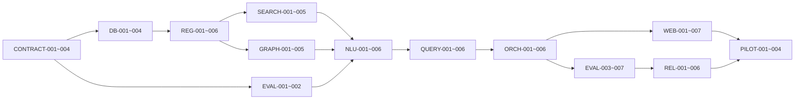

# 智能问数系统 Codex TODO 实施计划

> 配套架构：[ASK_DATA_TECHNICAL_DESIGN.md](./ASK_DATA_TECHNICAL_DESIGN.md)
> 适用仓库：`intelligent_report_generation_system`
> 目标：把技术架构拆成可由 Codex 逐项实现、验证和交付的原子任务。
> 本计划不代表系统已经达到 95%；只有密封端到端黄金集通过发布门禁后才能作出该声明。

## 1. Codex 执行原则

### 1.1 每个 Codex 任务的边界

每次只领取一个 TODO ID。一个任务应满足：

- 有明确输入、输出、依赖和停止条件；
- 默认只修改列出的文件范围；
- 能在一次独立 Codex 工作周期内实现和验证；
- 不顺手实现后续任务；
- 不把临时 fixture、猜测的业务指标或未审批词典当作生产事实；
- 不擅自 stage、commit、push 或创建 PR，除非用户另行要求；
- 发现当前工作区已有无关修改时保留并绕开。

### 1.2 每个任务开始前

Codex 必须执行：

```sh
pwd
find .. -name AGENTS.md -print
git status --short
```

然后阅读：

1. 本 TODO 的任务条目；
2. [ASK_DATA_TECHNICAL_DESIGN.md](./ASK_DATA_TECHNICAL_DESIGN.md) 对应章节；
3. 任务依赖产生的接口、迁移和测试；
4. 即将修改的现有模块及其相邻测试。

### 1.3 全局不可违反的约束

1. 不回滚或恢复 `000195_remove_decommissioned_features` 删除的旧运行时。
2. 新问数控制面使用 `askdata` schema；不要重新创建退役的 `platform.semantic_*` 表。
3. LLM 是全流程认知中枢，但不能直接提交 SQL、nGQL、数据库凭据或绕过权限/发布门禁。
4. 指标、维度、成员、关系和计划只能引用已发布稳定 ID 与版本。
5. SQL 必须由 Semantic IR 经 Go 确定性编译器生成并参数化。
6. 问数首期只查询已发布、ACTIVE 的 DWS/ADS 稳定视图。
7. 任何检索都先按 tenant、domain、权限、release 和状态裁剪。
8. NebulaGraph 是可重建投影，PostgreSQL 注册表是语义事实源。
9. 不保存模型隐藏思维链；只保存结构化决策、动作、证据 ID 和 hash。
10. 用户反馈只能形成待审核候选，不能自动修改生产语义。

### 1.4 分支和任务命名建议

如果用户要求为任务创建分支，使用：

```text
codex/askdata-<todo-id>-<short-name>
```

例如：

```text
codex/askdata-db-001-schema
codex/askdata-search-003-hybrid-retriever
```

## 2. 状态、优先级和工作流

### 2.1 状态

- `[ ]`：未开始
- `[x]`：完成且通过任务验收
- `BLOCKED`：缺少人工业务输入、外部服务或上游任务；不能用猜测绕过

### 2.2 优先级

- `P0`：关键路径或安全/正确性边界
- `P1`：首期上线必需
- `P2`：规模化、体验或运维增强

### 2.3 工作流 Lane

| Lane | 范围 | 共享热点文件 |
|---|---|---|
| DB | 迁移、RLS、角色、版本和持久化合同 | `migrations/*`、`scripts/migrate.sh`、`scripts/verify-database.sh` |
| REGISTRY | Go 语义对象、Repository、发布和资产导入 | `internal/askdata/registry` |
| AI | LLM 认知协议、结构化动作和模型适配 | `internal/ai`、`internal/askdata/cognition` |
| SEARCH | 词典、pgvector、混合召回、重排 | `internal/askdata/search`、`internal/askdata/dimension` |
| GRAPH | NebulaGraph、GraphPlan 和投影 | `compose.yaml`、`internal/askdata/graph` |
| QUERY | Semantic IR、编译、计划和结果验证 | `internal/askdata/ir`、`compiler`、`validator` |
| ORCH | Tool Host、状态机、预算、API/SSE | `internal/askdata/orchestrator`、`toolhost`、`http` |
| WEB | React 问数工作台与语义管理 | `web/src` |
| EVAL | 黄金集、评测、Wilson 门禁和反馈归因 | `internal/askdata/evaluation`、`feedback` |
| OPS | 配置、可观测性、部署和运行手册 | `internal/config`、`compose.yaml`、`scripts` |

### 2.4 并行编辑规则

以下内容同一时间只允许一个 Codex 任务持有：

- 迁移编号和 `migrations/*.sql`；
- `cmd/api/main.go`；
- `cmd/worker/main.go`；
- `internal/ai/model.go`、`internal/ai/service.go`；
- `web/src/app/App.tsx`；
- `compose.yaml`；
- `scripts/verify-database.sh`。

其他 Lane 只有在上游合同已经合并后才能并行。不要让多个 Codex 任务各自发明相同 JSON 合同。

## 3. 验证命令目录

任务条目使用以下验证代号。

### V-GO-ASKDATA

```sh
gofmt -w internal/askdata
go test ./internal/askdata/...
```

### V-GO-ALL

```sh
test "$(gofmt -l cmd internal | wc -l | tr -d ' ')" = "0"
go test ./...
```

### V-WEB

```sh
npm --prefix web run lint
npm --prefix web run build
```

### V-DB

要求本地依赖服务已启动：

```sh
./scripts/migrate.sh
./scripts/verify-database.sh
./scripts/verify-warehouse.sh
```

### V-COMPOSE

```sh
./scripts/check-compose.sh
docker compose config >/dev/null
```

### V-BASELINE

```sh
./scripts/ci-check.sh
go test ./...
npm --prefix web run lint
npm --prefix web run build
```

### V-FULL-INTEGRATION

```sh
./scripts/ci-check.sh
go test ./...
npm --prefix web run lint
npm --prefix web run build
./scripts/check-compose.sh
./scripts/migrate.sh
./scripts/verify-database.sh
./scripts/verify-warehouse.sh
```

## 4. 人工输入门禁

这些任务不能由 Codex 自行编造业务答案。Codex 可以创建模板、校验器和导入工具，但必须等待业务负责人提供内容。

| ID | 人工 TODO | 需要的输入 | 阻塞任务 |
|---|---|---|---|
| HUMAN-001 | 选定首个业务域 | domain ID、Owner、用户范围、首期问题边界 | REG-005、EVAL-004、PILOT-* |
| HUMAN-002 | 提供核心指标清单 | 20～50 个指标定义、公式、单位、粒度、默认过滤、Owner | REG-005、NLU-004、EVAL-004 |
| HUMAN-003 | 提供维度治理清单 | 20～40 个维度、层级、敏感性、成员规模、索引策略 | DIM-*、SEARCH-005、EVAL-004 |
| HUMAN-004 | 提供真实问数样本 | 500 开发、200 验证、2,000+ 密封计划；需脱敏和标准答案 | EVAL-*、PILOT-* |
| HUMAN-005 | 确认 NebulaGraph 生产约束 | 部署环境、容量、隔离级别、备份和版本兼容 POC 结论 | GRAPH-002 生产化边界、OPS-004 |
| HUMAN-006 | 批准生产语义发布 | 双人评审、黄金集结果、安全结果 | REL-006、PILOT-003 |

## 5. 关键路径



可提前并行：

- `GRAPH-001` 版本兼容 POC 可与 DB 基础建设并行；
- `WEB-001` 只做静态路由和 mock UI，可在 API 合同冻结后并行；
- `EVAL-001` 的纯结果规范化库可在 Semantic IR 合同冻结后并行；
- 安全测试夹具可在 Tool/IR 合同冻结后并行。

## 6. Wave 0：合同、基线与任务脚手架

### [x] CONTRACT-001 — 冻结 askdata 包边界与依赖方向

- 优先级：P0
- 依赖：无
- 目标：创建包级设计合同，规定 `registry -> search/graph -> binding -> ir -> compiler -> orchestrator` 的单向依赖，禁止循环依赖。
- 文件范围：`internal/askdata/doc.go`、`internal/askdata/contracts.go`、本计划状态。
- 完成标准：核心 ID、VersionRef、ReleaseRef、EvidenceRef、PolicyScope、ConfidenceEvidence 有最小 Go 类型和 JSON tag；不包含数据库实现。
- 测试：序列化 round-trip、非法空 ID、非法 hash。
- 验证：V-GO-ASKDATA。

### [x] CONTRACT-002 — QuestionUnderstanding JSON Schema

- 优先级：P0
- 依赖：CONTRACT-001
- 目标：冻结 mention span、domain hypothesis、metric/dimension/value mention、time、comparison、ordering、unresolved span 合同。
- 文件范围：`api/schemas/question-understanding-v1.schema.json`、`internal/askdata/understanding/model.go`、测试。
- 完成标准：Go 类型与 JSON Schema 一致；未知字段拒绝；字符位置、数组上限和文本长度有界。
- 安全要求：不允许模型输出表名、列名、SQL 或任意对象定义。
- 验证：V-GO-ASKDATA。

### [x] CONTRACT-003 — Semantic IR JSON Schema

- 优先级：P0
- 依赖：CONTRACT-001
- 目标：冻结稳定版本 ID、metrics、groupBy、filters/member IDs、time range、comparison、sort、limit 和 release hash。
- 文件范围：`api/schemas/semantic-ir-v1.schema.json`、`internal/askdata/ir/model.go`、`normalize.go`、测试。
- 完成标准：相同语义输入产生稳定规范 JSON/hash；不接受物理表名、原始 SQL 和未绑定字符串值。
- 验证：V-GO-ASKDATA。

### [x] CONTRACT-004 — Cognition Action 与 Tool 合同

- 优先级：P0
- 依赖：CONTRACT-002、CONTRACT-003
- 目标：冻结 `CALL_TOOL`、`PROPOSE_BINDING`、`PROPOSE_PLAN`、`ANALYZE_ANOMALY`、`VERIFY_RESULT`、`FINALIZE`、`CLARIFY`、`BLOCK` 合同和工具参数/结果 envelope。
- 文件范围：`api/schemas/cognition-action-v1.schema.json`、`internal/askdata/cognition/model.go`、`internal/askdata/toolhost/model.go`。
- 完成标准：每个动作只有合法阶段可用；Tool args 按具体工具二次 Schema 校验；未知工具失败关闭。
- 验证：V-GO-ASKDATA。

### [x] BASE-001 — 建立 askdata 测试 fixture 包

- 优先级：P0
- 依赖：CONTRACT-001～004
- 目标：提供完全合成的租户、用户、DWS 模型、指标、维度、成员、关系、问题和结果 fixture。
- 文件范围：`internal/askdata/testfixture`。
- 完成标准：fixture 明确标注 synthetic；包含同名指标、同名成员、越权、Join fanout、空结果和过期成员难例。
- 禁止：使用真实凭据或未脱敏业务行。
- 验证：V-GO-ASKDATA。

### [x] BASE-002 — 只读数仓资产盘点命令

- 优先级：P1
- 依赖：CONTRACT-001
- 目标：列出当前已发布 DWS/ADS 数据集、版本、物化、字段、粒度、时间字段和 schema hash，不写库。
- 文件范围：`cmd/askdata-inventory/main.go`、`internal/askdata/registry/inventory.go`。
- 完成标准：默认输出脱敏 JSON；拒绝 ODS/DIM/DWD；没有仓库写权限。
- 验证：`go test ./internal/askdata/registry/...`、`go test ./cmd/askdata-inventory/...`。

### [x] OPS-001 — 空库启动与历史映射对账修复

- 优先级：P0
- 依赖：BASE-001、DB-001～004。
- 目标：清理退役语义运行时遗留的 tenant trigger，并保证映射数据集回退到历史
  schema 时仍生成稳定且不冲突的发布幂等键。
- 文件范围：`000221_*`、`internal/dataset/mapped_dataset.go`、数据库/数仓验证脚本。
- 完成标准：空库 migration + seed 成功；重复 schema transition 不撞历史幂等键；
  API、Worker 与 Web 全部 healthy。
- 验证：V-GO-ALL、V-DB、`make seed-dev`、Docker Compose HTTP smoke test。

### Wave 0 退出门禁

- CONTRACT-001～004 全部完成；
- synthetic fixture 可运行；
- 空库可迁移、seed 并启动全部本地服务；
- 任何后续任务不得再各自定义 QuestionUnderstanding、Semantic IR 或 Tool envelope。

## 7. Wave 1：数据库与语义注册表

### 7.1 迁移编号预留

迁移只由 DB Lane 顺序实现；其他任务不得创建同编号文件。

| 迁移 | 归属 | 内容 |
|---|---|---|
| `000213_askdata_schema_and_roles` | DB-001 | schema、角色权限、RLS 辅助函数、审计基础 |
| `000214_askdata_semantic_registry` | DB-002 | domain/model/measure/metric/dimension/relationship/quality |
| `000215_askdata_members_and_search` | DB-003 | members、aliases、search documents、embedding outbox |
| `000216_askdata_release_projection` | DB-004 | release、objects、projection watermarks、activation |
| `000217_askdata_question_runtime` | DB-005 | question runs/events/artifacts/tool calls |
| `000218_askdata_evaluation_feedback` | DB-006 | evaluation sets/cases/runs、feedback |
| `000219_askdata_release_evaluation_gate` | DB-007 | Wilson、安全、覆盖率和 release 激活门禁函数 |
| `000220_askdata_release_approvals` | DB-008 | 双人审批、职责分离和审批审计 |
| `000221_retired_semantic_tenant_trigger_cleanup` | OPS-001 | 清理 `000195` 遗留的租户初始化触发器，恢复空库 seed 能力 |
| `000222_askdata_dimension_profile_runtime` | DIM-002 | 有界扫描任务、画像 generation 和成员观测证据 |
| `000223_askdata_sensitive_member_policy` | SEC-003 | 敏感成员敏感度下限、label-free release pin 与数据库内 EXACT_ONLY 查找 |

每个迁移必须同时有 `.up.sql` 和 `.down.sql`。Down 只用于开发回退，不得在生产通过回滚 `000195` 恢复旧表。

### [x] DB-001 — `askdata` schema、权限与 RLS 基础

- 优先级：P0
- 依赖：CONTRACT-001
- 文件范围：`migrations/000213_askdata_schema_and_roles.up.sql`、`.down.sql`、`scripts/verify-database.sh`。
- 实现：创建 schema；显式授权 `report_app`/`report_worker`；默认权限失败关闭；提供复用当前 tenant context 的 RLS helper；PUBLIC 无权限。
- 特别注意：当前 `scripts/migrate.sh` 只对 `platform` 做通用授权，`askdata` 权限必须在迁移内完整声明。
- 完成标准：app 无法写 worker-only 表；worker 无法绕过 RLS；connection-test role 无 askdata 权限。
- 验证：V-DB。

### [x] DB-002 — 核心语义注册表

- 优先级：P0
- 依赖：DB-001、CONTRACT-003
- 文件范围：`000214_*`、`scripts/verify-database.sh`。
- 实现：domains、entities、semantic_models、measures、metrics、metric_versions、dimensions、hierarchies、relationships、quality_rules、business_terms。
- 完成标准：版本不可原地修改；所有引用带 tenant 复合外键；AST JSON 有大小/类型/安全检查；发布对象只能引用当前可用 DWS/ADS dataset/materialization。
- 验证：V-DB。

### [x] DB-003 — 维度成员与检索表

- 优先级：P0
- 依赖：DB-002
- 文件范围：`000215_*`、`scripts/verify-database.sh`。
- 实现：dimension_members、member_aliases、search_documents、embedding_outbox；`halfvec(2560)` 和 HNSW；tenant/domain/object type B-tree/GIN 索引。
- 完成标准：FULL/EXACT_ONLY/ON_DEMAND/NONE 约束；敏感/高基数对象不能进入 embedding outbox；状态和 lease 形状有数据库约束。
- 验证：V-DB。

### [ ] DB-004 — Semantic Release 与投影水位

- 优先级：P0
- 依赖：DB-002、DB-003
- 文件范围：`000216_*`、`scripts/verify-database.sh`。
- 实现：semantic_releases、release_objects、release_projections、release_state、events、GraphPlan cache。
- 完成标准：一个租户仅一个 ACTIVE；四个投影 hash 一致才能 READY/ACTIVE；激活原子更新；旧运行可继续引用旧 release。
- 验证：V-DB。

> 2026-08-05 进度：release manifest、四投影 hash/lease、READY 收敛、
> `release_state` 与 GraphPlan cache 已完成并通过集成测试；ACTIVE 激活入口按
> 本方案的安全门禁保持关闭，待 DB-007 评测门禁与 DB-008 双人审批落地后再勾选。

### [x] REG-001 — 语义对象领域模型与 Validator

- 优先级：P0
- 依赖：CONTRACT-001、DB-002
- 文件范围：`internal/askdata/registry/model.go`、`validation.go`、测试。
- 完成标准：度量可加性、指标依赖、维度类型、成员策略、关系基数/fanout、质量状态均有确定性校验；错误包含稳定 code 和字段 path。
- 验证：V-GO-ASKDATA。

### [x] REG-002 — PostgreSQL Repository

- 优先级：P0
- 依赖：REG-001、DB-004
- 文件范围：`internal/askdata/registry/postgres_store.go`、测试。
- 完成标准：所有读写在显式 tenant transaction 内；并发更新使用 record version；列表稳定分页；不返回未授权对象。
- 验证：V-GO-ASKDATA + V-DB integration test。

### [x] REG-003 — 规范 content hash 与发布包构建

- 优先级：P0
- 依赖：REG-002
- 文件范围：`internal/askdata/registry/release.go`、`canonical.go`、测试。
- 完成标准：对象排序、JSON 规范化和 hash 稳定；release 固定精确对象版本；重复请求幂等；变更一个对象只改变预期 hash。
- 验证：V-GO-ASKDATA。

### [x] REG-004 — 已有 DWS/ADS 导入器

- 优先级：P0
- 依赖：REG-002、BASE-002
- 文件范围：`internal/askdata/registry/importer.go`、`dataset_catalog.go`、测试。
- 完成标准：只读取 current published dataset version 和 ACTIVE materialization；复用 Dataset DSL 稳定 field ID；生成 DRAFT 候选，不自动认证。
- 验证：V-GO-ASKDATA、合成 DWS integration fixture。

### [ ] REG-005 — LLM 语义资产建议与评审

- 优先级：P1
- 依赖：REG-004、AI-001、HUMAN-001～003
- 文件范围：`internal/askdata/registry/cognition.go`、schemas、测试。
- 完成标准：LLM 可建议指标/维度/别名/关系和冲突；所有输出经本地 Validator；建议保留来源证据；不能自行 PUBLISHED。
- 验证：模型契约测试 + V-GO-ASKDATA。

### [ ] REG-006 — 语义管理 API

- 优先级：P1
- 依赖：REG-002、REG-003
- 文件范围：`internal/askdata/http/admin.go`、`cmd/api/main.go`、HTTP 测试。
- 完成标准：CRUD 仅操作 DRAFT；发布/激活使用独立 endpoint、幂等键和权限检查；错误使用现有 API error 格式。
- 验证：V-GO-ALL。

### Wave 1 退出门禁

- 首批 DWS/ADS 可导入为 DRAFT；
- 核心语义对象、RLS 和不可变版本测试通过；
- release hash 可稳定重放；
- 未审批资产无法进入 ACTIVE release。

## 8. Wave 2A：LLM 认知协议

### [x] AI-001 — 增加 Semantic Question Purpose

- 优先级：P0
- 依赖：CONTRACT-004
- 文件范围：`internal/ai/service.go`、`postgres_store.go`、相关策略和测试；不得在非 DB Lane 中新增迁移。
- 完成标准：新增 Purpose 纳入租户 AI policy、配额、审计和模型选择；默认未授权租户不可调用。
- 验证：`go test ./internal/ai/...`。

### [x] AI-002 — Provider-neutral Cognition Executor

- 优先级：P0
- 依赖：AI-001、CONTRACT-004
- 文件范围：`internal/askdata/cognition/executor.go`、`internal/ai` 最小适配、测试。
- 完成标准：每轮严格 JSON action；assistant/tool 消息可回传；reasoning content 不落库；模型返回空动作、未知动作或重复无进展时失败关闭。
- 验证：V-GO-ASKDATA、DeepSeek/GLM wire contract fixture。

### [x] AI-003 — 分阶段认知 Prompt/Schema

- 优先级：P0
- 依赖：AI-002
- 文件范围：`internal/askdata/cognition/prompts.go`、`schemas.go`、测试。
- 阶段：ASSET_REVIEW、UNDERSTANDING、CANDIDATE_JUDGMENT、DISAMBIGUATION、PLAN_SELECTION、ANOMALY_ANALYSIS、RESULT_VERIFICATION、FEEDBACK_ATTRIBUTION、RELEASE_REVIEW。
- 完成标准：每个阶段只见必要事实；Prompt 中明确数据与指令边界；输出带 evidence refs；不允许隐藏 SQL/nGQL 字段。
- 验证：V-GO-ASKDATA。

### [x] AI-004 — 模型契约与降级测试

- 优先级：P1
- 依赖：AI-003
- 文件范围：`internal/askdata/cognition/provider_contract_test.go`、测试 fixture。
- 完成标准：覆盖 json_schema、json_object、thinking 模式、length、refusal、tool no-progress、模型切换；不依赖真实密钥的 CI fixture。
- 验证：V-GO-ALL。

## 9. Wave 2B：维度画像与混合检索

### [x] DIM-001 — Dimension Profile 合同

- 优先级：P0
- 依赖：REG-001、DB-003
- 文件范围：`internal/askdata/dimension/model.go`、`policy.go`、测试。
- 完成标准：基数、NULL、保留默认值、变化率、敏感性、样本预算、FULL/EXACT_ONLY/ON_DEMAND/NONE 决策可审计。
- 验证：V-GO-ASKDATA。

### [x] DIM-002 — 有界成员扫描 Worker

- 优先级：P0
- 依赖：DIM-001、REG-004
- 文件范围：`internal/askdata/dimension/worker.go`、`postgres_store.go`、`cmd/worker/main.go`。
- 完成标准：只读 DWS/ADS；statement timeout、最大成员数、租约、重试、refresh generation；不扫描敏感禁止维度。
- 验证：V-GO-ALL + warehouse integration test。

> 2026-08-05 完成：新增独立、强制 RLS 的 profile job/profile/member observation
> generation 表；Worker 只对当前 PUBLISHED + ACTIVE DWS/ADS 的精确 snapshot 发放租约，
> 使用只读 repeatable-read Warehouse 事务、statement timeout、行/成员/字节上限和安全标识符；
> RESTRICTED/NONE 维度直接 SKIPPED。失败指数退避，配置或源版本变化后旧 generation
> 标记 STALE；画像及策略决策均以内容 hash 追加写入，不会自动创建认证成员。

### [x] DIM-003 — 成员规范化、别名候选与 LLM 异常判断

- 优先级：P1
- 依赖：DIM-002、AI-003
- 文件范围：`internal/askdata/dimension/normalize.go`、`cognition.go`、测试。
- 完成标准：canonical value 与 alias 分离；LLM 可提出聚类/层级异常但不能自动合并高风险成员；UNKNOWN/哨兵值被排除。
- 验证：V-GO-ASKDATA。

> 2026-08-05 完成：canonical/alias 分离、`dimension_version_id + normalized_value`
> 成员键和保留/哨兵值排除已接入 DIM-002 的真实 generation；画像输出现在生成最多
> 64 个稳定成员证据 ID 的 `DIMENSION_PROFILE` 事实，绑定 profile/source hash、扫描完整性、
> 保留值 catalog version/hash/count 和被省略成员数。确定性等价只形成低风险别名候选；
> LLM 聚类、别名、层级和哨兵建议必须回引同一 generation 的成员 ID 与 evidence hash，
> 不能发明成员或提交未观测别名。CONFIDENTIAL/RESTRICTED 在 reviewer 调用前失败关闭，
> LLM 建议、扫描不完整结果及中高风险候选均不能自动应用或升级为认证成员。

### [x] SEARCH-001 — 分类检索文档构建器

- 优先级：P0
- 依赖：REG-001、DIM-001
- 文件范围：`internal/askdata/search/document.go`、测试。
- 完成标准：METRIC、DIMENSION、MEMBER、TERM、CERTIFIED_EXAMPLE 使用不同模板和 document version；输入规范化/hash 稳定；不包含凭据、SQL、敏感成员或业务行。
- 验证：V-GO-ASKDATA。

### [x] SEARCH-002 — Embedding Outbox Worker

- 优先级：P0
- 依赖：SEARCH-001、DB-003
- 文件范围：`internal/askdata/search/worker.go`、`postgres_store.go`、`cmd/worker/main.go`。
- 完成标准：复用 `internal/embedding`；batch、lease、input hash + model 幂等；旧 lease 结果不能覆盖新文档；Provider 失败不破坏语义发布草稿。
- 验证：V-GO-ALL + embedding fixture。

### [x] SEARCH-003 — Exact/Lexical/Vector Hybrid Retriever

- 优先级：P0
- 依赖：SEARCH-002、REG-002
- 文件范围：`internal/askdata/search/retriever.go`、`rank.go`、`postgres_store.go`、测试。
- 完成标准：权限/tenant/domain/release/status 在 SQL 阶段过滤；分对象类型 Top K；RRF；embedding 降级到 exact+lexical；返回 evidence 和 degraded reason。
- 验证：V-GO-ASKDATA、跨租户负向测试。

### [x] SEARCH-004 — LLM 候选判断与重排

- 优先级：P0
- 依赖：SEARCH-003、AI-003
- 文件范围：`internal/askdata/search/reranker.go`、测试。
- 完成标准：LLM 比较受约束候选的定义、反例和图兼容证据；只能选择候选稳定 ID；输出不得覆盖 deterministic block。
- 验证：V-GO-ASKDATA。

> 2026-08-05 完成：新增规范化、有界且绑定 `PolicyScope`/release 的
> `CANDIDATE_SET` 认知事实，最多携带 30 个经 SQL/RLS 后的候选及定义、反例、检索证据、
> 图兼容结论和确定性 gate 证据。候选按 RRF score、对象类型和稳定版本 ID 规范排序；
> CONFIDENTIAL/RESTRICTED、凭证形态和物理查询文本在 reviewer 调用前失败关闭。
> 模型输出只能引用集合内可选稳定 ID 和该候选自己的 EvidenceRef；发明 ID、跨候选证据、
> 错误 candidate-set hash、选择 graph/policy block 候选均被本地校验拒绝。所有候选均被
> 确定性拦截时不调用模型，直接生成带 hash 的 `DETERMINISTIC_BLOCK` no-match 结果。

### [ ] SEARCH-005 — Recall@K 评测器

- 优先级：P0
- 依赖：SEARCH-003、HUMAN-002～004
- 文件范围：`internal/askdata/evaluation/retrieval.go`、`cmd/askdata-eval/main.go`。
- 完成标准：分别计算 metric/dimension/member recall；可切换 ANN/exact 对照；按 domain/复杂度输出失败样本 ID，不输出敏感问句。
- 发布线：metric/dimension recall@10 >=99%，member recall@20 >=99%。
- 验证：V-GO-ALL。

## 10. Wave 2C：NebulaGraph

### [x] GRAPH-001 — 服务端与 Go Client 兼容 POC

- 优先级：P0
- 依赖：CONTRACT-001
- 文件范围：`internal/askdata/graph/poc_test.go`、临时本地配置；不先改生产 Compose。
- 完成标准：验证连接、Session Pool、TLS 选项、Space、参数转义、超时、并发、失败恢复；形成锁定版本决定。
- 停止条件：服务端/客户端不兼容时先记录 blocker，禁止依赖 master/nightly 强行继续。
- 验证：定向 integration test。

> 2026-08-05 完成：锁定 NebulaGraph `v3.8.0` metad/storaged/graphd 与官方
> `github.com/vesoft-inc/nebula-go/v3 v3.8.0`，未使用 master/nightly；`nebula-go/v5`
> 是面向新 gRPC Nebula Service 的不同客户端，不能替换 3.x graphd 的 fbthrift 客户端。
> 新增完全隔离、tmpfs 的临时 POC Compose 和一键验证脚本，不修改生产 `compose.yaml`。
> ARM64 本机真实验证三类服务版本、双 graphd 连接与 Space-bound Session Pool、TLS 1.2+
> 握手、恶意形态字符串参数原样往返、600ms socket timeout、8 路并发和缺失 Space
> 失败关闭；主动停止首个 graphd 后，同一 Session Pool 可经第二个 graphd 恢复查询并重启
> 故障节点。另确认 storaged 必须经 graphd `ADD HOSTS` 注册后才 ready，POC init job 已按
> 此真实启动顺序实现；正式 Compose、持久卷和读写账号随后已由 `GRAPH-002` 落地。

### [x] GRAPH-002 — Compose 服务与初始化

- 优先级：P0
- 依赖：GRAPH-001、HUMAN-005 的开发环境部分
- 文件范围：`compose.yaml`、`.env.example`、`scripts/check-compose.sh`、`deployments/nebula/*`。
- 完成标准：metad/storaged/graphd 健康检查、持久卷、init job、读写账号分离；API 只读、Worker 投影写；无默认生产密码。
- 验证：V-COMPOSE、图健康 integration test。

> 2026-08-06 完成：用户确认 `HUMAN-005` 的开发环境部分采用 NebulaGraph/nebula-go
> `v3.8.0`、单副本持久化、每环境共享 Space、tenant/release typed 隔离、API `GUEST`、
> Worker `USER` 和环境变量开发凭据；未据此推断生产容量、TLS、备份或多副本。
> 根 Compose 已加入 metad/storaged/graphd、幂等 init/verify 和仅在 init 成功后启动的
> loopback proxy。集群控制网与客户端网分离，API/Worker 无法直连 Meta/Storage，graphd
> 不发布宿主端口；本地代理仅绑定 `127.0.0.1`。首次启动立即轮换默认 root，再注册 Storage、
> 创建并精确核验单 partition/replica 的 `FIXED_STRING(256)` Space、当前 Adapter 冻结的
> 4 Tag/4 Edge、API/Worker 账号与唯一 Space 角色；Schema/Space 漂移、额外 Space 授权、
> 错误密码、默认 root 和 production `local_*` 均失败关闭。正式验收使用同一 nonce 派生的唯一
> Compose project/Space、随机端口和独立卷，专用 override 删除所有应用 service `env_file`，
> 不读取用户 `.env`；Go 测试在写入前反查该 project 的 proxy 端口和 Compose 标签。验收覆盖
> 4 类点、4 类边的真实 tenant/release 排除、GraphPlan、读写权限、幂等与容器重建持久化，
> Resolve 报错不能作为隔离成功；退出仅清理该验收项目。CI 已加入独立 Graph Compose job。

### [x] GRAPH-003 — GraphPlan 合同和 Nebula Adapter

- 优先级：P0
- 依赖：GRAPH-001、REG-001
- 文件范围：`internal/askdata/graph/model.go`、`client.go`、`query_builder.go`、测试。
- 完成标准：只接受稳定 ID；服务端生成有界 nGQL；tenant VID 前缀和 release 属性隔离；返回模型、兼容维度、成员归属、Join 路径和风险，不返回任意 nGQL。
- 验证：V-GO-ASKDATA、注入负向测试。

> 2026-08-05 完成：新增绑定 `PolicyScope`、单 domain、精确对象版本和严格候选/跳数/路径
> 上限的 typed `PlanRequest`，VID 按设计冻结为
> `tenant_id:object_type:stable_object_id:version`，release 继续由所有 Tag/Edge 的
> `release_hash` 强制隔离。Adapter 只生成 `MODELED_BY`、`HAS_DIMENSION`、
> `HAS_MEMBER` 和 `JOINS_TO*1..N` 四类固定、有界查询，所有点边均校验
> tenant/domain/release，Join 只接受已认证边和请求中已授权的中间模型。`GraphPlan`
> 返回稳定版本 ID、模型/维度/成员归属、方向、Join 类型、基数、fanout 风险、稳定 hash
> 与 EvidenceRef，不暴露 nGQL。单元测试覆盖注入形态 ID、VID 冲突、跨 scope/release、
> 发明对象、越界路径、未认证关系和 hash/risk 篡改；隔离的真实 NebulaGraph `v3.8.0`
> POC 已写入合成图并通过公开 Adapter 解析验证。

### [ ] GRAPH-004 — Release Projector Worker

- 优先级：P0
- 依赖：GRAPH-002、GRAPH-003、DB-004
- 文件范围：`internal/askdata/graph/projector.go`、`postgres_store.go`、`cmd/worker/main.go`。
- 完成标准：按 release content hash 幂等投影；lease/heartbeat/retry；对象计数和 hash 证明；失败不激活 release。
- 验证：V-GO-ALL、删除 Space 后可完全重建。

### [ ] GRAPH-005 — Resolver、认证缓存与 PostgreSQL 降级

- 优先级：P0
- 依赖：GRAPH-003、GRAPH-004
- 文件范围：`internal/askdata/graph/resolver.go`、`fallback.go`、测试。
- 完成标准：正常走 Nebula；故障时只重放同 tenant/release/hash 的认证 GraphPlan，或用 PostgreSQL 小候选递归验证；绝不跳过关系约束。
- 验证：V-GO-ASKDATA、Nebula 故障注入测试。

### Wave 2 退出门禁

- 搜索文档、向量和图均可由 ACTIVE-ready release 重建；
- 检索不会跨租户/跨域/跨 release；
- 图故障不会转成不受约束执行；
- Recall 评测框架可运行，未达到阈值时不得进入生产绑定。

## 11. Wave 3A：问句理解、候选判断与消歧

### [x] NLU-001 — 确定性规范化与 span 保持

- 优先级：P0
- 依赖：CONTRACT-002
- 文件范围：`internal/askdata/understanding/normalize.go`、测试。
- 完成标准：全半角、大小写、标点、数字单位、无害语气词规范化；原字符 offset 可回映；不改变业务实体文本。
- 验证：V-GO-ASKDATA。

> 2026-08-05 完成：新增版本化 `NormalizedQuestion` 和双向 Unicode rune span 映射。
> 规范化使用 NFKC + Unicode case fold，统一中英文标点、空白和安全数字单位间距；只剥离
> 句首/句尾明确的礼貌包装，不换算数值、不删除行政区后缀，也不改写核心业务实体。
> NFKC 组合/展开、大小写展开、标点展开和单位空格删除均可保守回映到精确原文范围；
> 被剥离的语气词返回稳定 removed-span 错误。合同会按原文重新计算以拒绝篡改，并在处理前
> 拒绝非法 UTF-8、超长问题、控制字符及双向/零宽不可见字符。单元、race 与 fuzz 覆盖
> 全半角英文、中文、emoji、组合音标、`ß` 展开、实体标点、数字单位和 offset 往返。

### [x] NLU-002 — 时间、比较和查询语法解析

- 优先级：P0
- 依赖：NLU-001
- 文件范围：`internal/askdata/understanding/time.go`、`grammar.go`、测试。
- 完成标准：今年/去年/上月/自然周/财年、同比/环比、Top N、排序、按/每个；显式 Asia/Shanghai；歧义日期产生 unresolved 而非猜测。
- 验证：V-GO-ASKDATA。

> 2026-08-05 完成：新增可重放的 `question-rules-v1` 确定性解析合同，输入固定参考时间和
> 可选财年起始月，全部日历运算显式使用 `Asia/Shanghai`，日期范围统一为左闭右开。
> 已覆盖今天/昨日、本周/上周、本月/上月、今年/去年、本财年/上财年、显式日/月/年和
> 同粒度范围；自然周以周一开始，财年配置缺失、非法/歧义日期、多时间表达均返回稳定
> unresolved，不读取系统本地时区也不猜测。规则同时提取同比/环比/较上期、Top/Bottom N、
> 升降序及“按/每个”分组标记，排序/比较/排名冲突交给后续认知阶段裁决。解析结果绑定
> 原问句 hash、规范化版本、参考日、时区和财年配置，`Validate` 通过确定性重放拒绝篡改；
> 所有事实和 unresolved 均精确回映原文 Unicode rune span。单元、race、vet、全仓测试及
> fuzz 已覆盖全半角、财年/周/月边界、范围、冲突、误命中和 span 不变量。

### [x] NLU-003 — 会话上下文合并

- 优先级：P0
- 依赖：CONTRACT-002、NLU-001
- 文件范围：`internal/askdata/understanding/context.go`、测试。
- 完成标准：支持“那按地区呢”“换成去年”；本轮覆盖、继承和清除规则确定；跨权限/跨 release 不继承。
- 验证：V-GO-ASKDATA。

> 2026-08-05 完成：新增 `conversation-snapshot-v1` 与 `conversation-merge-v1` 合同；只有
> 已通过 `QuestionUnderstanding.Validate` 且没有 unresolved 的最终理解可生成继承快照。
> AUTO 模式确定性识别“那按地区呢”“换成去年”、纯规则追问和清除指令，也允许可信编排层
> 显式指定 FOLLOW_UP/INDEPENDENT；完整新问题和全量清除不会读取旧快照。上下文按 domain、
> metric、grouping、filter、time、comparison、ordering、limit 槽位执行继承/覆盖/清除，
> 固定 `CURRENT_TURN_WINS`，上一轮 mention 仍绑定上一轮原问句，不伪造本轮 span。缺失上一轮
> 的追问产生 `CONTEXT_PREVIOUS_TURN_REQUIRED`；tenant/actor/domain/role/policy/release 任一变化
> 或跨 conversation 时均不读取、不暴露、不继承旧内容。快照与合并结果均有可复算内容 hash，
> 合并结果可重放并生成 `CONVERSATION` EvidenceRef。单元、race 与 fuzz 覆盖继承、覆盖、
> 清除、歧义时间、防篡改、原文 span 和权限/release 隔离。

### [x] NLU-004 — LLM 完整理解与取证计划

- 优先级：P0
- 依赖：AI-003、NLU-002、NLU-003、SEARCH-003
- 文件范围：`internal/askdata/understanding/service.go`、测试。
- 完成标准：LLM 读取规则证据和残余文本，输出 mentions、roles、hypotheses、conflicts、evidence requests；不得输出最终 SQL/物理对象。
- 验证：V-GO-ASKDATA、合成难例。

> 2026-08-05 完成：新增独立的 `question-understanding-review-v1` 候选合同和
> `question-understanding-result-v1` 可重放结果，未扩展已冻结的 8 类 Cognition Action。
> 服务将已验证的 conversation、exact matches + 未消费 residual spans、deterministic
> rule parse 和最小 policy scope 分成 AI-003 允许的 4 类 Prompt Fact；模型只能引用该次
> 输入的 EvidenceRef。当前轮与继承 mention 保持各自原问句/rune span，并分别生成
> METRIC/DIMENSION/MEMBER 等受限取证需求。授权域、规则时间/比较/TopN/排序/分组、规则与
> 上下文冲突、所有 unresolved 的取证覆盖均由本地权威校验，模型漏项、改写、越权域、
> 伪造/跨输入证据、物理查询文本或缺失候选请求一律失败关闭。proposal/result 均有稳定
> SHA-256 防篡改；合成难例覆盖完整问句、残余文本、续问继承、同比/环比冲突和负向攻击。
> `HUMAN-002` 仍是正式业务指标词典、Prompt 调优与生产准确率评测的人工门禁，不影响本次
> 通用服务和合成合同落地。

### [ ] NLU-005 — Joint Binder 与 Bundle Beam Search

- 优先级：P0
- 依赖：NLU-004、SEARCH-004、GRAPH-005
- 文件范围：`internal/askdata/binding/binder.go`、`beam.go`、`score.go`、测试。
- 完成标准：联合选择 MetricVersion + Model + Group/Filter Dimensions + Members + Time + GraphPath；规则 block 优先于 LLM 选择；保留 Top bundle 和证据。
- 验证：V-GO-ASKDATA。

### [ ] NLU-006 — 校准置信度与定向澄清

- 优先级：P0
- 依赖：NLU-005、EVAL-002
- 文件范围：`internal/askdata/binding/calibrator.go`、`clarification.go`、测试。
- 完成标准：不使用 LLM 自报 confidence；使用验证集校准值、候选 margin、exact/vector/graph/rule 特征；低置信输出 2～3 个可解释选项。
- 验证：V-GO-ASKDATA、calibration fixture。

## 12. Wave 3B：Semantic IR、SQL 与结果验证

### [ ] QUERY-001 — Binding Bundle -> Semantic IR

- 优先级：P0
- 依赖：CONTRACT-003、NLU-005
- 文件范围：`internal/askdata/ir/builder.go`、`validation.go`、测试。
- 完成标准：IR 只引用稳定版本；成员必须属于过滤维度；维度必须与模型兼容；time/comparison/limit 有界；生成稳定 hash。
- 验证：V-GO-ASKDATA。

### [ ] QUERY-002 — Semantic Contract Resolver

- 优先级：P0
- 依赖：QUERY-001、REG-002、GRAPH-005
- 文件范围：`internal/askdata/compiler/resolver.go`、测试。
- 完成标准：从 pinned release 读取指标 AST、模型、字段、成员和唯一关系路径；运行中 release 变化不影响结果；拒绝 stale/unavailable materialization。
- 验证：V-GO-ASKDATA。

### [ ] QUERY-003 — IR -> Dataset Query DSL Adapter

- 优先级：P0
- 依赖：QUERY-002
- 文件范围：`internal/askdata/compiler/adapter.go`、`internal/querycompiler` 最小扩展、测试。
- 完成标准：生成受信 Dataset Document/Query DSL，复用稳定 field IDs、表达式 AST和参数定义；没有用户标识符或拼接 SQL。
- 验证：V-GO-ALL、golden compiled query tests。

### [ ] QUERY-004 — 计划 Validator 与 EXPLAIN

- 优先级：P0
- 依赖：QUERY-003
- 文件范围：`internal/askdata/validator/plan.go`、`explain.go`、测试。
- 完成标准：SELECT/CTE allowlist、物理视图白名单、函数白名单、read-only、statement/lock timeout、行数/成本、Join/fanout；不使用 EXPLAIN ANALYZE 预检。
- 验证：V-GO-ASKDATA、危险 SQL/高成本计划负向测试。

### [ ] QUERY-005 — 问数执行适配

- 优先级：P0
- 依赖：QUERY-004
- 文件范围：`internal/askdata/validator/executor.go`、`internal/queryruntime` 最小扩展、测试。
- 完成标准：独立 run type、plan/result hash、只读事务、最大行数、取消和超时；不在普通审计保存参数明文/结果行。
- 验证：V-GO-ALL + warehouse integration test。

### [ ] QUERY-006 — 规则 + LLM 结果核验与异常分析

- 优先级：P0
- 依赖：QUERY-005、AI-003
- 文件范围：`internal/askdata/validator/result.go`、`anomaly.go`、测试。
- 完成标准：规则检查 key 唯一性、重复、NULL、除零、时间覆盖、新鲜度、质量状态；LLM 判断结果是否回答原问题和异常原因；规则失败不能被 LLM 覆盖。
- 验证：V-GO-ASKDATA、空结果/fanout/异常趋势 fixture。

## 13. Wave 3C：Question Orchestrator 与 Tool Host

### [x] DB-005 — 问数运行、事件和 Tool 审计迁移

- 优先级：P0
- 依赖：DB-004、CONTRACT-004
- 文件范围：`000217_*`、`scripts/verify-database.sh`。
- 实现：question_runs、run_events、artifacts、tool_calls；状态约束、append-only audit、release pin、hash、预算、完成形状。
- 完成标准：不保存思维链、SQL/参数明文或结果行；同一 tool_call_id 幂等；终态不可回退。
- 验证：V-DB。

> 2026-08-06 完成：新增 `000217_askdata_question_runtime_audit`，在 `askdata` schema
> 建立 `question_runs`、`question_run_events`、`question_artifacts`、`tool_calls`。Run 从创建时
> 固定 actor/domain/policy scope/ACTIVE release 与显式 4/8/2/3/25s 上限，状态迁移、乐观
> `record_version`、预算单调性、语义纠错清空下游 hash 和终态完成形状均由数据库触发器/
> 约束失败关闭；ANSWERED/CLARIFICATION_REQUIRED/BLOCKED 必须回绑对应追加式 completion
> artifact。三类子审计事实固定同一 run version/state/release/policy，event 可选 AI request
> 还必须同 actor 且为 SEMANTIC_QUESTION。事件、工件和 Tool outcome 全部不可更新/删除，
> `(tenant,run,tool_call_id)` 唯一且 `call_hash` 可区分精确重放与碰撞。更严格的递归 JSON
> guard 拒绝 question/prompt/messages/reasoning/SQL/参数/response/result rows 等键形态；
> app 仅可创建/推进 run 和追加审计，worker 只读，connection tester/PUBLIC 无访问权。
> `verify-database.sh` 已使用真实 app 角色覆盖 ACTIVE release pin、合法/非法迁移、终态冻结、
> current version/state 回绑、Tool 重试幂等、同域跨 actor RLS 和管理员篡改负向路径；迁移
> 完成精确 down→up 往返，未增加 ACTIVE release 激活入口。

### [ ] ORCH-001 — Typed Tool Registry

- 优先级：P0
- 依赖：CONTRACT-004、SEARCH-003、GRAPH-005、QUERY-006
- 文件范围：`internal/askdata/toolhost/registry.go`、`tools_*.go`、测试。
- 完成标准：实现架构文档工具清单；每个工具有 schema、权限、预算、timeout、result sanitizer；无通用 SQL/nGQL 工具。
- 验证：V-GO-ASKDATA。

### [x] ORCH-002 — Question 状态机

- 优先级：P0
- 依赖：DB-005
- 文件范围：`internal/askdata/orchestrator/state.go`、`store.go`、测试。
- 完成标准：合法状态迁移、乐观锁、event index、resume/replay、pinned release；非法跳转失败关闭。
- 验证：V-GO-ASKDATA。

> 2026-08-06 完成：新增 `internal/askdata/orchestrator/state.go` 与 PostgreSQL Store，Go
> 状态矩阵和数据库 14×14 矩阵自动对拍；状态推进使用 `record_version` 乐观锁，创建固定
> actor/domain/policy/release，精确幂等重放与碰撞分离，Resume 在只读 Repeatable Read
> 快照中重放 event hash chain、artifact 和 Tool outcome。各阶段 hash 只能在对应治理阶段
> 首次出现，必须形成连续上游链；PLAN/RESULT 纠错回到 BINDING 时只保留 understanding。
> EventType 形状和 Tool/Artifact/AI request 引用均失败关闭，终态事件必须绑定同运行的
> completion artifact，终态后不允许追加事实。ACTIVE release 检查由最小权限
> SECURITY DEFINER trigger 持有行锁，既不授予 app release UPDATE/lock helper 权限，也保留
> 并发精确幂等历史重放。单元、race、真实 app/admin PostgreSQL 集成覆盖 BLOCK/CLARIFY/
> ANSWER、两条纠错链、乐观锁、跨 actor RLS、superseded pin resume/replay、审计篡改和
> 回滚无残留；CI 已加入全仓 Go 测试和 Orchestrator 数据库集成测试。

### [ ] ORCH-003 — LLM 中枢 Agent Loop

- 优先级：P0
- 依赖：AI-002、ORCH-001、ORCH-002
- 文件范围：`internal/askdata/orchestrator/loop.go`、测试。
- 完成标准：每轮 LLM 读 sanitized state、选择认知动作/工具、接收证据、继续或终止；fast path 至少一次 LLM 裁决；复杂路径有 bounded correction。
- 预算：默认最多 4 LLM、8 tools、2 正式查询、3 验证查询、25 秒。
- 验证：V-GO-ASKDATA、no-progress/timeout/cancel tests。

### [ ] ORCH-004 — 审计、预算和幂等

- 优先级：P0
- 依赖：ORCH-003
- 文件范围：`internal/askdata/orchestrator/audit.go`、`budget.go`、测试。
- 完成标准：每个决策/工具保存 hashes、evidence、policy scope、release、耗时和错误码；重放不重复执行已完成工具；预算耗尽进入 CLARIFY/BLOCK。
- 验证：V-GO-ASKDATA。

### [ ] ORCH-005 — Question API 与 SSE

- 优先级：P0
- 依赖：ORCH-004
- 文件范围：`internal/askdata/http/question.go`、`sse.go`、`cmd/api/main.go`、HTTP 测试。
- 完成标准：POST question、GET run、SSE events、POST clarification；鉴权、断线重连、Last-Event-ID、有界事件 payload；不泄露 prompt/SQL/敏感值。
- 验证：V-GO-ALL。

### [ ] ORCH-006 — Conversation 与运行保留策略

- 优先级：P1
- 依赖：ORCH-005、NLU-003
- 文件范围：`internal/askdata/orchestrator/retention.go`、config、测试。
- 完成标准：原问句按策略加密短期保留或仅 hash；运行工件 TTL；删除不破坏不可变统计；会话继承受 tenant/actor/release 约束。
- 验证：V-GO-ALL。

### Wave 3 退出门禁

- 合成问题能走完整 LLM -> tools -> IR -> SQL -> result verification -> answer；
- 歧义问题进入定向澄清；
- 越权、图冲突、高成本、质量失败和预算耗尽均无法执行；
- 运行可通过 hashes 和 events 回放。

## 14. Wave 4A：React 问数工作台

### [x] WEB-001 — 路由、页面壳和依赖

- 优先级：P1
- 依赖：CONTRACT-002～004
- 文件范围：`web/package.json`、`web/src/app/App.tsx`、`web/src/pages/AskDataPage.tsx`、样式。
- 完成标准：`/ask-data` 受 RequireAuth + RequireBusinessDomain 保护；先使用 typed mock；不影响现有页面。
- 验证：V-WEB。
- 实施记录（2026-08-06）：用户确认方案 3「证据驾驶舱」后完成 React typed mock；复用
  `AppShell`/Haier token/Phosphor，新增会话、提问建议、idle/loading/complete、受控阶段、ECharts
  渠道贡献图、明细展开、证据折叠与反馈交互。`npm run lint`、`npm run build`、真实登录与
  ACTIVE 业务领域门禁浏览器回归通过；设计对照见 `design-qa.md`，最终 `passed`。真实
  Question API/SSE 未提前实现，继续归属 `WEB-002`。

### [ ] WEB-002 — Question API Client 与 SSE 状态

- 优先级：P0
- 依赖：ORCH-005、WEB-001
- 文件范围：`web/src/lib/ask-data-api.ts`、types、hooks。
- 完成标准：创建 run、断线续传、事件去重、取消、错误映射；token refresh 与现有 API 一致。
- 验证：V-WEB、前端单元测试（若引入 runner）。

### [ ] WEB-003 — 会话和运行进度 UI

- 优先级：P1
- 依赖：WEB-002
- 文件范围：`web/src/components/ask-data/Conversation*`。
- 完成标准：问题、状态、阻断和最终回答可访问；进度文本来自受控事件，不展示思维链。
- 验证：V-WEB。

### [ ] WEB-004 — 定向澄清与证据面板

- 优先级：P0
- 依赖：WEB-003
- 文件范围：`ClarificationCard*`、`EvidencePanel*`。
- 完成标准：2～3 个候选口径、差异、Owner/版本/时间/质量可见；提交带 run version，防重复选择。
- 验证：V-WEB、键盘可操作/ARIA 检查。

### [ ] WEB-005 — 结果表格与图表

- 优先级：P1
- 依赖：WEB-003、QUERY-006
- 文件范围：`ResultTable*`、`ResultChart*`、依赖配置。
- 完成标准：表格、折线、柱状、KPI 卡；LLM 推荐经确定性形状校验；大结果有行数提示/分页，不把完整结果发回模型。
- 验证：V-WEB。

### [ ] WEB-006 — 结构化反馈

- 优先级：P1
- 依赖：DB-006、ORCH-005
- 文件范围：`FeedbackForm*`、API client。
- 完成标准：指标/维度/成员/时间/关系/数据/权限/其他分类；反馈不能直接改变答案或语义。
- 验证：V-WEB。

### [ ] WEB-007 — 语义管理与发布页面

- 优先级：P1
- 依赖：REG-006、REL-005
- 文件范围：`web/src/pages/AskDataManagementPage.tsx`、相关组件。
- 完成标准：指标、维度、成员策略、术语、关系、release、投影和评测可审查；激活需显式确认且展示门禁结果。
- 验证：V-WEB。

## 15. Wave 4B：评测、反馈和 95% 发布门禁

### [x] DB-006 — 评测和反馈迁移

- 优先级：P0
- 依赖：DB-005
- 文件范围：`000218_*`、`scripts/verify-database.sh`。
- 实现：evaluation_sets、cases、runs、feedback、issue_type、sealed hash、review count、release binding。
- 完成标准：SEALED 集内容不可修改；每条 case 最多两名独立 reviewer；运行固定 semantic version/hash；敏感泄漏字段显式记录。
- 验证：V-DB。

> 2026-08-06 完成：新增 `000218_askdata_evaluation_feedback` 对称迁移，落地版本化
> evaluation set、脱敏 case、独立 review 事实、append-only evaluation run 和 actor-owned
> structured feedback 五表。SEALED/PRODUCTION_REGRESSION 固定精确 release ID + semantic
> version + content hash；case 密封前由数据库按当前 content hash 重算两名 reviewer，原作者与
> 当前内容编辑者均不得自审，Seal 同时冻结 case/review、记录 C-collation manifest hash 和
> count。运行固定 set/case/release、expected/actual path/IR/result、warehouse snapshot/freshness，
> 等价布尔必须由同 hash 或 comparison report hash 支撑；敏感泄漏无默认值并与 security 状态
> 一致，RETIRED 集和未密封生产回归集拒绝新运行。反馈只允许原 run actor 对终态 run 写入，
> 使用 record version/hash 且不可删除，不会修改答案或 ACTIVE 语义。五表均 FORCE RLS；USER
> 看不到密封题/评审，SYSTEM worker 只可追加 run，PUBLIC/connection tester 无权。真实 app/
> worker/admin 回滚夹具、最小权限、负向边界和 `000218` 精确 down→up 均通过；未实现 DB-007/
> DB-008、激活入口或页面。

### [x] EVAL-001 — 结果规范化与等价判定

- 优先级：P0
- 依赖：CONTRACT-003、BASE-001
- 文件范围：`internal/askdata/evaluation/equivalence.go`、测试。
- 完成标准：稳定列/行顺序、Decimal、float tolerance、NULL、时区、日期、重复 key；同时比较 IR 关键字段和结果 hash。
- 验证：V-GO-ASKDATA。

> 2026-08-06 完成：新增 `result-equivalence-v1` 类型化结果合同；调用方必须提供可信
> 列名/类型/Key/时区 Schema，输入列按稳定名称重排，结果行按精确 Key + 全行规范排序，
> Key 重复失败关闭。DECIMAL 使用 `math/big.Rat` 精确约分且拒绝 binary float，INTEGER、
> BOOLEAN、STRING、DATE、DATETIME、FLOAT 和 NULL 均有独立规范表示；无时区时间按列中
> 显式 IANA 时区解释并统一为 UTC，日历日期不做时区漂移。浮点只在比较阶段使用有界的
> 绝对/相对容差；容差内可判语义结果等价，但报告仍明确保留 exact result hash mismatch。
> 预期/实际声明的 result hash 必须各自与规范结果一致，IR 使用现有 Canonicalize 后逐项
> 比较 release、model、metrics、groupBy、filters、time、comparison、sort、limit 等字段。
> 比较报告只包含 hash、行数和有界差异路径，不携带结果行。合成 fixture、Decimal 大数/
> 科学计数、列/行乱序、NULL、上海时区、日期、浮点容差、重复 Key、IR/hash 篡改和非法
> 类型均已覆盖；未新增第三方依赖、数据库、外部服务或页面。

### [x] EVAL-002 — Mention/Binding 指标

- 优先级：P0
- 依赖：CONTRACT-002、EVAL-001
- 文件范围：`internal/askdata/evaluation/binding.go`、测试。
- 完成标准：metric/dimension/member precision、recall、F1；按 domain、复杂度、歧义分类；给 NLU-006 提供校准训练/验证输入。
- 验证：V-GO-ASKDATA。

> 2026-08-06 完成：新增 `mention-binding-evaluation-v1`，直接复用
> `QuestionUnderstanding` 的原文 Unicode span，对 metric/dimension/value(member) 分类型计算
> mention 与 stable-version binding 的 micro precision、recall、F1，并输出整体、domain、
> 复杂度和歧义分层。维度 binding 将角色纳入等价条件，成员 binding 同时校验所属维度；
> 错误对象、角色、父维度或 span 均稳定形成 FP + FN。报告规范排序并绑定可复算 SHA-256，
> 支持对原 cases 确定性重放，且不保存原问句。TRAIN/VALIDATION 预测另输出供 NLU-006 使用的
> 校准样本，包含系统候选分、margin、exact/lexical/vector/graph/rule 特征和派生正确标签，
> 不存在 LLM 自报 confidence 字段；SEALED/PRODUCTION_REGRESSION 不进入校准输入。合成同名
> 指标/成员、错误 span、错误维度角色、输入顺序、篡改重放、非法特征和零分母路径均已覆盖。

### [ ] EVAL-003 — Fixture Regression Runner

- 优先级：P0
- 依赖：EVAL-001、ORCH-003
- 文件范围：`internal/askdata/evaluation/runner.go`、`cmd/askdata-eval/main.go`。
- 完成标准：无真实模型/数据库也能跑确定性 fixture；输出失败阶段 INTENT/RECALL/BINDING/GRAPH/IR/PLAN/EXECUTION/VALIDATION/SECURITY。
- 验证：V-GO-ALL。

### [ ] EVAL-004 — 端到端 Result Equivalence Runner

- 优先级：P0
- 依赖：EVAL-003、HUMAN-001～004、可用 DWS/ADS
- 文件范围：`internal/askdata/evaluation/e2e.go`、worker/job、CLI。
- 完成标准：固定 release/hash 和 warehouse snapshot/freshness；运行真实 Orchestrator；记录 expected/actual IR/result hash、direct/clarify/refuse/security。
- 验证：定向 E2E 环境 + V-GO-ALL。

### [ ] DB-007 — 评测发布门禁迁移

- 优先级：P0
- 依赖：DB-006、EVAL-004
- 文件范围：`migrations/000219_askdata_release_evaluation_gate.up.sql`、`.down.sql`、`scripts/verify-database.sh`。
- 实现：数据库函数重算 case 数量、双人复核、release pin、strict accuracy、Wilson lower bound、direct coverage、clarification/refusal、P0、安全和泄漏门槛。
- 完成标准：任何输入摘要字段都不能替代数据库从最新运行事实重算；门禁失败返回稳定原因；PUBLIC 无执行权限。
- 验证：V-DB。

### [ ] EVAL-005 — Wilson 门禁与 Release Activation

- 优先级：P0
- 依赖：DB-007、EVAL-004、REG-003
- 文件范围：`internal/askdata/evaluation/gate.go`、`registry/activation.go`、测试。
- 门槛：cases >=2,000；双人复核；strict >=96%；95% Wilson lower >=95%；direct coverage >=85%；correct clarify/refuse >=95%；P0/security 100%；leak=0。
- 完成标准：数据库在激活事务中重算门禁；LLM 发布评审只能给建议，不能覆盖失败门禁。
- 验证：V-GO-ASKDATA + V-DB。

### [ ] EVAL-006 — LLM 反馈归因

- 优先级：P1
- 依赖：DB-006、AI-003、ORCH-004
- 文件范围：`internal/askdata/feedback/attribution.go`、测试。
- 完成标准：基于 run artifacts 将反馈归因为指标/维度/成员/时间/关系/数据/权限/表达；输出 candidate change；不能直接写 ACTIVE 对象。
- 验证：V-GO-ASKDATA。

### [ ] EVAL-007 — Shadow 与 Canary 统计

- 优先级：P1
- 依赖：EVAL-005、ORCH-005
- 文件范围：`internal/askdata/evaluation/shadow.go`、config、metrics。
- 完成标准：shadow 不影响用户回答；canary 5/20/50%；按 release、domain、role 对比准确率/澄清/延迟/成本；有自动停止阈值但无自动扩大授权。
- 验证：V-GO-ALL、合成流量测试。

## 16. Wave 4C：安全与可观测性

### [ ] SEC-001 — 三阶段授权裁剪

- 优先级：P0
- 依赖：REG-002、SEARCH-003、QUERY-002
- 文件范围：`internal/askdata/security/authorization.go`、`internal/policy` 最小扩展、测试。
- 完成标准：召回前、绑定前、执行前分别校验；候选响应不泄露未授权对象名称；policy scope 进入缓存和审计 hash。
- 验证：跨租户/跨域/跨角色负向测试 + V-GO-ALL。

### [ ] SEC-002 — Prompt Injection 与工具参数净化

- 优先级：P0
- 依赖：AI-003、ORCH-001
- 文件范围：`internal/askdata/security/prompt.go`、`tool_args.go`、测试。
- 完成标准：语义描述、样例和结果均标记为不可信数据；注入文本不能创建工具、切换 tenant、请求任意 SQL/nGQL 或扩大预算。
- 验证：安全 fixture 全部 BLOCK/REFUSE。

### [x] SEC-003 — 敏感维度成员政策

- 优先级：P0
- 依赖：DIM-001、SEARCH-001
- 文件范围：`internal/askdata/security/member.go`、DB constraints tests。
- 完成标准：敏感/受限成员不进入 embedding、LLM context、日志和 evidence label；EXACT_ONLY 在数据库内部完成；无权限用户无法确认存在性。
- 验证：V-GO-ASKDATA + V-DB。

> 2026-08-06 完成：新增 `000223_askdata_sensitive_member_policy` 对称迁移和
> `internal/askdata/security/member.go`。成员敏感度不得低于所属维度；MEMBER release
> contract 只允许维度版本与有界、排序、唯一的 opaque alias version ID，不保存 label、
> lookup hash 或 alias content hash。EXACT_ONLY 只接受 release/hash、维度版本和
> `SHA256(dimension_version_id + NUL + normalized_value)`，在 SECURITY DEFINER SQL 内同时
> 固定 tenant/actor/domain、READY 投影、DIMENSION/MEMBER manifest、有效期、唯一性和真实
> USER/ROLE 对象动作；不存在、无权限、歧义、过期及未固定发布均返回零行。CONFIDENTIAL 与
> RESTRICTED 使用独立动作，旧 run 可继续固定 SUPERSEDED release。运行角色失去 raw
> canonical/alias/profile label 读取，仅 app 保留不含敏感文本的管理元数据列。
>
> Go 查找对象不保存原值，日志/JSON 也不输出 question/lookup hash；匹配结果只有稳定 ID、
> content hash 和 label-free evidence。Understanding 在发送任意嵌套 fact 前按当前/继承问句
> span 递归遮罩 NFKC、case-fold、全角及 ASCII 邻接变体，模型若在 mention、summary、reason、
> conflict 或 evidence request 回显敏感值即失败关闭。公开的 label-bearing grant/构造入口已删除，
> 普通 `ExactMatch` 一律拒绝 MEMBER；数据库命中的 `ExactMemberMatch` 使用私有 payload/proof 与
> 只读 accessor，复制后篡改 ID/hash/evidence 会失败。画像 observation 仅在 FULL、非敏感、
> 低基数时标记 eligible，但当前成员型 `PromptFact` 只输出聚合统计，不含 label、normalized value、
> member hash 或派生 ID，member LLM reviewer 在实现 PostgreSQL `profile_generation` 权威重载前
> 始终不调用；本地确定性 alias 检查保留。Reranker 在 request 规范化和 evidence 校验两层均
> 拒绝显式 MEMBER，伪造 INTERNAL/FULL/ALLOW 引用也不会触发 reviewer。真实 app/admin 回滚
> 夹具、USER/ROLE 权限、外部包自定义 scanner 注入、敏感 search document 拒绝、迁移精确
> down→up、全仓 Go/race/vet 均通过；本任务没有页面或外部模型调用。

### [ ] SEC-004 — 缓存隔离与故障测试

- 优先级：P0
- 依赖：GRAPH-005、ORCH-004、SEC-001
- 文件范围：缓存实现和安全测试。
- 完成标准：cache key 包含 tenant、actor policy scope、release hash、IR hash、freshness；图/模型/向量失败不会跨租户回退。
- 验证：并发多租户测试。

### [ ] OBS-001 — 结构化日志、Trace 与 Metrics

- 优先级：P1
- 依赖：ORCH-004
- 文件范围：`internal/askdata/observability`、现有 logger 集成。
- 完成标准：authorize/understand/retrieve/graph/bind/compile/explain/execute/verify spans；核心指标与架构文档一致；无原问句、参数值、结果行和思维链。
- 验证：V-GO-ALL、日志敏感词断言。

### [ ] OBS-002 — 质量与成本运行视图

- 优先级：P2
- 依赖：OBS-001、EVAL-007
- 文件范围：管理 API/页面或 Prometheus dashboard 配置。
- 完成标准：可按 domain/release/model 查看 strict accuracy、coverage、clarification、failure stage、latency、LLM/tools count、cost。
- 验证：合成指标 smoke test。

## 17. Wave 5：部署、发布和试点

### [ ] OPS-001 — 完整配置模型与生产失败关闭

- 优先级：P0
- 依赖：GRAPH-002、ORCH-003
- 文件范围：`internal/config/config.go`、`.env.example`、测试。
- 配置：Nebula endpoints/user/space/TLS、问数预算、阈值、retention、release、profile、evaluation、shadow/canary。
- 完成标准：production 缺关键配置启动失败；API 不读取 Worker 图写凭据；环境变量不回显 secret。
- 验证：配置单元测试 + V-GO-ALL。

### [ ] OPS-002 — Worker 类型与独立扩缩入口

- 优先级：P1
- 依赖：SEARCH-002、DIM-002、GRAPH-004、EVAL-004
- 文件范围：`cmd/worker/main.go`、compose worker services/config。
- 完成标准：embedding/profile/projector/evaluator 可独立启停或按 task type 调度；lease owner 唯一；优雅停止。
- 验证：V-GO-ALL + V-COMPOSE。

### [ ] OPS-003 — 数据库和图备份/重建演练

- 优先级：P1
- 依赖：DB-004、GRAPH-004
- 文件范围：`scripts/askdata-*`、运行说明。
- 完成标准：PostgreSQL 语义注册表可备份恢复；Nebula Space 删除后可从指定 release 重建；重建前后 object count/content hash 一致。
- 验证：本地灾备演练。

### [ ] OPS-004 — 生产容量与故障 POC

- 优先级：P1
- 依赖：HUMAN-005、SEARCH-005、GRAPH-005
- 范围：不直接改业务逻辑；生成压测和容量记录。
- 场景：向量规模、tenant/domain 过滤、Nebula path、API 并发、SSE 重连、模型 timeout、warehouse timeout。
- 完成标准：形成 CPU/内存/存储/副本/partition/连接池/并发预算建议；不以开发单节点数据推断生产容量。

### [ ] REL-001 — DRAFT -> VALIDATING

- 优先级：P0
- 依赖：REG-003、SEARCH-005、SEC-001～003
- 完成标准：对象合同、权限、敏感性、向量策略、关系和数据质量预检；失败有稳定原因。
- 验证：V-GO-ASKDATA。

### [ ] REL-002 — VALIDATING -> PROJECTING -> READY

- 优先级：P0
- 依赖：REL-001、SEARCH-002、GRAPH-004
- 完成标准：四投影水位与 content hash 一致；失败可恢复；旧 ACTIVE 不受影响。
- 验证：V-GO-ASKDATA + integration。

### [ ] REL-003 — READY -> 评测候选

- 优先级：P0
- 依赖：REL-002、EVAL-004
- 完成标准：固定 SEALED set/hash、release/hash、warehouse snapshot；完整运行 E2E。
- 验证：评测收据和数据库记录一致。

### [ ] REL-004 — LLM 发布评审报告

- 优先级：P1
- 依赖：REL-003、AI-003
- 完成标准：LLM 汇总变更影响、失败聚类、风险和建议；所有数字来自评测工具；报告不能改变 gate 结果。
- 验证：证据引用完整性测试。

### [ ] DB-008 — 双人发布审批迁移

- 优先级：P0
- 依赖：DB-007、EVAL-005
- 文件范围：`migrations/000220_askdata_release_approvals.up.sql`、`.down.sql`、`scripts/verify-database.sh`。
- 实现：release approvals、review role、decision、release/evaluation hash、职责分离和不可变审计。
- 完成标准：同一用户不能占用两个独立审批席位；审批对象 hash 变化后旧批准失效；PUBLIC/connection-test role 无权限。
- 验证：V-DB。

### [ ] REL-005 — 数据库发布门禁与激活 API

- 优先级：P0
- 依赖：EVAL-005、REL-004、DB-008
- 完成标准：数据库事务同时重算评测门禁和双人审批并原子激活；任一条件失败时返回具体 gate；并发激活只成功一个；支持 supersede/rollback 到已通过且重新获批的版本。
- 验证：V-GO-ALL + V-DB。

### [ ] REL-006 — 双人审批

- 优先级：P0
- 依赖：DB-008、REL-005、HUMAN-006
- 完成标准：两名独立批准者、角色和时间被审计；发起人不能独自完成双审；批准内容绑定 release/evaluation hash。
- 验证：授权和并发测试。

### [ ] PILOT-001 — Shadow

- 优先级：P0
- 依赖：REL-006、EVAL-007
- 完成标准：真实问题旁路运行，不向用户展示，不影响生产 SQL；收集失败阶段和延迟。
- 退出条件：无安全问题；线上抽样与离线结论一致。

### [ ] PILOT-002 — 5%/20%/50% Canary

- 优先级：P0
- 依赖：PILOT-001
- 完成标准：按明确 cohort 开放；每档至少覆盖约定样本/周期；错误、安全、延迟或成本超阈值立即停止扩量。

### [ ] PILOT-003 — 95% 正式验收

- 优先级：P0
- 依赖：PILOT-002、EVAL-005、HUMAN-006
- 通过条件：
  - SEALED cases >=2,000；
  - strict E2E >=96%；
  - 95% Wilson lower bound >=95%；
  - answerable direct coverage >=85%；
  - correct clarification/refusal >=95%；
  - P0/security =100%；
  - sensitive leak=0；
  - Canary 无显著回归。
- 完成标准：保存验收版本、数据集 hash、release hash、模型/embedding 版本和运行时间；此前不得对外宣称达到 95%。

### [ ] PILOT-004 — 第二业务域复制模板

- 优先级：P2
- 依赖：PILOT-003
- 完成标准：把首域经验固化为导入、治理、黄金集和发布清单；第二域必须重新评测，不能继承首域准确率声明。

## 18. 建议的 Codex 执行批次

### Batch 1：先锁合同，不接数据库

```text
CONTRACT-001
CONTRACT-002
CONTRACT-003
CONTRACT-004
BASE-001
```

### Batch 2：数据库和 Registry 纵向切片

```text
DB-001
DB-002
REG-001
REG-002
REG-003
DB-003
DB-004
REG-004
```

### Batch 3：认知、搜索和图并行建设

```text
AI-001 -> AI-002 -> AI-003 -> AI-004
DIM-001 -> DIM-002 -> DIM-003
SEARCH-001 -> SEARCH-002 -> SEARCH-003 -> SEARCH-004
GRAPH-001 -> GRAPH-002 -> GRAPH-003 -> GRAPH-004 -> GRAPH-005
EVAL-001 -> EVAL-002
```

### Batch 4：跑通单问题端到端

```text
NLU-001~006
QUERY-001~006
DB-005
ORCH-001~005
```

### Batch 5：产品化与评测

```text
WEB-001~006
DB-006
EVAL-003~004
DB-007
EVAL-005~007
SEC-001~004
OBS-001~002
```

### Batch 6：发布和试点

```text
OPS-001~004
REL-001~004
DB-008 -> REL-005 -> REL-006
WEB-007
PILOT-001~004
```

## 19. 每个 Codex 任务的交付模板

任务完成时，Codex 应按以下格式报告：

```markdown
结果：<一句话说明完成了什么>

改动：
- <文件/模块与行为>

验证：
- `<命令>`：通过/失败

未完成或风险：
- <无则写“无”>

下一可执行任务：
- <只列依赖已满足的 TODO ID>
```

如果验证失败，不得把任务勾选为完成。外部服务或人工输入缺失时，说明阻塞证据并保留任务为未完成。

## 20. Codex 派发 Prompt 模板

```text
请实现 ASK_DATA_CODEX_TODO.md 中的 <TODO-ID>。

开始前：
1. 阅读仓库中的 AGENTS.md（如果存在）；
2. 阅读 ASK_DATA_TECHNICAL_DESIGN.md 和该 TODO 条目；
3. 检查 git status，保留并绕开用户已有修改；
4. 核实所有依赖任务的产物确实存在。

范围：只完成 <TODO-ID>，不要顺手实现后续任务。
约束：LLM 是认知中枢，但不能绕过 typed tools、权限、发布版本、Semantic IR 和确定性 SQL 编译器。
验证：运行条目要求的全部命令；失败则继续修复或明确报告真实 blocker。
交付：按 TODO 文档第 19 节模板报告结果。
```

## 21. 推荐立即开始的任务

`GRAPH-002` 已按用户确认的开发方案完成。下一条图主链 `GRAPH-004` 的纸面依赖仍包含未勾选的
`DB-004`：其 READY/投影基础已经存在，但同一条目的 ACTIVE 原子激活必须等待 `DB-007 + DB-008`。
继续前需要用户确认把 `DB-004` 拆分为“READY/投影基础（已完成）”与“ACTIVE 原子切换（后置）”，
或明确调整 `GRAPH-004` 只依赖前者；在此之前不得以部分 Projector 实现冒充完成。`WEB-002`
仍等待 `ORCH-005`，不得用静态 API/SSE 占位。后续凡新增页面、流程或显著视觉状态，仍须先提交
设计稿并取得用户确认；纯 API Client/类型接线不触发页面确认门禁。
