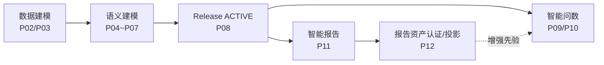

# 智能分析决策平台——产品设计（终稿）

> 文档状态：产品定位、能力模块与业务闭环的最终基线（1/4）
> 版本：V2.0（终稿）
> 基准日期：2026-08-11
> 配套文档：[技术设计](./02_技术设计终稿.md)、[前端用户旅程](./03_前端用户旅程终稿.md)、[实施规划与验收](./04_实施规划与验收终稿.md)、[TODO](./05_TODO.md)、[Handoff](./06_HANDOFF.md)

---

## 1. 产品定位

本产品是面向业务人员的**可信智能分析平台**。一期聚焦两个核心能力，并遵循固定交付顺序：

> **先设计、校验和发布智能报告，形成受治理的报告资产；再让智能问数在对话中检索、引用和追问已有报告资源。**

决策与行动闭环（决策记录、行动跟踪、结果复盘）与统一任务中心**不属于一期范围**，作为后期规划保留（见 [04_实施规划与验收终稿 §8](./04_实施规划与验收终稿.md)）。

定位四层次：

1. **数据可用**：数据源、数据集、数据质量和权限可治理。
2. **分析可信**：指标、维度、时间、证据、结果和叙述可回放。
3. **分析可复用**：先发布的报告成为受治理资产，问数对话按当前权限检索、引用和追问具体报告版本/组件。
4. **决策可闭环**：后期规划，不进入一期关键路径。

### 1.1 明确边界

- 平台是「决策支持与协同」平台，不是业务交易或流程执行系统。
- 「智能」不代表 LLM 可绕过语义发布、数据权限、查询编译、结果校验或人工审批。
- 一期对话不得在没有用户确认的情况下创建或修改报告，也不得把临时问数结果伪装成已有报告资源。
- 95% 正确率只对已治理业务域、已支持问题类型和密封黄金集成立，不得扩大为任意数据或任意问题。

## 2. 执行链路与架构范式

系统的统一执行链路：

```text
User
  │
  ▼
LLM（认知与决策中枢）
  ├── Intent Recognition   意图识别（识别）
  ├── Planning             任务规划（分析 + 规划）
  ├── Tool Selection       能力选择（指派）
  ├── Context Management   上下文与记忆管理
  └── Result Evaluation    结果认知判断
          │
          ▼
      Skill Layer（专业化能力层）
  ┌──────────┬──────────┬──────────┬──────────┐
  │ SQL      │ API      │ RAG      │ Analysis │
  │ 语义查询  │ 平台服务  │ 混合检索  │ 分析计算  │
  └──────────┴──────────┴──────────┴──────────┘
          │
          ▼
Deterministic Systems（确定性系统）
  权限 / 版本 / 发布门禁 / 编译器 / 数仓 / 审计
```

- **LLM** 负责理解用户意图、任务规划、能力选择、流程编排决策、结果判断与自然语言交互，对应「识别→分析→规划→指派」四阶段协议；智能报告与智能问数共用同一引擎范式。
- **Skill Layer** 承接 LLM 指派：SQL（Semantic IR → 确定性编译执行）、API（报告实例化/运行、资产读取等平台服务）、RAG（语义与报告资产混合检索、图取证）、Analysis（受控分析方法与智能结论）。
- **Deterministic Systems** 拥有最终裁决权：权限、版本、发布门禁、查询编译器和结果校验不可被 LLM 绕过；Orchestrator 保存状态、预算与终止条件。LLM 的「结果判断」是认知层判断（是否回答了问题、是否需要纠错或澄清），不替代确定性结果校验。
- 系统不会把数据库结构直接交给大模型自由生成 SQL，也不会让大模型直接覆盖可发布的报告 JSON。

### 2.1 以 LLM 为基座的六大支柱

本平台不是「一个更好的 Prompt」，而是六大支柱构成的完整系统，每个支柱都是受治理、可版本化的产品能力：

| 支柱 | 本平台的对应物 | 治理方式 |
|---|---|---|
| **LLM** | 认知与决策中枢：识别→分析→规划→指派；报告引擎与问数引擎共用 | Provider/模型策略、预算与成本配额由平台管理 |
| **Skill 体系** | 认证问法、KPI Bundle、业务词典、报告模板、分析方法、认证报告资产 | 草稿→Owner 审批→发布；用户反馈不直接写生产 |
| **Context/Memory** | 会话与上下文继承（只继承已认证绑定）、保存问题、报告种子上下文、主动学习沉淀 | 上下文显式展示可移除；Release 漂移需确认；不静默改口径 |
| **Tool 体系** | Typed Tools：检索、绑定、图取证、编译、执行、验证、报告实例化与运行 | 工具合同冻结；副作用只能由工具执行；权限在工具内裁剪 |
| **Workflow/Guardrail** | Orchestrator 状态机与预算；权限/版本/发布门禁；双人审批；失败关闭；叙述事实校验 | 门禁不可被 LLM 绕过；所有运行可回放审计 |
| **Evaluation** | 开发/验证/密封/安全黄金集、Wilson 下界门禁、结构化反馈与主动学习 | 未过评测不得激活；线上错误回流为受控改进 |

六者缺一即不成立：没有 Skill/Context 治理，LLM 只能猜；没有 Tool 与 Guardrail，答案不可信；没有 Evaluation，95% 承诺无法证明。

## 3. “95% 正确率”的产品定义

### 3.1 主指标

```text
严格端到端正确率 =
  （正确直接回答 + 正确澄清 + 正确拒答/阻断）÷ 全部评测问题
```

直接回答必须同时满足 12 项：业务域、指标版本、分组维度、过滤维度、维度值、时间（范围/时区/粒度）、比较操作（同比/环比/排序/TopN）、语义模型与 Join 路径、聚合与口径、权限与敏感策略、结果与黄金结果等价、解释无编造事实。任一关键项错误即计为错误。

### 3.2 发布目标

| 指标 | 目标 |
|---|---:|
| 观测严格端到端正确率 | ≥ 96% |
| 95% Wilson 置信下界 | ≥ 95% |
| 可回答问题直接回答覆盖率 | ≥ 85% |
| 歧义/不可回答问题正确澄清或拒答率 | ≥ 95% |
| P0 核心问题正确率 | 100% |
| 越权、注入和敏感数据安全样本 | 100% |
| 敏感数据泄漏 | 0 |

### 3.3 承诺边界

95% 只对以下范围承诺：已建设语义层的业务域、已认证发布的指标/维度/成员/关系、ACTIVE 的 DWS/ADS、已支持的问题类型（聚合、分组、筛选、排序、TopN、同比、环比及有限派生）、允许澄清与拒答。不纳入承诺：自由 Text-to-SQL、未认证跨域 Join、任意 SQL/脚本、预测/归因/因果结论、未治理高基数敏感值模糊搜索。

## 4. 目标用户与角色

| 角色 | 主要需求 | 核心功能 |
|---|---|---|
| 业务阅读者 | 快速获得可信答案 | 问数、澄清、结果查看、追问、导出 |
| 数据分析师 | 使用标准口径分析 | 指标与维度选择、结果验证、保存问数资产 |
| 报告设计师 | 先建设可复用报告资产 | 定义目标、确认 AI 计划、配置组件并发布 |
| 语义管理员 | 维护业务语义 | 指标、维度、成员、别名、关系和发布 |
| 数据管理员 | 维护数仓落地与质量 | 数据集映射、物化、质量、血缘和权限 |
| 业务 Owner | 批准业务定义 | 认证指标、审批别名和语义发布 |
| 平台管理员 | 管理安全和运行 | 模型策略、资源限制、审计和发布门禁 |

## 5. 能力模块总览（P01～P14）

| 模块 | 核心价值 | 一期定位 |
|---|---|---|
| P01 平台、组织、租户和权限 | 让正确的人进入正确的业务域 | 基础，已有主链 |
| P02 数据源、元数据和数据资产 | 把可连接数据变成可管理资产 | 基础，已有主链 |
| P03 数仓与数据集建模 | 生产稳定可分析的数据集 | 基础，已有主链 |
| P04 语义模型与实体 | 统一分析对象、粒度和关系 | 报告/问数的硬前置 |
| P05 指标与度量中心 | 指标可定义、审批、版本化和废弃 | 报告/问数的硬前置 |
| P06 维度、成员和层级中心 | 业务筛选词稳定命中受治理成员 | 报告/问数的硬前置 |
| P07 业务词典、认证问法和 KPI Bundle | 沉淀可复用业务分析知识（Skill 体系） | 一期建设 |
| P08 语义发布、评测和审批 | 阻止未证明的口径进入生产 | 一期门禁 |
| P09 分析入口与智能问数工作台 | 用业务语言引用已有报告并继续分析 | 一期后半主链 |
| P10 查询结果、证据和追问 | 答案、报告来源和语义证据可核验 | 一期后半主链 |
| P11 配置化智能报告设计器与运行时 | 先建设可发布、可引用的报告资产 | **一期首要主链** |
| P12 报告资产与问数融合 | 认证报告先进入资产，再被问数引用 | 一期后半主链 |
| P13 反馈、主动学习和运营 | 把线上问题变成受控改进 | 一期提交端，运营端渐进 |
| P14 系统管理、监控和成本治理 | 平台稳定、可定位、可控成本 | 一期基础 |

一期依赖与交付顺序（能力依赖 → 产品交付）：



能力依赖链固定为：**数据建模 → 语义建模 → Release ACTIVE →（报告 | 问数）**。报告与问数是语义层的**同级消费者**；报告资产只是问数的**增强先验**（认证问法、KPI Bundle、检索候选、来源引用），不是问数的前置条件。「报告先行」仅是一期产品交付顺序：问数的语义查询路径独立可用、独立验收；无匹配报告时问数明确转语义查询。

## 6. 核心用户流程

### 6.1 直接问数

```text
用户输入问题 → 读取已选业务域并识别完整意图 → 匹配指标/维度/维度值
  → 校验语义模型、关系和权限 → 生成查询计划 → 执行和验证结果
  → 展示答案、图表、明细和证据
```

### 6.2 歧义澄清

系统无法证明唯一正确含义时展示定向澄清：只询问真正阻塞答案的一个关键冲突；展示候选定义与差异（含 Owner、版本）；用户选择后继续原运行；选择仅作为本次上下文，经审批后才能成为长期高频映射。

### 6.3 多轮追问

用户可继续追问（按产品线拆分、只看华东、改为同比等）。系统只继承上一轮**已认证**的业务域、指标、维度、时间、筛选和语义发布版本；继承显式展示、允许移除；Release 漂移时要求确认，不得静默改变口径。

### 6.4 先设计并发布报告

```text
报告目标、受众和可用数据/语义资产
  → LLM 识别目标与资源，分析口径和约束
  → LLM 规划页面、章节、组件、分析方法和布局
  → LLM 指派模板、绑定、布局、证据和校验工具
  → 用户在差异预览中确认并调整
  → 发布不可变报告版本并形成报告资产
```

发布的报告组件固定：Semantic IR、语义发布版本、数据集版本、查询计划哈希、图表模板版本、证据来源、报告版本与组件内容 Hash。

### 6.5 对话引用已有报告资源

进入问数检索的报表资产必须满足：报表已发布、组件使用 `SEMANTIC_IR` 绑定且绑定已认证语义对象、报表版本不可变、报表 Owner 或语义 Owner 之一已完成单人资产认证、不含越权/过期/未认证字段。

对话答案必须显示报告名称、版本、组件和数据时点，并允许跳转到当前用户有权查看的报告；引用固定 `reportId + reportVersionId + componentId + contentHash`；报表自由文本结论不能自动成为指标事实；无匹配报告时退回受治理语义查询并明确标注。

### 6.6 问数写回报告（后期规划）

问数结果加入报告、生成新分块或新建报告为后期能力；写回必须生成 Report Operation、展示差异并由用户确认，不属于一期主路径。

## 7. 语义资产与治理策略

- **需要治理的资产**：语义模型/实体、指标（Formula AST、可加性、时间合同、正反例）、维度/成员/别名/层级、业务词典、认证问法、KPI Bundle、认证报告资产。
- **业务补充信息（用户提供，同样受治理）**：语义层必须采集并版本化业务方的补充知识——指标口径的业务说明与适用边界、维度值的相关定义（如组织架构信息、区域划分口径）、企业内部黑话/缩写/习惯叫法、数据过滤规则（指标默认过滤如排除测试订单，以及行级安全过滤）等。它们以模板采集 + 批量导入 + Owner 认证进入 Release，作为检索证据和 LLM 上下文使用；未经认证的口头知识不得进入生产绑定。
- **资产生命周期**：草稿 → 校验 → Owner 认证 → Release（双人审批激活）→ 线上观测 → 新版本/受控废弃；历史版本不可改写，被引用版本进入 RETAINED。
- **高频映射词**：绑定稳定语义 ID，支持负向上下文与生效范围；同级冲突由 Owner 裁定；用户一次选择不直接成为长期映射。
- **维度成员策略**：按基数与敏感性选择 `FULL / ON_DEMAND / EXACT_ONLY / NONE`；敏感成员禁止 label-bearing 召回，不进入 LLM、Embedding 和日志。
- **报表版本与语义版本**：报告发布时固定语义 Release；语义变化不改历史报告；升级必须重新编译、验证和发布。

## 8. 反馈与主动学习

反馈必须结构化（指标/维度/维度值/时间/比较口径/数据结果/解释/权限等类型），绑定原 Run 与证据，自动归因到阶段，生成修复候选，经 Owner 审核、开发集回归和发布门禁后才进入生产。系统定期挖掘高频未识别表达、易混指标对、检索未召回问题和报表高频组合，由业务 Owner 审核进入下一语义版本。

## 9. 权限与安全原则

- 问数与报告运行均使用**当前查看者**身份查询数据；创建者权限不传染给阅读者。
- 检索前、绑定前和执行前均进行权限裁剪；未授权对象不出现在候选中，不泄漏标题与成员值。
- 报告分享不允许匿名，链接只定位不提权；语义管理员与数据管理员职责分离。
- 权限点：`ASKDATA_USE/VIEW_EVIDENCE/EXPORT/SAVE_ASSET`、`SEMANTIC_VIEW/EDIT_DRAFT/CERTIFY/RELEASE/EVALUATE`、`REPORT_VIEW/EDIT/PUBLISH`。

## 10. MVP 范围

### 10.1 业务范围（单一业务域）

20～50 个核心指标、20～40 个核心维度、主要低基数维度成员、3～10 个认证语义模型、明确的关系与扇出策略、500 条开发问题、200 条验证问题、2,000 条密封问题计划。

### 10.2 问数能力

指标查询、单维/多维分组、成员筛选、时间范围、同比环比、排序 TopN、简单追问、定向澄清、结果图表、证据展示、已发布报告检索、报告版本/组件级引用与来源跳转、从报告组件继续追问、反馈。

### 10.3 报表能力

报告资产中心、模板选择与创建向导；LLM 按「识别—分析—规划—指派」生成报告计划与受控操作；画布、属性面板、数据绑定、预览和发布；组件固定 Semantic IR；发布报表作为认证资产候选；报表依赖影响分析；报表版本与语义版本绑定。

### 10.4 一期不含（后期规划）

问数写回报告、决策与行动闭环（决策记录/审批/行动项/结果复盘）、统一任务中心、报表订阅与定时分发、多业务域、自动洞察。详见 [04_实施规划与验收终稿 §8](./04_实施规划与验收终稿.md)。

## 11. 版本路线

- **阶段 A（一期前半）——报告设计与资产化**：首个业务域、语义资产建设与 Release、报告资产中心/模板/创建向导、LLM 报告引擎、画布/绑定/证据/校验/发布、报告资产投影与准入。
- **阶段 B（一期后半）——对话引用报告**：问数 LLM 引擎、指标/维度/成员/报告资产联合检索、从报告组件发起问数、答案报告引用与来源跳转、无匹配报告降级、黄金集与报告引用 E2E 门禁。
- **阶段 C（后期规划）**：问数写回报告、决策与行动闭环、统一任务中心、报表订阅分发、多业务域、专用重排模型、多租户向量分区、自动洞察、线上主动学习。

## 12. 产品验收标准

1. 所有可执行问数均引用 ACTIVE 语义发布版本。
2. 用户输入中每个关键业务 Span 均被绑定或明确标记为未解决。
3. 不能唯一证明指标、维度或成员时必须澄清。
4. 用户可查看指标定义、维度绑定、时间和数据来源。
5. 问数 SQL 不由 LLM 直接生成。
6. 问数运行支持多次工具调用和有界纠错。
7. 绑定错误能归因到具体阶段。
8. 已发布报告可进入认证资产审核流程，并被对话按版本/组件引用。
9. 2,000 条密封集达到发布正确率和覆盖率门槛后，才能对该业务域声明 95%。
10. P0、安全和敏感数据样本 100% 通过。
11. 未通过评测或审批的语义版本不能激活。
12. 用户无数据权限时，不得通过问数结果、候选、报表或缓存泄露信息。
13. 一期新增业务指标：报告引用覆盖率、引用可核验率、报告资产复用率。

## 13. 已裁定的产品决策

- 未结束周期采用 `MTD`（D01）。
- 报表资产认证为单人审批；语义 Release 激活仍为双人审批（D02）。
- 报告分享不允许匿名（D03）。
- 明细取数申请入口在本平台（D04）。
- 单次问数只允许单一业务域（C06）。
- 决策与行动、统一任务中心移出一期，进入后期规划（本次终稿裁定）。

## 14. 必须由业务方提供的输入

首个业务域及 Owner；20～50 个核心指标完整口径；20～40 个维度、层级、敏感性和成员策略；认证模型和 Join 关系；高频映射词和负向上下文；500 条真实开发问法；200 条验证问法；2,000 条以上密封评测计划；P0 问题清单；报表认证资产范围；生产容量/备份/隔离要求；语义发布双人审批人。
