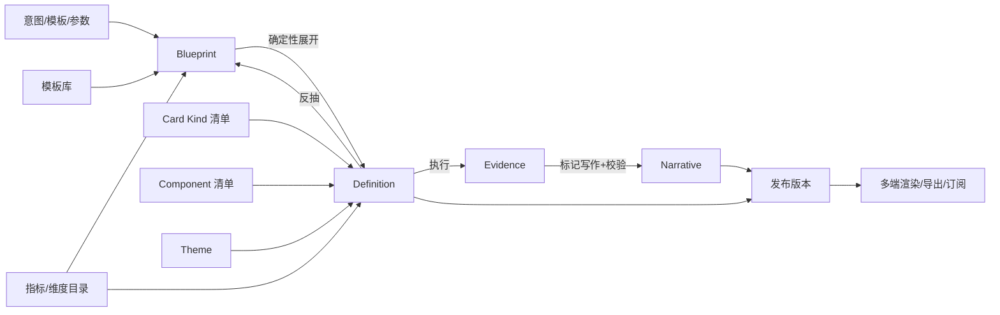

# 智能报告生成平台 · 产品设计（从 0 到 1）

> 版本：v2（2026-08-18）。本文是**从零定义**一个"由 LLM 自主生成、人只审阅"的企业级智能报告平台的产品设计，
> 不以任何既有实现为前提；配套的技术方案见 docs/14《智能报告生成平台 · 开发设计》。
> 读者：产品、架构、前后端、算法、数据治理与项目管理。文中"必须 / 不得"是硬约束，"应 / 宜"是强烈建议。

---

## 0. 一页纸

**要解决的问题**：企业里 80% 的报告（月报、周报、专题分析、经营看板）结构高度相似、内容却要人反复搭卡片、找口径、写结论；BI 工具解决了"画图"，没有解决"成稿"。

**产品定义**：一个以"报告蓝图"为核心的生成式报告平台。用户给一句意图（或选一个模板 + 参数），系统在受治理的数据与指标之上：
规划叙事结构 → 选择语义卡片 → 绑定指标与维度 → 执行数据 → 自动排版与套主题 → 写出经事实校验的结论与摘要 → 产出可审阅、可编辑、可发布、可订阅的报告。

**三条设计主张**
1. **模型写意图，引擎写事实。** LLM 只产出可校验的蓝图与文字标记；坐标、SQL、数字、ID、样式全部由确定性引擎生成。
2. **语义先于展示。** 用户与模型操作的是"KPI 卡 / 趋势卡 / 排名卡 / 结论卡"这类回答问题的卡片，展示形式（折线、柱图）由规则求得。
3. **先算后写，写必可证。** 先执行数据、再决定写什么；结论只能引用真实执行得到的证据；未通过校验的文字不出现。

**目标分级**：L0 手工 → L1 AI 辅助 → L2 AI 起稿 → **L3 AI 成稿（本文目标）** → L4 AI 运营（定时/异动/推送）。

**北极星指标**：生成草稿"零修改即发布"率；辅助指标：意图到草稿时长、空卡率、结论校验通过率、发布前人工操作数、复用率。

---

## 1. 背景、用户与目标

### 1.1 报告与报表

| | 报告（Report） | 报表 / 看板（Dashboard） |
|---|---|---|
| 形态 | 分章节的分析文档：指标、图表、明细 + **结论/摘要/建议** | 一屏多卡片：筛选、联动、钻取 |
| 时间性 | 面向一个报告期，可归档、可分发、可定时 | 面向"现在"，持续刷新 |
| 读者 | 管理层、业务负责人 | 运营、分析人员 |
| 生成难点 | 叙事结构 + 结论写作 | 卡片选择 + 布局 |

两者共用同一份定义、同一个渲染器、同一条发布链；`reportType` 只影响默认蓝图、默认主题与运行行为（是否定时、是否叙事）。

### 1.2 用户画像

| 角色 | 诉求 | 在本产品中的主要动作 |
|---|---|---|
| 业务负责人 / 管理层 | 快速拿到"结论 + 证据"，能追问 | 阅读、订阅、评论、追问改稿 |
| 业务分析师 | 少搭卡片、多做判断；口径可信 | 一句话生成、审阅修改、沉淀模板 |
| 数据 / 指标治理者 | 指标口径统一、权限可控、可审计 | 维护指标目录、模板库、主题、发布门禁 |
| IT / 平台管理员 | 稳定、成本可控、安全合规 | 模型策略、预算、租户与权限、运维 |

### 1.3 目标分级与验收口径

| 级别 | 定义 | 验收（产品级） |
|---|---|---|
| L0 手工 | 拖卡片、点绑定、写结论 | 无模型可完整完成设计—发布—运行 |
| L1 AI 辅助 | 单点：识别度量维度、写单卡结论、发布评审说明 | 建议均可拒绝，主链不依赖模型 |
| L2 AI 起稿 | 意图 → 结构 + 卡片 + 绑定，布局与结论仍需人 | 起稿可用但需大量调整 |
| **L3 AI 成稿** | 意图（+模板/参数）→ 完整可发布草稿：多数据集、语义卡片、自动排版与主题、全部结论与摘要已生成并通过校验；人只审阅 | 意图→可预览草稿 P50 ≤ 90s；空卡率 ≤ 5%；结论校验通过率 100%（未通过者不出现）；发布前人工操作数中位数 ≤ 5；"零修改即发布"率 ≥ 40%（上线一季度后 ≥ 60%） |
| L4 AI 运营 | 定时按参数重跑、异动检测、自动改写结论、推送订阅 | 周期报告无人值守产出，异动误报率 ≤ 10% |

---

## 2. 设计原则（十二条）

1. **配置即产品。** 一份报告 = 一份可版本化、可 diff、可导入导出的定义；页面渲染与数据获取都由服务端渲染器与引擎依据定义完成，前端只是定义的一个视图。
2. **两层配置：蓝图与定义。** 蓝图（Blueprint）是"意图层"，人与模型都能读写、体量小、无坐标无 ID；定义（Definition）是"事实层"，由蓝图确定性展开而来。绝不让模型直接写定义。
3. **语义卡片是唯一词表。** 模型、模板、组件面板、结论方法都围绕"卡片种类（Card Kind）"组织；展示组件由种类 + 数据形状 + 主题推荐得到，可被人覆盖。
4. **指标优先于字段。** 卡片绑定的第一公民是受治理的指标与维度（含口径、聚合、可加性、时间合同）；直接绑定数据集字段是受限的兜底路径。
5. **先算后写，写必可证。** 结论、导语、摘要只能引用真实执行产生的证据；模型只写标记，服务端代入数字；未通过事实校验的文本不落库、不展示。
6. **确定性可回放。** 同一蓝图 + 同一上下文 + 同一数据快照 → 同一定义、同一 ID、同一布局；生成过程每一步都可审计、可断点续跑。
7. **无模型不降级为不可用。** 蓝图展开、布局求解、主题、派生度量、公共维度、发布门禁全是确定性能力；模型缺席时只是"没人写蓝图和结论"。
8. **人在环内审阅，不在环内修坐标。** 默认审阅动作是"改一句话 / 换一张卡 / 删一节 / 换主题"，对话改稿走意图级操作；拖拽是微调而非主路径。
9. **一份定义、多端渲染。** 桌面 / 移动 / 打印（PDF）/ 图片 / 嵌入都由同一渲染管线从同一定义 + 同一主题产出，不允许第二套渲染器。
10. **安全与治理不可协商。** LLM 零 SQL；行列级权限在数据层裁剪且随定义冻结；发布门禁是人的声明；每一次模型调用可审计、可限额。
11. **蓝图即模板，模板即知识。** 任何生成结果或手工报告都能反抽为蓝图模板；组织内的分析框架以模板沉淀而不是靠 few-shot 侥幸。
12. **度量驱动迭代。** 提示词、Schema、规则任何变更都要过黄金集与人评门禁；没有评测就没有上线。

---

## 3. 概念模型

### 3.1 五层模型

```
报告 Report
├─ 叙事结构 Narrative Structure   页 → 章节 → 分析问题 → 卡片；导语 / 摘要 / 建议 / 风险提示
├─ 语义卡片 Card                  kind + 数据合同 + 分析方法 + 结论策略 + 展示（组件）+ 呈现选项
├─ 数据合同 Data Contract         数据源上下文（数据集/语义模型）+ 指标 + 维度 + 参数 + 公共维度 + 筛选器 + 联动
├─ 布局意图 Layout Intent         行 / 列 / 权重 / 附着 / 断点策略 → 由求解器得到多端坐标
└─ 视觉主题 Theme                 token / 图表色板 / 卡片变体 / 密度 / 品牌 → 渲染器只消费 token
```

### 3.2 领域对象

| 对象 | 说明 | 生命周期 |
|---|---|---|
| **Report** | 报告资产：元数据、当前草稿、发布版本列表、权限、分享、订阅 | 创建 → 草稿修订 → 发布版本（不可变）→ 归档 |
| **Blueprint** | 意图层：结构 + 卡片语义 + 数据引用 + 布局意图 + 主题引用 + 参数声明；无坐标、无 ID、无数字 | 由模型/人/模板产生；可另存为模板 |
| **Definition** | 事实层：蓝图展开后的完整定义（含坐标、ID、组件、绑定、筛选、联动、运行策略、来源） | 每次修订一份快照；发布即冻结 |
| **Revision / Version** | 草稿修订（可撤销重做）与发布版本（不可变、内容哈希、依赖索引） | — |
| **Card Kind** | 语义卡片种类清单：问题、数据合同、候选组件、默认方法、结论策略、布局意图、移动策略、空态/异常态 | 平台注册，版本化 |
| **Component** | 展示组件清单：渲染器类型、数据角色合同、选项 Schema、尺寸约束、交互能力、移动策略 | 平台注册，版本化，升级兼容规则 |
| **Data Context** | 报告引用的数据源版本（数据集版本 / 语义发布）+ 别名 + 查询策略 | 随定义 |
| **Metric / Dimension** | 指标（口径、聚合、可加性、时间合同、单位、格式）与维度（层级、基数、成员、语义类型） | 来自指标/语义层，报告只引用 |
| **Parameter** | 报告参数（报告期、对比期、业务参数），驱动查询、标题、结论、定时 | 随定义，运行时解析 |
| **Conformed Dimension** | 公共维度：跨数据源的维度映射，使一个筛选器作用于多张卡 | 随定义 |
| **Layout Intent** | 节级/卡级布局意图（FLOW / GRID / 行权重 / 附着 / 断点） | 随定义；坐标由求解器写入 |
| **Theme** | 视觉主题资产（版本化） | 平台/租户维护，报告引用 |
| **Method** | 分析方法（当前值、同环比、趋势、异常点、TopN、贡献、占比、达成、组间差异、分布、完整性…） | 平台注册，版本化 |
| **Evidence** | 由真实执行派生的事实集合（值、区间、行引用、时间范围、过滤哈希） | 每次执行/生成产生，可追溯 |
| **Narrative** | 卡片结论 / 章节导语 / 报告摘要 / 建议 / 风险提示；标记写作、校验状态、人工编辑标记 | 与证据绑定 |
| **Template** | 蓝图模板：蓝图 + 参数声明 + 适用数据条件 + 适用主题 + 说明；组织库/个人库 | 版本化、可审批 |
| **Generation Run** | 一次生成的运行记录：步骤、裁决、模型调用、成本、耗时、产物 | 可审计、可续跑、可评测 |
| **Eval** | 评测记录：结构、事实、空卡、布局、人评 | 与运行/版本关联 |

### 3.3 对象关系



---

## 4. 场景与用户旅程

### 场景 A · 一句话生成月报（L3 主链）
1. 输入：「生成 2026 年 7 月华东区经营分析月报，重点看收入、毛利、费用和应收」；可选模板、数据范围、主题。
2. 澄清（≤1 轮，≤3 题）：只有在无法决策时出现（意图与任何指标不相关 / 报告期无数据 / 多个同名指标 / 数据范围越权）。
3. 蓝图预览：以大纲呈现章节 → 分析问题 → 卡片（种类、指标、维度、对比、方法）；可增删改；默认可直接生成。
4. 生成：展开 → 排版 → 执行 → 精修（删空卡/换种类）→ 批量结论 → 章节导语 → 报告摘要 → 建议。进度按章节显示，每个裁决可见。
5. 审阅：编辑器打开，右侧"生成结果"面板：结论校验状态、被删卡片及原因、建议动作；顶部参数条。
6. 发布：门禁评审 → 人工确认多端预览 → 发布版本 → 分享/订阅。

### 场景 B · 模板 + 参数的周期报告
选择组织模板「产业经营月报」→ 填参数（报告期默认上月、口径）→ 系统只做"填空式"生成（结构不变，卡片按数据可用性裁剪）→ 审阅 → 发布；可一键设为定时（L4）。

### 场景 C · 对话式改稿
「把第二章的收入趋势换成按产品线对比，去掉库存那一节，主题换成高对比」→ 系统生成意图级操作 → 预览 diff（结构 + 影响的卡片 + 需要重写的结论）→ 应用（可撤销）。

### 场景 D · 手工搭建 + AI 补全
拖入「排名卡」→ 选指标与维度（AI 可推荐）→ 系统推荐展示、方法、结论；一键"补全本节结论"。

### 场景 E · 定时生成、异动与推送（L4）
定时任务按参数重跑；引擎比对上一期证据检测异动（阈值/统计/规则）；结论自动重写并标记变化；推送到邮件/IM，附带只读链接与摘要。

### 场景 F · 从对话问数沉淀为卡片
问数结果（含语义查询引用与证据）→ "加入报告" → 成为一张带来源的卡片；报告发布后反过来可被问数引用（报告先设计、对话后引用）。

### 场景 G · 治理者
维护指标口径与维度成员、审批模板、发布主题、配置模型策略与预算、查看生成审计与评测看板。

---

## 5. 功能设计

### 5.1 报告工作台
- 资产中心：按类型 / 状态 / 领域 / 标签 / 所有者浏览；缩略图；最近生成运行状态；订阅与分享入口。
- 新建向导：**AI 成稿**（意图 / 模板 / 参数 / 主题 → 蓝图预览）｜从模板｜从 JSON 导入｜空白手工。
- 编辑器：左组件面板（按卡片种类分组）、中画布（编辑态与运行态同一渲染器）、右检查器（卡片 / 报告级设置 / 生成结果 / 定义 JSON）。
- 运行页：参数条 + 筛选栏 + 摘要首屏 + 卡片；交互由服务端解析；评论与批注（可选）。

### 5.2 意图输入与澄清
- 输入结构：自然语言 + 可选结构化提示（数据范围、时间、对象、重点指标、读者、篇幅、语气）。
- 澄清策略：**能不问就不问**；问题必须是选择题且可"用默认继续"；澄清记录进入生成运行。
- 意图理解产物是蓝图，不是"理解结果"页面——用户看到的第一屏就是可编辑的报告大纲。

### 5.3 语义卡片库（Card Kind）

首批种类与合同（每种在平台注册，含版本）：

| kind | 回答的问题 | 数据合同 | 默认展示 / 备选 | 默认方法 | 结论策略 | 默认布局意图 |
|---|---|---|---|---|---|---|
| KPI | 关键指标本期多少、变化多少、达成如何 | 1..4 指标；可选对比期、目标 | 指标卡（值+同环比+达成+迷你趋势） | CURRENT_VALUE, PERIOD_COMPARISON, TARGET_ACHIEVEMENT | 单句，含变化方向 | 一行 2–4 张 |
| TREND | 随时间怎么变 | 1..3 指标 + 时间维 + 可选系列 | 折线 / 面积（堆叠需可加） | TREND, ANOMALY_POINT, MAX_CHANGE | 趋势 + 异常点 | 2/3 宽 + 右侧结论 |
| COMPARE | 谁高谁低、与对比期差多少 | 1..2 指标 + 1 分类维 + 可选对比期 | 分组柱 / 双向柱 | GROUP_DIFFERENCE, PERIOD_COMPARISON | 最大差异组 | 1/2 宽 |
| RANK | 前/后 N 是谁 | 1 指标 + 1 维 + TopN | 横向柱 / 表格（行多时） | TOP_N, RANKING | 头尾对象 | 1/2 宽 |
| COMPOSITION | 构成与占比 | 1 可加指标 + 1 维 | 环图 / 堆叠柱 / 树图 | SHARE_OF_TOTAL, CONTRIBUTION | 主要贡献者 | 1/3 宽 |
| DISTRIBUTION | 分布形态与离群 | 1 指标 (+1 维) | 直方图 / 箱线 / 散点 | DISTRIBUTION, ANOMALY_POINT | 集中区间与离群 | 1/2 宽 |
| FUNNEL | 转化与流失 | 有序阶段维 + 1 指标 | 漏斗 | STAGE_DROP | 最大流失阶段 | 1/2 宽 |
| TARGET | 目标进度 | 1 指标 + 目标 (+时间) | 进度 / 子弹图 | TARGET_ACHIEVEMENT, PACE | 达成与节奏 | 1/3 宽 |
| DETAIL | 明细 | n 字段（明细层数据） | 表格（分页/排序/导出） | DATA_COMPLETENESS | 无或数据质量提示 | 通栏 |
| INSIGHT | 对某张卡的结论 | 引用来源卡合同 | 结论文本 | 继承来源卡 | 标记写作 | 附着来源卡 |
| SUMMARY | 报告 / 章节摘要 | 引用多张卡的已验证证据 | 摘要文本 | SUMMARY | 只引用已验证结论 | 章节首 / 报告首通栏 |
| RECOMMEND | 行动建议 / 风险提示 | 引用摘要与结论 | 列表文本，样式区分 | — | 明确标注"模型建议、未经数据证明" | 报告尾通栏 |
| TEXT / IMAGE / DIVIDER | 说明、方法、备注、封面、分隔 | 无 | 富文本 / 图片 / 分隔 | — | — | 通栏 |
| FILTER | 卡内筛选控件 | 维度 / 参数 | 控件 | — | — | 卡片顶部 |

每种卡片还定义：**空态**（无数据时显示什么、是否可自动删除）、**异常态**（超时/权限/不可加）、**移动策略**（堆叠/轮播/仅主槽）、**可用交互**（点击筛选、钻取、刷选、排序、分页）、**导出行为**。

### 5.4 数据绑定
- **绑定层次**：指标（首选，来自指标/语义层）→ 数据集度量字段（受合同约束的兜底）→ 明细字段（仅 DETAIL）。
- **目录**：卡片配置面板与模型上下文看到的是"指标目录（口径、聚合、可加性、时间合同、单位、格式）+ 维度目录（层级、基数、样例成员）+ 数据画像（最新期、行数、空值率、极值）"，不是裸字段名。
- **派生度量**：同比 / 环比 / 占比 / 达成率 / 排名 / 累计 / 移动平均，作为绑定的一等对象；可加性判定沿来源度量。
- **报告参数**：`period` 必有（默认上一个完整周期）、`comparePeriod`、业务参数；参数可被筛选器、标题、结论、定时任务引用。
- **公共维度**：数据源加入报告时自动匹配候选映射（按语义类型 / 名称 / 成员重叠），人确认后成为全报告筛选维度并跨源生效。
- **权限**：列级/行级权限在数据层裁剪，模型只看得到用户可见的目录；发布时随版本冻结阅读者裁剪规则。
- **失败关闭**：不可加度量不得跨粒度求和；半可加缺时间聚合声明即失败；错误在卡片上可见并给出修复建议。

### 5.5 布局
- **布局意图层**：节级（FLOW 自然流 / GRID 网格 / TABS 页签）+ 卡级（span 或 weight、minRows、附着：结论在右/下、KPI 组并排）。
- **求解器**：确定性求解到 24 列桌面网格 + 移动线性序 + 打印分页；主题密度影响行高；无碰撞、不越界、满足组件最小尺寸；卡片间对齐底边。
- **拖拽微调**：仍支持拖动/缩放/让位；微调后标记 `manualOverride`，再次求解需确认。
- **响应式**：桌面 / 平板 / 移动 / 打印四种目标由同一意图投影；KPI 组移动端轮播、表格固定高、图例降级。
- **不做**：自由像素布局；模型直接给坐标。

### 5.6 视觉主题
- **主题 = 资产**：token（页面/卡片/文本/边框/强调/语义色、字体族与字号阶、间距密度、圆角阴影）+ 图表色板（分类/顺序/发散、网格与坐标轴）+ 卡片变体（默认/无边框/强调/打印）+ KPI 样式（数值大小、涨跌样式）+ 品牌（Logo、页眉页脚）。
- **主题中心**：内置 3 套（企业浅色 / 高对比 / 打印友好），可复制修改、预览、发布版本、设为租户默认；权限按领域共享。
- **一致性**：编辑 / 运行 / 导出 / 嵌入 / 邮件推送用同一主题渲染；主题切换是一个可撤销操作并触发重新求解密度。
- **无障碍**：色板对比度检查（WCAG AA）、色盲安全色板选项、深浅色两套。

### 5.7 叙事
- **类型**：卡片结论、章节导语、报告摘要、行动建议、风险提示、数据质量说明。
- **写作方式**：模型只写标记文本（`{{fact:id}}` 数字、`{{obj:id}}` 对象名、`{{param:name}}` 参数），不写任何数字与对象名；服务端代入并计算引用区间；每个标记必须指向本次执行的证据或已通过校验的下游结论。
- **校验**：事实校验器（标记完整性、方向词与符号一致、时间范围一致、无外部对象）；不通过 → 重试 ≤ N → 仍不通过则该处不出现文字（卡片保留图表）。
- **风格控制**：语气（客观 / 提醒 / 汇报）、篇幅、读者（管理层 / 业务）、术语表；作为蓝图/模板的一部分。
- **人工编辑**：允许改写；改写后标记"已人工修改，不再声明经校验"，重跑数据时提示过期。
- **建议与预测**：与事实结论分区展示，样式与标注区分；默认不预测，模板可开启（需组织策略允许）。

### 5.8 交互
- 筛选（报告/页/节/卡片作用域，跨源按公共维度）、参数条、点击筛选、钻取（指标 → 明细，走数据层钻取合同）、刷选、跳页、排序分页；全部由服务端解析选择，客户端不构造过滤条件。
- 评论与批注（版本级，可选），"追问"入口把当前卡片上下文带入对话问数。

### 5.9 对话式改稿
- 输入自然语言 → 模型输出**意图级操作**（增删换卡、改参数、改章节顺序、改标题、重写结论、切主题）→ 服务端展开为受控修订 → diff 预览（结构 / 受影响卡片 / 需重写的结论 / 影响的发布依赖）→ 应用（可撤销）。
- 允许集与禁止集明确：不允许模型增删数据源、不允许绕过权限、不允许直接写数字。

### 5.10 模板
- 模板 = 蓝图 + 参数声明 + 适用数据条件（需要哪些指标/维度）+ 适用主题 + 说明与示例；组织库需审批，个人库自用。
- 来源：手工报告反抽、生成结果另存、治理者编写；支持"填空式"生成（结构锁定）与"参考式"生成（模型可裁剪与扩展）。
- 模板健康度：适用数据是否仍存在、最近使用、生成质量评分。

### 5.11 发布、版本、分享、导出
- 发布门禁：确定性检查（绑定完整、无碰撞、权限、可加性、结论校验状态、空卡）+ 人工声明（多端预览已确认、告警已知悉）；模型只提供说明，不裁决。
- 版本不可变、内容哈希、依赖索引（数据源版本 / 指标 / 主题 / 组件版本 / 模板）；升级预览与影响分析；回滚。
- 分享：账号内授权、令牌链接（只定位不授权）、嵌入；订阅：邮件 / IM 摘要 + 链接。
- 导出：PDF（打印布局与分页）、图片、Excel（明细/数据）、可选 Word/PPT（按主题模板）。

### 5.12 定时与推送（L4）
- 定时任务 = 模板/报告 + 参数规则 + 主题 + 分发列表；每次运行产生新版本或新报告；失败告警；异动检测与"变化摘要"。

### 5.13 治理与安全
- 租户隔离、领域共享范围、对象级权限（查看/编辑/发布/管理）、行列级安全随版本冻结。
- 模型策略：允许的模型/供应商、用途级预算、每次生成的调用与 token 上限、数据出境策略、提示词版本审批。
- 审计：每次生成运行、每次模型调用（输入摘要、输出、校验结果、成本）、每次发布与分享。
- 内容安全：提示注入防护（模型输入中的用户文本与数据成员一律作为数据）、敏感字段脱敏、输出合规检查。

### 5.14 质量与评测
- 黄金集（意图 + 数据 + 期望结构）与自动指标：蓝图合规率、空卡率、结论校验通过率、布局问题数、生成时长与成本。
- 人评：具名评审对结构合理性 / 结论有用性 / 视觉打分；反馈按钮进入账本，不直接改提示词。
- 变更门禁：提示词、Schema、规则、模型版本变更必须过黄金集与人评基线。

### 5.15 可观测
- 生成运行看板（步骤耗时、失败原因、降级次数）、模型成本看板、报告运行性能（P95、缓存命中、失败率）、订阅送达率。

---

## 6. 信息架构与关键界面

- 一级导航：报告中心 · 新建 · 模板中心 · 主题中心 · 指标目录（只读入口）· 运行与评测（治理者）。
- 新建向导（AI 成稿）：左：意图 / 模板 / 参数 / 主题；右：蓝图大纲（章节 → 卡片，可拖动、可编辑）；底部主按钮"生成报告"。
- 编辑器：组件面板按卡片种类；检查器首项"卡片种类"，其次指标（含派生：对比期/目标/占比）、维度、TopN、结论策略；展示类型折叠为"高级"。"生成结果"面板：步骤日志、裁决、结论状态、一键重生本卡/本节。
- 运行页：参数条 → 摘要 → 章节；移动端线性；打印一致。
- 视觉：企业蓝白灰体系、1920×1080 基准延伸、明确的层级与留白；不引入第三方 UI 主题层。

---

## 7. AI 能力边界与失败降级

| 模型可以 | 模型不可以 |
|---|---|
| 从上下文包与意图规划蓝图（结构、卡片种类、指标/维度引用、方法、权重、参数、主题） | 输出 SQL、坐标、ID、数字、对象名、样式值 |
| 在校验反馈下修正蓝图（≤N 次） | 引用 allowlist 之外的任何对象 |
| 基于执行摘要精修（删空卡、换种类、调 TopN、关闭结论） | 增删数据源、修改权限、绕过门禁 |
| 写标记文本（结论 / 导语 / 摘要 / 建议） | 写未经证据支持的数字与因果 |
| 产出意图级改稿操作 | 直接改定义 JSON |
| 为发布评审写说明 | 裁决是否可发布 |

失败降级矩阵：

| 失败点 | 降级 |
|---|---|
| 无模型提供方 / 超预算 | 模板蓝图 + 规则精修 + 无叙事，仍可发布 |
| 蓝图校验多次失败 | 使用模板默认蓝图或返回澄清 |
| 单卡执行失败 / 无数据 | 删卡或换种类，记录裁决 |
| 结论校验失败 | 该卡无结论，图表保留 |
| 摘要失败 | 无摘要，不阻塞 |
| 布局求解失败 | 单列回退，标记待人工 |

---

## 8. 非功能需求

| 维度 | 目标 |
|---|---|
| 性能 | 意图→草稿 P50 ≤ 90s / P95 ≤ 180s；报告运行首屏 P95 ≤ 3s（缓存命中 ≤ 1s）；单卡查询超时可配 |
| 可用性 | 平台核心链路 99.9%；模型侧故障不影响手工与运行 |
| 扩展性 | 卡片种类、组件、方法、主题、模型供应商均为注册表扩展，不改核心 |
| 安全 | 租户隔离、最小权限、审计、密钥托管、数据不出境策略、提示注入防护 |
| 合规 | 生成内容可追溯到证据与模型调用；人工修改可区分 |
| 国际化 | 定义与叙事支持多语言（locale 影响格式与文案）；主题支持字体族 |
| 无障碍 | 键盘可达、对比度、屏幕阅读器语义 |
| 成本 | 每次生成 token 与调用上限；缓存上下文包与执行结果 |

---

## 9. 非目标（本期）

自由像素布局；模型直接产出定义或 SQL；跨报告自动对比；Word/PPT 精排（仅按主题导出）；实时流式数据；多人同时编辑同一草稿（先做锁 + 修订）。

---

## 10. 指标体系

| 类别 | 指标 |
|---|---|
| 北极星 | 生成草稿"零修改即发布"率 |
| 效率 | 意图→草稿时长；发布前人工操作数；从模板生成的比例 |
| 质量 | 空卡率；结论校验通过率；布局问题数；人评均分；被人工改写的结论比例 |
| 采用 | 周活生成人数；模板复用次数；订阅数；对话改稿使用率 |
| 成本 | 每份报告模型成本；缓存命中率 |
| 治理 | 越权尝试 0；未校验文本出现 0；审计完整率 100% |

---

## 11. 里程碑

| 阶段 | 交付 | 出口标准 |
|---|---|---|
| M1 蓝图与卡片 | 蓝图 Schema、卡片种类库、指标优先绑定、上下文包、展开器、多数据源 | 手写蓝图可展开为可发布报告；模型可稳定产出合规蓝图 |
| M2 排版与主题 | 布局意图 + 求解器、主题资产与渲染 token 化、多端投影 | 同一蓝图切 3 套主题无重叠、无溢出；移动/打印自动 |
| M3 先算后写 | 执行摘要环、精修、批量结论、导语与摘要、参数与公共维度、派生度量 | 空卡率 ≤ 5%、结论通过率 100%、参数联动 |
| M4 改稿与治理 | 意图级改稿、模板反抽与模板中心、评测集与门禁、审计与成本看板 | 改稿稳定；黄金集入 CI；治理看板可用 |
| M5 运营（L4） | 定时、异动、推送、订阅 | 周期报告无人值守 |

---

## 12. 取舍与反思（我们为什么这样设计）

1. **为什么不让模型直接写完整定义？** 定义包含坐标、ID、双端布局、封闭 Schema，模型写错率高且不可校验；蓝图把模型限制在它擅长且可校验的子集，展开由确定性代码完成。
2. **为什么是"语义卡片"而不是"图表类型"？** 图表类型是展示决策，取决于数据形状与主题；卡片种类是分析决策，才是模型与人真正表达的东西。两者解耦后，同一蓝图可在不同数据形状/主题下得到不同但都正确的展示。
3. **为什么指标优先？** 报告的可信来自口径统一；字段绑定把口径责任推给每张卡，模型必错。兜底保留字段绑定是为了覆盖尚未建模的数据。
4. **为什么先算后写？** 不看数据的规划必然产生空卡与错卡；一次轻量执行摘要（不拉明细）成本很低但决定了成稿质量。
5. **为什么标记写作？** 让模型写数字等于放弃可验证性；标记 + 代入 + 校验是唯一能保证"文字与图一致"的方式，也是审计与重跑的基础。
6. **为什么布局意图 + 求解器而不是自由布局？** 自由布局无法自动化、无法多端、无法换主题；意图层保留了表达力，求解器保证正确性；拖拽退为微调。
7. **为什么主题是资产而不是 CSS？** 只有资产化才能版本、共享、审批、导出一致；渲染器只消费 token 是可切换的前提。
8. **为什么模板而不是 few-shot？** 组织知识需要治理与复用；模板是可审批、可度量、可锁结构的知识载体，few-shot 只是提示词技巧。
9. **单数据源 vs 多数据源？** 真实报告横跨多张宽表；代价是公共维度映射与跨源筛选，必须在设计初期纳入而不是后补。
10. **要不要澄清？** 澄清是成本；用上下文包与默认值把澄清压到最少，且澄清永远可"用默认继续"。
11. **模型选择与结构化输出？** 蓝图/操作/叙事全部走严格结构化输出（闭集、内联、无条件关键字），对模型供应商中立；温度 0、重试有上限、结果可回放。
12. **AI 起稿后人还要做什么？** 审阅结论是否成立、结构是否符合汇报习惯、是否补充业务背景——这些是人的价值，也是评测的对象。

---

## 13. 术语表

蓝图（Blueprint）· 定义（Definition）· 卡片种类（Card Kind）· 组件（Component）· 数据上下文（Data Context）· 指标 / 维度 · 派生度量 · 报告参数 · 公共维度 · 布局意图 · 求解器 · 主题（Theme）· 分析方法（Method）· 证据（Evidence）· 标记写作 · 事实校验 · 生成运行（Generation Run）· 意图级操作 · 黄金集 · 门禁。
