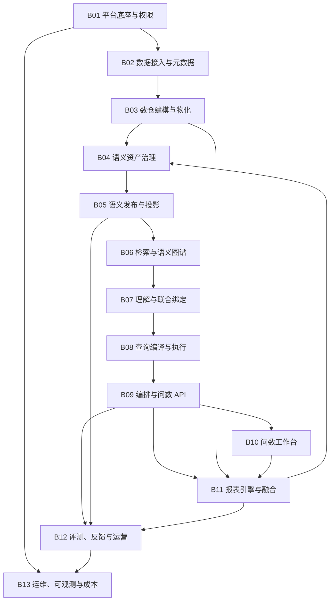
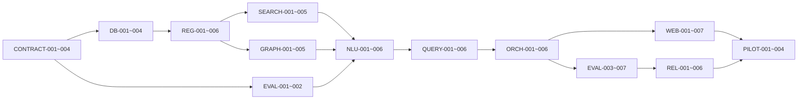

# 智能问数系统 Codex TODO 实施计划

> 配套架构：[ASK_DATA_TECHNICAL_DESIGN.md](./ASK_DATA_TECHNICAL_DESIGN.md)
> 产品基线：[可信智能问数与智能报表一体化平台_最终产品设计方案.md](./可信智能问数与智能报表一体化平台_最终产品设计方案.md)
> 技术基线：[可信智能问数与智能报表一体化平台_最终技术设计文档.md](./可信智能问数与智能报表一体化平台_最终技术设计文档.md)
> 适用仓库：`intelligent_report_generation_system`
> 目标：把技术架构拆成可由 Codex 逐项实现、验证和交付的原子任务。
> 本计划不代表系统已经达到 95%；只有密封端到端黄金集通过发布门禁后才能作出该声明。

## 0. 板块蓝图（功能区划分）

### 0.1 为什么要在 Wave 之上再做板块划分

`Wave` 是**时间轴**，回答「先做什么」；`板块（Block）`是**责任面**，回答「这块功能由谁完整拥有、边界到哪里、什么算做完」。两者正交：

- 一个 Wave 会横切多个板块；
- 一个板块会跨越多个 Wave；
- 板块是 Definition of Done、代码归属、契约归属和验收归属的单位；
- 新任务先归板块，再排 Wave，避免出现「不属于任何人」的孤儿任务。

原 TODO 只覆盖问数链路（AskData），**报表引擎、问数报表融合、明细取数、配额成本等板块在原计划中完全缺失**。本节补齐全平台板块，并在 §22～§32 补齐每个板块的开发任务。

### 0.2 板块总表

| 板块 | 名称 | 产品模块 | 技术模块 | 任务前缀 | 主要代码目录 | 当前完成度 |
|---|---|---|---|---|---|---|
| B01 | 平台底座与权限 | P01 | M01 | `PLAT-`、`SEC-` | `internal/access`、`internal/policy`、`internal/askdata/security` | 基线已有，问数侧 1/4 |
| B02 | 数据接入与元数据 | P02 | M02 | `META-`、`DR-` | `connector_service`、`internal/datasource`、`internal/metadataai` | 基线已有，新增明细取数 |
| B03 | 数仓建模与物化 | P03 | M03 | `DSET-`、`SNAP-` | `internal/dataset`、`internal/materialization` | 基线已有，缺快照版本 |
| B04 | 语义资产治理 | P04、P05、P06、P07 | M04、M05、M06、M07 | `REG-`、`DIM-`、`TIME-`、`ADD-`、`TERM-`、`KPI-`、`IMPORT-` | `internal/askdata/registry`、`dimension` | 主链完成，口径与导入待建 |
| B05 | 语义发布与投影 | P08 | M08 | `DB-`、`REL-`、`RETAIN-`、`PROJ-` | `internal/askdata/registry`、`migrations` | READY 完成，ACTIVE 门禁未开 |
| B06 | 检索与语义图谱 | P09 | M09、M10 | `SEARCH-`、`GRAPH-` | `internal/askdata/search`、`graph` | 主链完成，评测与降级待建 |
| B07 | 问句理解与联合绑定 | P09 | M11、M12 | `NLU-` | `internal/askdata/understanding`、`binding` | 主链完成，域约束/Pin 待建 |
| B08 | 查询编译与执行 | P09 | M13、M14 | `QUERY-` | `internal/askdata/ir`、`compiler`、`validator` | 主链完成，口径规则待建 |
| B09 | 编排、Tool Host 与问数 API | P09、P10 | M15 | `ORCH-`、`ANS-` | `internal/askdata/orchestrator`、`toolhost`、`http`、`answer` | Loop 完成，API/叙述校验待建 |
| B10 | 问数工作台前端 | P09、P10 | M16 | `WEB-` | `web/src/askdata` | 仅 mock 完成 |
| B11 | 报表引擎与问数报表融合 | P11、P12 | M17 + 报告专章 | `RPT-`、`FUSE-`、`WEB-RPT-` | `internal/report`、`web/src/report` | **全部待建** |
| B12 | 评测、反馈与运营 | P13 | M18 | `EVAL-`、`FB-`、`SQ-` | `internal/askdata/evaluation`、`feedback` | 基础完成，门禁待建 |
| B13 | 运维、可观测与成本 | P14 | M19 | `OPS-`、`OBS-` | `internal/config`、`internal/observability`、`scripts` | 待建 |

### 0.3 板块依赖



`B11 -> B04` 是反向的资产回流：已认证报表组件作为检索先验回到语义资产板块，**只作为候选证据，不改变指标口径**。

### 0.4 板块 Definition of Done

一个板块只有同时满足以下 12 项才算交付，缺一不可：

1. 业务流程闭环（含异常与降级路径）；
2. 数据模型、版本策略与迁移；
3. Go 领域类型、Service、Store、Handler；
4. 冻结的 JSON Schema 或 API Contract；
5. React 页面或管理入口（有页面的板块须先过设计稿门禁）；
6. 权限与 RLS；
7. 审计与 Artifact Hash；
8. 单元、属性、集成、契约测试；
9. 可观测指标；
10. 失败关闭、超时与降级行为；
11. 运行手册与验证命令；
12. 验收样本与自动验证脚本。

### 0.5 板块交付顺序

| 阶段 | 主攻板块 | 目标 |
|---|---|---|
| 阶段 A（进行中） | B09 → B10 | 打通单问题端到端：API/SSE + 真实前端接线 |
| 阶段 B | B04 口径子域 | 时间合同、可加性、批量导入三条闭环，让语义资产可批量建成且口径正确 |
| 阶段 C | B08 + B09 补全 | TopN/Bundle/缓存/叙述校验，把「答得对」变成「答得可证」 |
| 阶段 D | B11 | 报表引擎从零建成并与问数双向融合 |
| 阶段 E | B05 + B12 | 发布门禁、双人审批、密封评测与运营闭环 |
| 阶段 F | B13 + 试点 | 可观测、成本、容量、Shadow/Canary 与正式验收 |

### 0.6 板块任务索引

各板块的完整任务清单见：

| 板块 | 已有任务 | 补全任务章节 |
|---|---|---|
| B01 | `SEC-001`～`SEC-004` | §30 |
| B02 | 仓库既有基线 | §29（`DR-001`～`DR-003`） |
| B03 | 仓库既有基线 | §24（`SNAP-001`） |
| B04 | `REG-001`～`006`、`DIM-001`～`003` | §23（`TIME-*`、`ADD-*`、`IMPORT-*`、`TERM-*`、`KPI-*`） |
| B05 | `DB-004`、`DB-007`、`DB-008`、`REL-001`～`006` | §24（`RETAIN-*`、`PROJ-*`、`SNAP-*`） |
| B06 | `SEARCH-001`～`005`、`GRAPH-001`～`005` | §25（`SEARCH-006`、`GRAPH-006`） |
| B07 | `NLU-001`～`006` | §26（`NLU-007`～`009`） |
| B08 | `QUERY-001`～`006` | §26（`QUERY-007`～`011`） |
| B09 | `ORCH-001`～`006` | §26（`ORCH-007`～`009`、`ANS-001`～`004`） |
| B10 | `WEB-001`～`007` | §27（`WEB-008`～`013`） |
| B11 | 无 | §28（`RPT-*`、`FUSE-*`、`WEB-RPT-*`） |
| B12 | `EVAL-001`～`007` | §29（`EVAL-008`～`012`、`FB-*`、`SQ-*`、`DR-*`） |
| B13 | `OPS-001`～`005`、`OBS-001`～`002` | §30（`OBS-003`、`OPS-006`） |

## 1. Codex 执行原则

### 1.1 每个 Codex 任务的边界

每次只领取一个 TODO ID。一个任务应满足：

- 有明确输入、输出、依赖和停止条件；
- 默认只修改列出的文件范围；
- 能在一次独立 Codex 工作周期内实现和验证；
- 不顺手实现后续任务；
- 不把临时 fixture、猜测的业务指标或未审批词典当作生产事实；
- 不擅自 stage、commit、push 或创建 PR，除非用户另行要求；
- 发现当前工作区已有无关修改时保留并绕开。

### 1.2 每个任务开始前

Codex 必须执行：

```sh
pwd
find .. -name AGENTS.md -print
git status --short
```

然后阅读：

1. 本 TODO 的任务条目；
2. [ASK_DATA_TECHNICAL_DESIGN.md](./ASK_DATA_TECHNICAL_DESIGN.md) 对应章节；
3. 任务依赖产生的接口、迁移和测试；
4. 即将修改的现有模块及其相邻测试。

### 1.3 全局不可违反的约束

1. 不回滚或恢复 `000195_remove_decommissioned_features` 删除的旧运行时。
2. 新问数控制面使用 `askdata` schema；不要重新创建退役的 `platform.semantic_*` 表。
3. LLM 是全流程认知中枢，但不能直接提交 SQL、nGQL、数据库凭据或绕过权限/发布门禁。
4. 指标、维度、成员、关系和计划只能引用已发布稳定 ID 与版本。
5. SQL 必须由 Semantic IR 经 Go 确定性编译器生成并参数化。
6. 问数首期只查询已发布、ACTIVE 的 DWS/ADS 稳定视图。
7. 任何检索都先按 tenant、domain、权限、release 和状态裁剪。
8. NebulaGraph 是可重建投影，PostgreSQL 注册表是语义事实源。
9. 不保存模型隐藏思维链；只保存结构化决策、动作、证据 ID 和 hash。
10. 用户反馈只能形成待审核候选，不能自动修改生产语义。

### 1.4 分支和任务命名建议

如果用户要求为任务创建分支，使用：

```text
codex/askdata-<todo-id>-<short-name>
```

例如：

```text
codex/askdata-db-001-schema
codex/askdata-search-003-hybrid-retriever
```

## 2. 状态、优先级和工作流

### 2.1 状态

- `[ ]`：未开始
- `[x]`：完成且通过任务验收
- `BLOCKED`：缺少人工业务输入、外部服务或上游任务；不能用猜测绕过

### 2.2 优先级

- `P0`：关键路径或安全/正确性边界
- `P1`：首期上线必需
- `P2`：规模化、体验或运维增强

### 2.3 工作流 Lane

| Lane | 板块 | 范围 | 共享热点文件 |
|---|---|---|---|
| DB | B05 | 迁移、RLS、角色、版本和持久化合同 | `migrations/*`、`scripts/migrate.sh`、`scripts/verify-database.sh` |
| REGISTRY | B04 | Go 语义对象、Repository、发布、资产导入、时间合同与可加性 | `internal/askdata/registry` |
| AI | B09 | LLM 认知协议、结构化动作、叙述校验和模型适配 | `internal/ai`、`internal/askdata/cognition`、`answer` |
| SEARCH | B06 | 词典、pgvector、混合召回、重排 | `internal/askdata/search`、`internal/askdata/dimension` |
| GRAPH | B06 | NebulaGraph、GraphPlan、投影和降级 | `compose.yaml`、`internal/askdata/graph` |
| QUERY | B08 | Semantic IR、编译、计划和结果验证 | `internal/askdata/ir`、`compiler`、`validator` |
| ORCH | B09 | Tool Host、状态机、预算、API/SSE | `internal/askdata/orchestrator`、`toolhost`、`http` |
| WEB | B10 | React 问数工作台与语义管理 | `web/src/askdata`、`web/src/semantic` |
| REPORT | B11 | Report DSL、Operation、布局、发布、运行时、Insight | `internal/report`、`web/src/report` |
| FUSION | B11 | 问数入报告、报表资产反哺、图表推荐 | `internal/askdata/reportasset`、`internal/report/insight` |
| EVAL | B12 | 黄金集、评测、Wilson 门禁和反馈归因 | `internal/askdata/evaluation`、`feedback` |
| OPS | B13 | 配置、可观测性、部署、配额和运行手册 | `internal/config`、`internal/observability`、`compose.yaml`、`scripts` |

### 2.4 并行编辑规则

以下内容同一时间只允许一个 Codex 任务持有：

- 迁移编号和 `migrations/*.sql`；
- `cmd/api/main.go`；
- `cmd/worker/main.go`；
- `internal/ai/model.go`、`internal/ai/service.go`；
- `web/src/app/App.tsx`；
- `compose.yaml`；
- `scripts/verify-database.sh`；
- `api/schemas/semantic-ir-v1.schema.json`（字段扩展只能一人改）；
- `api/schemas/report-definition-v1.schema.json`、`report-operation-v1.schema.json`、`component-manifest-v1.schema.json`；
- `internal/report/model.go`；
- `web/src/report/schemas/*`。

其他 Lane 只有在上游合同已经合并后才能并行。不要让多个 Codex 任务各自发明相同 JSON 合同。

## 3. 验证命令目录

任务条目使用以下验证代号。

### V-GO-ASKDATA

```sh
gofmt -w internal/askdata
go test ./internal/askdata/...
```

### V-GO-ALL

```sh
test "$(gofmt -l cmd internal | wc -l | tr -d ' ')" = "0"
go test ./...
```

### V-WEB

```sh
npm --prefix web run lint
npm --prefix web run build
```

### V-DB

要求本地依赖服务已启动：

```sh
./scripts/migrate.sh
./scripts/verify-database.sh
./scripts/verify-warehouse.sh
```

### V-COMPOSE

```sh
./scripts/check-compose.sh
docker compose config >/dev/null
```

### V-BASELINE

```sh
./scripts/ci-check.sh
go test ./...
npm --prefix web run lint
npm --prefix web run build
```

### V-FULL-INTEGRATION

```sh
./scripts/ci-check.sh
go test ./...
npm --prefix web run lint
npm --prefix web run build
./scripts/check-compose.sh
./scripts/migrate.sh
./scripts/verify-database.sh
./scripts/verify-warehouse.sh
```

## 4. 人工输入门禁

这些任务不能由 Codex 自行编造业务答案。Codex 可以创建模板、校验器和导入工具，但必须等待业务负责人提供内容。

| ID | 人工 TODO | 需要的输入 | 阻塞任务 |
|---|---|---|---|
| HUMAN-001 | 选定首个业务域 | domain ID、Owner、用户范围、首期问题边界 | REG-005、EVAL-004、PILOT-* |
| HUMAN-002 | 提供核心指标清单 | 20～50 个指标定义、公式、单位、粒度、默认过滤、Owner | REG-005、NLU-004、EVAL-004 |
| HUMAN-003 | 提供维度治理清单 | 20～40 个维度、层级、敏感性、成员规模、索引策略 | DIM-*、SEARCH-005、EVAL-004 |
| HUMAN-004 | 提供真实问数样本 | 500 开发、200 验证、2,000+ 密封计划；需脱敏和标准答案 | EVAL-*、PILOT-* |
| HUMAN-005 | 确认 NebulaGraph 生产约束 | 部署环境、容量、隔离级别、备份和版本兼容 POC 结论 | GRAPH-002 生产化边界、OPS-004 |
| HUMAN-006 | 批准生产语义发布 | 双人评审、黄金集结果、安全结果 | REL-006、PILOT-003 |

## 5. 关键路径



可提前并行：

- `GRAPH-001` 版本兼容 POC 可与 DB 基础建设并行；
- `WEB-001` 只做静态路由和 mock UI，可在 API 合同冻结后并行；
- `EVAL-001` 的纯结果规范化库可在 Semantic IR 合同冻结后并行；
- 安全测试夹具可在 Tool/IR 合同冻结后并行。

## 6. Wave 0：合同、基线与任务脚手架

### [x] CONTRACT-001 — 冻结 askdata 包边界与依赖方向

- 优先级：P0
- 依赖：无
- 目标：创建包级设计合同，规定 `registry -> search/graph -> binding -> ir -> compiler -> orchestrator` 的单向依赖，禁止循环依赖。
- 文件范围：`internal/askdata/doc.go`、`internal/askdata/contracts.go`、本计划状态。
- 完成标准：核心 ID、VersionRef、ReleaseRef、EvidenceRef、PolicyScope、ConfidenceEvidence 有最小 Go 类型和 JSON tag；不包含数据库实现。
- 测试：序列化 round-trip、非法空 ID、非法 hash。
- 验证：V-GO-ASKDATA。

### [x] CONTRACT-002 — QuestionUnderstanding JSON Schema

- 优先级：P0
- 依赖：CONTRACT-001
- 目标：冻结 mention span、domain hypothesis、metric/dimension/value mention、time、comparison、ordering、unresolved span 合同。
- 文件范围：`api/schemas/question-understanding-v1.schema.json`、`internal/askdata/understanding/model.go`、测试。
- 完成标准：Go 类型与 JSON Schema 一致；未知字段拒绝；字符位置、数组上限和文本长度有界。
- 安全要求：不允许模型输出表名、列名、SQL 或任意对象定义。
- 验证：V-GO-ASKDATA。

### [x] CONTRACT-003 — Semantic IR JSON Schema

- 优先级：P0
- 依赖：CONTRACT-001
- 目标：冻结稳定版本 ID、metrics、groupBy、filters/member IDs、time range、comparison、sort、limit 和 release hash。
- 文件范围：`api/schemas/semantic-ir-v1.schema.json`、`internal/askdata/ir/model.go`、`normalize.go`、测试。
- 完成标准：相同语义输入产生稳定规范 JSON/hash；不接受物理表名、原始 SQL 和未绑定字符串值。
- 验证：V-GO-ASKDATA。

### [x] CONTRACT-004 — Cognition Action 与 Tool 合同

- 优先级：P0
- 依赖：CONTRACT-002、CONTRACT-003
- 目标：冻结 `CALL_TOOL`、`PROPOSE_BINDING`、`PROPOSE_PLAN`、`ANALYZE_ANOMALY`、`VERIFY_RESULT`、`FINALIZE`、`CLARIFY`、`BLOCK` 合同和工具参数/结果 envelope。
- 文件范围：`api/schemas/cognition-action-v1.schema.json`、`internal/askdata/cognition/model.go`、`internal/askdata/toolhost/model.go`。
- 完成标准：每个动作只有合法阶段可用；Tool args 按具体工具二次 Schema 校验；未知工具失败关闭。
- 验证：V-GO-ASKDATA。

### [x] BASE-001 — 建立 askdata 测试 fixture 包

- 优先级：P0
- 依赖：CONTRACT-001～004
- 目标：提供完全合成的租户、用户、DWS 模型、指标、维度、成员、关系、问题和结果 fixture。
- 文件范围：`internal/askdata/testfixture`。
- 完成标准：fixture 明确标注 synthetic；包含同名指标、同名成员、越权、Join fanout、空结果和过期成员难例。
- 禁止：使用真实凭据或未脱敏业务行。
- 验证：V-GO-ASKDATA。

### [x] BASE-002 — 只读数仓资产盘点命令

- 优先级：P1
- 依赖：CONTRACT-001
- 目标：列出当前已发布 DWS/ADS 数据集、版本、物化、字段、粒度、时间字段和 schema hash，不写库。
- 文件范围：`cmd/askdata-inventory/main.go`、`internal/askdata/registry/inventory.go`。
- 完成标准：默认输出脱敏 JSON；拒绝 ODS/DIM/DWD；没有仓库写权限。
- 验证：`go test ./internal/askdata/registry/...`、`go test ./cmd/askdata-inventory/...`。

### [x] OPS-001 — 空库启动与历史映射对账修复

- 优先级：P0
- 依赖：BASE-001、DB-001～004。
- 目标：清理退役语义运行时遗留的 tenant trigger，并保证映射数据集回退到历史
  schema 时仍生成稳定且不冲突的发布幂等键。
- 文件范围：`000221_*`、`internal/dataset/mapped_dataset.go`、数据库/数仓验证脚本。
- 完成标准：空库 migration + seed 成功；重复 schema transition 不撞历史幂等键；
  API、Worker 与 Web 全部 healthy。
- 验证：V-GO-ALL、V-DB、`make seed-dev`、Docker Compose HTTP smoke test。

### Wave 0 退出门禁

- CONTRACT-001～004 全部完成；
- synthetic fixture 可运行；
- 空库可迁移、seed 并启动全部本地服务；
- 任何后续任务不得再各自定义 QuestionUnderstanding、Semantic IR 或 Tool envelope。

## 7. Wave 1：数据库与语义注册表

### 7.1 迁移编号预留

迁移只由 DB Lane 顺序实现；其他任务不得创建同编号文件。

| 迁移 | 归属 | 内容 |
|---|---|---|
| `000213_askdata_schema_and_roles` | DB-001 | schema、角色权限、RLS 辅助函数、审计基础 |
| `000214_askdata_semantic_registry` | DB-002 | domain/model/measure/metric/dimension/relationship/quality |
| `000215_askdata_members_and_search` | DB-003 | members、aliases、search documents、embedding outbox |
| `000216_askdata_release_projection` | DB-004 | release、objects、projection watermarks、READY 收敛 |
| `000217_askdata_question_runtime` | DB-005 | question runs/events/artifacts/tool calls |
| `000218_askdata_evaluation_feedback` | DB-006 | evaluation sets/cases/runs、feedback |
| `000219_askdata_release_evaluation_gate` | DB-007 | Wilson、安全、覆盖率和 release 激活门禁函数 |
| `000220_askdata_release_approvals` | DB-008 | 双人审批、职责分离和审批审计 |
| `000221_retired_semantic_tenant_trigger_cleanup` | OPS-001 | 清理 `000195` 遗留的租户初始化触发器，恢复空库 seed 能力 |
| `000222_askdata_dimension_profile_runtime` | DIM-002 | 有界扫描任务、画像 generation 和成员观测证据 |
| `000223_askdata_sensitive_member_policy` | SEC-003 | 敏感成员敏感度下限、label-free release pin 与数据库内 EXACT_ONLY 查找 |
| `000224_askdata_graph_projection_worker_contract` | GRAPH-004 | target-scoped claim、heartbeat 与 label-free 图快照 |

每个迁移必须同时有 `.up.sql` 和 `.down.sql`。Down 只用于开发回退，不得在生产通过回滚 `000195` 恢复旧表。

### [x] DB-001 — `askdata` schema、权限与 RLS 基础

- 优先级：P0
- 依赖：CONTRACT-001
- 文件范围：`migrations/000213_askdata_schema_and_roles.up.sql`、`.down.sql`、`scripts/verify-database.sh`。
- 实现：创建 schema；显式授权 `report_app`/`report_worker`；默认权限失败关闭；提供复用当前 tenant context 的 RLS helper；PUBLIC 无权限。
- 特别注意：当前 `scripts/migrate.sh` 只对 `platform` 做通用授权，`askdata` 权限必须在迁移内完整声明。
- 完成标准：app 无法写 worker-only 表；worker 无法绕过 RLS；connection-test role 无 askdata 权限。
- 验证：V-DB。

### [x] DB-002 — 核心语义注册表

- 优先级：P0
- 依赖：DB-001、CONTRACT-003
- 文件范围：`000214_*`、`scripts/verify-database.sh`。
- 实现：domains、entities、semantic_models、measures、metrics、metric_versions、dimensions、hierarchies、relationships、quality_rules、business_terms。
- 完成标准：版本不可原地修改；所有引用带 tenant 复合外键；AST JSON 有大小/类型/安全检查；发布对象只能引用当前可用 DWS/ADS dataset/materialization。
- 验证：V-DB。

### [x] DB-003 — 维度成员与检索表

- 优先级：P0
- 依赖：DB-002
- 文件范围：`000215_*`、`scripts/verify-database.sh`。
- 实现：dimension_members、member_aliases、search_documents、embedding_outbox；`halfvec(2560)` 和 HNSW；tenant/domain/object type B-tree/GIN 索引。
- 完成标准：FULL/EXACT_ONLY/ON_DEMAND/NONE 约束；敏感/高基数对象不能进入 embedding outbox；状态和 lease 形状有数据库约束。
- 验证：V-DB。

### [x] DB-004 — Semantic Release 与 READY 投影水位

- 优先级：P0
- 依赖：DB-002、DB-003
- 文件范围：`000216_*`、`scripts/verify-database.sh`。
- 实现：semantic_releases、release_objects、release_projections、release_state、events、GraphPlan cache。
- 完成标准：四个投影 hash 一致才能 READY；投影具备 lease、heartbeat、失败重试和可审计 artifact；旧运行可继续引用固定 release。
- 验证：V-DB。

> 2026-08-06 完成：release manifest、四投影 hash/lease、READY 收敛、
> `release_state` 与 GraphPlan cache 已完成并通过集成测试。用户确认将 ACTIVE 原子切换
> 从本任务边界移交 `REL-005`；`askdata.activate_release` 在 DB-007 评测门禁、DB-008
> 双人审批和 `REL-005` 落地前继续故意不存在。

### [x] REG-001 — 语义对象领域模型与 Validator

- 优先级：P0
- 依赖：CONTRACT-001、DB-002
- 文件范围：`internal/askdata/registry/model.go`、`validation.go`、测试。
- 完成标准：度量可加性、指标依赖、维度类型、成员策略、关系基数/fanout、质量状态均有确定性校验；错误包含稳定 code 和字段 path。
- 验证：V-GO-ASKDATA。

### [x] REG-002 — PostgreSQL Repository

- 优先级：P0
- 依赖：REG-001、DB-004
- 文件范围：`internal/askdata/registry/postgres_store.go`、测试。
- 完成标准：所有读写在显式 tenant transaction 内；并发更新使用 record version；列表稳定分页；不返回未授权对象。
- 验证：V-GO-ASKDATA + V-DB integration test。

### [x] REG-003 — 规范 content hash 与发布包构建

- 优先级：P0
- 依赖：REG-002
- 文件范围：`internal/askdata/registry/release.go`、`canonical.go`、测试。
- 完成标准：对象排序、JSON 规范化和 hash 稳定；release 固定精确对象版本；重复请求幂等；变更一个对象只改变预期 hash。
- 验证：V-GO-ASKDATA。

### [x] REG-004 — 已有 DWS/ADS 导入器

- 优先级：P0
- 依赖：REG-002、BASE-002
- 文件范围：`internal/askdata/registry/importer.go`、`dataset_catalog.go`、测试。
- 完成标准：只读取 current published dataset version 和 ACTIVE materialization；复用 Dataset DSL 稳定 field ID；生成 DRAFT 候选，不自动认证。
- 验证：V-GO-ASKDATA、合成 DWS integration fixture。

### [ ] REG-005 — LLM 语义资产建议与评审

- 优先级：P1
- 依赖：REG-004、AI-001、HUMAN-001～003
- 文件范围：`internal/askdata/registry/cognition.go`、schemas、测试。
- 完成标准：LLM 可建议指标/维度/别名/关系和冲突；所有输出经本地 Validator；建议保留来源证据；不能自行 PUBLISHED。
- 验证：模型契约测试 + V-GO-ASKDATA。

### [ ] REG-006 — DRAFT 语义管理 API

- 优先级：P1
- 依赖：REG-002、REG-003
- 文件范围：`internal/askdata/http/admin.go`、`cmd/api/main.go`、HTTP 测试。
- 完成标准：CRUD 仅操作 DRAFT；可基于 REG-003 创建不可变 release manifest，但不执行
  validate/project/activate；这些生命周期 endpoint 分别归属 `REL-001`～`REL-005`。所有写入
  使用幂等键和权限检查，错误使用现有 API error 格式。
- 验证：V-GO-ALL。

### Wave 1 退出门禁

- 首批 DWS/ADS 可导入为 DRAFT；
- 核心语义对象、RLS 和不可变版本测试通过；
- release hash 可稳定重放；
- 未审批资产无法进入 ACTIVE release。

## 8. Wave 2A：LLM 认知协议

### [x] AI-001 — 增加 Semantic Question Purpose

- 优先级：P0
- 依赖：CONTRACT-004
- 文件范围：`internal/ai/service.go`、`postgres_store.go`、相关策略和测试；不得在非 DB Lane 中新增迁移。
- 完成标准：新增 Purpose 纳入租户 AI policy、配额、审计和模型选择；默认未授权租户不可调用。
- 验证：`go test ./internal/ai/...`。

### [x] AI-002 — Provider-neutral Cognition Executor

- 优先级：P0
- 依赖：AI-001、CONTRACT-004
- 文件范围：`internal/askdata/cognition/executor.go`、`internal/ai` 最小适配、测试。
- 完成标准：每轮严格 JSON action；assistant/tool 消息可回传；reasoning content 不落库；模型返回空动作、未知动作或重复无进展时失败关闭。
- 验证：V-GO-ASKDATA、DeepSeek/GLM wire contract fixture。

### [x] AI-003 — 分阶段认知 Prompt/Schema

- 优先级：P0
- 依赖：AI-002
- 文件范围：`internal/askdata/cognition/prompts.go`、`schemas.go`、测试。
- 阶段：ASSET_REVIEW、UNDERSTANDING、CANDIDATE_JUDGMENT、DISAMBIGUATION、PLAN_SELECTION、ANOMALY_ANALYSIS、RESULT_VERIFICATION、FEEDBACK_ATTRIBUTION、RELEASE_REVIEW。
- 完成标准：每个阶段只见必要事实；Prompt 中明确数据与指令边界；输出带 evidence refs；不允许隐藏 SQL/nGQL 字段。
- 验证：V-GO-ASKDATA。

### [x] AI-004 — 模型契约与降级测试

- 优先级：P1
- 依赖：AI-003
- 文件范围：`internal/askdata/cognition/provider_contract_test.go`、测试 fixture。
- 完成标准：覆盖 json_schema、json_object、thinking 模式、length、refusal、tool no-progress、模型切换；不依赖真实密钥的 CI fixture。
- 验证：V-GO-ALL。

## 9. Wave 2B：维度画像与混合检索

### [x] DIM-001 — Dimension Profile 合同

- 优先级：P0
- 依赖：REG-001、DB-003
- 文件范围：`internal/askdata/dimension/model.go`、`policy.go`、测试。
- 完成标准：基数、NULL、保留默认值、变化率、敏感性、样本预算、FULL/EXACT_ONLY/ON_DEMAND/NONE 决策可审计。
- 验证：V-GO-ASKDATA。

### [x] DIM-002 — 有界成员扫描 Worker

- 优先级：P0
- 依赖：DIM-001、REG-004
- 文件范围：`internal/askdata/dimension/worker.go`、`postgres_store.go`、`cmd/worker/main.go`。
- 完成标准：只读 DWS/ADS；statement timeout、最大成员数、租约、重试、refresh generation；不扫描敏感禁止维度。
- 验证：V-GO-ALL + warehouse integration test。

> 2026-08-05 完成：新增独立、强制 RLS 的 profile job/profile/member observation
> generation 表；Worker 只对当前 PUBLISHED + ACTIVE DWS/ADS 的精确 snapshot 发放租约，
> 使用只读 repeatable-read Warehouse 事务、statement timeout、行/成员/字节上限和安全标识符；
> RESTRICTED/NONE 维度直接 SKIPPED。失败指数退避，配置或源版本变化后旧 generation
> 标记 STALE；画像及策略决策均以内容 hash 追加写入，不会自动创建认证成员。

### [x] DIM-003 — 成员规范化、别名候选与 LLM 异常判断

- 优先级：P1
- 依赖：DIM-002、AI-003
- 文件范围：`internal/askdata/dimension/normalize.go`、`cognition.go`、测试。
- 完成标准：canonical value 与 alias 分离；LLM 可提出聚类/层级异常但不能自动合并高风险成员；UNKNOWN/哨兵值被排除。
- 验证：V-GO-ASKDATA。

> 2026-08-05 完成：canonical/alias 分离、`dimension_version_id + normalized_value`
> 成员键和保留/哨兵值排除已接入 DIM-002 的真实 generation；画像输出现在生成最多
> 64 个稳定成员证据 ID 的 `DIMENSION_PROFILE` 事实，绑定 profile/source hash、扫描完整性、
> 保留值 catalog version/hash/count 和被省略成员数。确定性等价只形成低风险别名候选；
> LLM 聚类、别名、层级和哨兵建议必须回引同一 generation 的成员 ID 与 evidence hash，
> 不能发明成员或提交未观测别名。CONFIDENTIAL/RESTRICTED 在 reviewer 调用前失败关闭，
> LLM 建议、扫描不完整结果及中高风险候选均不能自动应用或升级为认证成员。

### [x] SEARCH-001 — 分类检索文档构建器

- 优先级：P0
- 依赖：REG-001、DIM-001
- 文件范围：`internal/askdata/search/document.go`、测试。
- 完成标准：METRIC、DIMENSION、MEMBER、TERM、CERTIFIED_EXAMPLE 使用不同模板和 document version；输入规范化/hash 稳定；不包含凭据、SQL、敏感成员或业务行。
- 验证：V-GO-ASKDATA。

### [x] SEARCH-002 — Embedding Outbox Worker

- 优先级：P0
- 依赖：SEARCH-001、DB-003
- 文件范围：`internal/askdata/search/worker.go`、`postgres_store.go`、`cmd/worker/main.go`。
- 完成标准：复用 `internal/embedding`；batch、lease、input hash + model 幂等；旧 lease 结果不能覆盖新文档；Provider 失败不破坏语义发布草稿。
- 验证：V-GO-ALL + embedding fixture。

### [x] SEARCH-003 — Exact/Lexical/Vector Hybrid Retriever

- 优先级：P0
- 依赖：SEARCH-002、REG-002
- 文件范围：`internal/askdata/search/retriever.go`、`rank.go`、`postgres_store.go`、测试。
- 完成标准：权限/tenant/domain/release/status 在 SQL 阶段过滤；分对象类型 Top K；RRF；embedding 降级到 exact+lexical；返回 evidence 和 degraded reason。
- 验证：V-GO-ASKDATA、跨租户负向测试。

### [x] SEARCH-004 — LLM 候选判断与重排

- 优先级：P0
- 依赖：SEARCH-003、AI-003
- 文件范围：`internal/askdata/search/reranker.go`、测试。
- 完成标准：LLM 比较受约束候选的定义、反例和图兼容证据；只能选择候选稳定 ID；输出不得覆盖 deterministic block。
- 验证：V-GO-ASKDATA。

> 2026-08-05 完成：新增规范化、有界且绑定 `PolicyScope`/release 的
> `CANDIDATE_SET` 认知事实，最多携带 30 个经 SQL/RLS 后的候选及定义、反例、检索证据、
> 图兼容结论和确定性 gate 证据。候选按 RRF score、对象类型和稳定版本 ID 规范排序；
> CONFIDENTIAL/RESTRICTED、凭证形态和物理查询文本在 reviewer 调用前失败关闭。
> 模型输出只能引用集合内可选稳定 ID 和该候选自己的 EvidenceRef；发明 ID、跨候选证据、
> 错误 candidate-set hash、选择 graph/policy block 候选均被本地校验拒绝。所有候选均被
> 确定性拦截时不调用模型，直接生成带 hash 的 `DETERMINISTIC_BLOCK` no-match 结果。

### [ ] SEARCH-005 — Recall@K 评测器

- 优先级：P0
- 依赖：SEARCH-003、HUMAN-002～004
- 文件范围：`internal/askdata/evaluation/retrieval.go`、`cmd/askdata-eval/main.go`。
- 完成标准：分别计算 metric/dimension/member recall；可切换 ANN/exact 对照；按 domain/复杂度输出失败样本 ID，不输出敏感问句。
- 发布线：metric/dimension recall@10 >=99%，member recall@20 >=99%。
- 验证：V-GO-ALL。

## 10. Wave 2C：NebulaGraph

### [x] GRAPH-001 — 服务端与 Go Client 兼容 POC

- 优先级：P0
- 依赖：CONTRACT-001
- 文件范围：`internal/askdata/graph/poc_test.go`、临时本地配置；不先改生产 Compose。
- 完成标准：验证连接、Session Pool、TLS 选项、Space、参数转义、超时、并发、失败恢复；形成锁定版本决定。
- 停止条件：服务端/客户端不兼容时先记录 blocker，禁止依赖 master/nightly 强行继续。
- 验证：定向 integration test。

> 2026-08-05 完成：锁定 NebulaGraph `v3.8.0` metad/storaged/graphd 与官方
> `github.com/vesoft-inc/nebula-go/v3 v3.8.0`，未使用 master/nightly；`nebula-go/v5`
> 是面向新 gRPC Nebula Service 的不同客户端，不能替换 3.x graphd 的 fbthrift 客户端。
> 新增完全隔离、tmpfs 的临时 POC Compose 和一键验证脚本，不修改生产 `compose.yaml`。
> ARM64 本机真实验证三类服务版本、双 graphd 连接与 Space-bound Session Pool、TLS 1.2+
> 握手、恶意形态字符串参数原样往返、600ms socket timeout、8 路并发和缺失 Space
> 失败关闭；主动停止首个 graphd 后，同一 Session Pool 可经第二个 graphd 恢复查询并重启
> 故障节点。另确认 storaged 必须经 graphd `ADD HOSTS` 注册后才 ready，POC init job 已按
> 此真实启动顺序实现；正式 Compose、持久卷和读写账号随后已由 `GRAPH-002` 落地。

### [x] GRAPH-002 — Compose 服务与初始化

- 优先级：P0
- 依赖：GRAPH-001、HUMAN-005 的开发环境部分
- 文件范围：`compose.yaml`、`.env.example`、`scripts/check-compose.sh`、`deployments/nebula/*`。
- 完成标准：metad/storaged/graphd 健康检查、持久卷、init job、读写账号分离；API 只读、Worker 投影写；无默认生产密码。
- 验证：V-COMPOSE、图健康 integration test。

> 2026-08-06 完成：用户确认 `HUMAN-005` 的开发环境部分采用 NebulaGraph/nebula-go
> `v3.8.0`、单副本持久化、每环境共享 Space、tenant/release typed 隔离、API `GUEST`、
> Worker `USER` 和环境变量开发凭据；未据此推断生产容量、TLS、备份或多副本。
> 根 Compose 已加入 metad/storaged/graphd、幂等 init/verify 和仅在 init 成功后启动的
> loopback proxy。集群控制网与客户端网分离，API/Worker 无法直连 Meta/Storage，graphd
> 不发布宿主端口；本地代理仅绑定 `127.0.0.1`。首次启动立即轮换默认 root，再注册 Storage、
> 创建并精确核验单 partition/replica 的 `FIXED_STRING(256)` Space、当前 Adapter 冻结的
> 4 Tag/4 Edge、API/Worker 账号与唯一 Space 角色；Schema/Space 漂移、额外 Space 授权、
> 错误密码、默认 root 和 production `local_*` 均失败关闭。正式验收使用同一 nonce 派生的唯一
> Compose project/Space、随机端口和独立卷，专用 override 删除所有应用 service `env_file`，
> 不读取用户 `.env`；Go 测试在写入前反查该 project 的 proxy 端口和 Compose 标签。验收覆盖
> 4 类点、4 类边的真实 tenant/release 排除、GraphPlan、读写权限、幂等与容器重建持久化，
> Resolve 报错不能作为隔离成功；退出仅清理该验收项目。CI 已加入独立 Graph Compose job。

### [x] GRAPH-003 — GraphPlan 合同和 Nebula Adapter

- 优先级：P0
- 依赖：GRAPH-001、REG-001
- 文件范围：`internal/askdata/graph/model.go`、`client.go`、`query_builder.go`、测试。
- 完成标准：只接受稳定 ID；服务端生成有界 nGQL；tenant VID 前缀和 release 属性隔离；返回模型、兼容维度、成员归属、Join 路径和风险，不返回任意 nGQL。
- 验证：V-GO-ASKDATA、注入负向测试。

> 2026-08-05 完成：新增绑定 `PolicyScope`、单 domain、精确对象版本和严格候选/跳数/路径
> 上限的 typed `PlanRequest`，VID 按设计冻结为
> `tenant_id:object_type:stable_object_id:version`，release 继续由所有 Tag/Edge 的
> `release_hash` 强制隔离。Adapter 只生成 `MODELED_BY`、`HAS_DIMENSION`、
> `HAS_MEMBER` 和 `JOINS_TO*1..N` 四类固定、有界查询，所有点边均校验
> tenant/domain/release，Join 只接受已认证边和请求中已授权的中间模型。`GraphPlan`
> 返回稳定版本 ID、模型/维度/成员归属、方向、Join 类型、基数、fanout 风险、稳定 hash
> 与 EvidenceRef，不暴露 nGQL。单元测试覆盖注入形态 ID、VID 冲突、跨 scope/release、
> 发明对象、越界路径、未认证关系和 hash/risk 篡改；隔离的真实 NebulaGraph `v3.8.0`
> POC 已写入合成图并通过公开 Adapter 解析验证。

### [x] GRAPH-004 — Release Projector Worker

- 优先级：P0
- 依赖：GRAPH-002、GRAPH-003、DB-004
- 文件范围：`internal/askdata/graph/projector.go`、`postgres_store.go`、`cmd/worker/main.go`。
- 完成标准：按 release content hash 幂等投影；lease/heartbeat/retry；对象计数和 hash 证明；失败不激活 release。
- 验证：V-GO-ALL、删除 Space 后可完全重建。

> 2026-08-06 完成：新增 `000224_askdata_graph_projection_worker_contract`，Worker 只能按
> `NEBULA_GRAPH` target 枚举/claim，heartbeat 与 label-free 快照均绑定 tenant、projection、
> worker 和当前 lease token；快照只返回发布内的稳定对象/版本 ID、成员 ACTIVE/EXPIRED 状态
> 及认证 `MODEL_JOIN` 关系，不返回 label、alias、lookup hash、AST 或物理标识。正式 Projector
> 对规范化快照分类型/分批执行固定参数化 mutation，按 release content hash 幂等写入，逐批续租，
> 并用稳定图 hash、点/边计数和 mutation ACK 证明完成；合同/证明错误终止重试，传输错误按 lease
> 退避，任何失败均不会把投影或 release 标为 READY。正式隔离 Compose 验收已删除整个 Space，
> 经初始化器重建 schema/角色后由同一 Projector 恢复全部点边，并复验读写角色、tenant/domain/
> release 隔离和 GraphPlan；数据库动态验收覆盖 target 隔离、claim、heartbeat、陈旧 lease 拒绝、
> label-free 快照及 completion。canonical worker 新镜像已强制重建并健康启动。

### [x] GRAPH-005 — Resolver、认证缓存与 PostgreSQL 降级

- 优先级：P0
- 依赖：GRAPH-003、GRAPH-004
- 文件范围：`internal/askdata/graph/resolver.go`、`fallback.go`、测试。
- 完成标准：正常走 Nebula；故障时只重放同 tenant/release/hash 的认证 GraphPlan，或用 PostgreSQL 小候选递归验证；绝不跳过关系约束。
- 验证：V-GO-ASKDATA、Nebula 故障注入测试。

> 2026-08-06 完成：新增严格 Resolver，正常结果只接受与请求 tenant/domain/actor/policy/release/
> request hash 精确一致且包含指标模型绑定的 Nebula `GraphPlan`；图传输失败或返回不完整时，
> 依次尝试同 question-shape/policy/release/graph hash、未过期且仍有 READY 图投影证明的认证缓存，
> 再以应用角色和实际 AccessContext 在 PostgreSQL 注册表上做小候选有界递归。关系库回退只读
> 当前 release 中认证对象和 `MODEL_JOIN`，限制 32 条关系、4 跳、32 条路径与 4096 次展开，
> 保留 Join 方向、类型、基数、fanout 风险及同一 `GraphPlan` hash 合同；不能证明发布 manifest/
> 投影、缓存被篡改、候选越界或所有路径失败时一律关闭，不会退化为不受关系约束的 Top 1。
> 单元故障注入覆盖真实 Client 传输错误、不完整结果、缓存篡改、scope 重绑和上下文取消；真实
> PostgreSQL/RLS 集成验证应用角色只能读取 label-free 事实、输出与标准构造器完全一致、认证
> 缓存可重放且 NEBULA_GRAPH 投影失效后缓存与回退同步拒绝。本任务未新增页面。

### Wave 2 退出门禁

- 搜索文档、向量和图均可由 ACTIVE-ready release 重建；
- 检索不会跨租户/跨域/跨 release；
- 图故障不会转成不受约束执行；
- Recall 评测框架可运行，未达到阈值时不得进入生产绑定。

## 11. Wave 3A：问句理解、候选判断与消歧

### [x] NLU-001 — 确定性规范化与 span 保持

- 优先级：P0
- 依赖：CONTRACT-002
- 文件范围：`internal/askdata/understanding/normalize.go`、测试。
- 完成标准：全半角、大小写、标点、数字单位、无害语气词规范化；原字符 offset 可回映；不改变业务实体文本。
- 验证：V-GO-ASKDATA。

> 2026-08-05 完成：新增版本化 `NormalizedQuestion` 和双向 Unicode rune span 映射。
> 规范化使用 NFKC + Unicode case fold，统一中英文标点、空白和安全数字单位间距；只剥离
> 句首/句尾明确的礼貌包装，不换算数值、不删除行政区后缀，也不改写核心业务实体。
> NFKC 组合/展开、大小写展开、标点展开和单位空格删除均可保守回映到精确原文范围；
> 被剥离的语气词返回稳定 removed-span 错误。合同会按原文重新计算以拒绝篡改，并在处理前
> 拒绝非法 UTF-8、超长问题、控制字符及双向/零宽不可见字符。单元、race 与 fuzz 覆盖
> 全半角英文、中文、emoji、组合音标、`ß` 展开、实体标点、数字单位和 offset 往返。

### [x] NLU-002 — 时间、比较和查询语法解析

- 优先级：P0
- 依赖：NLU-001
- 文件范围：`internal/askdata/understanding/time.go`、`grammar.go`、测试。
- 完成标准：今年/去年/上月/自然周/财年、同比/环比、Top N、排序、按/每个；显式 Asia/Shanghai；歧义日期产生 unresolved 而非猜测。
- 验证：V-GO-ASKDATA。

> 2026-08-05 完成：新增可重放的 `question-rules-v1` 确定性解析合同，输入固定参考时间和
> 可选财年起始月，全部日历运算显式使用 `Asia/Shanghai`，日期范围统一为左闭右开。
> 已覆盖今天/昨日、本周/上周、本月/上月、今年/去年、本财年/上财年、显式日/月/年和
> 同粒度范围；自然周以周一开始，财年配置缺失、非法/歧义日期、多时间表达均返回稳定
> unresolved，不读取系统本地时区也不猜测。规则同时提取同比/环比/较上期、Top/Bottom N、
> 升降序及“按/每个”分组标记，排序/比较/排名冲突交给后续认知阶段裁决。解析结果绑定
> 原问句 hash、规范化版本、参考日、时区和财年配置，`Validate` 通过确定性重放拒绝篡改；
> 所有事实和 unresolved 均精确回映原文 Unicode rune span。单元、race、vet、全仓测试及
> fuzz 已覆盖全半角、财年/周/月边界、范围、冲突、误命中和 span 不变量。

### [x] NLU-003 — 会话上下文合并

- 优先级：P0
- 依赖：CONTRACT-002、NLU-001
- 文件范围：`internal/askdata/understanding/context.go`、测试。
- 完成标准：支持“那按地区呢”“换成去年”；本轮覆盖、继承和清除规则确定；跨权限/跨 release 不继承。
- 验证：V-GO-ASKDATA。

> 2026-08-05 完成：新增 `conversation-snapshot-v1` 与 `conversation-merge-v1` 合同；只有
> 已通过 `QuestionUnderstanding.Validate` 且没有 unresolved 的最终理解可生成继承快照。
> AUTO 模式确定性识别“那按地区呢”“换成去年”、纯规则追问和清除指令，也允许可信编排层
> 显式指定 FOLLOW_UP/INDEPENDENT；完整新问题和全量清除不会读取旧快照。上下文按 domain、
> metric、grouping、filter、time、comparison、ordering、limit 槽位执行继承/覆盖/清除，
> 固定 `CURRENT_TURN_WINS`，上一轮 mention 仍绑定上一轮原问句，不伪造本轮 span。缺失上一轮
> 的追问产生 `CONTEXT_PREVIOUS_TURN_REQUIRED`；tenant/actor/domain/role/policy/release 任一变化
> 或跨 conversation 时均不读取、不暴露、不继承旧内容。快照与合并结果均有可复算内容 hash，
> 合并结果可重放并生成 `CONVERSATION` EvidenceRef。单元、race 与 fuzz 覆盖继承、覆盖、
> 清除、歧义时间、防篡改、原文 span 和权限/release 隔离。

### [x] NLU-004 — LLM 完整理解与取证计划

- 优先级：P0
- 依赖：AI-003、NLU-002、NLU-003、SEARCH-003
- 文件范围：`internal/askdata/understanding/service.go`、测试。
- 完成标准：LLM 读取规则证据和残余文本，输出 mentions、roles、hypotheses、conflicts、evidence requests；不得输出最终 SQL/物理对象。
- 验证：V-GO-ASKDATA、合成难例。

> 2026-08-05 完成：新增独立的 `question-understanding-review-v1` 候选合同和
> `question-understanding-result-v1` 可重放结果，未扩展已冻结的 8 类 Cognition Action。
> 服务将已验证的 conversation、exact matches + 未消费 residual spans、deterministic
> rule parse 和最小 policy scope 分成 AI-003 允许的 4 类 Prompt Fact；模型只能引用该次
> 输入的 EvidenceRef。当前轮与继承 mention 保持各自原问句/rune span，并分别生成
> METRIC/DIMENSION/MEMBER 等受限取证需求。授权域、规则时间/比较/TopN/排序/分组、规则与
> 上下文冲突、所有 unresolved 的取证覆盖均由本地权威校验，模型漏项、改写、越权域、
> 伪造/跨输入证据、物理查询文本或缺失候选请求一律失败关闭。proposal/result 均有稳定
> SHA-256 防篡改；合成难例覆盖完整问句、残余文本、续问继承、同比/环比冲突和负向攻击。
> `HUMAN-002` 仍是正式业务指标词典、Prompt 调优与生产准确率评测的人工门禁，不影响本次
> 通用服务和合成合同落地。

### [x] NLU-005 — Joint Binder 与 Bundle Beam Search

- 优先级：P0
- 依赖：NLU-004、SEARCH-004、GRAPH-005
- 文件范围：`internal/askdata/binding/binder.go`、`beam.go`、`score.go`、测试。
- 完成标准：联合选择 MetricVersion + Model + Group/Filter Dimensions + Members + Time + GraphPath；规则 block 优先于 LLM 选择；保留 Top bundle 和证据。
- 验证：V-GO-ASKDATA。

> 2026-08-06 完成：新增 `internal/askdata/binding`，每次绑定先完整重放 NLU-004
> `UnderstandingResult` 与 GRAPH-005 `Resolution`，并要求 scope、domain、actor、policy、release
> 及候选集 evidence 精确一致。候选按 CURRENT/INHERITED mention 分槽，指标先联合展开认证
> metric-model binding，再以 GraphPlan 裁剪维度兼容、ACTIVE member-parent 归属和跨模型允许路径；
> 成员不允许伪装成 LLM 重排结果，规则 `BLOCK` 无条件优先。默认 Beam 64、最多 256，输出默认
> Top 10、最多 30 个 bundle；每个 bundle 保留指标/模型、分组与过滤维度、成员、时间、认证
> GraphPath、降级来源、检索/精确/重排/规则/质量/图/成本分项、关系风险和规范证据/hash。
> 分数是确定性排序特征，不包含 LLM 自报 confidence，校准仍归属 NLU-006。测试覆盖独立 Top 1
> 不兼容但联合组合可行、规则拦截 reviewer 第一名、过期成员、fanout block/认证预聚合路径、
> 空候选 NoMatch、续问 origin/span 隔离、顺序稳定、严格 JSON 和 understanding/graph/candidate/
> release/hash 篡改；race、全 askdata 与全仓 test/vet 通过。本任务未新增页面。

### [x] NLU-006 — 校准置信度与定向澄清

- 优先级：P0
- 依赖：NLU-005、EVAL-002
- 文件范围：`internal/askdata/binding/calibrator.go`、`clarification.go`、测试。
- 完成标准：不使用 LLM 自报 confidence；使用验证集校准值、候选 margin、exact/vector/graph/rule 特征；低置信输出 2～3 个可解释选项。
- 验证：V-GO-ASKDATA、calibration fixture。

> 2026-08-06 完成：新增确定性 logistic + held-out isotonic 校准器，训练前验证 EVAL-002
> report/case 重放链，并拒绝训练/验证样本泄漏、单标签集合和非法特征。模型只使用 bundle
> score、margin、exact/lexical/vector/graph/rule 与 rank，不接受 LLM 自报 confidence；直接执行
> 阈值只从独立验证集按最小样本、precision、confidence 和 margin 门禁选择，验证不足时保持
> 关闭。决策会重放完整 BindingResult，保存校准模型、输入证据与稳定 hash；高置信返回 DIRECT，
> 多候选低置信生成 2～3 个与真实 Top bundle 一一对应、证据可追溯且不含物理实现细节的定向
> 澄清选项，单候选证据不足返回 EVIDENCE_REQUIRED，零候选返回 NO_MATCH，绝不伪造选项。
> 澄清参数通过 typed ToolRequest 合同输出。测试覆盖拟合顺序稳定、held-out 门禁、单调校准、
> 直接执行、低 margin、门禁关闭、单/零候选、伪造 bundle、跨 bundle evidence、敏感物理 SQL、
> 未知 JSON 字段和 hash 篡改；race、全 askdata 与全仓 test/vet/CI 通过。本任务未新增页面。

## 12. Wave 3B：Semantic IR、SQL 与结果验证

### [x] QUERY-001 — Binding Bundle -> Semantic IR

- 优先级：P0
- 依赖：CONTRACT-003、NLU-005
- 文件范围：`internal/askdata/ir/builder.go`、`validation.go`、测试。
- 完成标准：IR 只引用稳定版本；成员必须属于过滤维度；维度必须与模型兼容；time/comparison/limit 有界；生成稳定 hash。
- 验证：V-GO-ASKDATA。

> 2026-08-06 完成：新增可重放的 `BuildRequest/BuildArtifact`，先完整验证 NLU-005 BindingResult
> 与原请求，再按 bundle hash 选择唯一候选，并再次检查 metric-model、dimension-model、ACTIVE
> member-parent/FILTER 归属。IR 仅保存 release-pinned 稳定版本 ID：指标输出 alias 由版本 ID
> SHA-256 确定性生成，成员操作符归一为有界 EQUALS/IN/NOT_EQUALS/NOT_IN，SORT 维度按自然
> 粒度投影到 groupBy；当前时间只采用已重放 rule range，继承时间必须附带与上一 snapshot hash
> 绑定的 RULE resolution proof，不重新解释相对日期。comparison 仅接受 IR v1 支持的同比/环比/
> 较上期，limit 缺省 500、硬上限沿用 10000。Artifact 保存 scope、binding/bundle/IR/evidence
> hash，严格 JSON 解码会重放全链。冻结的 IR v1 只有单一 `modelVersionId`，因此多模型 GraphPath
> 明确失败关闭，禁止静默丢弃关系语义。为消除 `ir -> binding -> cognition -> ir` 包循环，纯 IR
> 与 calibration 合同分别下沉到无业务反向依赖的 `ircontract`/`calibration`，原 `ir`、
> `evaluation` 公开类型通过别名保持 JSON/API 兼容；评测重放后拟合入口保留在 evaluation 层。
> 测试覆盖完整时间/同比/成员/排序/TopN 构建、输入顺序稳定、过期成员、多模型、未绑定过滤、
> 继承时间 proof 篡改、未知物理 SQL 字段和 artifact/binding hash 篡改；race、全仓 test/vet/CI
> 通过。本任务未新增页面。

### [x] QUERY-002 — Semantic Contract Resolver

- 优先级：P0
- 依赖：QUERY-001、REG-002、GRAPH-005
- 文件范围：`internal/askdata/compiler/resolver.go`、测试。
- 完成标准：从 pinned release 读取指标 AST、模型、字段、成员和唯一关系路径；运行中 release 变化不影响结果；拒绝 stale/unavailable materialization。
- 验证：V-GO-ASKDATA。

> 2026-08-06 完成：新增 `compiler.Resolver`、可重放 `Resolution` 和 PostgreSQL 权威 Store。
> Resolver 先从原 Binding Request/Result 重建 QUERY-001 Artifact，再固定 scope/domain/release
> ID+hash 和精确 metric/dimension/member/relationship 版本集合；FILTER 成员归属与 time dimension
> 到模型主时间字段的映射进入 resolution hash。PostgreSQL 读取只使用单个 read-only、
> repeatable-read USER/RLS 事务，不查询当前 ACTIVE release；同时验证 release manifest hash/count、
> `POSTGRES_REGISTRY`/`EXECUTION_SEMANTIC_LAYER` 两个 READY 水位、CERTIFIED 源对象和 manifest
> content hash。模型必须继续指向 current PUBLISHED DWS/ADS 的同一 Dataset DSL/version，DSL hash、
> 字段合同、schema/snapshot、published view 与 ACTIVE materialization 全部一致，否则按 stale 失败。
> Metric/measure AST、字段角色/类型、维度字段、成员敏感度下限和 GraphPath 自身 hash/hop/risk 及
> 关系合同均二次校验；公开/持久化的 MEMBER resolution 保持 label-free，不携带 key、alias 或
> lookup hash，规范 member key 只作为 compiler 包内不可序列化、不得进入 hash/日志/审计的临时
> 编译参数。Measure contract 同时固定逻辑 ID 与 version ID，供公式 AST 做精确版本归一。
> 测试覆盖运行中 current release 切换不影响 pinned 结果、输入排序稳定、stale materialization、
> scope 错配、成员跨维度、时间字段错绑、manifest 缺失、关系不一致、带标签 MEMBER contract 与
> artifact/AST 篡改；race、全仓 test/vet/CI 通过，外部数据库集成测试在显式 URL 下启用。本任务
> 未新增页面。

### [x] QUERY-003 — IR -> Dataset Query DSL Adapter

- 优先级：P0
- 依赖：QUERY-002
- 文件范围：`internal/askdata/compiler/adapter.go`、`internal/querycompiler` 最小扩展、测试。
- 完成标准：生成受信 Dataset Document/Query DSL，复用稳定 field IDs、表达式 AST和参数定义；没有用户标识符或拼接 SQL。
- 验证：V-GO-ALL、golden compiled query tests。

> 2026-08-06 完成：新增 `compiler.Adapt`、`QueryArtifact` 及严格 semantic AST adapter；编译前完整
> 重放 Binding -> IR 并校验与 pinned Resolution 的 scope/release/model/IR/artifact/graph hash
> 链。维度输出复用模型稳定 field ID，指标输出 ID 由 metric version ID 确定性派生；Measure
> `FIELD_REF`、Metric `MEASURE_REF`（逻辑 ID 或 version ID）、有限算术/函数和指标级 default
> filter 全部转换为 Dataset Expression，未知字段、未知节点、额外依赖、非数值聚合和任意 AST
> 字段失败关闭。成员只以 package-private 规范值绑定 `PARAM_REF`，时间保持半开区间与 IANA
> timezone；同比/环比/较上期生成参数形状相同的 `CURRENT`/`BASELINE` 双计划，不静默忽略比较。
> Artifact 只保存 Dataset DSL、稳定参数形状、受信 materialization 白名单及 DSL/logical/
> compiled/aggregate plan hash，不序列化 SQL、Args、成员值或日期边界；公开 JSON 可重放校验，
> live executable plan 仅存在于进程内。`querycompiler` 最小新增显式 PREVIEW/RESULT limit kind 和
> 排除运行值的 compiled plan hash，AskData 正式查询可在 DSL `resultLimit` 内使用 10000 行上限。
> Golden PostgreSQL SQL/Args、逻辑/版本 Measure 引用、指标默认过滤、月粒度、CURRENT/BASELINE、
> 闰日移位、hash 稳定、JSON 无泄漏、物理白名单/AST 篡改、未知引用及正式/预览上限负测通过；
> race、全仓 test/vet/CI 通过。本任务未新增页面。

### [x] QUERY-004 — 计划 Validator 与 EXPLAIN

- 优先级：P0
- 依赖：QUERY-003
- 文件范围：`internal/askdata/validator/plan.go`、`explain.go`、测试。
- 完成标准：SELECT/CTE allowlist、物理视图白名单、函数白名单、read-only、statement/lock timeout、行数/成本、Join/fanout；不使用 EXPLAIN ANALYZE 预检。
- 验证：V-GO-ASKDATA、危险 SQL/高成本计划负向测试。

> 2026-08-06 完成：新增 `validator.Validator`、严格 SQL tokenizer/static gate、摘要化
> `ValidationArtifact` 和 PostgreSQL `PostgresExplainer`。Validator 只接受仍持有 package-private
> live compiled query 的 QUERY-003 Artifact，并逐计划校验 compiled hash、正式行数、SELECT/非递归
> CTE、精确发布 schema/view 及有限 PostgreSQL 函数；DDL/DML/COPY、锁语句、注释/分号、未知关系、
> UDF 和 `EXPLAIN`/`ANALYZE` 全部稳定 code 失败关闭。预检在独立 `REPEATABLE READ + READ ONLY`
> USER/RLS 数仓 reader 事务中设置 tenant/user/domain、IANA timezone、statement/lock timeout，仅执行
> 固定前缀 `EXPLAIN (FORMAT JSON)`，从不使用 `ANALYZE`。原始 SQL、Args、物理标识符和 EXPLAIN JSON
> 不进入公开工件；只保留 root cost/rows、节点、Seq Scan、Join rows/fanout 数值摘要及 hash。成本、
> 结果/节点行数、全表扫描、计划节点/深度、Join 行数/fanout 均有不可放宽的平台上限，反序列化工件
> 即使重算 hash 也不能绕过阈值。危险 SQL、高成本/大扫描/Join 风险、live 参数缺失、CAST/date/CTE
> 正常形态、JSON 无泄漏与 hash 重放负测通过；race、全仓 test/vet/CI 通过。本任务未新增页面。

### [x] QUERY-005 — 问数执行适配

- 优先级：P0
- 依赖：QUERY-004
- 文件范围：`internal/askdata/validator/executor.go`、`internal/queryruntime` 最小扩展、测试。
- 完成标准：独立 run type、plan/result hash、只读事务、最大行数、取消和超时；不在普通审计保存参数明文/结果行。
- 验证：V-GO-ALL + warehouse integration test。

> 2026-08-06 完成：新增 `validator.Executor` 与 `queryruntime` 的 `SEMANTIC_QUESTION` 摘要审计/
> materialization revalidation 合同。执行器只接受同一次 pinned compiler 生成且仍含 live Args 的
> QueryArtifact，以及 plan/compiled/maxRows 全部逐项匹配的 QUERY-004 ValidationArtifact；序列化后
> 丢失 live 值的计划不能执行。执行前用控制库 `REPEATABLE READ + READ ONLY` USER/RLS 快照复核精确
> ACTIVE DWS/ADS materialization/version/published view，正式查询在独立数仓 reader 的单个只读一致性
> 事务中完成 CURRENT/BASELINE，设置 tenant/user/domain、timezone、statement/lock timeout，并验证
> 当前角色非 superuser/继承/bypassRLS 且发布 view 只有 SELECT 权限。每计划/总结果 hash 对列类型与
> typed canonical rows 计算，DECIMAL/日期保持精确文本；行只在进程内通过隔离副本交给 QUERY-006，
> 普通 Artifact/Audit 仅含 plan/validation/result hash、EXPLAIN cost、列、行数、耗时和稳定错误码。
> 结果行/字节有硬上限，run ID 取消绑定 actor/domain，caller deadline、context cancellation 与数据库
> statement timeout 同时生效；终态审计失败时成功结果也失败关闭。单元覆盖 live/mismatch、超行、
> hash/JSON 无泄漏、精确数值、审计失败、取消/超时；真实本地数仓覆盖 reader 禁写、真实 EXPLAIN/
> 执行和被锁查询取消。race、全仓 test/vet/CI 通过。本任务未新增页面或迁移。

### [x] QUERY-006 — 规则 + LLM 结果核验与异常分析

- 优先级：P0
- 依赖：QUERY-005、AI-003
- 文件范围：`internal/askdata/validator/result.go`、`anomaly.go`、测试。
- 完成标准：规则检查 key 唯一性、重复、NULL、除零、时间覆盖、新鲜度、质量状态；LLM 判断结果是否回答原问题和异常原因；规则失败不能被 LLM 覆盖。
- 验证：V-GO-ASKDATA、空结果/fanout/异常趋势 fixture。

> 2026-08-06 完成：新增 `ResultEvidence`、`EvaluateResultRules` 和 `ResultVerifier`。规则层重放
> QUERY-003/005 的 IR、query/result hash 与 scope，按语义字段校验 PostgreSQL OID、规范化类型、
> key/行唯一性、NULL、metric-only fanout、除零证据、时间覆盖、新鲜度、质量状态/规则、比较双计划
> shape；空结果只有在成员存在、请求时段确无数据且非权限裁剪时才能确认 `NoData`。异常或规则失败
> 先进入 `ANOMALY_ANALYSIS`，最终始终进入 `RESULT_VERIFICATION`；模型只读取原问题、Semantic IR、
> 聚合的列/计数/min/max/sum/趋势、规则与质量证据，不读取 SQL、Args 或完整结果行。模型 Action 必须
> 引用 prompt 中已知 evidence，PASS 必须包含并通过 `RESULT_ANSWERS_QUESTION`；确定性规则失败时最终
> 只能 RETRY/BLOCK，模型 PASS 会被记录为 `RuleOverridePrevented` 而不能覆盖。Rule/Verification
> Artifact 均绑定 plan/result/evidence hash 并做交叉重放校验。测试覆盖正常、NULL、重复/fanout、
> 除零、过期/质量失败、时间覆盖、确认/权限裁剪空结果、异常趋势、证据发明和规则覆盖攻击；
> askdata module test/vet/race 通过。本任务未新增页面、迁移或真实外部模型调用。

## 13. Wave 3C：Question Orchestrator 与 Tool Host

### [x] DB-005 — 问数运行、事件和 Tool 审计迁移

- 优先级：P0
- 依赖：DB-004、CONTRACT-004
- 文件范围：`000217_*`、`scripts/verify-database.sh`。
- 实现：question_runs、run_events、artifacts、tool_calls；状态约束、append-only audit、release pin、hash、预算、完成形状。
- 完成标准：不保存思维链、SQL/参数明文或结果行；同一 tool_call_id 幂等；终态不可回退。
- 验证：V-DB。

> 2026-08-06 完成：新增 `000217_askdata_question_runtime_audit`，在 `askdata` schema
> 建立 `question_runs`、`question_run_events`、`question_artifacts`、`tool_calls`。Run 从创建时
> 固定 actor/domain/policy scope/ACTIVE release 与显式 4/8/2/3/25s 上限，状态迁移、乐观
> `record_version`、预算单调性、语义纠错清空下游 hash 和终态完成形状均由数据库触发器/
> 约束失败关闭；ANSWERED/CLARIFICATION_REQUIRED/BLOCKED 必须回绑对应追加式 completion
> artifact。三类子审计事实固定同一 run version/state/release/policy，event 可选 AI request
> 还必须同 actor 且为 SEMANTIC_QUESTION。事件、工件和 Tool outcome 全部不可更新/删除，
> `(tenant,run,tool_call_id)` 唯一且 `call_hash` 可区分精确重放与碰撞。更严格的递归 JSON
> guard 拒绝 question/prompt/messages/reasoning/SQL/参数/response/result rows 等键形态；
> app 仅可创建/推进 run 和追加审计，worker 只读，connection tester/PUBLIC 无访问权。
> `verify-database.sh` 已使用真实 app 角色覆盖 ACTIVE release pin、合法/非法迁移、终态冻结、
> current version/state 回绑、Tool 重试幂等、同域跨 actor RLS 和管理员篡改负向路径；迁移
> 完成精确 down→up 往返，未增加 ACTIVE release 激活入口。

### [x] ORCH-001 — Typed Tool Registry

- 优先级：P0
- 依赖：CONTRACT-004、SEARCH-003、GRAPH-005、QUERY-006
- 文件范围：`internal/askdata/toolhost/registry.go`、`tools_*.go`、测试。
- 完成标准：实现架构文档工具清单；每个工具有 schema、权限、预算、timeout、result sanitizer；无通用 SQL/nGQL 工具。
- 验证：V-GO-ASKDATA。

> 2026-08-06 完成：新增不可变 `toolhost.Registry` 和架构文档全部 14 个工具的编译期 typed
> handler/input/result 合同。每个 Definition 固定关闭的 argument/result JSON Schema 及 hash、独立
> Permission、tool/formal/validation query BudgetCharge、1～20 秒 timeout、最大结果字节和定义 hash；
> `AvailableTools` 只暴露当前 permission + 剩余预算共同允许的稳定工具名。执行前再次验证 Call schema、
> pinned release、单一授权 domain、显式 permission 与 8/2/3 预算；预算/权限/release/domain 拒绝不调用
> handler，实际调用/失败按工具类型扣费。结果必须通过对应 typed validator、完整 evidence ID/ref 回绑、
> 规范 JSON/hash 和递归 sanitizer；`rows/sql/ngql/args/parameters/prompt/messages/reasoning/credential`
> 等键无法进入 Tool Message，敏感成员 label/alias 会在 host 边界清空，handler 原始错误也不会回显。
> 正式查询、候选对比和验证查询分别消耗受限预算；全部工具均有 timeout/cancel、结果大小和稳定错误码。
> 测试覆盖 14 个确定性定义、全部结果合同、permission/release/domain/budget、两次正式查询扣费、敏感
> 成员脱敏、NaN/unsafe result、错误遮罩和 timeout；toolhost coverage 68.8%，askdata/full test/vet/race/CI
> 通过。本任务未新增通用 SQL/nGQL 工具、页面、迁移或真实外部调用。

### [x] ORCH-002 — Question 状态机

- 优先级：P0
- 依赖：DB-005
- 文件范围：`internal/askdata/orchestrator/state.go`、`store.go`、测试。
- 完成标准：合法状态迁移、乐观锁、event index、resume/replay、pinned release；非法跳转失败关闭。
- 验证：V-GO-ASKDATA。

> 2026-08-06 完成：新增 `internal/askdata/orchestrator/state.go` 与 PostgreSQL Store，Go
> 状态矩阵和数据库 14×14 矩阵自动对拍；状态推进使用 `record_version` 乐观锁，创建固定
> actor/domain/policy/release，精确幂等重放与碰撞分离，Resume 在只读 Repeatable Read
> 快照中重放 event hash chain、artifact 和 Tool outcome。各阶段 hash 只能在对应治理阶段
> 首次出现，必须形成连续上游链；PLAN/RESULT 纠错回到 BINDING 时只保留 understanding。
> EventType 形状和 Tool/Artifact/AI request 引用均失败关闭，终态事件必须绑定同运行的
> completion artifact，终态后不允许追加事实。ACTIVE release 检查由最小权限
> SECURITY DEFINER trigger 持有行锁，既不授予 app release UPDATE/lock helper 权限，也保留
> 并发精确幂等历史重放。单元、race、真实 app/admin PostgreSQL 集成覆盖 BLOCK/CLARIFY/
> ANSWER、两条纠错链、乐观锁、跨 actor RLS、superseded pin resume/replay、审计篡改和
> 回滚无残留；CI 已加入全仓 Go 测试和 Orchestrator 数据库集成测试。

### [x] ORCH-003 — LLM 中枢 Agent Loop

- 优先级：P0
- 依赖：AI-002、ORCH-001、ORCH-002
- 文件范围：`internal/askdata/orchestrator/loop.go`、测试。
- 完成标准：每轮 LLM 读 sanitized state、选择认知动作/工具、接收证据、继续或终止；fast path 至少一次 LLM 裁决；复杂路径有 bounded correction。
- 预算：默认最多 4 LLM、8 tools、2 正式查询、3 验证查询、25 秒。
- 验证：V-GO-ASKDATA、no-progress/timeout/cancel tests。

> 2026-08-06 完成：新增单阶段受控 `Loop`，每轮只向 Cognition 暴露经 PromptFact 合同验证的
> sanitized facts 和按阶段/权限/剩余预算过滤后的 typed tools；fast path 仍至少执行一次模型裁决，
> tool action 经 evidence allowlist、action/call replay、stage、release/policy/domain 和响应 call/tool
> 精确回绑后才可执行并把脱敏证据送回下一轮。默认累计 4 LLM/8 tools/2 formal/3 validation/25 秒，
> bounded correction、无进展、预算耗尽、总超时和 caller cancel 均确定性终止；Tool Host 错配响应、
> 超剩余预算收费、发明 evidence 或无效模型审计元数据全部失败关闭。单元、race、全仓 test/vet 和 CI
> 通过；未新增页面、数据库迁移或真实模型调用。

### [x] ORCH-004 — 审计、预算和幂等

- 优先级：P0
- 依赖：ORCH-003
- 文件范围：`internal/askdata/orchestrator/audit.go`、`budget.go`、测试。
- 完成标准：每个决策/工具保存 hashes、evidence、policy scope、release、耗时和错误码；重放不重复执行已完成工具；预算耗尽进入 CLARIFY/BLOCK。
- 验证：V-GO-ASKDATA。

> 2026-08-06 完成：新增原子 `CheckpointLoop`，以稳定 checkpoint ID/hash 在同一 actor-scoped
> PostgreSQL 事务内写入全部 `LLM_DECISION`、Tool request/result/call hash、脱敏 typed replay 工件、
> evidence IDs、definition/charge、policy/release pin、逐调用耗时/错误码、绝对预算和状态迁移；丢失响应
> 后的精确重试返回已验证 snapshot，碰撞或旧版本失败关闭。Resume 可重建成功 Tool execution，并通过
> `BindReplayGuards` 把已见 action/call 注入 ORCH-003，在触达 Tool Host 前阻止重复执行。预算控制器验证
> 实际达到的 step/LLM/tool/formal/validation/time/transcript ceiling，语义阶段可形成受控 CLARIFY，硬
> 时间/查询边界形成 BLOCK，且终态工件/预算事件/错误事件原子可重放。单元、race、全仓 test/vet/CI
> 与真实 app/admin PostgreSQL integration 全部通过；未新增页面、迁移或真实模型调用。

### [x] ORCH-005 — Question API 与 SSE

- 优先级：P0
- 依赖：ORCH-004
- 文件范围：`internal/askdata/http/question.go`、`sse.go`、`cmd/api/main.go`、HTTP 测试。
- 完成标准：POST question、GET run、SSE events、POST clarification；鉴权、断线重连、Last-Event-ID、有界事件 payload；不泄露 prompt/SQL/敏感值。
- 验证：V-GO-ALL。

> 2026-08-06 完成：新增受标准 access token/session/业务域中间件保护的
> `POST /api/v1/questions`、`GET /api/v1/questions/{runId}`、`GET .../events` 和
> `POST .../clarifications`。Question API 只把规范问句转换成域分离 SHA-256，幂等键按端点域
> 分离并生成确定性 conversation UUID；原问句不会跨过 HTTP/Store 边界或进入响应/审计。
> PostgreSQL Service 在 USER/RLS 事务中解析当前 ACTIVE release、真实 ACTIVE role IDs，读取旧 run
> 时沿用其 pinned release，并由 ORCH-002 Store 再次核对 actor/domain/policy scope。澄清只接受完成
> 工件公开 allowlist 中的稳定 `optionId`，创建同 conversation/parent/policy/release 的子 run，拒绝自由
> 文本、过期选项和跨 scope 继承。SSE 使用持久 event index 作为 `id`，支持严格 `Last-Event-ID`、轮询
> 去重、heartbeat、终态关闭和断线续传；每条公开 JSON 上限 16 KiB，只投影 state/type/stage/status/code、
> hash、evidence ID、耗时和时间，不输出 event details、AI request、Tool 内部结果、prompt、SQL、参数或
> result rows。HTTP/race、全 askdata/全仓 test/vet/CI 与真实 app/admin PostgreSQL scope/RLS 集成全部
> 通过；未新增页面或迁移。

### [ ] ORCH-006 — Conversation 与运行保留策略

- 优先级：P1
- 依赖：ORCH-005、NLU-003
- 文件范围：`internal/askdata/orchestrator/retention.go`、config、测试。
- 完成标准：原问句按策略加密短期保留或仅 hash；运行工件 TTL；删除不破坏不可变统计；会话继承受 tenant/actor/release 约束。
- 验证：V-GO-ALL。

### Wave 3 退出门禁

- 合成问题能走完整 LLM -> tools -> IR -> SQL -> result verification -> answer；
- 歧义问题进入定向澄清；
- 越权、图冲突、高成本、质量失败和预算耗尽均无法执行；
- 运行可通过 hashes 和 events 回放。

## 14. Wave 4A：React 问数工作台

### [x] WEB-001 — 路由、页面壳和依赖

- 优先级：P1
- 依赖：CONTRACT-002～004
- 文件范围：`web/package.json`、`web/src/app/App.tsx`、`web/src/pages/AskDataPage.tsx`、样式。
- 完成标准：`/ask-data` 受 RequireAuth + RequireBusinessDomain 保护；先使用 typed mock；不影响现有页面。
- 验证：V-WEB。
- 实施记录（2026-08-06）：用户确认方案 3「证据驾驶舱」后完成 React typed mock；复用
  `AppShell`/Haier token/Phosphor，新增会话、提问建议、idle/loading/complete、受控阶段、ECharts
  渠道贡献图、明细展开、证据折叠与反馈交互。`npm run lint`、`npm run build`、真实登录与
  ACTIVE 业务领域门禁浏览器回归通过；设计对照见 `design-qa.md`，最终 `passed`。真实
  Question API/SSE 未提前实现，继续归属 `WEB-002`。

### [ ] WEB-002 — Question API Client 与 SSE 状态

- 优先级：P0
- 依赖：ORCH-005、WEB-001
- 文件范围：`web/src/lib/ask-data-api.ts`、types、hooks。
- 完成标准：创建 run、断线续传、事件去重、取消、错误映射；token refresh 与现有 API 一致。
- 验证：V-WEB、前端单元测试（若引入 runner）。

### [ ] WEB-003 — 会话和运行进度 UI

- 优先级：P1
- 依赖：WEB-002
- 文件范围：`web/src/components/ask-data/Conversation*`。
- 完成标准：问题、状态、阻断和最终回答可访问；进度文本来自受控事件，不展示思维链。
- 验证：V-WEB。

### [ ] WEB-004 — 定向澄清与证据面板

- 优先级：P0
- 依赖：WEB-003
- 文件范围：`ClarificationCard*`、`EvidencePanel*`。
- 完成标准：2～3 个候选口径、差异、Owner/版本/时间/质量可见；提交带 run version，防重复选择。
- 验证：V-WEB、键盘可操作/ARIA 检查。

### [ ] WEB-005 — 结果表格与图表

- 优先级：P1
- 依赖：WEB-003、QUERY-006
- 文件范围：`ResultTable*`、`ResultChart*`、依赖配置。
- 完成标准：表格、折线、柱状、KPI 卡；LLM 推荐经确定性形状校验；大结果有行数提示/分页，不把完整结果发回模型。
- 验证：V-WEB。

### [ ] WEB-006 — 结构化反馈

- 优先级：P1
- 依赖：DB-006、ORCH-005
- 文件范围：`FeedbackForm*`、API client。
- 完成标准：指标/维度/成员/时间/关系/数据/权限/其他分类；反馈不能直接改变答案或语义。
- 验证：V-WEB。

### [ ] WEB-007 — 语义管理与发布页面

- 优先级：P1
- 依赖：REG-006、REL-005
- 文件范围：`web/src/pages/AskDataManagementPage.tsx`、相关组件。
- 完成标准：指标、维度、成员策略、术语、关系、release、投影和评测可审查；激活需显式确认且展示门禁结果。
- 验证：V-WEB。

## 15. Wave 4B：评测、反馈和 95% 发布门禁

### [x] DB-006 — 评测和反馈迁移

- 优先级：P0
- 依赖：DB-005
- 文件范围：`000218_*`、`scripts/verify-database.sh`。
- 实现：evaluation_sets、cases、runs、feedback、issue_type、sealed hash、review count、release binding。
- 完成标准：SEALED 集内容不可修改；每条 case 最多两名独立 reviewer；运行固定 semantic version/hash；敏感泄漏字段显式记录。
- 验证：V-DB。

> 2026-08-06 完成：新增 `000218_askdata_evaluation_feedback` 对称迁移，落地版本化
> evaluation set、脱敏 case、独立 review 事实、append-only evaluation run 和 actor-owned
> structured feedback 五表。SEALED/PRODUCTION_REGRESSION 固定精确 release ID + semantic
> version + content hash；case 密封前由数据库按当前 content hash 重算两名 reviewer，原作者与
> 当前内容编辑者均不得自审，Seal 同时冻结 case/review、记录 C-collation manifest hash 和
> count。运行固定 set/case/release、expected/actual path/IR/result、warehouse snapshot/freshness，
> 等价布尔必须由同 hash 或 comparison report hash 支撑；敏感泄漏无默认值并与 security 状态
> 一致，RETIRED 集和未密封生产回归集拒绝新运行。反馈只允许原 run actor 对终态 run 写入，
> 使用 record version/hash 且不可删除，不会修改答案或 ACTIVE 语义。五表均 FORCE RLS；USER
> 看不到密封题/评审，SYSTEM worker 只可追加 run，PUBLIC/connection tester 无权。真实 app/
> worker/admin 回滚夹具、最小权限、负向边界和 `000218` 精确 down→up 均通过；未实现 DB-007/
> DB-008、激活入口或页面。

### [x] EVAL-001 — 结果规范化与等价判定

- 优先级：P0
- 依赖：CONTRACT-003、BASE-001
- 文件范围：`internal/askdata/evaluation/equivalence.go`、测试。
- 完成标准：稳定列/行顺序、Decimal、float tolerance、NULL、时区、日期、重复 key；同时比较 IR 关键字段和结果 hash。
- 验证：V-GO-ASKDATA。

> 2026-08-06 完成：新增 `result-equivalence-v1` 类型化结果合同；调用方必须提供可信
> 列名/类型/Key/时区 Schema，输入列按稳定名称重排，结果行按精确 Key + 全行规范排序，
> Key 重复失败关闭。DECIMAL 使用 `math/big.Rat` 精确约分且拒绝 binary float，INTEGER、
> BOOLEAN、STRING、DATE、DATETIME、FLOAT 和 NULL 均有独立规范表示；无时区时间按列中
> 显式 IANA 时区解释并统一为 UTC，日历日期不做时区漂移。浮点只在比较阶段使用有界的
> 绝对/相对容差；容差内可判语义结果等价，但报告仍明确保留 exact result hash mismatch。
> 预期/实际声明的 result hash 必须各自与规范结果一致，IR 使用现有 Canonicalize 后逐项
> 比较 release、model、metrics、groupBy、filters、time、comparison、sort、limit 等字段。
> 比较报告只包含 hash、行数和有界差异路径，不携带结果行。合成 fixture、Decimal 大数/
> 科学计数、列/行乱序、NULL、上海时区、日期、浮点容差、重复 Key、IR/hash 篡改和非法
> 类型均已覆盖；未新增第三方依赖、数据库、外部服务或页面。

### [x] EVAL-002 — Mention/Binding 指标

- 优先级：P0
- 依赖：CONTRACT-002、EVAL-001
- 文件范围：`internal/askdata/evaluation/binding.go`、测试。
- 完成标准：metric/dimension/member precision、recall、F1；按 domain、复杂度、歧义分类；给 NLU-006 提供校准训练/验证输入。
- 验证：V-GO-ASKDATA。

> 2026-08-06 完成：新增 `mention-binding-evaluation-v1`，直接复用
> `QuestionUnderstanding` 的原文 Unicode span，对 metric/dimension/value(member) 分类型计算
> mention 与 stable-version binding 的 micro precision、recall、F1，并输出整体、domain、
> 复杂度和歧义分层。维度 binding 将角色纳入等价条件，成员 binding 同时校验所属维度；
> 错误对象、角色、父维度或 span 均稳定形成 FP + FN。报告规范排序并绑定可复算 SHA-256，
> 支持对原 cases 确定性重放，且不保存原问句。TRAIN/VALIDATION 预测另输出供 NLU-006 使用的
> 校准样本，包含系统候选分、margin、exact/lexical/vector/graph/rule 特征和派生正确标签，
> 不存在 LLM 自报 confidence 字段；SEALED/PRODUCTION_REGRESSION 不进入校准输入。合成同名
> 指标/成员、错误 span、错误维度角色、输入顺序、篡改重放、非法特征和零分母路径均已覆盖。

### [ ] EVAL-003 — Fixture Regression Runner

- 优先级：P0
- 依赖：EVAL-001、ORCH-003
- 文件范围：`internal/askdata/evaluation/runner.go`、`cmd/askdata-eval/main.go`。
- 完成标准：无真实模型/数据库也能跑确定性 fixture；输出失败阶段 INTENT/RECALL/BINDING/GRAPH/IR/PLAN/EXECUTION/VALIDATION/SECURITY。
- 验证：V-GO-ALL。

### [ ] EVAL-004 — 端到端 Result Equivalence Runner

- 优先级：P0
- 依赖：EVAL-003、HUMAN-001～004、可用 DWS/ADS
- 文件范围：`internal/askdata/evaluation/e2e.go`、worker/job、CLI。
- 完成标准：固定 release/hash 和 warehouse snapshot/freshness；运行真实 Orchestrator；记录 expected/actual IR/result hash、direct/clarify/refuse/security。
- 验证：定向 E2E 环境 + V-GO-ALL。

### [ ] DB-007 — 评测发布门禁迁移

- 优先级：P0
- 依赖：DB-006、EVAL-004
- 文件范围：`migrations/000219_askdata_release_evaluation_gate.up.sql`、`.down.sql`、`scripts/verify-database.sh`。
- 实现：数据库函数重算 case 数量、双人复核、release pin、strict accuracy、Wilson lower bound、direct coverage、clarification/refusal、P0、安全和泄漏门槛。
- 完成标准：任何输入摘要字段都不能替代数据库从最新运行事实重算；门禁失败返回稳定原因；PUBLIC 无执行权限。
- 验证：V-DB。

### [ ] EVAL-005 — Wilson 门禁与 Release Activation

- 优先级：P0
- 依赖：DB-007、EVAL-004、REG-003
- 文件范围：`internal/askdata/evaluation/gate.go`、`registry/activation.go`、测试。
- 门槛：cases >=2,000；双人复核；strict >=96%；95% Wilson lower >=95%；direct coverage >=85%；correct clarify/refuse >=95%；P0/security 100%；leak=0。
- 完成标准：数据库在激活事务中重算门禁；LLM 发布评审只能给建议，不能覆盖失败门禁。
- 验证：V-GO-ASKDATA + V-DB。

### [ ] EVAL-006 — LLM 反馈归因

- 优先级：P1
- 依赖：DB-006、AI-003、ORCH-004
- 文件范围：`internal/askdata/feedback/attribution.go`、测试。
- 完成标准：基于 run artifacts 将反馈归因为指标/维度/成员/时间/关系/数据/权限/表达；输出 candidate change；不能直接写 ACTIVE 对象。
- 验证：V-GO-ASKDATA。

### [ ] EVAL-007 — Shadow 与 Canary 统计

- 优先级：P1
- 依赖：EVAL-005、ORCH-005
- 文件范围：`internal/askdata/evaluation/shadow.go`、config、metrics。
- 完成标准：shadow 不影响用户回答；canary 5/20/50%；按 release、domain、role 对比准确率/澄清/延迟/成本；有自动停止阈值但无自动扩大授权。
- 验证：V-GO-ALL、合成流量测试。

## 16. Wave 4C：安全与可观测性

### [ ] SEC-001 — 三阶段授权裁剪

- 优先级：P0
- 依赖：REG-002、SEARCH-003、QUERY-002
- 文件范围：`internal/askdata/security/authorization.go`、`internal/policy` 最小扩展、测试。
- 完成标准：召回前、绑定前、执行前分别校验；候选响应不泄露未授权对象名称；policy scope 进入缓存和审计 hash。
- 验证：跨租户/跨域/跨角色负向测试 + V-GO-ALL。

### [ ] SEC-002 — Prompt Injection 与工具参数净化

- 优先级：P0
- 依赖：AI-003、ORCH-001
- 文件范围：`internal/askdata/security/prompt.go`、`tool_args.go`、测试。
- 完成标准：语义描述、样例和结果均标记为不可信数据；注入文本不能创建工具、切换 tenant、请求任意 SQL/nGQL 或扩大预算。
- 验证：安全 fixture 全部 BLOCK/REFUSE。

### [x] SEC-003 — 敏感维度成员政策

- 优先级：P0
- 依赖：DIM-001、SEARCH-001
- 文件范围：`internal/askdata/security/member.go`、DB constraints tests。
- 完成标准：敏感/受限成员不进入 embedding、LLM context、日志和 evidence label；EXACT_ONLY 在数据库内部完成；无权限用户无法确认存在性。
- 验证：V-GO-ASKDATA + V-DB。

> 2026-08-06 完成：新增 `000223_askdata_sensitive_member_policy` 对称迁移和
> `internal/askdata/security/member.go`。成员敏感度不得低于所属维度；MEMBER release
> contract 只允许维度版本与有界、排序、唯一的 opaque alias version ID，不保存 label、
> lookup hash 或 alias content hash。EXACT_ONLY 只接受 release/hash、维度版本和
> `SHA256(dimension_version_id + NUL + normalized_value)`，在 SECURITY DEFINER SQL 内同时
> 固定 tenant/actor/domain、READY 投影、DIMENSION/MEMBER manifest、有效期、唯一性和真实
> USER/ROLE 对象动作；不存在、无权限、歧义、过期及未固定发布均返回零行。CONFIDENTIAL 与
> RESTRICTED 使用独立动作，旧 run 可继续固定 SUPERSEDED release。运行角色失去 raw
> canonical/alias/profile label 读取，仅 app 保留不含敏感文本的管理元数据列。
>
> Go 查找对象不保存原值，日志/JSON 也不输出 question/lookup hash；匹配结果只有稳定 ID、
> content hash 和 label-free evidence。Understanding 在发送任意嵌套 fact 前按当前/继承问句
> span 递归遮罩 NFKC、case-fold、全角及 ASCII 邻接变体，模型若在 mention、summary、reason、
> conflict 或 evidence request 回显敏感值即失败关闭。公开的 label-bearing grant/构造入口已删除，
> 普通 `ExactMatch` 一律拒绝 MEMBER；数据库命中的 `ExactMemberMatch` 使用私有 payload/proof 与
> 只读 accessor，复制后篡改 ID/hash/evidence 会失败。画像 observation 仅在 FULL、非敏感、
> 低基数时标记 eligible，但当前成员型 `PromptFact` 只输出聚合统计，不含 label、normalized value、
> member hash 或派生 ID，member LLM reviewer 在实现 PostgreSQL `profile_generation` 权威重载前
> 始终不调用；本地确定性 alias 检查保留。Reranker 在 request 规范化和 evidence 校验两层均
> 拒绝显式 MEMBER，伪造 INTERNAL/FULL/ALLOW 引用也不会触发 reviewer。真实 app/admin 回滚
> 夹具、USER/ROLE 权限、外部包自定义 scanner 注入、敏感 search document 拒绝、迁移精确
> down→up、全仓 Go/race/vet 均通过；本任务没有页面或外部模型调用。

### [ ] SEC-004 — 缓存隔离与故障测试

- 优先级：P0
- 依赖：GRAPH-005、ORCH-004、SEC-001
- 文件范围：缓存实现和安全测试。
- 完成标准：cache key 包含 tenant、actor policy scope、release hash、IR hash、freshness；图/模型/向量失败不会跨租户回退。
- 验证：并发多租户测试。

### [ ] OBS-001 — 结构化日志、Trace 与 Metrics

- 优先级：P1
- 依赖：ORCH-004
- 文件范围：`internal/askdata/observability`、现有 logger 集成。
- 完成标准：authorize/understand/retrieve/graph/bind/compile/explain/execute/verify spans；核心指标与架构文档一致；无原问句、参数值、结果行和思维链。
- 验证：V-GO-ALL、日志敏感词断言。

### [ ] OBS-002 — 质量与成本运行视图

- 优先级：P2
- 依赖：OBS-001、EVAL-007
- 文件范围：管理 API/页面或 Prometheus dashboard 配置。
- 完成标准：可按 domain/release/model 查看 strict accuracy、coverage、clarification、failure stage、latency、LLM/tools count、cost。
- 验证：合成指标 smoke test。

## 17. Wave 5：部署、发布和试点

### [ ] OPS-005 — 完整配置模型与生产失败关闭

- 优先级：P0
- 依赖：GRAPH-002、ORCH-003
- 文件范围：`internal/config/config.go`、`.env.example`、测试。
- 配置：Nebula endpoints/user/space/TLS、问数预算、阈值、retention、release、profile、evaluation、shadow/canary。
- 完成标准：production 缺关键配置启动失败；API 不读取 Worker 图写凭据；环境变量不回显 secret。
- 验证：配置单元测试 + V-GO-ALL。

### [ ] OPS-002 — Worker 类型与独立扩缩入口

- 优先级：P1
- 依赖：SEARCH-002、DIM-002、GRAPH-004、EVAL-004
- 文件范围：`cmd/worker/main.go`、compose worker services/config。
- 完成标准：embedding/profile/projector/evaluator 可独立启停或按 task type 调度；lease owner 唯一；优雅停止。
- 验证：V-GO-ALL + V-COMPOSE。

### [ ] OPS-003 — 数据库和图备份/重建演练

- 优先级：P1
- 依赖：DB-004、GRAPH-004
- 文件范围：`scripts/askdata-*`、运行说明。
- 完成标准：PostgreSQL 语义注册表可备份恢复；Nebula Space 删除后可从指定 release 重建；重建前后 object count/content hash 一致。
- 验证：本地灾备演练。

### [ ] OPS-004 — 生产容量与故障 POC

- 优先级：P1
- 依赖：HUMAN-005、SEARCH-005、GRAPH-005
- 范围：不直接改业务逻辑；生成压测和容量记录。
- 场景：向量规模、tenant/domain 过滤、Nebula path、API 并发、SSE 重连、模型 timeout、warehouse timeout。
- 完成标准：形成 CPU/内存/存储/副本/partition/连接池/并发预算建议；不以开发单节点数据推断生产容量。

### [ ] REL-001 — DRAFT -> VALIDATING

- 优先级：P0
- 依赖：REG-003、SEARCH-005、SEC-001～003
- 完成标准：对象合同、权限、敏感性、向量策略、关系和数据质量预检；失败有稳定原因。
- 验证：V-GO-ASKDATA。

### [ ] REL-002 — VALIDATING -> PROJECTING -> READY

- 优先级：P0
- 依赖：REL-001、SEARCH-002、GRAPH-004
- 完成标准：四投影水位与 content hash 一致；失败可恢复；旧 ACTIVE 不受影响。
- 验证：V-GO-ASKDATA + integration。

### [ ] REL-003 — READY -> 评测候选

- 优先级：P0
- 依赖：REL-002、EVAL-004
- 完成标准：固定 SEALED set/hash、release/hash、warehouse snapshot；完整运行 E2E。
- 验证：评测收据和数据库记录一致。

### [ ] REL-004 — LLM 发布评审报告

- 优先级：P1
- 依赖：REL-003、AI-003
- 完成标准：LLM 汇总变更影响、失败聚类、风险和建议；所有数字来自评测工具；报告不能改变 gate 结果。
- 验证：证据引用完整性测试。

### [ ] DB-008 — 双人发布审批迁移

- 优先级：P0
- 依赖：DB-007、EVAL-005
- 文件范围：`migrations/000220_askdata_release_approvals.up.sql`、`.down.sql`、`scripts/verify-database.sh`。
- 实现：release approvals、review role、decision、release/evaluation hash、职责分离和不可变审计。
- 完成标准：同一用户不能占用两个独立审批席位；审批对象 hash 变化后旧批准失效；PUBLIC/connection-test role 无权限。
- 验证：V-DB。

### [ ] REL-005 — 数据库发布门禁与激活 API

- 优先级：P0
- 依赖：EVAL-005、REL-004、DB-008
- 完成标准：数据库事务同时重算评测门禁和双人审批并原子激活；任一条件失败时返回具体 gate；并发激活只成功一个；支持 supersede/rollback 到已通过且重新获批的版本。
- 验证：V-GO-ALL + V-DB。

### [ ] REL-006 — 双人审批

- 优先级：P0
- 依赖：DB-008、REL-005、HUMAN-006
- 完成标准：两名独立批准者、角色和时间被审计；发起人不能独自完成双审；批准内容绑定 release/evaluation hash。
- 验证：授权和并发测试。

### [ ] PILOT-001 — Shadow

- 优先级：P0
- 依赖：REL-006、EVAL-007
- 完成标准：真实问题旁路运行，不向用户展示，不影响生产 SQL；收集失败阶段和延迟。
- 退出条件：无安全问题；线上抽样与离线结论一致。

### [ ] PILOT-002 — 5%/20%/50% Canary

- 优先级：P0
- 依赖：PILOT-001
- 完成标准：按明确 cohort 开放；每档至少覆盖约定样本/周期；错误、安全、延迟或成本超阈值立即停止扩量。

### [ ] PILOT-003 — 95% 正式验收

- 优先级：P0
- 依赖：PILOT-002、EVAL-005、HUMAN-006
- 通过条件：
  - SEALED cases >=2,000；
  - strict E2E >=96%；
  - 95% Wilson lower bound >=95%；
  - answerable direct coverage >=85%；
  - correct clarification/refusal >=95%；
  - P0/security =100%；
  - sensitive leak=0；
  - Canary 无显著回归。
- 完成标准：保存验收版本、数据集 hash、release hash、模型/embedding 版本和运行时间；此前不得对外宣称达到 95%。

### [ ] PILOT-004 — 第二业务域复制模板

- 优先级：P2
- 依赖：PILOT-003
- 完成标准：把首域经验固化为导入、治理、黄金集和发布清单；第二域必须重新评测，不能继承首域准确率声明。

## 18. 建议的 Codex 执行批次

### Batch 1：先锁合同，不接数据库

```text
CONTRACT-001
CONTRACT-002
CONTRACT-003
CONTRACT-004
BASE-001
```

### Batch 2：数据库和 Registry 纵向切片

```text
DB-001
DB-002
REG-001
REG-002
REG-003
DB-003
DB-004
REG-004
```

### Batch 3：认知、搜索和图并行建设

```text
AI-001 -> AI-002 -> AI-003 -> AI-004
DIM-001 -> DIM-002 -> DIM-003
SEARCH-001 -> SEARCH-002 -> SEARCH-003 -> SEARCH-004
GRAPH-001 -> GRAPH-002 -> GRAPH-003 -> GRAPH-004 -> GRAPH-005
EVAL-001 -> EVAL-002
```

### Batch 4：跑通单问题端到端

```text
NLU-001~006
QUERY-001~006
DB-005
ORCH-001~005
```

### Batch 5：产品化与评测

```text
WEB-001~006
DB-006
EVAL-003~004
DB-007
EVAL-005~007
SEC-001~004
OBS-001~002
```

### Batch 6：发布和试点

```text
OPS-002~005
REL-001~004
DB-008 -> REL-005 -> REL-006
WEB-007
PILOT-001~004
```

## 19. 每个 Codex 任务的交付模板

任务完成时，Codex 应按以下格式报告：

```markdown
结果：<一句话说明完成了什么>

改动：
- <文件/模块与行为>

验证：
- `<命令>`：通过/失败

未完成或风险：
- <无则写“无”>

下一可执行任务：
- <只列依赖已满足的 TODO ID>
```

如果验证失败，不得把任务勾选为完成。外部服务或人工输入缺失时，说明阻塞证据并保留任务为未完成。

## 20. Codex 派发 Prompt 模板

```text
请实现 ASK_DATA_CODEX_TODO.md 中的 <TODO-ID>。

开始前：
1. 阅读仓库中的 AGENTS.md（如果存在）；
2. 阅读 ASK_DATA_TECHNICAL_DESIGN.md 和该 TODO 条目；
3. 检查 git status，保留并绕开用户已有修改；
4. 核实所有依赖任务的产物确实存在。

范围：只完成 <TODO-ID>，不要顺手实现后续任务。
约束：LLM 是认知中枢，但不能绕过 typed tools、权限、发布版本、Semantic IR 和确定性 SQL 编译器。
验证：运行条目要求的全部命令；失败则继续修复或明确报告真实 blocker。
交付：按 TODO 文档第 19 节模板报告结果。
```

## 21. 推荐立即开始的任务

用户已于 2026-08-06 确认：`DB-004` 以 READY/投影基础为完成边界，ACTIVE 原子切换归属
`REL-005`；`REG-006` 只实现 DRAFT 管理 API，release 生命周期 endpoint 归属 `REL-001`～
`REL-005`；Wave 5 的重复任务号改为 `OPS-005`。`ORCH-005` 已完成，因此下一条编排任务为
`ORCH-006`；`WEB-002` 的依赖也已满足，可接入已冻结的真实 API/SSE 合同。后续凡新增页面、
流程或显著视觉状态，仍须先提交设计稿并取得用户确认；纯 API Client/类型接线不触发页面确认门禁。

---

## 22. 板块补全任务总表

以下任务来自最终产品/技术设计文档第五部分的口径裁定与功能补全，以及原计划完全缺失的报表板块。全部为**新增**，编号不与既有任务冲突。

### 22.1 新增迁移编号预留

| 迁移 | 归属 | 板块 | 内容 |
|---|---|---|---|
| `000225_askdata_time_contract` | TIME-001 | B04 | 时间合同版本化、策略优先级、日历引用 |
| `000226_askdata_metric_additivity` | ADD-001 | B04 | 可加性、半可加时间聚合、单位/币种、CHECK 约束 |
| `000227_askdata_semantic_import` | IMPORT-001 | B04 | 导入批次、行级校验结果、批次撤回 |
| `000228_askdata_terms_and_kpi_bundle` | TERM-001 | B04 | 业务词典版本化、负向上下文、KPI Bundle |
| `000229_askdata_release_retention` | RETAIN-001 | B05 | Release 引用计数、RETAINED 保留态 |
| `000230_warehouse_data_snapshot_version` | SNAP-001 | B03/B05 | 物化快照版本、watermark、data_available_through |
| `000231_askdata_saved_questions` | SQ-001 | B12 | 保存问题、共享与认证候选 |
| `000232_askdata_feedback_tickets` | FB-001 | B12 | 反馈工单状态机与事件 |
| `000233_platform_data_requests` | DR-001 | B02/B12 | 明细取数申请工单与事件 |
| `000234_report_v2_core` | RPT-DB-001 | B11 | reports/drafts/revisions/versions |
| `000235_report_v2_templates` | RPT-DB-002 | B11 | 报告模板、主题、组件模板及版本 |
| `000236_report_v2_indexes` | RPT-DB-003 | B11 | 组件索引与依赖索引 |
| `000237_report_v2_ai_insight` | RPT-DB-004 | B11 | AI 运行、操作、证据与结论工件 |
| `000238_report_v2_shares` | RPT-DB-005 | B11 | 分享记录（无匿名类型） |
| `000239_askdata_report_semantic_assets` | FUSE-002 | B11 | 报表语义资产与认证记录 |
| `000240_askdata_add_to_report_intents` | FUSE-001 | B11 | 跨上下文意图与 outbox |
| `000241_askdata_quota_and_cost` | OPS-006 | B13 | 配额、成本归集与限流状态 |

### 22.2 新增 Schema 合同预留

| Schema | 归属 | 说明 |
|---|---|---|
| `api/schemas/time-contract-v1.schema.json` | TIME-001 | 时间合同 |
| `api/schemas/query-plan-bundle-v1.schema.json` | QUERY-009 | 多计划运行 |
| `api/schemas/answer-artifact-v1.schema.json` | ANS-001 | 答案与引用 |
| `api/schemas/report-definition-v1.schema.json` | RPT-CONTRACT-001 | 报告定义 |
| `api/schemas/component-manifest-v1.schema.json` | RPT-CONTRACT-002 | 组件清单 |
| `api/schemas/report-operation-v1.schema.json` | RPT-CONTRACT-003 | 报告操作 |
| `api/schemas/evidence-bundle-v1.schema.json` | RPT-CONTRACT-004 | 统一证据（问数与报告两类来源） |
| `api/schemas/insight-artifact-v1.schema.json` | RPT-CONTRACT-004 | 结论工件 |
| `api/schemas/chart-recommendation-v1.schema.json` | FUSE-004 | 图表推荐规则 |

---

## 22.3 任务规格标准

从本节起，每个未开始任务必须包含以下 10 段。缺任何一段的任务不得派发给 Codex：

| 段 | 内容 |
|---|---|
| 元信息 | 优先级、板块、依赖、阻塞者 |
| 目标 | 一句话说明为什么做，不写实现 |
| 数据结构 | 具体 DDL / Go 类型 / JSON Schema 片段，字段与枚举值写全 |
| 实现步骤 | 编号步骤，落到函数名与调用顺序 |
| 规则与算法 | 判定表、伪代码或公式，覆盖全部分支 |
| 错误码 | 统一前缀的结构化错误码及触发条件 |
| 边界与拒绝 | 必须失败关闭的场景 |
| 测试清单 | 逐条可执行用例，含属性测试与负测 |
| 文件范围 | 允许修改的文件 |
| 完成标准与验证 | 可勾选断言 + 验证命令代号 |

约定：

- 所有新错误码使用 `<域>_<原因>` 大写下划线格式，`域 ∈ {TIME, ADDITIVITY, IMPORT, TERM, KPI, RELEASE, GRAPH, PLAN, BUNDLE, CACHE, ANSWER, REPORT, SHARE, DATAREQ, QUOTA}`。
- 所有新表默认 `tenant_id UUID NOT NULL` + 强制 RLS + `created_at/updated_at`，条目中不再重复说明。
- 所有版本化对象遵循既有 `xxx / xxx_versions` 双表模式，版本行不可原地修改。
- 所有新 API 走既有鉴权中间件与 `Idempotency-Key`（写接口），条目中不再重复说明。

---

## 23. B04 语义资产治理补全任务

### [ ] TIME-001 — TimeContract 合同、存储与版本化

- 优先级：P0
- 板块：B04
- 依赖：REG-001、DB-002
- 阻塞：TIME-002、TIME-003、TIME-004、IMPORT-003、EVAL-008
- 目标：把「完整周期规则」从一句话变成可编译、可版本化、可审批的合同，并固化平台默认 `MTD`。

**数据结构**

```sql
-- 000225_askdata_time_contract.up.sql
CREATE TABLE askdata.time_contracts (
  id              UUID PRIMARY KEY,
  tenant_id       UUID NOT NULL,
  domain_id       UUID NOT NULL REFERENCES askdata.domains(id),
  code            TEXT NOT NULL,
  name            TEXT NOT NULL,
  owner_user_id   UUID NOT NULL,
  UNIQUE (tenant_id, domain_id, code)
);

CREATE TABLE askdata.time_contract_versions (
  id                          UUID PRIMARY KEY,
  tenant_id                   UUID NOT NULL,
  time_contract_id            UUID NOT NULL REFERENCES askdata.time_contracts(id),
  version_no                  INT  NOT NULL,
  status                      TEXT NOT NULL,              -- DRAFT|CERTIFIED|DEPRECATED
  timezone                    TEXT NOT NULL,              -- IANA
  week_start                  TEXT NOT NULL,              -- MONDAY|SUNDAY
  week_numbering              TEXT NOT NULL,              -- ISO|US
  fiscal_year_start_month     SMALLINT NOT NULL,          -- 1..12
  fiscal_month_rule           TEXT NOT NULL,              -- CALENDAR|FOUR_FOUR_FIVE|CUSTOM_TABLE
  incomplete_period_policy    TEXT,                       -- MTD|FULL_PERIOD|LAST_COMPLETE, NULL=继承
  comparison_alignment        TEXT NOT NULL,              -- SAME_DAY_COUNT|SAME_CALENDAR_RANGE
  month_end_overflow_rule     TEXT NOT NULL,              -- CLAMP_TO_LAST_DAY|SKIP
  supported_grains            TEXT[] NOT NULL,            -- DAY,WEEK,MONTH,QUARTER,YEAR,FISCAL_MONTH,FISCAL_QUARTER,FISCAL_YEAR
  data_available_through_expr TEXT NOT NULL,
  expected_lag_hours          INT  NOT NULL,
  calendar_dataset_version_id UUID,                       -- FISCAL_* 时必填
  content_hash                TEXT NOT NULL,
  UNIQUE (time_contract_id, version_no),
  CHECK (fiscal_year_start_month BETWEEN 1 AND 12),
  CHECK (expected_lag_hours >= 0),
  CHECK (fiscal_month_rule = 'CALENDAR' OR calendar_dataset_version_id IS NOT NULL)
);

ALTER TABLE askdata.semantic_model_versions
  ADD COLUMN time_contract_version_id UUID REFERENCES askdata.time_contract_versions(id);

ALTER TABLE askdata.domains
  ADD COLUMN default_incomplete_period_policy TEXT;   -- 可空，空则用平台默认

ALTER TABLE askdata.metric_versions
  ADD COLUMN incomplete_period_policy_override TEXT;  -- 可空
```

**实现步骤**

1. 写迁移 `000225`，含上表与 `.down.sql`（仅开发回退）。
2. `internal/askdata/registry/timecontract.go` 定义 `TimeContract`、`TimeContractVersion` Go 类型，字段与 DDL 一一对应，JSON tag 用 camelCase。
3. 生成 `api/schemas/time-contract-v1.schema.json`，`additionalProperties:false`，枚举值与 DDL CHECK 一致。
4. 实现 `Validate(v TimeContractVersion) error`：时区必须能被 `time.LoadLocation` 解析；`supported_grains` 非空且无重复；含 `FISCAL_*` 时 `calendar_dataset_version_id` 必填且指向 ACTIVE 数据集版本。
5. 实现 `ContentHash(v)`：规范化后 SHA-256，字段按名排序，用于 Release manifest。
6. 实现策略解析函数（见下）。
7. 在模型认证入口加校验：`time_contract_version_id IS NULL` 时拒绝认证。
8. 在 Release 静态验证中把时间合同版本纳入依赖闭包。

**规则与算法**

```go
// PlatformDefaultIncompletePeriodPolicy = "MTD"  (产品决策 D01)
func ResolveIncompletePeriodPolicy(m MetricVersion, d Domain, tc TimeContractVersion) (policy string, source string) {
    if m.IncompletePeriodPolicyOverride != "" { return m.IncompletePeriodPolicyOverride, "METRIC" }
    if tc.IncompletePeriodPolicy != ""        { return tc.IncompletePeriodPolicy, "TIME_CONTRACT" }
    if d.DefaultIncompletePeriodPolicy != ""  { return d.DefaultIncompletePeriodPolicy, "DOMAIN" }
    return PlatformDefaultIncompletePeriodPolicy, "PLATFORM_DEFAULT"
}
```

优先级固定为 **指标级 > 时间合同级 > 业务域级 > 平台默认**，`source` 必须回传并写入 IR 与 Evidence。

**错误码**

| 错误码 | 触发 |
|---|---|
| `TIME_CONTRACT_MISSING` | 模型认证时未绑定时间合同版本 |
| `TIME_INVALID_TIMEZONE` | 时区无法解析 |
| `TIME_CALENDAR_REQUIRED` | 声明 `FISCAL_*` 粒度或非 `CALENDAR` 财月规则但无日历数据集 |
| `TIME_CALENDAR_NOT_ACTIVE` | 日历数据集版本非 ACTIVE |
| `TIME_UNSUPPORTED_GRAIN` | 请求粒度不在 `supported_grains` |
| `TIME_CONTRACT_VERSION_IMMUTABLE` | 试图更新已 CERTIFIED 的版本行 |

**边界与拒绝**

- 已 `CERTIFIED` 的版本行任何 UPDATE 必须被数据库触发器或 repository 层拒绝。
- 时间合同变更等同语义变更：只能新建版本，且必须进入 Release、通过 EVAL-008 全量回归、双人审批后才生效。
- 不允许在代码中硬编码任何企业日历常量。

**测试清单**

1. Schema round-trip：Go → JSON → Go 相等。
2. 未知字段被拒。
3. 四层优先级解析：仅平台默认 / 加域 / 加合同 / 加指标覆盖，各返回正确 `source`。
4. 非法时区、缺日历、非 ACTIVE 日历分别命中对应错误码。
5. `ContentHash` 对字段顺序不敏感、对值变化敏感。
6. 已认证版本 UPDATE 被拒（integration）。
7. 未绑定时间合同的模型认证失败（integration）。

- 文件范围：`migrations/000225_askdata_time_contract.{up,down}.sql`、`api/schemas/time-contract-v1.schema.json`、`internal/askdata/registry/timecontract.go`、`internal/askdata/registry/model_certify.go`、测试。
- 验证：V-GO-ASKDATA、V-DB。

### [ ] TIME-002 — 时间编译器

- 优先级：P0
- 板块：B04 / B08
- 依赖：TIME-001、QUERY-003
- 阻塞：TIME-003、TIME-004、QUERY-007、EVAL-008
- 目标：把 IR 中的相对时间表述编译为确定性半开区间，并正确对齐对比期。

**数据结构**

```go
type ResolvedTimeSpec struct {
    RequestedPeriod             string    `json:"requestedPeriod"`   // CURRENT_MONTH / LAST_12_MONTHS / ABSOLUTE ...
    Grain                       string    `json:"grain"`
    PolicyApplied               string    `json:"policyApplied"`
    PolicySource                string    `json:"policySource"`
    ResolvedStart               time.Time `json:"resolvedStart"`
    ResolvedEndExclusive        time.Time `json:"resolvedEndExclusive"`
    DataAvailableThrough        time.Time `json:"dataAvailableThrough"`
    TruncatedByDataAvailability bool      `json:"truncatedByDataAvailability"`
    PeriodFallbackApplied       bool      `json:"periodFallbackApplied"`
    Timezone                    string    `json:"timezone"`
    CalendarVersionID           string    `json:"calendarVersionId,omitempty"`
    Comparison                  *ResolvedComparison `json:"comparison,omitempty"`
}

type ResolvedComparison struct {
    Type                 string    `json:"type"`       // YEAR_OVER_YEAR|MONTH_OVER_MONTH|QUARTER_OVER_QUARTER|WEEK_OVER_WEEK
    Periods              int       `json:"periods"`
    Alignment            string    `json:"alignment"`  // SAME_DAY_COUNT|SAME_CALENDAR_RANGE
    ResolvedStart        time.Time `json:"resolvedStart"`
    ResolvedEndExclusive time.Time `json:"resolvedEndExclusive"`
    OverflowApplied      bool      `json:"overflowApplied"`
}
```

**实现步骤**

1. `internal/askdata/compiler/time.go` 实现 `Resolve(ctx, ir, tc, meta MaterializationMeta) (ResolvedTimeSpec, error)`。
2. 用 `time.LoadLocation(tc.Timezone)` 取得 `loc`，所有计算在 `loc` 下进行，输出统一带时区。
3. 计算周期原始边界 `periodStart`、`periodEnd`（自然粒度）。财务粒度不自行计算，改为向日历维表查询（步骤 6）。
4. 应用 `incompletePeriodPolicy` 得到当期上界。
5. 计算对比期（见规则）。
6. 财务粒度：生成对日历维表的 Join 条件，取 `fiscal_period_key` 对应的 `min(date)`/`max(date)+1天`，**编译器不做财月算术**。
7. 产出 `ResolvedTimeSpec`，写入 Query Plan Artifact 与 Evidence。

**规则与算法**

当期上界：

```text
policy = MTD           -> endExclusive = min(periodEnd, dataAvailableThrough + 1 day)
policy = FULL_PERIOD   -> endExclusive = periodEnd
policy = LAST_COMPLETE -> 整体回退到上一个完整周期；periodFallbackApplied = true
```

对比期：

```text
alignment = SAME_DAY_COUNT
    dayCount   = days(currentStart, currentEndExclusive)
    prevStart  = shift(currentStart, -periods, comparisonType)      // 按类型移动周期
    prevEnd    = prevStart + dayCount                                // 天数对齐

alignment = SAME_CALENDAR_RANGE
    prevStart  = shift(currentStart,       -periods, comparisonType)
    prevEnd    = shift(currentEndExclusive,-periods, comparisonType) // 自然日期对齐
```

`shift` 遇到目标日不存在（如 3/31 的上一月、闰年 2/29 的上一年）时：

```text
monthEndOverflowRule = CLAMP_TO_LAST_DAY -> 取目标月最后一天；overflowApplied = true
monthEndOverflowRule = SKIP              -> 该边界不参与对比，返回 TIME_COMPARISON_UNDEFINED
```

**错误码**

| 错误码 | 触发 |
|---|---|
| `TIME_UNSUPPORTED_GRAIN` | 粒度不在合同 `supported_grains` |
| `TIME_COMPARISON_UNDEFINED` | `SKIP` 规则下对比期边界不存在 |
| `TIME_RANGE_EMPTY` | 计算后 `end <= start` |
| `TIME_CALENDAR_LOOKUP_FAILED` | 财务粒度日历 Join 无匹配行 |

**边界与拒绝**

- 一律使用半开区间 `[start, endExclusive)`，任何闭区间写法视为缺陷。
- 财月、财季、财年**禁止**在 Go 中用月份算术近似。
- 用户时区与业务域时区不一致时以业务域为准，并在 `Timezone` 字段体现。

**测试清单**

1. 跨月、跨季、跨年边界各 1 组。
2. 闰年：2/29 当期与其同比。
3. 月末溢出：3/31 的 MoM，两种规则各一。
4. 夏令时时区（用 `America/New_York` 构造，即使首期只用 `Asia/Shanghai`）。
5. 财月与自然月错位：财年起始月 = 4 的 `CURRENT_FISCAL_QUARTER`。
6. `MTD` 且数据 T+1：当期上界等于 `dataAvailableThrough + 1天`。
7. `LAST_COMPLETE`：`periodFallbackApplied = true` 且区间为上一完整周期。
8. 属性测试：任意日期下 `resolvedEndExclusive > resolvedStart`。
9. 属性测试：`SAME_DAY_COUNT` 下对比期天数恒等于当期天数。
10. 负测：不支持的粒度、空区间、日历缺失。

- 文件范围：`internal/askdata/compiler/time.go`、`internal/askdata/compiler/calendar.go`、`internal/askdata/ir/model.go`、测试。
- 验证：V-GO-ASKDATA。

### [ ] TIME-003 — resolvedTimeSpec 输出与四处统一渲染

- 优先级：P0
- 板块：B04 / B08 / B10
- 依赖：TIME-002
- 阻塞：WEB-008、RPT-011
- 目标：消除答案、证据面板、报告组件与导出页脚四处时间表述不一致的风险。

**实现步骤**

1. `internal/askdata/answer/timespec.go` 实现唯一渲染函数：

```go
// RenderTimeSpec 返回面向用户的时间说明，四处调用方必须使用本函数。
func RenderTimeSpec(s ResolvedTimeSpec, opt RenderOptions) TimeSpecView

type TimeSpecView struct {
    RangeLabel      string `json:"rangeLabel"`      // "2026-08-01 至 2026-08-05"
    AsOfLabel       string `json:"asOfLabel"`       // "数据截止 2026-08-05"
    PolicyLabel     string `json:"policyLabel"`     // "本月至今（MTD）"
    ComparisonLabel string `json:"comparisonLabel"` // "对比期 2025-08-01 至 2025-08-05，按相同天数对齐"
    TruncatedHint   string `json:"truncatedHint"`   // 非空表示区间被数据可用边界裁剪
}
```

2. `web/src/askdata/format/timespec.ts` 实现同名同逻辑的 TS 版本，输入输出类型由 Go 侧生成或手工对齐。
3. 契约测试：同一组 `ResolvedTimeSpec` 固定用例（≥20 条，JSON fixture 共享），Go 与 TS 输出的四个字段字符串**逐字符相等**。
4. 接入四处调用点：`AnswerComposer`、`EvidencePanel`、报告组件副标题、导出页脚。
5. 禁止在其他位置自行拼接时间字符串（用 lint 规则或 code review checklist 约束）。

**测试清单**

1. 20 条 fixture 的 Go/TS 输出逐字符一致。
2. 被裁剪时 `TruncatedHint` 非空且四处均展示。
3. 无对比时 `ComparisonLabel` 为空且四处均不展示残留文案。
4. `LAST_COMPLETE` 回退时 `PolicyLabel` 明确提示已回退。

- 文件范围：`internal/askdata/compiler/artifact.go`、`internal/askdata/answer/timespec.go`、`web/src/askdata/format/timespec.ts`、`internal/askdata/testfixture/timespec/*.json`、测试。
- 验证：V-GO-ASKDATA、V-WEB。

### [ ] TIME-004 — 数据可用边界判定与 PARTIAL/NO_DATA 分流

- 优先级：P0
- 板块：B04 / B08
- 依赖：TIME-002、SNAP-001
- 阻塞：QUERY-011
- 目标：请求区间超出数据可用边界时，不得静默返回 0 或空。

**规则与算法**

```text
输入：requested[start, end)、available = dataAvailableThrough + 1 day

end <= available                     -> FULL      正常执行
start < available && end > available -> TRUNCATED 裁剪到 available，返回 PARTIAL，
                                                  Evidence 写 timeRangeTruncated
start >= available                   -> NONE      不发起查询，返回 NO_DATA，
                                                  说明数据截止时点与建议区间
```

**实现步骤**

1. `internal/askdata/validator/coverage.go` 实现 `EvaluateCoverage(spec ResolvedTimeSpec, meta MaterializationMeta) CoverageVerdict`。
2. `dataAvailableThrough` **只读控制面的物化元数据表**（SNAP-001 产出），禁止为此额外扫描仓库事实表。
3. 多模型查询取所有涉及物化的 `min(dataAvailableThrough)` 作为整体边界。
4. `NONE` 情况在 Plan Validation 阶段短路，不进入执行，节省预算。
5. `TRUNCATED` 时把实际区间写回 `ResolvedTimeSpec` 并置 `TruncatedByDataAvailability = true`。

**错误码 / 结果码**

| 码 | 含义 |
|---|---|
| `TIME_COVERAGE_NONE` | 完全超界，转 `NO_DATA` |
| `TIME_COVERAGE_TRUNCATED` | 部分超界，转 `PARTIAL` |

**测试清单**

1. 三种关系各一组用例。
2. 多模型取 `min` 边界。
3. `NONE` 时断言未发起任何仓库查询（mock 计数为 0）。
4. `TRUNCATED` 时 Evidence 含实际区间且用户提示非空。
5. 边界相等（`end == available`）判定为 `FULL`，验证半开区间无 off-by-one。

- 文件范围：`internal/askdata/validator/coverage.go`、`internal/askdata/compiler/time.go`、测试。
- 验证：V-GO-ASKDATA。


### [ ] ADD-001 — 指标可加性字段与三道关卡

- 优先级：P0
- 板块：B04
- 依赖：DB-002、REG-001
- 阻塞：ADD-002、ADD-003、ADD-004、IMPORT-003、EVAL-009
- 目标：把可加性口径固化到存储层，让「比率被求平均」这类经典错误在数据库层就无法落地。

**数据结构**

```sql
-- 000226_askdata_metric_additivity.up.sql
ALTER TABLE askdata.metric_versions
  ADD COLUMN additivity                    TEXT,
  ADD COLUMN semi_additive_time_aggregation TEXT,
  ADD COLUMN aggregation_restriction        TEXT,
  ADD COLUMN non_additive_dimensions        UUID[] NOT NULL DEFAULT '{}',
  ADD COLUMN unit                           TEXT,
  ADD COLUMN currency                       TEXT,
  ADD COLUMN zero_denominator_policy        TEXT NOT NULL DEFAULT 'NULL',
  ADD COLUMN display_precision              SMALLINT NOT NULL DEFAULT 2,
  ADD COLUMN additivity_suggestion          TEXT,          -- 仅 ADD-002 写入，非事实
  ADD COLUMN additivity_confirmed_by        UUID,
  ADD COLUMN additivity_confirmed_at        TIMESTAMPTZ;

ALTER TABLE askdata.metric_versions
  ADD CONSTRAINT metric_additivity_enum CHECK (
    additivity IS NULL OR additivity IN ('FULLY_ADDITIVE','SEMI_ADDITIVE','NON_ADDITIVE')),
  ADD CONSTRAINT metric_semi_additive_agg CHECK (
    additivity IS DISTINCT FROM 'SEMI_ADDITIVE'
    OR semi_additive_time_aggregation IN ('PERIOD_END','PERIOD_BEGIN','PERIOD_AVERAGE')),
  ADD CONSTRAINT metric_non_additive_restriction CHECK (
    additivity IS DISTINCT FROM 'NON_ADDITIVE'
    OR aggregation_restriction = 'POST_AGGREGATE'),
  ADD CONSTRAINT metric_zero_denominator CHECK (
    zero_denominator_policy IN ('NULL','ZERO')),
  ADD CONSTRAINT metric_certified_requires_additivity CHECK (
    status <> 'CERTIFIED'
    OR (additivity IS NOT NULL AND unit IS NOT NULL));
```

同样的字段加到 `askdata.measure_versions`（度量层的可加性是指标层的默认来源）。

**实现步骤**

1. 写迁移 `000226`（含 down）。存量行 `additivity` 保持 NULL，由 ADD-002 补录。
2. `internal/askdata/registry/metric.go` 扩展 Go 类型与常量枚举。
3. **关卡一（数据库）**：上述 CHECK 约束。
4. **关卡二（认证接口）**：`CertifyMetric` 在状态流转前调用 `ValidateAdditivity(mv)`，逐项返回错误码而不是笼统失败。
5. **关卡三（Release 静态验证）**：`ValidateReleaseManifest` 遍历所有 metric version，任一缺可加性即整包拒绝，并列出缺失清单。
6. 三道关卡各自有独立测试，证明单独失效时其余两道仍能拦截。

**规则与算法**

```go
func ValidateAdditivity(mv MetricVersion) error {
    if mv.Additivity == "" { return ErrCode("ADDITIVITY_MISSING", mv.ID) }
    if mv.Unit == ""       { return ErrCode("ADDITIVITY_UNIT_MISSING", mv.ID) }
    switch mv.Additivity {
    case SemiAdditive:
        if mv.SemiAdditiveTimeAggregation == "" {
            return ErrCode("SEMI_ADDITIVE_TIME_AGG_MISSING", mv.ID)
        }
    case NonAdditive:
        if mv.AggregationRestriction != PostAggregate {
            return ErrCode("NON_ADDITIVE_RESTRICTION_INVALID", mv.ID)
        }
    }
    if mv.Unit == "CURRENCY" && mv.Currency == "" {
        return ErrCode("ADDITIVITY_CURRENCY_MISSING", mv.ID)
    }
    return nil
}
```

**错误码**

`ADDITIVITY_MISSING`、`ADDITIVITY_UNIT_MISSING`、`ADDITIVITY_CURRENCY_MISSING`、`SEMI_ADDITIVE_TIME_AGG_MISSING`、`NON_ADDITIVE_RESTRICTION_INVALID`。

**边界与拒绝**

- 迁移**不得**给存量行填默认可加性，默认值等于猜业务口径。
- `additivity_suggestion` 与 `additivity` 是两列，任何代码路径都不得把前者复制到后者。

**测试清单**

1. 五个错误码各一条负测。
2. CHECK 约束：直接 SQL 插入违例行被拒（integration）。
3. 关卡二：绕过数据库约束（用超级权限插入）后，认证接口仍拒绝。
4. 关卡三：单个 metric 缺可加性导致整个 Release manifest 校验失败并列名。
5. `CERTIFIED` 且字段齐全的行可正常写入。

- 文件范围：`migrations/000226_askdata_metric_additivity.{up,down}.sql`、`internal/askdata/registry/metric.go`、`measure.go`、`release_validate.go`、测试。
- 验证：V-GO-ASKDATA、V-DB。

### [ ] ADD-002 — 可加性启发式建议与补录清单

- 优先级：P1
- 板块：B04
- 依赖：ADD-001、REG-004
- 阻塞：无（但业务域接入准入依赖其确认率）
- 目标：把存量导入指标的可加性补录成本降到可接受，同时绝不代替业务判断。

**规则与算法（确定性启发式，按顺序命中即返回）**

| 序 | 判定条件 | 建议值 |
|---|---|---|
| 1 | 公式根节点为 `DIVIDE` | `NON_ADDITIVE` + `POST_AGGREGATE` |
| 2 | 默认聚合为 `COUNT_DISTINCT` | `NON_ADDITIVE` + `POST_AGGREGATE` |
| 3 | 名称或别名命中比率词表（率、比、占比、均价、客单、完成率、渗透、周转） | `NON_ADDITIVE` + `POST_AGGREGATE` |
| 4 | 名称或字段命中快照词表（库存、余额、在册、在职、期末、结存、持仓） | `SEMI_ADDITIVE` + `PERIOD_END` |
| 5 | 所属模型粒度声明为快照型（`grainContract.snapshot = true`） | `SEMI_ADDITIVE` + `PERIOD_END` |
| 6 | 默认聚合为 `SUM` 且单位为金额或数量 | `FULLY_ADDITIVE` |
| 7 | 其余 | 空建议，标 `NEEDS_HUMAN` |

词表放在 `internal/askdata/registry/additivity_lexicon.go`，可配置、可测试，**不硬编码在函数体内**。

**实现步骤**

1. `cmd/askdata-inventory` 新增子命令 `suggest-additivity --domain <id> [--dry-run]`。
2. 实现 `SuggestAdditivity(mv MetricVersion, model SemanticModelVersion) Suggestion`，纯函数、无副作用。
3. 落库只写 `additivity_suggestion`，附带 `suggestion_rule_id` 便于审计为什么这么建议。
4. 新增查询接口 `GET /api/askdata/semantic/metrics?additivityStatus=UNCONFIRMED`，返回待确认清单，支持按建议值分组以便批量确认。
5. 指标中心提供「按建议值批量确认」动作，逐条写 `additivity_confirmed_by/at` 与审计。
6. 新增只读统计 `GET /api/askdata/domains/{id}/readiness`，返回可加性确认率，作为业务域接入准入检查项。

**边界与拒绝**

- 命令默认 `--dry-run`，写库需显式关闭。
- 建议值**永不**参与编译与 Release。
- 批量确认必须逐条留痕，不允许一条审计记录覆盖 N 个指标。

**测试清单**

1. 七条规则各一条用例，含命中顺序验证（同时满足 1 和 6 时返回 1）。
2. 词表可配置：注入自定义词表后建议变化。
3. 落库只影响 `additivity_suggestion` 列（断言 `additivity` 仍为 NULL）。
4. 确认率统计正确。
5. 批量确认产生 N 条审计。

- 文件范围：`cmd/askdata-inventory/suggest_additivity.go`、`internal/askdata/registry/additivity_suggest.go`、`additivity_lexicon.go`、`internal/askdata/http/metric.go`、测试。
- 验证：V-GO-ASKDATA。

### [ ] ADD-003 — 可加性编译规则

- 优先级：P0
- 板块：B08
- 依赖：ADD-001、QUERY-002、TIME-002
- 阻塞：ADD-004、EVAL-009
- 目标：编译期强制比率后计算、半可加时间窗口、去重重算与单位一致性。

**规则与算法**

比率类（`NON_ADDITIVE` + `POST_AGGREGATE`）：

```sql
-- 错误做法（禁止生成）
SELECT region, AVG(gross_margin_rate) FROM ...

-- 正确做法：先聚合分子分母，再相除
SELECT region,
       SUM(gross_profit) / NULLIF(SUM(sales_revenue), 0) AS gross_margin_rate
FROM ... GROUP BY region
```

编译器实现：展开 Formula AST 时，把 `DIVIDE` 节点的左右子树各自下推到聚合层，`DIVIDE` 保留在聚合之上。

半可加（`SEMI_ADDITIVE`）：

```text
查询按时间分组：
  PERIOD_END     -> 与「每个时间桶的 max(time_key)」Join，或 LAST_VALUE(x) OVER (PARTITION BY bucket ORDER BY time_key)
  PERIOD_BEGIN   -> FIRST_VALUE 同理
  PERIOD_AVERAGE -> AVG(x) over 期内快照

查询跨时间汇总（未按时间分组）：
  同上，先在时间维度上收敛到单点/均值，再在其他维度上按 SUM 聚合
  未声明 semi_additive_time_aggregation -> 编译失败
```

去重类：跨分组汇总时不得对分组结果求和，必须以全域 `COUNT(DISTINCT ...)` 重算；结果列标 `totalsNotSummable = true`。

单位一致性：

```go
func CheckUnitCompatibility(metrics []MetricVersion) error {
    units := distinct(metrics, m => m.Unit)
    currs := distinct(metrics, m => m.Currency)
    if len(units) > 1 || len(currs) > 1 {
        return ErrCode("INCOMPATIBLE_UNIT", detail{units, currs})
    }
    return nil
}
```

`nonAdditiveDimensions`：若某维度在该列表中且**未出现在 groupBy**，则该指标在此查询中不可安全聚合，走认证预聚合路径，否则阻断。

**实现步骤**

1. `internal/askdata/compiler/aggregation.go` 新增 `AggregationPlanner`，在 `metric.go` 展开公式前调用。
2. 实现 `PlanMetric(mv, ir) (MetricExpr, error)`，按上述四类规则产出表达式与所需窗口/CTE。
3. 半可加窗口生成放 `internal/askdata/compiler/semiadditive.go`，只允许白名单窗口函数。
4. 单位检查在 `CompileSemanticQuery` 入口执行，早失败早返回。
5. 所有失败路径返回结构化错误码，供 Orchestrator 决定是重绑定还是阻断。

**错误码**

`ADDITIVITY_MISSING`、`SEMI_ADDITIVE_TIME_AGG_MISSING`、`NON_ADDITIVE_SUM_ATTEMPT`、`INCOMPATIBLE_UNIT`、`NON_ADDITIVE_DIMENSION_COLLAPSED`。

**测试清单**

1. 比率指标在 0/1/2/3 个分组维度下，生成 SQL 均为「先聚合后相除」。
2. 去重指标分组与总计：总计不是各行相加。
3. 半可加三种聚合方式各一组：按月、按季、跨年汇总。
4. 半可加缺声明 → `SEMI_ADDITIVE_TIME_AGG_MISSING`。
5. 混合单位、混合币种 → `INCOMPATIBLE_UNIT`。
6. `nonAdditiveDimensions` 被折叠 → 阻断或走预聚合。
7. **属性测试**：对随机指标与随机分组组合生成 SQL，断言 AST 中不存在对 `NON_ADDITIVE` 指标表达式的外层 `SUM`/`AVG` 节点。
8. `zeroDenominatorPolicy` 生成 `NULLIF(denominator, 0)`。

- 文件范围：`internal/askdata/compiler/metric.go`、`aggregation.go`、`semiadditive.go`、`unit.go`、测试。
- 验证：V-GO-ASKDATA。

### [ ] ADD-004 — 结果契约与合计行/堆叠限制

- 优先级：P1
- 板块：B08 / B10 / B11
- 依赖：ADD-003
- 阻塞：WEB-009、RPT-007
- 目标：让问数表格、报告表格与导出三处对不可加指标的行为完全一致，而不是各自实现。

**数据结构**

```go
type ResultColumn struct {
    Name              string  `json:"name"`
    Role              string  `json:"role"`              // DIMENSION|METRIC|TIME
    MetricVersionID   string  `json:"metricVersionId,omitempty"`
    Additivity        string  `json:"additivity,omitempty"`
    TotalsNotSummable bool    `json:"totalsNotSummable"`
    RecomputedTotal   *string `json:"recomputedTotal,omitempty"` // decimal 字符串，避免浮点漂移
    Unit              string  `json:"unit,omitempty"`
    Currency          string  `json:"currency,omitempty"`
    DisplayPrecision  int     `json:"displayPrecision"`
}
```

Component Manifest 增加：

```json
{ "stackingRequiresAdditive": true }
```

**实现步骤**

1. `internal/askdata/validator/result.go` 在结果规范化阶段填充上述列元数据。
2. `RecomputedTotal` 只在需要展示合计且指标不可加时计算，通过**追加一个不带分组的验证查询**获得，计入验证查询预算（上限 3）。
3. 前端实现单一工具函数：

```ts
export function resolveTotalsBehavior(col: ResultColumn):
  { mode: 'SUM' | 'RECOMPUTED' | 'HIDDEN'; note?: string }
```

   `web/src/askdata/result/totals.ts` 与 `web/src/report/runtime/totals.ts` 从同一 `web/src/shared/totals.ts` 导入，禁止各自实现。
4. 图表推荐（FUSE-004）与报告编辑器读取 `stackingRequiresAdditive`，对不可加指标不提供堆叠柱、堆叠面积、饼图与占比图。
5. 导出（CSV/Excel/PDF）复用同一函数决定是否输出合计行。

**边界与拒绝**

- 不可加指标**禁止**在导出文件中出现简单求和的合计行。
- `RecomputedTotal` 计算失败时隐藏合计并给出提示，不得退化为求和。

**测试清单**

1. 三类可加性各自的 `resolveTotalsBehavior` 返回值。
2. 问数表格、报告表格、导出三处对同一结果的合计行为一致（契约测试）。
3. 不可加指标在图表类型选择器中不出现堆叠/占比选项。
4. `RecomputedTotal` 计入验证查询预算，超预算时降级为隐藏合计。
5. decimal 字符串不产生浮点误差。

- 文件范围：`internal/askdata/validator/result.go`、`web/src/shared/totals.ts`、`web/src/askdata/result/totals.ts`、`web/src/report/runtime/totals.ts`、`api/schemas/component-manifest-v1.schema.json`、测试。
- 验证：V-GO-ASKDATA、V-WEB。


### [ ] IMPORT-001 — 语义资产导入存储与状态机

- 优先级：P0
- 板块：B04
- 依赖：DB-002、REG-002
- 阻塞：IMPORT-002～005、业务域接入产能
- 目标：让一个业务域的语义资产可在一个工作日内完成导入与校验，而不是逐条表单录入。

**数据结构**

```sql
-- 000227_askdata_semantic_import.up.sql
CREATE TABLE askdata.semantic_imports (
  id               UUID PRIMARY KEY,
  tenant_id        UUID NOT NULL,
  domain_id        UUID NOT NULL,
  asset_type       TEXT NOT NULL,   -- MODEL|MEASURE|METRIC|METRIC_DIMENSION|DIMENSION|MEMBER|
                                    -- HIERARCHY|RELATIONSHIP|TERM|CERTIFIED_EXAMPLE|KPI_BUNDLE|EVAL_CASE
  file_object_uri  TEXT NOT NULL,   -- MinIO
  file_hash        TEXT NOT NULL,
  file_name        TEXT NOT NULL,
  state            TEXT NOT NULL,   -- UPLOADED|VALIDATING|VALIDATED|PARTIALLY_COMMITTED|
                                    -- COMMITTED|WITHDRAWN|FAILED
  total_rows       INT  NOT NULL DEFAULT 0,
  valid_rows       INT  NOT NULL DEFAULT 0,
  invalid_rows     INT  NOT NULL DEFAULT 0,
  failure_reason   TEXT,
  created_by       UUID NOT NULL,
  committed_at     TIMESTAMPTZ,
  UNIQUE (tenant_id, file_hash, asset_type)      -- 同文件重复上传幂等
);

CREATE TABLE askdata.semantic_import_rows (
  id                 UUID PRIMARY KEY,
  tenant_id          UUID NOT NULL,
  import_id          UUID NOT NULL REFERENCES askdata.semantic_imports(id) ON DELETE CASCADE,
  row_no             INT  NOT NULL,
  raw_json           JSONB NOT NULL,
  normalized_json    JSONB,
  validation_state   TEXT NOT NULL,   -- VALID|INVALID|SKIPPED|COMMITTED
  errors_json        JSONB NOT NULL DEFAULT '[]',
  -- errors_json: [{ "column": "formula", "code": "IMPORT_FORMULA_CYCLE",
  --                 "message": "...", "expected": "无环公式表达式" }]
  created_object_id  UUID,
  created_version_id UUID,
  UNIQUE (import_id, row_no)
);

CREATE INDEX ON askdata.semantic_import_rows (import_id, validation_state);
```

**状态机**

```text
UPLOADED --(Worker 领取)--> VALIDATING --(全部行完成)--> VALIDATED
VALIDATING --(解析致命错误)--> FAILED
VALIDATED --(提交部分有效行)--> PARTIALLY_COMMITTED
VALIDATED --(提交全部有效行且无 INVALID)--> COMMITTED
VALIDATED|PARTIALLY_COMMITTED --(撤回)--> WITHDRAWN
```

**实现步骤**

1. 写迁移 `000227`（含 down）。
2. `internal/askdata/registry/import/store.go` 实现 `CreateImport`、`ClaimForValidation`（带 lease，复用 GRAPH-004 的 claim 模式）、`UpsertRow`、`Transition`。
3. 上传接口把文件写入 MinIO 后只落 `UPLOADED`，解析交给 Worker，避免 API 长事务。
4. Worker 逐行写 `semantic_import_rows`，每 500 行提交一次，支持大文件与断点续报。
5. 提交时按 `validation_state = 'VALID'` 的行创建 DRAFT 对象，回写 `created_version_id` 并把行置 `COMMITTED`。
6. 全流程写审计：谁上传、谁提交、提交了多少行、生成了哪些版本 ID。

**边界与拒绝**

- 同 `(tenant, file_hash, asset_type)` 重复上传返回已有 `importId`，不重复解析。
- `INVALID` 行永不提交。
- 提交生成的对象一律 `DRAFT`，任何路径都不得直接产出 `CERTIFIED`。

**测试清单**

1. 状态机全部合法转移 + 至少 5 条非法转移被拒。
2. 大文件（10,000 行）分批提交，中断后可续。
3. 重复上传幂等。
4. 部分提交后 `PARTIALLY_COMMITTED`，剩余行仍可再次提交。
5. RLS：跨租户不可见（integration）。

- 文件范围：`migrations/000227_*`、`internal/askdata/registry/import/store.go`、`worker.go`、`cmd/worker/main.go` 注册、测试。
- 验证：V-GO-ASKDATA、V-DB。

### [ ] IMPORT-002 — 按业务域动态生成导入模板

- 优先级：P1
- 板块：B04
- 依赖：IMPORT-001
- 目标：模板预填现有对象的稳定 ID 与名称，杜绝人工抄 ID 出错。

**接口**

```text
GET /api/askdata/semantic/imports/template?assetType=METRIC&domainId=<uuid>&format=xlsx|csv
```

**每类资产的必填列（写全，实施时不得自行增减）**

| assetType | 列 |
|---|---|
| `MODEL` | `code,name,datasetVersionId,entityCode,grainDescription,grainKeyFields,primaryTimeDimensionCode,timeContractCode,ownerEmail` |
| `MEASURE` | `modelCode,code,name,logicalFieldId,defaultAggregation,additivity,unit,currency,nullPolicy` |
| `METRIC` | `code,name,description,modelCode,formula,defaultFilter,unit,currency,additivity,semiAdditiveTimeAggregation,aggregationRestriction,nonAdditiveDimensionCodes,timeGrain,dedupKey,displayPrecision,zeroDenominatorPolicy,incompletePeriodPolicyOverride,positiveExamples,negativeExamples,ownerEmail` |
| `METRIC_DIMENSION` | `metricCode,dimensionCode,compatible,role` |
| `DIMENSION` | `modelCode,code,name,description,kind,logicalFieldId,sensitivity,memberIndexPolicy,groupable,filterable,sortable,hierarchyCode,ownerEmail` |
| `MEMBER` | `dimensionCode,canonicalValue,displayLabel,aliases,hierarchyPath,validFrom,validTo,sensitivity` |
| `HIERARCHY` | `code,name,levelOrder,dimensionCode,parentDimensionCode` |
| `RELATIONSHIP` | `leftModelCode,rightModelCode,joinAst,joinType,cardinality,fanoutPolicy,bridgeModelCode,validFrom,validTo` |
| `TERM` | `term,termType,targetCode,matchMode,priority,negativeContexts,validFrom,validTo,source` |
| `CERTIFIED_EXAMPLE` | `question,expectedMetricCodes,expectedDimensionCodes,expectedMemberValues,expectedTimeExpression,applicableRoles,notes` |
| `KPI_BUNDLE` | `code,name,metricCodes,defaultDimensionCodes,defaultTimeExpression,defaultChartTypes,roleMapping,applicableQuestionTypes` |
| `EVAL_CASE` | `question,actorRole,expectedOutcome,expectedMetricCodes,expectedDimensionCodes,expectedMemberValues,expectedTimeExpression,expectedResultHint,setType,shardId` |

**实现步骤**

1. `internal/askdata/registry/import/template.go` 按 `assetType` 生成表头与说明行。
2. 预填 sheet：第二个 sheet 输出该域现有的 `code → name → id` 对照表（模型、维度、指标、层级），供填写者查阅。
3. 枚举列生成 Excel 数据验证下拉（`additivity`、`cardinality`、`fanoutPolicy`、`sensitivity`、`memberIndexPolicy`、`matchMode` 等）。
4. 第三个 sheet 输出填写说明与常见错误示例。
5. 模板生成使用 `code` 而不是 UUID 作为引用键，降低人工填写难度；`code → id` 解析在校验阶段完成。

**测试清单**

1. 12 类资产模板均可生成且列名与上表完全一致。
2. 枚举列含正确的下拉值集合。
3. 空域也能生成模板（对照表为空但不报错）。
4. 生成的模板可被 IMPORT-003 直接解析（round-trip）。

- 文件范围：`internal/askdata/registry/import/template.go`、`internal/askdata/http/import.go`、测试。
- 验证：V-GO-ASKDATA。

### [ ] IMPORT-003 — 四层校验器与可下载校验报告

- 优先级：P0
- 板块：B04
- 依赖：IMPORT-001、IMPORT-002、TIME-001、ADD-001
- 目标：给出可执行的修复提示，让业务方能自助改正，而不是只看到错误码。

**四层校验（逐层短路，前一层失败则不进入下一层）**

| 层 | 校验项 | 代表错误码 |
|---|---|---|
| L1 语法/类型 | 必填非空、类型可解析、枚举合法、日期格式、数组分隔符 | `IMPORT_REQUIRED_MISSING`、`IMPORT_TYPE_INVALID`、`IMPORT_ENUM_INVALID` |
| L2 引用存在性 | `code` 能解析到本域已存在或本批次内的对象；数据集/字段存在且 ACTIVE；Owner 邮箱能解析到用户 | `IMPORT_REF_NOT_FOUND`、`IMPORT_REF_NOT_ACTIVE`、`IMPORT_OWNER_UNKNOWN` |
| L3 一致性 | 公式 AST 可解析且依赖无环；指标—维度兼容性双向一致；层级路径连续无断层；关系的 `cardinality × fanoutPolicy` 组合合法；可加性字段自洽；时间合同粒度支持 | `IMPORT_FORMULA_INVALID`、`IMPORT_FORMULA_CYCLE`、`IMPORT_COMPAT_ASYMMETRIC`、`IMPORT_HIERARCHY_BROKEN`、`IMPORT_FANOUT_COMBINATION_INVALID`、`IMPORT_ADDITIVITY_INCONSISTENT` |
| L4 冲突与影响 | 名称/别名在域内重复；同域同优先级词典多目标；负向上下文自相矛盾；敏感性与成员策略组合非法；修改已认证对象时列出受影响报告/认证问法/黄金用例 | `IMPORT_NAME_CONFLICT`、`IMPORT_TERM_PRIORITY_CONFLICT`、`IMPORT_NEGATIVE_CONTEXT_CONTRADICTION`、`IMPORT_SENSITIVITY_POLICY_INVALID`、`IMPORT_IMPACT_REQUIRES_REVIEW` |

**错误对象结构（每条必须给出 `expected`）**

```json
{
  "column": "fanoutPolicy",
  "code": "IMPORT_FANOUT_COMBINATION_INVALID",
  "message": "MANY_TO_MANY 关系不允许 fanoutPolicy=SAFE",
  "expected": "BRIDGE_REQUIRED 或 BLOCK",
  "actual": "SAFE"
}
```

**实现步骤**

1. `internal/askdata/registry/import/validate.go` 定义 `Validator` 接口，四层各一个实现，按序执行。
2. 批次内引用：先构建本批次的 `code → 临时ID` 映射，L2 同时查库与查批次内，支持同批次互相引用（如 METRIC 引用同批次的 MODEL）。
3. 敏感性与成员策略矩阵：`CONFIDENTIAL/RESTRICTED` 不允许 `FULL`；高基数（画像 distinct > 阈值）不允许 `FULL`。
4. L4 影响分析复用 FUSE-005 的 `impact.go`；若受影响对象非空，行标记为 `VALID` 但附 `IMPORT_IMPACT_REQUIRES_REVIEW` 警告，提交时需二次确认。
5. 报告导出：`GET /imports/{id}/report?format=xlsx` 输出原始行 + 追加 `errorCode/errorMessage/expected/actual` 列，业务方改完可直接重传。

**测试清单**

1. 每个错误码至少一条负测（共 ≥16 条）。
2. 短路：L1 失败的行不产生 L2～L4 错误。
3. 同批次互相引用可通过 L2。
4. 公式环：A 依赖 B、B 依赖 A 被检出。
5. 兼容性单向声明被检出为 `IMPORT_COMPAT_ASYMMETRIC`。
6. 报告 XLSX 列齐全且可被 IMPORT-002 模板解析器重新读入。

- 文件范围：`internal/askdata/registry/import/validate.go`、`validate_l1.go`～`validate_l4.go`、`report.go`、测试。
- 验证：V-GO-ASKDATA。

### [ ] IMPORT-004 — 批量提交、批量审批与批次撤回

- 优先级：P0
- 板块：B04
- 依赖：IMPORT-003、REG-006
- 目标：让 Owner 能按域一次审批一批草稿，并能整批撤回错误导入。

**接口**

```text
POST /api/askdata/semantic/imports/{id}/commit        { "rowNos": [...] | "all": true, "acknowledgeImpact": bool }
POST /api/askdata/semantic/imports/{id}/withdraw      { "reason": "..." }
POST /api/askdata/semantic/bulk-certify               { "domainId": "...", "objectVersionIds": [...], "note": "..." }
GET  /api/askdata/semantic/imports/{id}/report
```

**实现步骤**

1. `commit`：在单事务内逐行创建 DRAFT 版本，任一行失败整批回滚并返回失败行号。
2. 存在 `IMPORT_IMPACT_REQUIRES_REVIEW` 警告且 `acknowledgeImpact != true` 时拒绝提交。
3. `bulk-certify`：逐条执行与单条认证**完全相同**的静态校验（含 ADD-001 关卡二），任一条失败即整批拒绝并列出失败项；成功时逐条写审计事件，**一条审计对应一个对象**。
4. `withdraw`：仅删除同时满足「仍为 `DRAFT`」「未被任何 Release manifest 引用」「未被其他草稿引用」的版本；其余行返回拒绝原因清单，批次置 `WITHDRAWN` 但保留已提交部分。
5. 修改已认证对象的行，生成的是**新版本草稿**，不覆盖现有版本。

**边界与拒绝**

- 不允许「全部通过」开关跳过静态校验。
- 撤回不做级联删除，遇到被引用对象一律拒绝并说明引用者。

**测试清单**

1. 全量提交、部分提交、提交含影响警告未确认被拒。
2. 提交中途失败整批回滚（断言无残留 DRAFT）。
3. 批量认证产生 N 条审计事件。
4. 批量认证中单条不合格导致整批拒绝。
5. 撤回：可撤回 / 被 Release 引用不可撤回 / 已认证不可撤回，三种情况。
6. 修改已认证对象生成新版本而非覆盖。

- 文件范围：`internal/askdata/registry/import/commit.go`、`withdraw.go`、`internal/askdata/http/import.go`、`internal/askdata/registry/certify.go`、测试。
- 验证：V-GO-ASKDATA、V-DB。

### [ ] IMPORT-005 — 对称导出

- 优先级：P1
- 板块：B04
- 依赖：IMPORT-002、IMPORT-003
- 目标：导出格式与导入格式完全对称，用于口径评审与跨环境迁移。

**接口**

```text
GET /api/askdata/semantic/exports?domainId=<uuid>&assetTypes=METRIC,DIMENSION&releaseId=<optional>&format=xlsx
```

**实现步骤**

1. 未传 `releaseId` 时导出当前 CERTIFIED 版本；传入时导出该 Release manifest 固定的版本。
2. 导出列与 IMPORT-002 模板列**逐列一致**，引用一律输出 `code` 而非 UUID。
3. 大域导出走异步任务，产物存 MinIO 并返回下载链接与有效期。
4. **Round-trip 属性测试**：导出 → 导入到空白环境 → 再导出，两次导出内容哈希相等。

**测试清单**

1. 12 类资产导出列与模板列一致。
2. Round-trip 零 diff（属性测试）。
3. 按 Release 导出得到历史版本而非当前版本。
4. 敏感成员导出时按权限脱敏或省略，且导出文件标注省略数量。

- 文件范围：`internal/askdata/registry/import/export.go`、`internal/askdata/http/import.go`、测试。
- 验证：V-GO-ASKDATA。

### [ ] TERM-001 — 业务词典版本化与冲突检测

- 优先级：P1
- 板块：B04
- 依赖：DB-002、NLU-001
- 阻塞：TERM-002、KPI-001、FB-002
- 目标：把高频映射词从检索附属品提升为受治理、可审批、可回滚的资产。

**数据结构**

```sql
-- 000228_askdata_terms_and_kpi_bundle.up.sql
CREATE TABLE askdata.business_terms (
  id UUID PRIMARY KEY, tenant_id UUID NOT NULL, domain_id UUID NOT NULL,
  term TEXT NOT NULL, term_type TEXT NOT NULL,   -- METRIC|DIMENSION|MEMBER|TIME|OPERATOR
  UNIQUE (tenant_id, domain_id, term, term_type)
);

CREATE TABLE askdata.business_term_versions (
  id UUID PRIMARY KEY, tenant_id UUID NOT NULL,
  business_term_id UUID NOT NULL REFERENCES askdata.business_terms(id),
  version_no INT NOT NULL,
  status TEXT NOT NULL,                          -- DRAFT|CERTIFIED|DEPRECATED
  target_object_type TEXT NOT NULL,
  target_version_id  UUID NOT NULL,
  match_mode TEXT NOT NULL,                      -- EXACT|PREFIX|SUFFIX|REGEX_SAFE|VECTOR
  match_pattern TEXT,                            -- REGEX_SAFE 时必填
  priority INT NOT NULL DEFAULT 100,
  negative_contexts TEXT[] NOT NULL DEFAULT '{}',
  applicable_role_ids UUID[] NOT NULL DEFAULT '{}',
  valid_from TIMESTAMPTZ, valid_to TIMESTAMPTZ,
  source TEXT NOT NULL,                          -- MANUAL|IMPORT|FEEDBACK|ACTIVE_LEARNING|REPORT_ASSET
  review_status TEXT NOT NULL,                   -- PENDING|APPROVED|REJECTED
  reviewed_by UUID, reviewed_at TIMESTAMPTZ,
  content_hash TEXT NOT NULL,
  UNIQUE (business_term_id, version_no),
  CHECK (match_mode <> 'REGEX_SAFE' OR match_pattern IS NOT NULL),
  CHECK (valid_to IS NULL OR valid_from IS NULL OR valid_to > valid_from)
);
```

**冲突检测规则**

```text
冲突定义：同 tenant + domain + term + term_type + 生效期重叠 + 相同 priority
          且 target_version_id 不同

处理：CERTIFIED 时报 TERM_PRIORITY_CONFLICT 并列出全部候选，禁止落库
      不允许通过调高 priority 静默掩盖 —— 必须由 Owner 显式选择保留哪一个
```

`REGEX_SAFE` 安全约束：只允许字符类、锚点、有界量词（`{n,m}`，m ≤ 32），禁止回溯风险构造（嵌套量词、反向引用），编译时用 `regexp.Compile` + 复杂度检查，超时保护 10ms。

**实现步骤**

1. 迁移 `000228`。
2. `internal/askdata/registry/term.go` 实现 CRUD、版本化、`DetectConflicts(domainID, candidate) []Conflict`。
3. 认证入口调用冲突检测；冲突时返回全部候选供人工裁决。
4. 负向上下文自相矛盾检测：`negative_contexts` 与 `term` 本身相同或互为子串时拒绝。
5. 词典进入 Release manifest，与语义对象一起版本固定。

**边界与拒绝**

- **用户一次澄清选择不会直接成为长期映射**：澄清结果只能生成 `source=FEEDBACK, review_status=PENDING` 的候选。
- 未 `APPROVED` 的词条不进入检索与匹配。

**测试清单**

1. 冲突检测：相同优先级不同目标 → 报错并列候选；不同优先级 → 允许但记录；生效期不重叠 → 不冲突。
2. `REGEX_SAFE` 危险模式被拒（嵌套量词、超长量词、反向引用）。
3. 正则匹配超时保护生效。
4. 负向上下文矛盾被拒。
5. 澄清生成的候选为 PENDING 且不参与匹配。

- 文件范围：`migrations/000228_*`、`internal/askdata/registry/term.go`、`term_conflict.go`、`term_regex.go`、测试。
- 验证：V-GO-ASKDATA、V-DB。

### [ ] TERM-002 — Trie/Aho-Corasick 最长匹配与负向上下文裁剪

- 优先级：P1
- 板块：B04 / B07
- 依赖：TERM-001
- 目标：把确定性词典命中作为高可信证据交给 Binder，且不与向量召回混淆。

**实现步骤**

1. `internal/askdata/understanding/dictionary.go` 构建按 `(tenant, domain, releaseID)` 缓存的 Aho-Corasick 自动机，缓存键含 release content hash，Release 切换即失效。
2. 匹配流程：

```text
1. 复用 NLU-001 的规范化结果与原文 span 映射（不得重新实现规范化）
2. Aho-Corasick 全量匹配 -> 候选 span 集合
3. 最长优先消解重叠：按 (span 长度 DESC, priority DESC, term 字典序) 排序，贪心占位
4. 逐条应用裁剪：
     - 租户/域不符      -> 丢弃
     - release 不含该词条 -> 丢弃
     - 当前时间不在 [valid_from, valid_to) -> 丢弃
     - 用户角色不在 applicable_role_ids（非空时）-> 丢弃
     - 命中任一 negative_context（在原文 ±N 字窗口内出现）-> 丢弃并记录丢弃原因
5. 输出 DictionaryHit{originalSpan, normalizedSpan, termVersionID, targetVersionID, matchMode, priority}
```

3. `PREFIX`/`SUFFIX`/`REGEX_SAFE` 不进自动机，作为第二轮扫描，且只在自动机未覆盖的残余 span 上执行。
4. 命中结果作为 `exact` 证据进入 SEARCH-003 的混合召回与 NLU-005 的 Bundle 评分，权重独立可配。

**测试清单**

1. 重叠消解：「销售额」与「销售」同时存在时取长者。
2. 相同长度不同优先级：取高优先级。
3. 负向上下文：「华东」在物流语境被丢弃，在销售语境保留；断言丢弃原因被记录。
4. 有效期外词条不命中。
5. 角色限制生效。
6. Release 切换后缓存失效并重建。
7. 原文 span 回映正确（含全半角、大小写、数字单位归一后的位置偏移）。
8. 性能：10,000 词条 + 500 字问句，单次匹配 < 1ms。

- 文件范围：`internal/askdata/understanding/dictionary.go`、`dictionary_cache.go`、测试。
- 验证：V-GO-ASKDATA。

### [ ] KPI-001 — KPI Bundle 版本化对象与认证

- 优先级：P1
- 板块：B04
- 依赖：TERM-001、REG-001
- 阻塞：QUERY-009、WEB-012
- 目标：让「这个月经营情况怎么样」这类宽泛问题有认证的默认答案组合，而不是让 LLM 临时拼指标。

**数据结构**

```sql
CREATE TABLE askdata.kpi_bundles (
  id UUID PRIMARY KEY, tenant_id UUID NOT NULL, domain_id UUID NOT NULL,
  code TEXT NOT NULL, name TEXT NOT NULL, owner_user_id UUID NOT NULL,
  UNIQUE (tenant_id, domain_id, code)
);

CREATE TABLE askdata.kpi_bundle_versions (
  id UUID PRIMARY KEY, tenant_id UUID NOT NULL,
  kpi_bundle_id UUID NOT NULL REFERENCES askdata.kpi_bundles(id),
  version_no INT NOT NULL, status TEXT NOT NULL,
  items JSONB NOT NULL,
  -- items: [{ "metricVersionId": "...", "role": "HEADLINE|TREND|BREAKDOWN",
  --           "groupByDimensionVersionIds": [...], "chartType": "line-trend", "order": 1 }]
  default_time_expression TEXT NOT NULL,       -- 如 CURRENT_MONTH
  applicable_question_patterns TEXT[] NOT NULL DEFAULT '{}',
  content_hash TEXT NOT NULL,
  UNIQUE (kpi_bundle_id, version_no),
  CHECK (jsonb_array_length(items) BETWEEN 1 AND 8)
);
```

**实现步骤**

1. 迁移随 `000228` 批次。
2. `internal/askdata/registry/kpibundle.go` 实现版本化 CRUD 与 `Validate`：
   - 每个 `metricVersionId` 必须为 CERTIFIED 且属于同一 domain；
   - 每个 `groupByDimensionVersionIds` 必须与该指标兼容（查兼容性表）；
   - `chartType` 必须存在于 Component Manifest 注册表；
   - 至少一个 `HEADLINE`；
   - items 数量 ≤ 8。
3. Bundle 进入 Release manifest 并可随 Release 回滚。
4. 提供 `MatchBundle(understanding) []BundleCandidate`：按 `applicable_question_patterns` 与指标覆盖度打分；多个高分且 margin 不足时触发澄清。

**边界与拒绝**

- **LLM 不得临时组合 Bundle**：`QUERY-009` 只接受 `kpiBundleVersionId` 已存在且 CERTIFIED 的输入。
- Bundle 内指标单位不一致时允许（分卡片展示），但同一图表内仍受 ADD-003 的单位一致性约束。

**测试清单**

1. 非 CERTIFIED 指标、跨域指标、不兼容维度、未注册图表类型各一条负测。
2. items 为 0 或 9 被拒。
3. 无 `HEADLINE` 被拒。
4. `MatchBundle` 唯一命中 / 多候选低 margin 触发澄清 / 无命中返回空。
5. Release 回滚后 Bundle 版本随之回退。

- 文件范围：`migrations/000228_*`、`internal/askdata/registry/kpibundle.go`、`kpibundle_match.go`、测试。
- 验证：V-GO-ASKDATA、V-DB。


---

## 24. B05 语义发布、保留与快照补全任务

### [ ] RETAIN-001 — Release 引用计数与 RETAINED 保留态

- 优先级：P0
- 板块：B05
- 依赖：DB-004
- 阻塞：RPT-007、FUSE-005、SQ-001
- 目标：解决「报告固定历史语义版本」与「Release 可 RETIRED」的直接冲突，保证历史报告永远可重编译。

**数据结构**

```sql
-- 000229_askdata_release_retention.up.sql
CREATE TABLE askdata.release_references (
  id             UUID PRIMARY KEY,
  tenant_id      UUID NOT NULL,
  release_id     UUID NOT NULL REFERENCES askdata.releases(id),
  reference_type TEXT NOT NULL,   -- REPORT_VERSION|CERTIFIED_EXAMPLE|SAVED_QUESTION|
                                  -- KPI_BUNDLE|EVALUATION_CASE
  reference_id   UUID NOT NULL,
  created_at     TIMESTAMPTZ NOT NULL DEFAULT now(),
  released_at    TIMESTAMPTZ,     -- 引用解除时间，NULL 表示仍在引用
  UNIQUE (release_id, reference_type, reference_id)
);

CREATE INDEX ON askdata.release_references (release_id) WHERE released_at IS NULL;

ALTER TABLE askdata.releases
  ADD COLUMN retained_at   TIMESTAMPTZ,
  ADD COLUMN retention_until TIMESTAMPTZ,     -- 默认 retained_at + 24 months
  ADD COLUMN retired_at    TIMESTAMPTZ;
```

**状态机（扩展 DB-004 的既有状态）**

```text
DRAFT -> SEALED -> PROJECTING -> READY -> ACTIVE -> SUPERSEDED -> RETAINED -> RETIRED
                                                         |            ^
                                                         +------------+
                                              引用计数 > 0 时自动进入 RETAINED
```

`RETAINED` 语义：

| 资产 | 保留 | 可清理 |
|---|---|---|
| 注册表事实（对象版本、合同） | **必须保留** | 否 |
| Release manifest 与 content hash | **必须保留** | 否 |
| Search 文档与 embedding | 否 | **可清理** |
| Graph 顶点与边 | 否 | **可清理** |
| Member 投影 | 否 | **可清理** |

`RETAINED` Release **不可用于新的问数运行**，只可用于已有引用的重放与重编译。

**实现步骤**

1. 迁移 `000229`。
2. `internal/askdata/registry/release_retention.go` 实现 `AddReference`、`ReleaseReference`、`CountActiveReferences`。
3. 报告发布（RPT-004）、认证问法认证、保存问题创建、KPI Bundle 认证、黄金用例封存时各自调用 `AddReference`。
4. `SUPERSEDED` 转移钩子：若 `CountActiveReferences > 0` 则自动置 `RETAINED` 并写 `retained_at`、`retention_until = retained_at + interval '24 months'`。
5. `Retire(releaseID)` 前置检查：活跃引用非空则返回 `RELEASE_RETIRE_BLOCKED` 并附**受影响引用清单**（类型 + ID + 名称 + Owner），失败关闭。
6. 问数运行入口检查：`status = RETAINED` 时拒绝新建 run，返回 `RELEASE_NOT_RUNNABLE`。
7. 投影清理 Worker：只清理 `RETAINED` 的 search/graph/member 投影，且清理前断言注册表事实完整。

**错误码**

`RELEASE_RETIRE_BLOCKED`、`RELEASE_NOT_RUNNABLE`、`RELEASE_RETENTION_NOT_EXPIRED`。

**测试清单**

1. 引用增删与计数正确。
2. `SUPERSEDED` 且有引用 → 自动 `RETAINED`。
3. 引用归零且超保留期 → 可 `RETIRED`；未超期 → `RELEASE_RETENTION_NOT_EXPIRED`。
4. 有引用时 `Retire` 被拒并返回完整清单。
5. `RETAINED` Release 不能新建问数运行。
6. **关键**：清理投影后，在 `RETAINED` Release 上重编译同一 IR 得到**相同 Plan Hash**（integration）。
7. RLS：跨租户引用不可见。

- 文件范围：`migrations/000229_*`、`internal/askdata/registry/release_retention.go`、`release_state.go`、`internal/askdata/orchestrator/runner.go`、投影清理 Worker、测试。
- 验证：V-GO-ASKDATA、V-DB。

### [ ] SNAP-001 — 数据快照版本与 schema 版本分离

- 优先级：P0
- 板块：B03 / B05
- 依赖：DB-004
- 阻塞：TIME-004、QUERY-010
- 目标：避免每日物化刷新把全部 Release 打成 `STALE`，同时保证缓存能被正确失效。

**数据结构**

```sql
-- 000230_warehouse_data_snapshot_version.up.sql
CREATE TABLE platform.materialization_snapshots (
  id                    UUID PRIMARY KEY,
  tenant_id             UUID NOT NULL,
  materialization_id    UUID NOT NULL,
  schema_hash           TEXT NOT NULL,          -- 字段、类型、粒度、表达式结构
  snapshot_version      TEXT NOT NULL,          -- 刷新批次 ID
  snapshot_started_at   TIMESTAMPTZ NOT NULL,
  snapshot_completed_at TIMESTAMPTZ,
  data_available_through TIMESTAMPTZ,           -- watermark
  row_count             BIGINT,
  quality_status        TEXT NOT NULL,          -- OK|WARN|FAIL
  UNIQUE (materialization_id, snapshot_version)
);

CREATE INDEX ON platform.materialization_snapshots (materialization_id, snapshot_completed_at DESC);
```

**规则**

| 变化 | 对 Release 的影响 | 对缓存的影响 |
|---|---|---|
| `schema_hash` 变化 | Release → `STALE`，必须重新认证与发布 | 全部失效 |
| `snapshot_version` 变化 | **无影响**，Release 保持 ACTIVE | 相关条目失效 |
| `quality_status = FAIL` | Release 不变，但查询返回 `QUALITY_WARNING` 或阻断 | 相关条目失效 |

**实现步骤**

1. 迁移 `000230`。
2. 物化 Worker 每次刷新写一条 snapshot 行：开始时写 `snapshot_started_at`，完成时补 `snapshot_completed_at`、`data_available_through`、`row_count`、`quality_status`。
3. `schema_hash` 由 Dataset DSL 规范化后计算，与 snapshot 解耦：同一 `schema_hash` 下可有 N 个 `snapshot_version`。
4. `internal/askdata/registry/release_state.go` 的 STALE 判定改为**只看 `schema_hash`**，删除对刷新时间的依赖。
5. 提供 `GetLatestSnapshot(materializationID) MaterializationMeta` 供 TIME-004 与 QUERY-010 使用，走控制面查询，不碰仓库表。
6. 刷新完成后触发缓存失效（QUERY-010 的 `InvalidateBySnapshot`）。

**测试清单**

1. 连续 10 次刷新（同 schema）后 Release 仍为 ACTIVE。
2. schema 变化一次后 Release 变 `STALE`。
3. `GetLatestSnapshot` 返回最新已完成的快照，忽略进行中的。
4. 刷新中断（无 `snapshot_completed_at`）不影响 `data_available_through` 读取。
5. `quality_status = FAIL` 时查询路径正确降级。
6. 断言 `GetLatestSnapshot` 不产生仓库连接（mock 计数）。

- 文件范围：`migrations/000230_*`、`internal/materialization/snapshot.go`、`internal/askdata/registry/release_state.go`、测试。
- 验证：V-GO-ASKDATA、V-DB。

### [ ] PROJ-002 — 投影一致性四哈希校验与失败关闭

- 优先级：P1
- 板块：B05
- 依赖：DB-004、GRAPH-004
- 目标：运行前强制四个投影与 Release 内容哈希完全一致，任一不一致即拒绝运行。

**规则**

```text
可运行条件（全部满足）：
  release.status ∈ {READY, ACTIVE}
  release.content_hash
    == registry_projection.applied_hash
    == search_projection.applied_hash
    == graph_projection.applied_hash
    == member_projection.applied_hash
  且四个投影 status 均为 READY
```

**实现步骤**

1. `internal/askdata/registry/projection_guard.go` 实现 `AssertRunnable(ctx, releaseID) error`，返回结构化差异报告：

```go
type ProjectionMismatch struct {
    Projection  string // REGISTRY|SEARCH|GRAPH|MEMBER
    Expected    string
    Applied     string
    Status      string
    LastUpdated time.Time
}
```

2. 在问数运行入口（`AUTHORIZED → CONTEXT_READY`）与 Release 激活入口各调用一次。
3. 结果缓存 30 秒，避免每次运行都查四张表；Release 状态变更时主动失效。
4. 不一致时返回 `RELEASE_PROJECTION_MISMATCH` 并把差异写入 run 事件，供运维定位。

**测试清单**

1. 四种投影各自不一致时均被拦截且差异报告准确。
2. 投影 status 非 READY 时被拦截。
3. 全部一致时放行。
4. 缓存命中与失效行为正确。
5. 缺失投影行（NULL）视为不一致而非跳过。

- 文件范围：`internal/askdata/registry/projection_guard.go`、`internal/askdata/orchestrator/runner.go`、测试。
- 验证：V-GO-ASKDATA。

---

## 25. B06 检索与图谱补全任务

### [ ] GRAPH-006 — 图不可用降级矩阵

- 优先级：P0
- 板块：B06
- 依赖：GRAPH-005
- 目标：把「图不可用时可有限降级」与「图故障不得猜测 Join」两条相反表述落成确定性矩阵。

**降级矩阵（实现必须逐格对应）**

| 查询特征 | Nebula 可用 | Nebula 不可用 |
|---|---|---|
| 单模型、单指标、无 Join | GraphPlan 校验 | **降级**：注册表校验指标—模型—维度归属 |
| 单模型、多指标（同模型） | GraphPlan 校验 | **降级**：同上 |
| 跨模型，唯一已认证关系，hops=1，`fanoutPolicy=SAFE` | GraphPlan 校验 | **降级**：注册表读取该 relationship_version |
| 跨模型，hops ≥ 2 | GraphPlan 校验 | **阻断** `GRAPH_UNAVAILABLE` |
| `cardinality=MANY_TO_MANY` 或需预聚合 | GraphPlan 校验 | **阻断** |
| 成员跨维度同名歧义 | 图归属判定 | **澄清**（不得猜测归属） |

**实现步骤**

1. `internal/askdata/graph/fallback.go` 实现 `ResolveFallback(ctx, candidates) (GraphPlan, error)`，**返回与 `resolve_graph_plan` 完全相同的 `GraphPlan` 结构**，避免下游出现两套分支。
2. 先按候选特征归类到矩阵的某一行，再执行对应动作；归类函数 `ClassifyQueryShape(candidates) ShapeClass` 单独可测。
3. 降级路径只读 PostgreSQL 注册表，且仍走完整的权限与 release 裁剪。
4. 降级成功的 `GraphPlan` 置 `Degraded = true`，写入 Evidence 的 `graphDegraded`，并在证据面板显示。
5. 熔断集成：Nebula 连续失败 N 次进入熔断，熔断期间直接走 `ResolveFallback`，避免每次都等超时。
6. 指标 `graph_degraded_rate`，超阈值（建议 5%）告警。

**边界与拒绝**

- 阻断时返回 `BLOCKED` 而不是 `PARTIAL` 或猜测结果。
- 降级运行**不豁免**任何权限、release 或 fanout 校验。

**测试清单**

1. 矩阵六行逐行用例（Nebula 注入不可用）。
2. 跨模型 hops≥2 场景 100% 阻断（属性测试：随机生成跨模型候选，断言无一产生可执行 Join）。
3. 降级 `GraphPlan` 结构与正常路径结构一致（同一断言函数）。
4. 熔断开启后不再发起 Nebula 连接（mock 计数为 0）。
5. `graphDegraded` 出现在 Evidence 与 SSE 事件中。
6. 降级路径仍拦截越权对象。

- 文件范围：`internal/askdata/graph/fallback.go`、`shape.go`、`resolver.go`、`internal/observability/metrics.go`、测试。
- 验证：V-GO-ASKDATA。

### [ ] SEARCH-006 — ANN/Exact 召回对照作业

- 优先级：P1
- 板块：B06
- 依赖：SEARCH-003
- 目标：HNSW 是性能优化而不是真相来源，必须定期用精确 KNN 证明召回没有退化。

**实现步骤**

1. `internal/askdata/search/recall_audit.go` 实现审计作业：
   - 从最近 N 天真实查询中抽样 M 条向量（脱敏，只用 embedding 不用原文）；
   - 对每条分别执行 ANN（`SET LOCAL hnsw.ef_search`）与 exact（`SET LOCAL enable_indexscan = off` 或强制顺序扫描）；
   - 计算 `recall@K = |ANN_topK ∩ Exact_topK| / K`，K ∈ {10, 20, 30}。
2. 结果落 `askdata.search_recall_audits(run_at, doc_type, k, sample_size, recall, p95_latency_ann, p95_latency_exact)`。
3. `recall@K` 低于阈值（建议 0.98）时告警并记录，不自动改索引参数。
4. 小数据量或强过滤策略：候选集合估算 < 1,000 时**直接走 exact**，跳过 ANN，规则写在 `search.go` 的路由函数中。
5. Embedding 模型一致性：`search_documents` 增加 `embedding_model` 与 `embedding_dim` 列，写入时校验与当前配置一致，不一致直接拒绝写入（`SEARCH_EMBEDDING_MODEL_MISMATCH`）。

**测试清单**

1. 构造已知向量集，验证 `recall@K` 计算正确。
2. 强制 ANN 退化（调低 `ef_search`）后审计能检出。
3. 小候选集走 exact（断言未使用 ANN 路径）。
4. 混入不同模型向量的写入被拒。
5. 审计作业不影响在线查询（独立连接与低优先级）。

- 文件范围：`internal/askdata/search/recall_audit.go`、`search.go`、`document.go`、迁移随既有 DB 批次、测试。
- 验证：V-GO-ASKDATA。


---

## 26. B07/B08/B09 问数链路补全任务

### [ ] NLU-007 — 单业务域约束

- 优先级：P0
- 板块：B07
- 依赖：NLU-005
- 目标：落实「单次问数只允许命中一个业务域」的产品裁定（C06），把跨域组合从架构上排除。

**实现步骤**

1. `internal/askdata/ir/model.go`：`domainId` 改为**单值必填**（原为可选/多值），JSON Schema 同步 `"type":"string"` + `required`。
2. `internal/askdata/binding/beam.go`：Bundle 构建后加过滤器

```go
func rejectCrossDomain(b Bundle) bool {
    ds := map[string]struct{}{}
    for _, o := range b.AllObjects() { ds[o.DomainID] = struct{}{} }
    return len(ds) > 1
}
```

   跨域 Bundle 在进入评分**之前**丢弃，不进入 beam，避免浪费宽度。
3. Domain Routing：`internal/askdata/understanding/domain.go` 输出 `[]DomainScore`，按 NLU-006 的校准阈值判定：

```text
top1.prob >= 0.92 且 margin >= 0.15  -> 采用 top1
否则若 top2.prob >= 0.30              -> CLARIFICATION_REQUIRED，澄清项 = 业务域
否则                                   -> OUT_OF_SCOPE（无可用域）
```

4. 明确跨域意图（问句同时强命中两个域的 P0 指标）时直接 `OUT_OF_SCOPE`，理由码 `SCOPE_CROSS_DOMAIN`，并提示「请分别提问」。
5. 澄清卡展示各域的名称、覆盖范围与该域下的候选指标，供用户选择。

**测试清单**

1. 单域问句正常通过。
2. 跨域 Bundle 被丢弃（断言 beam 中无跨域组合）。
3. 双域高分低 margin → 域澄清，澄清项恰为业务域且候选 ≥2。
4. 明确跨域意图 → `OUT_OF_SCOPE` + `SCOPE_CROSS_DOMAIN`。
5. IR Schema 拒绝多值或缺失 `domainId`。
6. 用户当前所处业务域作为先验时能提升 top1 概率。

- 文件范围：`internal/askdata/ir/model.go`、`api/schemas/semantic-ir-v1.schema.json`、`internal/askdata/binding/beam.go`、`internal/askdata/understanding/domain.go`、测试。
- 验证：V-GO-ASKDATA。

### [ ] NLU-008 — 会话 Release Pin 与澄清超时

- 优先级：P0
- 板块：B07 / B09
- 依赖：ORCH-002、NLU-003
- 目标：消除「追问继承会话 Release」与「运行必须固定 ACTIVE Release」的冲突，并让澄清等待可终结。

**数据结构**

```sql
ALTER TABLE askdata.conversations
  ADD COLUMN pinned_release_id      UUID,
  ADD COLUMN pinned_at              TIMESTAMPTZ,
  ADD COLUMN pin_drift_acknowledged BOOLEAN NOT NULL DEFAULT false;

ALTER TABLE askdata.question_runs
  ADD COLUMN clarification_deadline TIMESTAMPTZ,
  ADD COLUMN budget_frozen_at       TIMESTAMPTZ,
  ADD COLUMN budget_consumed_json   JSONB;
```

**Release Pin 规则**

```text
新会话                        -> pinned_release_id = NULL，不继承任何历史 Pin
首轮成功绑定（BINDING 通过）  -> pinned_release_id = 当前 ACTIVE release
后续追问：
    pinned == 当前 ACTIVE                     -> 直接使用
    pinned ∈ {SUPERSEDED, RETAINED}
        且 pin_drift_acknowledged == false    -> 返回 RELEASE_DRIFT_CONFIRM_REQUIRED，
                                                 展示「口径已更新」并列出变更的指标/维度
        用户确认                               -> pinned = 新 ACTIVE，
                                                 pin_drift_acknowledged = true，重新绑定
        用户不确认                             -> 只允许查看历史结果，不允许新查询
    pinned ∈ {RETIRED}                        -> 强制切换到新 ACTIVE 并重新绑定
```

**澄清超时规则**

```text
进入 CLARIFICATION_REQUIRED：
    budget_frozen_at = now()
    budget_consumed_json = 当前已消耗的 LLM/Tool/查询计数
    clarification_deadline = now() + 30min（可配置）

收到澄清应答：
    now() > clarification_deadline            -> CLARIFICATION_EXPIRED，不可继续
    pinned release 已被取代                    -> 强制重新执行 BINDING 校验，
                                                 不得复用等待前的 Bundle
    否则                                       -> 恢复剩余预算，从 BINDING 继续
```

**实现步骤**

1. 迁移随既有 DB 批次追加列。
2. `internal/askdata/understanding/conversation.go` 实现 `ResolvePinnedRelease(conv, activeRelease) (releaseID, driftAction)`。
3. `internal/askdata/orchestrator/clarification.go` 实现冻结/恢复预算与超时判定。
4. 澄清应答接口要求 `clarificationId` + `Idempotency-Key`，重复提交返回首次结果，防止分叉出两个 run 分支。
5. 超时清理 Worker 定期把过期的 `CLARIFICATION_REQUIRED` run 置 `CLARIFICATION_EXPIRED`；同时运行时读取也要判过期，不依赖 Worker 及时性。

**错误码**

`RELEASE_DRIFT_CONFIRM_REQUIRED`、`CLARIFICATION_EXPIRED`、`CLARIFICATION_ALREADY_ANSWERED`。

**测试清单**

1. 新会话不继承历史 Pin。
2. 首轮绑定后 Pin 被设置。
3. Release 被取代 → 返回确认要求且**未静默切换**（断言 IR 中 releaseId 未变）。
4. 用户确认后切换并重新绑定。
5. 用户不确认时新查询被拒。
6. 澄清超时 → `CLARIFICATION_EXPIRED`，且不可再应答。
7. 等待期间 Release 变更 → 恢复时强制重新绑定（断言重新调用了 Binder）。
8. 预算冻结与恢复：等待 20 分钟不消耗时间预算。
9. 重复提交澄清只产生一次状态转移。

- 文件范围：`internal/askdata/understanding/conversation.go`、`internal/askdata/orchestrator/clarification.go`、`budget.go`、`internal/askdata/http/clarification.go`、迁移、测试。
- 验证：V-GO-ASKDATA、V-DB。

### [ ] NLU-009 — 问题类型白名单与 OUT_OF_SCOPE 分类

- 优先级：P1
- 板块：B07
- 依赖：NLU-004
- 阻塞：DR-001、WEB-011
- 目标：超范围问题必须给出可用出口并计入「正确拒答」，而不是变成失败或强答。

**问题类型分类表（实现为确定性分类器 + LLM 兜底）**

| 类型 | 判定信号 | 处理 |
|---|---|---|
| `METRIC_LOOKUP` | 命中指标 + 可选时间 | 正常执行 |
| `GROUPED_ANALYSIS` | 指标 + 分组维度 | 正常执行 |
| `FILTERED_ANALYSIS` | 指标 + 成员筛选 | 正常执行 |
| `RANKING` | Top/前 N/排名/最高最低 | 正常执行 |
| `COMPARISON` | 同比/环比/对比 | 正常执行 |
| `MULTI_METRIC` | 多指标并列 | 正常执行 |
| `RATIO_TARGET` | 占比/完成率（目标值已建模） | 正常执行 |
| `DEFINITION` | 「怎么算」「口径是什么」「包含哪些」 | **直接返回指标口径卡，不查询数据** |
| `BUNDLE` | 宽泛评价词（怎么样/情况/概况/总体） | 走 KPI Bundle（QUERY-009） |
| `DETAIL_LIST` | 列出/明细/清单/导出全部/名单 | `OUT_OF_SCOPE` + 明细取数申请入口 |
| `FORECAST` | 预测/预计/将会/下个月会 | `OUT_OF_SCOPE` |
| `AD_HOC_FORMULA` | 「帮我算 A 除以 B」「自定义公式」 | `OUT_OF_SCOPE` + 指标建设需求入口 |
| `CAUSAL` | 为什么/原因/导致 | 贡献度分解（若启用）并**标注非因果**；未启用则 `OUT_OF_SCOPE` |
| `CROSS_DOMAIN` | 跨域强命中 | `OUT_OF_SCOPE`（NLU-007） |
| `UNGOVERNED_SOURCE` | 命中未接入语义层的表/系统名 | `BLOCKED` |

**实现步骤**

1. `internal/askdata/understanding/scope.go` 实现 `Classify(u QuestionUnderstanding) (QuestionType, ScopeVerdict)`。
2. 规则优先：词表 + 结构信号（有无指标、有无分组、有无明细意图词）确定性判定；只有规则无法判定时才用 LLM 分类，且 LLM 输出必须落在上述枚举内。
3. `DEFINITION` 类型走独立短路径：直接从 registry 取指标合同渲染口径卡，不进入编译与执行，预算 1 次 LLM。
4. `OUT_OF_SCOPE` 结果必须携带：

```go
type ScopeVerdict struct {
    Type          QuestionType
    Reason        string   // SCOPE_DETAIL_LIST | SCOPE_FORECAST | SCOPE_AD_HOC_FORMULA | ...
    UserMessage   string   // 面向用户的解释
    NextActions   []NextAction // { kind: DATA_REQUEST|METRIC_REQUEST|REPHRASE, payload }
    ParsedContext *ParsedContext // 供 DR-001 预填，只含已绑定对象 ID 与时间范围
}
```

5. 评测口径：`OUT_OF_SCOPE` 且分类正确计入「正确拒答」；分类错误（把可答问题判为超范围）计入错误。
6. 词表与阈值可配置并版本化，随 Release 固定。

**测试清单**

1. 15 种类型各 ≥3 条用例。
2. 易混：「列出各区域销售额」（可答的分组分析）不得被判为 `DETAIL_LIST`。
3. 「销售额怎么算」返回口径卡且**未发起数据查询**（mock 计数 0）。
4. `OUT_OF_SCOPE` 携带 `NextActions` 且 `ParsedContext` 不含结果数据。
5. LLM 分类越界（返回枚举外值）被拒并回退到规则结果。
6. 分类结果进入评测统计的正确拒答分子。

- 文件范围：`internal/askdata/understanding/scope.go`、`scope_lexicon.go`、`definition_card.go`、测试。
- 验证：V-GO-ASKDATA。

### [ ] QUERY-007 — 排序、TopN、并列与 Other 编译

- 优先级：P1
- 板块：B08
- 依赖：QUERY-003、ADD-003
- 目标：补齐原设计完全缺失的 TopN 语义，消除「按当期还是按增幅排序」这类静默默认。

**IR 扩展**

```json
{
  "sort": [
    { "target": "sales_amount", "targetKind": "METRIC", "direction": "DESC",
      "rankBy": "CURRENT_VALUE" }
  ],
  "limit": 10,
  "otherPolicy": "NONE",
  "tieBreaking": "INCLUDE_ALL"
}
```

- `rankBy ∈ {CURRENT_VALUE, DELTA, RATIO}`，**存在 comparison 时必填**。
- `otherPolicy ∈ {NONE, AGGREGATE_REMAINDER}`。
- `tieBreaking ∈ {INCLUDE_ALL, DETERMINISTIC_CUT}`，默认 `INCLUDE_ALL`。

**规则**

```text
排序目标校验：target 必须出现在 metrics 或 groupBy，否则 PLAN_INVALID_SORT_TARGET
limit：默认 10，硬上限 1000；结果行硬上限独立（默认 10000）

并列：
  INCLUDE_ALL       -> 用 RANK() OVER (ORDER BY ...) <= N，返回全部并列行，
                       结果标 tiesIncluded=true 与实际行数
  DETERMINISTIC_CUT -> 追加稳定次级排序键（分组维度键升序）保证可重复，标 tiesCut=true

Other 归并（AGGREGATE_REMAINDER）：
  额外生成一行 remainder：
    FULLY_ADDITIVE  -> 总计 - TopN 之和
    NON_ADDITIVE    -> 必须重算（对 remainder 集合重新聚合分子分母），禁止相减
    SEMI_ADDITIVE   -> 按其时间聚合方式对 remainder 集合重算
  remainder 行标 isRemainder=true 与被归并的成员数量

TopN + comparison：
  rankBy 缺省 -> Binder 视为歧义，触发澄清（候选：按当期值 / 按增长额 / 按增长率）
```

**实现步骤**

1. `internal/askdata/compiler/order.go` 实现 `CompileSort`、`CompileLimit`、`CompileOther`。
2. `RANK()` 与 remainder 用 CTE 组织，保证与 comparison CTE 可组合。
3. remainder 重算复用 ADD-003 的 `AggregationPlanner`，不另写一套聚合逻辑。
4. Binder 侧：`rankBy` 缺省时生成澄清项，文案给出三个候选与差异说明。

**测试清单**

1. 排序目标非法 → `PLAN_INVALID_SORT_TARGET`。
2. limit 0 / 1001 → 拒绝；未指定 → 10。
3. 并列两种策略各一组，断言 `tiesIncluded`/`tiesCut` 与行数。
4. remainder 三种可加性各一组，断言不可加指标是**重算**而非相减。
5. TopN + 同比且无 `rankBy` → 触发澄清（不得默认）。
6. TopN + 同比且 `rankBy=DELTA` → 排序键为差值。
7. Bottom N（`direction=ASC`）行为对称。

- 文件范围：`internal/askdata/compiler/order.go`、`remainder.go`、`internal/askdata/ir/model.go`、`api/schemas/semantic-ir-v1.schema.json`、`internal/askdata/binding/clarification.go`、测试。
- 验证：V-GO-ASKDATA。

### [ ] QUERY-008 — Cardinality 与 FanoutPolicy 枚举拆分

- 优先级：P0
- 板块：B08 / B04
- 依赖：QUERY-002、GRAPH-003
- 目标：把混用的基数与策略拆成两个正交枚举，消除 Join 编译歧义。

**数据结构**

```sql
ALTER TABLE askdata.relationship_versions
  ADD COLUMN cardinality   TEXT,
  ADD COLUMN fanout_policy TEXT,
  ADD COLUMN bridge_model_version_id UUID;

ALTER TABLE askdata.relationship_versions
  ADD CONSTRAINT rel_cardinality_enum CHECK (
    cardinality IN ('ONE_TO_ONE','ONE_TO_MANY','MANY_TO_ONE','MANY_TO_MANY')),
  ADD CONSTRAINT rel_fanout_enum CHECK (
    fanout_policy IN ('SAFE','PRE_AGGREGATE_REQUIRED','BRIDGE_REQUIRED','BLOCK')),
  ADD CONSTRAINT rel_combination_valid CHECK (
    (cardinality IN ('ONE_TO_ONE','MANY_TO_ONE') AND fanout_policy IN ('SAFE','BLOCK'))
    OR (cardinality = 'ONE_TO_MANY'  AND fanout_policy IN ('PRE_AGGREGATE_REQUIRED','BLOCK'))
    OR (cardinality = 'MANY_TO_MANY' AND fanout_policy IN ('BRIDGE_REQUIRED','BLOCK'))),
  ADD CONSTRAINT rel_bridge_required CHECK (
    fanout_policy <> 'BRIDGE_REQUIRED' OR bridge_model_version_id IS NOT NULL);
```

**编译矩阵**

| cardinality | fanoutPolicy | 编译行为 |
|---|---|---|
| `ONE_TO_ONE` | `SAFE` | 直接 Join |
| `MANY_TO_ONE` | `SAFE` | 直接 Join（事实 → 维度） |
| `ONE_TO_MANY` | `PRE_AGGREGATE_REQUIRED` | 先按目标粒度预聚合右表，再 Join |
| `MANY_TO_MANY` | `BRIDGE_REQUIRED` | 经桥接模型，两侧各自预聚合 + 去重证明 |
| 任意 | `BLOCK` | 直接阻断 `PLAN_JOIN_BLOCKED` |

**实现步骤**

1. 迁移随 `000226` 批次；**存量行必须由人工回填**，不得默认为 `SAFE`（默认 `SAFE` 等于放开扇出风险）。回填前 `cardinality IS NULL` 的关系在编译时一律阻断。
2. 全局替换：文档与代码中的 `CERTIFIED_PREAGG` → `PRE_AGGREGATE_REQUIRED`。
3. `internal/askdata/compiler/join.go` 按矩阵实现 `CompileJoin`，每个分支独立函数便于测试。
4. `internal/askdata/graph/plan.go` 的 `riskCodes` 输出 `<cardinality>_<fanoutPolicy>` 组合码，供 Binder 裁剪 Bundle。
5. 认证入口校验组合合法性（与 CHECK 约束同规则，双保险）。

**测试清单**

1. 五种矩阵行为各一组，断言生成 SQL 结构。
2. 组合非法（如 `MANY_TO_MANY` + `SAFE`）在数据库与认证接口各被拒一次。
3. `cardinality IS NULL` 的存量关系在编译时阻断。
4. `BRIDGE_REQUIRED` 缺桥接模型被拒。
5. 预聚合路径的结果与手写正确 SQL 等价（结果等价测试）。
6. 属性测试：任意关系组合下，生成的 SQL 不产生行数放大（用合成 fixture 断言行数）。

- 文件范围：`migrations/000226_*`（追加）、`internal/askdata/registry/relationship.go`、`internal/askdata/compiler/join.go`、`preaggregate.go`、`bridge.go`、`internal/askdata/graph/plan.go`、测试。
- 验证：V-GO-ASKDATA、V-DB。

### [ ] QUERY-009 — Query Plan Bundle 多计划运行

- 优先级：P1
- 板块：B08 / B09
- 依赖：KPI-001、QUERY-004、ORCH-008
- 目标：让宽泛问题在架构上可执行，解决「KPI Bundle 在 MVP 范围内但单次运行只允许 2 次查询」的悖论。

**数据结构**

```json
{
  "bundleId": "kpi-monthly-overview",
  "kpiBundleVersionId": "uuid",
  "semanticReleaseId": "uuid",
  "sharedContext": {
    "domainId": "sales",
    "resolvedTimeSpec": { },
    "filters": [ ]
  },
  "plans": [
    { "planId": "p1", "role": "HEADLINE",  "semanticIr": { }, "chartType": "metric-card" },
    { "planId": "p2", "role": "TREND",     "semanticIr": { }, "chartType": "line-trend" },
    { "planId": "p3", "role": "BREAKDOWN", "semanticIr": { }, "chartType": "bar-comparison" }
  ],
  "maxConcurrentPlans": 4
}
```

**独立预算（与单查询预算分离）**

| 项 | 上限 |
|---|---:|
| 指标数 | 8 |
| 查询计划数 | 6 |
| LLM 调用 | 2（识别 Bundle + 叙述） |
| 并发计划 | 4 |
| 硬熔断 | 30 秒 |

**实现步骤**

1. `api/schemas/query-plan-bundle-v1.schema.json` 冻结上述结构。
2. `internal/askdata/compiler/bundle.go`：由 `KPIBundleVersion` + `sharedContext` 展开为 N 个 `SemanticIR`，每个独立走完整编译与校验（不共享校验结果）。
3. `internal/askdata/orchestrator/bundle_runner.go`：用 `errgroup` 并发执行，受 `maxConcurrentPlans` 限制，共享同一 PolicyScope 与 Release。
4. 结果聚合：任一计划失败或超时 → 整体 `PARTIAL`，逐项标注 `planId`、`role`、失败原因。
5. `runType = BUNDLE` 的 run 使用独立预算表，不与单查询预算混用。
6. Bundle 只接受**已认证**的 `kpiBundleVersionId`；请求中携带临时指标组合一律拒绝 `BUNDLE_NOT_CERTIFIED`。

**测试清单**

1. 3 计划 Bundle 全成功 → `ANSWERED`，结果按 role 分区。
2. 1 计划失败 → `PARTIAL` 且其余结果完整返回。
3. 超过 6 计划或 8 指标 → 拒绝。
4. 并发上限生效（断言同时在执行的查询数 ≤ 4）。
5. 30 秒熔断后返回已完成部分。
6. 临时组合 → `BUNDLE_NOT_CERTIFIED`。
7. 各计划的权限裁剪独立生效（某指标无权限时该计划被剔除并计入 PARTIAL）。

- 文件范围：`api/schemas/query-plan-bundle-v1.schema.json`、`internal/askdata/compiler/bundle.go`、`internal/askdata/orchestrator/bundle_runner.go`、`budget.go`、测试。
- 验证：V-GO-ASKDATA。

### [ ] QUERY-010 — 缓存 Key 与快照失效

- 优先级：P0
- 板块：B08 / B13
- 依赖：SNAP-001、SEC-004
- 目标：缓存既不能跨权限泄露，也不能因每日刷新而全量穿透。

**缓存 Key 组成（顺序固定，逐段用 `\x1f` 分隔后整体 SHA-256）**

```text
tenantId
| policyScopeHash          -- 含角色、行列策略、敏感成员授权
| semanticReleaseHash
| normalizedIRHash
| dataSnapshotVersions     -- 所有涉及物化的 (materializationId:snapshotVersion) 按 ID 排序拼接
```

**实现步骤**

1. `internal/askdata/queryruntime/cache.go` 实现 `BuildKey(scope, release, ir, snapshots) string`，**任何一段缺失即不缓存**（宁可不缓存也不能错缓存）。
2. 缓存条目存 `result_hash`、`as_of = min(snapshot_completed_at)`、`row_count`、`created_at`、`ttl`。
3. 命中时返回缓存的 `asOf`；若请求带 `forceFresh=true` 且当前 `dataSnapshotVersion` 已变化，则跳过缓存重新执行。
4. `internal/materialization/invalidate.go`：刷新完成后按 `materializationId` **主动**删除相关缓存条目，不依赖 TTL 自然过期；建立 `materializationId → cacheKey` 的反向索引表以支持定向失效。
5. TTL 仅作为兜底（默认 1 小时）。

**测试清单**

1. **属性测试**：随机生成两个不同 PolicyScope，断言缓存键必不相同、且互相不命中。
2. 快照变化后旧结果不再命中。
3. 主动失效：刷新后立即查询不命中缓存（不等 TTL）。
4. `forceFresh` 行为正确。
5. 缺少 `policyScopeHash` 或 `snapshotVersions` 时不写缓存。
6. 反向索引在缓存写入与删除时保持一致。

- 文件范围：`internal/askdata/queryruntime/cache.go`、`cache_index.go`、`internal/materialization/invalidate.go`、测试。
- 验证：V-GO-ASKDATA、V-DB。

### [ ] QUERY-011 — PARTIAL 触发条件与结果状态分流

- 优先级：P1
- 板块：B08
- 依赖：TIME-004、QUERY-005、QUERY-009
- 目标：把从未定义过的 `PARTIAL` 变成确定性判定，并防止半成品结果流入报告。

**触发条件表（实现必须逐条对应）**

| 编号 | 条件 | 结果状态 | Evidence 标记 |
|---|---|---|---|
| P1 | 时间区间部分超出数据可用边界 | `PARTIAL` | `timeRangeTruncated` |
| P2 | 多指标查询中部分指标无权限 | `PARTIAL` | `metricsFilteredByPermission`（只给数量，不给名称） |
| P3 | Bundle 中部分计划失败或超时 | `PARTIAL` | `failedPlans[]` |
| P4 | 结果被行数上限截断 | `PARTIAL` | `rowLimitApplied` |
| P5 | 部分维度成员因行级策略被过滤 | `PARTIAL` | `membersFilteredByPolicy` |
| P6 | 多源查询中部分源超时 | `PARTIAL` | `sourcesTimedOut[]` |
| Q1 | 数据质量规则告警但未阻断 | `QUALITY_WARNING` | `qualityWarnings[]` |

**实现步骤**

1. `internal/askdata/validator/outcome.go` 实现 `DetermineOutcome(ctx) Outcome`，按 P1～P6、Q1 顺序检查并可叠加（多个同时命中时全部记录，状态取 `PARTIAL`）。
2. `QUALITY_WARNING` 与 `PARTIAL` **正交**：可以同时是 `PARTIAL` 且带质量告警。
3. `PARTIAL` 的 run 在 `add-to-report` 入口被拒绝，返回 `RESULT_PARTIAL_NOT_EXPORTABLE`，提示用户缩小范围或确认后重跑。
4. 前端（WEB-013）按标记逐条展示具体缺失了什么。

**测试清单**

1. P1～P6 各一条用例。
2. Q1 单独出现时状态为 `QUALITY_WARNING` 而非 `PARTIAL`。
3. P1 + Q1 同时命中 → `PARTIAL` + 质量告警并存。
4. `PARTIAL` 结果调用 `add-to-report` 被拒。
5. P2 的提示不泄露无权限指标名称。

- 文件范围：`internal/askdata/validator/outcome.go`、`internal/askdata/http/add_to_report.go`、测试。
- 验证：V-GO-ASKDATA。


### [ ] ORCH-007 — ANSWER_VERIFYING 阶段接入状态机

- 优先级：P0
- 板块：B09
- 依赖：ORCH-003、ANS-002
- 目标：状态机从 `RESULT_VERIFYING → ANSWERED` 改为必须经过答案事实校验。

**状态机变更**

```text
新增状态：ANSWER_VERIFYING、CLARIFICATION_EXPIRED、OUT_OF_SCOPE

RESULT_VERIFYING -> ANSWER_VERIFYING -> ANSWERED
                                     -> ANSWER_VERIFYING（重生成，最多 1 次）
                                     -> ANSWERED（降级为 L1，narrativeDegraded=true）
CLARIFICATION_REQUIRED -> CLARIFICATION_EXPIRED
UNDERSTANDING|BINDING  -> OUT_OF_SCOPE
```

**实现步骤**

1. `internal/askdata/orchestrator/state.go` 增加三个状态与合法转移边；非法转移必须失败关闭。
2. `runner.go` 在 `RESULT_VERIFYING` 成功后进入 `ANSWER_VERIFYING`：调用 `AnswerComposer` 生成 L2 → 调用 `Verifier.Verify` → 分支处理。
3. 重生成时把**失败原因**（哪个数字对不上、哪个对象名不存在）作为结构化输入回传给模型，不是简单重试。
4. 第二次失败 → 调用 `fallback.ToStructured()`，`outcome = ANSWERED`、`narrativeDegraded = true`，并写 run 事件。
5. `ANSWER_VERIFYING` 的 LLM 调用计入总预算（最多占用 2 次）。
6. SSE 增加事件 `answer.verifying`、`answer.degraded`。

**测试清单**

1. 一次通过 → `ANSWERED` 且 `narrativeDegraded = false`。
2. 首次失败、重生成通过 → `ANSWERED`，run 事件含一次失败记录。
3. 两次失败 → 降级，且响应体**不含任何未校验叙述文本**（断言 `narrative` 字段为空或仅结构化摘要）。
4. 非法转移（如 `EXECUTING → ANSWERED`）被拒。
5. 预算耗尽时不再重生成，直接降级。
6. SSE 事件顺序正确且可断线恢复。

- 文件范围：`internal/askdata/orchestrator/state.go`、`runner.go`、`internal/askdata/http/stream.go`、测试。
- 验证：V-GO-ASKDATA。

### [ ] ORCH-008 — 预算修订与熔断/目标分离

- 优先级：P1
- 板块：B09
- 依赖：ORCH-004
- 目标：消除「25 秒既是 P95 目标又是硬上限」的悖论，让超时率可收敛。

**预算模型**

```go
type RunBudget struct {
    RunType            string // SINGLE_QUERY | BUNDLE | DEFINITION
    MaxLLMCalls        int
    MaxToolCalls       int
    MaxPrimaryQueries  int
    MaxValidationQueries int
    MaxCandidateCompares int
    MaxJoinHops        int
    HardTimeout        time.Duration // 熔断
    P95Target          time.Duration // 仅监控，不参与控制
    MaxConcurrentPlans int           // 仅 BUNDLE
}
```

| RunType | LLM | Tool | 正式查询 | 验证查询 | 硬熔断 | P95 目标 |
|---|---:|---:|---:|---:|---:|---:|
| `SINGLE_QUERY` Fast Path | 1 | 4 | 1 | 1 | 25s | **8s** |
| `SINGLE_QUERY` Complex | 4 | 8 | 2 | 3 | 25s | **18s** |
| `BUNDLE` | 2 | 10 | 6 | 2 | 30s | 25s |
| `DEFINITION` | 1 | 2 | 0 | 0 | 10s | 3s |

**实现步骤**

1. `internal/askdata/orchestrator/budget.go` 按 `RunType` 加载预算，支持按业务域在 `internal/config` 覆盖。
2. 澄清等待期间调用 `Freeze()`/`Resume()`（NLU-008），冻结时间不计入 `HardTimeout`。
3. `P95Target` 只用于打点：超过目标时记录 `budget_target_exceeded` 指标，**不中断运行**。
4. 达到 `HardTimeout` 时：若已有可用结果则返回 `PARTIAL`，否则返回已有证据下的澄清，最后才是 `TIMEOUT`。
5. 预算消耗全量写入 `question_runs.budget_consumed_json`，供成本归集（OPS-006）与误差预算（EVAL-012）使用。

**测试清单**

1. 四种 RunType 各自加载正确预算。
2. 业务域覆盖生效。
3. 冻结 20 分钟后恢复，剩余时间预算不变。
4. 超 P95 目标不中断，只打点。
5. 达到硬熔断且有部分结果 → `PARTIAL`；无结果 → 澄清或 `TIMEOUT`。
6. 预算消耗记录完整（LLM/Tool/查询计数与耗时）。

- 文件范围：`internal/askdata/orchestrator/budget.go`、`runner.go`、`internal/config/askdata.go`、测试。
- 验证：V-GO-ASKDATA。

### [ ] ORCH-009 — 幂等键中间件

- 优先级：P1
- 板块：B09
- 依赖：ORCH-005
- 目标：补齐原设计遗漏的写接口幂等，防止重复提交产生分叉运行或重复报告修订。

**数据结构**

```sql
CREATE TABLE askdata.idempotency_records (
  id              UUID PRIMARY KEY,
  tenant_id       UUID NOT NULL,
  actor_id        UUID NOT NULL,
  endpoint        TEXT NOT NULL,
  idempotency_key TEXT NOT NULL,
  request_hash    TEXT NOT NULL,
  response_status INT,
  response_body   JSONB,
  response_hash   TEXT,
  state           TEXT NOT NULL,   -- IN_FLIGHT|COMPLETED
  created_at      TIMESTAMPTZ NOT NULL DEFAULT now(),
  expires_at      TIMESTAMPTZ NOT NULL,
  UNIQUE (tenant_id, actor_id, endpoint, idempotency_key)
);
```

**覆盖的接口**

```text
POST /api/askdata/questions
POST /api/askdata/questions/{runId}/clarifications
POST /api/askdata/questions/{runId}/feedback
POST /api/askdata/questions/{runId}/add-to-report
POST /api/askdata/semantic/releases/{id}/activate
POST /api/reports/{id}/operations
POST /api/reports/{id}/publish
POST /api/data-requests
```

**规则**

```text
无 Idempotency-Key            -> 400 IDEMPOTENCY_KEY_REQUIRED
键已存在且 request_hash 不同   -> 409 IDEMPOTENCY_KEY_REUSED
键已存在且 state=IN_FLIGHT     -> 409 IDEMPOTENCY_IN_FLIGHT（客户端可重试）
键已存在且 state=COMPLETED     -> 返回首次的 status + body，不重新执行
保留期                         -> 24 小时，过期由定时任务清理
```

**实现步骤**

1. `internal/askdata/http/idempotency.go` 实现中间件，插入点在鉴权之后、业务处理之前。
2. 用 `INSERT ... ON CONFLICT DO NOTHING` 抢占 `IN_FLIGHT`，抢到才执行业务，执行完写 `COMPLETED`。
3. 业务 panic 或超时时释放 `IN_FLIGHT`（写 `COMPLETED` 且 status=5xx，或删除记录允许重试，二选一并明确记录在实现注释中）。
4. `request_hash` 由规范化后的 body 计算，避免字段顺序造成误判。
5. 报告侧（`internal/report/http`）复用同一中间件，不另写一套。

**测试清单**

1. 缺键 → 400。
2. 相同键相同 body 重复请求 → 返回首次结果且业务只执行一次（mock 计数 1）。
3. 相同键不同 body → 409。
4. 并发相同键 → 一个执行，另一个收到 `IN_FLIGHT`。
5. 24 小时后过期清理。
6. 跨租户或跨 actor 的相同键互不影响。

- 文件范围：`internal/askdata/http/idempotency.go`、`internal/report/http/middleware.go`、迁移随既有批次、测试。
- 验证：V-GO-ASKDATA、V-DB。

### [ ] ANS-001 — Answer Artifact 与引用合同

- 优先级：P0
- 板块：B09
- 依赖：QUERY-006
- 阻塞：ANS-002、RPT-CONTRACT-004
- 目标：让答案中的每个事实带可点击的来源坐标，为叙述校验提供依据。

**数据结构**

```json
{
  "schemaVersion": "1.0",
  "runId": "uuid",
  "layers": {
    "structured": {
      "headline": { "metricVersionId": "...", "value": "1280000.00", "unit": "CNY" },
      "cards": [ ], "chartSpec": { }, "tableRef": "result-artifact-id"
    },
    "narrative": {
      "summary": "…",
      "findings": [ "…" ],
      "citations": [
        { "textSpan": [0, 12], "kind": "RESULT_CELL",
          "rowKey": "region=east|month=2026-08", "columnKey": "sales_amount" },
        { "textSpan": [14, 20], "kind": "CONTRACT",
          "contractId": "metric:sales-amount-v5" },
        { "textSpan": [30, 45], "kind": "TIME_SPEC" }
      ]
    }
  },
  "verification": {
    "verifierVersion": "1.0.0",
    "policyWordlistVersion": "1.0.0",
    "attempts": 1,
    "passed": true,
    "degraded": false
  },
  "provenance": {
    "promptVersion": "answer-v3",
    "modelPolicy": "narrative-standard",
    "evidenceHash": "sha256",
    "resultHash": "sha256",
    "semanticReleaseId": "uuid",
    "chartRuleVersion": "1.0.0"
  }
}
```

**实现步骤**

1. `api/schemas/answer-artifact-v1.schema.json`，`additionalProperties:false`。
2. `internal/askdata/answer/model.go` 定义 Go 类型与规范化函数。
3. `citations[].textSpan` 为叙述文本的**字符区间**（与 NLU-001 同一套 Unicode span 约定），前端据此高亮并支持点击定位到结果单元格。
4. `provenance` 中任一版本字段变化 → 已固化的答案/结论进入 `STALE`（与 RPT-009 的失效判定合并为同一规则函数 `IsStale(provenance, current)`）。
5. Artifact 落 `question_artifacts`，追加写不可覆盖。

**测试清单**

1. Schema round-trip 与未知字段拒绝。
2. `textSpan` 越界或重叠被拒。
3. `IsStale` 对六类版本变化各返回 true。
4. 降级答案的 `narrative` 为空且 `degraded=true`。
5. Artifact 不可覆盖（integration）。

- 文件范围：`api/schemas/answer-artifact-v1.schema.json`、`internal/askdata/answer/model.go`、`stale.go`、测试。
- 验证：V-GO-ASKDATA。

### [ ] ANS-002 — 叙述事实校验器

- 优先级：P0
- 板块：B09
- 依赖：ANS-001
- 阻塞：ANS-003、ANS-004、ORCH-007、RPT-009、EVAL-010
- 目标：实现产品要求的「答案每个事实可追溯」——此前只有要求，没有任何机制。

**包结构**

```text
internal/askdata/answer/
├── extractor.go   从叙述文本抽取候选事实
├── matcher.go     与 Result Artifact / Contract / TimeSpec 比对
├── policy.go      禁用表述词表与阈值
├── verifier.go    编排：抽取 -> 比对 -> 结论
└── fallback.go    降级（ANS-003）
```

**抽取规则（extractor.go）**

| 元素 | 抽取方式 |
|---|---|
| 数值 | 正则匹配阿拉伯数字与中文数字；归一中文量词（万=1e4、亿=1e8）；识别 `%`、`个百分点`、`pp`；保留原始 span |
| 时间 | 绝对日期、相对表述（本月、上年同期）、区间表述 |
| 单位/币种 | 数值前后缀（元、万元、件、%、CNY、¥） |
| 对象名 | 与本次绑定的指标名/别名、维度名/别名、成员显示名做最长匹配 |
| 禁用表述 | 词表匹配 |

**比对规则（matcher.go）**

```text
数值：
  容差 tol = 0.5 * 10^(-displayPrecision)
  命中条件（任一）：
    1. |v - cell| <= tol，cell ∈ 结果单元格
    2. v 可由两个 cell 经允许运算得到：差、比、百分比、占比、同比增幅
       允许运算白名单固定，禁止任意组合搜索（防止「碰巧凑出来」）
  未命中 -> ANSWER_NUMBER_UNVERIFIED

时间：与 resolvedTimeSpec 的当期或对比期一致，否则 ANSWER_TIME_MISMATCH
单位：与 Metric Contract 的 unit/currency 一致，否则 ANSWER_UNIT_MISMATCH
对象名：必须存在于本次 Binding，否则 ANSWER_OBJECT_HALLUCINATED
禁用表述：命中即 ANSWER_FORBIDDEN_ASSERTION
```

**禁用词表（policy.go，版本化、可配置）**

| 类别 | 示例 |
|---|---|
| 因果 | 因为、由于、导致、造成、原因是、受……影响 |
| 预测 | 预计、将会、预测、有望、趋势将 |
| 外部事实 | 行业平均、市场份额、竞品、同行、根据经验 |
| 建议越界 | 建议立即、应当（问数层默认关闭 L3 解读） |

启用贡献度分解时，因果词表切换为「弱化表述允许集」（如「数值上贡献最大的是」），仍禁止强因果词。

**实现步骤**

1. 四个文件按上述职责实现，`Verifier.Verify(artifact, result, binding, timeSpec) VerifyReport`。
2. `VerifyReport` 返回逐条失败明细（元素、span、原因码、期望），供 ORCH-007 重生成时作为结构化输入。
3. 允许运算白名单实现为固定的 `[]DerivationRule`，每条含名称与计算函数，禁止穷举搜索。
4. 词表与容差随 Release 固定，版本号写入 Answer Artifact。
5. 问数与报告结论共用同一 `Verifier` 实例化路径，通过契约测试保证一致。

**错误码**

`ANSWER_NUMBER_UNVERIFIED`、`ANSWER_TIME_MISMATCH`、`ANSWER_UNIT_MISMATCH`、`ANSWER_OBJECT_HALLUCINATED`、`ANSWER_FORBIDDEN_ASSERTION`、`ANSWER_EXTERNAL_FACT`。

**测试清单**

1. 每个错误码 ≥3 条负测，覆盖典型幻觉形态。
2. 中文数字与量词归一：「一百二十八万」「128万」「1,280,000」等价。
3. 百分点与百分比区分：「上升 3 个百分点」vs「上升 3%」不得互相误判。
4. 容差边界：恰好 tol 内通过、恰好 tol 外失败。
5. 派生值：同比增幅可由当期与对比期推出并通过。
6. **反例**：随机两个 cell 凑出的巧合数值不得通过（断言只走白名单派生）。
7. 幻觉成员名被检出。
8. 因果词在未启用分解时被拦截，启用后弱化表述放行、强因果仍拦截。
9. 契约测试：同一 Evidence 在问数与报告两条链路得到相同 `VerifyReport`。

- 文件范围：`internal/askdata/answer/extractor.go`、`matcher.go`、`policy.go`、`verifier.go`、`derivation.go`、`internal/askdata/answer/wordlist/*.json`、测试。
- 验证：V-GO-ASKDATA。

### [ ] ANS-003 — 三层答案与降级

- 优先级：P0
- 板块：B09 / B10
- 依赖：ANS-002
- 目标：校验失败时逐层降级，绝不输出未校验文字，也不用空白或泛化道歉搪塞。

**三层定义**

| 层 | 内容 | 是否需校验 | 问数默认 |
|---|---|---|---|
| L1 结构化 | 数值卡、图表、数据表、口径说明、时间区间 | 否（直接来自结果集） | 开 |
| L2 叙述 | 一句话结论、主要发现 | **是** | 开 |
| L3 解读 | 风险提示、建议动作 | 是 | **关**（仅报告结论可开） |

**降级路径**

```text
生成 L2 -> Verify 失败 -> 携带失败明细重生成（1 次）
                       -> 再次失败 -> 记录 narrative_verification_failures
                                   -> 只返回 L1
                                   -> 前端提示「本次未生成文字结论，请查看数据与口径」
                                   -> outcome 仍可为 ANSWERED，narrativeDegraded=true
```

**实现步骤**

1. `fallback.go` 实现 `ToStructured(artifact) AnswerArtifact`，清空 `layers.narrative` 并置 `verification.degraded = true`。
2. L3 由配置开关控制，问数侧默认 `false`；开启时同样走 ANS-002 校验。
3. 前端 `AnswerSummary` 根据 `degraded` 展示专用提示条，**不显示空白、不显示「抱歉我无法回答」**。
4. 降级不影响「加入报告」：L1 结果仍可加入报告，但报告组件不携带叙述。

**测试清单**

1. L2 通过 → 完整三段返回（L3 关闭时无 L3）。
2. 两次失败 → 响应中 `narrative` 为空、`degraded=true`、提示文案非空。
3. L3 开关关闭时不生成也不校验 L3。
4. 降级后仍可 `add-to-report`（前提是非 PARTIAL）。
5. 前端快照测试：降级态有明确提示条。

- 文件范围：`internal/askdata/answer/fallback.go`、`composer.go`、`web/src/askdata/AnswerSummary.tsx`、测试。
- 验证：V-GO-ASKDATA、V-WEB。

### [ ] ANS-004 — 叙述指标与门禁接线

- 优先级：P1
- 板块：B09 / B12
- 依赖：ANS-002、OBS-001
- 目标：把叙述质量变成可门禁、可运营的数字。

**指标**

| 指标 | 定义 | 门槛 |
|---|---|---|
| `answer_verification_failure_rate` | 两次校验后仍失败的运行 / 生成过叙述的运行 | 发布门禁 **≤2%** |
| `narrative_degraded_rate` | 降级运行 / 生成过叙述的运行 | 告警 **5%** |
| `answer_verification_retry_rate` | 重生成过的运行占比 | 观测项 |
| `answer_failure_by_code` | 按错误码分布 | 运营看板 |

**实现步骤**

1. `internal/askdata/answer/metrics.go` 注册 Prometheus 指标，标签含 `domain_id`、`failure_code`、`run_type`。
2. `narrative_verification_failures` 表保存失败样本（run_id、失败码、失败 span、被拒文本的**哈希而非原文**、指标/维度 ID），供聚类分析。
3. `internal/askdata/evaluation/narrative.go` 把 `answer_verification_failure_rate` 接入 Release 发布门禁（EVAL-005）。
4. 运营看板按业务域与指标聚类失败样本，作为 Prompt 与指标文档改进输入。
5. 契约测试保证问数与报告结论的失败率统计口径一致。

**测试清单**

1. 四个指标计算正确（含分母为 0 时不产生 NaN）。
2. 失败率超 2% 时门禁拒绝激活。
3. 降级率超 5% 触发告警。
4. 失败样本表不存储被拒叙述原文。
5. 按错误码分布统计正确。

- 文件范围：`internal/askdata/answer/metrics.go`、`internal/askdata/evaluation/narrative.go`、`internal/observability/metrics.go`、迁移随既有批次、测试。
- 验证：V-GO-ASKDATA。


---

## 27. B10 问数工作台前端补全任务

> 凡涉及新增页面、流程或显著视觉状态，必须先提交设计稿并取得用户确认。纯格式化函数、类型与测试接线不触发门禁。

### [ ] WEB-008 — 时间区间与 asOf 统一展示

- 优先级：P1
- 板块：B10
- 依赖：TIME-003、WEB-004
- 页面门禁：不触发（改造既有区域的文案，不新增流程）
- 目标：让用户永远看到系统实际使用的时间区间，而不是自己输入的「本月」。

**实现步骤**

1. `web/src/askdata/format/timespec.ts` 实现 `renderTimeSpec(spec): TimeSpecView`，逻辑与 Go 侧 `RenderTimeSpec` 一一对应。
2. 从 `internal/askdata/testfixture/timespec/*.json` 读取共享 fixture，写 Vitest 契约测试断言四个字段与 Go 侧 golden 输出**逐字符相等**。
3. 接入四处：
   - `AnswerSummary`：一句话结论后追加 `rangeLabel`；
   - `EvidencePanel` 的「时间与筛选」区：展示 `requestedPeriod` / `rangeLabel` / `asOfLabel` / `policyLabel` / `comparisonLabel`；
   - `ResultChart` 副标题；
   - 导出文件页脚（走后端，前端只负责预览一致）。
4. `truncatedHint` 非空时在答案区显示警示条（非错误色，用提示色）。
5. 禁止在其他组件内自行拼接日期字符串；在 `web/eslint` 增加自定义规则或 code review checklist 项。

**测试清单**

1. 20 条 fixture 的 TS 输出与 Go golden 完全一致。
2. 无对比时 `comparisonLabel` 为空且不渲染空容器。
3. `LAST_COMPLETE` 回退时 `policyLabel` 明确提示已回退。
4. 截断时警示条出现且文案含实际截止日。
5. 快照测试覆盖四处渲染。

- 文件范围：`web/src/askdata/format/timespec.ts`、`AnswerSummary.tsx`、`EvidencePanel.tsx`、`ResultChart.tsx`、测试。
- 验证：V-WEB。

### [ ] WEB-009 — 合计行、堆叠限制与不可加提示

- 优先级：P1
- 板块：B10
- 依赖：ADD-004、WEB-005
- 页面门禁：不触发
- 目标：前端不再对不可加指标做求和或平均，且与报告、导出行为一致。

**实现步骤**

1. `web/src/shared/totals.ts` 实现唯一决策函数：

```ts
export type TotalsBehavior =
  | { mode: 'SUM' }
  | { mode: 'RECOMPUTED'; value: string; note: string }
  | { mode: 'HIDDEN'; note: string };

export function resolveTotalsBehavior(col: ResultColumn): TotalsBehavior;
```

   `askdata` 与 `report` 两侧均从此文件导入，禁止各自实现。
2. `ResultTable` 合计行按 `mode` 渲染；`RECOMPUTED` 时在数值旁加脚注「合计为重算值，不等于各行相加」。
3. `ResultChart` 图表类型选择器读取 Component Manifest 的 `stackingRequiresAdditive`，对不可加指标禁用堆叠柱、堆叠面积、饼图与占比图，并给出禁用原因 tooltip。
4. 多指标同图时若 `unit`/`currency` 不一致，前端在选择阶段即提示「单位不一致，建议双轴或拆分」，不等后端报错。
5. 导出前端预览与后端导出走同一决策函数结果。

**测试清单**

1. 三种可加性的 `resolveTotalsBehavior` 返回值。
2. 不可加指标的堆叠/占比图在选择器中被禁用且有原因。
3. 单位不一致的多指标选择被提示。
4. 合计脚注文案存在且可访问（aria）。
5. 与报告侧使用同一函数（断言 import 路径）。

- 文件范围：`web/src/shared/totals.ts`、`web/src/askdata/result/ResultTable.tsx`、`ResultChart.tsx`、测试。
- 验证：V-WEB。

### [ ] WEB-010 — 保存问题、收藏与团队共享

- 优先级：P1
- 板块：B10 / B12
- 依赖：SQ-001
- 页面门禁：**需设计稿确认**（新增会话侧栏区块与分享弹窗）
- 目标：补齐页面设计中出现但从未有数据模型与入口的资产。

**交互规格**

```text
会话侧栏新增三个分组：
  我的收藏（PRIVATE）
  团队问题（TEAM）
  认证问法（CERTIFIED，只读，来自语义中心）

保存动作：答案区「保存问题」-> 选择可见范围 -> 命名 -> 保存
  仅保存问题文本 + Semantic IR + Release，不保存结果数据

打开动作：点击已保存问题 -> 以当前查看者权限重新执行
  展示「本次结果按您的权限重新计算」提示

状态：
  ACTIVE           正常
  NEEDS_MIGRATION  引用对象已废弃，条目置灰 + 迁移提示 + 联系 Owner 入口
  ARCHIVED         仅在「已归档」筛选下可见
```

**实现步骤**

1. `web/src/askdata/saved/` 新增 `SavedQuestionList`、`SaveQuestionDialog`、`ShareDialog`。
2. API Client 对接 SQ-001 的五个端点。
3. `CERTIFIED_CANDIDATE` 提升动作只对有 `SEMANTIC_CERTIFY` 权限的角色可见，且提示「提升为认证问法需 Owner 审批」。
4. 明确视觉区分：个人收藏与团队共享**不影响问数准确率**，认证问法**会进入检索**——在 UI 上用不同图标与说明文案表达。
5. 列表虚拟化（TanStack Virtual），支持搜索与按域筛选。

**测试清单**

1. 三个分组渲染与筛选。
2. 保存时不发送结果数据（断言请求体）。
3. `NEEDS_MIGRATION` 条目置灰且有迁移提示。
4. 无权限用户看不到「提升为认证问法」。
5. 打开已保存问题触发新 run 而不是读缓存结果。

- 文件范围：`web/src/askdata/saved/*`、`web/src/askdata/api/savedQuestion.ts`、`SessionRail.tsx`、测试。
- 验证：V-WEB。

### [ ] WEB-011 — 明细取数申请入口

- 优先级：P1
- 板块：B10 / B02
- 依赖：DR-001、NLU-009
- 页面门禁：**需设计稿确认**（新增申请单表单与我的申请列表）
- 目标：`OUT_OF_SCOPE` 明细类问题 100% 有可用出口。

**交互规格**

```text
问数返回 OUT_OF_SCOPE 且 reason = SCOPE_DETAIL_LIST：
  答案区展示说明 + 主按钮「申请明细取数」

申请单（预填部分只读展示，可展开修改）：
  [预填] 原始问题
  [预填] 已识别的指标 / 维度 / 时间范围 / 筛选条件
  [必填] 业务用途
  [必填] 需要的字段（多选，来自模型可见字段）
  [必填] 期望交付时间
  [自动] 敏感级别（由所选字段推导，只读展示）
  [提示] 敏感级达 CONFIDENTIAL 时提示「需安全会签，审批时间可能延长」

提交后进入「我的申请」列表，可查看状态与交付物链接
```

**实现步骤**

1. `web/src/askdata/datarequest/` 新增 `DataRequestDialog`、`MyDataRequests`。
2. 预填数据来自 `ScopeVerdict.ParsedContext`，**断言不含任何结果行**。
3. 敏感级别实时由所选字段推导并展示，不允许用户手改。
4. 状态跟踪展示六态时间线（`DRAFT → SUBMITTED → APPROVED → IN_PROGRESS → DELIVERED → CLOSED`），`REJECTED` 展示原因。
5. 也提供不经拒答的主动入口（工作台侧栏「申请取数」）。

**测试清单**

1. `SCOPE_DETAIL_LIST` 时按钮出现；其他 `OUT_OF_SCOPE` 原因不出现该按钮。
2. 预填内容正确且不含结果数据。
3. 敏感级别随字段选择变化且只读。
4. 必填校验。
5. 状态时间线渲染六态与 `REJECTED` 分支。

- 文件范围：`web/src/askdata/datarequest/*`、`web/src/askdata/api/dataRequest.ts`、测试。
- 验证：V-WEB。

### [ ] WEB-012 — KPI Bundle 结果视图

- 优先级：P2
- 板块：B10
- 依赖：QUERY-009
- 页面门禁：**需设计稿确认**（新增预览确认步骤与多区结果布局）
- 目标：宽泛问题返回多计划结果时可读、可确认、可整体沉淀。

**交互规格**

```text
识别为 BUNDLE 意图后：
  先展示 Bundle 预览卡：包含哪些指标、时间范围、默认维度、预计查询数
  用户「确认查看」后才执行（避免误触发 6 次查询）

结果按 role 分区：
  HEADLINE   顶部指标卡横排
  TREND      中部趋势图
  BREAKDOWN  下部拆解图/表

部分失败：失败计划所在卡片显示错误态与原因，其余正常展示
底部动作：「整体加入报告」-> 生成一个报告章节（SECTION_CREATE + N × COMPONENT_CREATE）
```

**实现步骤**

1. `web/src/askdata/bundle/` 新增 `BundlePreviewCard`、`BundleResultLayout`。
2. 预览卡数据来自 `MatchBundle` 返回的候选，多候选时先走澄清选择。
3. 每个计划独立错误边界，单卡失败不影响其他卡。
4. 「整体加入报告」调用 `add-to-report` 并传 `bundleId`，后端生成章节级 Operation 包。
5. `PARTIAL` 时禁用「整体加入报告」，提示先解决失败项。

**测试清单**

1. 预览卡展示与确认后才发起请求（断言未确认时无网络调用）。
2. 三个 role 分区渲染顺序正确。
3. 单计划失败时其余卡片正常。
4. `PARTIAL` 时加入报告被禁用。
5. 多候选 Bundle 触发澄清选择。

- 文件范围：`web/src/askdata/bundle/*`、测试。
- 验证：V-WEB。

### [ ] WEB-013 — 降级、配额与不可用状态

- 优先级：P1
- 板块：B10
- 依赖：ANS-003、OPS-006、GRAPH-006、QUERY-011
- 页面门禁：**需设计稿确认**（新增多种状态视觉）
- 目标：每种异常都有可区分的表达与可执行的下一步，杜绝空白与泛化道歉。

**状态展示规格**

| 状态 | 视觉 | 文案要点 | 下一步动作 |
|---|---|---|---|
| `PARTIAL` | 提示色横幅 + 逐项标注 | 具体缺了什么（时间被截断/部分计划失败/行数截断…） | 缩小范围、重新执行；**禁用「加入报告」** |
| `OUT_OF_SCOPE` | 中性说明卡 | 说明当前能力边界 | 按 `NextActions` 渲染（申请取数 / 指标建设 / 换个问法） |
| `AI_UNAVAILABLE` | 警示卡 | AI 服务暂不可用 | 仅认证问法快路径可用；提供重试与联系入口 |
| `QUOTA_EXCEEDED` | 警示卡 | 剩余配额、恢复时间 | 申请配额入口 |
| `CLARIFICATION_EXPIRED` | 中性卡 | 澄清已过期 | 一键以原问题重新提问 |
| `graphDegraded`（附加标记） | 证据面板角标 | 关系校验已降级，结果范围受限 | 展开查看降级原因 |
| `QUALITY_WARNING` | 提示色角标 | 具体质量问题 | 查看质量详情 |
| `TIMEOUT` | 警示卡 | 超时 | 缩小时间范围 / 转异步分析 |

**实现步骤**

1. `web/src/askdata/status/` 建立状态组件注册表 `statusRegistry.ts`，一个状态一个组件，**新增状态必须在此注册否则编译报错**（用 TS 穷尽检查 `never`）。
2. 所有状态文案集中在 `web/src/askdata/status/messages.ts`，便于评审与后续多语言。
3. `PARTIAL` 时「加入报告」按钮 `disabled` 且 tooltip 说明原因。
4. `graphDegraded` 作为**附加标记**而非独立状态，可与 `ANSWERED` 共存。
5. 禁止任何路径渲染空白结果区：无状态匹配时 fallback 到通用错误卡并上报前端异常。

**测试清单**

1. 八种状态各一条渲染测试与快照。
2. TS 穷尽检查：新增状态未注册时编译失败（类型测试）。
3. `PARTIAL` 禁用加入报告且 tooltip 存在。
4. `graphDegraded` 与 `ANSWERED` 共存渲染。
5. 未知状态走 fallback 且触发上报。

- 文件范围：`web/src/askdata/status/*`、`AnswerSummary.tsx`、`EvidencePanel.tsx`、测试。
- 验证：V-WEB。


---

## 28. B11 报表引擎与问数报表融合任务

> 本板块在原 TODO 中**完全缺失**，此处从合同层开始完整补齐。所有前端任务均需先过设计稿门禁。
> 不修改历史迁移，不假定旧报告表仍然存在，新建独立 Report V2 bounded context。

### 28.1 合同层

### [ ] RPT-CONTRACT-001 — Report Definition v1

- 优先级：P0
- 板块：B11
- 依赖：CONTRACT-003
- 阻塞：整个 B11
- 目标：冻结报告设计态唯一事实来源，避免编辑器、AI 与运行时各自演化出不同结构。

**顶层结构**

```json
{
  "schemaVersion": "1.0",
  "metadata": { "id","code","name","description","reportType","locale" },
  "templateRef": { "reportTemplateId","reportTemplateVersion","structureTemplateVersion",
                   "layoutTemplateVersion","narrativeTemplateVersion" },
  "themeRef": { "themeId","version" },
  "canvas": {
    "desktop": { "designWidth":1920,"columns":24,"baseCellWidth":80,"baseRowHeight":54,
                 "gapX":12,"gapY":12,"paddingX":24,"paddingY":24 },
    "mobile":  { "columns":1,"gapY":12,"paddingX":12,"paddingY":12 }
  },
  "dataContexts": [ { "id","datasetId","datasetVersionId","alias","defaultParameters",
                      "queryPolicy": { "timeoutMs","maxRows","cacheTtlSeconds" } } ],
  "globalFilters": [ ],
  "pages": [ { "id","name","order","sections":[ { "id","name","order","blocks":[ ... ] } ] } ],
  "components": [ ],
  "interactions": [ ],
  "runtimePolicy": { },
  "provenance": { "createdFrom","sourceQuestionRunIds","aiRunIds" }
}
```

**硬性约束（写入 Schema 与 Go 校验器）**

| 约束 | 值 |
|---|---|
| `additionalProperties` | 全对象 `false` |
| JSON 最大深度 | 24 |
| 单报告页面数 | ≤ 20 |
| 单页面章节数 | ≤ 30 |
| 单报告分块数 | ≤ 300 |
| 单分块槽位数 | ≤ 16 |
| 单报告组件数 | ≤ 500 |
| 定义总字节 | ≤ 5 MB |
| 任意字符串字段长度 | ≤ 4096（富文本另有上限 64 KB） |
| 禁止字段 | 任意 SQL、连接串、凭据、脚本、HTML 事件属性 |

**实现步骤**

1. 编写 `api/schemas/report-definition-v1.schema.json`，用 `$defs` 复用 block/zone/slot/component 定义。
2. `internal/report/model.go` 定义 Go 类型，字段顺序与 Schema 一致，全部带 `json` tag。
3. 组件采用**顶层组件表 + ID 引用**（`slot.componentId` 指向 `components[].id`），便于索引、引用完整性校验与操作定位。
4. 严格解码：复用既有 strict JSON decoder，未知字段直接报错。
5. 编写 `api/examples/report-definition/*.json` 至少 3 个示例（单页简单报告、多页复杂报告、含问数绑定的报告），纳入契约测试。

**测试清单**

1. 三个示例均可解析且 round-trip 相等。
2. 未知字段、超深度、超页面数、超字节各一条负测。
3. 含 `sql`/`script`/`onclick` 字段被拒。
4. `slot.componentId` 指向不存在组件被拒（引用完整性）。
5. ID 全局唯一性校验（page/section/block/zone/slot/component 各自命名空间内唯一）。

- 文件范围：`api/schemas/report-definition-v1.schema.json`、`api/examples/report-definition/*`、`internal/report/model.go`、`decode.go`、测试。
- 验证：V-GO-ALL。

### [ ] RPT-CONTRACT-002 — Component Manifest v1

- 优先级：P0
- 板块：B11
- 依赖：RPT-CONTRACT-001
- 目标：组件必须注册才能使用，杜绝「图表模板就是一坨 ECharts Option」导致无法校验与升级。

**Manifest 结构**

```json
{
  "type": "bar-comparison",
  "version": "1.0.0",
  "renderer": "ECHARTS",
  "displayName": "对比柱状图",
  "category": "CHART",
  "minSize":         { "w": 4, "h": 3 },
  "recommendedSize": { "w": 6, "h": 5 },
  "dataContract": {
    "dimensions": { "min": 1, "max": 2 },
    "measures":   { "min": 1, "max": 5 },
    "timeField":  { "required": false },
    "roles": ["X_AXIS","Y_AXIS","SERIES","COLOR"]
  },
  "stackingRequiresAdditive": true,
  "optionSchema": { "type":"object","additionalProperties":false,
                    "properties": { "showLegend":{"type":"boolean"},
                                    "orientation":{"enum":["HORIZONTAL","VERTICAL"]} } },
  "defaultOptions": { "showLegend": true, "orientation": "VERTICAL" },
  "mobilePolicy": { "supported": true, "defaultLegendMode": "HIDDEN",
                    "labelDegradation": "HIDE_WHEN_DENSE" },
  "supportedInteractions": ["CLICK_FILTER","DRILL_DOWN"],
  "migration": { "from": "0.9.0", "migratorId": "bar-comparison-0.9-to-1.0" }
}
```

**MVP 必须注册的组件（13 个）**

`metric-card`、`line-trend`、`bar-comparison`、`bar-horizontal`、`area-stacked`、`pie-donut`、`scatter`、`funnel`、`data-table`、`rich-text`、`image`、`filter-control`、`insight-text`。

**实现步骤**

1. `api/schemas/component-manifest-v1.schema.json`。
2. `internal/report/template/manifest.go` 实现加载、校验与注册表 `Registry.Get(type, version)`。
3. Manifest 同时驱动五处，实现时必须复用同一份数据，不得复制：编辑器表单生成、LLM 可用属性约束、数据兼容校验、最小尺寸校验、运行时组件解析。
4. `optionSchema` 校验用同一个 JSON Schema 校验器，前后端共用同一份 manifest JSON（前端从 API 获取，不内嵌副本）。
5. SemVer 规则：patch/minor 保证 `optionSchema` 向后兼容（只增可选属性）；major 必须提供 `migratorId`，CI 校验 major 升级时迁移器存在。

**测试清单**

1. 13 个 MVP Manifest 均通过 Schema 校验。
2. `optionSchema` 未知属性被拒。
3. 数据契约：维度/度量数量越界被拒。
4. 最小尺寸校验：分块尺寸小于 `minSize` 被拒。
5. minor 升级引入必填属性 → CI 失败（兼容性测试）。
6. major 升级缺迁移器 → CI 失败。

- 文件范围：`api/schemas/component-manifest-v1.schema.json`、`internal/report/template/manifest.go`、`registry.go`、`manifests/*.json`、测试。
- 验证：V-GO-ALL。

### [ ] RPT-CONTRACT-003 — Report Operation v1

- 优先级：P0
- 板块：B11
- 依赖：RPT-CONTRACT-001
- 目标：拖拽、属性配置、模板实例化、导入与 LLM 修改统一为同一操作协议，保证同一套校验与审计。

**操作包结构**

```json
{
  "schemaVersion": "1.0",
  "reportId": "uuid",
  "baseRevision": 18,
  "source": "USER | AI | IMPORT | SYSTEM",
  "aiRunId": "uuid | null",
  "scope": { "pageId": "...", "sectionId": "...", "blockId": "..." },
  "operations": [ { "op": "BLOCK_RESIZE", "targetId": "block_x", "payload": { } } ]
}
```

**操作类型全集（41 个，实现必须全部覆盖）**

```text
REPORT_CREATE  REPORT_SETTINGS_UPDATE  TEMPLATE_APPLY  THEME_UPDATE
PAGE_CREATE    PAGE_UPDATE     PAGE_DELETE     PAGE_REORDER
SECTION_CREATE SECTION_UPDATE  SECTION_DELETE  SECTION_REORDER
BLOCK_CREATE   BLOCK_MOVE      BLOCK_RESIZE    BLOCK_UPDATE   BLOCK_COPY   BLOCK_DELETE
ZONE_CREATE    ZONE_UPDATE     ZONE_DELETE     ZONE_REORDER
SLOT_CREATE    SLOT_MERGE      SLOT_SPLIT      SLOT_UPDATE    SLOT_DELETE
COMPONENT_CREATE COMPONENT_UPDATE COMPONENT_REPLACE COMPONENT_COPY COMPONENT_DELETE
DATA_BINDING_UPDATE
FILTER_CREATE  FILTER_UPDATE   FILTER_DELETE
INTERACTION_CREATE INTERACTION_UPDATE INTERACTION_DELETE
INSIGHT_UPDATE INSIGHT_REGENERATE
```

`UNDO` / `REDO` **不在此列**，由独立接口生成逆操作（RPT-002）。

**约束**

| 约束 | 值 |
|---|---|
| 单包操作数 | ≤ 100 |
| AI 来源单包操作数 | ≤ 30 |
| AI 不可直接执行的操作 | `TEMPLATE_APPLY`、`PAGE_DELETE`、`SECTION_DELETE`、批量 `*_DELETE` > 5 个 → 必须人工确认 |
| `scope` | AI 操作必须提供，且所有 `targetId` 必须落在 scope 内 |

**实现步骤**

1. `api/schemas/report-operation-v1.schema.json`，每个 `op` 用 `oneOf` + `const` 约束其 `payload` 结构，**不允许通用 `object`**。
2. `internal/report/operation/model.go` 定义 41 个操作的 Go 类型与 payload。
3. AI 越权操作在解析阶段即拒绝（`REPORT_OP_NOT_ALLOWED_FOR_AI`），不进入应用阶段。
4. `scope` 越界检查：`targetId` 不在 scope 子树内 → `REPORT_OP_OUT_OF_SCOPE`。

**测试清单**

1. 41 个操作各一条正例解析。
2. payload 结构错误被拒（每类操作至少一条负测）。
3. 超过 100 操作被拒；AI 超过 30 被拒。
4. AI 提交 `TEMPLATE_APPLY` 被拒。
5. AI 操作 `targetId` 越 scope 被拒。

- 文件范围：`api/schemas/report-operation-v1.schema.json`、`internal/report/operation/model.go`、`guard.go`、测试。
- 验证：V-GO-ALL。

### [ ] RPT-CONTRACT-004 — Evidence Bundle v1.1 与 Insight Artifact

- 优先级：P0
- 板块：B11 / B09
- 依赖：ANS-001
- 目标：统一问数与报告两套证据，消除同一份结论在两处口径不一致的风险。

**Evidence Bundle v1.1**

```json
{
  "schemaVersion": "1.1",
  "sourceType": "SEMANTIC_IR | DATASET_QUERY",
  "semanticReleaseId": "uuid|null",
  "semanticIrHash": "sha256|null",
  "datasetVersionId": "uuid",
  "dataSnapshotVersion": "snap-2026-08-06-01",
  "queryPlanHash": "sha256",
  "filterHash": "sha256",
  "asOf": "2026-08-06T02:10:00+08:00",
  "resolvedTimeRange": { },
  "analysisMethod": "PERIOD_COMPARISON",
  "analysisMethodVersion": "1.2.0",
  "facts": [
    { "id": "fact_sales_growth", "metricVersionId": "...",
      "currentValue": "1280000.00", "previousValue": "1100000.00",
      "changeRate": "0.1636", "unit": "CNY",
      "cellRefs": [ { "rowKey": "...", "columnKey": "..." } ] }
  ],
  "qualityWarnings": [ ],
  "generatedAt": "…"
}
```

`sourceType = SEMANTIC_IR` 时 `semanticReleaseId` 与 `semanticIrHash` 必填；`DATASET_QUERY` 时二者为空但 `datasetVersionId` 必填。

**Insight Artifact**

```json
{
  "id": "insight_sales_summary",
  "evidenceHash": "sha256",
  "promptVersion": "insight-monthly-v2",
  "modelPolicy": "narrative-standard",
  "verifierVersion": "1.0.0",
  "policyWordlistVersion": "1.0.0",
  "content": { "summary": "", "findings": [], "risks": [], "actions": [] },
  "citations": [ ],
  "status": "CURRENT | STALE | FAILED",
  "humanEdited": false,
  "humanEditedBy": null,
  "humanEditedAt": null
}
```

**实现步骤**

1. 两个 Schema 文件 + Go 类型。
2. `facts[].cellRefs` 与 ANS-001 的 `citations` 使用**同一坐标约定**（`rowKey` 为分组键有序拼接，`columnKey` 为列名）。
3. 实现 `IsStale(artifact, current) bool`，判定条件合并六项：`datasetVersion`、`dataSnapshotVersion`、`queryHash`、`filterHash`、`analysisMethodVersion`、证据算法版本，外加 Prompt/模型/校验器版本。该函数与 ANS-001 的 `IsStale` 为**同一实现**，放在共享包。
4. 数值一律用 decimal 字符串，禁止 float。

**测试清单**

1. 两类 `sourceType` 的必填字段校验。
2. `IsStale` 对九类版本变化各返回 true。
3. `cellRefs` 与问数 `citations` 坐标可互相解析（契约测试）。
4. float 数值被拒（Schema `"type":"string"` + pattern）。
5. `humanEdited=true` 时 `humanEditedBy/At` 必填。

- 文件范围：`api/schemas/evidence-bundle-v1.schema.json`、`insight-artifact-v1.schema.json`、`internal/report/insight/model.go`、`internal/askdata/shared/stale.go`、测试。
- 验证：V-GO-ALL。

### 28.2 存储层

### [ ] RPT-DB-001 — 报告主对象、草稿、修订与版本

- 优先级：P0
- 板块：B11
- 依赖：RPT-CONTRACT-001
- 目标：建立 Report V2 的持久化基础，草稿唯一可变、修订与版本不可变。

**数据结构**

```sql
-- 000234_report_v2_core.up.sql
CREATE TABLE platform.reports (
  id UUID PRIMARY KEY, tenant_id UUID NOT NULL, domain_id UUID,
  code TEXT NOT NULL, name TEXT NOT NULL, report_type TEXT NOT NULL,
  owner_user_id UUID NOT NULL,
  current_published_version_id UUID,
  status TEXT NOT NULL,                      -- ACTIVE|ARCHIVED
  created_by UUID NOT NULL, created_at TIMESTAMPTZ NOT NULL DEFAULT now(),
  updated_at TIMESTAMPTZ NOT NULL DEFAULT now(),
  UNIQUE (tenant_id, code)
);

CREATE TABLE platform.report_drafts (
  report_id UUID PRIMARY KEY REFERENCES platform.reports(id) ON DELETE CASCADE,
  tenant_id UUID NOT NULL,
  definition_json JSONB NOT NULL,
  definition_hash TEXT NOT NULL,
  schema_version TEXT NOT NULL,
  revision_no INT NOT NULL,                  -- 乐观锁
  updated_by UUID NOT NULL, updated_at TIMESTAMPTZ NOT NULL DEFAULT now()
);

CREATE TABLE platform.report_revisions (
  id UUID PRIMARY KEY, tenant_id UUID NOT NULL,
  report_id UUID NOT NULL REFERENCES platform.reports(id) ON DELETE CASCADE,
  revision_no INT NOT NULL,
  base_revision_no INT NOT NULL,
  source TEXT NOT NULL,                      -- USER|AI|IMPORT|SYSTEM|UNDO|REDO
  operation_json JSONB NOT NULL,
  before_hash TEXT NOT NULL,
  after_hash  TEXT NOT NULL,
  before_snapshot JSONB,                     -- 仅不可逆操作填充
  inverse_of_revision_no INT,
  actor_user_id UUID NOT NULL,
  ai_run_id UUID,
  created_at TIMESTAMPTZ NOT NULL DEFAULT now(),
  UNIQUE (report_id, revision_no)
);

CREATE TABLE platform.report_versions (
  id UUID PRIMARY KEY, tenant_id UUID NOT NULL,
  report_id UUID NOT NULL REFERENCES platform.reports(id),
  version_no INT NOT NULL,
  source_revision_no INT NOT NULL,
  definition_json JSONB NOT NULL,
  definition_bytes BIGINT NOT NULL,
  definition_hash TEXT NOT NULL,
  schema_version TEXT NOT NULL,
  object_uri TEXT NOT NULL,                  -- MinIO
  published_by UUID NOT NULL,
  published_at TIMESTAMPTZ NOT NULL DEFAULT now(),
  rollback_of_version_no INT,
  rollback_reason TEXT,
  UNIQUE (report_id, version_no)
);

-- 不可变保护
CREATE RULE report_versions_no_update AS ON UPDATE TO platform.report_versions DO INSTEAD NOTHING;
CREATE RULE report_versions_no_delete AS ON DELETE TO platform.report_versions DO INSTEAD NOTHING;
CREATE RULE report_revisions_no_update AS ON UPDATE TO platform.report_revisions DO INSTEAD NOTHING;
CREATE RULE report_revisions_no_delete AS ON DELETE TO platform.report_revisions DO INSTEAD NOTHING;
```

全部表启用并强制 RLS（`FORCE ROW LEVEL SECURITY`），策略按 `tenant_id` + 对象权限。

**实现步骤**

1. 迁移 `000234`（含 down，down 仅用于开发回退）。
2. `internal/report/postgres_store.go` 实现 Repository：`CreateReport`、`GetDraft`、`SaveDraftWithRevision`（单事务写草稿 + 修订，乐观锁比对 `revision_no`）、`ListRevisions`、`CreateVersion`、`GetVersion`。
3. `SaveDraftWithRevision` 冲突时返回 `409` 与当前 `revision_no`。
4. **禁止**恢复 `000195` 删除的历史报告表；新表全部在 `platform` schema 下用 `report_*` 前缀且与历史表名不冲突（若冲突则用 `report_v2_*`）。

**测试清单**

1. 草稿乐观锁：并发保存一个成功一个 409。
2. 修订链连续（`revision_no` 单调 +1，`base_revision_no` 正确）。
3. 版本行 UPDATE/DELETE 被规则拦截（integration）。
4. RLS：跨租户不可见、不可写（integration，用真实 app role）。
5. 5 MB 定义可正常写入与读出。

- 文件范围：`migrations/000234_*`、`internal/report/model.go`、`repository.go`、`postgres_store.go`、测试。
- 验证：V-GO-ALL、V-DB。

### [ ] RPT-DB-002 — 模板、主题与组件模板

- 优先级：P0
- 板块：B11
- 依赖：RPT-DB-001、RPT-CONTRACT-002
- 目标：四类模板与组件模板全部版本化，且被引用的版本不可删除。

**数据结构**

```sql
-- 000235_report_v2_templates.up.sql
CREATE TABLE platform.report_templates (
  id UUID PRIMARY KEY, tenant_id UUID NOT NULL, code TEXT NOT NULL,
  name TEXT NOT NULL, category TEXT NOT NULL, owner_user_id UUID NOT NULL,
  UNIQUE (tenant_id, code)
);

CREATE TABLE platform.report_template_versions (
  id UUID PRIMARY KEY, tenant_id UUID NOT NULL,
  report_template_id UUID NOT NULL REFERENCES platform.report_templates(id),
  version TEXT NOT NULL,                       -- SemVer
  status TEXT NOT NULL,                        -- DRAFT|PUBLISHED|DEPRECATED|RETAINED
  structure_template_version_id UUID NOT NULL,
  layout_template_version_id    UUID NOT NULL,
  theme_version_id              UUID NOT NULL,
  narrative_template_version_id UUID NOT NULL,
  definition_json JSONB NOT NULL, content_hash TEXT NOT NULL,
  UNIQUE (report_template_id, version)
);

-- 四类子模板各一对表，结构同上，此处省略重复 DDL：
--   report_structure_templates / _versions
--   report_layout_templates    / _versions
--   report_themes              / _versions
--   report_narrative_templates / _versions

CREATE TABLE platform.component_templates (
  id UUID PRIMARY KEY, tenant_id UUID, type TEXT NOT NULL,   -- tenant_id NULL = 平台内置
  UNIQUE (tenant_id, type)
);

CREATE TABLE platform.component_template_versions (
  id UUID PRIMARY KEY, component_template_id UUID NOT NULL,
  version TEXT NOT NULL,
  status TEXT NOT NULL,                        -- ACTIVE|DEPRECATED|RETAINED
  manifest_json JSONB NOT NULL, content_hash TEXT NOT NULL,
  migrator_id TEXT,
  UNIQUE (component_template_id, version)
);
```

**实现步骤**

1. 迁移 `000235`。
2. 「报告模板」是四类子模板版本的**组合引用**，不是一个大 JSON——组合关系体现在 `report_template_versions` 的四个外键。
3. `internal/report/template/store.go` 实现加载与组合解析 `ResolveTemplate(reportTemplateVersionID) ResolvedTemplate`。
4. 引用保护：被任一 `report_versions.definition_json` 引用的组件模板版本，状态只能 `ACTIVE → DEPRECATED → RETAINED`，删除操作直接拒绝（`REPORT_TEMPLATE_IN_USE`）。
5. 引用检测通过 RPT-DB-003 的依赖索引查询，避免扫描 JSON。
6. 内置组件模板（`tenant_id IS NULL`）由迁移或启动时 seed 写入，13 个 MVP 组件全部预置。

**测试清单**

1. 四类子模板组合解析正确。
2. 被引用的组件模板版本删除被拒。
3. 状态流转 `ACTIVE → DEPRECATED → RETAINED` 合法，逆向被拒。
4. 内置组件 seed 后 13 个全部可用。
5. SemVer 排序正确（`1.10.0 > 1.9.0`）。

- 文件范围：`migrations/000235_*`、`internal/report/template/store.go`、`resolve.go`、`seed.go`、测试。
- 验证：V-GO-ALL、V-DB。

### [ ] RPT-DB-003 — 组件索引与依赖索引

- 优先级：P1
- 板块：B11
- 依赖：RPT-DB-001
- 目标：让影响分析与引用检查不需要扫描 JSON，且索引可从定义完整重建。

**数据结构**

```sql
-- 000236_report_v2_indexes.up.sql
CREATE TABLE platform.report_draft_component_indexes (
  report_id UUID NOT NULL, tenant_id UUID NOT NULL, revision_no INT NOT NULL,
  component_id TEXT NOT NULL, component_type TEXT NOT NULL, component_version TEXT NOT NULL,
  page_id TEXT NOT NULL, section_id TEXT NOT NULL, block_id TEXT NOT NULL, slot_id TEXT NOT NULL,
  binding_mode TEXT,                            -- SEMANTIC_IR|DATASET_FIELD
  PRIMARY KEY (report_id, component_id)
);

CREATE TABLE platform.report_draft_dependencies (
  report_id UUID NOT NULL, tenant_id UUID NOT NULL,
  dependency_type TEXT NOT NULL,                -- DATASET_VERSION|SEMANTIC_RELEASE|METRIC_VERSION|
                                                -- DIMENSION_VERSION|MEMBER_VERSION|COMPONENT_TEMPLATE|
                                                -- THEME|STRUCTURE_TEMPLATE|LAYOUT_TEMPLATE|NARRATIVE_TEMPLATE
  dependency_id TEXT NOT NULL,
  component_ids TEXT[] NOT NULL,
  PRIMARY KEY (report_id, dependency_type, dependency_id)
);

-- report_version_component_indexes / report_version_dependencies 结构同上，
-- 主键改为 (report_version_id, ...)，且不可 UPDATE/DELETE
```

**实现步骤**

1. 迁移 `000236`。
2. `internal/report/compiler/index.go` 实现 `BuildIndexes(def ReportDefinition) (Components, Dependencies)`，纯函数。
3. 每次草稿保存后在同一事务内重建草稿索引（先删后插，报告级别）。
4. 发布时构建版本索引，随版本不可变。
5. 提供 `RebuildAllIndexes(reportID)` 管理命令，用于索引损坏时从定义重建，并有一致性校验测试。

**测试清单**

1. 索引与定义一致（属性测试：随机定义 → 建索引 → 断言覆盖全部组件与依赖）。
2. 草稿保存后索引同事务更新（回滚时索引也回滚）。
3. 版本索引不可变。
4. `RebuildAllIndexes` 结果与增量维护结果相同。
5. 依赖去重：同一 datasetVersion 被多组件引用时只有一行，`component_ids` 含全部。

- 文件范围：`migrations/000236_*`、`internal/report/compiler/index.go`、`cmd/report-admin/rebuild_indexes.go`、测试。
- 验证：V-GO-ALL、V-DB。

### [ ] RPT-DB-004 — AI 运行、证据与结论工件

- 优先级：P1
- 板块：B11
- 依赖：RPT-DB-001、RPT-CONTRACT-004
- 目标：报告侧 AI 与结论全链路可追溯、可重放。

**数据结构**

```sql
-- 000237_report_v2_ai_insight.up.sql
CREATE TABLE platform.report_ai_runs (
  id UUID PRIMARY KEY, tenant_id UUID NOT NULL, report_id UUID NOT NULL,
  kind TEXT NOT NULL,                 -- PLAN|GENERATE_DRAFT|SCOPED_EDIT|INSIGHT
  actor_user_id UUID NOT NULL,
  prompt_version TEXT NOT NULL, model_policy TEXT NOT NULL,
  request_summary_json JSONB NOT NULL,   -- 脱敏摘要，不存完整 prompt
  response_summary_json JSONB,
  base_revision_no INT, scope_json JSONB,
  state TEXT NOT NULL,                -- RUNNING|SUCCEEDED|FAILED|REJECTED
  error_code TEXT,
  created_at TIMESTAMPTZ NOT NULL DEFAULT now(), finished_at TIMESTAMPTZ
);

CREATE TABLE platform.report_ai_operations (
  id UUID PRIMARY KEY, tenant_id UUID NOT NULL, ai_run_id UUID NOT NULL,
  operation_json JSONB NOT NULL,
  validation_state TEXT NOT NULL,     -- VALID|REJECTED
  rejection_code TEXT,
  applied_revision_no INT
);

CREATE TABLE platform.report_evidence_artifacts (
  id UUID PRIMARY KEY, tenant_id UUID NOT NULL, report_id UUID NOT NULL,
  component_id TEXT NOT NULL,
  evidence_json JSONB NOT NULL, evidence_hash TEXT NOT NULL,
  created_at TIMESTAMPTZ NOT NULL DEFAULT now()
);

CREATE TABLE platform.report_insight_artifacts (
  id UUID PRIMARY KEY, tenant_id UUID NOT NULL, report_id UUID NOT NULL,
  component_id TEXT NOT NULL,
  evidence_hash TEXT NOT NULL,
  artifact_json JSONB NOT NULL,
  status TEXT NOT NULL,               -- CURRENT|STALE|FAILED
  human_edited BOOLEAN NOT NULL DEFAULT false,
  human_edited_by UUID, human_edited_at TIMESTAMPTZ,
  created_at TIMESTAMPTZ NOT NULL DEFAULT now()
);
```

**实现步骤**

1. 迁移 `000237`。
2. `request_summary_json` 只存脱敏摘要（意图、选区、可用字段名），**不存完整 prompt、不存数据样例原文**。
3. 被拒的 AI 操作也要落 `report_ai_operations` 并记 `rejection_code`，用于评估 AI 质量。
4. 结论工件追加写：重新生成产生新行，旧行置 `STALE`，不覆盖。
5. 人工编辑写 `human_edited=true` 与编辑人、时间。

**测试清单**

1. AI run 四种 kind 各一条。
2. 被拒操作被记录且带原因码。
3. 结论重新生成产生新行且旧行 `STALE`。
4. `request_summary_json` 不含敏感值与完整 prompt（断言字段白名单）。
5. RLS 隔离。

- 文件范围：`migrations/000237_*`、`internal/report/ai/store.go`、`internal/report/insight/store.go`、测试。
- 验证：V-GO-ALL、V-DB。

### [ ] RPT-DB-005 — 分享记录（无匿名类型）

- 优先级：P0
- 板块：B11
- 依赖：RPT-DB-001
- 目标：落实产品决策 D03，从数据模型上杜绝匿名链接。

**数据结构**

```sql
-- 000238_report_v2_shares.up.sql
CREATE TABLE platform.report_shares (
  id UUID PRIMARY KEY, tenant_id UUID NOT NULL,
  report_id UUID NOT NULL REFERENCES platform.reports(id),
  report_version_id UUID,                      -- NULL = 跟随当前发布版本
  share_type TEXT NOT NULL,                    -- INTERNAL_USER|INTERNAL_GROUP|EXTERNAL_ACCOUNT
  principal_id UUID NOT NULL,
  share_token TEXT NOT NULL,                   -- 仅用于定位，不承载授权
  filter_snapshot_json JSONB,
  created_by UUID NOT NULL, created_at TIMESTAMPTZ NOT NULL DEFAULT now(),
  expires_at TIMESTAMPTZ NOT NULL,
  revoked_at TIMESTAMPTZ,
  access_count INT NOT NULL DEFAULT 0, last_accessed_at TIMESTAMPTZ,
  UNIQUE (share_token),
  CONSTRAINT share_type_no_anonymous CHECK (
    share_type IN ('INTERNAL_USER','INTERNAL_GROUP','EXTERNAL_ACCOUNT')),
  CONSTRAINT share_expiry_bounded CHECK (
    expires_at > created_at AND expires_at <= created_at + INTERVAL '180 days')
);
```

**实现步骤**

1. 迁移 `000238`。**枚举中不存在 `PUBLIC`/`ANONYMOUS`**，这是本任务的核心断言。
2. `internal/report/share.go` 实现创建、撤销、访问校验：

```go
// AccessShare 必须先鉴权再定位，令牌不承载任何授权
func (s *ShareService) AccessShare(ctx, token string, viewer Actor) (ReportVersion, error) {
    if viewer.IsAnonymous() { return _, ErrCode("SHARE_LOGIN_REQUIRED") }
    rec := s.repo.FindByToken(token)                       // 定位
    if rec == nil || rec.RevokedAt != nil { return _, ErrCode("SHARE_NOT_FOUND") }
    if time.Now().After(rec.ExpiresAt)   { return _, ErrCode("SHARE_EXPIRED") }
    if err := s.authz.CheckReportView(viewer, rec.ReportID); err != nil { return _, err }
    // 数据权限在运行时按 viewer 再次生效（RPT-007）
    return s.loadVersion(rec)
}
```

3. 默认 `expires_at = created_at + 30 天`，上限 180 天由 CHECK 保证。
4. `EXTERNAL_ACCOUNT` 在 MVP 直接返回 `SHARE_EXTERNAL_NOT_IMPLEMENTED`（V1.1 开放）。
5. 过期判定**双重**：定时任务标记 + 运行时实时判断，不依赖任务及时性。
6. 撤销立即生效：`revoked_at` 写入后清除相关缓存条目。

**测试清单**

1. 断言 Schema/DDL 中不存在匿名枚举值（源码级测试：grep CHECK 约束）。
2. 匿名访问 → `SHARE_LOGIN_REQUIRED`。
3. 已登录但无报告权限 → 拒绝（令牌不提权）。
4. 过期 → 拒绝（定时任务未跑也拒绝）。
5. 撤销后立即拒绝。
6. `expires_at` 超 180 天插入被 CHECK 拒绝。
7. `EXTERNAL_ACCOUNT` → `SHARE_EXTERNAL_NOT_IMPLEMENTED`。

- 文件范围：`migrations/000238_*`、`internal/report/share.go`、`share_auth.go`、测试。
- 验证：V-GO-ALL、V-DB。


### 28.3 领域与运行时

### [ ] RPT-001 — DSL 规范化、校验与哈希

- 优先级：P0
- 板块：B11
- 依赖：RPT-CONTRACT-001
- 阻塞：RPT-002 及其后全部
- 目标：让同一份语义的报告定义永远产生同一份字节与哈希，是撤销、发布与对比的基础。

**12 步规范化（顺序固定，不得调整）**

```text
 1. 去除所有字符串字段首尾空白
 2. 枚举值统一为大写
 3. 补齐缺省值（来自 Schema default 与模板默认）
 4. nil 集合转为空数组
 5. 按稳定键排序不影响语义的集合：
      components 按 id；dependencies 按 (type,id)；interactions 按 (sourceId,event,targetId)
      pages/sections/blocks 按 order 后再按 id（order 相同时用 id 保证确定性）
 6. 校验 ID 唯一（各命名空间内）
 7. 校验引用完整性（slot.componentId、interactions 源/目标、filter.fieldRef、dataContextId）
 8. 校验布局边界与碰撞（调用 RPT-003）
 9. 校验组件 Manifest 版本存在且 optionSchema 通过
10. 校验数据字段与角色兼容性（dataContract）
11. 生成规范 JSON（键按字典序、无多余空白、UTF-8 无 BOM）
12. 计算 SHA-256 得到 definition_hash
```

**实现步骤**

1. `internal/report/compiler/normalize.go` 实现 `Normalize(def) (canonicalJSON []byte, hash string, err error)`。
2. `validate.go` 实现步骤 6～10，每步独立函数，错误可累积返回（一次给出全部问题，而不是遇错即停）——但步骤间仍短路（前一步有错不进入下一步）。
3. 版本策略：`1.x` 允许兼容读取并用步骤 3 补默认值；大版本走 `migrate/v1_to_v2.go` 显式迁移器；**已发布制品不原地改写**。
4. 富文本字段在规范化阶段做 XSS 清洗（白名单标签与属性），清洗结果参与哈希。

**测试清单**

1. **属性测试**：`Normalize(Normalize(x)) == Normalize(x)`（幂等）。
2. **属性测试**：语义等价但字段顺序/空值形式不同的两份定义得到相同哈希。
3. 值变化必然改变哈希。
4. 步骤 6～10 各一条负测，且错误可累积（一次返回多条）。
5. 富文本含 `<script>`/`onerror` 被清洗且哈希稳定。
6. 5 MB 定义规范化耗时 < 500ms（性能基准）。

- 文件范围：`internal/report/compiler/normalize.go`、`validate.go`、`sanitize.go`、`migrate/*.go`、测试。
- 验证：V-GO-ALL。

### [ ] RPT-002 — Operation 执行、逆操作与并发控制

- 优先级：P0
- 板块：B11
- 依赖：RPT-CONTRACT-003、RPT-001
- 目标：用户与 AI 的一切修改走同一条执行路径，且永远可撤销。

**执行流程（顺序固定）**

```text
1. 鉴权：REPORT_EDIT（AI 来源额外要求 REPORT_AI_EDIT）
2. 校验 baseRevision == draft.revision_no，不等返回 409 + 差异摘要
3. AI 来源：检查操作白名单与 scope 越界（RPT-CONTRACT-003 的 guard）
4. 深拷贝当前定义到内存
5. 逐项应用操作；任一失败整包回滚，返回失败操作的索引与原因
6. Schema 校验 + 领域校验（RPT-001 步骤 6～10）
7. 布局碰撞与边界校验（RPT-003）
8. 组件与数据绑定校验（RPT-007）
9. 规范化 + 计算 afterHash
10. 单事务写：更新 report_drafts（revision_no+1）+ 插入 report_revisions + 重建草稿索引
```

**逆操作表（每种操作必须实现）**

| 操作 | 逆操作 |
|---|---|
| `*_CREATE` | 对应 `*_DELETE` |
| `*_DELETE` | 对应 `*_CREATE`（payload 取删除前快照） |
| `*_UPDATE` | 同类 `*_UPDATE`（payload 取更新前值） |
| `BLOCK_MOVE` / `BLOCK_RESIZE` | 同类操作 + 原坐标/尺寸 |
| `*_REORDER` | 同类 + 原顺序 |
| `SLOT_MERGE` | `SLOT_SPLIT` + 原槽位映射 |
| `SLOT_SPLIT` | `SLOT_MERGE` + 原槽位 ID |
| `TEMPLATE_APPLY` / `THEME_UPDATE` | 不可逆 → 保存 `before_snapshot`，撤销时整体还原 |

**Undo/Redo 接口**

```text
POST /api/reports/{id}/undo   -> 取最后一条非 UNDO 修订，生成逆操作，作为新修订追加（source=UNDO）
POST /api/reports/{id}/redo   -> 取最后一条 UNDO 修订，生成其逆操作，追加（source=REDO）
```

修订链**只增不减**，不存在删除修订的路径。

**实现步骤**

1. `internal/report/operation/apply.go`：`Apply(def, ops) (newDef, error)`，纯函数便于测试。
2. `inverse.go`：`Invert(op, beforeDef) (Operation, error)`，41 个操作全覆盖。
3. `undo.go`：定位可撤销修订、生成逆操作、复用 `Apply` 路径写入。
4. 冲突 409 响应体含：当前 `revision_no`、自 `baseRevision` 以来的操作摘要，供客户端决定刷新、重放或放弃。
5. AI 操作生成后若基础版本已变，服务端返回 409，客户端必须重新规划（不允许强制覆盖）。

**测试清单**

1. 41 个操作各一条应用正例。
2. **属性测试**：随机操作序列 → 全部撤销 → 定义哈希等于初始哈希。
3. 中途失败整包回滚（断言草稿 `revision_no` 未变）。
4. 并发相同 `baseRevision` → 一成功一 409，409 响应含差异摘要。
5. `TEMPLATE_APPLY` 撤销走 `before_snapshot` 还原。
6. `SLOT_MERGE` → `UNDO` → 原槽位 ID 恢复。
7. AI 越权操作在第 3 步被拒，不产生修订。
8. UNDO 的 UNDO 等价于 REDO（语义一致性）。

- 文件范围：`internal/report/operation/apply.go`、`inverse.go`、`undo.go`、`conflict.go`、`internal/report/service.go`、测试。
- 验证：V-GO-ALL。

### [ ] RPT-003 — 布局引擎

- 优先级：P0
- 板块：B11
- 依赖：RPT-001
- 目标：桌面 24 列网格、分块内区域、槽位合并与移动端独立规则，全部可校验、可测试。

**PC 网格规则**

```text
约束：x >= 0, y >= 0, w > 0, h > 0, x + w <= 24
重叠：默认禁止；碰撞检测用矩形相交判定，O(n log n) 扫描线
像素换算（运行时，不入 JSON）：
    usableWidth = containerWidth - 2*paddingX - (columns-1)*gapX
    columnWidth = usableWidth / columns
    pixelWidth  = w * columnWidth + (w-1) * gapX
    pixelHeight = h * rowHeight   + (h-1) * gapY
删除或移动后是否自动紧凑排列，由布局模板的 compactMode ∈ {NONE, VERTICAL} 决定
```

**区域高度模式**

| 模式 | 行为 | 必填 |
|---|---|---|
| `FIXED` | 固定高度 | `height` |
| `AUTO` | 按内容计算 | `minHeight` |
| `FR` | 占剩余空间按权重分配 | `fr`、`minHeight` |
| `HIDDEN` | 不渲染，不占空间 | — |

**每个区域必须声明 `minHeight`**，只用 `1fr/2fr` 而无最小高度的配置一律拒绝（`REPORT_ZONE_MIN_HEIGHT_REQUIRED`）。

空区域的剩余空间按**布局模板配置的优先级**重分配，默认综合分析分块为 `内容区 > 结论区 > 标题区 > 筛选区`，该顺序来自模板而非全局硬编码。

**槽位合并规则**

```text
合并前置条件（全部满足，否则拒绝）：
  1. 被合并槽位属于同一区域
  2. 槽位在区域网格中组成连续矩形（无空洞、无凹形）
  3. 至多一个槽位含组件（多个含组件时要求用户先删除或移动）
  4. 合并后尺寸 >= 目标组件 Manifest 的 minSize
合并结果：
  生成新槽位 ID，记录 mergedFrom: [原ID...]，供 SLOT_SPLIT 逆操作还原
```

**移动端转换（独立规则，非缩放）**

```text
1. 按 mobile.order 升序排列分块
2. visible=false 的分块不渲染
3. 分块宽度占满容器
4. 高度按 heightMode ∈ {AUTO, FIXED, ASPECT_RATIO} 计算
5. 多槽位按 slotMode 转换：
     STACK        全部纵向堆叠
     CAROUSEL     横向轮播
     PRIMARY_ONLY 只渲染 primarySlotId，其余不渲染也不查询
     COLLAPSE     主槽位展开，其余折叠可展开
6. 筛选区按模板配置转为抽屉
7. 图例与标签按 Manifest.mobilePolicy 降级
```

**实现步骤**

1. `internal/report/compiler/layout.go` 实现 `ValidateLayout(def) []LayoutError`、`DetectCollisions(blocks) []Collision`、`ValidateSlotMerge(zone, slotIDs) error`、`ToMobileLayout(page) MobilePage`。
2. `web/src/report/designer/layout/` 实现同规则的 TS 版本用于实时预览；碰撞检测与合并校验的**判定结果**必须与 Go 侧一致（契约测试）。
3. 像素换算只在运行时进行，JSON 只存逻辑坐标（`x,y,w,h`）。

**错误码**

`REPORT_LAYOUT_OUT_OF_BOUNDS`、`REPORT_LAYOUT_COLLISION`、`REPORT_ZONE_MIN_HEIGHT_REQUIRED`、`REPORT_SLOT_MERGE_NOT_RECTANGULAR`、`REPORT_SLOT_MERGE_MULTIPLE_COMPONENTS`、`REPORT_SLOT_MERGE_BELOW_MIN_SIZE`、`REPORT_MOBILE_PRIMARY_SLOT_MISSING`。

**测试清单**

1. 越界、重叠各一条负测；重叠检测在 300 分块下 < 10ms。
2. 四种区域高度模式渲染计算。
3. 缺 `minHeight` 的 `FR` 区域被拒。
4. 空区域重分配按模板优先级（换模板则顺序变化）。
5. 槽位合并四个前置条件各一条负测。
6. `SLOT_MERGE` 后 `mergedFrom` 完整，`SLOT_SPLIT` 可还原。
7. 四种 `slotMode` 转换正确；`PRIMARY_ONLY` 时隐藏槽位**不产生查询**。
8. Go 与 TS 的碰撞/合并判定契约测试一致。

- 文件范围：`internal/report/compiler/layout.go`、`slot.go`、`mobile.go`、`web/src/report/designer/layout/*`、测试。
- 验证：V-GO-ALL、V-WEB。

### [ ] RPT-004 — 发布编译与不可变制品

- 优先级：P0
- 板块：B11
- 依赖：RPT-002、RPT-003、RPT-DB-003、RPT-007
- 目标：发布一次即冻结全部依赖版本，运行时永不读草稿。

**发布流水（14 步，顺序固定，任一步失败整体中止）**

```text
 1. 鉴权 REPORT_PUBLISH
 2. 读取指定草稿修订（默认最新）
 3. Schema 校验
 4. 领域校验
 5. 组件 Manifest 校验（版本存在、optionSchema 通过、最小尺寸满足）
 6. 数据集版本与权限校验（发布者对全部 dataContext 有访问权）
 7. 布局与移动端校验（含必须完成 PC 与移动端预览的标记检查）
 8. 交互图校验（RPT-008）
 9. 结论证据与过期状态校验（STALE 结论必须重新生成或显式确认）
10. 规范化并计算 definition_hash
11. 生成组件索引与依赖索引
12. 写对象存储临时对象 <report>/<version>.tmp.json
13. 事务：插入 report_versions + 索引 → 提交
14. 切换临时对象为正式对象 → 原子更新 reports.current_published_version_id
```

**固定版本清单（写入 `report_versions.definition_json` 的 `templateRef`/`dataContexts`/`provenance`）**

模板版本、主题版本、结构/布局/叙述模板版本、每个组件模板版本、每个数据集发布版本、语义 Release ID+hash（若有 `SEMANTIC_IR` 绑定）、分析方法版本、Prompt 版本、模型策略版本。

**实现步骤**

1. `internal/report/publication/publish.go` 按 14 步实现，每步独立函数便于单测与定位。
2. 对象存储与数据库的**可恢复流程**：先写 `.tmp`，DB 提交成功后重命名；若重命名失败，由补偿 Worker 依据 `report_versions.object_uri` 重试；若 DB 失败则删除 `.tmp`。
3. 幂等：同一 `(reportId, sourceRevisionNo, Idempotency-Key)` 重复发布返回已有版本，不产生新版本号。
4. 第 9 步：结论 `STALE` 时默认阻止发布，除非请求带 `acknowledgeStaleInsights=true` 且记录到审计。

**测试清单**

1. 14 步各一条失败用例，断言未产生版本行与残留对象。
2. 成功发布后草稿不变、版本不可改、指针已切换。
3. 幂等重复发布不产生新版本。
4. `.tmp` 重命名失败后补偿 Worker 可修复（integration，注入对象存储错误）。
5. DB 失败后 `.tmp` 被清理。
6. `STALE` 结论阻止发布；带确认标记时放行并留痕。
7. 发布制品含全部固定版本字段（断言字段齐全）。

- 文件范围：`internal/report/publication/publish.go`、`artifact_store.go`、`compensate.go`、测试。
- 验证：V-GO-ALL、V-DB。

### [ ] RPT-005 — 回滚

- 优先级：P1
- 板块：B11
- 依赖：RPT-004
- 目标：回滚不篡改历史，而是把历史版本重新发布为新版本。

**实现步骤**

1. `POST /api/reports/{id}/rollback { "targetVersionNo": 3, "reason": "..." }`。
2. 读取 `targetVersionNo` 的 `definition_json`，**重新走 RPT-004 第 3～14 步**（不跳过校验，因为依赖的数据集或组件模板可能已变化）。
3. 新版本记录 `rollback_of_version_no = 3`、`rollback_reason`。
4. 若重新校验失败（如引用的数据集版本已下线），返回失败清单，**不允许强制回滚**。
5. `reason` 必填且写审计。

**测试清单**

1. 正常回滚产生新版本且指针切换。
2. 历史版本未被修改（哈希不变）。
3. 依赖失效时回滚被拒并列出原因。
4. `reason` 为空被拒。
5. 连续回滚（回滚的回滚）行为正确。

- 文件范围：`internal/report/publication/rollback.go`、测试。
- 验证：V-GO-ALL。

### [ ] RPT-006 — 报告运行时

- 优先级：P0
- 板块：B11
- 依赖：RPT-004
- 目标：只解释不可变发布制品，单组件失败不拖垮整页，八种状态全部有明确表达。

**加载流程**

```text
1. 取 reports.current_published_version_id（或请求指定版本）
2. 读取发布制品（优先对象存储，失败回落 DB definition_json）
3. 校验 size <= 5MB、schemaVersion 已知、hash 与 report_versions.definition_hash 一致
4. 加载组件注册表（按定义中固定的组件模板版本）
5. 构建页面与布局树
6. 解析默认筛选（含相对时间求值）
7. 生成可视区域的查询计划
8. 批量查询（RPT-007）
9. 渲染组件
10. 生成或加载结论（RPT-009）
```

**懒加载规则**

| 场景 | 行为 |
|---|---|
| 非当前页面 | 不构建查询、不渲染 |
| 视口外分块 | 延迟到进入视口前 200px |
| 折叠槽位次要组件 | 展开时才查询 |
| 移动端 `PRIMARY_ONLY` | 隐藏槽位**不查询** |
| 导出模式 | **禁用**视口懒加载，按导出计划完整执行全部页面 |

**组件状态（八种，全部必须有视觉）**

`LOADING` / `READY` / `EMPTY` / `PARTIAL` / `ERROR` / `NO_PERMISSION` / `STALE` / `TIMEOUT`

**实现步骤**

1. `internal/report/runtime/loader.go`、`plan.go`；`web/src/report/runtime/` 实现渲染器。
2. **绝不读草稿**：运行时 Repository 只暴露 `GetVersion`，不注入草稿 Store（编译期即隔离）。
3. Block 与 Component 双层 React 错误边界；组件抛错只影响该组件。
4. `NO_PERMISSION` 状态不得泄露组件绑定的指标名或数据内容，只显示「无权限查看」。
5. 禁止空白：无状态匹配时 fallback 到通用错误态并上报。

**测试清单**

1. hash 不一致的制品被拒绝加载。
2. 断言运行时无法访问草稿（编译期/依赖注入测试）。
3. 五种懒加载场景各一条，`PRIMARY_ONLY` 断言查询数为 0。
4. 导出模式下全部页面均执行查询。
5. 八种状态渲染快照。
6. 单组件抛错不影响同页其他组件。
7. `NO_PERMISSION` 不泄露绑定信息（断言 DOM 无指标名）。

- 文件范围：`internal/report/runtime/*`、`web/src/report/runtime/*`、测试。
- 页面门禁：运行时视觉需设计稿确认。
- 验证：V-GO-ALL、V-WEB。

### [ ] RPT-007 — 数据绑定双模型与查询编排

- 优先级：P0
- 板块：B11
- 依赖：RPT-CONTRACT-001、QUERY-003、RETAIN-001
- 目标：落实 `bindingMode` 二选一，这是「报表与问数是否共享语义底座」核心悖论的落地点。

**Schema 约束**

```json
{
  "dataBinding": {
    "oneOf": [
      { "properties": { "bindingMode": { "const": "SEMANTIC_IR" } },
        "required": ["bindingMode","semanticQueryRef"],
        "not": { "required": ["dataContextId"] } },
      { "properties": { "bindingMode": { "const": "DATASET_FIELD" } },
        "required": ["bindingMode","dataContextId","dimensions","measures"],
        "not": { "required": ["semanticQueryRef"] } }
    ]
  }
}
```

**编译期拒绝条件**

| 条件 | 错误码 |
|---|---|
| 同组件同时出现两类绑定 | `REPORT_BINDING_MODE_AMBIGUOUS` |
| `SEMANTIC_IR` 引用的 Release 已 `RETIRED` | `REPORT_BINDING_RELEASE_RETIRED` |
| `SEMANTIC_IR` 引用的对象非 CERTIFIED | `REPORT_BINDING_OBJECT_NOT_CERTIFIED` |
| 同图表混合币种或不可比单位 | `INCOMPATIBLE_UNIT` |
| 绑定字段不满足组件 `dataContract` | `REPORT_BINDING_CONTRACT_VIOLATION` |
| `DATASET_FIELD` 引用非 ACTIVE 数据集版本 | `REPORT_BINDING_DATASET_NOT_ACTIVE` |

`RETAINED` Release **允许**用于历史报告重编译（这正是 RETAIN-001 的目的），只有 `RETIRED` 才拒绝。

**查询编排**

```text
请求哈希 = SHA256(
    datasetVersionId | 字段与聚合 | 筛选 | 参数 | 排序 | 限制 | policyScopeHash )
同哈希的组件查询合并为一次执行，结果分发给多个组件
并发上限：单报告 8～16（可配置）
超时：dataContext.queryPolicy.timeoutMs，默认 5000ms
行数：dataContext.queryPolicy.maxRows，默认 10000
```

**实现步骤**

1. `internal/report/runtime/binding.go` 实现两类绑定的解析与校验。
2. `SEMANTIC_IR` 绑定：调用 `internal/askdata/compiler` 重新编译（或读取固定 Plan Artifact），**运行时仍按查看者权限执行**。
3. `DATASET_FIELD` 绑定：编译为受控查询请求交给既有 Dataset Query Runtime，**报告模块不拼接 SQL**。
4. `querybatch.go` 实现哈希去重与并发控制。
5. 查看时权限：发布时的权限校验**不替代**查看时校验，两处都必须执行。
6. `DATASET_FIELD` 组件在 API 响应中带 `uncertifiedDefinition: true`，供前端标识「未认证口径」。

**测试清单**

1. 六个拒绝条件各一条负测。
2. `RETAINED` Release 可正常重编译（与 `RETIRED` 对比测试）。
3. 三个组件相同查询 → 只执行一次（mock 计数 1）。
4. 不同 `policyScopeHash` 不合并。
5. 查看者权限低于发布者时结果被正确裁剪（integration）。
6. 报告模块生成的请求中不含任何 SQL 字符串（断言）。
7. 并发上限与超时生效。

- 文件范围：`internal/report/runtime/binding.go`、`querybatch.go`、`api/schemas/report-definition-v1.schema.json`、测试。
- 验证：V-GO-ALL、V-DB。

### [ ] RPT-008 — 筛选与交互运行时

- 优先级：P1
- 板块：B11
- 依赖：RPT-006、RPT-007
- 目标：筛选与联动有显式作用范围，禁止隐式全局传播导致数据串扰。

**筛选模型**

| 类型 | 存储位置 | 作用 |
|---|---|---|
| 全局筛选 | 报告定义 | 整报告或指定页面/章节 |
| 局部筛选 | 报告定义 | 指定分块或组件 |
| 临时交互筛选 | **仅运行态 Store** | 图表点击产生，不写入定义 |

筛选控件类型：`SINGLE_SELECT`、`MULTI_SELECT`、`DATE`、`DATE_RANGE`、`RELATIVE_TIME`、`NUMBER_RANGE`、`SEARCH_SELECT`、`PARAMETER_INPUT`。

**交互图校验（编译期）**

```text
对 interactions[] 构图并检测：
  1. 源或目标组件不存在                 -> REPORT_INTERACTION_TARGET_MISSING
  2. 事件类型非法或组件不支持该事件      -> REPORT_INTERACTION_EVENT_UNSUPPORTED
     （对照 Manifest.supportedInteractions）
  3. 循环触发（有向图存在环）           -> REPORT_INTERACTION_CYCLE
  4. 目标组件不支持该动作               -> REPORT_INTERACTION_ACTION_UNSUPPORTED
  5. 跨 dataContext 字段映射不兼容      -> REPORT_INTERACTION_FIELD_INCOMPATIBLE
```

**实现步骤**

1. `internal/report/runtime/filter.go` 实现筛选作用域解析与优先级（局部覆盖全局）。
2. `internal/report/compiler/interaction.go` 实现五项校验，环检测用 DFS 三色标记。
3. `web/src/report/runtime/interaction.ts` 维护运行态筛选 Store（Zustand），临时筛选只进 Store。
4. 分享链接可选保存筛选快照（`report_shares.filter_snapshot_json`）。
5. 所有联动必须有显式 `scope`，缺省时**不传播**（而不是默认全局）。

**测试清单**

1. 八种筛选控件的值解析与序列化。
2. 局部筛选覆盖全局筛选。
3. 五项交互校验各一条负测；环检测覆盖自环与三节点环。
4. 临时筛选不进入定义（断言草稿哈希不变）。
5. 缺省 scope 的联动不传播。
6. 筛选快照可还原运行态。

- 文件范围：`internal/report/runtime/filter.go`、`internal/report/compiler/interaction.go`、`web/src/report/runtime/interaction.ts`、测试。
- 验证：V-GO-ALL、V-WEB。

### [ ] RPT-009 — Insight Engine 与 Analysis Method Registry

- 优先级：P0
- 板块：B11
- 依赖：RPT-CONTRACT-004、ANS-002
- 目标：确定性证据与 LLM 叙述两层严格分离，且分析方法可版本化、可单测。

**分析方法注册表（MVP 必须注册 11 个）**

| ID | 说明 | 输出 fact |
|---|---|---|
| `CURRENT_VALUE` | 当前值 | value, unit |
| `PERIOD_COMPARISON` | 同比/环比 | current, previous, delta, changeRate |
| `TREND` | 趋势方向与斜率 | direction, slope, points |
| `ANOMALY_POINT` | 异常点（基于 IQR 或 z-score） | points[], method, threshold |
| `TOP_N` | TopN 与占比 | items[], totalShare |
| `CONTRIBUTION` | 贡献率分解 | items[], contribution |
| `MAX_CHANGE` | 最大增减项 | maxIncrease, maxDecrease |
| `TARGET_ACHIEVEMENT` | 目标完成率 | actual, target, rate |
| `GROUP_DIFFERENCE` | 分组差异 | groups[], spread |
| `SHARE_OF_TOTAL` | 占比 | items[], share |
| `DATA_COMPLETENESS` | 完整性提示 | missingRatio, affectedDimensions |

每个方法必须有：`id`、`version`（SemVer）、输入契约（需要哪些列与角色）、输出 fact 结构、纯函数实现、单元测试。

**分层执行**

```text
数据查询结果
  -> 确定性分析器（上表方法，纯计算，无 LLM）
  -> Evidence Bundle（含 facts[] 与 cellRefs）
  -> LLM Narrative Generator（只叙述，不计算）
  -> ANS-002 校验器（与问数共用同一实现）
  -> Insight Artifact
```

**失效判定（合并九项，复用 ANS-001/RPT-CONTRACT-004 的 `IsStale`）**

`datasetVersion`、`dataSnapshotVersion`、`queryHash`、`filterHash`、`analysisMethodVersion`、证据算法版本、`promptVersion`、`modelPolicy`、`verifierVersion`。

**实现步骤**

1. `internal/report/insight/registry.go` 注册 11 个方法；`methods/*.go` 各自实现与测试。
2. `evidence.go` 生成 Evidence Bundle，`facts[].cellRefs` 指回结果单元格。
3. `narrative.go` 调用 LLM 后**必须**走 `answer.Verifier`（ANS-002），不得另建校验逻辑。
4. 人工编辑：`humanEdited=true` 后不再自动校验，但 UI 必须显示「已人工修改」与修改人；重新生成时提供保留/合并/覆盖三选项。
5. 结论可展开查看：证据字段、时间范围、数据集版本、分析方法与版本、生成时间、是否过期、是否人工修改。

**测试清单**

1. 11 个方法各 ≥2 条计算用例（含边界：单点、全空、全等值）。
2. `IsStale` 九项各返回 true。
3. LLM 叙述含幻觉数字 → 被 ANS-002 拦截（契约测试与问数侧同结果）。
4. 人工编辑后不再自动校验但标记正确。
5. 重新生成三个选项行为正确。
6. 方法版本升级触发已有结论 `STALE`。

- 文件范围：`internal/report/insight/registry.go`、`methods/*.go`、`evidence.go`、`narrative.go`、测试。
- 验证：V-GO-ALL。

### [ ] RPT-010 — 报告 AI 两阶段生成与局部修改

- 优先级：P1
- 板块：B11
- 依赖：RPT-002、RPT-CONTRACT-002、RPT-009
- 目标：LLM 只出计划与操作，永不直接产出可发布 JSON。

**阶段一：Report Plan（LLM 输出）**

```json
{
  "reportTemplateVersion": "1.3.0",
  "sections": [
    { "title": "经营总览", "purpose": "…",
      "blocks": [
        { "purpose": "核心指标概览", "recommendedComponent": "metric-card",
          "dataRoles": { "measures": ["销售额","毛利率"] },
          "analysisMethods": ["CURRENT_VALUE","PERIOD_COMPARISON"],
          "desktopHint": { "w": 24, "h": 4 }, "mobileHint": { "order": 1 } }
      ] }
  ]
}
```

**阶段二：确定性实例化（服务端）**

按模板约束、Component Manifest、可用数据集字段、布局规则与**用户权限**把 Plan 编译为合法 Report Definition。字段名解析失败、组件不存在、超布局边界时由服务端修正或降级，**不回传给 LLM 自由发挥**。

**局部修改输入上下文（严格限制）**

```text
只包含：
  选区范围内的定义子树
  允许操作的对象类型与属性列表（来自 Manifest）
  相关 Component Manifest
  可用数据字段名（用户有权限的）
  当前 revision_no
  用户自然语言意图
不包含：
  完整报告定义
  数据样例原文（如需示例则脱敏）
  用户无权访问的字段
  其他报告的信息
```

输出必须是 `ReportOperation Bundle`，否则拒绝。

**AI 安全边界**

| 约束 | 值 |
|---|---|
| 单次操作数 | ≤ 30 |
| 作用范围 | 必须在 `scope` 内 |
| 禁止直接执行 | `TEMPLATE_APPLY`、`PAGE_DELETE`、`SECTION_DELETE`、批量删除 > 5 |
| 数据样例 | 默认脱敏 |
| 差异预览 | **必须**提供，用户确认后才落库 |
| 审计 | 请求摘要、响应摘要、操作、校验错误全部落 `report_ai_*` |

**实现步骤**

1. `internal/report/ai/plan.go`：调用 LLM 产出 Plan，严格 JSON Schema 校验。
2. `instantiate.go`：确定性编译 Plan → Definition，含字段解析、组件选择（走 FUSE-004 推荐规则）、布局分配。
3. `scoped_edit.go`：构造受限上下文 → 调用 LLM → 解析 Operation Bundle → 走 RPT-002 校验（但不落库）→ 返回差异预览。
4. 差异预览接口 `POST /api/reports/{id}/ai/preview` 返回 before/after 结构差异与受影响组件清单。
5. 用户确认后调用标准 `POST /operations` 落库。

**测试清单**

1. Plan Schema 越界（未注册组件、未知分析方法）被拒。
2. 实例化结果一定通过 RPT-001 全部校验（属性测试：随机合法 Plan → 合法 Definition）。
3. 局部修改上下文不含完整定义与无权限字段（断言请求体）。
4. AI 输出非 Operation Bundle 被拒。
5. 超 30 操作、越 scope、禁止操作各一条负测。
6. 差异预览不落库（断言 `revision_no` 未变）。
7. 全链路审计完整。

- 文件范围：`internal/report/ai/plan.go`、`instantiate.go`、`scoped_edit.go`、`context.go`、`internal/report/http/ai.go`、测试。
- 验证：V-GO-ALL。

### [ ] RPT-011 — 导出与分享

- 优先级：P1
- 板块：B11
- 依赖：RPT-DB-005、RPT-006、TIME-003
- 目标：导出与分享都基于精确版本与精确数据时点，且分享不放大权限。

**导出规格**

| 格式 | 实现 | 要点 |
|---|---|---|
| PDF | 无头浏览器渲染发布版本 | 禁用视口懒加载，按页分页 |
| 长图 / 分页图片 | 同上 | 支持指定页面 |
| CSV / Excel | 后端直接从查询结果生成 | 合计行走 ADD-004 规则 |
| 打印预览 | 前端 print CSS | 与 PDF 布局一致 |

**导出必须固定并在页脚展示**：报告版本号、`asOf`（数据时点）、筛选条件摘要、导出时间、导出人。

**实现步骤**

1. `internal/report/publication/export.go` 实现异步导出任务，产物存 MinIO 并设有效期。
2. 页脚渲染复用 TIME-003 的 `RenderTimeSpec`，保证与页面内一致。
3. 分享访问走 RPT-DB-005 的 `AccessShare`：登录 → 定位 → 报告对象权限 → 数据权限（运行时按查看者）。
4. 分享只收窄不放大：接收人看到的数据仍以其本人权限为准，若其权限不足则相应组件显示 `NO_PERMISSION`。
5. 富文本 XSS 清洗（复用 RPT-001 的 sanitize）；外链与嵌入地址走白名单。

**测试清单**

1. 四种导出格式各一条端到端用例。
2. 页脚含五项必需信息且时间表述与页面一致。
3. 导出模式下懒加载被禁用（断言全部组件均查询）。
4. 分享给低权限用户 → 相应组件 `NO_PERMISSION`，不泄露数据。
5. 过期/撤销分享被拒。
6. 富文本注入被清洗；非白名单外链被拒。
7. 导出任务失败有明确错误与重试入口。

- 文件范围：`internal/report/publication/export.go`、`export_worker.go`、`internal/report/share_auth.go`、`web/src/report/runtime/print.css`、测试。
- 验证：V-GO-ALL。

### [ ] RPT-012 — 组件模板版本保留与升级

- 优先级：P1
- 板块：B11
- 依赖：RPT-DB-002
- 目标：历史报告永远能按其发布时的组件版本渲染，绝不因升级而漂移。

**实现步骤**

1. `internal/report/template/registry.go` 支持按 `(type, version)` 精确加载，缓存以 `content_hash` 为键。
2. 加载失败时组件返回 `ERROR` 状态并提示「组件版本 x.y.z 不可用，请联系管理员」，**禁止自动回退到其他版本**（回退会造成样式与语义漂移）。
3. 升级路径：用户在草稿中执行 `COMPONENT_REPLACE`（显式）→ 服务端用 `migratorId` 迁移 `options` → 重新发布。批量升级提供预览与逐个确认。
4. Manifest SemVer 校验加入 CI：
   - minor 引入必填属性 → 失败；
   - major 缺 `migratorId` → 失败；
   - 已被引用的版本被删除 → 失败。
5. 模板升级**不隐式传播**到已发布报告；草稿是否跟随由 `report_templates.autoFollow` 配置，默认 `false`。

**测试清单**

1. 精确版本加载与缓存命中。
2. 版本缺失 → `ERROR` 且**未**回退到其他版本（断言未加载其他版本）。
3. `COMPONENT_REPLACE` + 迁移器：旧 options 正确转换为新结构。
4. CI 三条兼容性规则各一条失败用例。
5. 模板升级后已发布报告渲染不变（哈希与快照一致）。

- 文件范围：`internal/report/template/registry.go`、`migrate.go`、`ci/manifest_compat_test.go`、测试。
- 验证：V-GO-ALL。


### 28.4 融合层

### [ ] FUSE-001 — 问数加入报告与跨上下文一致性

- 优先级：P0
- 板块：B11
- 依赖：RPT-002、ORCH-005、ORCH-009、QUERY-011
- 目标：`askdata` 与 Report V2 是两个 bounded context，跨上下文写入必须最终一致且幂等。

**数据结构**

```sql
-- 000240_askdata_add_to_report_intents.up.sql
CREATE TABLE askdata.add_to_report_intents (
  id UUID PRIMARY KEY, tenant_id UUID NOT NULL,
  question_run_id UUID NOT NULL, actor_user_id UUID NOT NULL,
  idempotency_key TEXT NOT NULL,
  target_report_id UUID NOT NULL,
  target_page_id TEXT, target_section_id TEXT, target_block_id TEXT,
  operation_bundle_json JSONB NOT NULL,
  state TEXT NOT NULL,               -- PENDING|APPLIED|REJECTED|EXPIRED
  applied_revision_no INT, rejection_code TEXT, rejection_detail TEXT,
  created_at TIMESTAMPTZ NOT NULL DEFAULT now(),
  expires_at TIMESTAMPTZ NOT NULL,   -- created_at + 7 days
  UNIQUE (tenant_id, idempotency_key)
);
```

**流程**

```text
POST /api/askdata/questions/{runId}/add-to-report
  1. 校验 run 状态 = ANSWERED（PARTIAL 直接拒绝 RESULT_PARTIAL_NOT_EXPORTABLE）
  2. 由 Result Schema + Semantic IR + 图表推荐(FUSE-004) 生成 Operation Bundle
  3. 同事务写 add_to_report_intents(PENDING) + projection_outbox
  4. 返回 intentId 与差异预览

Worker 消费 outbox：
  5. 调用 Report Operation Service（内部接口，带 idempotencyKey）
  6. Report 侧独立校验：查看者对报告的 REPORT_EDIT 权限 + 对全部 dataContext 的访问权限
     —— 不信任 askdata 侧的判定
  7. 成功 -> intent.state=APPLIED + applied_revision_no
     失败 -> intent.state=REJECTED + rejection_code
  8. 前端按 intentId 轮询或 SSE 获知结果

用户确认：差异预览确认后才真正写入草稿（预览阶段不落修订）
7 天未确认 -> EXPIRED
```

**生成的组件必须固定**

Semantic IR、语义发布 ID+hash、数据集版本、Query Plan Hash、图表模板类型+版本、`resolvedTimeSpec`、Evidence 引用、原始 `questionRunId`。

**实现步骤**

1. 迁移 `000240`。
2. `internal/askdata/reportasset/intent.go` 实现 1～4 步与 outbox 写入。
3. `internal/report/operation/inbound.go` 实现 5～7 步，**不复用 HTTP 层鉴权，独立执行权限校验**。
4. **不使用分布式事务**：Outbox + 幂等键实现最终一致。
5. `bindingMode` 固定为 `SEMANTIC_IR`。

**测试清单**

1. `PARTIAL` run 被拒。
2. 重复提交（同 `idempotencyKey`）只产生一条修订（断言 `revision_no` 只 +1）。
3. Report 侧权限不足时 `REJECTED` 且 askdata 侧状态正确回写。
4. Worker 崩溃重启后 outbox 可续（至少一次投递 + 幂等）。
5. 7 天过期。
6. 生成的组件含全部固定字段。
7. 差异预览阶段不落修订。

- 文件范围：`migrations/000240_*`、`internal/askdata/reportasset/intent.go`、`internal/report/operation/inbound.go`、`cmd/worker/main.go` 注册、测试。
- 验证：V-GO-ALL、V-DB。

### [ ] FUSE-002 — 报表语义资产投影与单人认证

- 优先级：P1
- 板块：B11 / B04
- 依赖：RPT-004、SEARCH-001、GRAPH-004
- 目标：让已认证报表组件成为问数检索先验，同时严防未认证内容污染问数。

**数据结构**

```sql
-- 000239_askdata_report_semantic_assets.up.sql
CREATE TABLE askdata.report_semantic_assets (
  id UUID PRIMARY KEY, tenant_id UUID NOT NULL, domain_id UUID NOT NULL,
  report_id UUID NOT NULL, report_version_id UUID NOT NULL,
  page_id TEXT, section_id TEXT, block_id TEXT, component_id TEXT NOT NULL,
  semantic_release_id UUID NOT NULL,
  semantic_ir_json JSONB NOT NULL, semantic_ir_hash TEXT NOT NULL,
  metric_version_ids UUID[] NOT NULL, dimension_version_ids UUID[] NOT NULL,
  member_version_ids UUID[] NOT NULL DEFAULT '{}',
  chart_type TEXT NOT NULL, chart_version TEXT NOT NULL,
  narrative_role TEXT,
  component_content_hash TEXT NOT NULL,
  state TEXT NOT NULL,                -- PENDING|CERTIFIED|REVOKED|INVALIDATED
  UNIQUE (report_version_id, component_id)
);

CREATE TABLE askdata.report_asset_certifications (
  id UUID PRIMARY KEY, tenant_id UUID NOT NULL,
  report_semantic_asset_id UUID NOT NULL REFERENCES askdata.report_semantic_assets(id),
  approver_user_id UUID NOT NULL,        -- 单人审批（D02）
  approver_role TEXT NOT NULL,           -- REPORT_OWNER|SEMANTIC_OWNER
  approved_at TIMESTAMPTZ NOT NULL DEFAULT now(),
  component_content_hash TEXT NOT NULL,  -- 审批时的内容哈希
  note TEXT
);
```

**准入五条件（Projector 必须逐条校验）**

1. `bindingMode = SEMANTIC_IR`；
2. 引用的指标、维度、成员版本在**报告发布时**均为 `CERTIFIED`；
3. 报告版本已发布且不可变；
4. 报表 Owner 或对应语义 Owner **之一**已批准（单人审批，D02）；
5. 组件不含未认证的自由文本结论（自由文本只作为 `narrativeRole` 标签）。

**哈希失效机制**

`report_asset_certifications.component_content_hash` 与当前 `report_semantic_assets.component_content_hash` 不一致时，资产自动置 `INVALIDATED`，退出检索，需重新审批。

**实现步骤**

1. 迁移 `000239`。
2. `internal/askdata/reportasset/validator.go` 实现五条件校验，逐条返回原因码。
3. `projector.go` 在报告发布事件后运行，生成：
   - `REPORT_ASSET` 检索文档（走 SEARCH-001 的文档模板）；
   - Nebula 顶点 `report_version`、`report_component`；
   - 边 `REPORT_USES_METRIC`、`REPORT_GROUPS_BY_DIMENSION`、`REPORT_FILTERS_MEMBER`、`REPORT_USES_MODEL`。
4. `DATASET_FIELD` 组件在任何情况下**不生成**检索文档与图顶点（在 validator 第一条就短路）。
5. 使用规则：只作候选证据——不复制历史 SQL、不绕过当前 Release、不绕过查看者权限；绑定对象过期则降权或拒绝复用；报表自由文本结论不自动成为指标事实。

**注意**：D02 只放宽**报表资产准入**的审批人数；**语义 Release 激活仍为双人审批**（DB-008 / REL-006），两者不得混同。

**测试清单**

1. 五个准入条件各一条负测。
2. `DATASET_FIELD` 组件断言零检索文档、零图顶点。
3. 单人审批即可通过；断言不要求第二审批人。
4. 组件内容哈希变化 → 自动 `INVALIDATED` 并退出检索。
5. 报表资产参与检索后，问数绑定仍以当前 Release 为准（断言不使用报告固定的历史版本作为最终绑定）。
6. 报表自由文本不出现在指标文档中。
7. 图投影与 Release hash 一致。

- 文件范围：`migrations/000239_*`、`internal/askdata/reportasset/validator.go`、`projector.go`、`search_document.go`、`graph_projection.go`、测试。
- 验证：V-GO-ALL、V-DB。

### [ ] FUSE-003 — 从报告发起问数

- 优先级：P1
- 板块：B11 / B10
- 依赖：FUSE-001、ORCH-005、NLU-008
- 页面门禁：**需设计稿确认**
- 目标：补齐产品设计中缺失的反向入口，让报表用户能就地追问。

**流程**

```text
报告运行时选中组件 -> 「追问」
  1. 校验 bindingMode = SEMANTIC_IR（DATASET_FIELD 组件不显示该按钮）
  2. 读取组件固定的 semanticReleaseId
  3. 若该 Release ≠ 当前 ACTIVE：
       弹窗让用户选择「按报告口径（历史 Release）」或「按最新口径（当前 ACTIVE）」
       选历史口径时提示「结果可能与最新指标定义不同」
  4. 以组件 IR 为初始上下文创建问数会话，Pin 所选 Release（NLU-008）
  5. 使用当前查看者权限，不继承报告创建者权限
  6. 追问结果可「回写为该报告的新分块」（走 FUSE-001）或「另存为独立问数」
```

**实现步骤**

1. `web/src/report/runtime/AskFromComponent.tsx` 实现入口与口径选择弹窗。
2. `POST /api/askdata/questions` 增加可选 `seedContext { reportVersionId, componentId, semanticIr, pinnedReleaseId }`。
3. 服务端校验 `seedContext` 中的 IR **确实属于该报告版本**（防伪造），并重新按查看者权限裁剪。
4. 历史口径路径：Pin 到 `RETAINED` Release（RETAIN-001 保证可用）。

**测试清单**

1. `DATASET_FIELD` 组件无「追问」按钮。
2. Release 一致时不弹选择框，直接进入会话。
3. Release 不一致时两个分支各一条用例。
4. 伪造 `seedContext`（IR 不属于该报告）被拒。
5. 低权限查看者追问时结果被裁剪（integration）。
6. 回写为新分块走 FUSE-001 完整流程。

- 文件范围：`web/src/report/runtime/AskFromComponent.tsx`、`internal/askdata/http/question.go`、`seed_context.go`、测试。
- 验证：V-GO-ALL、V-WEB。

### [ ] FUSE-004 — Chart Recommendation Registry

- 优先级：P1
- 板块：B11
- 依赖：RPT-CONTRACT-002、ADD-004
- 目标：图表类型由确定性规则决定，不由 LLM 拍脑袋，且问数与报告用同一套规则。

**规则结构**

```json
{
  "ruleId": "single-metric-time-series",
  "version": "1.0.0",
  "priority": 100,
  "match": {
    "metricCount": { "min": 1, "max": 1 },
    "timeGrains": ["DAY","WEEK","MONTH","QUARTER"],
    "nonTimeGroupByCount": { "min": 0, "max": 0 },
    "rowCount": { "min": 2, "max": 500 },
    "requiresAdditive": false
  },
  "recommend": [
    { "componentType": "line-trend",     "componentVersion": "1.2.0", "priority": 1 },
    { "componentType": "bar-comparison", "componentVersion": "1.0.0", "priority": 2 }
  ]
}
```

**MVP 必须覆盖的规则（≥10 条）**

单指标无分组 → 指标卡；单指标+时间 → 折线；单指标+1 非时间维度 → 柱状；单指标+1 维度+占比意图 → 饼图/环形（且指标必须可加）；单指标+2 维度 → 分组柱/热力；多指标+时间 → 多折线；多指标无时间 → 指标卡组；含同比 → 柱线组合；行数 > 500 → 表格；无匹配 → 表格。

**实现步骤**

1. `api/schemas/chart-recommendation-v1.schema.json` + `internal/askdata/answer/chart_rules.go`。
2. 规则按 `priority` 排序，第一条 `match` 全部命中即返回；无匹配降级为 `data-table`，**不报错**。
3. 推荐结果必须存在于 Component Manifest 注册表且通过其 `dataContract` 校验，否则跳过该推荐项。
4. `requiresAdditive` 与 ADD-004 的 `stackingRequiresAdditive` 联动：不可加指标不推荐堆叠与占比类图表。
5. 规则版本写入 Question Artifact 的 `provenance.chartRuleVersion`，保证同一问题在同一 Release 下推荐稳定。
6. 报告 AI 实例化（RPT-010）与问数答案生成共用同一函数。

**测试清单**

1. 10 条规则各一条命中用例。
2. 优先级：同时命中两条规则时取高优先级。
3. 推荐组件不在 Manifest 中时被跳过。
4. 不可加指标不出现在占比类推荐中。
5. 无匹配降级为表格。
6. 同一输入两次调用结果相同（确定性）。
7. 问数与报告调用同一函数（契约测试）。

- 文件范围：`api/schemas/chart-recommendation-v1.schema.json`、`internal/askdata/answer/chart_rules.go`、`rules/*.json`、测试。
- 验证：V-GO-ALL。

### [ ] FUSE-005 — 依赖影响分析与报告升级

- 优先级：P1
- 板块：B11 / B04
- 依赖：RPT-DB-003、RETAIN-001
- 目标：语义或数据变更前能看清波及面，变更后能受控升级。

**接口**

```go
func AnalyzeImpact(change ChangeSpec) ImpactReport

type ChangeSpec struct {
    Kind string // METRIC_VERSION|DIMENSION_VERSION|MEMBER_VERSION|DATASET_VERSION|
                // COMPONENT_TEMPLATE|SEMANTIC_RELEASE
    ObjectID string
}

type ImpactReport struct {
    Reports           []ReportImpact  // 报告 + 受影响组件 ID + Owner
    CertifiedExamples []ObjectRef
    SavedQuestions    []ObjectRef
    KPIBundles        []ObjectRef
    EvaluationCases   []ObjectRef
    Severity          string // BREAKING|COMPATIBLE|INFORMATIONAL
}
```

**实现步骤**

1. `internal/report/compiler/impact.go` 查 `report_version_dependencies` 与 `report_draft_dependencies`（**不扫描 JSON**）。
2. `internal/askdata/registry/impact.go` 查认证问法、保存问题、KPI Bundle、黄金用例。
3. 严重级判定：口径变化（公式、默认过滤、去重键、可加性、时间合同）→ `BREAKING`；仅新增可选属性 → `COMPATIBLE`；描述/别名变化 → `INFORMATIONAL`。
4. 报告升级：历史报告**固定历史版本、不自动跟随**；提供「升级到最新口径」动作 → 生成草稿修订 → 重新编译校验 → 差异预览 → 用户确认后发布。
5. 升级差异预览展示：变更了哪些指标口径、数值可能如何变化（用小样本对比查询）、哪些组件受影响。
6. 影响分析接口供 IMPORT-003 的 L4 层与语义废弃流程复用。

**测试清单**

1. 六类变更各一条影响分析用例。
2. 严重级判定三档各一条。
3. 断言不扫描 `definition_json`（通过 SQL 计划或 mock 断言）。
4. 已发布报告在语义升级后渲染不变（哈希一致）。
5. 升级流程：预览不落库，确认后产生新草稿修订。
6. 升级时若依赖已下线则拒绝并列出原因。

- 文件范围：`internal/report/compiler/impact.go`、`internal/askdata/registry/impact.go`、`internal/report/publication/upgrade.go`、测试。
- 验证：V-GO-ALL、V-DB。

### 28.5 前端设计器

> 以下每一项在编码前**必须**先提交页面设计稿并取得用户确认。设计稿需覆盖正常态、空态、错误态、无权限态与加载态。

### [ ] WEB-RPT-001 — 模板中心与报告创建向导

- 优先级：P1
- 板块：B11
- 依赖：RPT-DB-002、RPT-010
- 完成标准：
  1. 模板列表按分类浏览，每个模板有缩略预览与说明；
  2. 创建向导四步：选模板 → 选/确认数据集 → 输入报告目标与关注问题 → 生成初版；
  3. 生成前展示 Report Plan 摘要供确认，避免直接产出大量不合预期的内容；
  4. 校验中心汇总结构、数据、权限、发布问题，可逐项跳转定位；
  5. 无可用模板或无数据集权限时有明确空态与申请入口。
- 文件范围：`web/src/report/templates/*`、`web/src/report/validation/*`、`web/src/report/api/template.ts`。
- 测试：四步流程 e2e、模板空态、无权限态、Plan 确认与取消。
- 验证：V-WEB。

### [ ] WEB-RPT-002 — 报告设计器画布

- 优先级：P0
- 板块：B11
- 依赖：RPT-003、WEB-RPT-001
- 完成标准：
  1. 24 列网格拖拽与缩放，吸附到逻辑网格，实时显示占位与碰撞提示；
  2. 分块创建、复制、删除；区域占比调整；槽位创建、合并、拆分；
  3. **拖拽期间只更新本地预览**，操作结束后才提交一次 Operation（避免高频写库）；
  4. 撤销与重做走后端 `/undo` `/redo`，本地不维护第二套历史；
  5. 画布虚拟化，300 分块下拖拽帧率不低于 30fps；
  6. 分块与组件使用稳定 ID 作为 React key，ECharts 实例复用并在卸载时显式 `dispose()`。
- 文件范围：`web/src/report/designer/canvas/*`、`block/*`、`zone/*`、`slot/*`。
- 测试：拖拽/缩放/合并/拆分交互测试、碰撞提示、300 分块性能基准、ECharts 实例泄漏检测。
- 验证：V-WEB。

### [ ] WEB-RPT-003 — 属性面板与数据绑定面板

- 优先级：P0
- 板块：B11
- 依赖：RPT-CONTRACT-002、RPT-007、ADD-004
- 完成标准：
  1. 属性表单由 Manifest `optionSchema` **动态生成**，不为每个组件手写表单；
  2. 用户只能修改 Manifest 允许的属性，其余不渲染；
  3. 数据绑定支持维度、度量、时间粒度、聚合、筛选、排序、TopN、对比周期、格式化、空值策略与查询上限；
  4. `DATASET_FIELD` 组件在面板顶部标识「未认证口径」并说明不参与问数复用；
  5. 绑定不满足 `dataContract` 时实时提示，不等提交才报错；
  6. 不可加指标的堆叠/占比选项禁用并给出原因（复用 `web/src/shared/totals.ts`）；
  7. 大型属性面板按 Schema 分组延迟渲染。
- 文件范围：`web/src/report/designer/property-panel/*`、`data-binding/*`。
- 测试：13 个组件的表单自动生成快照、越界属性不可见、实时校验提示、未认证标识。
- 验证：V-WEB。

### [ ] WEB-RPT-004 — AI Dock 与差异预览

- 优先级：P1
- 板块：B11
- 依赖：RPT-010
- 完成标准：
  1. 对话生成初版与选区局部修改两种入口；
  2. **差异预览必需**：展示 before/after 结构差异与受影响组件清单，支持逐项接受或整体放弃；
  3. 应用后全部可撤销；
  4. 不展示模型隐藏思维链，只展示将要执行的操作列表；
  5. AI 失败、超时、被拒（越权操作）各有明确提示与下一步；
  6. 大范围删除或模板替换弹二次确认。
- 文件范围：`web/src/report/designer/ai-dock/*`。
- 测试：差异预览渲染、逐项接受、整体放弃、三类失败态、二次确认。
- 验证：V-WEB。

### [ ] WEB-RPT-005 — 移动端预览与降级

- 优先级：P1
- 板块：B11
- 依赖：RPT-003
- 完成标准：
  1. `order` / `visible` / `heightMode` / `slotMode` 可配置并实时预览；
  2. 四种 `slotMode`（`STACK`/`CAROUSEL`/`PRIMARY_ONLY`/`COLLAPSE`）预览效果与运行时一致；
  3. 筛选区转抽屉、明细表横向滚动、次要组件折叠、图例与标签降级均可预览；
  4. **发布前必须完成 PC 与移动端双预览**，未完成时发布按钮禁用并说明原因；
  5. 提供 390 / 768 两个断点预览。
- 文件范围：`web/src/report/designer/mobile/*`。
- 测试：四种 slotMode 快照、两个断点快照、未双预览时发布禁用。
- 验证：V-WEB。

### [ ] WEB-RPT-006 — 发布、版本与回滚界面

- 优先级：P1
- 板块：B11
- 依赖：RPT-004、RPT-005
- 完成标准：
  1. 发布前校验清单可视化，覆盖 RPT-004 十四步中面向用户的 7 类（结构、布局、移动端、组件兼容、数据依赖与权限、交互图、结论证据与过期）；
  2. 每条失败项可点击跳转定位到具体对象；
  3. 结论 `STALE` 时阻止发布，提供「重新生成」与「确认发布」两个动作（后者需填原因并留痕）；
  4. 版本列表展示版本号、发布人、发布时间、来源修订、是否为回滚版本；
  5. 版本差异查看；
  6. 回滚必须填原因，且回滚前展示重新校验结果，校验失败时不允许强制回滚。
- 文件范围：`web/src/report/designer/publish/*`。
- 测试：校验清单渲染与跳转、STALE 阻断、版本列表、回滚原因必填、回滚校验失败态。
- 验证：V-WEB。

---

## 29. B12 评测、反馈与运营补全任务

### [ ] EVAL-008 — 时间类专项黄金用例集

- 优先级：P0
- 板块：B12
- 依赖：TIME-002、HUMAN-004、HUMAN-007
- 完成标准：未结束周期 40、未结束周期+同比 40、完整周期同比环比 40、月末溢出 20、财月财季财年 40、数据可用边界 30、跨时区跨年 20，合计 ≥230 条；门槛 **99%**。
- 断言要求：每条用例不只断言最终结果，还必须断言 `resolvedTimeSpec` 的 `resolvedStart`、`resolvedEndExclusive`、`policyApplied`、`comparison` 四个字段。
- 回归规则：**时间合同任何变更触发该套件全量回归（禁止抽样）**，在 Release 门禁中硬编码该规则。
- 人工输入未到位时：先用合成日历 fixture 建设套件骨架与断言逻辑，**不得编造真实财年规则**。
- 测试：七类条数自检；四字段断言生效；注入合同变更事件时门禁强制全量运行；< 99% 时激活被拒。
- 文件范围：`internal/askdata/evaluation/suites/time.go`、`internal/askdata/testfixture/calendar/*`、测试。
- 验证：V-GO-ASKDATA。

### [ ] EVAL-009 — 可加性专项黄金用例集

- 优先级：P0
- 板块：B12
- 依赖：ADD-003、HUMAN-002、HUMAN-008
- 完成标准：比率指标多维分组与全国值对照 30、去重指标分组与合计对照 25、半可加按月/季/跨年 30、半可加同时按时间与非时间维度 20、混合单位与混合币种阻断 15，合计 ≥120 条；门槛 **100%**（口径错误不接受概率性通过）。
- 断言要求：不仅比对结果值，还要**断言生成的 SQL AST 结构**（比率是先聚合后相除、半可加存在对应窗口函数）；故意改错编译器时套件必须失败。
- 与 ADD-003 分工：属性测试管随机组合，本套件管真实业务口径。
- 文件范围：`internal/askdata/evaluation/suites/additivity.go`、测试。
- 验证：V-GO-ASKDATA。

### [ ] EVAL-010 — 叙述人工评审集

- 优先级：P1
- 板块：B12
- 依赖：ANS-002
- 完成标准：≥150 条用例做人工评审（复用 DB-006 的双人评审机制），四个维度独立打分：数值一致、口径一致、无越界事实、无因果断言。
- 校准要求：计算校验器与人工的一致率（Cohen's kappa），低于 0.8 说明 ANS-002 需调优；人工判错但校验器放行的**漏报样本**单独聚类，作为词表与规则改进输入。
- 门禁：结果驱动 `answer_verification_failure_rate` ≤ 2%。
- 测试：四维度可独立记录；kappa 计算正确；漏报样本可导出为改进清单；套件接入发布门禁。
- 文件范围：`internal/askdata/evaluation/suites/narrative.go`、`agreement.go`、测试。
- 验证：V-GO-ASKDATA。

### [ ] EVAL-011 — 密封集分片轮换与曝光退役

- 优先级：P0
- 板块：B12
- 依赖：DB-006、EVAL-004
- 目标：解决「密封集反复使用即失去密封性」的悖论。**必须在首次运行密封集之前完成**，否则密封性不可恢复。
- 字段扩展：`evaluation_cases` 增加 `shard_id SMALLINT`（1..4）、`usage_count INT DEFAULT 0`、`exposed_at TIMESTAMPTZ`、`retired_at TIMESTAMPTZ`、`retire_reason TEXT`（`USAGE_LIMIT|EXPOSED|SUPERSEDED`）。
- 分片规则：2,000 条 → 4 片 × 500，按 §27.2 题型比例分层抽样，用**卡方检验**验证四片题型分布无显著差异（p > 0.05）。
- 运行规则：常规发布门禁跑 1 片，按 `S1→S2→S3→S4` 轮换；首次 95% 认定、重大架构变更与年度复核跑全部 4 片并合并统计；**少于四片时拒绝出具 95% 结论**。
- 退役规则：`usage_count > 6` → `USAGE_LIMIT` 退役；任何读取密封用例**详情**（问句或预期结果）的接口调用写 `exposed_at` 并立即退役（含运维排查）；评测运行器自身读取不计为曝光；退役片可转为开发集。
- 补充规则：每季度 ≥200 条新密封样本，用 **KL 散度**校验新样本题型分布与线上真实分布的一致性，超阈告警。
- 红线：密封样本**绝不得**出现在修复、调参、Prompt 优化路径中；修复只能用开发集。
- 测试：卡方检验通过；轮换顺序可持久化；`usage_count` 达 7 自动退役；调用详情接口后立即退役且不再参与门禁；少于四片时拒绝 95% 结论；KL 超阈告警。
- 文件范围：`internal/askdata/evaluation/shard.go`、`sampling.go`、`exposure.go`、迁移随 DB-007 批次、测试。
- 验证：V-GO-ASKDATA、V-DB。

### [ ] EVAL-012 — 误差预算对账报表

- 优先级：P1
- 板块：B12
- 依赖：EVAL-004、EVAL-011
- 目标：让阶段门槛有推导依据，而不是拍脑袋设定。
- 公式：残余错误率 $\varepsilon_i = e_i \times (1 - r_i)$，$\text{Accuracy}_{E2E} \approx 1 - \sum_i \varepsilon_i$。预算表初值取自技术设计文档 §5.23（总残余 3.80%，留 0.2% 余量）。
- `r_i` 实测方法（必须实现）：从开发集抽 N 条本来正确的用例 → 在阶段 i 注入已知错误（换错指标/维度/时间/Join）→ 统计被后续环节（Tool Loop、计划校验、结果验证、叙述校验、澄清）捕获并纠正的比例 → `r_i = 被捕获数 / N`。
- 硬性规则：**未实测的 `r_i` 一律视为 0**，不得用于门禁论证；超预算阶段必须从其他阶段余量调剂或降低覆盖率目标，报表需给出可选方案。
- 报表内容：每阶段的实测 $e_i$、$r_i$、$\varepsilon_i$、预算值与偏差；作为 Release 评审材料的**必需附件**，缺失时门禁拒绝。
- 测试：$\varepsilon_i$ 计算正确；注入错误后 $r_i$ 实测可重复（同种子下稳定）；未实测强制为 0；总残余超标时给出调剂建议；缺报表时门禁拒绝。
- 文件范围：`internal/askdata/evaluation/error_budget.go`、`fault_injection.go`、测试。
- 验证：V-GO-ASKDATA。

### [ ] SQ-001 — 保存问题、共享与认证候选

- 优先级：P1
- 板块：B12
- 依赖：ORCH-005
- 数据结构：

```sql
-- 000231_askdata_saved_questions.up.sql
CREATE TABLE askdata.saved_questions (
  id UUID PRIMARY KEY, tenant_id UUID NOT NULL, domain_id UUID NOT NULL,
  owner_user_id UUID NOT NULL,
  visibility TEXT NOT NULL,          -- PRIVATE|TEAM|CERTIFIED_CANDIDATE
  name TEXT NOT NULL, question_text TEXT NOT NULL,
  semantic_ir_json JSONB NOT NULL, semantic_ir_hash TEXT NOT NULL,
  semantic_release_id UUID NOT NULL,
  source_question_run_id UUID,
  status TEXT NOT NULL,              -- ACTIVE|NEEDS_MIGRATION|ARCHIVED
  migration_reason TEXT,
  created_at TIMESTAMPTZ NOT NULL DEFAULT now(),
  updated_at TIMESTAMPTZ NOT NULL DEFAULT now()
);

CREATE TABLE askdata.saved_question_shares (
  saved_question_id UUID NOT NULL REFERENCES askdata.saved_questions(id) ON DELETE CASCADE,
  tenant_id UUID NOT NULL,
  principal_type TEXT NOT NULL,      -- USER|ROLE|DOMAIN
  principal_id UUID NOT NULL,
  granted_by UUID NOT NULL, granted_at TIMESTAMPTZ NOT NULL DEFAULT now(),
  PRIMARY KEY (saved_question_id, principal_type, principal_id)
);
```

- 硬性规则：**只存 IR 不存结果数据**（Schema 层无结果字段）；打开时按**当前查看者权限**新建 run 重新执行，不复用他人结果；只有 `CERTIFIED_CANDIDATE` 经审批转入 `certified_examples` 才进入检索，`PRIVATE`/`TEAM` **永不进检索**。
- 引用失效：影响分析 Worker（FUSE-005）发现引用对象废弃时批量置 `NEEDS_MIGRATION` 并写 `migration_reason`，**不静默失效也不静默改口径**；引用的 Release 同时写入 `release_references`（RETAIN-001）。
- API：`GET/POST /api/askdata/saved-questions`、`POST /{id}/share`、`POST /{id}/promote`、`DELETE /{id}`。
- 测试：三级可见范围的读写隔离；保存请求不含结果数据（断言请求体）；打开时新建 run；低权限用户打开他人共享问题得到裁剪结果；废弃对象后批量置 `NEEDS_MIGRATION`；`PRIVATE`/`TEAM` 断言零检索文档；RLS 隔离。
- 文件范围：`migrations/000231_*`、`internal/askdata/savedquestion/*`、`internal/askdata/http/saved_question.go`、测试。
- 验证：V-GO-ASKDATA、V-DB。

### [ ] FB-001 — 反馈工单状态机

- 优先级：P1
- 板块：B12
- 依赖：DB-006
- 目标：让「错误问题闭环率 ≥90%」成为可计算指标，而不是口号。
- 状态机：`NEW → TRIAGED → ACCEPTED/REJECTED → FIX_PROPOSED → FIX_APPROVED → IN_RELEASE → VERIFIED → CLOSED`；`REJECTED` 也必须填说明并回复用户。
- 字段：`question_run_id`、`issue_type`（`METRIC|DIMENSION|MEMBER|TIME|COMPARISON|RESULT|NARRATIVE|UNDERSTANDING|PERMISSION|OTHER`）、`severity`（`P0|P1|P2`）、`attributed_stage`（`UNDERSTANDING|RETRIEVAL|BINDING|GRAPH|COMPILE|EXECUTION|DATA|NARRATIVE`）、`owner_user_id`、`sla_due_at`、`linked_release_id`、`linked_evaluation_case_id`；`feedback_ticket_events` 追加写。
- 自动归因：提交时根据原 run 的 Artifact 链（understanding/binding/graphPlan/plan/result/answer hash）自动建议 `attributed_stage`，人工可覆盖；两者不一致时两个值都保留，用于评估归因准确率。
- SLA：按 `severity` 自动计算 `sla_due_at`（P0 4h、P1 1 工作日、P2 3 工作日），超期告警。
- 闭环率：`CLOSED / (总工单 - REJECTED)`，30 天滚动窗口，入 M19 看板。
- 约束：用户反馈**不能直接修改生产语义资产**，`FIX_PROPOSED` 只能生成 DRAFT 候选，`FIX_APPROVED` 需 Owner 审批，`VERIFIED` 需开发集回归通过。
- 测试：全部合法转移 + ≥5 条非法转移被拒；自动归因与人工归因均保留；SLA 计算与超期告警；闭环率计算正确（含分母排除 REJECTED）；`FIX_PROPOSED` 产物为 DRAFT。
- 文件范围：`migrations/000232_*`、`internal/askdata/feedback/ticket.go`、`attribution.go`、`internal/askdata/http/feedback.go`、测试。
- 验证：V-GO-ASKDATA、V-DB。

### [ ] FB-002 — 主动学习候选挖掘

- 优先级：P2
- 板块：B12
- 依赖：FB-001、TERM-001
- 目标：把线上问题转化为受控的语义资产改进，而不是让反馈直接污染生产。
- 挖掘任务（每日运行，每项产出 Top N 候选）：

| 任务 | 输入 | 产出候选 |
|---|---|---|
| 高频未识别表达 | `unresolvedSpans` 聚类 | 新词条草稿 |
| 高频澄清项 | 澄清记录与用户选择 | 词条/负向上下文草稿 |
| 易混指标对 | Binder top1/top2 margin 低的组合 | 反例与标注补充建议 |
| 易混成员对 | 跨维度同名成员 | hard negative 对 |
| 检索未召回 | 人工确认正确但未进候选集的对象 | 文档模板/别名补充建议 |
| 报表高频指标组合 | 已认证报表资产 | KPI Bundle 候选 |
| 线上错误聚类 | 反馈工单按 `attributed_stage` 与对象聚类 | 修复优先级排序 |

- 硬性规则：所有产出均为 `review_status = PENDING` 的 **DRAFT 候选**，**永不直接进入 ACTIVE**；候选携带证据（出现次数、代表性 run ID、影响面）供 Owner 判断。
- 去重：同一候选重复出现时累加证据不新建行；已被 `REJECTED` 的候选 90 天内不重复提出。
- 敏感隔离：聚类输入使用归一化文本与对象 ID，**不存储敏感成员原文**。
- 测试：七个任务各一条用例；产出均为 PENDING（断言无 ACTIVE 写入）；重复候选累加证据；REJECTED 候选 90 天内不重提；敏感值不落库。
- 文件范围：`internal/askdata/feedback/active_learning.go`、`cluster.go`、Worker 注册、测试。
- 验证：V-GO-ASKDATA。

### [ ] DR-001 — 明细取数申请工单

- 优先级：P1
- 板块：B02 / B12
- 依赖：NLU-009
- 目标：把 `OUT_OF_SCOPE` 从终点变成闭环入口（产品决策 D04）。
- 状态机：`DRAFT → SUBMITTED → APPROVED/REJECTED → IN_PROGRESS → DELIVERED → CLOSED`；`data_request_events` 追加写。
- 字段：`source_question_run_id`、`parsed_context_json`、`business_purpose`、`required_fields_json`、`sensitivity_level`、`approver_user_ids`、`security_cosign_user_id`、`assignee_user_id`、`sla_due_at`、`delivery_type`（`EXISTING_REPORT|NEW_DATASET|ONE_TIME_EXPORT`）、`delivery_ref`。
- 预填规则：`parsed_context_json` **只取已绑定的语义对象 ID 与解析后的时间范围**，断言不携带任何结果行。
- 交付优先级：现有报告 > 新建 ADS 并纳入语义层 > 一次性导出，顺序在申请单上对审批人可见，引导沉淀而非重复取数。
- API：`POST /api/data-requests`（支持从 `runId` 预填）、`POST /{id}/submit`、`POST /{id}/transition`、`GET /api/data-requests`、`GET /{id}`。
- 测试：全部合法转移 + 非法转移被拒；预填不含结果数据；不经拒答的主动申请路径；SLA 计算；RLS 隔离。
- 文件范围：`migrations/000233_*`、`internal/datarequest/*`、`internal/httpserver` 路由注册、测试。
- 验证：V-GO-ALL、V-DB。

### [ ] DR-002 — 敏感推导与会签门禁

- 优先级：P1
- 板块：B02 / B01
- 依赖：DR-001、SEC-003
- 目标：明细数据的审批与交付不得绕过敏感控制。
- 敏感推导：`sensitivity_level = max(所涉维度与字段的 sensitivity)`，每次修改 `required_fields_json` 重算，**只读展示不允许用户手改**。
- 会签门禁：`sensitivity_level ∈ {CONFIDENTIAL, RESTRICTED}` 时，`security_cosign_user_id` 非空才能进入 `APPROVED`；否则返回 `DATAREQ_SECURITY_COSIGN_REQUIRED`。
- 交付约束：`ONE_TIME_EXPORT` 走既有受控导出通道生成异步任务，文件设有效期与下载次数上限；**任何情况下不得通过问数结果直接返回明细行**。
- 审计：敏感级变化、会签人、导出任务 ID 与下载记录全部追加写入 `data_request_events`。
- 测试：敏感级推导（含多字段取最大值）；未会签时 `APPROVED` 被拒；字段变更后敏感级重算；导出文件有效期与次数限制生效；断言问数响应中无明细行。
- 文件范围：`internal/datarequest/policy.go`、`export_bridge.go`、测试。
- 验证：V-GO-ALL。

### [ ] DR-003 — 重复申请聚类与资产化建议

- 优先级：P2
- 板块：B02 / B12
- 依赖：DR-001
- 目标：让重复取数自动变成语义层建设待办，而不是永远人工重复。
- 聚类键：`domain_id + 排序后的指标 ID 集合 + 排序后的维度 ID 集合 + 时间粒度`；窗口 30 天。
- 触发：同聚类键命中 ≥3 次 → 自动生成「建议纳入语义层 / 新建 ADS」候选，写入主动学习待办（FB-002），携带申请次数、申请人数、典型业务用途。
- 运营指标：申请量、审批时长 P50/P95、交付时长 P50/P95、`资产化转化率 = (EXISTING_REPORT + NEW_DATASET) / DELIVERED`，入 M19 看板，作为「简单取数工单下降 ≥40%」的度量基础。
- 测试：聚类键对集合顺序不敏感；窗口外不累计；第 3 次命中生成候选且不重复生成；四个运营指标计算正确（含分母为 0 不产生 NaN）。
- 文件范围：`internal/datarequest/cluster.go`、`metrics.go`、测试。
- 验证：V-GO-ALL。

---

## 30. B01/B13 安全边界与运维补全任务

> 安全与审计的完整方案由安全评审文档承担；此处只列与功能闭环直接耦合的部分。

### [ ] OBS-003 — 容量基线与压测

- 优先级：P1
- 板块：B13
- 依赖：ORCH-005、QUERY-010
- 目标：补齐原设计中完全缺失的规模假设，让架构选型有依据而不是拍脑袋。
- 首期基线与升级阈值：

| 项目 | 首期假设 | 触发架构升级的阈值 |
|---|---:|---|
| 租户数 | ≤ 20 | > 50 → 检索按租户分区 |
| 业务域数 | 1（12 个月内 ≤ 5） | > 10 → 图谱按域分 Space |
| 检索文档数 | ≤ 200,000 | > 2,000,000 → 评估独立向量服务 |
| FULL 成员数/域 | ≤ 50,000 | > 200,000 → 强制转 ON_DEMAND |
| ON_DEMAND 成员数/域 | ≤ 5,000,000 | > 50,000,000 → Lookup 表分区 |
| 日问数运行 | 2,000～10,000 | > 50,000 → 引入 Redis 缓存层 |
| 峰值并发问数 | 20～50 | > 200 → API/Worker 水平扩容与连接池复核 |
| 已发布报告 | ≤ 2,000 | > 20,000 → 制品走 CDN |
| 单报告并发查询 | 8～16 | — |
| 图顶点/边 | ≤ 10 万 / 50 万 | > 1000 万边 → 生产多副本与容量 POC |

- 压测必须覆盖：Fast Path 与 Complex Loop 的 P50/P95/P99；峰值并发下的仓库连接池与 statement timeout 表现；pgvector HNSW 在目标文档规模的 `recall@K` 与延迟；NebulaGraph 3 hops 延迟；LLM Provider 限流与熔断下的降级行为；KPI Bundle 并发 6 计划的表现。
- 时机：**必须在 Wave 4 结束前完成**，否则后续选型无依据。
- 产物：压测脚本、基准报告（含硬件与配置快照）、阈值告警规则。
- 测试：压测脚本可重复执行；报告字段齐全；阈值告警规则生效。
- 文件范围：`scripts/loadtest/*`、`docs` 容量记录、`internal/observability/capacity.go`、测试。
- 验证：V-FULL-INTEGRATION + 压测报告。

### [ ] OPS-006 — 配额、成本归集与限流行为

- 优先级：P1
- 板块：B13
- 依赖：OBS-001
- 目标：成本可归集、可治理，且超限时的行为是确定的而不是强答。
- 数据结构：`askdata.quotas(scope_type, scope_id, period, llm_token_limit, run_limit, cost_limit_cents)`、`askdata.cost_records(run_id, tenant_id, domain_id, actor_id, question_type, provider, model, prompt_tokens, completion_tokens, cost_cents, query_scan_bytes, created_at)`。
- 配额维度：租户 / 业务域 / 用户 / 单次运行，四级均可独立配置，取最严格的一级生效。
- 行为分档：

```text
达 80% 配额   -> 界面提示，不限制
达 100% 配额  -> 新问数返回 QUOTA_EXCEEDED（展示剩余、恢复时间、申请入口）
                但已认证问法快路径仍可执行（成本极低）
单次运行成本超限 -> 终止 Loop，返回已有证据下的澄清，**不强答**
```

- 成本归集：每次 LLM 调用与查询执行写一条 `cost_records`，支持按租户、业务域、用户、问题类型四个维度聚合，用于识别高成本问法。
- 预算数据源：复用 ORCH-008 的 `budget_consumed_json`，不重复埋点。
- 测试：四级配额取最严；80%/100% 两档行为；认证问法快路径在超限时仍可执行；单次成本超限时返回澄清而非答案；四维度聚合正确；跨租户配额不串。
- 文件范围：`migrations/000241_*`、`internal/observability/quota.go`、`cost.go`、`internal/askdata/orchestrator/runner.go`、测试。
- 验证：V-GO-ALL、V-DB。

---

## 31. 更新后的执行批次

原 §18 的六个批次继续有效，在其后追加：

### Batch 7：口径闭环（B04 + B08）

```text
TIME-001 -> TIME-002 -> TIME-003 -> TIME-004
ADD-001 -> ADD-002 -> ADD-003 -> ADD-004
QUERY-007 -> QUERY-008
```

出口：时间与可加性两条口径链路可编译、可校验、可展示，并有专项黄金用例。

### Batch 8：资产建设产能（B04 + B05）

```text
IMPORT-001 -> IMPORT-002 -> IMPORT-003 -> IMPORT-004 -> IMPORT-005
TERM-001 -> TERM-002
KPI-001
RETAIN-001 -> SNAP-001 -> PROJ-002
```

出口：一个业务域的语义资产可在一个工作日内导入与校验；Release 保留与数据快照版本正确分离。

### Batch 9：答案可证（B06 + B07 + B08 + B09）

```text
ANS-001 -> ANS-002 -> ANS-003 -> ANS-004
ORCH-007 -> ORCH-008 -> ORCH-009
NLU-007 -> NLU-008 -> NLU-009
QUERY-009 -> QUERY-010 -> QUERY-011
GRAPH-006 -> SEARCH-006
```

出口：答案中每个事实可追溯，降级路径明确，缓存与降级不产生未经证明的答案。

### Batch 10：报表引擎从零到一（B11）

```text
RPT-CONTRACT-001~004
RPT-DB-001~005
RPT-001 -> RPT-002 -> RPT-003 -> RPT-004 -> RPT-005
RPT-006 -> RPT-007 -> RPT-008
RPT-009 -> RPT-010 -> RPT-011 -> RPT-012
WEB-RPT-001~006（每个先过设计稿门禁）
```

出口：报告可从模板创建、拖拽编辑、AI 修改、发布为不可变制品、按查看者权限运行并回滚。

### Batch 11：双向融合（B11 + B10）

```text
FUSE-001 -> FUSE-002 -> FUSE-003 -> FUSE-004 -> FUSE-005
WEB-008 -> WEB-009 -> WEB-010 -> WEB-011 -> WEB-012 -> WEB-013
```

出口：问数结果可加入报告，认证报表资产可反哺问数，`DATASET_FIELD` 组件不进入检索。

### Batch 12：门禁与运营（B12 + B13）

```text
EVAL-008 -> EVAL-009 -> EVAL-010 -> EVAL-011 -> EVAL-012
SQ-001 -> FB-001 -> FB-002
DR-001 -> DR-002 -> DR-003
OBS-003 -> OPS-006
```

出口：95% 论证可对账、密封集不被污染、线上问题可闭环、成本与容量可控。

## 32. 更新后的人工输入门禁

在原 §4 基础上追加：

| ID | 人工 TODO | 需要的输入 | 阻塞任务 |
|---|---|---|---|
| HUMAN-007 | 确认业务日历与时间策略 | 财年起始、财月规则、周起始、各业务域与高风险指标的未结束周期策略覆盖 | TIME-001、TIME-002、EVAL-008 |
| HUMAN-008 | 确认核心指标可加性 | 每个指标的可加性、半可加时间聚合、不可加维度、单位与币种 | ADD-001、ADD-002、EVAL-009 |
| HUMAN-009 | 提供报告模板与叙述规范 | 结构/布局/主题/叙述四类模板初稿、企业报告样例、品牌规范 | RPT-DB-002、WEB-RPT-001 |
| HUMAN-010 | 确认报表资产认证责任人 | 每个业务域的报表 Owner 与语义 Owner 名单（D02 单人审批） | FUSE-002 |
| HUMAN-011 | 确认明细取数审批链 | 数据 Owner、安全会签人、SLA 与交付形式优先级 | DR-001、DR-002 |
| HUMAN-012 | 确认配额与成本策略 | 各租户/业务域/用户配额、超限行为、成本归集口径 | OPS-006 |
| HUMAN-013 | 确认容量与压测目标 | 并发、日运行量、数据规模与升级阈值 | OBS-003 |

以上人工输入未提供前，Codex 可以建设模板、校验器、导入工具和测试夹具，**但不得编造业务答案，也不得据此宣称任何正确率**。
