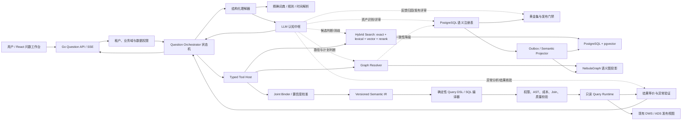
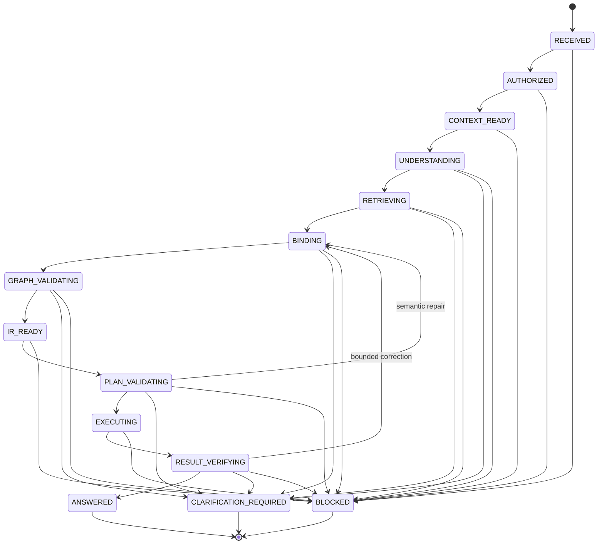

# 智能问数系统技术架构与实施方案

> 面向当前 `intelligent_report_generation_system` 仓库，技术栈为 Golang + React，图数据库采用 NebulaGraph，向量检索复用 PostgreSQL + pgvector。
> 文档版本：1.0；设计日期：2026-08-05；默认业务时区：Asia/Shanghai。
> Codex 原子任务计划：[ASK_DATA_CODEX_TODO.md](./ASK_DATA_CODEX_TODO.md)。

## 1. 技术结论

要把智能问数做到可验证的 95%，不能采用“把库表结构一次性塞给大模型，让模型直接写 SQL”的方案。建议建设一条受治理、可回放、能澄清、能自我纠错的链路：

1. 只允许查询已发布、已物化、粒度明确的 DWS/ADS 稳定视图，首期不开放 ODS/DWD 任意 Text-to-SQL。
2. PostgreSQL 中建设版本化语义层，保存指标、度量、维度、维度值、关系、时间口径、权限、质量规则和认证样例，并作为唯一事实源。
3. pgvector 负责指标、维度定义、低基数非敏感维度成员及认证问法的混合召回；精确词典、全文检索、向量召回、图约束和重排共同决定候选，不能只依赖向量相似度。
4. NebulaGraph 保存语义层的可重建图投影，负责指标—模型—维度—维度值—数据集—Join 路径的兼容性约束与路径搜索，不保存指标定义的唯一真相。
5. LLM 是全流程认知中枢：参与语义资产建设、问句理解、候选判断、消歧、计划选择、异常分析、结果核验、反馈归因和发布评审；它通过结构化判断与工具动作推动流程，但不能绕过权限、版本、图约束和编译器，也不能直接提交可执行 SQL。
6. 绑定后的意图进入版本化 `Semantic IR`；Go 编译器基于可信语义对象和现有 Dataset DSL 生成参数化 SQL，随后执行 AST、权限、成本、Join 基数和结果一致性校验。
7. Question Orchestrator 以状态机驱动 Agent Loop，通过工具多次检索、核对、编译、试探和纠错；普通问题通常 1～2 次模型调用，复杂问题最多 4 次模型调用、6～8 次工具调用。
8. 当系统不能证明唯一正确时，必须提出带候选含义的定向澄清问题；澄清是保障准确率的一部分，不是失败。
9. 95% 必须通过至少 2,000 条双人复核、密封、与待发布语义版本绑定的端到端黄金集证明：观测严格正确率至少 96%，95% Wilson 置信下界至少 95%，P0 和安全样本必须 100% 通过。

这套方案可以达到目标的原因，不是单纯依赖“大模型更强”，而是让 LLM 在每个关键节点基于新证据持续认知和决策，同时把可能出错的自由生成收缩为“召回候选—LLM 裁决—图验证—确定性编译—LLM/规则联合核验—低置信澄清”，并用可度量的发布门禁持续拦截回归。

## 2. 当前仓库评估与落地边界

### 2.1 可以直接复用的能力

| 现有能力 | 代码/部署位置 | 在智能问数中的复用方式 |
|---|---|---|
| 控制面 PostgreSQL + pgvector | `compose.yaml` | 保存语义注册表、词典、向量、问数运行状态、黄金集和反馈 |
| 独立 PostgreSQL 数仓 | `postgres-warehouse` | 查询已发布 ODS/DIM/DWD/DWS/ADS 物化视图；问数首期只开放 DWS/ADS |
| Dataset DSL V1 | `internal/dataset` | 复用字段稳定 ID、表达式 AST、粒度、时间字段、分析合同和版本哈希 |
| 参数化安全编译器 | `internal/querycompiler` | 从可信 Query DSL 编译 PostgreSQL SQL，继续执行标识符白名单和值绑定 |
| 查询执行与审计 | `internal/queryruntime` | 复用只读仓库账号、查询超时、行数限制、执行审计和取消机制 |
| 权限、租户、业务域 | `internal/access`、`internal/policy` | 在召回前、语义绑定前和执行前做三次权限裁剪 |
| Embedding Provider | `internal/embedding` | 复用 OpenAI-compatible `/embeddings`、维度检查和输入预算 |
| 混合召回样板 | `internal/assetembedding` | 复用确定性文档、outbox、RRF、表优先召回和词法降级思想 |
| 多模型与 AI 审计 | `internal/ai` | 复用 Provider Pool、严格 JSON Schema、重试、Token/成本审计；扩展问数 Purpose 和循环协议 |
| React 权限与 API 基础 | `web/src` | 新增问数工作台、澄清卡片、结果可视化、执行解释和反馈界面 |

### 2.2 必须重新建设的能力

历史迁移 `000026`～`000193` 曾设计指标、维度、语义 QA、NebulaGraph、黄金集和 Tool Host，但 `000195_remove_decommissioned_features.up.sql` 已明确删除这些运行时表，`scripts/verify-database.sh` 也要求它们不存在；当前 Go API、Worker 和 React 中没有可运行的智能问数服务。

因此不要回滚 `000195`，也不要假设历史表仍存在。建议从后续新迁移开始，在控制库中新建独立 `askdata` schema，避免与退役的 `platform.semantic_*` 名称和验证规则冲突。历史迁移可以作为设计素材，但必须用当前业务边界重新实现、测试和上线。

### 2.3 首期准确率适用范围

95% 只能对明确范围承诺：

- 已纳入语义层并发布的业务域；
- 已认证指标、维度和关系；
- 已建立索引策略的维度成员；
- 首期支持聚合、分组、筛选、排序、Top N、环比、同比和有限派生指标；
- 查询当前仓库的已发布 DWS/ADS 稳定视图；
- 中文为主，允许常见中英混输；
- 系统可对歧义问题澄清、对未覆盖问题拒答。

不应把未治理的任意表查询、跨域自由 Join、预测/归因、复杂窗口计算和任意 SQL 也混入同一 95% 口径。

## 3. 总体架构



### 3.1 分层职责

| 层 | 核心职责 | 不允许做的事 |
|---|---|---|
| 交互层 | 会话、澄清、结果展示、证据解释、反馈 | 在前端拼 SQL 或自行解释业务口径 |
| 编排层 | 状态机、预算、工具循环、重试、终止条件 | 无上限循环、保存模型思维链 |
| 理解与绑定层 | 提取 mention、生成候选、联合消歧、计算校准置信度 | 直接把模型输出名称当成数据库对象 |
| 语义层 | 定义业务概念、版本、来源、粒度、关系、权限和质量 | 保存未经认证的自由文本为生产指标 |
| 检索层 | 精确、词法、向量、样例和历史反馈召回 | 只用一个向量索引决定最终对象 |
| 图层 | 兼容性、Join 路径、血缘、派生和层级约束 | 作为指标公式的唯一事实源 |
| 规划与编译层 | Semantic IR、Query DSL、参数化 SQL、成本计划 | 让 LLM 直接生成或修补 SQL 字符串 |
| 执行与验证层 | 只读执行、超时、限行、质量检查、结果验证 | 使用高权限账号或绕过已发布视图 |
| 评测与治理层 | 黄金集、回归、发布门禁、反馈闭环、版本回滚 | 用用户点赞率替代严格正确率 |

### 3.2 核心范式：LLM 是认知中枢，工具和规则是人的数据工具与制度边界

系统不采用“规则代替模型”，也不采用“模型绕过制度”。正确关系是：

```text
LLM：理解问题、形成假设、选择证据、比较候选、解释异常、作出下一步决策
Tools：检索真实对象、查询图关系、编译计划、执行查询、返回可验证证据
Rules/Policies：定义权限、版本、类型、成本、基数、隐私和发布门禁等不可绕过边界
Orchestrator：保存状态、控制预算、调度 LLM/Tools、判断是否继续、澄清、回答或阻断
```

LLM 的全流程参与是“每个阶段都参与认知、判断或评审”，不是“每个阶段都自由生成最终产物”。例如，LLM 可以判断两个销售额口径哪个更符合问句、分析 Join 探测为何异常、评审结果是否与问题一致；但指标版本必须来自注册表、Join 必须来自认证关系、SQL 必须由编译器生成、安全门禁不能由 LLM 投票关闭。

| 生命周期阶段 | LLM 的认知职责 | Tool/确定性事实 | 不可绕过边界 |
|---|---|---|---|
| 语义资产建设 | 识别候选指标/维度、补全描述、发现同义词和冲突、建议关系 | 扫描 Dataset DSL、字段、画像、血缘、历史问法 | 人工 Owner 审核、Schema 校验、版本发布 |
| 问句理解 | 还原完整意图、识别 mention/角色/省略和上下文 | 词典、时间解析、会话状态 | 严格 JSON Schema、权限前置 |
| 候选判断 | 比较精确/词法/向量候选及证据 | Hybrid Search 返回稳定 ID 和证据 | 不得选择未发布或未授权对象 |
| 消歧 | 结合上下文、定义、成员层级和反例作出选择或提问 | Semantic Contracts、Member Lookup、GraphPlan | 置信阈值和候选 margin 不足必须澄清 |
| 计划选择 | 选择指标组合、维度角色、模型和认证关系路径 | 图路径、粒度、基数、成本、质量状态 | Semantic IR 校验、fanout policy |
| 编译与修复 | 解释 IR/编译错误并决定回到哪一语义决策 | 确定性编译器、AST Validator、EXPLAIN | 禁止生成/提交任意 SQL |
| 异常分析 | 分析空结果、数据异常、候选差异和计划风险 | 验证查询、质量规则、基数探测 | 有界查询预算、敏感数据保护 |
| 结果核验 | 判断结果是否回答原问题、是否存在口径或趋势异常 | 结果摘要、结果 hash、对账和质量证据 | 规则校验失败不能被 LLM 覆盖 |
| 反馈归因 | 把反馈归因为指标、维度、成员、时间、关系、数据或表达问题 | 运行工件、绑定证据、用户选择 | 反馈不能直接修改生产语义 |
| 发布评审 | 汇总变更影响、失败聚类和残余风险，给出发布建议 | 密封黄金集、投影水位、安全集 | 数据库发布门禁不通过不能激活 |

因此系统应保留两类输出：一类是 LLM 的结构化认知结论和下一动作，另一类是工具返回的事实证据与确定性验证结果。审计记录结论、动作、证据 ID 和 hash，不保存隐藏思维链。

## 4. 语义层完整设计

### 4.1 核心概念

- **度量 Measure**：可以聚合的底层数值，例如订单金额、退款金额、订单行数。
- **指标 Metric**：有业务含义、计算公式、默认筛选、单位、粒度和负责人约束的度量或派生结果，例如“已支付销售额”“客单价”。
- **维度 Dimension**：用于分组或筛选的业务分析轴，例如地区、渠道、客户等级、统计月份。
- **维度成员 Member**：维度的规范值，例如地区维度中的“华东区”。
- **语义模型 Semantic Model**：绑定一个已发布数据集/物化视图，声明事实粒度、可用度量、可用维度、默认时间和关系。
- **关系 Relationship**：模型之间或实体之间经过认证的 Join 方向、条件、基数、时间有效性和扇出策略。
- **业务词 Term**：高频表达与语义对象的显式映射，例如“GMV”“成交额”映射到某指标版本。
- **认证样例 Certified Example**：经过人工批准的自然语言问法与 Semantic IR，不保存为可复制 SQL 模板。

### 4.2 语义层必须包含什么，以及为什么

| 对象 | 必备属性 | 建设原因 |
|---|---|---|
| Domain/Subject | 业务域、主题、Owner、适用人群 | 先缩小搜索空间，避免同名指标跨域误绑 |
| Entity | 订单、客户、商品等实体和主键 | 明确“客户数”统计的是客户实体而不是记录数 |
| Semantic Model | 数据集版本、物化版本、事实粒度、时间字段、时区 | 决定指标能否在正确粒度计算 |
| Measure | 字段 ID、聚合、可加性、单位、空值策略 | 避免金额求平均、库存跨时间求和等错误 |
| Metric Version | 公式 AST、依赖、默认过滤、单位、精度、时间语义 | 让“销售额”成为稳定业务合同，而非字段猜测 |
| Dimension | 字段 ID、类型、用途、层级、基数、敏感性 | 区分分组维度、过滤维度和不可检索维度 |
| Dimension Member | member_key、规范值、标签、别名、层级路径、有效期 | 把“华东”“华东区”绑定为同一受治理成员 |
| Time Semantics | 日历、财年、周起始日、时区、默认粒度 | 正确解释今年、上月、同比和自然周 |
| Relationship | 左右模型、Join AST、基数、fanout policy、SCD 有效期 | 选择可证明安全的 Join 路径并阻止重复聚合 |
| Cohort/Filter | 认证人群/筛选定义 AST | 支持“活跃客户”等不是单个维度值的概念 |
| Glossary/Term | 词、映射类型、目标 ID、范围、优先级、有效期 | 提供高频映射和租户/业务域覆盖能力 |
| Policy | 对象权限、行列策略、维度值敏感策略 | 保证检索结果和查询结果都不越权 |
| Quality Rule | 新鲜度、完整性、唯一性、非空、对账状态 | 数据质量不达标时阻止“语义正确但数据错误”的回答 |
| Certified Example | 问句 hash/脱敏文本、IR、结果 hash、适用版本 | 为检索、Few-shot 和回归提供高质量证据 |
| Release | semantic_version、content_hash、对象清单、投影状态 | 保证 PostgreSQL、向量和图在同一版本上回答 |

### 4.3 建议的控制库表

在新 `askdata` schema 中建设，所有业务表均包含 `tenant_id`、RLS、版本和审计字段：

```text
askdata.domains
askdata.business_terms
askdata.entities
askdata.semantic_models
askdata.measures
askdata.metrics
askdata.metric_versions
askdata.metric_dependencies
askdata.dimensions
askdata.dimension_hierarchies
askdata.dimension_members
askdata.dimension_member_aliases
askdata.relationships
askdata.cohorts
askdata.quality_rules
askdata.certified_examples
askdata.semantic_releases
askdata.semantic_release_objects
askdata.semantic_release_projections
askdata.search_documents
askdata.embedding_outbox
askdata.question_runs
askdata.question_run_events
askdata.question_artifacts
askdata.tool_calls
askdata.query_feedback
askdata.evaluation_sets
askdata.evaluation_cases
askdata.evaluation_case_reviews
askdata.evaluation_runs
```

指标公式、Join 条件、Filter 和 Semantic IR 必须存 AST/JSON 合同，不能存任意 SQL 片段。发布版本不可原地修改；变更后生成新版本、新 content hash，再做全量投影与评测。

### 4.4 与已有数仓的接入过程

1. 扫描 `platform.datasets`、`dataset_versions`、`dataset_fields`、`dataset_materializations` 的当前已发布版本。
2. 只导入 `layer IN ('DWS','ADS')` 且有 ACTIVE 发布视图、输出粒度和稳定 schema hash 的对象。
3. LLM 读取 Dataset DSL 的 `Field.Role`、`SemanticType`、`AnalysisContract`、`FactContract` 和业务描述，识别并解释候选度量、指标、维度、别名与潜在冲突；候选不能自动成为认证指标。
4. LLM 辅助数据管理员补齐指标名称、别名、公式意图、默认过滤、单位、Owner、可用维度和时间口径；确定性 Validator 检查 AST、类型和引用，最终由业务 Owner 审核。
5. Dimension Profiler 通过仓库只读连接扫描维度成员；LLM 对成员聚类、别名候选和层级异常给出判断，系统按索引策略生成规范成员、别名和层级路径，人工审批高风险合并。
6. LLM 基于现有 DSL Join、数据集血缘和基数探测识别关系候选并分析风险；只有通过 Join 基数、扇出和权限验证的关系才能认证。
7. 创建语义发布包；PostgreSQL 注册表、pgvector 文档、NebulaGraph 图均投影成功且 content hash 一致后才可激活。
8. 对该发布包跑黄金集；通过门禁后切换活动版本。已有运行继续固定旧版本，新问题使用新版本。

## 5. 用户输入如何变成完整意图

### 5.1 标准理解合同

用户进入智能问数前，认证会话已经固定唯一业务域；Question API 将策略范围收窄为该领域。模型第一次
输出的不是 SQL，而是带原文 span 的结构化合同。`domainHypotheses` 不再承担路由：模型可省略该字段的
候选内容，服务端会用策略证据确定性写入唯一领域、`score=1`；模型返回其他领域时失败关闭。

```json
{
  "domainHypotheses": [{"domainId": "sales", "score": 1}],
  "metricMentions": [
    {"text": "销售额", "start": 11, "end": 14, "aggregationHint": "DEFAULT"}
  ],
  "dimensionMentions": [
    {"text": "月", "start": 8, "end": 9, "role": "GROUP_BY"}
  ],
  "valueMentions": [
    {"text": "华东区", "start": 4, "end": 7, "dimensionHint": "地区"}
  ],
  "time": {
    "expression": "今年",
    "grain": "MONTH",
    "comparison": "YEAR_OVER_YEAR",
    "timezone": "Asia/Shanghai"
  },
  "ordering": [],
  "limit": null,
  "unresolvedSpans": []
}
```

该合同只描述用户说了什么，不允许填物理表名、列名或未检索到的对象 ID。随后由 Go Binder 将 mention 绑定到语义对象的稳定版本 ID。

### 5.2 逐步处理流程

1. **会话上下文重写**：将“那按地区呢”“换成去年”等追问与上一轮已确认的指标/维度合并，但保留本轮覆盖关系。
2. **确定性规范化**：全半角、大小写、数字单位、日期、停用语气词、常见比较词、行政区后缀和中英文符号规范化；保留原始字符位置。
3. **最长词典匹配**：使用 Trie/Aho-Corasick 对业务词、指标别名、维度别名、成员别名做领域内最长匹配；这些命中作为 LLM 判断的高可信证据，租户规则覆盖平台规则。
4. **规则解析**：确定性识别同比、环比、Top N、升降序、总计、平均、按/每个、时间范围和粒度，并把规范结果与冲突一并交给 LLM。
5. **LLM 完整理解**：LLM 综合会话、词典命中、规则结果和残余文本，输出严格 JSON span、角色、假设、冲突和下一步证据需求。
6. **分类型候选召回**：LLM 决定需要调用哪些检索工具；指标、维度定义、维度成员、时间/人群分别走独立索引，不能在同一向量池里竞争。
7. **候选认知判断**：LLM 阅读候选定义、正反证据和认证样例，比较业务含义；系统仍只允许它选择真实、已发布、已授权的稳定 ID。
8. **图约束与计划判断**：Graph Tool 返回可用模型、兼容维度、成员归属和 Join 路径，LLM 分析路径是否符合用户意图；不可行组合由规则删除。
9. **联合绑定**：算法对“指标 + 分组维度 + 过滤维度 + 成员 + 时间 + 模型”做全局 Beam Search，LLM 对 Top Bundle 作语义裁决，而不是逐词独立取 Top 1。
10. **重排与校准**：Cross-encoder/结构化 LLM 对 10～30 个受约束候选重排；最终置信度由校准器基于 LLM 判断、检索、图和规则特征计算，不采用模型自报 confidence。
11. **缺口判断**：LLM 分析残余 span、候选差距、权限、数据质量、关系、公式和执行成本，提出继续取证或澄清建议；不可绕过的门禁最终决定是否允许直接回答。

### 5.3 指标识别如何达到高准确率

指标候选得分建议由以下证据组合：

```text
metric_score =
  exact_alias_score
  + lexical_score
  + vector_score
  + domain_prior
  + certified_example_score
  + dimension_compatibility_score
  + conversation_context_score
  - ambiguity_penalty
  - stale_or_quality_penalty
```

关键机制：

- 指标别名必须按业务域生效；“收入”在财务域和电商域不能共享无范围映射。
- 指标检索文档必须包含业务定义、公式摘要、单位、默认筛选、适用实体、粒度、时间字段、可用维度和反例，不只包含指标名称。
- “客户数”“订单数”必须通过实体和去重键区分 `COUNT(*)`、`COUNT(order_id)` 和 `COUNT(DISTINCT customer_id)`。
- 派生指标必须展开已发布依赖图；不允许模型临时编造比率公式。
- 对“经营情况”“销售怎么样”等宽泛问题，只能映射到已认证 KPI Bundle，或要求用户选择指标。
- 认证样例参与召回，但最终仍需版本、权限和图约束验证，不能直接复制历史 SQL。

### 5.4 维度和维度值识别如何达到高准确率

用户提出的“维度描述 + 维度值作为 key”是正确方向，但需要扩展为多路证据：

```text
member_vector_key =
  业务域 + " | 维度:" + 维度名称 + " | 描述:" + 维度描述
  + " | 层级:" + hierarchy_path + " | 值:" + canonical_label
  + " | 别名:" + aliases
```

同时维护确定性键：

```text
exact_member_key = tenant_id + dimension_id + normalize(canonical_value_or_alias)
```

识别过程必须先确定候选维度，再在候选维度内查成员。不能把“苹果”直接在全库维度值中做一次 ANN，因为它可能是品牌、商品、公司或水果类别。

增强方式包括：

1. **唯一精确别名优先**：在同一候选维度内唯一命中时直接绑定；跨维度同名时仍需上下文消歧。
2. **别名与规范值分离**：规范值用于执行，别名用于检索；别名变更不改历史成员身份。
3. **层级路径**：保存“华东/上海/浦东”路径，使“上海”可与省、市、区域角色共同判断。
4. **领域和指标兼容性**：指标只能使用语义模型声明的维度；不兼容候选即使向量高也淘汰。
5. **Span 角色判断**：区分“按华东大区”中的分组意图和“华东区的销售额”中的筛选意图。
6. **拼音、简称和编码索引**：对中文地名、组织缩写、商品码建立可治理的词法别名，不依赖 embedding 猜测。
7. **成员有效期**：组织、区域等变化时按查询时间选择当时有效成员；不把已失效成员静默映射到当前成员。
8. **负样本与反例**：对容易混淆的成员对维护 hard negatives，训练或校准重排器。
9. **高基数策略**：客户、订单号等高基数维度不全量向量化，使用精确/前缀/受控模糊查询并要求维度上下文。
10. **敏感值策略**：个人信息、受限组织值不得发送给 embedding 或 LLM；只允许数据库内精确匹配或禁止问数。
11. **空值和默认值治理**：UNKNOWN、测试值、哨兵日期不能成为正常成员候选。
12. **主动学习**：将澄清选择、纠错和未命中聚类成候选别名，经管理员审批后进入下一语义发布。

### 5.5 联合绑定比独立分类更重要

假设“华东地区的客户销售额”同时召回两个指标和三个维度。如果逐项独立取最高分，可能得到不兼容组合。Joint Binder 应构造候选束：

```text
Bundle = MetricVersion + SemanticModel + GroupDimensions
       + FilterDimensions/Members + TimeSpec + RelationshipPath
```

对每个 Bundle 计算：检索分、精确证据、图兼容、粒度兼容、关系风险、权限、数据质量和执行成本，再保留 Top N。只要最优与次优差距不足、或任何关键绑定未经证明，就进入澄清。

## 6. 高频映射词体系

高频词不是一张随意维护的同义词表，而是版本化语义资产：

| 字段 | 说明 |
|---|---|
| `term` | 用户常用表达，如“GMV”“华东”“本财年” |
| `term_type` | METRIC、DIMENSION、MEMBER、TIME、COHORT、OPERATOR |
| `target_object_id/version` | 稳定语义目标；时间/操作符可指规范代码 |
| `domain_id` | 生效业务域，允许平台默认与租户覆盖 |
| `match_mode` | EXACT、PREFIX、SUFFIX、REGEX_SAFE、VECTOR |
| `priority` | 确定性冲突排序；不能用它掩盖同级歧义 |
| `negative_contexts` | 明确不适用的上下文 |
| `valid_from/to` | 生效期 |
| `source` | 人工、黄金集、反馈候选、导入 |
| `review_status` | DRAFT、APPROVED、DEPRECATED |

精确规则和映射变更后可立即参与草稿评测，但只有随语义发布包通过回归后才能进入生产。系统可以自动挖掘词频和映射建议，不能自动发布业务映射。

## 7. 向量化检索设计

### 7.1 索引分区

至少分为五类文档，分别设置 Top K、阈值和重排逻辑：

- `METRIC`：指标名称、别名、定义、单位、实体、粒度、默认过滤、可用维度。
- `DIMENSION`：维度名称、别名、描述、类型、层级、适用模型。
- `DIMENSION_MEMBER`：维度上下文 + 规范值 + 别名 + 层级路径；只收录允许向量化的成员。
- `BUSINESS_TERM`：高频术语本身；映射结果不混入向量文本，避免相互污染。
- `CERTIFIED_EXAMPLE`：脱敏问法摘要 + 规范意图特征，用于相似问法召回。

### 7.2 混合召回流程

1. 先按 tenant、domain、权限、对象状态、semantic release 做数据库级过滤。
2. 精确别名/编码命中 Top N。
3. 中文二字片段、trigram/全文词法检索 Top 30。
4. HNSW cosine 向量检索 Top 30。
5. 用 RRF 合并，精确唯一命中给予受控加权，但不绕过图验证。
6. 取 Top 10～30 做 Cross-encoder/LLM 重排。
7. 用图约束和数据质量做最终裁剪。

当前仓库的 Qwen3-Embedding-4B 配置为 2,560 维，适合继续使用 `halfvec(2560)`；pgvector 官方说明 `halfvec` 支持最高 4,000 维、HNSW 支持 cosine，并提示多租户共享近似索引会互相影响召回，因此规模上来后应按大租户或业务域分区，而不是仅靠查询后的 tenant 过滤。参考：[pgvector 官方仓库](https://github.com/pgvector/pgvector)。

### 7.3 召回质量要求

- 每个索引维护 exact-search 对照集，定期比较 ANN recall。
- `metric recall@10 >= 99%`、`dimension recall@10 >= 99%`、`member recall@20 >= 99%` 才能进入绑定阶段。
- 小数据集或强 tenant/domain 过滤后优先精确 KNN；HNSW 是性能优化，不是正确性事实源。
- embedding 模型、维度、文档模板版本进入 `input_hash`；不同模型的向量不得混用同一索引。
- embedding 服务失败时降级到精确 + 词法检索；降级后的低置信问题必须澄清，不能假装召回质量不变。

### 7.4 维度成员索引策略

| 策略 | 适用范围 | 实现 |
|---|---|---|
| FULL | 低基数、非敏感、稳定成员 | 精确索引 + 词法 + 向量 |
| EXACT_ONLY | 敏感或代码型值 | 仅数据库内规范值/别名精确匹配，不进模型 |
| ON_DEMAND | 高基数但允许查找 | 在已确定维度内做前缀/受控模糊/Top N 查询 |
| NONE | 禁止检索或无业务意义 | 不能作为自然语言维度值绑定 |

阈值不应全局写死。首批可以用“成员数、变化率、敏感性、平均文本长度、查询频率”决定策略，经过压测后再调整。

`EXACT_ONLY` 的落地边界固定如下：调用侧只在内存中规范化原始 span，并提交
`SHA256(dimension_version_id + NUL + normalized_value)`；数据库函数同时固定当前
tenant/actor/domain、release ID/hash、`POSTGRES_REGISTRY=READY` 水位、精确 DIMENSION/MEMBER
manifest、成员有效期和唯一候选。MEMBER manifest 只保存 `dimensionVersionId` 与最多 64 个
排序且唯一的 opaque `aliasVersionIds`，不得保存 label、lookup hash 或可反查的 alias content
hash。CONFIDENTIAL/RESTRICTED 分别要求 `LOOKUP_CONFIDENTIAL_MEMBER`/
`LOOKUP_RESTRICTED_MEMBER` 的真实 USER 或 ACTIVE ROLE 对象授权；不存在、无权限、歧义、过期、
错误 hash 和未固定发布统一为零行，历史 run 允许继续读取其固定的 `SUPERSEDED` release。

数据库命中返回的 Go 合同仅包含成员/维度版本 ID、content hash 和 label-free evidence，并以
私有 payload/proof 绑定这些字段；调用方只能使用只读 accessor，复制后替换 ID、hash 或 evidence
会失败。原问句敏感 span 不进入 SQL、日志或 evidence；进入 LLM 前，对当前问句、继承上下文
以及所有嵌套 fact 字符串执行等长 Unicode 遮罩，覆盖 NFKC、case-fold、全角和邻接变体。
Reviewer 回显该 span 或其规范化变体时失败关闭。Understanding 的普通 `ExactMatch` 一律拒绝
MEMBER，当前不存在公开的 label-bearing grant，因此 EXACT_ONLY 即使是 PUBLIC/INTERNAL 也不把
命中 label 重新注入模型。

画像本地 observation 仍按 `PUBLIC/INTERNAL + FULL + low-cardinality` 重算 label 资格，并可做
确定性 alias 检查；但给模型的 `DIMENSION_PROFILE` PromptFact 是独立的聚合载荷，不含 label、
normalized value、member hash 或派生 member ID。成员型 LLM reviewer 在实现从 PostgreSQL
`profile_generation` 权威重载并绑定证据前必须保持禁用，不能由公开 Worker、自定义 Store 或
Scanner 间接铸造模型可见的成员标签。

Reranker 对显式 MEMBER candidate 在 request 规范化和反序列化 evidence 校验两层都失败关闭；
在建立 release-pinned authoritative candidate loader/capability 前，不把 MEMBER definition 或
negative examples 送入 reviewer。这里的 Go `internal/` 请求结构只允许由经过 SQL/RLS/release
过滤的可信 typed producer 构造，不是网络或插件输入合同；未来 ORCH 接线不得把这些结构直接
暴露给不可信调用方。若该信任边界改变，必须先为 candidate provenance 和敏感成员扫描结果增加
不可伪造的持久化证明，否则所有 caller-supplied label-bearing LLM 路径都应保持禁用。

## 8. NebulaGraph 语义图设计

### 8.1 定位

NebulaGraph 用来快速回答：

- 指标属于哪个业务域和语义模型；
- 指标支持哪些维度；
- 维度值属于哪个维度和层级；
- 派生指标依赖哪些指标/度量；
- 多模型查询允许走哪条 Join 路径；
- 哪条关系会产生 fanout 或需要预聚合；
- 哪些认证样例支持当前组合。

PostgreSQL 语义注册表仍是事实源。NebulaGraph 是按 semantic release 生成的可重建投影；图写入失败不能让未完成版本被激活。

### 8.2 图模型

建议 Tag：

```text
domain, term, entity, semantic_model, measure, metric,
dimension, member, time_dimension, cohort, dataset, field,
quality_rule, policy, certified_example
```

建议 Edge：

```text
BELONGS_TO_DOMAIN
MODELED_BY
EXPOSES_MEASURE
HAS_METRIC
HAS_DIMENSION
HAS_MEMBER
ROLLS_UP_TO
DERIVED_FROM
USES_MEASURE
COMPATIBLE_WITH
JOINS_TO
FILTERED_BY
GOVERNED_BY
CERTIFIED_BY
SOURCED_FROM
```

`JOINS_TO` 必须保存关系版本、左右键的逻辑字段 ID、基数、方向、fanout policy、有效时间语义和认证状态，但不保存任意 SQL。

### 8.3 多租户与 Space 方案

建议默认使用“每环境一个共享 Space + 服务端强制租户前缀 VID”：

```text
VID = tenant_id + ":" + object_type + ":" + stable_object_id + ":" + version
```

每个 Tag 和 Edge 同时保存 `tenant_id` 与 `release_hash`；只有 Graph Service 能访问 NebulaGraph，浏览器、LLM 和普通 API 用户都不能提交 nGQL。Graph Service 只接受稳定对象 ID 的 typed request，并由服务端生成参数化/转义后的有界 nGQL。

对极高隔离要求的大租户可使用独立 Space 或独立集群。官方 `nebula-go` 的 Session Pool 与单个用户、单个 Space 绑定，因此如果采用每租户 Space，需要维护多 Session Pool 和生命周期管理；服务端与 Go Client 必须锁定兼容版本，不能依赖 master/nightly。参考：[NebulaGraph 官方 Go Client](https://github.com/vesoft-inc/nebula-go)。

#### 8.3.1 已落地的开发基线

截至 2026-08-06，开发环境锁定 NebulaGraph metad/storaged/graphd 与
`github.com/vesoft-inc/nebula-go/v3` `v3.8.0`。共享 Space 使用
`partition_num=1`、`replica_factor=1`、`FIXED_STRING(256)` VID；这只是开发拓扑，不能外推
生产 partition、副本或容量。

当前 init 只创建 GraphPlan Adapter 已冻结并实际使用的 Schema 子集：

```text
Tags: semantic_model, metric, dimension, member
Edges: MODELED_BY, HAS_DIMENSION, HAS_MEMBER, JOINS_TO
```

每个对象均保存 tenant/domain/release 属性，`JOINS_TO` 保存关系版本、Join 类型、基数、fanout
policy 与认证状态。8.2 的完整目标模型仍由后续 Projector/Resolver 合同逐步扩展；未被 typed
Adapter 消费的 Tag/Edge 不得提前创建成看似稳定的生产合同。

运行权限按进程分离：API 只持有目标 Space 的 `GUEST`，Worker 只持有 `USER`，bootstrap root
仅用于 init。首次空卷时先轮换厂商默认 root，再注册 Storage 和创建 Schema/角色；已有 Space、
Schema 或角色与冻结合同不一致时失败关闭。metad/storaged 只在 internal 集群网，graphd 同时加入
internal 客户端网；API/Worker 不能解析 Meta/Storage。graphd 本身不发布端口，本地调试与隔离
验收仅在 init 成功后启动无凭据 TCP proxy，并只绑定宿主 loopback。

正式验收的 project 与 Space 必须由同一随机 nonce 严格关联。验收 Compose 通过专用 override
重置 API、Worker 和 Connection Test Worker 的 service `env_file`，配置展开禁用 env file
解析，因此不会间接读取开发者 `.env`。Go integration 在任何写入前必须反查目标 project 的
proxy published endpoint 和 Compose ownership label，并对四类 Tag、四类 Edge 分别执行
tenant/release 真实排除；只有 Resolve 成功、目标关系消失且无关对照关系仍存在才算隔离通过。

### 8.4 发布投影与降级

```text
DRAFT -> VALIDATING -> PROJECTING -> READY -> ACTIVE -> SUPERSEDED
```

每个 release 必须有以下投影水位：

- `POSTGRES_REGISTRY`
- `SEARCH_INDEX`
- `NEBULA_GRAPH`
- `EXECUTION_SEMANTIC_LAYER`

四者的 `applied_content_hash` 全部等于 release `content_hash` 才能 READY。问数运行开始时固定 release ID/hash，运行中不得自动切换。

NebulaGraph 故障时，优先使用同 release/hash 的认证 GraphPlan 缓存；缓存未命中时可在 PostgreSQL 关系注册表上对少量候选做有界递归查询，得到相同合同但性能下降。绝不能在图不可用时绕过关系验证直接执行向量 Top 1。

## 9. Semantic IR 与 SQL 生成

### 9.1 Semantic IR

最终意图必须变成只引用稳定 ID 的规范合同：

```json
{
  "irVersion": "1.0",
  "semanticReleaseId": "release-uuid",
  "semanticContentHash": "sha256...",
  "modelId": "sales_order_model@v4",
  "metrics": [
    {"metricVersionId": "net_sales@v3", "alias": "net_sales"}
  ],
  "groupBy": [
    {"dimensionVersionId": "stat_month@v2", "grain": "MONTH"}
  ],
  "filters": [
    {
      "dimensionVersionId": "sales_region@v5",
      "operator": "IN",
      "memberIds": ["east_china@v2"]
    }
  ],
  "timeRange": {
    "dimensionVersionId": "order_date@v2",
    "start": "2026-01-01",
    "endExclusive": "2026-08-06",
    "timezone": "Asia/Shanghai"
  },
  "comparison": {"type": "YEAR_OVER_YEAR"},
  "sort": [],
  "limit": 500
}
```

IR 校验包括：版本固定、对象存在、权限、指标和模型兼容、维度可用、成员归属、时间范围、比较口径、结果粒度、最大行数和查询复杂度。

### 9.2 确定性编译

1. 从 Metric Version 读取公式 AST 和默认过滤。
2. 从 Semantic Model 读取已发布 Dataset Version、Materialization 和物理视图白名单。
3. 从 Dimension/Member 读取逻辑字段 ID 与规范绑定值。
4. 从 GraphPlan 读取唯一认证关系路径。
5. 将 IR 展开为临时、不可持久修改的 Query DSL。
6. 复用 `dataset.Validate` 和 `querycompiler.Compile` 生成 PostgreSQL 参数化 SQL。
7. 编译结果保存 plan hash，不在普通审计表保存原始问题、参数明文或结果行。

LLM 在编译阶段继续参与：它分析错误属于指标、维度、成员、时间、关系还是计划选择，并决定重新取证、换候选、修改 Semantic IR 或请求澄清；但不能对编译错误返回一段“修正 SQL”。所有修复必须回到 IR 或语义合同层，再由编译器重新生成 SQL。

### 9.3 SQL 安全和正确性门禁

- 只允许 `SELECT`/CTE；禁止 DDL、DML、COPY、外部函数和不在白名单的 UDF。
- 标识符来自发布视图白名单，用户值全部绑定参数。
- 用数据库只读角色和只读事务执行；PostgreSQL 官方文档说明只读事务会阻止常见 DML/DDL。参考：[PostgreSQL SET TRANSACTION](https://www.postgresql.org/docs/16/sql-set-transaction.html)。
- 设置 `statement_timeout`、`lock_timeout`、最大扫描/结果行数和每租户并发预算。
- 执行前使用 `EXPLAIN (FORMAT JSON)` 做计划成本、全表扫描、Join 行数和聚合风险检查；不要把 `EXPLAIN ANALYZE` 当作安全预检，因为它会实际执行可执行部分。
- 对 MANY_TO_MANY、ONE_TO_MANY 后聚合、非可加指标、SCD2 和跨事实 Join 执行专项验证。
- 执行后检查输出 key 唯一性、重复行、数值类型、空值、除零、结果行数、时间覆盖、数据新鲜度和质量规则。
- 对空结果，先验证成员存在、时间有数据和权限裁剪，再决定回答“无数据”还是修正候选。

## 10. Agent Loop 与 Tools

### 10.1 为什么需要以 LLM 为中枢的应用层 Loop

当前 `internal/ai` 已支持严格 JSON Schema、Tool 角色和多模型，但 Provider Request 仍以结构化补全为主，没有完整的原生 tool-call 参数合同。首期建议实现供应商无关的应用层动作协议：LLM 在每个阶段读取当前状态和新证据，输出 `CALL_TOOL`、`PROPOSE_BINDING`、`PROPOSE_PLAN`、`ANALYZE_ANOMALY`、`VERIFY_RESULT`、`FINALIZE`、`CLARIFY` 或 `BLOCK`；Tool Host 执行后把脱敏事实作为 Tool Message 回传。这样 LLM 始终是认知和决策中心，DeepSeek、GLM 或其他 OpenAI-compatible 模型又可共用同一状态机，不依赖某家原生 Function Calling 细节。

### 10.2 工具清单

| Tool | 输入 | 输出 | 纠错用途 |
|---|---|---|---|
| `search_semantic_objects` | mention、类型、domain、release | 候选 ID、分数、证据 | 扩大或收缩指标/维度候选 |
| `get_semantic_contracts` | 稳定对象 ID | 公式、粒度、单位、Owner、状态 | 比较同名指标真实含义 |
| `lookup_dimension_values` | dimension ID、value mention | member ID、别名、路径 | 在正确维度内消歧成员 |
| `get_certified_examples` | 理解摘要 | 相似认证 IR | 补充规范问法证据 |
| `resolve_graph_plan` | 候选 bundle | 兼容模型、Join 路径、风险 | 删除不可能组合 |
| `validate_semantic_bundle` | 完整 bundle | 缺口、冲突、置信特征 | 决定继续、澄清或编译 |
| `get_data_quality_status` | model/metric/time | 新鲜度和质量门禁 | 阻止错误数据回答 |
| `compile_semantic_query` | Semantic IR | plan hash、参数合同 | 确定性生成查询 |
| `validate_query_plan` | plan hash | AST/权限/成本/风险 | 在执行前发现错误 |
| `probe_join_cardinality` | path、时间范围 | 有界基数证据 | 验证 fanout 假设 |
| `execute_query_plan` | 认证 plan | 结果摘要/引用 | 正式只读执行 |
| `execute_validation_query` | 预定义验证类型 | count/distinct/coverage | 校验空结果和聚合 |
| `compare_candidate_results` | 两个认证候选计划 | 差异摘要 | 难例下比较候选，不暴露原始行 |
| `request_clarification` | 冲突点、候选 | 可读选项 | 定向澄清 |

### 10.3 状态机



图中省略非终态的同态 checkpoint。可执行规范以数据库
`askdata.valid_question_run_transition` 与 Go `orchestrator.CanTransition` 的一致矩阵为准；
所有 BLOCK/CLARIFY 边都必须保存稳定原因和可重放事件，三个终态本身不可再更新。
Understanding、Binding Bundle、GraphPlan、Semantic IR、QueryPlan、Result hash 只能在各自
治理阶段首次出现并按上游顺序形成连续链；除 PLAN/RESULT → BINDING 的显式纠错会清空
Binding 之后的陈旧链外，已有 hash 不得清空或覆盖，ANSWERED 前也不得一次性补写历史阶段。

### 10.4 循环预算和终止条件

```go
for step := 0; step < budget.MaxSteps; step++ {
    action := planner.Next(state.SanitizedSnapshot())
    result := toolHost.Execute(ctx, action, pinnedRelease, policyScope)
    state.Apply(action, result)

    if state.ReadyToAnswer() || state.NeedsClarification() || state.Blocked() {
        break
    }
    if !state.MadeProgress() {
        return ErrToolNoProgress
    }
}
```

建议预算：最多 4 次模型调用、8 次工具调用、2 次正式查询、3 次验证查询、25 秒总时限。普通精确命中走“单次 LLM 理解与裁决 + 确定性工具验证”的 fast path，不进入多轮模型循环；复杂问题才启动多轮取证和自我纠错。每个 LLM 决策和 Tool 调用记录 action、参数 hash、结果 hash、证据 ID、release hash、权限范围、耗时和错误码；不记录模型隐藏思维链。

## 11. 95% 正确率的定义、证明与持续保障

### 11.1 不能只看一个“SQL 能运行率”

生产主指标定义为：

```text
Strict E2E Correctness =
  结果等价且语义计划全部正确的直接回答数
  + 对歧义/不可回答问题做出正确澄清或拒绝的数量
  ----------------------------------------------------
  全部评测问题数量
```

直接回答必须同时满足：

- 指标版本正确；
- 分组维度正确；
- 过滤维度及成员正确；
- 时间范围、时区和粒度正确；
- 聚合、默认过滤和比较口径正确；
- 模型和 Join 路径正确；
- 权限和数据质量正确；
- 结果与黄金结果等价。

任何一个关键项错误，该问题都算错。结果等价时对行排序、Decimal 精度、时区、NULL 和浮点容差做规范化，不能只比较 SQL 字符串。

### 11.2 同时约束准确率和覆盖率

只靠大量拒答可以虚假提高准确率，因此必须同时发布：

- `strict_e2e_accuracy >= 96%`；
- 95% Wilson lower bound `>= 95%`；
- 对明确可回答问题的直接回答覆盖率 `>= 85%`；
- 正确澄清/拒答率 `>= 95%`；
- P0 核心问题 `= 100%`；
- 越权、提示注入、敏感值和缓存隔离安全集 `= 100%`；
- 敏感数据泄漏 `= 0`。

2,000 条以上样本、观测正确率 96% 左右，才能让 95% Wilson 下界接近或超过 95%；小样本的“95%”不应作为生产承诺。

### 11.3 分阶段质量指标

| 阶段 | 质量指标 | 建议发布线 |
|---|---|---|
| 词典/规则 | 时间、比较、Top N 解析准确率 | >= 99% |
| 指标召回 | Gold metric recall@10 | >= 99% |
| 维度召回 | Gold dimension recall@10 | >= 99% |
| 成员召回 | Gold member recall@20 | >= 99% |
| 指标绑定 | Top-1 precision/F1 | >= 97% |
| 维度绑定 | mention-level F1 | >= 97% |
| 成员绑定 | mention-level F1 | >= 97% |
| GraphPlan | 正确模型/关系路径率 | >= 99% |
| IR | 全字段 strict match | >= 97% |
| SQL/结果 | 结果等价率 | >= 96% |
| 安全 | 关键安全样本通过率 | 100% |

这些阶段指标用于定位故障，不能相乘替代端到端评测。最终是否达到 95% 只看密封 E2E 集和线上审计抽样。

### 11.4 黄金集设计

至少覆盖：

- 高频简单问题 35%；
- 时间、同比、环比 15%；
- 多维分组、Top N 15%；
- 维度同名和成员歧义 10%；
- 指标同名、别名、派生指标 10%；
- 关系/Join/扇出 5%；
- 空结果、数据质量、过期成员 5%；
- 越权、注入、敏感数据和不可回答 5%。

按业务域、用户角色、语言变体、问题复杂度和线上频率分层抽样。开发集用于调优，Validation 用于阈值，Sealed 集在发布前不可查看，Production Regression 来自经审批的线上问题。每条 Sealed Case 需两名独立评审确认问句、预期 IR、结果 hash 和安全期望。

数据库实现必须把“独立评审”和“当前内容”作为可重算事实，而不是信任调用方汇总值：case
保存脱敏策略 hash、expected path/IR/result hash 和当前内容编辑者；原作者及当前内容编辑者均
不得评审同一 content hash，每条 case 只有两个唯一 review slot。Seal 在同一事务锁定 set、
case、review，重新确认两条当前 APPROVED 事实后才计算稳定 manifest hash；USER 模式随后不再
读取密封问句和评审，只有 SYSTEM 评测 worker 可读。评测运行只追加写，必须固定 set/case
content hash、release ID/semantic version/content hash、expected/actual path/IR/result 和数仓
snapshot/freshness；等价结论在 hash 不同时必须绑定 comparison report hash，敏感泄漏必须由
worker 显式写入且不能使用默认 false。Production Regression 未密封或 set 已 RETIRED 时不得
新增运行。用户反馈只绑定原 actor 的终态 question run，使用结构化 issue type，不能直接修改
答案或生产语义。

### 11.5 为什么这套设计能达到 95%

| 主要错误来源 | 架构控制 | 结果 |
|---|---|---|
| 同名指标/维度 | 会话已选业务域强制 Pin + 词典 + 多路召回 + 图兼容 | 先排除其他领域，再把域内模糊选择收缩成可证明候选 |
| 维度值识别错 | 先维度后成员 + 描述/值复合 key + 层级/别名 | 避免全局值碰撞 |
| 模型幻觉对象 | 稳定 ID 绑定 + 注册表校验 | 未发布对象无法进入 IR |
| Join/粒度错误 | NebulaGraph 路径 + 基数/fanout 验证 | 在 SQL 前阻断重复聚合 |
| SQL 生成错误 | AST/IR 确定性编译 | 把自由生成转为可测试代码 |
| 隐含歧义 | 校准置信度 + 候选 margin + 定向澄清 | 不强答无法唯一确定的问题 |
| 一次推理失误 | Tool Loop + 编译/执行/结果验证 | 用外部证据迭代纠错 |
| 语义变更回归 | Release hash + 密封黄金集门禁 | 未通过评测的版本无法激活 |
| 反馈污染 | 反馈只生成候选，人工审批后发布 | 防止错误点击直接修改生产语义 |

必须明确：架构只能提供达到 95% 的工程条件，不能在没有语义覆盖、黄金集和实际评测结果时提前宣称已经达到 95%。

## 12. 技术选型

| 领域 | 选型 | 原因 |
|---|---|---|
| Backend | 当前 Go 版本 + `net/http` + `pgx` | 与仓库一致；typed tools、状态机和并发控制实现简单 |
| Frontend | React + TypeScript + React Router | 与现有项目一致 |
| Server State | TanStack Query | 管理问数运行、重试、缓存和失效 |
| Streaming | HTTP POST + SSE/fetch stream | 服务器单向推送状态足够，复杂度低于 WebSocket |
| Table | TanStack Table | 大结果表的列、排序和虚拟化控制 |
| Chart | Apache ECharts | 折线、柱状、饼图和组合图覆盖问数结果 |
| Control Plane | PostgreSQL 17 | 已部署；事务、RLS、版本、outbox 和审计适合语义事实源 |
| Vector | pgvector `halfvec` + HNSW + lexical/RRF | 复用现有能力；高维向量和混合检索可控 |
| Graph | NebulaGraph `v3.8.0` + 官方 `nebula-go/v3 v3.8.0` | 兼容 POC 已锁定 3.x fbthrift 客户端；禁止 master/nightly 和不兼容的 v5 gRPC 客户端 |
| Warehouse | 现有独立 PostgreSQL DWS/ADS | 首期减少 SQL 方言和跨源不确定性，提高正确率 |
| Object Storage | 现有 MinIO | 保存大评测结果、离线报告和可重放非敏感工件 |
| Cache | 首期 PostgreSQL 缓存；规模后可选 Redis | 减少首期组件，缓存不作为语义事实源 |
| Async | 现有 PostgreSQL outbox + Worker | 语义投影、embedding、画像和评测可幂等重试 |
| Observability | OpenTelemetry + Prometheus/Grafana | 统一 Trace、Metric、Log，观察每个语义阶段 |

NebulaGraph 开发环境可以单副本部署 graphd/metad/storaged；生产建议按官方兼容矩阵和容量 POC 设计多副本。禁止在 `go.mod` 使用 master/nightly，必须锁定与服务端兼容的 release tag。

## 13. Golang 工程落地

### 13.1 新增 package

```text
internal/askdata/registry        语义对象、版本、发布与仓库映射
internal/askdata/search          精确/词法/向量召回、RRF、重排
internal/askdata/dimension       维度画像、成员、别名和索引策略
internal/askdata/graph           NebulaGraph adapter、GraphPlan、投影
internal/askdata/understanding   规则、时间解析、LLM 理解合同
internal/askdata/binding         Joint Binder、Beam Search、置信度校准
internal/askdata/ir              Semantic IR schema 与规范化 hash
internal/askdata/compiler        IR -> Dataset Query DSL -> SQL
internal/askdata/validator       权限、AST、成本、Join、结果校验
internal/askdata/toolhost        typed tools、预算、脱敏审计
internal/askdata/orchestrator    状态机、循环、澄清和终止条件
internal/askdata/evaluation      黄金集、结果等价、发布门禁
internal/askdata/feedback        反馈、错误分类、候选词挖掘
internal/askdata/http            Question/Admin/Evaluation API
```

### 13.2 对现有模块的最小改造

- `internal/ai`：增加 `PurposeSemanticQuestion`、动作 JSON Schema、完整 Tool Message 回传和模型级循环预算；仍由外层 Orchestrator 决定工具。
- `internal/querycompiler`：增加 Semantic Query 输入适配器；保留原编译器白名单，不让问数路径接受用户表名。
- `internal/queryruntime`：增加 `QUERY_TYPE=SEMANTIC_QUESTION`、结果 hash、EXPLAIN 成本和验证查询审计。
- `internal/policy`：提供按对象 ID 批量过滤语义候选的接口，保证召回前权限裁剪。
- `cmd/worker`：加入 embedding、dimension profile、semantic release projector 和 evaluation job；规模增大后再拆进独立 worker process。
- `cmd/api`：装配 Question API、Tool Host、Graph Adapter、Retriever 和 Orchestrator。
- `internal/config`：增加 NebulaGraph、问数预算、阈值、评测和 release 配置；生产必须显式设置。

### 13.3 API

```text
POST   /api/v1/questions
GET    /api/v1/questions/{runId}
GET    /api/v1/questions/{runId}/events
POST   /api/v1/questions/{runId}/clarifications
POST   /api/v1/questions/{runId}/feedback
POST   /api/v1/conversations/{conversationId}/release-drift
POST   /api/v1/data-requests
GET    /api/v1/data-requests
GET    /api/v1/data-requests/{requestId}
POST   /api/v1/data-requests/{requestId}/submit
POST   /api/v1/data-requests/{requestId}/transition

GET    /api/v1/askdata/metrics
POST   /api/v1/askdata/metrics
GET    /api/v1/askdata/dimensions
POST   /api/v1/askdata/terms
POST   /api/v1/askdata/releases
POST   /api/v1/askdata/releases/{id}/validate
POST   /api/v1/askdata/releases/{id}/activate
POST   /api/v1/askdata/evaluations
GET    /api/v1/askdata/evaluations/{id}
```

`POST /questions` 返回 `runId` 并开始 SSE；事件只包含可展示状态、候选解释和证据摘要，不输出 prompt、SQL 参数明文或思维链。

### 13.4 ORCH-005 已实现 API 合同（2026-08-06）

- 正式路径固定为 `POST /api/v1/questions`、`GET /api/v1/questions/{runId}`、
  `GET /api/v1/questions/{runId}/events`、`POST /api/v1/questions/{runId}/clarifications`；
  全部复用现有 Bearer token、实时 session 和业务域门禁。
- 创建请求要求 `Idempotency-Key`，只把规范问句和幂等键转换成域分离 SHA-256；未显式传入
  `conversationId` 时，由 actor/domain/幂等 hash 确定性生成 UUID，精确重试返回原 run。
- Get/SSE 每次按当前 ACTIVE roles 重算 PolicyScope；创建时固定 ACTIVE release，读取历史 run 时使用
  该 run 的 pinned release/hash，因此 release 被 supersede 后仍可重放，但角色或业务域变化会失败关闭。
- SSE 的 `id` 是数据库 append-only `event_index`；`Last-Event-ID` 只接受 `0..1000000` 十进制整数，
  只发送更大的连续事件。公开事件最大 16 KiB，不包含内部 `Details`、AI request、Tool 原始 payload、
  prompt、SQL、参数、结果行或敏感成员值。
- 澄清请求只接收 completion artifact 已公布的稳定 `optionId`，并创建同 actor/domain/conversation/
  policy/release 的 child run；不接收自由文本。原问句短期加密保留、工件 TTL 和会话删除属于
  `ORCH-006`，不由 HTTP 层提前定义。

### 13.5 NLU-008 会话 Release Pin 与澄清等待（2026-08-08）

- `askdata.conversations` 按 tenant/domain/actor 保存 nullable `pinned_release_id`；新会话不继承历史
  Pin，首轮 run 只有在 `BINDING` 成功转入 `GRAPH_VALIDATING` 时才原子写入当前 ACTIVE Release。
- 创建后续 run 时先重放会话 Pin：相同 ACTIVE 直接使用；`SUPERSEDED/RETAINED` 且未确认返回
  `RELEASE_DRIFT_CONFIRM_REQUIRED + ReleaseDriftView`，列出最多 20 个指标/维度变化；显式确认接口
  在行锁下切换到新 ACTIVE，精确重复确认返回 `replayed=true`。历史 run 继续按原 Release 重放。
- `question_runs` 保存 `clarification_deadline`、`budget_frozen_at` 与 `budget_consumed_json`。进入
  `CLARIFICATION_REQUIRED` 时固定当前预算快照和默认 30 分钟 deadline；恢复 child run 使用该快照
  作为初始消耗量，等待时长不进入运行预算。
- 运行时读取、澄清提交和 `ClarificationExpiryWorker` 共用同一事务过期函数；deadline 到达后写入
  append-only `CLARIFICATION_EXPIRED` 事件并拒绝后续应答。等待期间 Release 变化时，不复用旧 Bundle，
  child run 固定新 ACTIVE 并从 `BINDING` 重新验证。
- API 角色拥有会话 Pin 的最小列权限；Worker 只拥有过期所需的 Question Run 更新列与事件插入列。
  down 迁移完整恢复旧状态机函数，已在真实 PostgreSQL 中通过 down→up→rollback 演练和权限验证。

### 13.6 DR-001 明细取数申请合同（2026-08-08）

- `platform.data_requests` 保存租户、登录后固定的唯一业务域、申请人、可选来源 run、业务用途、
  PUBLISHED 数据集字段引用、SLA、审批/处理/交付状态与 `record_version`；不保存 SQL、查询参数或结果行。
- 有来源 run 时，只允许申请人本人当前领域的 Question Run，并把上下文限制为该 run 固定 Release 中的
  metric/dimension/member ID 与解析后的时间范围；主动申请不要求先触发拒答，但上下文必须从空开始。
- `platform.data_request_events` 只允许 INSERT；`sequence_no = data_requests.record_version`，数据库触发器
  与 Go 状态机共同验证事件链。时间戳仅作审计，不能作为同一时钟刻度内的权威顺序。
- 两张表均启用并强制 RLS。申请人、审批人、会签人和处理人仅在当前 ACTIVE 领域成员关系下可见；
  通用 Worker 无表权限，API 对事件只有 SELECT/INSERT，不能更新或删除历史。
- DR-001 暂以 ACTIVE `DOMAIN_ADMIN` 形成可运行审批集合；真实数据 Owner、安全会签人和 SLA 规则由
  `HUMAN-011` 提供后接入，敏感级推导与会签门禁仍严格归属 `DR-002`。

### 13.7 NLU-009 问题范围白名单与正确拒答（2026-08-08）

- 问题类型冻结为 15 个枚举。规则按未治理数据源、跨领域、预测、临时公式、定义、因果、强明细词、
  排名、比较、比例、多指标、分组、筛选、Bundle、弱明细词、单指标顺序决策；“列出各区域销售额”
  因存在受治理指标 + 分组维度，优先归为 `GROUPED_ANALYSIS`，不会被弱“列出”误判为明细。
- `ScopeLexicon` 同时固定版本、规范排序后的内容 hash 与结构阈值；Classifier 构造时深拷贝。只有规则
  不能确定时才把 15 项闭集交给 LLM，模型返回未知枚举或错误时保留保守规则候选并记录
  `RULE_FALLBACK_REJECTED`。
- `OUT_OF_SCOPE` 使用关闭的 `NextAction(kind,target,prefill)` 合同。`DETAIL_LIST` 唯一指向平台内
  `DATA_REQUEST_DIALOG`；动作不保存原始问题，前端只从当前会话本地状态预填。跨领域说明要求先在平台
  既有入口切换登录领域后分别提问，问数页本身没有领域选择器。
- DR-001 预填只接受规范化 metric/dimension/member UUID 与时间范围。Block 工件的公开投影使用严格
  JSON 解码并重新验证 type/outcome/reason/action 组合，任何 rows、SQL、未知字段、动作目标篡改或
  非拒答上下文都会被丢弃。
- `DEFINITION` 口径卡服务只依赖 `MetricDefinitionRegistry`，类型上没有 Warehouse/Query 依赖；卡片
  固定 `dataQueryIssued=false`、最多 1 次 LLM，并拒绝物理查询文本、版本漂移或无证据合同。
- 评测分别累计正确分类、正确拒答与错误拒答；类型正确且 outcome 为 `OUT_OF_SCOPE` 才进入正确拒答
  分子，避免把诚实拒答当成执行失败。

### 13.8 ORCH-008 RunType 预算与熔断/目标分离（2026-08-08）

- 预算冻结为 `SINGLE_QUERY_FAST`、`SINGLE_QUERY_COMPLEX`、`BUNDLE`、`DEFINITION` 四档；
  `RunType` 保持三值，两个单查询执行路径由 `RunBudgetClass` 区分。业务域只能通过严格 JSON 完整覆盖
  一档预算，未知字段、重复 domain/class、越过全局治理包络或非 Bundle 并发值均失败关闭。
- Loop 先解析 domain override，再以持久化上限与所选预算逐项取更小值；覆盖只能收紧当前运行，不能
  扩权。BUNDLE 的全局包络为 2 LLM、10 Tool、6 正式查询、2 验证查询、30 秒与最多 4 并发计划。
- `P95Target` 与 `HardTimeout` 是两个控制面：越过 P95 只单次记录 `budget_target_exceeded`，不取消
  cognition/tool；达到 HardTimeout 才中断。熔断后的确定性顺序为已有可用结果 `PARTIAL`、已有治理
  证据且可定向询问时 `CLARIFICATION`，否则 `TIMEOUT`。
- 澄清等待同时由内存 `ActiveBudgetClock.Freeze/Resume` 和 NLU-008 的持久化预算快照排除，20 分钟等待
  不减少剩余 HardTimeout。`budget_consumed_json` 不由调用方提供：数据库根据单调标量计数在 INSERT/
  UPDATE 最后阶段生成，覆盖 LLM、Tool、正式/验证查询、step、有效耗时与 exhausted，作为 OPS-006 和
  EVAL-012 的唯一 Run 消费来源。

### 13.9 RPT-CONTRACT-001 Report Definition v1（2026-08-08）

- `api/schemas/report-definition-v1.schema.json` 与 `internal/report/model.go` 冻结同序合同：
  `Report → Page → Section → Block → Zone → Slot → Component`。组件只保存在顶层表，槽位只能通过
  `componentId` 引用；page/section/block/zone/slot/component 分别使用全报告唯一命名空间。
- V1 固定桌面 1920 设计宽、24 列、80×54 基准格、12 间距与 24 内边距；移动端固定单列、12 间距/
  内边距。布局保存逻辑坐标，Block 同时声明移动端 order/visible/heightMode/slotMode，Zone 声明
  `AUTO/FIXED/FR/HIDDEN`、高度边界、网格与溢出策略。
- `dataBinding` 是关闭的二选一联合：`SEMANTIC_IR` 必须内嵌已固定 Release ID/hash 的 Semantic IR、
  Query Plan hash，可选来源 Question Run；`DATASET_FIELD` 必须引用定义内 Data Context 和逻辑字段角色。
  两者不能混合，任何路径均不能保存 SQL。无数据组件允许省略绑定。
- 为同时满足可配置参数和 `additionalProperties:false`，`defaultParameters` 冻结为类型化数组
  `{name,type,stringValue|numberValue|booleanValue}`，不采用开放键值对象。组件 `options` 只暴露
  renderer-independent V1 闭集，下一项 Component Manifest 再按组件 type/version 收窄。
- `report.Decode` 复用统一 strict JSON decoder，并在类型解码前执行 5 MB、24 层、普通字符串 4096
  字符/富文本 64 KB 以及 SQL、连接串、凭据字段、脚本和 HTML 事件属性守卫。Go Validator 继续执行
  页面/章节/分块/槽位/组件数量、布局边界、引用完整性、枚举和 Semantic IR 一致性校验。
- `api/examples/report-definition/` 提供单页数据集报告、多页混合内容报告和 Ask Data 认证语义报告；契约
  测试覆盖三例 round-trip、Schema 对象闭合、核心 `$defs`、全部必需负向边界与六类 ID 重复。

### 13.10 RPT-CONTRACT-002 Component Manifest v1（2026-08-08）

- `api/schemas/component-manifest-v1.schema.json` 与 `internal/report/template/manifest.go` 冻结同序合同：
  type/version、renderer/category、最小/推荐尺寸、维度/度量/时间/角色数据合同、可加性堆叠标记、关闭的
  optionSchema、默认选项、移动策略、交互能力和可选迁移引用。
- 13 个 MVP 组件 Manifest 位于 `internal/report/template/manifests/*.json` 并由 `go:embed` 进入同一个
  `Registry`；注册表按 `type@version` 唯一索引，`List/Get` 返回防御性深拷贝。后续编辑器表单、LLM
  允许属性、数据兼容、最小尺寸和运行时解析必须读取该注册表或它的 API 投影，不得再内嵌副本。
- `OptionSchema.ValidateJSON` 同时校验 Manifest 的 `defaultOptions` 和运行时组件 options：只支持受控的
  boolean/string/integer/number，拒绝未知属性、重复键、错误类型、枚举外值和越界数值。报告组件校验再
  复用同一 Schema，并校验 DATASET_FIELD 角色或 SEMANTIC_IR 的维度/指标数量、时间要求和 Block 尺寸。
- Patch/minor 升级只能新增可选属性；不能增加 required、删除或改型已有属性、收窄 enum/数值区间、
  增加 minSize、收窄数据合同、删除角色/交互或关闭移动支持。Major 升级必须声明上一版本和已注册的
  migrator，缺任一项即构建注册表失败。
- 契约测试枚举 13 个 Manifest，验证 strict decode、注册表隔离、默认/运行时共用选项校验、数据数量与
  角色、最小尺寸、三份 Report Definition 集成，以及 minor-required/major-migrator CI 负例。

### 13.11 RPT-CONTRACT-003 Report Operation v1（2026-08-08）

- `api/schemas/report-operation-v1.schema.json` 将 41 个操作逐一建模为 `oneOf + op.const + typed payload`；
  不存在通用 payload object，也不包含 UNDO/REDO。Go 中每个操作都有独立 payload 类型，Bundle、
  Operation 与 payload 均使用严格 JSON 解码和显式必填键检查。
- 来源冻结为 USER/AI/IMPORT/SYSTEM。单 Bundle 最多 100 个操作，AI 最多 30 个且必须带 aiRunId 与
  page 起始的层级 scope；非 AI 不得夹带 aiRunId。AI 不能直接 TEMPLATE_APPLY、PAGE_DELETE、
  SECTION_DELETE，其他 `*_DELETE` 合计超过 5 个也必须退出协议等待人工确认。
- `GuardAI` 在解析完成、进入应用层之前读取当前 Report Definition，先核对 bundle.reportId，再为
  page/section/block/zone/slot/component 以及显式 filter/interaction 构造祖先路径。scope 必须真实存在且
  page→section→block 祖先一致；每个 targetId 的全部引用路径均须落在 scope 内，避免共享组件通过另一
  槽位产生跨范围副作用。
- AI 白名单违规返回 `REPORT_OP_NOT_ALLOWED_FOR_AI`，当前定义缺失、报告不匹配、scope 不存在或目标越界
  返回 `REPORT_OP_OUT_OF_SCOPE`。这两个错误在 Decode 阶段产生，不会进入后续 apply/审计事务。
- 契约测试覆盖 41 个操作的正例 round-trip 与逐项错误 payload，100/30/5 数量门禁、AI 禁止模板、
  内外 scope，以及 Schema 分支与 Go 冻结枚举完全一致。

### 13.12 QUERY-009 Query Plan Bundle 多计划运行（2026-08-08）

- `query-plan-bundle-v1` 是 KPI Bundle 的执行边界，不是新的临时组合入口。合同固定完整 PolicyScope、
  Semantic Release ID/hash、共享 resolved time/filters、逐项 Semantic IR/IR hash/role/chart type、并发上限
  与 Bundle hash；不携带 SQL、参数或结果行。
- 构建前重算完整 Release Manifest，并要求 CERTIFIED KPI Bundle ReleaseObject、指标、指标绑定模型、
  group/filter/time dimension 全部来自同一 pinned Release。状态不是 CERTIFIED 时返回
  `BUNDLE_NOT_CERTIFIED`；计划/指标/并发上限分别为 6/8/4，不能由领域配置扩权。
- 每个 KPI item 确定性展开成独立 Semantic IR。所有计划共享 PolicyScope、Release、Domain、时间与筛选，
  但各自规范化和计算 IR hash；HEADLINE 使用单值 limit，TREND/BREAKDOWN 使用既有 TopN 默认值。只有
  时间维度 group-by 附着共享粒度，避免把普通分类维度误当时间截断。
- 运行流水线逐项执行普通 compiler、TIME-004 coverage、Plan Validation 与只读 executor。每层都重新
  核对 scope/domain/IR/time 与上层 hash；plan 以根 run UUID + planId 派生独立执行 UUID，任何计划都
  不能共享另一项的 Validation Artifact。
- `BundleRunner` 使用 `errgroup.SetLimit` 和 ORCH-008 的 BUNDLE 独立预算；默认最多四并发、30 秒硬
  deadline。单项失败不取消兄弟计划，结果按原计划顺序保存稳定 failure code；全成功为 `ANSWERED`，
  任一编译/校验/执行/权限/超时失败为 `PARTIAL`，硬超时仍返回此前完成的安全工件。

### 13.13 QUERY-011 PARTIAL 与质量告警结果合同（2026-08-08）

- `query-outcome-v1` 是 ANSWER completion artifact 内的确定性分流合同。`DetermineOutcome` 只读取可信的
  coverage、权限数量、Bundle 计划结果、行数截断、行策略、多源和质量规则证据，按 P1～P6、Q1 固定
  顺序累积；集合规范排序后计算 `outcomeHash`，重放时任何标记、顺序或状态篡改都会失败。
- P1 时间可用区间截断、P2 多指标非空授权子集、P3 Bundle 非空成功子集中的失败/超时、P4 明确行上限
  截断、P5 行策略保留非空子集、P6 多源保留非空响应子集任一成立时均为 `PARTIAL`。P2 合同只有计数，
  不含被过滤指标名称/ID；全过滤、全失败或全超时不伪装成半成功，而作为无可用结果在上游失败关闭。
- Q1 只投影未通过的非阻断 WARNING 规则和治理 EvidenceRef。单独 Q1 为 `QUALITY_WARNING`；与任一 P
  条件并存时顶层仍为 `PARTIAL`，`qualityWarnings[]` 不丢失，保证状态路由与质量说明正交。
- `POST /api/v1/questions/{runId}/add-to-report` 要求 Idempotency-Key 和精确 runVersion，只从当前 actor
  可见的持久化 ANSWER completion artifact 读取 outcome。`PARTIAL` 在任何报告调用前返回
  `RESULT_PARTIAL_NOT_EXPORTABLE`；非 PARTIAL 才交给报告 bounded context 的 `AddToReportBackend`。
  报告 intent/outbox 的事务实现仍由后续报告任务负责，本边界在其缺失时返回服务不可用，不制造成功。

### 13.14 ANS-001 Answer Artifact 与共享引用坐标（2026-08-08）

- `api/schemas/answer-artifact-v1.schema.json` 与 `internal/askdata/answer/model.go` 冻结 L1 结构化层、L2
  叙述层、验证结果和版本来源。顶层及全部嵌套对象关闭未知字段；精确指标值只接受 decimal 字符串，
  headline/cards/chart/tableRef 只能引用稳定 metric/result/dataset/column ID。
- citation span 固定为 `[start,end)` 两整数数组，使用与 NLU-001 相同的 Unicode code-point 偏移。引用面
  是 `summary + "\n" + findings...`，解码后按 span 规范排序，越界、空区间和相互重叠均失败关闭。
- `internal/askdata/shared/coordinate.go` 是问数与报告唯一坐标实现。`CellRef` 固定 `rowKey + columnKey`；
  rowKey 由调用方按受治理 Query group-by 顺序提供，序列化为 `key=value|...`，保留字符以外的 UTF-8
  字节使用大写百分号编码。Parser 要求规范编码、键唯一并保持原顺序，避免 map 顺序或分隔符碰撞。
- Citation 是关闭的三分联合：RESULT_CELL 只允许 CellRef，CONTRACT 只允许 contractId，TIME_SPEC 不带
  外部坐标。降级 Answer 必须 narrative 全空、`passed=false/degraded=true`，未经校验文字无法进入工件。
- `internal/askdata/shared/stale.go` 提供唯一 `Provenance/IsStale`。Answer 将 Prompt、模型策略、校验器、
  词表、Evidence/Result hash、Semantic Release 与图表规则映射到该结构；任一变化或非法当前来源均 stale。
  工件继续写入既有 `askdata.question_artifacts` 的 ANSWER 类型，由数据库不可 UPDATE/DELETE trigger 保护。

### 13.15 RPT-CONTRACT-004 Evidence Bundle v1.1 与 Insight Artifact（2026-08-08）

- `api/schemas/evidence-bundle-v1.schema.json` 与 `internal/report/insight/model.go` 固定来源、精确 Dataset/
  Snapshot/Query/Filter、asOf、实际半开时间区间、分析方法/版本、证据算法版本、事实、质量告警与生成时间。
  `SEMANTIC_IR` 要求 semanticReleaseId/semanticIrHash 非空；`DATASET_QUERY` 要求二者为 null；两者都必须
  固定 datasetVersionId，不允许从当前可变注册表补值。
- Fact 的 currentValue、previousValue、changeRate 只允许规范 decimal 字符串，禁止 JSON number、指数和
  非规范前导零；PERIOD_COMPARISON 必须同时提供基期与变化率。每个 Fact 至少一个 `shared.CellRef`，
  因而问数点击来源与报告结论点击来源在编译期就是同一类型，不能各自解析 rowKey。
- Evidence Bundle 规范化后计算内容 hash。Insight Artifact 必须精确绑定该 hash，冻结 Prompt/模型/
  校验器/词表，内容分 summary/findings/risks/actions，citation span 指向四段按固定顺序换行拼接的文本。
  CURRENT/STALE/FAILED 是关闭状态；FAILED 必须内容/引用全空。人工编辑允许不携带自动引用，但
  `humanEdited=true` 必须同时记录稳定 editor ID 与规范 RFC3339 时间，false 时二者必须为 null。
- Dataset Version、Snapshot、Query、Filter、分析方法、证据算法、Prompt、模型、校验器九类指定因素，
  加上词表与 Evidence hash，全部通过 ANS-001 的同一个 `shared.IsStale` 比较；非法来源同样 stale。
- 契约测试同时把 Go 规范 JSON 送入严格 Schema 校验，覆盖两类来源、坐标互解析、九类失效、float 拒绝、
  Evidence hash 绑定、人工编辑成对字段和未知字段，避免 Schema、Go、问数与报告四方漂移。

### 13.16 ANS-002 叙述事实校验边界（2026-08-08）

- `answer.ResultEvidence` 只接收精确 decimal 结果单元格、显示精度、Metric Contract 单位/币种，以及由
  确定性上游显式声明的派生关系；每条派生只能选择差、比、百分比、占比、同比五类固定规则，校验器
  不枚举任意单元格组合。Result hash 与 `BindingEvidence` 的 Semantic Release 必须和叙述工件一致。
- 提取层以 Unicode code-point span 识别阿拉伯/中文数值、万/亿、百分比/百分点、绝对/相对时间、单位、
  币种和 Binding 对象；数值使用 `math/big.Rat` 与 `0.5 * 10^-displayPrecision` 比较，避免 float 漂移。
  对象按绑定词汇最长匹配，已知但未绑定对象失败关闭。
- `wordlist/v1.json` 与 `answer-fact-verifier-v1` 由 Release 固定。因果、预测、外部事实和越界建议默认
  拒绝；贡献分解模式只放行治理词表中的弱化表达，`由于/导致/受…影响` 等强因果仍拒绝。
- `VerifyReport` 返回元素、原文 span、稳定错误码和期望证据。Ask Data 的 `Verify` 与报告
  `VerifiableInsight.Verify` 都进入同一 `VerifyNarrative`；报告入口先验证 Evidence hash、状态与人工编辑
  标记，不能绕过共享校验器。

### 13.17 ANS-003 分层生成与失败降级（2026-08-09）

- Ask Data 的答案层固定为 L1 结构化结果、L2 已核验叙述、L3 业务解读。L1 只来自结果工件，不经过模型；
  L2 必须通过 ANS-002；L3 使用同一校验器，但问数侧
  `DefaultAskDataInterpretationEnabled=false`，只有后续报告链可显式开启。
- `ComposeAndVerify` 最多消耗两次模型调用。首次失败只向重试传递稳定失败码、元素和期望，清除被拒文字
  与 Unicode span，避免把幻觉原文重新注入 Prompt；第二次失败统一进入 `ToStructured`，叙述、引用全部
  清空，`passed=false/degraded=true/attempts=2`，提示固定为「本次未生成文字结论，请查看数据与口径。」。
- `AnswerVerificationRunner` 在 actor/domain/policy/release/result hash 全部匹配后，执行
  `RESULT_VERIFYING → ANSWER_VERIFYING → ANSWERED`。每次失败追加只含失败码、数量和校验器/词表版本的
  审计事件；最终 completion code 只可能是 `ANSWER_VERIFIED` 或 `ANSWER_DEGRADED`，不会把失败叙述写入
  artifact、SSE 或日志。`000247_askdata_answer_verification_state` 同步数据库状态、事件和 Tool Call 约束。
- Question HTTP 公开视图严格解析 Answer Artifact 或封装中的 `answer`：只有 `passed=true` 的 L2 才返回
  summary/findings；降级只返回 L1 状态与稳定提示。SSE 增加 `answer.verifying`、`answer.degraded` 并校验
  event/state/code 对应，客户端不能把未知事件或伪造降级状态混入时间线。
- 前端 `AnswerSummary` 显示「结构化结果已核验 / 文字结论未展示」，提供可折叠原因、重新生成和查看校验
  依据；证据驾驶舱显示 L1 已展示、L2 已隐藏、L3 问数默认关闭。非 PARTIAL 的降级答案继续通过报告入口，
  但不携带 narrative。用户确认的方案 2、视觉对照、交互和响应式验收记录在 `design-qa.md`。

### 13.18 ORCH-007 答案事实校验阶段闭环（2026-08-09）

- 结果事实验证成功后不能直接完成 Run，唯一出口是 `RESULT_VERIFYING → ANSWER_VERIFYING`。答案阶段先生成
  L2，再通过 ANS-002 的同一 `Verifier` 校验；只有 `passed=true` 的叙述能进入 ANSWER completion。
- 首次失败在 `ANSWER_VERIFYING` 写追加式 checkpoint，并只把 `element/reason/expected` 作为下一次模型输入；
  `text/span` 必须清空。第二次失败或预算不足统一执行 `ToStructured`，只保留 L1 和 provenance，
  `narrativeDegraded=true`，未校验文字不能进入工件、事件或 SSE。
- 可用模型次数为 `min(2, remaining LLM calls, remaining steps)`；hard duration 已耗尽时为 0。没有完整重试
  额度而发生降级时，终态预算快照标记 `exhausted=true`。每个实际模型调用同时增加 LLM 和 step 计数。
- 公开事件映射固定为 `ANSWER_VERIFYING/ANSWER_VERIFICATION_FAILED → answer.verifying`、
  `ANSWER_DEGRADED → answer.degraded`；流按持久化 event index 和 `Last-Event-ID` 恢复，禁止跳号和重复回放。
- `ANSWERED` 只允许从 `ANSWER_VERIFYING` 到达；`EXECUTING → ANSWERED` 等绕过验证边界的路径失败关闭。

### 13.19 ORCH-009 共享 HTTP 幂等边界（2026-08-09）

- 平台只保留一套 `internal/platform/idempotency`：Ask Data Question、明细取数创建和 Report V2 HTTP
  wrapper 共用 Repository、规范 body hash、IN_FLIGHT 抢占和响应重放；中间件必须位于认证之后、业务
  mutation 之前。路由 allowlist 只包含规格中的八类写入口，不按 POST 全量匹配。
- 幂等坐标为 `(tenantId, actorId, method+path, Idempotency-Key)`。请求 JSON 拒绝重复 key、尾随值和超过
  64 层嵌套后再规范化；对象字段顺序不影响 hash。相同坐标、不同 request hash 返回 409 REUSED，
  IN_FLIGHT 返回 409，COMPLETED 精确返回首次 status/body。
- `000248_askdata_idempotency_records` 只允许 INSERT 为 IN_FLIGHT、一次 UPDATE 为 COMPLETED；身份、请求
  hash、创建/到期时间不可变，响应必须是小于 2 MiB 的 UTF-8 JSON 且 SHA-256 匹配。强制 RLS 同时绑定
  tenant 与 actor，跨 actor 不可观察记录。
- 成功和治理 4xx 保存 24 小时；5xx、panic、取消或非 JSON 响应释放 IN_FLIGHT 以允许安全重试。Worker
  仅能读取并按 `(expires_at,id)`、最多 500 条/租户删除到期记录；未到期 COMPLETED 由 trigger 失败关闭。
- REL-005 和 Report HTTP 尚未开放的 activate/operations/publish 不由本任务提前实现；其未来 handler
  必须复用已经冻结的 allowlist/Report wrapper，不能建立第二张幂等表或第二套中间件。

### 13.20 RPT-DB-001 Report V2 核心存储边界（2026-08-09）

- `platform.reports` 保存报告身份与当前发布指针；`report_drafts` 每报告恰好一行且是唯一可变定义；
  `report_revisions` 与 `report_versions` 是不可变历史。Store 只暴露一次性
  `SaveDraftWithRevision`，禁止调用方拆开“更新草稿”和“追加修订”。
- 草稿保存以 `SELECT ... FOR UPDATE` 锁定当前行，expected revision 不匹配时返回权威 current revision
  和有界 operation 摘要；匹配时在同一事务应用并校验 Operation、更新 canonical JSON/hash、追加
  `base+1` revision，并重建草稿索引。版本号分配前锁定 report 行，避免并发发布得到相同 version number。
- 核心四表均 FORCE RLS。报告行策略直接基于当前行的 tenant/domain/owner 与 USER/ROLE 对象 grant，
  从而兼容 `INSERT ... RETURNING`；子表通过 SECURITY DEFINER 的 `report_v2_can_access(reportId,actions)`
  回查同一授权逻辑。对象 grant 不能绕过 tenant 或选定 domain，VIEW 不蕴含 EDIT/PUBLISH。
- PostgreSQL JSONB 的输出文本不是 canonical JSON。Draft/Version 扫描必须重新执行 Report Definition
  Normalize，并与持久化 definition hash 比较；不一致立即失败关闭，只有核验后的 canonical bytes 可交给
  发布/运行时。定义上限仍为 5 MiB，数据库和 Go 边界共同执行。
- revision 的 UPDATE/DELETE 与 version 定义字段/DELETE 由数据库 trigger 返回 SQLSTATE 55000；仅
  publication 补偿所需的 `PENDING/RETRY → READY` artifact state 转换可变，定义内容始终冻结。

### 13.21 RPT-DB-002 版本化模板与组件注册边界（2026-08-09）

- 报告模板是 `structure/layout/theme/narrative` 四类不可变子模板版本的组合引用。解析入口以精确
  `reportTemplateVersionId` 为主，兼容按模板 ID + SemVer 查询；主版本和四个子版本都必须处于
  `PUBLISHED/DEPRECATED/RETAINED`，DRAFT 不进入报告运行时。
- 六类版本字段使用严格 `major.minor.patch`，禁止前导零；排序使用数值元组而非字符串，因此
  `1.10.0 > 1.9.0`。模板 JSONB 读回后必须重新 canonicalize，并逐个核对主、结构、布局、主题、叙述
  content hash；任一漂移都使组合解析失败关闭。
- 13 个组件 Manifest 的唯一事实源是编译期 embedded registry。`000235` 只创建平台身份和显式
  `embedded-registry` placeholder；API startup seed 在单事务内写入同一 Manifest 的 canonical JSON/hash。
  仅 placeholder 可发生一次内容替换，真实内容后续只能 hash 一致地重放，避免启动过程静默覆盖数据库漂移。
  `000256` 为已应用旧 000235 的安装补齐这一升级窗口与 SemVer 约束。
- 组件版本除 status 外全部不可变，状态单向为 `ACTIVE → DEPRECATED → RETAINED`。删除保护不扫描
  Report Definition JSON，而是用 `report_version_dependencies(dependency_type, dependency_id)` 查询
  `COMPONENT_TEMPLATE/type@version`；命中后返回 SQLSTATE 55000 / `REPORT_TEMPLATE_IN_USE`。
- 模板与组件 12 张表全部 FORCE RLS。租户模板只能在当前 tenant 解析；平台内置组件只读可见。
  状态与引用保护函数固定 search path 且撤销 PUBLIC/runtime execute，调用仅由数据库 trigger 完成。

### 13.22 RPT-DB-003 可重建索引边界（2026-08-10）

- Report Definition 的组件位置是索引主键事实源：每个组件必须且只能出现在一个 page/section/block/slot，
  否则定义校验失败，不能等到数据库主键冲突后才发现。`BuildIndexes` 是无 I/O 纯函数，输出按组件 ID
  稳定排序的 ComponentIndex，以及按 `(dependencyType, dependencyId)` 去重排序的 DependencyIndex。
- 依赖投影是“定义完整依赖”而非“当前查询碰巧用到的依赖”：全部 dataContext 的 DatasetVersion、
  Semantic IR 内的 DatasetVersion/SemanticRelease/Metric/Dimension/MemberVersion、组件模板、Theme 和
  Structure/Layout/Narrative/Report Template 都必须进入索引。报告级依赖没有组件消费者时允许
  `component_ids=[]`；多个组件引用同一版本时只保留一行并合并全部组件 ID。
- 草稿索引属于 mutable projection。Store 在锁定 draft 并验证 expected revision 后，于同一 PostgreSQL
  事务内写 definition/revision、删除该报告旧索引并插入新索引；事务回滚必须同时撤销三者。发布版本
  索引与 version 同事务写入，此后 UPDATE/DELETE 由数据库 trigger 返回 55000，运行时不得从草稿读取。
- 管理重建必须锁定 report 与 draft，先从经 canonical/hash 核验的 definition 计算期望值，再逐行核对。
  草稿可直接替换；不可变版本只允许“两个索引集合都为空”时回填。任一集合部分缺失、额外行或字段漂移
  都视为工件损坏并失败关闭，不能通过重建命令静默洗掉取证差异。
- 四张索引表 FORCE RLS 并复用 `report_v2_can_access`：VIEW/EDIT/PUBLISH 才能读，草稿写要求 EDIT，
  版本插入要求 PUBLISH/EDIT。`000261` 为已应用早期 `000236` 的安装替换 tenant-only 策略，并让组件
  删除保护区分平台内置版本（检查所有租户）与租户自建版本（只检查所属租户）。影响分析始终走
  `(tenant_id,dependency_type,dependency_id)`，禁止扫描 Report Definition JSON。
- `report-admin rebuild-indexes` 只接受显式 tenant/actor/domain/report UUID，使用与线上 Store 相同的
  request context 和对象权限，不提供绕过 RLS 的超级用户快捷路径。结果返回 draft revision、组件/依赖
  数量、已验证版本数与回填版本数，便于审计和重放。

### 13.23 RPT-DB-004 AI 审计与结论工件边界（2026-08-10）

- 报告 AI 运行只允许 `PLAN`、`GENERATE_DRAFT`、`SCOPED_EDIT`、`INSIGHT`，并执行
  `RUNNING → SUCCEEDED/FAILED/REJECTED` 单向状态机。请求身份、模型策略、脱敏摘要和作用域创建后不可变，
  终态行禁止再次更新或删除；失败/拒绝必须带错误码，成功不得伪造错误码。
- `request_summary_json` 是闭合审计摘要，不是 prompt 存档。允许字段限定为意图、选区、可用字段名、
  组件 ID 与数据上下文 ID；Go 层拒绝无效 UTF-8、控制字符和超长值，数据库层再次拒绝未知 key 和错误
  值类型。完整 prompt、数据样例、原始值和模型 transcript 均不得进入该列。
- AI 操作始终追加记录，`REJECTED` 必须保存稳定 `rejection_code`。创建时不允许预填应用修订；只有
  所属运行已经 SUCCEEDED、操作为 VALID 时，草稿提交事务才可把 `applied_revision_no` 从 NULL 一次性
  更新为正数。操作内容、校验结果及已应用修订此后不可重写或删除。
- Evidence Bundle 是不可变取证快照。Insight 重生成和人工编辑都使用“旧 CURRENT 置 STALE + 新行追加”
  的同一事务模型，不覆盖历史；人工编辑行必须同时记录 `human_edited=true`、编辑者与时间。工件 JSON
  的稳定 artifact ID 跨生成保留，数据库行 ID 仅标识一次版本写入，两者不得混用。
- 四张表全部 FORCE RLS。AI run 同时要求报告对象权限和 actor 隔离；Evidence/Insight 读取要求 VIEW，
  写入要求 EDIT，且 tenant 与当前选定 domain 必须匹配。生命周期和不可变 trigger 使用固定 search path，
  撤销 PUBLIC/runtime 直接执行权限，防止调用方绕过 Store 拼接非法状态。

### 13.24 RPT-DB-005 无匿名分享边界（2026-08-10）

- 分享类型是闭合集合 `INTERNAL_USER|INTERNAL_GROUP|EXTERNAL_ACCOUNT`，数据库不存在 PUBLIC/ANONYMOUS。
  EXTERNAL_ACCOUNT 只预留数据形状，MVP 服务固定返回 `SHARE_EXTERNAL_NOT_IMPLEMENTED`。创建者必须具有
  报告 EDIT 权限，期限默认 30 天、严格大于创建时间且不得超过 180 天。
- 分享令牌使用 32 字节 CSPRNG，数据库只存 SHA-256 hash；原 token 仅在创建响应出现一次，Record 的
  JSON 序列化显式隐藏 hash。令牌只定位记录：访问顺序固定为登录、hash 定位、principal 匹配、报告
  VIEW 授权、按查看者加载发布版本。固定版本记录精确 version ID，未固定版本跟随当前发布指针。
- `report_shares` 使用拆分的 SELECT/INSERT/UPDATE FORCE RLS。INTERNAL_USER 要求当前 user 即 principal，
  INTERNAL_GROUP 要求当前 user 仍属于有效 role；两者还必须满足 tenant、当前已选 domain 与报告对象权限。
  主体校验函数为不可公开调用的 SECURITY DEFINER，生命周期 trigger 同样固定 search path 并代为调用，
  避免运行角色枚举任意租户主体。
- 访问、撤销、过期是分享行仅允许的三种单用途更新：访问只能把计数加一并写数据库时间；撤销只能由
  创建者单向写 `revoked_at`；SYSTEM Worker 只能为已过期限写 `expired_at`。ID、报告/版本、principal、
  token hash、过滤快照、创建身份和期限全部不可变，其他 UPDATE 返回 SQLSTATE 55000。
- 正确性不依赖后台任务：AccessShare 始终实时判断 `expires_at`。Worker 只把过期事实物化为标记，按
  `(tenant_id,expires_at,id)` 使用 `FOR UPDATE SKIP LOCKED` 和最多 500 行批次；撤销提交后立即触发缓存
  失效合同。早期安装若把 report version trigger 绑定到全行禁止函数，由 `000267` 前向重绑至内容不可变、
  生命周期可推进的 guard。

### 13.25 RPT-001 规范化与内容安全边界（2026-08-10）

- 规范化是发布、对比、撤销与缓存身份的唯一入口：先深拷贝，再固定执行字符串/枚举归一化、Schema 与
  组件 Manifest 默认合并、nil 集合归一化、稳定排序、阶段校验、规范 JSON 和 SHA-256。调用方对象及已
  发布制品不得原地修改；显式 false 等指针值优先于模板默认值。
- 校验按 ID 唯一、引用完整、结构/布局、Manifest/options、dataContract 五阶段短路；每个阶段内部累积
  全部稳定问题，避免用户逐个修复。交互排序键包含已排序 targets，页面/section/block 使用 order+id，
  其余语义无关集合均使用完整稳定键。
- 规范 JSON 的所有对象键按字典序输出、数字使用 `json.Number` 保精度、无额外空白且最大 5 MiB；最终
  SHA-256 只覆盖清洗和默认值合并后的 UTF-8 字节。V1 minor 兼容输入统一输出 1.0；任何 major 升级必须
  通过 `compiler/migrate/v1_to_v2` 显式、非原地适配器。
- 富文本采用确定性 HTML fragment sanitizer：仅允许有限排版和链接标签/属性，危险协议被移除，
  script/style/iframe/svg 等节点连同内容删除，`target=_blank` 强制补 rel 防护，属性稳定排序；Decode 与
  Normalize 共用同一清洗器，结果参与 hash。
- 内容安全扫描不因性能门槛而放宽：字符串长度、SQL、连接串、脚本/事件属性规则保持不变，只在正则前
  使用不排除任何命中的字符候选判断。近 5 MB 定义在 Apple M4 的 5 次基准平均约 51.6 ms，低于
  500 ms 合同。

### 13.26 RPT-002 原子 Operation 与追加式撤销边界（2026-08-10）

- Report Mutation 的权威顺序是：对象 EDIT 授权，AI 独立能力授权，baseRevision 校验，AI scope guard，
  深拷贝逐项应用，RPT-001 完整校验/规范 hash，以及同事务同步 reports identity、更新 draft、追加 revision、
  重建 index 和标记 AI audit。任一步失败都不留下主对象、草稿、修订或索引的部分状态。
- 41 类 Operation 使用闭合 typed payload。ApplyError 稳定返回操作下标、code、message；revision 冲突返回
  expected/current 与最多 100 条增量操作摘要。服务端不提供跳过 expected revision 的入口，AI 冲突必须
  重新规划。
- 每条 revision 保存 canonical 前态 snapshot；普通操作同时保留最小逆操作，模板/主题使用 REPORT_CREATE
  整定义恢复。逆 bundle 必须基于每步准确前态生成并反序执行；Report ID 永远不能由快照替换。
- Undo/Redo 不进入 41 类外部协议，而是追加 source=UNDO/REDO 的正常 revision，并用
  inverse_of_revision_no 验证双栈。多级 redo 可继续消费未重做的 undo；普通新操作清空 redo 分支；链指针
  与栈顶不一致时失败关闭，不尝试猜测历史。
- AI 修改同时要求对象 `EDIT` 与租户能力 `report.ai_edit`（产品名 REPORT_AI_EDIT）。`000269` 为既有租户
  登记 `REPORT/AI_EDIT` 并授予内置管理角色；scope 与内容校验必须位于权限/baseRevision 之后。无权限、
  stale base 不记录“模型输出被拒”；只有实际 guard/definition rejection 进入追加式 AI 审计。
- HTTP mutation 继续复用平台共享幂等中间件。409、失败 operationIndex 和稳定 guard code 是客户端刷新、
  重放或放弃的唯一依据；没有强制覆盖或删除 revision 的路径。

### 13.27 RPT-003 双端确定性布局边界（2026-08-10）

- Report Definition 只保存 24 列逻辑坐标；像素宽高由容器宽度、padding、gap 与 rowHeight 在运行时换算，
  不写回 JSON。删除/移动后的 NONE 或 VERTICAL 紧凑策略由布局模板传入，函数始终在深拷贝上执行。
- 桌面碰撞使用 x 扫描线和按 y 维护 maxEnd 的 AVL 区间树，复杂度为 `O((n+k) log n)`；边相接不算
  重叠，输出按稳定 ID 排序。越界、碰撞、可见区域缺 minHeight 与移动主槽位缺失使用固定布局错误码，
  且进入 RPT-001/RPT-002 共用校验路径。
- 区域高度先解析 FIXED/AUTO/FR/HIDDEN，再按 FR 权重和 min/max 分配；空区域释放的高度只按调用方提供
  的布局模板优先级重分配，不存在全局写死的内容/结论顺序。Go 与 TypeScript 保持同一舍入和上限规则。
- 空槽位是合法设计态，`componentId` 可省略；合并必须同区、无洞无凹、至多一个非空组件并满足目标
  最小尺寸。服务端忽略客户端提交的派生几何/组件归属，自行生成边界、排序后的 `mergedFrom` 和组件；
  Split 只接受 provenance 完全匹配且能重建相同几何/组件的原槽位。
- 移动布局独立按 order/visible/heightMode/slotMode 转换并固定全宽。PRIMARY_ONLY 只允许可见非筛选
  primarySlotId，未选槽位既不渲染也不进入 ExecutionPlan；筛选区进入抽屉，组件携带 Manifest 的
  supported、默认图例和标签降级策略，供移动渲染器确定性消费。
- `api/examples/report-layout-contract-v1.json` 是 Go/TypeScript 碰撞与合并判定的共享夹具；双端不能各自
  维护隐藏规则。300 分块时延门禁、随机暴力对照、四高度/四 slotMode、模板优先级切换、merge/split
  provenance 与完整 Web/Go 回归共同守住该边界。

### 13.28 RPT-007 双绑定与查看时查询边界（2026-08-10）

- `DataBinding` 是严格闭合联合：`SEMANTIC_IR` 只允许固定 `semanticQueryRef`，`DATASET_FIELD` 只允许
  `dataContextId + dimensions + measures`。Manifest dataContract 在动态依赖查询之前校验；歧义绑定、
  退役 Release、未认证对象、混合单位/币种、组件合同越界和非 ACTIVE Dataset 使用固定错误码。
- 语义绑定固定 Release ID、content hash、完整 Semantic IR 与 query plan hash。`RETAINED` 只为既有
  报告重放开放，`RETIRED` 或 hash 漂移失败关闭；运行时 runner 必须重新走确定性编译或读取固定 Plan
  Artifact，并在执行前比较固定计划身份。发布依赖校验在 RLS 事务内再次核对 Release 四投影、对象成员
  与指标单位/币种。
- Dataset 绑定只下发逻辑 dataset version、字段角色、筛选、参数和限制，Report 模块没有 SQL 字段或
  SQL 拼接边界；API 计划显式标记 `uncertifiedDefinition=true`，避免被误当作认证问数口径。
- QueryHash 对除 timeout 外的完整结构化请求做 SHA-256，因而字段、筛选、参数、limit 或
  `policyScopeHash` 任一差异都不会合并。相同哈希只执行一次并分发；默认并发 8、硬上限 16，调用方
  timeout 与 maxRows 同时由 context 和受治理执行器约束。
- 发布权限不能替代查看权限。`GovernedQueryExecutor` 每次把当前查看者 context 与 policy scope 交给
  Semantic/Dataset runner；不同查看者策略不得共享批查询组，`NO_PERMISSION` 响应不带结果或绑定信息。
  runner 超过请求行数、固定 Release/IR 身份不一致或请求 union 非法时均失败关闭。

### 13.29 RPT-004 不可变发布与跨存储恢复（2026-08-10）

- 发布器是固定 14 步状态机。第 2 步按调用方选择的 revision 读取可重放快照；第 3～9 步依次执行
  Schema、领域、Manifest、数据依赖/权限、桌面与移动布局、交互图和 Insight 证据/过期校验。桌面与
  移动预览都必须提交与该修订相同的 definition hash，避免预览后草稿漂移仍被发布。
- 第 10～11 步重新规范化定义并生成组件/依赖索引；存储层再次独立 `Prepare`，比较 canonical bytes、
  hash 与索引，拒绝上层伪造的 prepared 结果。不可变定义固定模板、主题、组件、Dataset version、语义
  Release ID/hash、分析方法 SemVer、Prompt version 和模型策略标识。
- 对象存储使用 `<prefix>/<tenant>/<report>/<version>.tmp.json`，数据库只记录同一前缀下的正式
  `object_uri`。临时写成功而数据库失败时立即清理；数据库成功但 Promote 或 current pointer 切换失败
  时保留 `PENDING` 恢复事实，补偿 Worker 只依据已提交版本的 `object_uri` 重试，不能重新读取草稿。
- `(reportId, sourceRevisionNo, actor, Idempotency-Key)` 的请求 hash 同时包含预览 hash 和发布选项；相同
  请求重放已有版本，不分配新版本号，不同 payload 复用 key 则拒绝。STALE Insight 默认失败关闭，只有
  显式 `acknowledgeStaleInsights` 才放行并写审计。
- `000272_report_publication_version_pins` 扩展固定依赖闭集，并在不可变版本写入 `SEMANTIC_RELEASE`
  依赖时创建 `REPORT_VERSION` release reference。引用的 SUPERSEDED Release 自动进入 RETAINED，存在
  活跃引用时不能 RETIRED；应用、通用 Worker 和连接测试角色都不能直接执行安全定义器函数。

### 13.30 RPT-005 重新发布式回滚（2026-08-10）

- 回滚不是 current pointer 的逆向切换，也不更新历史 version。入口按 `targetVersionNo` 读取 READY 的
  immutable definition，以新的幂等 operation `ROLLBACK` 重新执行 RPT-004 第 3～14 步，成功后生成
  单调递增的新 version 并按正常对象 Promote/指针切换流程发布。
- 每次回滚继续要求 `REPORT_PUBLISH`，Idempotency-Key 绑定 actor/report/operation；原因去首尾空白后必须
  为 1～1000 个 Unicode 字符且不含控制符。新 version 固定 `rollback_of_version_no` 和
  `rollback_reason`，因此连续回滚自然形成不可变 lineage，不需要特殊“反向”状态机。
- 依赖、Manifest、布局、交互和 Insight 重新校验失败时，API 返回稳定 step code 与结构化 issues；没有
  force 参数。历史 Dataset/Release/组件不可再运行时，回滚必须失败，不能因为它曾经发布成功而跳过当前
  治理门禁。
- 存储层不信任 Publisher：在事务内再次读取目标 version，要求同报告、READY、definition hash 和
  source revision 完全一致。`000273_report_rollback_integrity` 用自引用外键确保目标 version 存在，并
  以数据库 CHECK 固定 trim/长度/控制字符约束；不可变 trigger 继续禁止事后修改 lineage 或原因。

## 14. React 页面设计

新增 `/ask-data` 工作台：

- 左侧会话历史和常用问法；
- 中间对话、状态进度、定向澄清卡片、结果表/图；
- 右侧“理解与证据”面板，展示已绑定指标定义、维度、筛选、时间、数据新鲜度和来源版本；
- 结果支持表格、折线、柱状和 KPI 卡；LLM 判断最符合用户意图的表达方式，确定性规则验证图表与结果形状、字段类型和数据量兼容后执行；
- 用户反馈必须选择错误类型：指标错、维度错、维度值错、时间错、结果错、权限/数据问题或其他；
- 管理端增加指标、维度成员、术语、关系、发布和黄金集页面。

澄清卡片应问具体冲突，例如：

> “销售额”存在两个可用口径：① 已支付订单销售额（扣除取消，不扣退款）；② 净销售额（已支付且扣除退款）。请选择本次口径。

不要只提示“问题不清楚，请重新输入”。

### 14.1 WEB-001 已确认实现基线（2026-08-06）

- 用户已确认方案 3「证据驾驶舱」，实现继续复用现有 248px `AppShell`、Haier Logo、
  `#2864DC` 主色、白色细边框卡片、Phosphor 图标和全局字体，不建立第二套设计系统。
- `/ask-data` 已接入 `RequireAuth + RequireBusinessDomain`；左栏承载会话筛选和常用问题，
  中栏承载业务语言提问、受控阶段、结论、ECharts 渠道贡献图和语义化表格，右栏承载
  问题理解、口径权限、数据链路、质量新鲜度和反馈。
- `WEB-001` 只包含页面内 typed mock 和确定性 650ms 状态演示；不创建 run、不连接 SSE、
  不持久化会话/反馈，也不把模拟状态解释为真实后台结果。真实合同继续由 `WEB-002` 接入。
- 1280px 使用三栏；1180px 以下改为“会话 + 问答”两栏，证据面板移到下一行；继续遵循
  全站 1100px 桌面最小宽度。设计对照、差异修正和可访问性检查记录在 `design-qa.md`。

### 14.2 NLU-008 已确认可见状态（2026-08-08）

- 用户确认方案 1「原位口径更新卡 + 右侧 Release Pin 证据」。Release 漂移不新建页面：在原问题位置
  展示过期提示、旧/新语义版本、指标/维度变化和两条明确出口。
- 主操作先确认新 ACTIVE Pin，再以同一业务域重新分析；次操作只恢复历史 run，不创建新查询。右侧证据
  同步显示 pinned/active Release 和影响范围，避免用户只看到按钮而看不到变更依据。
- 1280×720 与确认稿完成完整/聚焦视觉对照；1120×800 和 720×900 均无裁切或横向溢出。验收证据记录
  在 `design-qa.md` 和 `design-qa-artifacts/nlu-008-*`。

### 14.3 WEB-011 已确认取数申请工作区（2026-08-08）

- 用户确认方案 3「我的申请主从工作区」。问数顶栏使用“问数 / 我的申请”两视图；左侧申请列表、右侧
  详情、六态进度、审计记录和交付优先级共用既有 AppShell、Haier 蓝与 Phosphor 图标。
- 所属领域由登录 session 固定，只读显示且不可切换。主动入口和 `SCOPE_DETAIL_LIST` 拒答出口复用同一
  申请弹窗；后者带来源 run、本地当前问题与严格语义上下文，其他超范围原因不显示明细申请按钮。
- 字段只来自当前领域 RLS 可见的 PUBLISHED 数据集版本；敏感级随字段选择取最高值并只读展示，真实
  后端的安全会签和审批人业务规则仍归属 DR-002/HUMAN-011，不在前端伪造完成。
- 设计真值、1280×720 同状态对照、1120/720 响应式、真实 API 空状态、拒答预填弹窗和完整状态机交互
  记录在 `design-qa.md` 与 `design-qa-artifacts/web-011-*`、`nlu-009-scope-detail-exit.png`。

## 15. 安全、隐私与治理

1. 召回、GraphPlan、编译和执行均固定 `tenant_id + domain_id + actor_id + release_hash`。
2. 语义描述和认证样例按不可信数据处理，进入模型前去除可执行指令特征，防止元数据提示注入。
3. LLM 不获得数据库凭据、任意 SQL 工具、完整结果行或未授权对象描述。
4. 高敏维度成员不向量化、不进入模型上下文、日志或 evidence label；EXACT_ONLY 只走上述
   release-pinned 数据库函数，未授权与不存在保持同一零行结果；结果继续使用现有列掩码和行策略。
5. NebulaGraph 无 RLS，因此只能位于服务网络内，由 Graph Service 统一加 tenant/release 条件。
6. Query Runtime 使用独立只读账号、稳定视图白名单、只读事务、参数绑定和超时。
7. 缓存键必须包含 tenant、actor policy scope、semantic release、IR hash 和 warehouse snapshot/freshness；禁止跨租户复用 ANN/结果缓存。
8. 审计保存状态、对象 ID、hash、证据和错误码；原始问句按隐私政策加密短期保存或只保存 hash，不保存模型思维链。
9. 线上反馈不能自动修改生产映射，只能生成待审核语义变更。

## 16. 可观测性与 SLO

### 16.1 Trace

每个问题一条 Trace：

```text
authorize -> normalize -> understand -> retrieve_metric
-> retrieve_dimension -> lookup_member -> graph_resolve
-> bind -> compile -> explain -> execute -> verify -> render
```

Span 只记录对象 ID、候选数量、分数区间、版本和耗时，不记录敏感值。

### 16.2 核心指标

- `askdata_e2e_strict_accuracy`
- `askdata_direct_answer_coverage`
- `askdata_clarification_rate`
- `askdata_metric_binding_accuracy`
- `askdata_dimension_binding_f1`
- `askdata_member_binding_f1`
- `askdata_retrieval_recall_at_k`
- `askdata_graph_plan_failure_rate`
- `askdata_sql_validation_failure_rate`
- `askdata_result_validation_retry_rate`
- `askdata_release_projection_lag_seconds`
- `askdata_question_latency_seconds`
- `askdata_llm_calls_per_question`
- `askdata_tool_calls_per_question`
- `askdata_cost_per_answer`

建议体验目标：精确 fast path p95 小于 3 秒；普通未缓存问题 p95 小于 12 秒；复杂循环问题最大 25 秒。准确率门禁优先于延迟，超预算时应澄清或阻断，不应跳过校验。

## 17. 部署架构

### 17.1 开发环境

现有 `compose.yaml` 已落地：

```text
nebula-metad
nebula-storaged
nebula-graphd
nebula-init
nebula-verify
nebula-loopback-proxy  # 仅显式本地访问/验收，且必须等待 init 成功
```

使用单副本、固定命名卷和幂等初始化 Job 创建并核验 Space/Tag/Edge。API 仅持有图只读账号，
Worker 持有投影写账号；Connection Test Worker、Connector 和 Web 不持有图凭据，也不加入图
客户端网络。本地非 Compose 进程通过角色 wrapper 删除 root、bootstrap 和另一运行角色的
canonical secret。正式 Graph Compose 验收必须使用同一 nonce 派生的唯一 project/Space、随机
loopback 端口和独立卷，并用专用 override 禁止所有应用 service `env_file`；退出只删除该隔离
project 的容器/网络/卷，不操作开发共享 Space 或其持久卷。
CI 使用相同隔离流程。开发明文连接、单副本和环境变量凭据不能直接提升为生产配置。

### 17.2 生产环境

- API 无状态多副本；Question 状态写 PostgreSQL，SSE 可由 run ID 重连。
- Worker 按 `embedding/indexer/projector/evaluator` 队列独立扩缩。
- PostgreSQL 控制库高可用，pgvector 索引按租户/业务域规模分区。
- NebulaGraph 使用多 metad、storaged 和 graphd 节点；replica、partition 和容量由数据量 POC 决定。
- 数仓继续独立只读账号；问数不通过 Connector 直查外部 MySQL/Oracle，以减少数据版本和方言不确定性。
- MinIO 保存离线评测明细和可审计工件；在线状态和语义事实仍在 PostgreSQL。

## 18. 分阶段实施计划

### Phase 0：范围与基线（2 周）

交付：

- 选择 1 个业务域、20～50 个核心指标、20～40 个维度；
- 从真实问句抽取 500 条开发集、200 条验证集，定义 2,000 条密封集建设计划；
- 完成当前 DWS/ADS 视图、粒度、字段和质量盘点；
- 固化准确率、覆盖率、安全和延迟口径。

退出条件：指标 Owner、黄金结果和首期边界均明确。

### Phase 1：语义注册表与数仓接入（4～6 周）

交付：

- `askdata` schema、RLS、版本、发布和 outbox；
- Dataset DSL/DWS 资产导入；
- 指标、维度、成员、关系管理 API；
- 维度画像与成员索引策略；
- 管理端基础页面。

退出条件：核心指标和维度 100% 有 Owner、定义、粒度、来源和质量状态。

### Phase 2：混合检索与联合绑定（4～6 周）

交付：

- 精确词典、规则、pgvector 分类索引、RRF、重排；
- NebulaGraph schema、投影 Worker 和 Graph Resolver；
- QuestionUnderstanding、Joint Binder、置信度校准和澄清；
- mention-level 评测。

退出条件：召回指标达到 99%，指标/维度/成员绑定达到 97%。

### Phase 3：IR、SQL 与 Tool Loop（4～6 周）

交付：

- Semantic IR 和确定性编译；
- Tool Host、Question Orchestrator、SSE；
- EXPLAIN、Join/fanout、结果验证；
- React 问数工作台；
- 全链路审计和可观测性。

退出条件：开发集端到端严格正确率达到 96%，P0 无错误。

### Phase 4：密封评测、Shadow 和 Canary（4 周）

交付：

- 2,000+ 双人复核密封集；
- Release Gate 和版本回滚；
- 线上流量 Shadow，不影响用户结果；
- 5%/20%/50% Canary，逐步开放直接回答。

退出条件：密封集严格正确率 >=96%、Wilson 下界 >=95%、直接回答覆盖率 >=85%、安全集 100%。

### Phase 5：扩大业务域（持续）

每增加一个业务域，都要重复“语义覆盖—成员治理—黄金集—发布门禁”，不能因为第一个业务域通过就默认全公司达到 95%。

## 19. 人员建议

首期 18～24 周的最小团队：

- 2 名 Go 后端；
- 1 名前端；
- 1 名数据工程/数仓工程师；
- 1 名算法/LLM 工程师；
- 1 名 QA/数据分析评测负责人；
- 0.5 名 DevOps；
- 每个业务域至少 1 名指标 Owner/数据 Steward 持续参与。

没有业务指标 Owner，仅由研发根据字段名自动生成指标，95% 目标不可实现。

## 20. 主要风险与应对

| 风险 | 后果 | 应对 |
|---|---|---|
| 指标定义本身冲突 | 系统无法判断哪个“销售额”正确 | Owner、版本、适用范围、澄清、发布治理 |
| 维度成员规模过大 | 向量成本高、召回污染 | FULL/EXACT_ONLY/ON_DEMAND/NONE 策略 |
| ANN 过滤导致漏召回 | Top K 缺少正确候选 | 分区、iterative scan、exact 对照和 recall 监控 |
| 图投影与注册表不一致 | 关系路径错误 | release hash、水位门禁、固定版本 |
| LLM 供应商差异 | JSON/动作协议不稳定 | 严格 Schema、应用层 Tool Loop、Provider 契约测试 |
| Join 扇出 | 指标被重复累计 | 基数合同、预聚合、probe、结果唯一性检查 |
| 大量澄清降低体验 | 准确但不可用 | 提升词典/样例覆盖，同时约束直接回答覆盖率 |
| 反馈直接污染语义 | 错误快速扩散 | 反馈只生成候选，双人审核后进入 release |
| 历史退役 schema 被误恢复 | 与当前验证和代码冲突 | 新建 `askdata` schema、新迁移、禁止回滚 000195 |

## 21. 最终验收清单

### 语义治理

- [ ] 每个生产指标有唯一 Owner、版本、定义、单位、粒度、默认过滤和来源。
- [ ] 每个可问维度有成员索引策略、敏感性、层级和更新时间。
- [ ] 每条生产 Join 有基数、fanout 和时间有效性证明。
- [ ] 活动 release 的四个投影 content hash 完全一致。

### 检索与理解

- [ ] 指标/维度 recall@10 >=99%，成员 recall@20 >=99%。
- [ ] 词典覆盖高频问法，跨域同名词不会直接唯一绑定。
- [ ] LLM 在资产、理解、候选、消歧、计划、异常、核验、反馈和发布阶段均有结构化认知输出；输出只包含阶段合同允许的字段、动作、稳定 ID 和证据引用。
- [ ] 低置信和残余 span 会触发澄清而不是强答。

### 编译与执行

- [ ] 所有 SQL 均来自 Semantic IR 确定性编译并参数化。
- [ ] 只查询已发布 DWS/ADS 视图，使用只读账号和只读事务。
- [ ] EXPLAIN、Join、超时、行数、质量和结果验证均生效。
- [ ] 问题、语义版本、plan hash、result hash 可回放审计。

### 95% 门禁

- [ ] 密封集 >=2,000 条且每条双人复核。
- [ ] strict accuracy >=96%，95% Wilson lower bound >=95%。
- [ ] answerable direct coverage >=85%。
- [ ] P0 和安全样本 100%，敏感泄漏为 0。
- [ ] Shadow 和 Canary 无显著线上回归。

## 22. 下一步建议

第一步不要先选更大的模型，而应先选定一个业务域，导出以下四份清单：

1. 当前发布的 DWS/ADS 数据集、物化视图、字段和粒度；
2. 该业务域前 20～50 个指标及业务定义；
3. 这些指标允许使用的维度和维度成员规模；
4. 最近 3～6 个月真实问数问题的脱敏样本及标准答案。

拿到这四份清单后，可以把本文继续拆成数据库迁移、Go 接口、NebulaGraph DDL、Semantic IR JSON Schema、React 页面和首批黄金集的具体研发任务。
