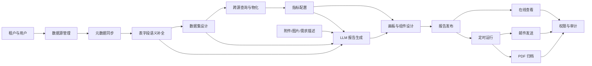
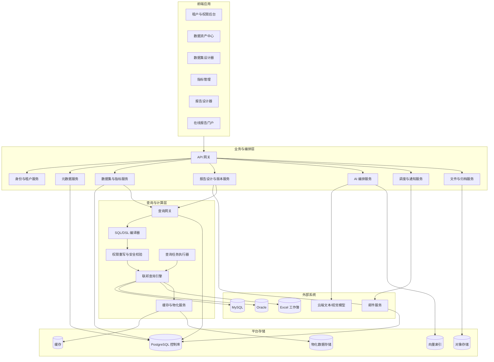
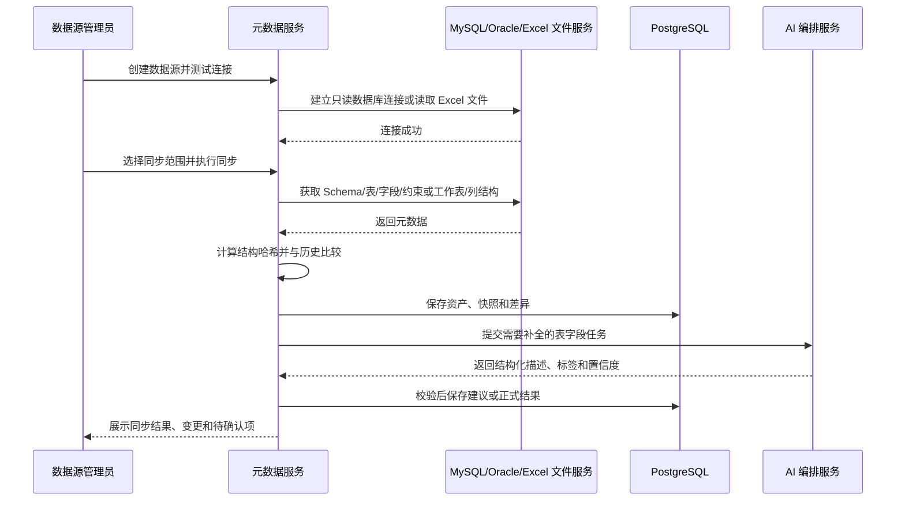
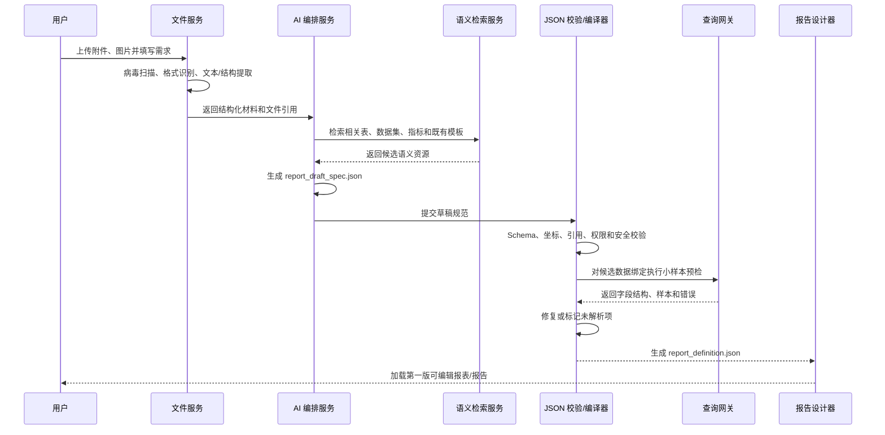
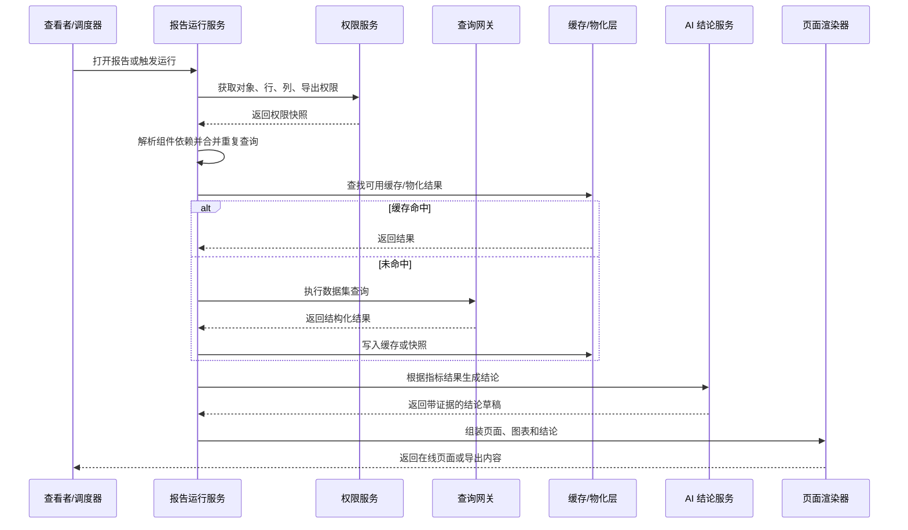

# 智能化报告生成系统

## 需求规格与总体设计方案 V1.0

> 文档状态：建议稿  
> 适用阶段：立项、产品设计、架构评审、研发拆分、测试验收  
> 控制库：PostgreSQL  
> 首期数据源：MySQL、Oracle、Excel  
> 后端主要开发语言：Go（Golang）  
> 核心形态：在线交互式报表/报告 + PDF 归档 + 定时生成与邮件发送

---

## 1. 文档目的

本文档在现有需求基础上，对智能化报告生成系统进行完整补充和结构化设计，作为后续产品原型、技术架构、数据模型、接口设计、研发任务拆分和验收测试的共同基线。

系统目标不是简单地“把 SQL 查询结果画成图”，而是建设一套以元数据、语义数据集和指标体系为基础，支持跨数据源查询、可视化报告编排、云端大模型辅助生成、在线查看、定时运行和 PDF 归档的智能分析平台。

---

## 2. 项目定位

### 2.1 产品定位

系统定位为：

> **面向多租户组织的数据资产接入、语义建模、指标管理、跨源分析、智能报告生成与归档平台。**

系统同时支持两种内容形态：

- **报表（Dashboard）**：强调数据交互、筛选、图表联动、在线查看和实时刷新。
- **报告（Report）**：强调多页面叙事、图表与文字结合、附件、结论生成、版本留痕和 PDF 正式归档。

两者共用数据源、数据集、指标、组件和运行引擎，仅在页面组织、交互能力和归档方式上有所差异。

### 2.2 建设目标

1. 支持多租户独立管理数据源、数据资产、数据集、指标、报告和用户权限，并支持将符合安全策略的对象受控公开。
2. 通过 Go 数据库连接器接入 MySQL、Oracle，并支持上传 Excel 工作簿作为文件型数据源；自动同步库、Schema、表、字段、主外键、注释或工作表结构等元数据。
3. 支持单源和跨数据源的数据关联、聚合、过滤、计算和查询。
4. 支持基于拖拉拽的数据集建模和高级用户自定义 SQL。
5. 支持表、字段、数据集和指标的业务语义补全、标签生成和向量检索。
6. 支持以 1920×1080 为首屏可视基准、12×10 为首屏主网格的通用纵向画板；画板实际高度可随内容动态增长，并支持动态内部分格。
7. 支持在分块内拖拽、缩放和动态配置标题、筛选、附加信息、图表、结论、图片、附件等组件。
8. 支持用户上传附件、图片和需求描述，由大模型生成第一版报告 JSON，并加载为可编辑报告。
9. 支持在线查看、数据刷新、定时生成、邮件发送、历史版本和 PDF 归档。
10. 支持对象权限、字段权限、行级数据权限、查询审计和导出权限。
11. 在正式在线报表场景中，通过缓存、预计算和物化机制实现万级数据量下的低延迟访问。

### 2.3 首期非目标

以下能力不建议作为首期强制范围，可作为后续迭代：

- 面向亿级明细数据的实时交互式分析。
- 复杂 ETL、数据仓库开发和全量数据治理平台。
- 像素级自由排版的专业出版系统。
- 复杂机器学习建模平台。
- 任意数据库写入、存储过程执行或数据修改。
- 多人同时编辑同一报告的实时协同编辑。

---

## 3. 已确认的关键约束

| 项目 | 已确认方案 |
|---|---|
| 租户模型 | 支持多租户 |
| 数据源 | 首期支持 MySQL、Oracle、Excel |
| 文件数据源 | 首期支持 Excel（`.xlsx`、`.xls`），按工作簿版本管理并将工作表映射为表资产 |
| 后端语言 | 以 Go（Golang）为主要开发语言 |
| 跨源能力 | 支持跨数据源关联 |
| 大模型 | 使用云端模型，采用供应商抽象层 |
| 数据发送 | 允许向云端模型发送经授权的附件、图片、元数据和数据样本 |
| 展示形态 | 在线查看，支持 PDF 归档 |
| 数据规模 | 单次分析数据量以万级为主 |
| 响应目标 | 正式在线报表首屏和常用交互目标 1 秒以内 |
| 调度能力 | 支持定时生成、邮件发送和历史归档 |
| 指标审批 | 不设置强制审批流程 |
| 数据权限 | 支持行级和列级权限 |
| 自定义 SQL | 支持，但必须经过只读、安全和权限校验 |
| 人工修订 | 支持保留人工修改版本和修订记录 |
| 智能生成 | 支持附件、图片、需求描述输入，大模型先生成报告 JSON 草稿 |
| 画板尺寸 | 1920×1080 是首屏可视基准，实际画板高度按内容扩展并支持纵向滚动 |
| 冻结 | 浏览态下指定分块或组件悬浮，并在页面滚动时按规则同步滚动 |
| 配置交付 | 用户配置最终固化为版本化 JSON 文件，由页面渲染器加载并渲染 |
| 内容公开 | 租户对象默认私有，仅经授权发布后可租户内共享或公开访问 |

### 3.1 关于“1 秒以内”的实现口径

跨源实时查询会受到 MySQL、Oracle 网络延迟、连接建立、源库负载和 Join 方式影响，因此不应将“所有冷启动、所有跨源即席查询都严格小于 1 秒”作为不可变承诺。

本方案将 1 秒目标定义为：

- 已发布在线报表首屏，P95 不超过 1 秒；
- 常用筛选条件、热点指标和已缓存查询，P95 不超过 1 秒；
- 跨源正式报表默认使用预计算、物化结果或报告快照；
- 设计器中的冷启动跨源预览允许降级到较宽松时限，并提供加载状态和取消能力；
- PDF 生成、定时任务和大模型生成采用异步任务，不纳入 1 秒交互指标。

---

## 4. 术语定义

| 术语 | 定义 |
|---|---|
| 租户 Tenant | 组织级隔离单位，拥有独立用户、数据源、数据资产、报告和权限配置 |
| 数据源 Data Source | MySQL、Oracle 数据库连接，或上传并纳管的 Excel 工作簿 |
| 物理表资产 Table Asset | 从源数据库同步并登记到系统中的表或视图 |
| 字段资产 Column Asset | 表中的物理字段及其技术、业务和安全属性 |
| 原子数据集 | 基于单张表或单个自定义 SQL 形成的数据集 |
| 组合数据集 | 多表或多数据源关联、过滤、聚合后形成的数据集 |
| 物化数据集 | 预先计算并存储结果的数据集，用于提升跨源查询性能 |
| 维度 Dimension | 用于分类、分组、筛选和下钻的业务属性，如产业、地区、企业规模 |
| 维度值 | 维度中的具体成员，如“企业规模”下的“小微企业” |
| 度量 Measure | 可被聚合的数值字段或表达式，如金额、数量 |
| 指标 Metric | 有明确业务名称、口径、时间粒度、聚合方式和单位的计算定义 |
| 报表 Dashboard | 强调交互分析、筛选和图表联动的在线页面 |
| 报告 Report | 强调多页叙事、结论、附件、正式发布和 PDF 归档的内容 |
| 报告定义 | 报告设计态的页面、组件、样式、绑定和规则 |
| 报告版本 | 某次发布后不可变的报告定义快照 |
| 报告运行实例 | 基于某个报告版本、参数和数据时间生成的一次运行结果 |
| 数据集 DSL | 表达数据节点、关联、字段、过滤、聚合和参数的结构化定义 |
| 报告 JSON | 表达页面、分块、组件、样式、数据需求和绑定关系的结构化定义 |
| 首屏可视区 Viewport | 以 1920×1080 为设计基准的浏览器可视范围，不等同于画板总高度 |
| 冻结 Sticky | 浏览态滚动时，使指定分块或组件在约束容器内保持悬浮并随滚动更新位置 |
| 公开 Public | 经租户授权后允许租户外或匿名访问对象的发布状态，不代表开放编辑权或绕过数据权限 |
| 语义类型 | 字段的业务含义，如日期、地区、企业名称、金额、百分比 |
| 行级权限 | 根据用户、部门、区域等属性限制可查询的数据行 |
| 列级权限 | 限制字段可见性、明文展示、掩码展示或仅允许聚合 |

---

## 5. 用户、角色与多租户模型

### 5.1 多租户隔离原则

系统采用“共享平台、租户级逻辑隔离”的总体模式，关键数据表均包含 `tenant_id`。核心隔离要求如下：

1. API 层从登录身份中解析 `tenant_id`，禁止由普通客户端任意传入并覆盖。
2. 控制库所有业务查询必须带租户条件，并建议使用 PostgreSQL 行级安全策略作为第二层防护。
3. 缓存键必须包含租户、用户或权限版本，防止跨租户缓存污染。
4. 对象存储目录按租户隔离，例如：`/{tenant_id}/reports/...`。
5. 数据源连接池、查询并发、模型调用额度和导出任务均按租户设置配额。
6. 数据源密钥使用租户级密钥域或密钥引用，不在业务表中保存明文。
7. 向云端模型发送数据前，记录租户授权策略、数据分类和调用审计。
8. 数据源、数据资产、数据集、指标、报告和用户权限均由所属租户独立维护；对象创建、查询、变更、发布和删除必须校验 `tenant_id`。
9. 对象默认可见性为 `PRIVATE`。支持 `TENANT` 和 `PUBLIC` 可见性，但公开的是经过发布和安全校验的只读版本，不开放租户后台管理能力。
10. 数据源连接信息、敏感字段、行级明细、用户及权限配置不得直接公开；公开报告只能引用允许公开的数据集/指标版本或脱敏快照。

### 5.2 对象可见性与公开规则

数据源、数据资产、数据集、指标和报告应统一保存所有者租户及可见性：

```text
tenant_id
visibility: PRIVATE | TENANT | PUBLIC
publish_status: DRAFT | PUBLISHED | OFFLINE
published_version_id
public_slug
public_access_policy
```

- `PRIVATE`：仅对象所有者及显式授权用户可访问；
- `TENANT`：租户内具备相应查看权限的用户可访问；
- `PUBLIC`：通过公开地址只读访问已发布版本，可按策略启用匿名访问、访问码、有效期和禁止下载；
- 对数据源、数据资产和数据集的“公开”默认指公开目录、业务说明或可复用定义，不暴露连接凭证、源库定位信息和未授权明细数据；
- 公开报告运行时使用发布时固化的权限策略、公开专用服务身份或脱敏数据快照，不继承匿名访问者不存在的后台权限；
- 撤销公开后，公开地址和缓存应及时失效，并保留发布、访问和撤销审计记录。

### 5.3 推荐角色

| 角色 | 核心职责 |
|---|---|
| 平台管理员 | 管理平台级配置、模型供应商、系统限额和全局监控 |
| 租户管理员 | 管理租户用户、角色、资源配额、模型授权和安全策略 |
| 数据源管理员 | 创建和维护数据源、连接测试、元数据同步和刷新 |
| 数据管理员 | 维护表字段描述、标签、敏感级别、数据权限和词典 |
| 数据分析师 | 创建数据集、关联模型、自定义 SQL、指标和查询验证 |
| 报告设计师 | 设计报表/报告、配置组件、调用 AI 生成和发布版本 |
| 报告运营人员 | 配置调度、收件人、归档策略和运行监控 |
| 查看者 | 在线查看被授权的报告和数据 |
| 导出者 | 在查看权限基础上，可下载 PDF、图片或数据 |

### 5.4 权限维度

权限不只按照菜单控制，应至少覆盖：

- **功能权限**：能否创建数据源、创建数据集、发布报告、导出文件。
- **对象权限**：能否访问某个数据源、表、字段、数据集、指标或报告。
- **行级权限**：只能访问所属区域、组织、产业或客户范围内的数据。
- **列级权限**：隐藏、掩码、哈希、仅聚合或完全禁止访问敏感字段。
- **操作权限**：编辑、发布、复制、删除、调度、分享、导出。
- **运行权限**：能否使用某个参数范围、查询某个时间跨度或执行自定义 SQL。

---

## 6. 功能范围总览



系统功能模块建议包括：

1. 租户与组织管理。
2. 用户、角色和权限管理。
3. 数据源管理。
4. 元数据同步与资产管理。
5. 标签、词典和向量检索。
6. 数据集设计与 SQL 编译。
7. 跨源查询、缓存和物化。
8. 指标与维度管理。
9. 画板、页面、分块和组件设计。
10. LLM 智能报告生成。
11. 报告发布、版本和在线运行。
12. 调度、通知、邮件和 PDF 归档。
13. 附件、图片和文件资产管理。
14. 查询审计、操作审计和 AI 审计。
15. 监控、告警、配额和运维管理。

---

## 7. 总体架构

### 7.1 架构原则

1. **配置与执行分离**：配置存 PostgreSQL，业务数据留在源库或物化存储。
2. **结构化定义优先**：数据集保存 DSL，报告保存版本化 JSON；用户所有设计配置最终固化为可校验、可迁移、可追溯的 JSON 文件，SQL 和页面均为编译或渲染结果。
3. **LLM 不直接执行**：模型只生成草稿和建议，必须经过校验、解析、权限检查和预执行。
4. **多租户全链路隔离**：数据库、缓存、文件、模型调用、日志和任务均带租户边界。
5. **跨源查询分层处理**：能下推则下推，不能下推则联邦计算；正式报告优先使用缓存或物化结果。
6. **发布版本不可变**：报告、数据集和指标发布后形成版本，运行实例引用具体版本。
7. **人工修改优先保护**：自动刷新或重新生成不得覆盖人工锁定内容。
8. **可观测和可追溯**：每个查询、AI 生成、报告运行和导出文件均可追踪来源。
9. **渲染器统一加载**：设计器预览、在线浏览、公开访问和导出均加载同一份已发布报告 JSON，由页面渲染器解释生成页面，避免多套配置口径。

### 7.2 逻辑架构



### 7.3 控制面与数据面

#### 控制面

负责存储和管理：

- 租户、用户、角色和权限；
- 数据源配置和密钥引用；
- 表字段元数据、标签、向量和版本；
- 数据集 DSL、指标定义和报告 JSON；
- 调度、运行状态、审计和归档元数据。

#### 数据面

负责执行：

- MySQL、Oracle 连接器元数据抓取；
- Excel 工作簿解析、结构推断和版本管理；
- MySQL、Oracle 查询及 Excel 数据读取；
- 跨源 Join 和计算；
- 行列权限重写；
- 结果缓存和物化；
- 报告数据快照；
- PDF 渲染和文件输出。

### 7.4 建议的部署形态

首期建议采用“模块化单体 + 独立执行进程”的方式，避免过早拆分大量微服务：

- Web/API 主应用：租户、元数据、数据集、指标、报告配置。
- 查询执行服务：SQL 编译、权限重写、跨源查询和缓存。
- AI Worker：附件解析、模型调用、JSON 生成和修复。
- 调度 Worker：定时任务、报告运行、邮件发送。
- 导出 Worker：页面渲染、PDF 生成和归档。

当查询量、模型调用量或导出任务量上升后，再分别横向扩展。

---

## 8. 数据源管理与元数据中心

### 8.1 数据源配置

每个数据源建议保存以下信息：

| 字段 | 说明 |
|---|---|
| `id` | 不可变主键，建议 UUID |
| `tenant_id` | 所属租户 |
| `db_alias` | 租户内展示别名，可修改，不作为关联主键 |
| `db_type` | `MYSQL`、`ORACLE` 或 `EXCEL` |
| `host` | 主机地址，Excel 不适用 |
| `port` | 端口，Excel 不适用 |
| `database_name` | MySQL 数据库名 |
| `service_name` | Oracle 服务名 |
| `sid` | Oracle SID，按连接方式选填 |
| `username` | 只读账号 |
| `secret_ref` | 密码或凭证在密钥系统中的引用 |
| `connection_dsn` | 系统生成或高级模式下配置的数据库连接描述，Excel 不适用 |
| `connector_name` | Go 数据库驱动或 Excel 解析连接器名称 |
| `connector_version` | 连接器版本标识 |
| `file_asset_id` | Excel 原始文件资产 ID，仅 `EXCEL` 使用 |
| `file_version_id` | 当前生效的 Excel 文件版本 ID，仅 `EXCEL` 使用 |
| `sheet_scope` | 允许同步的工作表范围，仅 `EXCEL` 使用 |
| `header_row` | 各工作表表头所在行，默认自动识别，可人工调整 |
| `schema_scope` | 允许同步和查询的 Schema 范围 |
| `table_include` | 表白名单规则 |
| `table_exclude` | 表黑名单规则 |
| `connection_properties` | SSL、字符集、超时等附加参数 |
| `max_pool_size` | 最大连接池大小 |
| `query_timeout_ms` | 默认查询超时 |
| `status` | 启用、停用、异常 |
| `last_test_at` | 最近连接测试时间 |
| `last_sync_at` | 最近元数据同步时间 |
| `created_by/created_at` | 创建审计 |
| `updated_by/updated_at` | 修改审计 |
| `version` | 乐观锁版本 |

### 8.2 密码和连接安全

1. 密码不得以明文保存在 PostgreSQL。
2. 优先保存密钥管理系统中的 `secret_ref`；无法接入密钥系统时，使用应用层加密并由独立主密钥保护。
3. 查询和日志中不得输出完整连接串、密码或 Token。
4. 修改数据源时，前端只显示“已配置”，空密码表示保留原凭证。
5. 数据源账号必须是只读账号，并限制只能访问允许的 Schema 和表。
6. 连接测试应返回可理解的错误分类，但不得泄露完整网络和认证细节。
7. 每个租户的数据源连接池应有独立配额，避免单租户耗尽平台连接。

### 8.3 元数据同步范围

MySQL、Oracle 通过 Go 数据库驱动、系统表和数据库补充查询同步；Excel 通过文件解析器同步：

- Catalog；
- Schema；
- 表和视图；
- 表注释；
- 字段名、顺序和数据类型；
- 字段长度、精度、小数位和可空性；
- 默认值；
- 主键；
- 唯一键；
- 外键；
- 索引摘要；
- 估算行数；
- 最近更新时间（源库可提供时）；
- 数据样本统计信息（按授权策略开启）。

对于 Excel，每个工作表默认映射为一张表资产，列标题映射为字段资产。系统应支持表头行选择、空行跳过、合并单元格提示、日期/数字/文本类型推断、类型人工修正、公式值读取和多工作表选择。重新上传文件时形成新版本，按工作表名和列名执行差异比较；已发布数据集继续引用固定文件版本，避免源文件替换导致历史报告不可复现。

### 8.4 表资产信息

表资产不建议只保存一个字段 JSON。推荐采用“表主表 + 字段明细表 + JSON 快照”的混合结构。

表资产至少包含：

```text
id
 tenant_id
 datasource_id
 catalog_name
 schema_name
 table_name
 table_type
 source_comment
 business_name
 business_description
 estimated_row_count
 primary_key_columns
 structure_hash
 metadata_version
 sync_status
 asset_status
 manual_locked
 last_sync_at
 created_at
 updated_at
```

字段资产至少包含：

```text
id
 tenant_id
 table_id
 column_name
 ordinal_position
 source_comment
 business_name
 business_description
 source_type
 native_type
 canonical_type
 length
 precision
 scale
 nullable
 default_value
 is_primary_key
 is_foreign_key
 is_unique
 semantic_type
 sensitivity_level
 mask_policy
 manual_locked
 status
```

`metadata_snapshot_json` 可保存每次完整结构快照，用于差异比较和历史追踪，但常用字段必须规范化存储。

### 8.5 元数据同步流程



### 8.6 差异刷新

映射表刷新必须采用差异同步，不得简单删除后重建。

| 变化类型 | 默认处理 |
|---|---|
| 新增表 | 建立新资产，进入待补全状态 |
| 新增字段 | 自动同步技术属性，触发 AI 描述补全 |
| 表或字段注释变化 | 更新源注释，人工描述未锁定时生成新建议 |
| 字段长度扩大 | 自动同步并记录差异 |
| 字段类型变化 | 标记高风险，重新校验数据集和指标 |
| 字段删除 | 不物理删除资产，标记失效并执行下游影响分析 |
| 表重命名 | 生成“可能重命名”建议，需人工确认映射 |
| 主外键变化 | 重新检查推荐关联和 Join 基数 |

刷新后应生成影响清单：

- 受影响的数据集；
- 受影响的指标；
- 受影响的报告组件；
- 受影响的调度任务；
- 是否会导致 SQL 失效；
- 是否需要重新物化。

已发布版本不得被静默覆盖。新结构进入新草稿版本，用户重新验证并发布后才生效。

### 8.7 LLM 元数据补全

大模型用于补全：

- 表业务名称；
- 表业务描述；
- 字段业务名称；
- 字段业务描述；
- 语义类型；
- 领域、产业、主题、作用标签；
- 敏感级别建议；
- 主外键候选关系；
- 可能的时间字段、维度字段和度量字段。

模型必须返回固定 JSON，并经过以下校验：

1. JSON Schema 校验；
2. 字段存在性校验；
3. 标签枚举校验；
4. 长度和敏感词校验；
5. 置信度判断；
6. 人工锁定内容冲突检查；
7. 租户资源归属检查；
8. 模型结果审计记录。

人工编辑内容设置 `manual_locked=true` 后，后续刷新和模型重跑只能生成建议，不能覆盖正式值。

### 8.8 标签和向量

“领域、产业、主题、作用”属于结构化标签，应保存到标签字典及关联表中；向量仅用于检索和推荐。

推荐标签分类：

- 领域：企业、金融、产业、政务、运营等；
- 产业：制造业、服务业、信息产业等；
- 主题：经营分析、风险监控、企业画像等；
- 作用：维度表、事实表、主数据、指标来源、辅助信息等。

向量记录至少包含：

```text
asset_id
asset_type
embedding
embedding_model
embedding_version
input_hash
created_at
```

向量输入建议由表名、表描述、字段名、字段描述和标签组成，不直接包含数据库凭证。

---

## 9. 跨数据源查询与关联

### 9.1 能力定义

系统支持以下跨源场景：

- MySQL 表与另一个 MySQL 数据源中的表关联；
- Oracle 表与另一个 Oracle 数据源中的表关联；
- MySQL 表与 Oracle 表关联；
- Excel 工作表与 MySQL、Oracle 或其他 Excel 工作表关联；
- 单个组合数据集同时引用多个数据源；
- 自定义 SQL 作为节点后继续参与跨源关联；
- 跨源结果物化后供指标和报告使用。

### 9.2 三种执行模式

| 模式 | 适用场景 | 特点 |
|---|---|---|
| 实时联邦查询 | 设计器预览、低频临时分析 | 数据最新，但受源库和网络影响 |
| 缓存查询 | 高频筛选、常用指标、热点报告 | 速度快，设置分钟级或小时级失效策略 |
| 物化数据集 | 正式跨源报告、复杂 Join、严格低延迟 | 按计划预计算，最适合 1 秒目标 |

系统应根据数据集配置、查询复杂度和报告服务等级自动选择执行方式，也允许有权限的用户显式指定。

### 9.3 跨源执行流程

1. 解析数据集 DSL，构建逻辑执行计划。
2. 校验用户对所有数据源、表和字段的访问权限。
3. 将可下推的过滤、投影、聚合分别下推到 MySQL 和 Oracle；Excel 数据先按文件版本加载到受控临时表、列式缓存或物化区，再参与执行计划。
4. 从各源只拉取必要字段和必要行，禁止默认全表拉取。
5. 将各源结果转换为统一规范类型。
6. 在联邦计算层完成 Join、Union、二次聚合和排序。
7. 应用最终行级、列级权限和脱敏策略。
8. 按缓存策略写入结果缓存或物化存储。
9. 返回查询结果、字段元数据、数据时间和执行摘要。

### 9.4 统一类型系统

跨源计算必须建立平台规范类型，避免 MySQL、Oracle 与 Excel 单元格类型差异直接泄漏到上层。

| 规范类型 | MySQL 常见来源 | Oracle 常见来源 | Excel 常见来源 |
|---|---|---|---|
| STRING | CHAR、VARCHAR、TEXT | CHAR、VARCHAR2、CLOB 摘要 | 文本、混合类型列 |
| INTEGER | TINYINT、INT、BIGINT | NUMBER 且无小数 | 整数单元格 |
| DECIMAL | DECIMAL、NUMERIC | NUMBER、DECIMAL | 数值或百分比单元格 |
| BOOLEAN | BOOLEAN、TINYINT 约定 | NUMBER/CHAR 业务约定 | TRUE/FALSE 或业务映射文本 |
| DATE | DATE | DATE 的日期语义 | 日期序列值或可解析日期文本 |
| TIME | TIME | 业务转换 | 时间序列值或可解析时间文本 |
| TIMESTAMP | DATETIME、TIMESTAMP | TIMESTAMP、DATE 的时间语义 | 日期时间序列值或文本 |
| BINARY | BLOB、BINARY | BLOB、RAW | 不直接支持，转文件资产引用 |
| JSON | JSON、TEXT | JSON、CLOB | 可解析 JSON 文本 |

对以下情况必须提供显式转换规则：

- 字符编码和大小写；
- 时区；
- 空字符串与 NULL；
- Oracle 空字符串视为空值的差异；
- 日期与时间戳；
- 高精度小数；
- 布尔值业务约定；
- 排序规则和字符串比较；
- 超长文本和大对象字段。

### 9.5 Join 关系和基数

每个关联关系必须保存：

```text
left_node_id
left_field_id
right_node_id
right_field_id
join_type
cardinality
null_handling
relationship_source
confidence
manual_confirmed
```

`cardinality` 至少支持：

- `ONE_TO_ONE`；
- `ONE_TO_MANY`；
- `MANY_TO_ONE`；
- `MANY_TO_MANY`；
- `UNKNOWN`。

系统应检测 Join 扇出风险。例如订单表与订单明细表关联后，订单级金额可能被重复累加。出现以下情况时必须告警：

- 多对多关联；
- 指标字段所在粒度低于或高于输出粒度；
- Join 键非唯一；
- 左右两侧均存在重复键；
- 聚合前后顺序可能改变结果。

### 9.6 物化策略

物化数据集建议支持：

- 手工刷新；
- 固定周期刷新；
- 源元数据变更后刷新；
- 报告运行前刷新；
- 增量刷新；
- 全量刷新；
- 失败保留旧版本；
- 新旧版本原子切换。

每个物化版本应记录：

```text
materialization_id
 dataset_version_id
 refresh_mode
 source_watermark
 row_count
 schema_hash
 started_at
 completed_at
 status
 storage_location
 error_message
```

### 9.7 跨源性能约束

为实现正式在线报表 1 秒目标，建议设置以下规则：

1. 已发布报告中的复杂跨源组件默认必须使用缓存、物化或报告快照。
2. 跨源实时 Join 进入设计器时先做小样本预览，默认限制行数。
3. 大文本、二进制和无关字段不得参与跨源传输。
4. Join 前尽量在源端过滤和聚合。
5. 物化刷新与在线查询使用不同资源队列。
6. 热点报告在用户打开前可按调度预热。
7. 缓存键必须包含数据集版本、参数、租户、权限策略版本和数据水位。

---

## 10. 数据集设计

### 10.1 数据集类型

| 类型 | 说明 |
|---|---|
| 原子表数据集 | 一张物理表直接映射为数据集 |
| 单源组合数据集 | 同一数据源下多表关联 |
| 跨源组合数据集 | 多个数据源中的表或子查询关联 |
| 自定义 SQL 数据集 | 用户编写受控 SQL 形成输出 |
| 物化数据集 | 将组合结果持久化后形成稳定数据集 |
| 派生数据集 | 基于已发布数据集继续加工 |

物理表资产与数据集必须分离。一张物理表可以被多个数据集以不同字段、过滤条件和业务口径复用。

### 10.2 数据集设计器能力

设计器应支持：

- 从资产目录搜索并拖入表、视图或已有数据集；
- 自动推荐主外键和语义相似字段关联；
- 配置 Join 类型和基数；
- 选择、重命名和隐藏输出字段；
- 类型转换；
- 计算字段；
- 聚合字段；
- 分组；
- 聚合前过滤；
- 聚合后过滤；
- 排序；
- 去重；
- Top N；
- Union / Union All；
- 参数定义；
- 日期函数；
- 空值处理；
- CASE 条件；
- 预览数据；
- 查看编译 SQL 和执行计划摘要；
- 保存草稿、验证和发布版本。

### 10.3 输出粒度

每个数据集必须声明“每一行代表什么”，例如：

- 每一行代表一家企业；
- 每一行代表一家企业某个月；
- 每一行代表一笔订单；
- 每一行代表某地区某产业某季度。

建议字段：

```text
grain_description
grain_key_fields
time_field
default_time_grain
```

如果系统检测到输出粒度不明确，应阻止指标发布或给出高风险提示。

### 10.4 数据集 DSL

拖拽设计结果必须保存为结构化 DSL，SQL 仅作为编译产物。DSL 至少包含：

```json
{
  "dslVersion": "1.0",
  "nodes": [],
  "joins": [],
  "fields": [],
  "filters": [],
  "groupBy": [],
  "having": [],
  "sorts": [],
  "parameters": [],
  "outputGrain": {},
  "executionPolicy": {}
}
```

保存 DSL 的主要价值：

- 可重新加载拖拽画布；
- 可适配 MySQL、Oracle、Excel 落地数据和联邦引擎方言；
- 可执行字段删除影响分析；
- 可进行行列权限注入；
- 可生成血缘；
- 可升级 SQL 编译器；
- 可避免直接执行模型生成的任意 SQL。

### 10.5 自定义 SQL

系统支持两种自定义 SQL：

1. **源端 SQL**：绑定一个 MySQL 或 Oracle 数据源，使用该数据库方言执行。
2. **联邦 SQL**：引用平台虚拟 Catalog，由联邦引擎执行跨源查询。

安全要求：

- 只允许单条 `SELECT` 或受支持的只读查询；
- 禁止 DDL、DML、匿名块、存储过程和多语句；
- 禁止未授权表、字段、函数和系统对象；
- 必须通过 SQL AST 解析，不依赖字符串关键字判断；
- 用户输入值必须使用参数绑定，禁止直接拼接；
- 自动注入行级权限；
- 自动应用列级隐藏或脱敏；
- 限制最大扫描范围、最大返回行数、超时和并发；
- 支持取消查询；
- 保存 SQL 版本和查询审计；
- LLM 可辅助编写 SQL，但生成结果必须经过同样的校验。

### 10.6 数据集字段

数据集字段应与源字段解耦，至少包含：

```text
id
 dataset_version_id
 field_code
 field_name
 description
 expression
 canonical_type
 semantic_type
 field_role
 source_lineage
 aggregation
 format
 unit
 nullable
 visible
 sensitivity_level
```

`field_role` 可取：

- `DIMENSION`；
- `MEASURE`；
- `ATTRIBUTE`；
- `TIME`；
- `IDENTIFIER`。

### 10.7 数据集版本

数据集状态建议为：

```text
DRAFT -> VALIDATING -> PUBLISHED -> STALE -> DEPRECATED
```

本项目不设置审批流程，但仍需区分草稿和已发布版本：

- 草稿可编辑；
- 发布时执行结构、权限、查询和样本验证；
- 已发布版本不可直接修改；
- 修改后生成新版本；
- 报告版本引用明确的数据集版本；
- 旧版本可回滚但不能被覆盖。

---

## 11. 指标与维度设计

### 11.1 指标与字段的区别

指标不是简单字段别名，而是可治理的计算口径。指标至少包含：

```text
id
 tenant_id
 metric_code
 metric_name
 description
 dataset_id
 dataset_version_id
 expression
 aggregation
 time_field
 time_grain
 default_filters
 unit
 number_format
 additivity
 allowed_dimensions
 owner
 status
 version
```

### 11.2 指标类型

- 原子指标；
- 派生指标；
- 复合指标；
- 比率指标；
- 同比指标；
- 环比指标；
- 排名指标；
- 目标完成率指标；
- 累计指标；
- 移动平均指标。

### 11.3 维度与维度值

“产业”应建模为维度，“小微”应建模为“企业规模”维度中的维度值，不能混在同一个清单中。

维度定义建议包含：

```text
dimension_id
dimension_code
dimension_name
dataset_field_id
hierarchy
value_mapping
sort_rule
null_label
```

维度层级示例：

```text
地区：全国 > 省 > 市 > 区县
产业：门类 > 大类 > 中类 > 小类
时间：年 > 季度 > 月 > 日
```

### 11.4 可加性

指标应声明：

- `ADDITIVE`：所有维度均可求和；
- `SEMI_ADDITIVE`：部分维度可求和，如期末余额不能跨时间求和；
- `NON_ADDITIVE`：比率、平均值等不可直接求和。

系统在图表或跨粒度汇总时应根据可加性提示风险。

### 11.5 指标生命周期

由于不需要审批，建议采用：

```text
DRAFT -> PUBLISHED -> DEPRECATED
```

发布权限由角色控制，不设置审核节点。发布前必须自动完成：

- 表达式语法验证；
- 字段和数据集版本验证；
- 权限验证；
- 样本试算；
- Join 扇出检查；
- 单位和格式检查；
- 引用循环检查。

### 11.6 指标血缘

系统应展示：

```text
源数据表 -> 源字段 -> 数据集字段 -> 指标 -> 图表组件 -> 报告版本
```

当源字段或数据集变化时，可快速确定受影响的指标和报告。

---

## 12. 画板、页面、分块与组件

### 12.1 页面基础网格

每个页面以如下首屏可视范围为设计基准：

```text
宽度：1920
首屏高度：1080
首屏主网格：12 列 × 10 行
实际画板高度：按内容动态增长，通常远大于 1080
```

主网格单元逻辑尺寸：

```text
宽度：1920 / 12 = 160
基准行高：1080 / 10 = 108
```

`1920×1080` 表示设计态和浏览态的首屏可视基准，不是页面总尺寸上限。画板固定采用 12 列，纵向行数根据分块位置和高度动态扩展，最少 10 行；分块的 `y + h` 可以超过 10。数据库及 JSON 保存网格坐标和动态内容行数，不保存最终屏幕像素。在线查看时按容器宽度等比例缩放，纵向通过页面滚动浏览全部内容。

### 12.2 分块内网格

若外部分块尺寸为 `M × N`，其内部分格为：

```text
内网格列数 = M × 4
内网格行数 = N × 4
```

| 外部分块 | 内部分格 |
|---|---|
| 1×1 | 4×4 |
| 2×1 | 8×4 |
| 2×2 | 8×8 |
| 3×2 | 12×8 |

一个占满首屏的 12×10 分块，其内网格为 48×40；若分块高度超过 10 行，其内部行数仍按 `N×4` 动态扩展。

### 12.3 页面和分块模型

报告支持多页面。每个页面包含一个或多个分块，每个分块包含多个组件。

分块至少保存：

```text
id
page_id
x
y
width
height
z_index
layout_locked
config_locked
data_snapshot_locked
sticky_enabled
sticky_top
sticky_scope
sticky_z_index
background
border
padding
inner_grid_columns
inner_grid_rows
```

#### 12.3.1 分块清空、删除与 1×1 恢复

画板以 `1×1` 主网格单元作为最小基础分块。用户合并或拉伸基础单元后形成 `M×N` 分块；设计态应同时提供“清空分块”和“删除分块”操作：

- **清空分块**：清除该分块内的全部组件、数据绑定、样式和交互配置；
- **删除分块**：删除当前 `M×N` 分块定义及其内部配置；
- 两种操作完成后，原分块占用的 `M×N` 区域均释放并恢复为 `M×N` 个可独立选择、重新合并的空白 `1×1` 基础分块；
- 若目标本身是 `1×1` 分块，则操作后保留一个空白 `1×1` 基础分块，画板网格不出现空洞；
- 非空分块执行清空或删除前必须二次确认，并显示将被移除的组件数量；操作应进入撤销/重做栈；
- 已锁定、无编辑权限或正在被发布任务引用的分块，应按权限和版本规则禁止操作或要求先解除锁定。

空白 `1×1` 基础分块可以由画板网格隐式表达，无需为每个空单元持久化独立对象；当用户选中、合并或放入组件时再生成正式分块 JSON，从而控制长画板的配置体积。

### 12.4 浏览态冻结能力

“冻结”指浏览报告发生纵向滚动时，指定分块或组件以悬浮方式保持在可视区内，并随滚动实时更新位置。其行为类似 `position: sticky`，且只能在所属页面或约束容器范围内生效，不能覆盖后续内容到页面结束后仍无限悬浮。

| 冻结配置 | 含义 |
|---|---|
| `sticky_enabled` | 是否在浏览态启用冻结 |
| `sticky_top` | 相对可视区顶部的悬浮偏移量 |
| `sticky_scope` | 冻结约束范围，可为页面、分块或指定滚动容器 |
| `sticky_z_index` | 悬浮层级，用于处理冻结内容之间的遮挡顺序 |

典型场景包括冻结报告标题、全局筛选区或关键指标摘要。多个冻结区域同时存在时，应按配置顺序堆叠，避免相互覆盖；在移动端、PDF 和打印场景可按渲染策略取消冻结并恢复文档流布局。

冻结与“锁定”是不同能力：`layout_locked`、`config_locked` 和 `data_snapshot_locked` 分别用于限制设计态编辑和固定数据快照，不代表浏览态悬浮。

### 12.5 组件类型

首期建议支持：

- 标题；
- 富文本；
- 筛选器；
- 单值指标卡；
- 附加信息卡；
- 表格；
- 交叉表；
- 柱状图；
- 条形图；
- 折线图；
- 面积图；
- 饼图/环图；
- 散点图；
- 地图（有地理数据时）；
- 排名列表；
- 图片；
- 附件列表；
- 数据来源说明；
- 更新时间；
- 结论；
- 分隔线和装饰块。

### 12.6 组件公共属性

```text
id
type
name
x
y
width
height
z_index
visible
style
binding
interaction
refresh_policy
permission_policy
source_trace
```

### 12.7 区域占比配置

标题区、筛选区、附加信息区、图表区和结论区均作为组件放入分块内网格，不固定死比例。系统提供常用模板：

- 上标题、中图表、下结论；
- 左筛选、右图表；
- 上筛选、中图表、右指标卡、下结论；
- 多图表对比；
- 一页一主题报告；
- 管理驾驶舱。

用户可在分块内部直接拖入、移动、缩放、复制、删除和配置组件，自由调整组件在内网格中的 `x/y/w/h`。分块尺寸变化时内网格同步重算，并进行碰撞检测、对齐、吸附、最小尺寸和越界校验。

#### 12.7.1 分块 AI 浮窗

页面编辑状态下，鼠标移入或选中任一分块时，应在分块边缘显示不遮挡核心内容的 AI 浮窗入口。触屏设备使用“选中分块后显示”替代悬停。用户可输入自然语言，让 AI 仅针对当前分块执行：

- 增删、替换或重新排列分块内组件；
- 调整标题、说明、结论、图表类型、样式和内部分格；
- 修改筛选、数据集、指标和字段绑定；
- 根据当前数据生成或优化结论；
- 清空分块，或将复杂分块重构为推荐布局。

AI 请求上下文默认只包含当前分块 JSON、当前报告主题、用户有权访问的数据资产/数据集/指标及必要数据样本。AI 返回限定在当前分块路径下的 JSON Patch，不得静默修改其他分块或整页配置。应用变更前必须完成 Schema、权限、数据绑定、组件碰撞和最小尺寸校验，并向用户展示修改预览；用户确认后才写入草稿，同时支持撤销、保留修改来源和审计记录。若用户明确选择“联动调整其他分块”，应扩大变更范围并再次确认。

### 12.8 筛选器绑定

筛选器不应只绑定“某个数据集”，而应绑定报告参数和语义字段。

```text
filter_id
parameter_code
semantic_field_code
component_type
operator
single_or_multi
required
default_value
option_source
scope
cascade_parent
```

作用域支持：

- 整份报告；
- 当前页面；
- 当前分块；
- 指定组件集合。

当一个筛选器作用于多个数据集时，通过语义字段映射处理：

```text
报告语义字段 enterprise_scale
  -> 数据集 A 字段 company_scale
  -> 数据集 B 字段 enterprise_type
```

### 12.9 图表绑定

图表绑定至少包含：

```text
dataset_version_id
metric_ids
dimension_fields
series_fields
filters
sorts
top_n
chart_config
drill_config
linkage_config
```

支持交互：

- 点击筛选；
- 图表联动；
- 下钻；
- 返回上级；
- 查看明细；
- 跳转页面；
- 跳转外部链接；
- 导出图表或数据。

### 12.10 附加信息区

附加信息区支持：

- 静态文本；
- 数据更新时间；
- 数据来源；
- 统计口径；
- 单值 KPI；
- 同比、环比；
- 数据质量提示；
- 图例；
- 备注；
- 数据集字段值；
- 附件或原始材料链接。

### 12.11 结论区

结论区可绑定一个或多个指标、维度结果和图表上下文，而不是只绑定单一指标 ID。

结论定义应包含：

```text
metric_ids
comparison_period
dimension_context
chart_component_ids
conclusion_template
llm_enabled
allow_manual_edit
manual_locked
```

结论生成后保存模型版本、输入数据快照、提示词版本和人工修订记录。

---

## 13. 基于附件、图片和需求描述的智能生成

### 13.1 输入类型

用户创建报表或报告时可同时提供：

- 文字需求描述；
- PDF；
- Word；
- Excel；
- CSV；
- PowerPoint；
- TXT/Markdown；
- PNG/JPG 等图片；
- 既有报告截图或版式参考图；
- 业务附件和说明材料；
- 可选的数据源、数据集、指标范围。

附件既可以作为“生成依据”，也可以作为报告中的正式附件或图片组件。

### 13.2 两阶段 JSON 设计

大模型不应直接生成最终可执行报告定义，建议分为两个阶段：

1. **报告草稿规范 `report_draft_spec.json`**  
   由 LLM 生成，表达用户意图、页面布局、数据需求、图表建议、结论规则和素材引用。允许包含尚未解析的语义引用。

2. **可执行报告定义 `report_definition.json`**  
   由系统编译器将草稿规范解析为真实的数据集 ID、指标 ID、字段 ID、组件坐标和权限约束，校验通过后才加载到设计器。

这样可以避免模型虚构数据库 ID、字段和指标，也能让系统对缺失项进行明确提示。

### 13.3 智能生成流程



### 13.4 文件处理要求

文件上传后应完成：

1. MIME 类型识别，不能只依赖文件扩展名；
2. 病毒和恶意文件扫描；
3. 文件哈希计算和重复检测；
4. 对象存储加密；
5. 文本、表格、图片和页面结构提取；
6. 扫描版文档使用视觉模型或 OCR 处理；
7. 图片提取版式、文字、图表意图和视觉风格；
8. 文件页码、段落、工作表和单元格来源定位；
9. 按租户策略决定是否允许将原始内容发送给云端模型；
10. 保存文件保留周期、授权范围和删除状态。

### 13.5 语义检索与数据匹配

AI 编排服务应先检索租户内已发布资源：

- 表资产；
- 字段资产；
- 标签；
- 数据集；
- 指标；
- 既有报告模板；
- 业务词典；
- 用户有权限访问的对象。

检索结果用于生成“候选数据需求”。模型不能引用用户无权访问的对象。

### 13.6 生成内容

LLM 第一版 JSON 可生成：

- 报告名称和描述；
- 报告类型；
- 页面数量和页面主题；
- 分块布局；
- 标题、筛选器、图表、图片、附件、结论等组件；
- 数据需求和推荐数据集；
- 推荐指标和维度；
- 图表类型和排序；
- 全局参数；
- 结论生成规则；
- 主题样式；
- 数据来源说明；
- 尚未解析项和警告。

### 13.7 生成后的校验

报告 JSON 加载前必须完成：

- JSON Schema 校验；
- 版本号校验；
- 组件类型枚举校验；
- 页面和网格坐标边界校验；
- 组件碰撞和最小尺寸校验；
- 数据集、字段、指标的真实存在性校验；
- 租户归属和用户权限校验；
- 自定义 SQL 安全校验；
- 图表字段类型兼容性校验；
- 筛选器字段映射校验；
- 查询小样本预执行；
- HTML、富文本和链接安全处理；
- 附件和图片引用有效性校验。

无法解析的内容不得悄悄替换为虚构对象，应以 `UNRESOLVED` 状态保留并在设计器中突出提示。

### 13.8 人工修改保护与再次生成

AI 再次生成时不应整份覆盖。建议采用：

- 组件级 `manual_locked`；
- 文本区段级锁定；
- JSON Patch 形式提交变更；
- 生成前显示变更预览；
- 用户逐项接受或拒绝；
- 自动保留生成前版本；
- 区分 `AI`、`USER`、`SYSTEM` 三种修改来源。

### 13.9 云端模型治理

每次模型调用至少记录：

```text
ai_job_id
tenant_id
purpose
provider
model_name
model_version
prompt_template_id
prompt_version
input_file_ids
input_hash
data_classification
user_consent_snapshot
raw_response_location
parsed_result
latency_ms
token_usage
estimated_cost
status
created_by
created_at
```

模型输入中不得包含数据库密码、密钥或系统内部凭证。对敏感样本数据，应根据租户策略执行脱敏、最小化截取和调用审计。

---

## 14. 报告 JSON 规范

### 14.1 顶层结构

建议报告定义采用版本化 JSON，顶层结构如下：

```json
{
  "schemaVersion": "1.0",
  "report": {},
  "canvas": {},
  "theme": {},
  "parameters": [],
  "dataRequirements": [],
  "pages": [],
  "generation": {},
  "extensions": {}
}
```

### 14.2 顶层字段说明

| 字段 | 必填 | 说明 |
|---|---:|---|
| `schemaVersion` | 是 | 报告 JSON 协议版本，用于后续迁移 |
| `report` | 是 | 报告基本信息、类型和运行策略 |
| `canvas` | 是 | 1920×1080 首屏基准、12×10 首屏网格及纵向动态扩展规则 |
| `theme` | 否 | 字体、背景、间距、图表和组件默认样式 |
| `parameters` | 否 | 全局和页面参数 |
| `dataRequirements` | 否 | AI 草稿阶段的数据语义需求及解析状态 |
| `pages` | 是 | 页面、分块和组件定义 |
| `generation` | 否 | AI 生成来源、模型、附件和警告 |
| `extensions` | 否 | 协议扩展字段，避免破坏主结构 |

### 14.3 报告信息

```json
{
  "id": null,
  "code": "enterprise_operation_monthly",
  "name": "企业经营月度分析报告",
  "description": "展示企业经营规模、产业分布和变化趋势",
  "type": "REPORT",
  "language": "zh-CN",
  "status": "DRAFT",
  "visibility": "PRIVATE",
  "publicAccessPolicy": null,
  "onlineEnabled": true,
  "pdfArchiveEnabled": true,
  "defaultRefreshPolicy": "MATERIALIZED",
  "timezone": "Asia/Shanghai"
}
```

`type` 建议支持：

- `DASHBOARD`；
- `REPORT`。

### 14.4 画布定义

```json
{
  "logicalWidth": 1920,
  "viewportHeight": 1080,
  "gridColumns": 12,
  "viewportGridRows": 10,
  "contentGridRows": "AUTO",
  "minContentGridRows": 10,
  "innerGridMultiplier": 4,
  "scaleMode": "FIT_WIDTH",
  "verticalOverflow": "SCROLL"
}
```

其中 `viewportHeight` 和 `viewportGridRows` 仅定义首屏基准；运行时 `contentGridRows` 由所有分块的最大 `y + h` 计算，可远大于 10。为兼容旧版本 JSON，迁移器可将 `logicalHeight: 1080`、`gridRows: 10` 转换为上述新字段，不再将其解释为总高度上限。

### 14.5 参数定义

```json
{
  "id": "param_stat_month",
  "code": "stat_month",
  "name": "统计月份",
  "dataType": "DATE_MONTH",
  "required": true,
  "multiValue": false,
  "defaultValue": "CURRENT_MONTH_MINUS_1",
  "scope": "REPORT",
  "optionSource": {
    "type": "STATIC"
  }
}
```

参数类型可包括：

- 文本；
- 数字；
- 日期；
- 日期区间；
- 年/月/季度；
- 单选；
- 多选；
- 组织树；
- 级联选择；
- 隐藏系统参数。

### 14.6 数据需求定义

AI 草稿阶段使用语义数据需求，不强制要求已有真实 ID：

```json
{
  "id": "req_revenue_by_industry",
  "intent": "按产业统计企业营业收入和同比变化",
  "requiredMetrics": ["营业收入", "营业收入同比"],
  "requiredDimensions": ["产业", "统计月份"],
  "preferredDatasetIds": [],
  "resolvedDatasetVersionId": null,
  "resolvedMetricIds": [],
  "resolutionStatus": "UNRESOLVED",
  "confidence": 0.89,
  "warnings": []
}
```

解析状态建议支持：

- `RESOLVED`；
- `PARTIAL`；
- `UNRESOLVED`；
- `INVALID`。

### 14.7 页面、分块和组件

```json
{
  "id": "page_overview",
  "name": "经营概览",
  "order": 1,
  "background": {},
  "contentGridRows": 24,
  "blocks": [
    {
      "id": "block_main",
      "grid": {"x": 0, "y": 0, "w": 12, "h": 10},
      "innerGrid": {"columns": 48, "rows": 40},
      "locks": {
        "layout": false,
        "config": false,
        "dataSnapshot": false
      },
      "sticky": {
        "enabled": false,
        "top": 0,
        "scope": "PAGE",
        "zIndex": 100
      },
      "components": []
    }
  ]
}
```

### 14.8 组件公共结构

```json
{
  "id": "component_01",
  "type": "CHART",
  "name": "产业营业收入趋势",
  "grid": {"x": 0, "y": 8, "w": 32, "h": 22},
  "visible": true,
  "manualLocked": false,
  "style": {},
  "binding": {},
  "interaction": {},
  "sticky": {"enabled": false},
  "refreshPolicy": {},
  "sourceTrace": []
}
```

### 14.9 图表绑定示例

```json
{
  "datasetVersionId": "dsv_001",
  "metricIds": ["metric_revenue", "metric_revenue_yoy"],
  "dimensions": [
    {"fieldId": "field_industry", "role": "CATEGORY"},
    {"fieldId": "field_stat_month", "role": "TIME"}
  ],
  "filters": [
    {
      "fieldId": "field_stat_month",
      "operator": "EQUALS",
      "parameterCode": "stat_month"
    }
  ],
  "sorts": [
    {"expressionRef": "metric_revenue", "direction": "DESC"}
  ],
  "topN": 10,
  "chart": {
    "type": "COMBO_BAR_LINE",
    "xAxis": "field_industry",
    "series": [
      {"ref": "metric_revenue", "visual": "BAR"},
      {"ref": "metric_revenue_yoy", "visual": "LINE", "axis": "RIGHT"}
    ]
  }
}
```

### 14.10 结论组件示例

```json
{
  "id": "conclusion_01",
  "type": "CONCLUSION",
  "name": "核心结论",
  "grid": {"x": 0, "y": 31, "w": 48, "h": 9},
  "manualLocked": false,
  "binding": {
    "metricIds": [
      "metric_revenue",
      "metric_revenue_yoy",
      "metric_enterprise_count"
    ],
    "dimensionContext": ["field_industry"],
    "chartComponentIds": ["chart_01"],
    "comparisonPeriod": "YEAR_ON_YEAR"
  },
  "conclusion": {
    "mode": "LLM_WITH_TEMPLATE",
    "templateId": "tpl_monthly_analysis",
    "allowManualEdit": true,
    "requireEvidence": true,
    "maxLength": 500
  }
}
```

### 14.11 来源追踪

AI 生成内容应保存来源：

```json
{
  "sourceType": "ATTACHMENT",
  "sourceId": "file_001",
  "location": "page:3",
  "excerptHash": "...",
  "usage": "LAYOUT_REFERENCE"
}
```

`sourceType` 可包括：

- `USER_REQUIREMENT`；
- `ATTACHMENT`；
- `IMAGE`；
- `TABLE_ASSET`；
- `DATASET`；
- `METRIC`；
- `REPORT_TEMPLATE`；
- `MANUAL_EDIT`。

---

## 15. 报告设计、发布与运行

### 15.1 设计态

报告设计器应支持：

- 新建空白报表/报告；
- 从模板创建；
- 通过 AI 创建第一版；
- 拖拽页面分块；
- 清空或删除分块，并将原占用区域恢复为可重新组合的 `1×1` 基础分块；
- 动态增加和调整组件；
- 在分块内拖拽、缩放和动态配置标题、筛选、附加信息、图表、结论等组件；
- 配置分块或组件的浏览态冻结范围、顶部偏移和层级；
- 悬停或选中分块后，通过 AI 浮窗对当前分块进行局部修改、预览和确认；
- 配置数据绑定；
- 配置筛选和联动；
- 配置主题和样式；
- 上传图片和附件；
- 生成或编辑结论；
- 桌面和全屏预览；
- 数据预检；
- 保存草稿；
- 发布版本；
- 复制、另存为和回滚。

### 15.2 发布规则

本项目不需要审批，但发布前必须自动校验：

1. 页面和组件 JSON 合法；
2. 所有必需数据需求已解析；
3. 数据集和指标均为可用版本；
4. 用户有发布权限；
5. 自定义 SQL 通过安全校验；
6. 行列权限可正常注入；
7. 图表和字段类型兼容；
8. 查询小样本成功；
9. 附件和图片可访问；
10. PDF 预检没有严重溢出；
11. 不存在未处理的高风险元数据变更。
12. 页面动态内容高度、组件越界和冻结层叠规则校验通过。
13. 若发布为公开版本，公开访问策略、脱敏规则和所有数据依赖均通过公开安全校验。

发布后生成不可变 `report_version`，后续修改进入新草稿。

### 15.3 报告运行实例

每次在线正式运行、定时生成或 PDF 归档都建议创建 `report_run`：

```text
id
tenant_id
report_id
report_version_id
run_type
parameters_json
permission_snapshot
status
started_at
completed_at
data_timestamp
snapshot_policy
triggered_by
error_code
error_message
```

`run_type` 可包括：

- `ONLINE`；
- `SCHEDULED`；
- `EXPORT`；
- `PREVIEW`；
- `REGENERATE_CONCLUSION`。

### 15.4 运行流程



### 15.5 查询合并

同一报告中的多个组件可能使用相同数据集和参数。运行服务应构建依赖图，并对可复用查询进行合并：

- 相同数据集、相同权限、相同参数的查询只执行一次；
- 大结果可在内存或临时缓存中供多个组件二次聚合；
- 不同用户的行级权限不同，不得错误共享结果；
- 结论组件直接复用图表查询结果，避免再次查询。

### 15.6 在线查看

在线查看支持：

- 以 1920×1080 为首屏可视基准进行宽度等比例缩放；
- 画板按实际内容高度纵向滚动，不以 1080 限制总高度；
- 冻结分块或组件在其约束范围内悬浮，并随页面滚动同步更新；
- 适应窗口宽度；
- 全屏模式；
- 多页面切换；
- 全局和局部筛选；
- 图表联动和下钻；
- 数据刷新；
- 查看数据更新时间和来源；
- 查看附件；
- 查看人工修订后的结论；
- 权限控制下的导出和分享；
- 经授权的公开地址访问，以及访问码、有效期和禁止下载策略；
- 加载、空数据、部分失败和权限不足状态。

### 15.7 部分失败处理

一个组件失败不应导致整份报告白屏。页面应支持：

- 成功组件正常显示；
- 失败组件显示错误卡片和重试按钮；
- 结论组件缺少数据时显示“暂无足够数据”；
- 运行详情中记录每个组件的查询状态；
- 关键组件失败时将报告运行标记为 `PARTIAL_SUCCESS`。

### 15.8 JSON 文件固化与页面加载

用户在设计器中的布局、分块、组件、样式、数据绑定、筛选、交互、冻结、权限引用和运行策略均进入统一报告 JSON；数据源、数据资产、数据集、指标和权限等平台配置以 ID、版本和策略引用进入 JSON，不复制数据库密码、密钥等敏感值。保存草稿时可在控制库中使用 `jsonb` 进行事务管理；发布时必须生成不可变的标准 JSON 文件并保存文件哈希、Schema 版本和存储地址。

```text
设计器操作
  -> JSON Patch/配置变更
  -> 合并为完整报告 JSON
  -> JSON Schema、权限和资源引用校验
  -> 生成版本化 JSON 文件
  -> 页面渲染器加载 JSON
  -> 解析页面/分块/组件树
  -> 注入数据与权限上下文
  -> 渲染在线页面、公开页面或导出页面
```

页面渲染器不得依赖设计器的临时内存状态。相同报告版本应以同一 JSON 文件为事实来源；数据库中的组件索引、血缘索引和检索字段均为该 JSON 的派生数据。加载失败时应返回明确的 Schema 版本、校验错误和降级状态，禁止静默使用不完整配置。

---

## 16. 定时任务、邮件发送与 PDF 归档

### 16.1 调度配置

调度任务至少包含：

```text
id
tenant_id
report_id
report_version_id
schedule_type
cron_expression
timezone
parameter_template
recipient_config
export_format
refresh_materialization_before_run
retry_policy
misfire_policy
enabled
next_fire_at
last_fire_at
```

支持：

- 每日、每周、每月；
- Cron；
- 指定时区；
- 运行参数模板；
- 动态统计周期，如“上月”“昨日”；
- 执行前刷新物化数据；
- 执行成功后邮件发送；
- 失败重试和告警；
- 防止同一任务重复并发执行。

### 16.2 邮件发送

首期支持邮件正文摘要和 PDF 附件或安全下载链接。收件人可来自：

- 固定邮箱；
- 系统用户；
- 角色；
- 组织部门；
- 数据集字段动态名单（需要严格控制）；
- 外部收件人白名单。

发送前必须校验：

- 报告是否允许邮件分发；
- 收件人是否有对应数据权限；
- 是否允许外部邮箱；
- 附件是否包含敏感数据；
- 文件大小是否超过邮件限制；
- 是否需要水印和密码保护。

对于不同收件人数据权限不同的情况，应分别生成权限隔离的报告实例，不能共用一份包含更大数据范围的 PDF。

### 16.3 PDF 生成

PDF 生成建议使用“发布版本 + 报告运行数据快照 + 固定渲染环境”完成，确保可复现。

PDF 归档需记录：

```text
file_id
report_run_id
report_version_id
storage_uri
file_hash
file_size
page_count
render_engine_version
generated_at
retention_policy
watermark_policy
```

生成要求：

- 固定逻辑尺寸和分页规则；
- 图表渲染完成后再打印；
- 使用受控字体和渲染环境；
- 处理超长表格和分页；
- 支持页眉、页脚、页码和水印；
- 附带数据时间、生成时间和版本号；
- PDF 内容引用本次运行快照，而非导出过程中再次实时查询；
- 归档文件计算哈希，防止被无痕替换。

### 16.4 归档策略

支持：

- 永久保留；
- 按月数或年数保留；
- 到期自动删除；
- 法务保留锁定；
- 归档对象存储冷热分层；
- 删除前告警；
- 归档清单导出。

### 16.5 历史报告

历史报告查看应固定展示：

- 当时的报告版本；
- 当时的数据参数；
- 当时的权限范围；
- 当时的数据快照；
- 当时的模型和提示词版本；
- 当时的自动结论及人工修订；
- 对应 PDF 和附件。

---

## 17. 权限、安全与合规

### 17.1 对象权限

对象权限覆盖：

```text
DATASOURCE
TABLE
COLUMN
DATASET
METRIC
REPORT
REPORT_VERSION
FILE
SCHEDULE
EXPORT
```

常见操作：

```text
VIEW
CREATE
EDIT
PUBLISH
DELETE
EXECUTE
SHARE
EXPORT
SCHEDULE
ADMIN
```

### 17.2 行级权限

行级策略应基于用户属性或组织属性生成过滤表达式。例如：

```text
用户.region_code = 数据.region_code
用户.department_id IN 数据.allowed_department_ids
用户角色 = 区域管理员 -> 只允许所属区域
```

行级权限必须在查询编译阶段注入，不能只在前端过滤。

策略至少包含：

```text
policy_id
object_type
object_id
expression_dsl
priority
combine_mode
applicable_roles
applicable_users
enabled
version
```

组合方式支持：

- `AND`：同时满足；
- `OR`：满足任一；
- `DENY_OVERRIDE`：拒绝优先。

### 17.3 列级权限

列级策略支持：

- `ALLOW`：明文可见；
- `DENY`：字段不可查询；
- `MASK`：部分掩码；
- `HASH`：哈希展示；
- `NULLIFY`：返回空值；
- `AGGREGATE_ONLY`：不允许明细展示，但允许经过批准的聚合指标使用。

掩码示例：

- 手机号：保留前三后四；
- 身份证：保留前六后四；
- 姓名：保留姓氏；
- 地址：只显示到区县；
- 金额：按角色决定精度或区间化。

### 17.4 权限传播

权限必须贯穿：

```text
数据源 -> 表字段 -> 数据集 -> 指标 -> 报告组件 -> 在线查看 -> 导出/PDF/邮件
```

特别要求：

1. 自定义 SQL 不得绕过权限。
2. 缓存不得在权限不同的用户之间错误复用。
3. 结论文本不得泄漏用户无权访问的明细或指标。
4. 邮件收件人权限必须在生成时重新校验。
5. 附件和图片使用临时签名地址，不直接暴露永久公共链接。

### 17.5 查询安全

查询网关应实施：

- 只读连接；
- SQL AST 解析；
- 表字段白名单；
- 参数化查询；
- 最大返回行数；
- 最大扫描时间；
- 查询超时；
- 并发和队列；
- 资源组；
- 查询取消；
- 高成本查询预警；
- SQL 和参数脱敏日志；
- 禁止系统表和敏感函数；
- 禁止多语句和注释绕过；
- 结果文件访问控制。

### 17.6 云端模型安全

租户级配置至少包括：

- 是否允许调用云端模型；
- 允许的模型供应商；
- 允许发送的数据分类；
- 是否允许发送数据样本；
- 最大样本行数；
- 是否先脱敏；
- 附件是否允许发送；
- 内容保留策略；
- 模型调用预算；
- 禁止上传的敏感类型。

模型输入应遵循最小必要原则。即使用户允许发送数据，也不应默认发送完整表数据，优先发送元数据、统计摘要和有限样本。

### 17.7 审计日志

至少记录：

- 登录和认证；
- 角色和权限变更；
- 数据源创建、测试、修改和删除；
- 元数据同步和差异；
- 数据集和指标发布；
- 自定义 SQL 修改和执行；
- 报告生成、编辑、发布和回滚；
- AI 输入、输出和人工接受情况；
- 在线查询；
- 文件上传、查看和下载；
- PDF 导出；
- 邮件发送；
- 调度变更；
- 敏感字段访问；
- 管理员越权操作。

---

## 18. 核心数据模型

### 18.1 通用字段约定

大部分业务表建议包含：

```text
id UUID
tenant_id UUID
created_by UUID
created_at TIMESTAMP
updated_by UUID
updated_at TIMESTAMP
version INTEGER
deleted BOOLEAN
```

说明：

- 业务删除优先使用逻辑删除；
- 发布版本和运行实例原则上不可物理删除；
- `version` 用于乐观锁；
- 唯一约束必须包含 `tenant_id`；
- JSON 定义字段建议使用 PostgreSQL `jsonb`；
- 高频查询字段使用普通列并建立索引。

### 18.2 租户与权限域

| 表名 | 作用 | 关键字段 |
|---|---|---|
| `sys_tenant` | 租户 | name、status、quota、model_policy |
| `sys_user` | 用户 | username、display_name、email、org_id、attributes_json |
| `sys_role` | 角色 | code、name、scope |
| `sys_user_role` | 用户角色关系 | user_id、role_id |
| `sys_permission` | 功能权限 | resource、action |
| `sys_role_permission` | 角色权限关系 | role_id、permission_id |
| `sys_object_permission` | 对象权限 | subject_type、subject_id、object_type、object_id、action |
| `data_row_policy` | 行级策略 | object_id、expression_dsl、combine_mode、version |
| `data_column_policy` | 列级策略 | field_id、policy_type、mask_rule |

### 18.3 数据源与元数据域

| 表名 | 作用 | 关键字段 |
|---|---|---|
| `meta_datasource` | 数据源 | db_alias、db_type、host、port、database_name、service_name、secret_ref |
| `meta_schema` | Schema 资产 | datasource_id、catalog_name、schema_name |
| `meta_table` | 表资产 | datasource_id、schema_name、table_name、business_description、structure_hash |
| `meta_column` | 字段资产 | table_id、column_name、canonical_type、semantic_type、sensitivity_level |
| `meta_constraint` | 主键/唯一键/外键 | table_id、constraint_type、columns_json |
| `meta_relation` | 表关联关系 | left_table_id、right_table_id、join_fields_json、cardinality |
| `meta_snapshot` | 元数据快照 | datasource_id、snapshot_json、snapshot_hash |
| `meta_sync_job` | 同步任务 | datasource_id、mode、status、started_at、completed_at |
| `meta_schema_diff` | 结构差异 | object_type、object_id、change_type、before_json、after_json |
| `tag_category` | 标签分类 | code、name |
| `tag_item` | 标签项 | category_id、code、name、parent_id |
| `asset_tag` | 资产标签关系 | asset_type、asset_id、tag_id、source、confidence |
| `asset_embedding` | 资产向量 | asset_type、asset_id、embedding、model、input_hash |
| `business_glossary` | 业务词典 | term、definition、synonyms、domain |

### 18.4 文件与 AI 域

| 表名 | 作用 | 关键字段 |
|---|---|---|
| `file_asset` | 上传文件 | filename、mime_type、size、hash、storage_uri、classification |
| `file_extraction` | 文件解析结果 | file_id、text_uri、structure_json、status |
| `ai_job` | AI 任务 | purpose、provider、model_name、status、input_hash |
| `ai_result` | AI 输出 | job_id、raw_uri、parsed_json、confidence、validation_status |
| `ai_prompt_template` | 提示词模板 | code、version、template、schema_version |
| `ai_feedback` | 用户反馈 | job_id、accepted、rejected_fields、comment |

### 18.5 数据集与指标域

| 表名 | 作用 | 关键字段 |
|---|---|---|
| `dataset` | 数据集主对象 | code、name、type、status、current_version_id |
| `dataset_version` | 数据集版本 | dataset_id、version_no、dsl_json、compiled_sql、schema_hash |
| `dataset_field` | 输出字段 | dataset_version_id、field_code、expression、canonical_type、role |
| `dataset_parameter` | 参数 | dataset_version_id、code、data_type、default_value |
| `dataset_dependency` | 血缘依赖 | dataset_version_id、source_type、source_id |
| `dataset_materialization` | 物化配置和版本 | dataset_version_id、refresh_policy、storage_uri、status |
| `query_cache_index` | 查询缓存索引 | cache_key、dataset_version_id、permission_hash、expires_at |
| `metric` | 指标主对象 | code、name、status、current_version_id |
| `metric_version` | 指标版本 | metric_id、dataset_version_id、expression_json、unit、format |
| `metric_dimension` | 指标可用维度 | metric_version_id、dataset_field_id |
| `metric_dependency` | 指标依赖 | metric_version_id、dependency_type、dependency_id |

### 18.6 报告域

| 表名 | 作用 | 关键字段 |
|---|---|---|
| `report` | 报告主对象 | code、name、type、status、current_version_id |
| `report_version` | 发布版本 | report_id、version_no、definition_json、published_at |
| `report_draft` | 当前草稿 | report_id、definition_json、revision_no |
| `report_page` | 可选规范化页面索引 | report_version_id、page_code、order_no |
| `report_component_index` | 可选组件检索索引 | report_version_id、component_id、type、dataset_version_id |
| `report_attachment` | 报告附件关系 | report_id、file_id、usage_type、display_order |
| `report_revision` | 报告修改记录 | report_id、source、json_patch、operator |
| `report_conclusion_revision` | 结论修订 | component_id、report_run_id、content、source、revision_no |
| `report_theme` | 主题 | name、theme_json、scope |

说明：报告定义可整体保存在 `jsonb` 中，但为了按组件检索、做血缘和影响分析，可额外维护页面和组件索引表。

### 18.7 运行、调度与归档域

| 表名 | 作用 | 关键字段 |
|---|---|---|
| `query_run` | 查询运行 | dataset_version_id、parameters_json、status、duration_ms、row_count |
| `query_run_step` | 分布式/跨源步骤 | query_run_id、datasource_id、sql_digest、status、duration_ms |
| `report_run` | 报告运行 | report_version_id、parameters_json、status、data_timestamp |
| `report_run_component` | 组件运行 | report_run_id、component_id、query_run_id、status |
| `report_snapshot` | 报告数据快照 | report_run_id、snapshot_uri、snapshot_hash |
| `schedule_job` | 调度任务 | report_version_id、cron、timezone、recipient_config |
| `schedule_run` | 调度执行 | schedule_job_id、report_run_id、status |
| `delivery_task` | 发送任务 | report_run_id、channel、recipient、status |
| `export_file` | 导出文件 | report_run_id、format、storage_uri、hash、size |
| `audit_log` | 审计日志 | actor、action、object_type、object_id、detail_json |

### 18.8 关键索引建议

- 所有业务表：`tenant_id`；
- 数据源别名：`tenant_id + db_alias` 唯一；
- 表资产：`tenant_id + datasource_id + schema_name + table_name` 唯一；
- 字段资产：`tenant_id + table_id + column_name` 唯一；
- 数据集编码：`tenant_id + code` 唯一；
- 指标编码：`tenant_id + code` 唯一；
- 报告编码：`tenant_id + code` 唯一；
- 运行表：`tenant_id + created_at`；
- 审计表：`tenant_id + actor + created_at`；
- JSONB 中经常查询的状态或引用应建立表达式索引或同步到普通列。

---

## 19. 主要 API 设计

API 采用版本化路径，例如 `/api/v1`。以下为核心资源建议。

### 19.1 数据源

```text
POST   /datasources
POST   /datasources/{id}/test
GET    /datasources
GET    /datasources/{id}
PUT    /datasources/{id}
DELETE /datasources/{id}
POST   /datasources/{id}/sync-jobs
GET    /datasources/{id}/sync-jobs
GET    /datasources/{id}/schemas
GET    /datasources/{id}/tables
```

### 19.2 元数据资产

```text
GET    /assets/tables
GET    /assets/tables/{id}
PUT    /assets/tables/{id}/business-metadata
GET    /assets/tables/{id}/columns
PUT    /assets/columns/{id}/business-metadata
POST   /assets/{type}/{id}/ai-enrichment
GET    /metadata-diffs
POST   /metadata-diffs/{id}/confirm
GET    /lineage/impact
```

### 19.3 数据集

```text
POST   /datasets
GET    /datasets
GET    /datasets/{id}
PUT    /datasets/{id}/draft
POST   /datasets/{id}/validate
POST   /datasets/{id}/preview
POST   /datasets/{id}/publish
GET    /datasets/{id}/versions
POST   /datasets/{id}/materializations/refresh
POST   /sql/validate
POST   /sql/preview
```

### 19.4 指标

```text
POST   /metrics
GET    /metrics
GET    /metrics/{id}
PUT    /metrics/{id}/draft
POST   /metrics/{id}/validate
POST   /metrics/{id}/publish
POST   /metrics/{id}/preview
GET    /metrics/{id}/lineage
```

### 19.5 文件和 AI 生成

```text
POST   /files/upload-init
POST   /files/{id}/complete
GET    /files/{id}
DELETE /files/{id}
POST   /ai/report-generations
GET    /ai/report-generations/{jobId}
POST   /ai/report-generations/{jobId}/compile
POST   /ai/report-generations/{jobId}/apply-patch
POST   /ai/conclusions/generate
POST   /ai/feedback
```

### 19.6 报告

```text
POST   /reports
GET    /reports
GET    /reports/{id}
GET    /reports/{id}/draft
PUT    /reports/{id}/draft
POST   /reports/{id}/validate
POST   /reports/{id}/publish
GET    /reports/{id}/versions
POST   /reports/{id}/versions/{versionId}/runs
GET    /report-runs/{runId}
GET    /report-runs/{runId}/components
POST   /report-runs/{runId}/export
```

### 19.7 调度和归档

```text
POST   /schedules
GET    /schedules
PUT    /schedules/{id}
POST   /schedules/{id}/enable
POST   /schedules/{id}/disable
POST   /schedules/{id}/run-now
GET    /schedules/{id}/runs
GET    /archives
GET    /archives/{id}/download
```

### 19.8 权限

```text
GET    /roles
POST   /roles
PUT    /roles/{id}/permissions
POST   /object-permissions
POST   /row-policies
POST   /column-policies
POST   /permissions/evaluate
GET    /audit-logs
```

### 19.9 API 通用要求

- 所有写操作支持幂等键；
- 分页接口统一分页协议；
- 错误码分层：参数、权限、业务、数据源、查询、AI、文件和系统错误；
- 异步任务返回 `job_id`；
- 长查询支持状态查询和取消；
- API 日志不记录敏感参数；
- 返回资源版本号用于乐观锁；
- 前端保存草稿支持自动保存和冲突提示。

---

## 20. 状态机设计

### 20.1 数据源

```text
DRAFT -> TESTING -> ACTIVE -> ERROR -> DISABLED
```

### 20.2 表资产

```text
DISCOVERED -> ENRICHING -> READY -> STALE -> DEPRECATED
```

### 20.3 数据集

```text
DRAFT -> VALIDATING -> PUBLISHED -> STALE -> DEPRECATED
```

### 20.4 指标

```text
DRAFT -> PUBLISHED -> DEPRECATED
```

### 20.5 报告

```text
DRAFT -> VALIDATING -> PUBLISHED -> ARCHIVED
```

### 20.6 查询和任务

```text
PENDING -> RUNNING -> SUCCESS
                   -> PARTIAL_SUCCESS
                   -> FAILED
                   -> TIMEOUT
                   -> CANCELLED
```

### 20.7 AI 任务

```text
PENDING -> EXTRACTING -> RETRIEVING -> GENERATING -> VALIDATING -> SUCCESS
                                                               -> NEEDS_REVIEW
                                                               -> FAILED
```

---

## 21. 性能、缓存与容量设计

### 21.1 服务等级目标

以下为建议首期指标，正式数值可在压测后根据部署资源校准。

| 场景 | 建议目标 |
|---|---|
| 已发布报告首屏，缓存或物化命中 | P95 ≤ 1 秒 |
| 常用筛选交互，缓存命中 | P95 ≤ 1 秒 |
| 单源万级数据预聚合查询 | P95 ≤ 1 秒 |
| 跨源冷启动设计器预览 | 目标 P95 ≤ 3 秒，超时可取消 |
| 元数据列表和配置 API | P95 ≤ 500 毫秒 |
| 报告草稿自动保存 | P95 ≤ 1 秒 |
| PDF、AI、调度任务 | 异步处理，不阻塞在线请求 |
| 在线页面可用性 | 建议不低于 99.9% |

### 21.2 首期容量基准

建议以以下基准进行首轮容量测试，后续按实际用户量调整：

- 100 个并发在线查看用户；
- 20 个并发查询任务；
- 10 个并发跨源查询任务；
- 5 个并发 PDF 导出任务；
- 5 个并发 AI 生成任务；
- 单组件结果集默认不超过 10,000 行；
- 在线表格默认分页，单页不超过 500 行；
- 单次导出数据量和附件大小由租户配额控制。

### 21.3 多级缓存

建议设置四级缓存：

1. **元数据缓存**：表、字段、标签、权限基础信息。
2. **语义编译缓存**：数据集 DSL 到逻辑计划和 SQL 的编译结果。
3. **查询结果缓存**：参数化查询结果。
4. **报告快照缓存**：整次报告运行所需的组件数据和结论。

查询缓存键至少包含：

```text
tenant_id
user_scope_or_permission_hash
dataset_version_id
metric_version_ids
normalized_parameters
data_watermark
row_policy_version
column_policy_version
query_engine_version
```

缓存中禁止只使用 SQL 文本作为唯一键，因为相同 SQL 在不同租户或权限范围下结果可能不同。

### 21.4 数据新鲜度策略

每个数据集或报告可配置：

| 策略 | 含义 |
|---|---|
| `REALTIME` | 每次直接查询源库，不保证严格 1 秒 |
| `NEAR_REALTIME` | 短时间缓存，如分钟级 |
| `SCHEDULED` | 按固定周期刷新物化结果 |
| `REPORT_SNAPSHOT` | 报告运行时固定快照 |
| `MANUAL` | 用户手工刷新 |

在线正式报告建议默认使用 `NEAR_REALTIME`、`SCHEDULED` 或 `REPORT_SNAPSHOT`。

### 21.5 查询优化

- 只选择组件实际使用的字段；
- 过滤和聚合尽量下推源端；
- 对高频 Join 键建立源库索引建议，但平台不直接修改源库；
- 检测笛卡尔积；
- 限制无条件全表扫描；
- 预估数据量后选择广播 Join、哈希 Join 或物化；
- 对同一报告查询进行合并；
- 支持结果分页和流式读取；
- 对 Oracle、MySQL 分别维护方言优化规则；
- 大模型生成的 SQL 不获得额外豁免。

### 21.6 防止源库被压垮

- 每个数据源设置最大连接数；
- 每个租户设置查询并发；
- 设计器预览自动限制行数；
- 高成本查询进入队列；
- 查询超时自动取消；
- 定时物化错峰执行；
- 监控慢查询和失败率；
- 源库异常时使用最近成功快照并明确显示数据时间；
- 支持对数据源设置维护窗口和停用状态。

---

## 22. 非功能需求

### 22.1 可用性

- 关键服务支持健康检查；
- 无状态服务可横向扩容；
- Worker 任务支持重试和幂等；
- 查询、AI、导出和邮件任务状态持久化；
- 单个外部数据源故障不影响平台配置功能；
- 单个组件失败不导致整份在线报告不可用；
- 已归档 PDF 在源库不可用时仍可查看。

### 22.2 一致性

- 发布版本不可变；
- 报告运行引用明确的报告、数据集和指标版本；
- PDF 使用同一运行快照，禁止每页分别实时取数；
- 物化刷新使用新旧版本原子切换；
- 保存草稿使用乐观锁，避免覆盖他人修改；
- 调度任务使用幂等键防止重复生成和重复发信。

### 22.3 可扩展性

- 数据源连接器采用插件接口，后续可增加 PostgreSQL、SQL Server 等；
- SQL 方言和类型映射独立；
- 图表组件采用注册机制；
- 报告 JSON 带 `schemaVersion`；
- AI 模型供应商采用适配器模式；
- 文件解析器按 MIME 类型扩展；
- 调度通知渠道可扩展到企业消息、Webhook 等；
- 标签体系支持租户自定义。

### 22.4 可维护性

- 统一错误码；
- 统一日志追踪 ID；
- 核心 DSL 和 JSON Schema 版本化；
- 数据库变更使用迁移脚本；
- API 使用接口文档自动生成；
- AI 提示词和输出 Schema 独立版本管理；
- 前后端共享枚举定义或通过接口下发；
- 关键业务流程提供操作手册和故障排查手册。

### 22.5 备份与恢复

建议：

- PostgreSQL 定期全量备份和日志增量恢复；
- 对象存储开启版本控制或不可变归档策略；
- 密钥系统单独备份和轮换；
- 报告 JSON、数据集 DSL、指标版本和审计日志纳入备份；
- 缓存不作为唯一事实来源；
- 定期执行恢复演练；
- 明确 RPO、RTO，正式上线前由业务和运维确认。

### 22.6 数据保留

不同对象分别配置保留策略：

- 元数据历史快照；
- 查询日志；
- AI 原始输入输出；
- 上传附件；
- 报告运行快照；
- PDF 归档；
- 审计日志；
- 临时缓存和预览结果。

敏感数据到期删除时，应同时清理对象存储、搜索索引、向量索引和缓存引用。

---

## 23. 可观测性与运维

### 23.1 指标监控

#### 平台指标

- API 请求量、延迟和错误率；
- 在线用户和租户活跃度；
- PostgreSQL 连接、慢查询和锁等待；
- 缓存命中率和内存使用；
- 对象存储失败率；
- 任务队列长度。

#### 数据源指标

- 连接成功率；
- 连接池使用率；
- 查询延迟；
- 超时率；
- 返回行数；
- 每租户和每数据源并发；
- 慢查询 Top 列表。

#### 报告指标

- 报告打开次数；
- 首屏耗时；
- 组件失败率；
- 缓存命中率；
- 报告运行成功率；
- PDF 生成成功率；
- 邮件发送成功率。

#### AI 指标

- 调用次数；
- 成功率；
- 结构化输出通过率；
- 平均修复次数；
- 响应延迟；
- Token 和费用；
- 用户接受率；
- 幻觉或错误绑定率；
- 敏感内容拦截次数。

### 23.2 日志与追踪

每次请求和异步任务使用统一 `trace_id`。建议关联：

```text
trace_id
request_id
job_id
query_run_id
report_run_id
ai_job_id
tenant_id
user_id
```

日志分级并脱敏，禁止记录密码、密钥、完整敏感字段值和未经授权的附件内容。

### 23.3 告警

建议告警项：

- 数据源连续连接失败；
- 元数据同步失败；
- 数据集物化过期或失败；
- 报告调度失败；
- PDF 生成失败；
- 邮件发送失败；
- 查询超时率异常；
- 跨源引擎队列堆积；
- AI 调用费用或失败率异常；
- 缓存命中率骤降；
- 敏感数据访问异常；
- 租户配额即将耗尽。

---

## 24. 异常处理与降级

### 24.1 数据源异常

- 标记数据源状态为异常；
- 在线报告优先返回最近成功快照；
- 显示数据时间和“当前数据源不可用”提示；
- 不自动用空数据覆盖缓存；
- 调度任务按策略重试；
- 恢复后执行连接检测和必要的物化刷新。

### 24.2 元数据变化

- 字段删除时数据集进入 `STALE`；
- 报告仍可基于旧快照查看；
- 新查询阻止使用不存在字段；
- 设计器展示影响路径；
- 用户修复并发布新版本。

### 24.3 AI 输出异常

- JSON 无法解析时执行有限次数的结构化修复；
- 引用不存在资源时标记未解析；
- 不允许模型自动创建虚构 ID；
- 模型不可用时允许用户继续手工创建；
- 已存在的人工编辑不受模型失败影响；
- 结论生成失败时图表和数据仍可正常展示。

### 24.4 PDF 异常

- 记录渲染日志和失败页面；
- 支持重试；
- 失败时不覆盖最近成功归档；
- 超长内容按规则分页或显示溢出警告；
- 外部图片加载失败时使用占位符并记录原因。

### 24.5 邮件异常

- 按退避策略重试；
- 防止重复发送；
- 收件人地址异常单独记录；
- 大附件改为安全下载链接；
- 敏感权限校验失败时阻止发送而不是降级放宽权限。

---

## 25. 前端信息架构

### 25.1 管理后台

- 租户管理；
- 用户、组织和角色；
- 功能权限和对象权限；
- 行级、列级策略；
- 模型供应商和租户模型策略；
- 系统参数和资源配额；
- 审计日志；
- 运行监控。

### 25.2 数据源中心

- 数据源列表；
- 新建数据源向导；
- 连接测试；
- Schema 和表范围选择；
- 同步任务；
- 元数据差异；
- 连接监控；
- 数据源权限。

### 25.3 数据资产中心

- 表资产列表；
- 字段详情；
- 技术元数据与业务元数据对比；
- 标签和敏感级别；
- AI 补全建议；
- 人工锁定；
- 血缘和影响分析；
- 自然语言和标签搜索。

### 25.4 数据集设计器

建议采用三栏布局：

- 左侧：数据资产、已有数据集和搜索；
- 中间：节点、Join 和处理流程画布；
- 右侧：节点、字段、过滤、聚合、参数和执行策略属性。

底部或抽屉区域展示：

- 输出字段；
- 数据预览；
- 编译 SQL；
- 执行摘要；
- 错误和风险提示；
- 血缘。

### 25.5 指标中心

- 指标目录；
- 指标详情；
- 表达式编辑器；
- 维度清单；
- 时间口径；
- 试算；
- 版本；
- 血缘；
- 引用报告。

### 25.6 智能创建向导

步骤建议：

1. 选择“报表”或“报告”；
2. 输入需求描述；
3. 上传附件、图片或参考报告；
4. 选择允许使用的数据源、数据集、指标范围；
5. 选择在线实时性和 PDF 归档要求；
6. 生成第一版；
7. 查看数据匹配、警告和未解析项；
8. 加载到设计器；
9. 预览、修改和发布。

### 25.7 报告设计器

- 页面缩略图；
- 12×10 首屏主网格、纵向可扩展画布；
- 组件库；
- 分块和组件属性面板；
- 数据绑定面板；
- 筛选和联动配置；
- 图层和锁定；
- 主题；
- 附件和图片管理；
- AI 修改建议；
- JSON 查看器；
- 版本和修订记录；
- 在线预览和 PDF 预检。

### 25.8 报告门户

- 我可查看的报告；
- 收藏；
- 最近查看；
- 分类和搜索；
- 在线查看；
- 历史归档；
- 数据更新时间；
- 下载和分享；
- 订阅和调度状态。

---

## 26. 推荐技术实现方向

> 本节为建议，不绑定具体厂商或版本；正式选型需结合团队能力、许可证、部署环境和压测结果。

### 26.1 后端

- 后端以 Go（Golang）作为主要开发语言，API、租户权限、元数据、数据集、指标、报告、调度及任务编排优先使用 Go 实现；
- MySQL、Oracle 和 PostgreSQL 连接优先采用 Go `database/sql` 兼容驱动或经过验证的原生驱动，连接池、超时和事务边界由服务统一管理；
- Excel 采用 Go 文件解析组件读取 `.xlsx`、`.xls`，完成工作表发现、表头识别、类型推断、版本比较和数据导入；若特定旧格式需独立转换服务，应通过受控内部接口调用；
- HTTP API、内部 RPC、异步 Worker 和命令行迁移工具共享领域模型、鉴权中间件和可观测规范；
- 采用模块化架构，领域模块之间通过明确接口交互；
- 异步任务使用可靠队列或持久化任务表；
- 所有外部调用设置超时、重试和熔断。

独立联邦查询引擎、浏览器渲染器或模型服务可以采用其最适合的运行时，但它们属于外围执行组件，不改变 Go 作为业务后端主要开发语言的约束。

### 26.2 控制库

- PostgreSQL 保存配置、元数据、版本、JSON、审计和任务状态；
- `jsonb` 保存数据集 DSL、报告定义和快照索引；
- 结构化高频字段单独建列；
- 可使用数据库行级安全增强租户隔离。

### 26.3 联邦查询

可评估两类路线：

| 路线 | 优点 | 代价 |
|---|---|---|
| 独立联邦查询引擎 | 跨源 SQL、连接器和执行计划能力较完整 | 增加独立组件和运维复杂度 |
| 基于 SQL 规划框架自建 | 可深度贴合 DSL、权限和万级数据场景 | 自研成本和长期维护成本更高 |

首期建议优先验证独立联邦引擎是否满足 MySQL、Oracle、Excel 落地数据、权限注入和部署要求；若定制规则较多，再在 Go 查询网关中增加自研编译和执行能力。

### 26.4 缓存与物化

- 分布式缓存保存热点查询和权限安全的结果；
- 对象存储保存大结果快照、附件和 PDF；
- 物化数据可使用独立分析存储或平台管理的结果表；
- 缓存和物化均须保留数据水位和权限版本。

### 26.5 前端

- 组件化前端框架；
- 网格布局引擎支持拖拽、缩放、碰撞、吸附和锁定；
- 图表库支持常用统计图、事件联动和导出；
- 报告 JSON 是前后端共同协议；
- 设计器与查看器使用同一渲染核心，减少预览和正式展示差异。

### 26.6 PDF 渲染

- 使用受控浏览器渲染在线报告页面；
- 导出环境固定版本、字体和页面尺寸；
- 图表和异步数据加载完成后触发打印；
- 对多页报告设置明确分页断点；
- 归档文件保存渲染引擎版本。

### 26.7 AI 编排

- 云端模型通过统一 Provider Adapter 接入；
- 文本模型和视觉模型分开配置；
- 提示词模板版本化；
- 输出必须遵循 JSON Schema；
- 使用检索增强，仅检索当前租户和当前用户可见资源；
- 模型调用失败可以切换备用模型或转人工；
- 对成本、Token、延迟和质量持续评估。

---

## 27. 研发分阶段建议

### 阶段 0：基础协议和架构验证

交付：

- 领域模型和术语表；
- 多租户和权限模型；
- 数据集 DSL V1；
- 报告 JSON Schema V1；
- Go 后端服务骨架及 MySQL、Oracle 数据库连接器原型；
- Excel 文件解析、工作表映射和版本差异原型；
- 跨源 Join 技术验证；
- 1920×1080 首屏基准、纵向动态增高的网格设计器原型；
- 云端模型结构化 JSON 输出验证；
- PDF 渲染一致性验证。

### 阶段 1：租户、数据源和元数据中心

交付：

- 租户、用户、角色；
- MySQL、Oracle、Excel 数据源；
- 密钥安全；
- 元数据同步；
- 表字段资产；
- 差异刷新；
- LLM 描述和标签补全；
- 人工锁定；
- 资产搜索；
- 基础审计。

### 阶段 2：数据集、跨源查询和权限

交付：

- 原子数据集；
- 单源和跨源组合数据集；
- 拖拽 Join；
- 过滤、聚合、计算字段；
- 自定义 SQL；
- DSL 编译；
- 行级和列级权限；
- 查询网关；
- 缓存；
- 物化；
- 性能压测。

### 阶段 3：指标和报告设计器

交付：

- 指标、维度和版本；
- 12×10 首屏主网格和纵向动态画板；
- 动态内网格；
- 分块锁定；
- 浏览态分块/组件冻结；
- 分块清空/删除及 `1×1` 基础分块恢复；
- 分块悬停 AI 浮窗与局部 JSON Patch；
- 标题、筛选、附加信息、图表和结论组件；
- 数据绑定；
- 图表联动；
- 多页面；
- 草稿、发布和版本。

### 阶段 4：AI 智能生成

交付：

- 附件和图片上传；
- 文件解析；
- 语义检索；
- `report_draft_spec.json`；
- JSON 校验和编译；
- 自动数据匹配；
- 设计器加载；
- JSON Patch 局部再生成；
- 结论生成；
- 人工修改保护；
- AI 审计。

### 阶段 5：在线运行、调度与归档

交付：

- 报告运行实例；
- 在线查看门户；
- 查询合并；
- 报告快照；
- 定时任务；
- 邮件发送；
- PDF 归档；
- 历史查看；
- 失败重试；
- 监控和告警。

### 阶段 6：稳定性和运营

交付：

- 容量和性能优化；
- 权限穿透测试；
- 灾备和恢复演练；
- 数据保留和清理；
- 模型效果评估；
- 成本控制；
- 运维后台；
- 用户使用分析；
- 模板沉淀。

---

## 28. 测试策略

### 28.1 单元测试

覆盖：

- DSL 解析；
- SQL 方言编译；
- 类型映射；
- 权限表达式；
- JSON Schema；
- 网格坐标；
- 指标计算；
- 缓存键；
- 状态机；
- 版本迁移。

### 28.2 集成测试

至少使用真实或等价环境测试：

- MySQL 连接、元数据和查询；
- Oracle 连接、元数据和查询；
- Excel 上传、工作表选择、类型推断、版本更新和查询；
- MySQL 与 Oracle 跨源 Join；
- Excel 与 MySQL/Oracle 数据集关联；
- 源端过滤下推；
- 自定义 SQL；
- 物化刷新；
- 行列权限注入；
- PDF 渲染；
- 邮件发送；
- 云端模型调用；
- 对象存储。

### 28.3 权限测试

必须覆盖：

- 跨租户访问；
- 缓存跨租户污染；
- 自定义 SQL 绕过；
- 报告分享绕过；
- PDF 和邮件越权；
- 行级策略组合；
- 列级掩码；
- 聚合指标对敏感明细的保护；
- 附件下载地址过期；
- 管理员角色变更后的缓存失效。

### 28.4 性能测试

- 单源万级查询；
- 跨源万级 Join；
- 冷缓存和热缓存；
- 多用户不同权限缓存；
- 100 并发报告查看；
- 查询、AI、PDF 同时运行；
- 定时任务集中触发；
- 源库慢响应和超时；
- 大附件和多页报告；
- 缓存雪崩和物化切换。

### 28.5 AI 质量测试

建立固定测试集，评价：

- JSON 格式通过率；
- 表、字段和指标匹配准确率；
- 图表类型适配率；
- 页面布局合法率；
- 未解析项识别率；
- 结论数字一致性；
- 来源追踪完整率；
- 人工修改保留率；
- 敏感信息泄漏率；
- 用户接受率。

AI 质量不能只用“看起来不错”验收，必须有结构化测试样本和可重复评价。

### 28.6 视觉回归测试

- 在线查看与设计器预览一致性；
- 1920×1080 首屏基准的宽度缩放与长页面滚动；
- 冻结组件滚动、层叠和边界行为；
- 常见浏览器；
- 图表加载完成状态；
- PDF 与在线页面对比；
- 字体、分页和表格溢出；
- 图片和附件封面；
- 多页面顺序；
- 水印和页码。

---

## 29. 验收标准

| 编号 | 验收项 | 通过标准 |
|---|---|---|
| MT-01 | 多租户隔离 | 租户 A 无法通过 API、缓存、文件地址或自定义 SQL访问租户 B 资源 |
| DS-01 | MySQL 数据源 | 可配置、测试、同步、刷新和只读查询 |
| DS-02 | Oracle 数据源 | 可配置服务名/SID、测试、同步、刷新和只读查询 |
| DS-03 | Excel 数据源 | 可上传 `.xlsx`/`.xls`、选择工作表和表头、推断并修正字段类型、形成表资产；重新上传生成可追溯版本且不破坏历史报告 |
| MD-01 | 元数据同步 | 可同步表、字段、注释、主外键和类型，并生成结构哈希 |
| MD-02 | 差异刷新 | 新增、删除、类型变化可识别，人工描述不被覆盖 |
| AI-01 | 元数据补全 | LLM 返回结构化描述、标签和置信度，校验失败不直接落正式值 |
| XD-01 | 跨源关联 | MySQL 与 Oracle 可在同一数据集中关联并正确返回结果 |
| XD-02 | 类型一致性 | 日期、数字、空值和字符串在跨源场景下按规范类型处理 |
| DSET-01 | 拖拽建模 | 支持关联、过滤、聚合、计算字段、参数和数据预览 |
| DSET-02 | DSL 持久化 | 数据集可由 DSL 重新加载，SQL 是可再生成的编译结果 |
| SQL-01 | 自定义 SQL | 支持源端和联邦只读 SQL，无法执行 DDL/DML 或绕过权限 |
| MET-01 | 指标 | 支持表达式、时间口径、单位、维度、试算和版本 |
| CAN-01 | 主画板 | 以 1920×1080 为首屏可视基准，首屏按 12×10 网格布局；分块可落在第 10 行以后，画板按内容动态增高并可纵向滚动 |
| CAN-02 | 内部分格 | M×N 分块自动生成 4M×4N 内网格 |
| CAN-03 | 冻结 | 浏览时指定分块或组件可在约束范围内悬浮，并随滚动同步更新；多个冻结区域不互相遮挡 |
| CAN-04 | 分块内编排 | 标题、筛选、附加信息、图表和结论等组件可在分块内拖入、移动、缩放和动态配置 |
| CAN-05 | 分块重置 | 清空或删除 `M×N` 分块后，原区域恢复为 `M×N` 个空白 `1×1` 基础分块；支持确认、撤销和权限校验 |
| CAN-06 | 分块 AI 浮窗 | 编辑态悬停或选中分块可唤起 AI；变更默认仅作用于当前分块，以 JSON Patch 预览确认后生效，并可撤销和审计 |
| BIND-01 | 数据绑定 | 筛选、附加信息、图表和结论可按规则绑定数据集、字段和指标 |
| CFG-01 | JSON 固化 | 用户全部设计配置可生成通过 Schema 校验的版本化 JSON 文件，页面渲染器仅凭该文件和运行上下文即可还原页面 |
| PUB-01 | 公开访问 | 租户可将合规的已发布对象设为公开；匿名用户不能借公开地址访问后台、凭证、敏感明细或其他租户资源 |
| TECH-01 | Go 后端 | 核心业务 API、权限、元数据、数据集、指标、报告及任务编排以 Go 实现，并通过自动化测试和构建流水线验证 |
| GEN-01 | 智能生成 | 上传附件、图片和需求后可生成草稿 JSON 并加载到设计器 |
| GEN-02 | 引用校验 | 模型虚构或无权限的资源不会被静默执行，显示未解析状态 |
| GEN-03 | 人工保护 | 再次生成不会覆盖人工锁定组件和文字，保留修订记录 |
| RUN-01 | 在线查看 | 支持多页、筛选、联动、下钻、刷新和部分失败展示 |
| PERF-01 | 首屏性能 | 已发布报告在缓存/物化命中时 P95 ≤ 1 秒 |
| SEC-01 | 行级权限 | 同一报告对不同用户返回不同授权行范围 |
| SEC-02 | 列级权限 | 敏感字段可隐藏、掩码或仅允许聚合 |
| SCH-01 | 定时任务 | 可按时区和参数模板定时生成报告 |
| MAIL-01 | 邮件 | 可发送摘要和 PDF/链接，按收件人权限隔离 |
| PDF-01 | PDF 归档 | PDF 基于固定版本和数据快照生成，可追溯并计算文件哈希 |
| HIST-01 | 历史版本 | 可查看历史报告版本、运行参数、结论修订和归档文件 |
| AUD-01 | 审计 | 数据源、SQL、AI、报告、导出和权限变更均有审计记录 |

---

## 30. 主要风险与控制措施

| 风险 | 影响 | 控制措施 |
|---|---|---|
| 跨源冷查询无法稳定 1 秒 | 在线体验不稳定 | 正式报告使用物化、缓存和快照；预热热点；限制实时复杂 Join |
| 源库性能不足 | 查询超时或影响生产库 | 只读账号、并发限制、下推、超时、错峰物化和慢查询监控 |
| LLM 虚构表字段或指标 | 报告无法执行或数据错误 | 两阶段 JSON、真实资源解析、Schema 校验、小样本预执行、未解析状态 |
| 云端模型数据泄漏 | 合规和安全风险 | 租户授权、最小化样本、脱敏、审计、供应商策略和敏感类型禁止 |
| 自定义 SQL 绕过权限 | 严重数据泄漏 | AST 解析、权限重写、只读连接、白名单、参数化、审计 |
| 缓存混用权限结果 | 跨用户泄漏 | 缓存键加入租户和权限哈希，权限变化主动失效 |
| Join 扇出导致指标重复 | 分析结论错误 | 基数建模、唯一性检测、粒度声明、发布前试算和告警 |
| 元数据刷新破坏报告 | 已发布内容失效 | 差异同步、版本不可变、影响分析、旧快照保留 |
| PDF 与在线页面不一致 | 归档不可用 | 共用渲染核心、固定渲染环境、视觉回归、数据快照 |
| 人工修改被 AI 覆盖 | 用户不信任系统 | 组件锁定、JSON Patch、变更预览、版本和来源记录 |
| 模型供应商变化 | 成本或可用性风险 | Provider Adapter、备用模型、提示词与模型解耦 |
| 邮件向无权限人员发送 | 数据泄漏 | 发送时重新做权限判断，不同收件人分别生成 |
| 大附件和恶意文件 | 安全和资源风险 | MIME 检测、病毒扫描、大小限制、隔离存储和下载鉴权 |
| 租户资源争抢 | 平台不稳定 | 租户配额、资源组、队列和限流 |

---

## 31. 项目交付物清单

正式进入研发前建议形成以下基线交付物：

1. 产品需求规格说明书；
2. 本总体设计方案；
3. 领域模型和术语字典；
4. 系统上下文图和部署图；
5. PostgreSQL ER 图；
6. 数据集 DSL V1 规范及 JSON Schema；
7. 报告 JSON V1 规范及 JSON Schema；
8. 行级和列级权限表达式规范；
9. MySQL 和 Oracle 类型映射规范；
10. SQL 安全规则清单；
11. LLM 输入输出协议和提示词模板；
12. AI 评测数据集和质量指标；
13. 页面原型和交互说明；
14. API 文档；
15. 测试计划和验收用例；
16. 性能压测方案；
17. 数据安全和模型使用策略；
18. 部署、监控、备份和故障处理手册。

---

## 32. 核心设计结论

1. `db_alias` 仅作为展示别名，系统内部必须使用不可变 ID 关联。
2. 密码不明文存 PostgreSQL，只保存安全密文或密钥引用。
3. 映射表资产与数据集分离，物理表可以被多个数据集复用。
4. 字段信息需要规范化明细表，JSON 只作为快照或扩展。
5. 数据集保存 DSL，SQL 是编译结果，不是唯一事实来源。
6. 跨数据源关联通过联邦查询、缓存和物化三种模式实现。
7. 正式在线报告的 1 秒目标依赖缓存、物化和报告快照，而不是所有请求都直查源库。
8. 指标与字段分离，维度与维度值分离。
9. 画板以 1920×1080、12×10 为首屏可视与网格基准，实际高度随内容动态增长，分块内部采用 4 倍动态网格。
10. 筛选器绑定报告参数和语义字段，图表绑定数据集、指标、维度和交互。
11. 结论绑定指标集合、维度结果和数据快照，并保存人工修订历史。
12. LLM 先生成语义草稿 JSON，系统校验和解析后生成可执行报告 JSON。
13. LLM 不直接执行 SQL，不允许凭空创建资源 ID，也不能绕过权限。
14. 人工编辑具有更高优先级，使用组件锁定和 JSON Patch 防止覆盖。
15. 报告定义、发布版本和运行实例必须分离，PDF 归档引用固定版本和固定数据快照。
16. 行级、列级和对象权限贯穿查询、缓存、图表、结论、导出和邮件。
17. 自定义 SQL 可以支持，但必须采用 AST、安全白名单、参数绑定和只读连接。
18. 浏览态冻结采用受容器约束的 sticky 悬浮语义，与设计态布局锁定、配置锁定和数据快照锁定分离。
19. 用户配置最终固化为版本化 JSON 文件，页面渲染器以该文件为页面事实来源；敏感凭证只保留安全引用，不写入 JSON。
20. 租户资源默认私有，只有通过发布、权限和脱敏校验的版本才能受控公开。
18. 首期应先验证跨源查询、权限注入、画板渲染、LLM JSON 和 PDF 一致性这五个高风险点。

---

# 附录 A：数据集 DSL 示例

下面示例表示：将 MySQL 订单表与 Oracle 企业表跨源关联，按产业和月份汇总营业收入，并支持统计月份和企业规模参数。

```json
{
  "dslVersion": "1.0",
  "dataset": {
    "code": "enterprise_revenue_monthly",
    "name": "企业月度营业收入数据集",
    "type": "CROSS_SOURCE",
    "grain": {
      "description": "每一行代表某产业在某统计月份的汇总结果",
      "keyFields": ["industry_code", "stat_month"]
    }
  },
  "nodes": [
    {
      "id": "orders",
      "type": "TABLE",
      "datasourceId": "ds_mysql_orders",
      "tableId": "table_orders",
      "alias": "o",
      "projection": [
        "enterprise_id",
        "order_date",
        "order_amount",
        "order_status"
      ],
      "sourceFilters": [
        {
          "field": "order_status",
          "operator": "EQUALS",
          "value": "VALID"
        }
      ]
    },
    {
      "id": "enterprise",
      "type": "TABLE",
      "datasourceId": "ds_oracle_enterprise",
      "tableId": "table_enterprise",
      "alias": "e",
      "projection": [
        "enterprise_id",
        "industry_code",
        "industry_name",
        "enterprise_scale"
      ]
    }
  ],
  "joins": [
    {
      "id": "join_orders_enterprise",
      "leftNodeId": "orders",
      "rightNodeId": "enterprise",
      "joinType": "LEFT",
      "cardinality": "MANY_TO_ONE",
      "conditions": [
        {
          "leftExpression": {
            "nodeId": "orders",
            "field": "enterprise_id"
          },
          "operator": "EQUALS",
          "rightExpression": {
            "nodeId": "enterprise",
            "field": "enterprise_id"
          }
        }
      ],
      "manualConfirmed": true
    }
  ],
  "fields": [
    {
      "id": "field_industry_code",
      "code": "industry_code",
      "name": "产业编码",
      "role": "DIMENSION",
      "expression": {
        "type": "FIELD_REF",
        "nodeId": "enterprise",
        "field": "industry_code"
      },
      "canonicalType": "STRING"
    },
    {
      "id": "field_industry_name",
      "code": "industry_name",
      "name": "产业名称",
      "role": "DIMENSION",
      "expression": {
        "type": "FIELD_REF",
        "nodeId": "enterprise",
        "field": "industry_name"
      },
      "canonicalType": "STRING"
    },
    {
      "id": "field_stat_month",
      "code": "stat_month",
      "name": "统计月份",
      "role": "TIME",
      "expression": {
        "type": "DATE_TRUNC",
        "unit": "MONTH",
        "argument": {
          "type": "FIELD_REF",
          "nodeId": "orders",
          "field": "order_date"
        }
      },
      "canonicalType": "DATE"
    },
    {
      "id": "field_revenue",
      "code": "revenue",
      "name": "营业收入",
      "role": "MEASURE",
      "expression": {
        "type": "AGGREGATE",
        "function": "SUM",
        "argument": {
          "type": "FIELD_REF",
          "nodeId": "orders",
          "field": "order_amount"
        }
      },
      "canonicalType": "DECIMAL",
      "unit": "元"
    },
    {
      "id": "field_enterprise_count",
      "code": "enterprise_count",
      "name": "企业数量",
      "role": "MEASURE",
      "expression": {
        "type": "AGGREGATE",
        "function": "COUNT_DISTINCT",
        "argument": {
          "type": "FIELD_REF",
          "nodeId": "orders",
          "field": "enterprise_id"
        }
      },
      "canonicalType": "INTEGER",
      "unit": "家"
    }
  ],
  "filters": [
    {
      "id": "filter_stat_month",
      "stage": "PRE_AGGREGATION",
      "expression": {
        "type": "BETWEEN",
        "left": {
          "type": "FIELD_REF",
          "nodeId": "orders",
          "field": "order_date"
        },
        "lower": {
          "type": "PARAM_REF",
          "code": "start_date"
        },
        "upper": {
          "type": "PARAM_REF",
          "code": "end_date"
        }
      }
    },
    {
      "id": "filter_enterprise_scale",
      "stage": "PRE_AGGREGATION",
      "optional": true,
      "expression": {
        "type": "IN",
        "left": {
          "type": "FIELD_REF",
          "nodeId": "enterprise",
          "field": "enterprise_scale"
        },
        "right": {
          "type": "PARAM_REF",
          "code": "enterprise_scale"
        }
      }
    }
  ],
  "groupBy": [
    "field_industry_code",
    "field_industry_name",
    "field_stat_month"
  ],
  "having": [],
  "sorts": [
    {
      "fieldId": "field_stat_month",
      "direction": "ASC"
    },
    {
      "fieldId": "field_revenue",
      "direction": "DESC"
    }
  ],
  "parameters": [
    {
      "code": "start_date",
      "name": "开始日期",
      "dataType": "DATE",
      "required": true
    },
    {
      "code": "end_date",
      "name": "结束日期",
      "dataType": "DATE",
      "required": true
    },
    {
      "code": "enterprise_scale",
      "name": "企业规模",
      "dataType": "STRING",
      "multiValue": true,
      "required": false
    }
  ],
  "executionPolicy": {
    "mode": "MATERIALIZED_PREFERRED",
    "timeoutMs": 5000,
    "previewLimit": 500,
    "resultLimit": 10000,
    "cacheTtlSeconds": 300,
    "materialization": {
      "enabled": true,
      "refreshMode": "SCHEDULED",
      "cron": "0 10 * * * ?"
    }
  }
}
```

---

# 附录 B：完整报告 JSON 示例

以下示例为 AI 生成、系统解析后得到的可执行报告定义。实际系统中 ID 使用 UUID 或平台统一 ID。

```json
{
  "schemaVersion": "1.0",
  "report": {
    "id": "report_enterprise_monthly",
    "code": "enterprise_operation_monthly",
    "name": "企业经营月度分析报告",
    "description": "展示企业营业收入、企业数量、产业分布及同比变化",
    "type": "REPORT",
    "language": "zh-CN",
    "status": "DRAFT",
    "visibility": "PRIVATE",
    "publicAccessPolicy": null,
    "onlineEnabled": true,
    "pdfArchiveEnabled": true,
    "defaultRefreshPolicy": "MATERIALIZED",
    "timezone": "Asia/Shanghai"
  },
  "canvas": {
    "logicalWidth": 1920,
    "viewportHeight": 1080,
    "gridColumns": 12,
    "viewportGridRows": 10,
    "contentGridRows": "AUTO",
    "minContentGridRows": 10,
    "innerGridMultiplier": 4,
    "scaleMode": "FIT_WIDTH",
    "verticalOverflow": "SCROLL"
  },
  "theme": {
    "themeId": "theme_business_light",
    "fontFamily": "SYSTEM_DEFAULT",
    "baseFontSize": 16,
    "pageBackground": "#FFFFFF",
    "componentGap": 8,
    "chartDefaults": {
      "showLegend": true,
      "showTooltip": true,
      "animation": false
    }
  },
  "parameters": [
    {
      "id": "param_stat_month",
      "code": "stat_month",
      "name": "统计月份",
      "dataType": "DATE_MONTH",
      "required": true,
      "multiValue": false,
      "defaultValue": "CURRENT_MONTH_MINUS_1",
      "scope": "REPORT",
      "optionSource": {"type": "STATIC"}
    },
    {
      "id": "param_enterprise_scale",
      "code": "enterprise_scale",
      "name": "企业规模",
      "dataType": "STRING",
      "required": false,
      "multiValue": true,
      "scope": "REPORT",
      "optionSource": {
        "type": "DATASET_FIELD",
        "datasetVersionId": "dsv_enterprise_revenue_v3",
        "fieldId": "field_enterprise_scale"
      }
    }
  ],
  "dataRequirements": [
    {
      "id": "req_overview_metrics",
      "intent": "展示统计月份的营业收入、企业数量和同比",
      "requiredMetrics": ["营业收入", "企业数量", "营业收入同比"],
      "requiredDimensions": ["统计月份"],
      "preferredDatasetIds": ["dataset_enterprise_revenue"],
      "resolvedDatasetVersionId": "dsv_enterprise_revenue_v3",
      "resolvedMetricIds": [
        "metric_revenue_v2",
        "metric_enterprise_count_v1",
        "metric_revenue_yoy_v1"
      ],
      "resolutionStatus": "RESOLVED",
      "confidence": 0.96,
      "warnings": []
    },
    {
      "id": "req_industry_ranking",
      "intent": "按产业展示营业收入排名和同比变化",
      "requiredMetrics": ["营业收入", "营业收入同比"],
      "requiredDimensions": ["产业"],
      "preferredDatasetIds": ["dataset_enterprise_revenue"],
      "resolvedDatasetVersionId": "dsv_enterprise_revenue_v3",
      "resolvedMetricIds": [
        "metric_revenue_v2",
        "metric_revenue_yoy_v1"
      ],
      "resolutionStatus": "RESOLVED",
      "confidence": 0.94,
      "warnings": []
    }
  ],
  "pages": [
    {
      "id": "page_overview",
      "name": "经营概览",
      "order": 1,
      "background": {
        "type": "SOLID",
        "value": "#FFFFFF"
      },
      "blocks": [
        {
          "id": "block_overview",
          "grid": {"x": 0, "y": 0, "w": 12, "h": 10},
          "innerGrid": {"columns": 48, "rows": 40},
          "locks": {
            "layout": false,
            "config": false,
            "dataSnapshot": false
          },
          "style": {
            "padding": 2,
            "border": "NONE",
            "background": "TRANSPARENT"
          },
          "components": [
            {
              "id": "title_main",
              "type": "TITLE",
              "name": "主标题",
              "grid": {"x": 0, "y": 0, "w": 34, "h": 4},
              "visible": true,
              "manualLocked": true,
              "style": {
                "fontSize": 34,
                "fontWeight": 700,
                "textAlign": "LEFT"
              },
              "binding": {
                "text": "企业经营月度分析报告",
                "subtitleTemplate": "统计月份：{{param.stat_month}}"
              },
              "interaction": {},
              "refreshPolicy": {"mode": "NONE"},
              "sourceTrace": [
                {
                  "sourceType": "USER_REQUIREMENT",
                  "sourceId": "requirement_001",
                  "location": "title",
                  "usage": "CONTENT"
                }
              ]
            },
            {
              "id": "filter_month",
              "type": "FILTER",
              "name": "统计月份筛选",
              "grid": {"x": 35, "y": 0, "w": 7, "h": 4},
              "visible": true,
              "manualLocked": false,
              "style": {"labelPosition": "TOP"},
              "binding": {
                "parameterCode": "stat_month",
                "componentType": "MONTH_PICKER",
                "scope": "REPORT"
              },
              "interaction": {"autoApply": true},
              "refreshPolicy": {"mode": "ON_PARAMETER_CHANGE"},
              "sourceTrace": []
            },
            {
              "id": "filter_scale",
              "type": "FILTER",
              "name": "企业规模筛选",
              "grid": {"x": 42, "y": 0, "w": 6, "h": 4},
              "visible": true,
              "manualLocked": false,
              "style": {"labelPosition": "TOP"},
              "binding": {
                "parameterCode": "enterprise_scale",
                "componentType": "MULTI_SELECT",
                "scope": "REPORT"
              },
              "interaction": {"autoApply": true},
              "refreshPolicy": {"mode": "ON_PARAMETER_CHANGE"},
              "sourceTrace": []
            },
            {
              "id": "kpi_revenue",
              "type": "KPI",
              "name": "营业收入",
              "grid": {"x": 0, "y": 5, "w": 12, "h": 6},
              "visible": true,
              "manualLocked": false,
              "style": {
                "display": "VALUE_WITH_TREND",
                "numberFormat": "#,##0.00",
                "unit": "万元"
              },
              "binding": {
                "datasetVersionId": "dsv_enterprise_revenue_v3",
                "metricId": "metric_revenue_v2",
                "comparisonMetricId": "metric_revenue_yoy_v1",
                "filters": [
                  {
                    "fieldId": "field_stat_month",
                    "operator": "EQUALS",
                    "parameterCode": "stat_month"
                  },
                  {
                    "fieldId": "field_enterprise_scale",
                    "operator": "IN",
                    "parameterCode": "enterprise_scale",
                    "optional": true
                  }
                ]
              },
              "interaction": {},
              "refreshPolicy": {"mode": "INHERIT"},
              "sourceTrace": []
            },
            {
              "id": "kpi_enterprise_count",
              "type": "KPI",
              "name": "企业数量",
              "grid": {"x": 12, "y": 5, "w": 12, "h": 6},
              "visible": true,
              "manualLocked": false,
              "style": {
                "display": "VALUE",
                "numberFormat": "#,##0",
                "unit": "家"
              },
              "binding": {
                "datasetVersionId": "dsv_enterprise_revenue_v3",
                "metricId": "metric_enterprise_count_v1",
                "filters": [
                  {
                    "fieldId": "field_stat_month",
                    "operator": "EQUALS",
                    "parameterCode": "stat_month"
                  }
                ]
              },
              "interaction": {},
              "refreshPolicy": {"mode": "INHERIT"},
              "sourceTrace": []
            },
            {
              "id": "info_source",
              "type": "ADDITIONAL_INFO",
              "name": "数据说明",
              "grid": {"x": 24, "y": 5, "w": 24, "h": 6},
              "visible": true,
              "manualLocked": false,
              "style": {"layout": "TWO_COLUMN"},
              "binding": {
                "items": [
                  {
                    "label": "数据来源",
                    "valueType": "STATIC",
                    "value": "企业经营数据集"
                  },
                  {
                    "label": "数据时间",
                    "valueType": "REPORT_RUN_DATA_TIMESTAMP"
                  },
                  {
                    "label": "统计口径",
                    "valueType": "STATIC",
                    "value": "仅统计有效订单"
                  }
                ]
              },
              "interaction": {},
              "refreshPolicy": {"mode": "INHERIT"},
              "sourceTrace": []
            },
            {
              "id": "chart_industry_revenue",
              "type": "CHART",
              "name": "产业营业收入与同比",
              "grid": {"x": 0, "y": 12, "w": 32, "h": 19},
              "visible": true,
              "manualLocked": false,
              "style": {
                "titleVisible": true,
                "legendPosition": "TOP"
              },
              "binding": {
                "datasetVersionId": "dsv_enterprise_revenue_v3",
                "metricIds": [
                  "metric_revenue_v2",
                  "metric_revenue_yoy_v1"
                ],
                "dimensions": [
                  {
                    "fieldId": "field_industry_name",
                    "role": "CATEGORY"
                  }
                ],
                "filters": [
                  {
                    "fieldId": "field_stat_month",
                    "operator": "EQUALS",
                    "parameterCode": "stat_month"
                  },
                  {
                    "fieldId": "field_enterprise_scale",
                    "operator": "IN",
                    "parameterCode": "enterprise_scale",
                    "optional": true
                  }
                ],
                "sorts": [
                  {
                    "expressionRef": "metric_revenue_v2",
                    "direction": "DESC"
                  }
                ],
                "topN": 10,
                "chart": {
                  "type": "COMBO_BAR_LINE",
                  "xAxis": "field_industry_name",
                  "series": [
                    {
                      "ref": "metric_revenue_v2",
                      "visual": "BAR",
                      "axis": "LEFT"
                    },
                    {
                      "ref": "metric_revenue_yoy_v1",
                      "visual": "LINE",
                      "axis": "RIGHT"
                    }
                  ]
                }
              },
              "interaction": {
                "clickFilter": true,
                "drillDown": false,
                "linkTargets": ["table_industry_detail"]
              },
              "refreshPolicy": {"mode": "INHERIT"},
              "sourceTrace": []
            },
            {
              "id": "image_reference",
              "type": "IMAGE",
              "name": "业务示意图",
              "grid": {"x": 33, "y": 12, "w": 15, "h": 10},
              "visible": true,
              "manualLocked": true,
              "style": {
                "fit": "CONTAIN",
                "borderRadius": 4
              },
              "binding": {
                "fileId": "file_reference_image_001",
                "altText": "企业经营分析示意图"
              },
              "interaction": {"openPreview": true},
              "refreshPolicy": {"mode": "NONE"},
              "sourceTrace": [
                {
                  "sourceType": "IMAGE",
                  "sourceId": "file_reference_image_001",
                  "location": "original",
                  "usage": "REPORT_CONTENT"
                }
              ]
            },
            {
              "id": "attachment_list",
              "type": "ATTACHMENT_LIST",
              "name": "参考附件",
              "grid": {"x": 33, "y": 22, "w": 15, "h": 9},
              "visible": true,
              "manualLocked": false,
              "style": {"showFileSize": true},
              "binding": {
                "fileIds": [
                  "file_requirement_pdf_001",
                  "file_source_excel_001"
                ],
                "downloadPermission": "INHERIT_REPORT"
              },
              "interaction": {"openInNewWindow": true},
              "refreshPolicy": {"mode": "NONE"},
              "sourceTrace": []
            },
            {
              "id": "conclusion_overview",
              "type": "CONCLUSION",
              "name": "核心结论",
              "grid": {"x": 0, "y": 32, "w": 48, "h": 8},
              "visible": true,
              "manualLocked": false,
              "style": {
                "title": "核心结论",
                "showEvidenceLinks": true
              },
              "binding": {
                "metricIds": [
                  "metric_revenue_v2",
                  "metric_revenue_yoy_v1",
                  "metric_enterprise_count_v1"
                ],
                "dimensionContext": ["field_industry_name"],
                "chartComponentIds": ["chart_industry_revenue"],
                "comparisonPeriod": "YEAR_ON_YEAR"
              },
              "conclusion": {
                "mode": "LLM_WITH_TEMPLATE",
                "templateId": "tpl_monthly_analysis",
                "allowManualEdit": true,
                "requireEvidence": true,
                "maxLength": 500,
                "fallback": "RULE_BASED"
              },
              "interaction": {
                "showRevisionHistory": true
              },
              "refreshPolicy": {
                "mode": "ON_REPORT_RUN"
              },
              "sourceTrace": []
            }
          ]
        }
      ]
    },
    {
      "id": "page_detail",
      "name": "产业明细",
      "order": 2,
      "background": {
        "type": "SOLID",
        "value": "#FFFFFF"
      },
      "blocks": [
        {
          "id": "block_detail",
          "grid": {"x": 0, "y": 0, "w": 12, "h": 10},
          "innerGrid": {"columns": 48, "rows": 40},
          "locks": {
            "layout": false,
            "config": false,
            "dataSnapshot": false
          },
          "components": [
            {
              "id": "title_detail",
              "type": "TITLE",
              "name": "产业明细标题",
              "grid": {"x": 0, "y": 0, "w": 48, "h": 4},
              "visible": true,
              "manualLocked": true,
              "style": {"fontSize": 30, "fontWeight": 700},
              "binding": {"text": "产业经营明细"},
              "interaction": {},
              "refreshPolicy": {"mode": "NONE"},
              "sourceTrace": []
            },
            {
              "id": "table_industry_detail",
              "type": "TABLE",
              "name": "产业明细表",
              "grid": {"x": 0, "y": 5, "w": 48, "h": 35},
              "visible": true,
              "manualLocked": false,
              "style": {
                "pagination": true,
                "pageSize": 50,
                "stickyHeader": true
              },
              "binding": {
                "datasetVersionId": "dsv_enterprise_revenue_v3",
                "columns": [
                  {"fieldId": "field_industry_name", "label": "产业"},
                  {"metricId": "metric_revenue_v2", "label": "营业收入"},
                  {"metricId": "metric_revenue_yoy_v1", "label": "同比"},
                  {"metricId": "metric_enterprise_count_v1", "label": "企业数量"}
                ],
                "filters": [
                  {
                    "fieldId": "field_stat_month",
                    "operator": "EQUALS",
                    "parameterCode": "stat_month"
                  }
                ],
                "sorts": [
                  {"expressionRef": "metric_revenue_v2", "direction": "DESC"}
                ]
              },
              "interaction": {
                "allowExport": true,
                "allowColumnSort": true
              },
              "refreshPolicy": {"mode": "INHERIT"},
              "sourceTrace": []
            }
          ]
        }
      ]
    }
  ],
  "generation": {
    "mode": "AI_INITIAL",
    "jobId": "ai_job_20260101_001",
    "provider": "CLOUD_MODEL_PROVIDER",
    "modelRef": "configured-vision-text-model",
    "promptTemplateId": "report_generation_v1",
    "sourceFiles": [
      "file_requirement_pdf_001",
      "file_reference_image_001",
      "file_source_excel_001"
    ],
    "requirementText": "生成企业经营月度报告，突出产业收入排名、同比变化和企业数量，支持月份和企业规模筛选。",
    "confidence": 0.92,
    "warnings": [],
    "generatedAt": "2026-01-01T10:00:00+08:00"
  },
  "extensions": {
    "pdf": {
      "pageSize": "SCREEN_16_9",
      "showPageNumber": true,
      "showGeneratedAt": true,
      "watermarkPolicy": "TENANT_DEFAULT"
    },
    "online": {
      "enableFullScreen": true,
      "enableRefresh": true,
      "enableHistory": true
    }
  }
}
```

---

# 附录 C：行级和列级权限示例

## C.1 行级策略 DSL

```json
{
  "policyVersion": "1.0",
  "policyId": "policy_region_scope",
  "name": "按用户区域限制企业数据",
  "objectType": "DATASET",
  "objectId": "dataset_enterprise_revenue",
  "combineMode": "AND",
  "expression": {
    "type": "EQUALS",
    "left": {
      "type": "FIELD_REF",
      "fieldCode": "region_code"
    },
    "right": {
      "type": "USER_ATTRIBUTE_REF",
      "attribute": "region_code"
    }
  },
  "exceptions": [
    {
      "when": {
        "type": "USER_HAS_ROLE",
        "roleCode": "TENANT_DATA_ADMIN"
      },
      "effect": "ALLOW_ALL"
    }
  ]
}
```

## C.2 组织范围策略

```json
{
  "type": "IN",
  "left": {
    "type": "FIELD_REF",
    "fieldCode": "department_id"
  },
  "right": {
    "type": "USER_ATTRIBUTE_REF",
    "attribute": "visible_department_ids"
  }
}
```

## C.3 列级策略

```json
{
  "policyId": "column_mobile_mask",
  "fieldId": "field_mobile_phone",
  "policyType": "MASK",
  "maskRule": {
    "type": "KEEP_PREFIX_SUFFIX",
    "prefixLength": 3,
    "suffixLength": 4,
    "maskChar": "*"
  },
  "applicableRoles": ["REPORT_VIEWER"]
}
```

## C.4 仅聚合策略

```json
{
  "policyId": "column_salary_aggregate_only",
  "fieldId": "field_salary",
  "policyType": "AGGREGATE_ONLY",
  "allowedAggregations": ["SUM", "AVG", "MIN", "MAX"],
  "minimumGroupSize": 10,
  "denyDetailExport": true
}
```

---

# 附录 D：枚举与错误码建议

## D.1 常用枚举

### 数据源类型

```text
MYSQL
ORACLE
```

### 数据集类型

```text
ATOMIC_TABLE
SINGLE_SOURCE
CROSS_SOURCE
CUSTOM_SQL
MATERIALIZED
DERIVED
```

### 报告类型

```text
DASHBOARD
REPORT
```

### 组件类型

```text
TITLE
RICH_TEXT
FILTER
KPI
ADDITIONAL_INFO
TABLE
PIVOT_TABLE
CHART
IMAGE
ATTACHMENT_LIST
DATA_SOURCE_INFO
CONCLUSION
DIVIDER
DECORATION
```

### 查询状态

```text
PENDING
RUNNING
SUCCESS
PARTIAL_SUCCESS
FAILED
TIMEOUT
CANCELLED
```

### 权限策略

```text
ALLOW
DENY
MASK
HASH
NULLIFY
AGGREGATE_ONLY
```

### 刷新策略

```text
REALTIME
NEAR_REALTIME
SCHEDULED
REPORT_SNAPSHOT
MANUAL
```

## D.2 错误码分组

| 前缀 | 类别 | 示例 |
|---|---|---|
| `AUTH` | 认证授权 | `AUTH-403-OBJECT-DENIED` |
| `TENANT` | 租户隔离 | `TENANT-403-CROSS-ACCESS` |
| `DS` | 数据源 | `DS-001-CONNECTION-FAILED` |
| `META` | 元数据 | `META-002-SCHEMA-CHANGED` |
| `DSL` | 数据集 DSL | `DSL-003-INVALID-JOIN` |
| `SQL` | SQL 安全 | `SQL-004-NON-READONLY` |
| `QUERY` | 查询执行 | `QUERY-005-TIMEOUT` |
| `METRIC` | 指标 | `METRIC-006-GRAIN-CONFLICT` |
| `REPORT` | 报告 | `REPORT-007-UNRESOLVED-BINDING` |
| `AI` | 模型调用 | `AI-008-SCHEMA-VALIDATION-FAILED` |
| `FILE` | 文件 | `FILE-009-UNSUPPORTED-TYPE` |
| `EXPORT` | PDF/导出 | `EXPORT-010-RENDER-FAILED` |
| `SCHEDULE` | 调度 | `SCHEDULE-011-MISFIRE` |
| `MAIL` | 邮件 | `MAIL-012-RECIPIENT-DENIED` |

错误响应建议格式：

```json
{
  "code": "REPORT-007-UNRESOLVED-BINDING",
  "message": "报告中存在未解析的数据绑定",
  "traceId": "trace_xxx",
  "details": [
    {
      "path": "pages[0].blocks[0].components[3].binding",
      "reason": "metricId 不存在或无权限"
    }
  ]
}
```

---

# 附录 E：AI 报告生成输出约束

## E.1 系统向模型提供的最小上下文

```text
1. 用户需求描述
2. 附件和图片的结构化摘要及来源位置
3. 用户可访问的数据集、字段、指标和标签候选
4. 报告 JSON Schema 版本
5. 可用组件清单
6. 画板和网格规则
7. 数据安全与禁止项
8. 输出示例
```

## E.2 模型必须遵守的规则

1. 只输出指定 JSON，不输出额外说明文字。
2. 不生成数据库凭证或连接信息。
3. 不虚构真实资源 ID；无匹配项时使用语义需求并标记 `UNRESOLVED`。
4. 页面固定为 12 列，首屏为 10 行；纵向坐标和内容行数允许超过 10，并按内容动态增长。
5. 分块内部网格必须符合 4 倍规则。
6. 不引用用户无权限的数据资产。
7. 结论不得包含输入数据中不存在的数字。
8. 每个生成结论必须声明所依赖的指标或组件。
9. 附件内容使用文件引用和来源位置，不复制不必要的敏感内容。
10. 对低置信度匹配输出警告。

## E.3 服务端确定性处理

即使模型输出符合 JSON，也必须由服务端完成：

- ID 解析；
- 权限检查；
- 坐标修正；
- 组件碰撞处理；
- 默认样式补全；
- 数据类型验证；
- SQL/DSL 生成；
- 查询预执行；
- 缓存和物化策略确定；
- 版本号和审计字段填充。

---

# 附录 F：建议的首期决策记录

| 决策项 | 建议结论 |
|---|---|
| 控制库 | PostgreSQL |
| 多租户 | 共享平台、全表 `tenant_id`、数据库 RLS 加强隔离 |
| 数据源凭证 | 密钥引用优先，禁止明文 |
| 首期数据源 | MySQL、Oracle、Excel |
| 后端语言 | Go（Golang）为核心业务后端主要开发语言 |
| 跨源方式 | 联邦查询 + 缓存 + 物化 |
| 正式报告数据策略 | 跨源组件默认物化或快照 |
| 数据集事实来源 | DSL，而非 SQL 文本 |
| 自定义 SQL | 支持只读源端 SQL 和联邦 SQL |
| 指标审批 | 不启用审批，保留草稿/发布版本 |
| 报告生成 | LLM 语义草稿 JSON -> 服务端编译 -> 可执行 JSON |
| 云端模型 | Provider Adapter，可配置文本和视觉模型 |
| 用户材料 | 支持附件、图片和需求描述，按租户授权发送 |
| 在线布局 | 1920×1080 首屏可视基准、12×10 首屏主网格、纵向动态增高、4 倍内网格 |
| 冻结 | 浏览态分块/组件在约束范围内 sticky 悬浮并随滚动同步更新；与编辑锁定分离 |
| 权限 | RBAC + 对象权限 + 行级策略 + 列级策略 |
| 公开 | 默认私有，租户授权后只读公开已发布版本，并执行脱敏、有效期和审计策略 |
| PDF | 基于报告版本和运行快照生成并归档 |
| 人工修改 | 版本化、组件锁定、JSON Patch、来源留痕 |
| 配置交付 | 用户配置发布为不可变版本化 JSON 文件，由统一页面渲染器加载 |
| 性能目标 | 正式在线报告缓存/物化命中 P95 ≤ 1 秒 |

---

> **文档结束**
