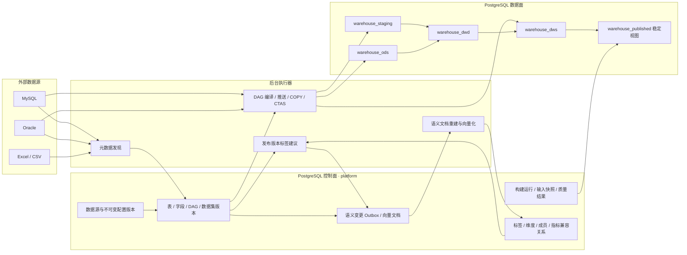

# 分层数据平台与语义层技术方案

本文定义数据源、ODS/DWD/DWS、物化执行、标签与语义检索的目标架构和本轮落地边界。核心原则是：控制面与数据面分离、所有运行版本不可变、测试不等于发布、跨源数据只以流式暂存进入 PostgreSQL、LLM 只生成候选语义而不获得执行权。

## 1. 总体架构



`platform` schema 只保存配置、元数据、不可变版本、血缘、运行和索引信息，不保存动态业务事实表。业务数据按层写入独立 `warehouse_*` schema。所有表名由服务端根据租户、数据集和运行 ID 计算，客户端不能提交物理表名或 SQL。

## 2. 数据源生命周期

数据源主对象与连接配置版本分离。每次创建、连接字段修改、密码轮换或文件重传都会生成新的不可变配置版本；已发布版本继续运行，直到新草稿完成测试并显式上线。

```text
DRAFT / UNTESTED
       │ test
       ├────────失败────────> DRAFT / FAILED
       │
       └────────成功────────> DRAFT / PASSED
                                  │ publish（同 version + hash，30 分钟内）
                                  ▼
                             ACTIVE / PUBLISHED
                                  │ edit
                                  ▼
                     旧发布版本继续运行 + 新草稿 UNTESTED
```

约束如下：

- `test` 只产生绑定 `configVersionId + configHash` 的短期测试证据，不切换运行配置。
- `publish` 必须验证测试证据未过期、配置版本未变化、摘要完全一致。
- discovery、采样、同步和运行查询只读取发布版本；管理页面可以读取当前草稿。
- 密码以 AES-256-GCM 密文引用保存，API、审计和日志不回显密码或内部引用。
- Excel/CSV 每次上传产生不可变文件版本；数据集与物化输入固定到精确文件版本。
- 所属人、可见范围、描述、创建/修改人和时间是控制面字段，不混入连接 JSON。

## 3. 数据集层级合同

层级是数据集版本的不可变属性，不由表名或用户界面文字推断。

| 层级 | 合法输入 | 合法操作 | 明确禁止 |
| --- | --- | --- | --- |
| ODS | 一个已发布物理表或精确文件版本 | 字段选择、重命名、类型规范化、脱敏等非聚合转换 | Join、Group、业务聚合 |
| DWD | 一个或多个已发布 ODS 精确版本/物化 | 投影、过滤、转换、Join | Group 和业务聚合 |
| DWS | 一个或多个已发布 DWD 精确版本/物化 | PostgreSQL 内 Join、分组、聚合、派生汇总字段 | 直接引用外部源表、在内存完成主计算 |

历史 DSL 未声明 `layer` 时，服务端用确定性规则归类：含聚合为 DWS；单表、无 Join 为 ODS；其他为 DWD，并保留旧 TABLE 执行兼容以避免改写已发布正文/hash。显式声明层级的新 DSL 采用严格节点合同：ODS 只能是 TABLE，DWD 只能是 ODS DATASET，DWS 只能是 DWD DATASET，DWD/DWS 不能混入 TABLE。新客户端必须显式写入层级，不能依赖历史兼容绕过治理。

系统由完成映射的表/Sheet 自动生成 ODS 时，会固定
`MATERIALIZED_PREFERRED + enabled=true + ON_DEMAND`。不可变发布版本和首个
`QUEUED` build 在同一事务提交，build 固定精确源发布版本与元数据摘要；源端抽取
只会在事务提交后由 worker 执行。启动对账按同一确定性幂等键补齐历史遗漏 build。
该默认值只适用于 `originTableId` 标识的系统映射 ODS，普通设计器新建的数据集
不会被隐式开启物化。

映射 ODS 的后续结构刷新采用保守所有权栅栏，不是“所有已发布映射表自动升级”。
仅当当前发布版本具有不可变的 `SYSTEM_MAPPED_* publication_origin`、当前草稿仍与
该版本冻结的来源草稿身份、记录版本、schema hash 和 plan hash 完全相同，且没有
`PENDING` 发布申请时，系统才能生成下一版本。人工保存、待审批和人工审批发布都会
使系统刷新失败关闭，且不得改变草稿、发布指针、build 或审计；软删除后的重新映射
也执行同一规则，不能以“重建”为由丢弃人工修订。审计只承担追踪，不参与授权；
该设计仍把 API/worker 数据库角色视为可信边界。

每次构建固定以下输入证据：

- 精确数据集版本、文件版本或物化 ID；
- schema hash、snapshot hash、来源版本和可选水位；
- 规范 DAG、plan hash、input snapshot hash；
- 每个节点的执行引擎和依赖关系。

输入快照不能包含密码、原始 SQL、样本行或任意业务数据。

## 4. ODS 元数据完善与标签

发布数据源后，用户才能进入表/Sheet 选择。数据集版本发布事务会同时写入
`dataset_tag_suggestion_jobs`，固定租户、数据集、精确版本、层级、schema hash、
源发布版本快照和 Prompt 版本。任务以这些内容作为幂等及版本栅栏；领取后若数据集
已被新发布版本取代、源版本或结构发生变化，任务以 `SKIPPED / SUBJECT_CHANGED`
结束，不把旧建议写回新版本。

数据集自动标签建议链路有意不读取业务样本行。ODS 输入只包含已治理的数据源类型、表和
投影字段技术元数据、已有业务说明、键属性和表标签；DWD/DWS 输入包含当前数据集的
字段、DAG、粒度，以及精确发布上游版本的字段和已批准标签摘要。任务、AI 审计、
日志和错误信息均不保存凭据、SQL、表达式字面值或业务数据值。

上游“表/Sheet → ODS 元数据完善”任务另有独立样本授权：默认 `DENY`，完全不读取
业务行；`MASK` 最多读取十行并在应用进程内做格式脱敏；`RAW` 是租户策略允许后的
逐任务高风险授权。任务冻结策略版本和授权人，并在任务开始、采样前、LLM 调用前
三次失败关闭复核。无论哪种模式，样本值都不落控制库、日志或审计表，也不会进入
后续数据集标签建议 worker。

模型只能从当前租户 `ACTIVE + CONTROLLED` taxonomy 中选择已有标签。请求使用严格
JSON Schema，并以 tag ID 枚举约束输出；输入最多 192 KiB、taxonomy 最多 1024 个
标签、单次最多 256 个建议。自动选择覆盖：

- `BUSINESS_DOMAIN`：业务域；
- `BUSINESS_ENTITY`：业务实体；
- `TABLE_FUNCTION`：表的功能；
- `USAGE_SCOPE`：使用范围；
- `DATA_GRAIN`：一行代表什么粒度；
- `JOIN_ROLE`：主键、外键、业务键、桥接键及关联方向；

`SENSITIVITY` 和 `FREEFORM` 仍可由人工治理，但模型不能自动创建或选择它们。
关联定位依据字段描述、主外键/唯一性/可空性和 DAG Join 条件中的字段引用；条件中的
业务字面值不会进入模型输入。

标签本体、别名、资产绑定和向量文档分别存储：

- `semantic_tags` / `semantic_tag_aliases`：受控词表与别名；
- `asset_tag_bindings`：标签和精确数据集版本、字段、维度、成员、指标版本的关联；
- `semantic_documents`：可重建的检索文档与 embedding；
- `semantic_change_outbox`：编辑后的可靠重建事件。

模型结果只会创建 `origin=LLM,status=SUGGESTED` 的精确数据集版本绑定，绝不会
自动批准；若同一绑定已存在，则保留其现有 `SUGGESTED / APPROVED / REJECTED`
治理结论。管理员通过语义管理 API 批准后，v60 触发器在同一事务推进
`semantic_change_outbox.event_version`，后台再重建文档及向量。因此编辑标签
不会改写数据集 DSL，迟到 worker 也不能覆盖新版本结果。

## 5. ODS 提取与 DWD/DWS 执行策略

ODS 从 MySQL/Oracle 抽取时，把安全可证明的字段投影和源过滤编译为源库受限参数化
查询，再使用 NDJSON 分批流传输。Go 执行器按规范类型校验每个值，并在同一个
PostgreSQL 事务中用 `COPY` 写入运行级 `warehouse_staging`；不会把完整明细装入
Go 或 Python 内存。远端错误、字段漂移、类型错误、行数不一致或 COPY 失败都会
回滚整个暂存表。Excel/CSV 采用相同的定型与事务落库边界；其对象读取、解析展开、
worksheet 内存和逻辑 staging 另有逐层硬预算，不把“只选小 Sheet”作为放宽大文件
读取的理由。

DWD 的输入已经是 PostgreSQL 中精确 ACTIVE 的 ODS 物化，DWS 的输入已经是精确
ACTIVE 的 DWD 物化，因此无论上游最初来自同库还是跨库，Join、字段转换、DWD
明细整合和 DWS 分组聚合都统一在 PostgreSQL 中执行。这避免了跨源内存 Join，也
不会为“同源优化”重新绕过已经冻结的 ODS 版本。当前版本没有把 DWD DAG 重新下推
到原始 MySQL/Oracle；后续若引入 source-affinity 优化，必须证明与冻结 ODS 快照
语义等价后才能启用，不能以文档描述替代实现。

Connector 的资源上限不只按单数据源配置。进程级
`CONNECTOR_MAX_POOLS`（开发默认 1,000）限制连接池注册表，
`CONNECTOR_MAX_TOTAL_CONNECTIONS`（开发默认 100）限制池化与 one-shot 连接合计
的物理数据库 socket；两项在 production 都必须显式配置。新池达到上限时，LRU
只淘汰没有借用者、没有等待 acquire 引用的完全空闲池。新物理连接达到上限时也只
回收已有池中的空闲连接，活动连接永不被驱逐；没有空闲连接时等待本次连接超时后失败
关闭。草稿连接测试共享全局物理连接配额，但每次使用 one-shot 连接并在所有终态关闭，
不进入普通池，也不会因大量不同草稿配置在 TTL 窗口内堆积池。

Connector 和 Go 调用方同时执行字节预算；远端配置漂移或 Connector 被替换时，
Go 侧仍在 JSON 解码、NDJSON 消费和 `COPY` 前独立失败关闭。当前开发默认值如下，
生产环境必须逐项显式注入：

| 边界 | 默认上限 | 失败语义 |
| --- | ---: | --- |
| 单个 Connector HTTP 请求体 | 1 MiB | 解析凭据前返回 `413 CONNECTOR_REQUEST_BODY_LIMIT_EXCEEDED` |
| 普通 JSON 响应 | 64 MiB | 服务端稳定资源码；Go 用 `LimitReader` 做 max+1 复核 |
| 技术元数据同步 | 200,000 个源字典行，并共享普通 JSON 64 MiB | fetch 阶段 `METADATA_SYNC_*_LIMIT_EXCEEDED` |
| 元数据样本单元格 / 单行 / 整体响应 | 16 KiB / 64 KiB / 512 KiB | `METADATA_SAMPLE_*_BYTES_EXCEEDED` |
| ODS NDJSON 单元格 / 单行 / 整条流 | 1 MiB / 4 MiB / 1 GiB | `QUERY_*_BYTES_EXCEEDED`，整次流失败 |
| 单个 NDJSON 事件 | 8 MiB 内部硬上限 | `QUERY_STREAM_EVENT_BYTES_EXCEEDED` |
| 每租户、每物化任务的数据库或 Excel/CSV staging 逻辑载荷 | 512 MiB | `ErrStageBytesExceeded`，事务回滚 |

样本仍最多十行、最多 256 个明确投影字段；投影来自已发现元数据，二进制、LOB、
Oracle `LONG / LONG RAW / XMLTYPE / JSON` 等不安全类型在 Go 和 Connector 两侧
排除或拒绝。普通查询、样本和流式查询不会用静默 `LIMIT` 把截断结果当成完整结果；
行数、列数、单元格、单行、响应/整流以及仓储载荷任一超限都使调用失败。对外物化
仍统一收口为 `ODS_STAGING_FAILED`，底层稳定码只用于无敏感值的运维诊断。

文件 ODS 以 `min(max_excel_file_bytes, WAREHOUSE_STAGE_MAX_BYTES)` 作为 CSV、
XLS 和对象读取硬上限；XLSX 的展开总量与 worksheet 内存预算还分别取解析器自身
上限和 `WAREHOUSE_STAGE_MAX_BYTES` 中的更严格值。逻辑投影行在 COPY 前继续累计
受同一 staging 上限约束。因此低 staging cap 会保守拒绝“压缩文件本体较大、但选中
Sheet 很小”的文件；这是防止压缩炸弹和解析前内存失控的安全优先兼容取舍，不应通过
绕过对象读取上限解决。

MySQL 技术元数据同步、普通查询和 ODS 都使用真正的 `SSCursor` 逐批读取。预算终止、
主动取消、客户端断流或任何流式异常都会先关闭 socket，并把物理连接标为不可复用，
防止驱动在归还连接池时排空未读结果而产生无界读取；Oracle 游标也遵循同样的异常
连接丢弃合同。驱动仍须先物化一个源字段值，cell 上限不是源端单值峰值内存的绝对
上限，因此还需容器内存限制、源字段/LOB 策略和数据库最大包配置。上述字节
预算是应用级防线，不替代容器内存/CPU 限额、数据库 statement timeout、任务超时
和源库资源管理。

## 6. 物化、质量门与发布

物化采用 shadow build + atomic activation：

1. `Register` 固定已发布数据集版本、计划和全部输入快照，以内容摘要生成幂等键。
2. worker 使用 `FOR UPDATE SKIP LOCKED` 和随机 lease token 领取任务。
3. 节点按 DAG 执行，记录输入/输出行数、大小、错误和重试。
4. PostgreSQL 使用服务端编译的 DSL 执行 CTAS，生成运行级不可变 shadow table。
5. 至少执行行数、业务键非空/唯一、schema hash 和声明的质量规则。
6. 质量门通过后，在一个事务中把旧 ACTIVE 物化标记为 RETIRED、登记新 ACTIVE、完成构建运行；稳定发布视图指向新物化。
7. 任何失败都保留可审计运行记录，但不会替换当前发布版本。

构建运行、节点运行、输入快照、质量结果与物化登记分别存储，避免把易变运行状态塞入数据集版本。

### 当前 worker 落地边界

本轮可执行 worker 已支持 ODS/DWD/DWS 的 PostgreSQL 闭环：

- 只领取服务端已登记的不可变 build run，并持续用随机 lease token 心跳续租；
- 重新加载仍为当前发布态的目标 `dataset_version`，严格校验规范 DSL 与 `schema_hash`；
- ODS 只接受单个 `TABLE` 节点和单个 SOURCE 输入。输入必须同时固定当前
  `PUBLISHED` 的 `data_source_version`、活动元数据表及其 `structure_hash`；
- MySQL/Oracle 的投影和可下推过滤由受限方言编译器在源端执行，Connector 以严格
  NDJSON 流传输，最多 5,000,000 行，最终批次直接 typed COPY 到 run-scoped
  `warehouse_staging`，不会把完整源表装进 API/worker 内存，也不会把静默截断当成功；
- Excel/CSV 只读取发布配置绑定的精确不可变 `file_version`，在对象存储读取时复核
  `assetId + versionId + size + SHA-256`，再复核 Sheet、投影和规范类型。行数、列形状
  或单元格类型漂移都会让同一 PostgreSQL staging 事务回滚；对象读取、XLSX
  展开/worksheet 内存和逻辑 staging 同时受上述更严格预算约束；
- ODS staging 完成后再次检查数据源发布指针、资产状态、结构摘要和文件摘要，再由
  同一个可信 CTAS、质量门和原子激活链路生成 `warehouse_ods` 物理表及稳定视图；
- DWD 只接受 ODS、DWS 只接受 DWD；每个冻结输入必须解析到同租户、同精确版本、当前 `ACTIVE` 的物化及其 `warehouse_published` 稳定视图；
- 解析时同时校验 ACTIVE 稳定视图和其不可变物理表；CTAS 读取冻结物化的运行级物理表，而不直接读取可能被下一次发布切换的稳定视图，避免“解析后、执行前”发生上游快照漂移；
- 输入的 schema hash、snapshot hash 和可选 row count 必须与 ACTIVE 物化完全一致，DSL 中每个节点必须有且只能有可信输入；`sourceVersion` 仅作为审计标签，不参与物理定位；
- 所有计划节点必须声明 PostgreSQL 执行；worker 按 DAG 拓扑记录节点运行，最终由受限 DSL 编译器和 CTAS 执行；
- 当前只执行 `FULL + TABLE`，`INCREMENTAL`、`BACKFILL` 和 `PARTITIONED_TABLE` 分别以 `REFRESH_MODE_UNSUPPORTED`、`PARTITIONED_TABLE_UNSUPPORTED` 失败关闭，不会暗中退化成全量表；
- 激活前记录输出行数、`pg_total_relation_size`、确定性 snapshot hash，以及行数和声明粒度键质量结果；
- 丢失租约后立即取消数据库工作，后续节点更新和激活仍由 token + 数据库时间双重栅栏保护。过期运行重领时会从计划起点重放全部节点。

当前仍不执行 `INCREMENTAL`、`BACKFILL`、`PARTITIONED_TABLE` 或非单表 ODS。缺少
对应 Connector/stager 的源类型会以 `ODS_SOURCE_STAGING_NOT_CONFIGURED` 失败；
源重新发布、结构漂移或文件摘要不匹配会以 `ODS_SOURCE_CONTRACT_INVALID` 失败；
源读取、类型转换或 COPY 失败使用 `ODS_STAGING_FAILED`，超时使用
`ODS_STAGING_TIMEOUT`。这些都是可审计终态，不会创建 ACTIVE 物化。

### 发布试跑与指标查询读取路径

构建路径和交互式读取路径使用不同的并发合同。worker 构建 DWD/DWS 时读取冻结
materialization ID 对应的运行级不可变物理表；数据集发布试跑、草稿/版本预览和
DWS 指标试算则读取当前 ACTIVE 物化对应的 `warehouse_published` 稳定视图：

```text
严格 DSL
  → 租户事务解析精确版本 + 当前发布指针 + ACTIVE materialization
  → 允许列白名单 + PostgreSQL 结构化编译
  → 执行事务 FOR SHARE 再校验全部绑定和视图 SELECT 权限
  → 参数化 SELECT warehouse_published
  → 查询审计 + 精确 materialization 绑定
```

解析器不递归重放上游 DAG，也不接受客户端 SQL、稳定视图名或物理表名。DWD 节点
只能绑定当前发布且 ACTIVE 的 ODS 精确版本，DWS 节点只能绑定同条件的 DWD 精确
版本；任一节点缺失、失效、换版、换 ACTIVE 指针、摘要漂移或稳定关系异常都会在
执行前失败关闭。执行事务对 materialization、版本和所有者行加共享锁，阻止原子
激活在查询中途切换指针；实际 SELECT 同时取得 PostgreSQL 视图关系锁。

查询主记录用 `execution_engine=POSTGRES` 区分源 Connector 路径，不伪造
`data_source_id`。`query_run_materializations` 与候选预览对应表保存每个节点实际
读取的 dataset/version/materialization、稳定视图及 schema/snapshot hash，且与
主审计一样强制租户 RLS、禁止身份字段原地修改。API 角色只拥有
`warehouse_published` 的 USAGE/SELECT；运行级物理 schema 仍只对 worker 可见。

DWS 指标始终绑定指标定义中的精确 DWS 版本及其当前 ACTIVE 物化，不重放 DWS
DAG。可证明可分解的输出才允许再次汇总：SUM/MIN/MAX 保持聚合，COUNT 按 SUM
汇总；AVG、COUNT_DISTINCT、计算度量和当前参数化 DWS 失败关闭。指标草稿预览和
发布前验证都经过同一解析、锁定、执行和 materialization 审计路径。

## 7. 语义层和倒排检索

DWS 发布版本上的维度成为一级对象。维度固定到精确 DWS 数据集版本和字段，记录类型、基数策略、敏感性、定义摘要和状态。维度成员由物化表去重扫描得到，存储规范值、归一化值、哈希、有效期与别名。

DWS 版本发布只登记待物化的维度勘测运行；精确 `ACTIVE DWS` 物化出现后，数据库
根据非度量字段生成可审计、可编辑的 `SUGGESTED` 候选。候选证据冻结版本、schema、
materialization、snapshot、row count 和字段元数据，不读取业务样本，也不会自动
发布。接受时再次验证当前发布/物化绑定，并在精确字段风险锁下重读已批准敏感标签。
同一次物化激活还会为每个候选字段登记冻结的 `dimension_profile_jobs`。普通字段只
计算行数、非空/空值数和有界 NDV，不保存样本、极值或 Top 值；文本 NDV 直接按
原字段类型和 `COLLATE "C"` 分组，不先转成 text。敏感字段和 `IDENTIFIER` 在读取
业务行前分别以 `SKIPPED_POLICY + NONE` 和
`SKIPPED_POLICY + EXACT_ONLY` 收口。历史已批准敏感绑定、非停用敏感维度、候选
风险或既往敏感跳过记录构成不可自动放松的版本内风险下限。

`FULL` 只有在当前发布版本、当前 `ACTIVE DWS` 物化和该精确字段的
`SUCCEEDED + FULL` 画像同时成立时才可发布和刷新。新物化激活会立即把旧
`PUBLISHED + FULL` 维度收紧为 `NONE`，清空刷新代际和最后任务指针；画像完成后
仍需显式评审恢复 `FULL`。接受 `FULL` 候选会在同一事务登记固定物化、
100,000 成员/60 秒边界的刷新任务；新代际任务成功前，旧成员及别名一律不进入
列表或成员到指标检索。

完整成员刷新使用同一专用 PostgreSQL 连接、单个 `READ COMMITTED` 事务内的
“扫描 + late-gate merge” fenced 流程：

1. 扫描阶段只锁定并读取任务登记的 run-scoped DWS 物理表，不取得租户治理门，
   也绝不读取或锁定 `warehouse_published` 稳定视图。每批最多 1,000 行进入 scratch 临时表，
   随即在 PostgreSQL 内规范去重并以 `ON CONFLICT` 合并到最多
   `maxMembers + 1` 的持久会话临时 stage，再清空 scratch；Go 堆内不维护全量成员
   map。物理表上的 `SHARE` 锁一直保留到 generation 提交，等待中的 DML 不能穿过
   scan/merge 边界。
2. 扫描结束但不提交事务；late-gate 阶段才取得租户语义治理门，按照物化 → 数据集 → 字段 →
   任务/维度行的统一顺序加锁，重新验证 lease、维度版本、策略/敏感性、发布指针、
   精确物化、schema/snapshot、`SUCCEEDED + FULL` 画像，以及稳定视图 owner 和
   对物理表的唯一依赖，然后原子完成成员新增、更新、停用和 generation 切换。
   `READ COMMITTED` 使这些重读能看到扫描期间已经提交的治理变化。

“late-gate 阶段”表示其中不再执行源表全量 `DISTINCT`，并不表示常数时间：成员
INSERT/UPDATE/DEPRECATE 仍随成员量增长，当前最大可达 1,000,000 个，整个 merge
期间仍持有 tenant governance gate。它保证单代切换与治理写入串行化，但也形成需要
监控和容量规划的写入临界区。物化激活可在长扫描期间完成；若其切换了稳定视图或
当前 ACTIVE 指针，merge 栅栏以 `REFRESH_SOURCE_CHANGED` 或 lease 失效拒绝旧
stage，不污染新代际。临时表在连接归还池前删除，清理失败则丢弃该物理连接。

“run-scoped 物理表 ACTIVE 后不可变”目前是 report_worker 的可信生命周期边界，
不是对已攻陷 owner 的数据库绝对封存。`SHARE` 只阻止本次刷新事务并发的
`INSERT/UPDATE/DELETE/TRUNCATE`；事务提交后 owner 仍能主动修改或移除保护对象。
生产强化方向是把构建写角色与 immutable owner/清理角色分离，或为 ACTIVE 表安装并
核验拒绝 DML 的保护触发器，同时为历史 ACTIVE 物化做迁移回填。

成员读取不是只靠租户 RLS。`members`、成员别名和成员到指标检索会在同一 SQL
快照中使用 actor 身份重新判定：

- actor 必须具有全局 `DATASET:READ`，或目标 DWS 数据集的用户/角色对象级
  `DATASET:READ`；
- 只要该数据集存在适用于 actor 的任一行策略，预计算成员索引就不能安全裁剪；
- 只要维度字段存在适用于 actor 的任一非 `ALLOW` 列策略，包括 `DENY`、`MASK`、
  `AGGREGATE_ONLY`、`NULLIFY` 或 `HASH`，也禁止成员枚举。

精确指定维度的 members/aliases 请求稳定返回
`403 SEMANTIC_MEMBER_ACCESS_DENIED`，且不携带成员值；未指定维度的别名目录和
跨维度 member-metric-search 则静默过滤无权或受策略限制的维度，使“无权命中”和
“不存在”都表现为空。指标检索还必须同时满足指标数据集的读取权限。这些规则不会把
预计算索引误当成可以逐行执行 row policy 的查询结果。

检索链路不是物化“维度成员 × 指标”的笛卡尔积，而是分解为：

```text
查询词
  → dimension_members / dimension_member_aliases
  → semantic_dimensions
  → dimension_metric_compatibility
  → metric_versions
  → dataset_versions
  → 当前 ACTIVE materialization / warehouse_published 视图
```

`dimension_metric_compatibility` 只保存较小的维度—指标兼容关系，并明确：

- `DIRECT / BRIDGE / DERIVED` 关系类型；
- `SAFE / DEDUPLICATE / UNSAFE` 扇出策略；
- 可审计 Join 路径、证据来源、置信度和人工验证状态。

只有已验证且非 `UNSAFE` 的关系可以用于自动回答。敏感维度被数据库约束为只能
使用 `NONE`，高基数维度只能采用 `EXACT_ONLY` 或 `NONE`；敏感成员不会从
列表或指标搜索 API 枚举。所有维度成员检索都直接使用租户内成员/别名表，不生成
语义文档，也不发送给外部 embedding provider。

名词转换作为别名而不是硬编码特殊分支。例如“690 → 智家生态圈”保存为维度成员别名或受控标签别名，带来源、有效期和审计人；查询规范化后仍保留原始词用于解释和审计。

## 8. 指标合同

指标版本继续使用严格的结构化定义，当前可执行合同包含：

- 指标名称、编码、说明；`metric.description` 是正式版本中的业务口径正文；
- `ATOMIC / DERIVED / RATIO` 类型及精确原子指标依赖；
- 允许维度与时间粒度；
- 精确数据集版本所固化的过滤范围；
- 单位、数字格式、可加性与空值/除零策略；
- 聚合方式；
- 精确数据集版本、字段表达式和上游指标版本血缘。

指标执行不接收客户端 SQL。服务端从已发布 DWS 数据集版本和指标定义派生查询计划。
维度—指标兼容关系当前用于成员到指标的语义检索和自动回答候选筛选；v1 指标试算/
发布尚未注入该验证器，执行阶段只使用指标定义内的允许维度白名单和 DWS 再聚合安全
门。因此在兼容验证器真正接入前，不能把语义检索结果直接描述成已经受兼容关系保护
的指标执行。

当前 `metric-definition-v1` 没有可由单个指标另行放宽的数据集外
`modifiers/fixedFilters` 字段：固定修饰条件继承自精确数据集版本，内部指标候选会
另存 `caliber`、过滤摘要和结构化血缘供创作审核，但不能改变执行口径。若业务需要
“同一数据集、不同指标各自带固定修饰词”，应升级为新的指标合同版本，使用字段/
一级维度的精确引用和受限表达式执行，不能把自由文本口径当成可执行过滤。

候选 v2 合同、DWS 直接字段型 MVP、严格 NULL/时区/敏感性规则，以及未来
`ScopedAggregate` IR 见
[`指标定义 v2：结构化口径与修饰词设计`](./metric-definition-v2-design.md)。该方案
当前明确标记为 **DESIGN ONLY / NOT YET ACCEPTED BY RUNTIME**；现有 API、Schema、
Go 服务、数据库和查询运行时仍只承诺 v1，架构文档中的链接不构成 v2 上线声明。

## 9. 安全与运维边界

- 所有控制表启用并强制租户 RLS；跨租户 ID 表现为不存在。
- API 与 worker 不信任客户端 SQL、物理标识符、层级或输入快照。
- 源库账号必须只读；应用层词法校验不能替代数据库授权。
- 生产 Connector 必须显式配置 `CONNECTOR_EGRESS_ALLOWLIST`，且只接受
  `IP/CIDR:port`；数据源仍可填写 DNS 名，但每次新建物理连接时解析出的**全部**
  地址都必须落入对应端口的授权 CIDR。通过校验后驱动直连一个确定的已验证 IP，
  原始 hostname 只用于连接池身份与审计，阻断常规 DNS rebinding。
- 生产还必须显式配置平台控制面 CIDR 的 `CONNECTOR_EGRESS_DENYLIST`，deny
  优先于 allow；loopback、link-local、multicast、unspecified、reserved 和云
  metadata 地址，以及所有 IPv4-mapped IPv6 地址，即使误入 allowlist 也会被拒绝。
  hostname allowlist 只允许本地开发 compose 使用，生产配置中出现即启动失败。
- 应用 allow/deny 与 IP pinning 不是网络隔离的替代品。Connector 所在子网的
  Security Group / NetworkPolicy / 主机防火墙必须默认拒绝出站，只放行批准的
  数据库 CIDR 与端口，并明确阻断平台 PostgreSQL、Redis、MinIO、API 和云控制面。
  Oracle listener/SCAN 可能在协议握手后下发重定向地址，该后续连接不受首次 DSN
  DNS pinning 的完整证明；代理配置错误、驱动漏洞和已攻陷进程也属于同类残余。
  因此 Oracle 重定向目标约束及控制面不可达性仍以网络层作为硬门和验收项。
- `warehouse_*` 对 `PUBLIC` 无权限。生产部署应使用独立 warehouse executor DSN：执行角色拥有数据面 `USAGE/CREATE`，API 角色仅拥有必要的控制面权限和发布视图读取权限。
- 动态表需要保留期和清理任务：失败 staging、retired 物化和过期运行分开配置 TTL，清理前检查活动指针与血缘引用。
- retired 物理表清理还必须检查 `QUEUED/RUNNING` 构建的冻结输入（精确 materialization ID，或数据集版本 + schema/snapshot hash）；只要仍有进行中的构建引用该快照，就不能删除其不可变物理表。
- 监控至少覆盖构建及标签建议队列等待、租约恢复、标签建议跳过/失败率、源端读取量、
  COPY 吞吐、池注册表/全局物理连接使用率、空闲 LRU 淘汰、全局连接等待/超时、
  one-shot 测试连接数、各级字节预算使用率与拒绝码、文件读取/展开预算拒绝、断流
  连接丢弃、出站 DNS/allow/deny 拒绝、构建耗时、质量失败、Outbox 积压、
  embedding 失败和成员索引基数。
- 成员刷新需要把扫描和 merge 分开观测：扫描行数/耗时、规范去重数、超基数、
  `REFRESH_SOURCE_CHANGED`、过期 lease、stage 清理失败、merge 行数/耗时，以及
  tenant governance gate 等待/持有时间。日志和指标只能带租户、任务和稳定结果码，
  不得把 hostname、IP、凭据、SQL、成员/样本值作为高基数标签或错误正文。

## 10. 交付顺序

1. 数据源不可变版本、测试证据和显式发布；
2. 数据集层级合同与历史回填；
3. 物化控制表、执行计划、租约、质量门和数据面 schema；
4. 同源 PostgreSQL CTAS、跨源流式 staging；
5. 标签本体、资产绑定、Outbox 与向量文档；
6. DWS 维度勘测、成员索引和维度—指标兼容关系；
7. 管理 API/UI、调度、数据保留策略和独立执行角色；
8. 按租户/数据域灰度迁移，双读校验后再关闭旧实时链路。

在灰度期，旧数据集可以继续预览，但新物化链路只接受符合层级合同的已发布精确版本。不得自动把历史任意 TABLE 输入视为已治理的上游层级。
