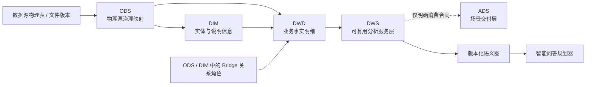
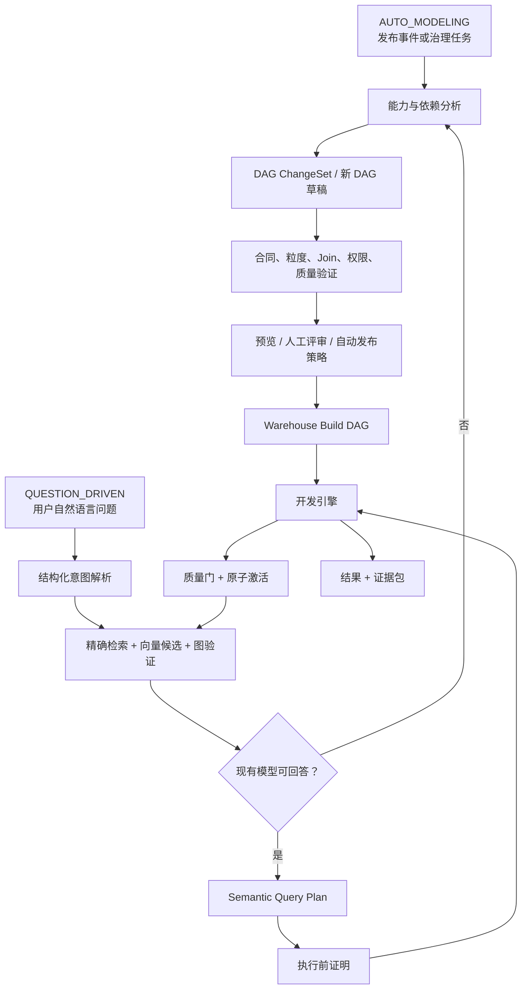

# 智能问答语义层与分层建模改造计划

状态：`IMPLEMENTED / PRODUCTION VALIDATION PENDING`
范围：ODS、DIM、DWD、DWS、语义图、LLM 编排、查询规划与可信问答
暂缓：没有明确消费场景的 ADS 自动生成
配套任务清单：[智能问答语义层优化 TODO](./TODO-semantic-qa-optimization.md)

## 1. 改造目标

本轮改造不是继续增加若干数据表，而是把现有分层数据平台升级成可供智能问答可靠
规划、执行和解释的语义底座。完成后系统必须同时支持：

1. 自动发现并生成 DIM、DWD、DWS 的结构化草稿和构建 DAG；
2. 一张 DWD 事实关联用户、商品、地域、渠道等多张 DIM；
3. 通过桥接表安全表达多值维度，不让事实金额因 Join fanout 被重复计算；
4. 用户通过自然语言问题查询已有模型，或提出对现有 DAG 的局部修改和新 DAG；
5. 沿“维度值 → 维度 → 指标 → 数据表 → 数据源”返回可验证的完整证据链；
6. 任务中断后从有效检查点继续，只重试瞬时错误，不重复生成已经确认的设计；
7. LLM 只提出结构化设计或变更，底层开发引擎负责物理 SQL、质量门和原子激活。

“可靠”在本项目中不是向量相似度足够高，而是最终查询使用的每个对象、版本、关系、
物化和权限都能由控制面的权威事实证明。

实施结果（2026-07-25）：

- 迁移 84–95 已实现分层合同、可恢复 ChangeSet、消费合同、版本化语义图、
  查询证据/执行、黄金问题、市场 DWS 自动草稿和执行质量元数据；
- 迁移 1–95 已在独立空库通过，本地控制库已前向应用 84–95；
- 领域校验、JSON Schema、物化注册/解析、查询运行时和标签 worker 已同步为
  `DIM <- ODS`、`DWD <- ODS + optional DIM`、`DWS <- DWD`；
- Bridge 分配权重/有效区间、SCD2 event-time、事实/分析合同和多事实共同粒度
  均有 DSL、数据库与回归夹具；
- 自动与人工问题共用结构化 ChangeSet，旧 DatasetAI 候选通过兼容边界转换为
  有界 patch；自动草稿保持人工所有权栅栏；
- 语义图已本地重建至 generation 3（120 nodes / 112 edges），并由专项脚本
  验证 generation、水位、物化、证据、ADS 合同、RLS 和角色边界；
- QueryPlan 执行会再次验证完整路径，成员值通过参数绑定真实过滤；
- 生产规模压测、业务黄金问题录入、告警阈值和灾备演练必须在目标环境完成，
  详见 [TODO](./TODO-semantic-qa-optimization.md) 的 `OPS-*`。

## 2. 实施前基线与主要差距

### 2.1 实施前已具备的能力

仓库当前已经具备以下基础，改造应复用而不是重写：

- ODS、DIM、DWD、DWS、ADS 五层枚举、物理 schema、不可变版本和物化登记；
- ODS 发布后的领域分类、DIM/DWD 草稿生成、逐 FACT 检查点和人工修改保护栅栏；
- 五层数据集的标签建议任务、受控 taxonomy、语义文档和向量化 outbox；
- DWS 语义维度、成员、成员别名、指标兼容关系及成员值到指标检索；
- 最多 8 跳的结构化 Join path、关系基数、fanout 策略和 ACTIVE 物化校验；
- shadow build、质量门、稳定视图和原子激活；
- 交互式自然语言修改已有数据集 DAG 的提案流程；
- 网络/超时/429/5xx 有界重试，结构化输出失败后的定向修复，以及租约和版本栅栏。

### 2.2 已修正的差距

| 范围 | 改造前 | 已实现状态 |
| --- | --- | --- |
| 层级输入合同 | `DIM/DWD <- ODS`；`DWS <- DWD + optional DIM` | `DIM <- ODS[1..N]`；`DWD <- ODS[1..N] + DIM[0..N]`，其中输入关系可声明 Bridge 角色；`DWS <- DWD[1..N]` |
| DWD 语义 | 已能把被分类的维度 ODS 直接展开到 DWD | DWD 必须引用正式 DIM 精确版本，支持多 DIM、角色扮演维度、SCD2 和桥接关系 |
| DWS 设计 | 允许直接绑定 DIM，缺少通用分析模板和物化决策 | 物理输入只来自 DWD；通过一致性维度元数据校验兼容性；按价值决定是否物化 |
| DAG 概念 | 持久化构建 DAG 与一次性查询/修改意图边界不够清晰 | 分成 Build DAG、Semantic Query Plan、DAG ChangeSet |
| 语义检索 | 已有成员到指标的局部链路 | 建立覆盖 DWS、字段、物化、DAG、DWD/DIM/ODS 和源版本的完整权威图 |
| 查询执行 | 指标执行主要依赖 `allowedDimensions`，尚未强制消费兼容关系 | 查询规划和执行前必须验证 VERIFIED 关系、Join path、版本、权限、物化和新鲜度 |
| 向量职责 | 已用于标签和语义资产召回 | 只做候选召回；不能直接确认成员归属、指标兼容或 Join 路径 |
| 问答质量 | 缺少统一的答案证据合同和黄金问题回放 | 每次回答返回证据包；持续运行标准问题、标准计划和安全反例 |
| ADS | 已有层级和物化能力 | 保留消费合同；没有消费场景时禁止自动生成和组合 DWS |

## 3. 修订后的分层合同

### 3.1 总体生成顺序



### 3.2 DIM

合同：

```text
DIM <- ODS[1..N]
```

一张 DIM 表示一个稳定业务实体，而不是简单复制一张 ODS。允许多个 ODS 共同构成
客户、商品、门店、组织等统一实体，必须声明：

- 业务实体和一行粒度；
- 自然键、代理键和来源键映射；
- 主数据优先级、去重和冲突解决规则；
- SCD 类型；SCD2 必须有生效、失效时间和当前版本标识；
- 未知、缺失、迟到维度的处理方式；
- 名称、分类、层级、状态等有分析价值的说明字段；
- 字段级来源、清洗规则、敏感级别和质量规则。

### 3.3 DWD

合同：

```text
DWD <- 1 个业务事实粒度
       + 事实相关 ODS[1..N]
       + 相关 DIM[0..N]
       + 输入中的多值维度 Bridge 关系[0..N]
```

“一个业务事实”不等于“只能使用一张 ODS”。订单头、订单行、付款和退款等多个
源对象可以共同还原一个事实，但输出必须声明唯一事实粒度和业务键。

Bridge 是输入关系的建模角色，不增加第六个数据层。它可以由 ODS 关联表或具有
`tableFunction=BRIDGE` 的 DIM 关系数据集提供；如果桥接本身记录可度量的业务动作，
则应建成独立 DWD 事实，而不是伪装成维度。

一张 DWD 可以关联任意数量的用户、商品、地域、渠道、门店、组织等 DIM。直接 Join
从事实侧观察只允许：

- `MANY_TO_ONE`；
- `ONE_TO_ONE`。

这条限制针对“每条事实在同一个维度关系中命中多行”，不限制 DIM 的数量。

以下情况必须使用 Bridge 或先改变事实粒度：

- 商品同时属于多个品类；
- 账户同时属于多个客户；
- 一次活动同时关联多个负责人；
- 一次诊疗同时存在多个诊断。

Bridge 至少包含事实/实体键、维度成员键、关系类型、生效区间，以及可选的分配权重。
对应指标必须显式声明：

- `PRIMARY`：只取主成员；
- `ALLOCATE`：按权重分配；
- `DEDUPLICATE`：按事实键去重；
- `NON_ADDITIVE`：禁止普通求和；
- `UNSAFE`：禁止自动问答使用。

SCD2 DIM Join 必须使用事实事件时间约束有效区间，并由质量门证明每条事实最多命中
一个有效版本。DWD 至少保留事实键、事件时间、相关实体代理键、退化维度、原子度量、
来源版本和关键分析说明；不能因展开 DIM 属性而丢失正式 DIM 键和版本血缘。

### 3.4 DWS

合同：

```text
DWS <- DWD[1..N]
```

DWS 可以由一个 DWD 形成趋势、排名、用户或商品汇总，也可以组合多个 DWD。多事实
组合必须先分别聚合到共同粒度，再通过一致性维度和时间脊柱对齐；除非能证明一对一，
禁止直接做行级 fact-to-fact Join。

DWS 的逻辑合同必须包含：

- 业务主题和分析意图；
- 主体粒度与时间粒度；
- 输入事实、原子度量和指标版本；
- 可用维度、层级和一致性维度映射；
- 过滤范围、单位、币种、时区、NULL 和迟到数据语义；
- 可加性、去重和 fanout 策略；
- 物化模式、刷新策略、新鲜度 SLA 和质量规则。

首批通用分析模板：

1. 趋势、同比和环比；
2. 分布、排名、Top N 和结构占比；
3. 多维下钻和交叉分析；
4. 漏斗与转化；
5. 队列、留存和复购；
6. 生命周期和状态迁移；
7. 异常、差异和贡献度；
8. 订单、支付、退款等多事实对比。

模板是逻辑规划能力，不代表自动物化全部“指标 × 维度”组合。只有满足复用频率、
计算成本、稳定 SLA 或治理要求的结果才提升为物理 DWS。

### 3.5 ADS

ADS 当前不进入自动生成队列，只保留消费合同：

```text
consumerType
consumerId
businessScenario
sourceDwsVersionIds
metricVersionIds
dimensions
deliverySchema
refreshSla
accessPolicy
```

没有明确报表、看板、接口、监管报送或应用消费方时，任务必须以
`SKIPPED / CONSUMER_CONTRACT_REQUIRED` 结束，不能自动组合所有 DWS。

## 4. 三类 DAG 与双入口兼容

### 4.1 三类受控对象

| 对象 | 生命周期 | 用途 |
| --- | --- | --- |
| Warehouse Build DAG | 持久、版本化、可发布 | 构建 DIM、DWD、DWS 物理结果 |
| Semantic Query Plan | 一次查询或短期缓存 | 使用已发布语义对象回答问题，不修改仓库 |
| DAG ChangeSet | 可评审、可应用、可拒绝 | 对已有 Build DAG 做局部补丁，或提出新 DAG |

DAG ChangeSet 不保存完整重写结果作为唯一事实，至少支持：

```text
ADD_NODE / REMOVE_NODE / UPDATE_NODE
ADD_FIELD / REMOVE_FIELD / UPDATE_FIELD
ADD_JOIN / REMOVE_JOIN / UPDATE_JOIN
ADD_FILTER / UPDATE_FILTER
ADD_AGGREGATION / UPDATE_AGGREGATION
UPDATE_GRAIN / UPDATE_QUALITY_RULE
```

每个 ChangeSet 固定：

- 基线数据集、版本、schema hash 和 plan hash；
- 问题或自动任务的规范化意图；
- 变更操作、理由和证据；
- 受影响的下游对象；
- 预期输出合同和测试；
- 生成器/Prompt 版本和幂等键。

### 4.2 双入口



两种入口必须共用 ChangeSet、验证器、版本、人工所有权栅栏、发布和审计合同。规则如下：

- 用户问题能由当前模型回答时，只生成 Query Plan；
- 缺少维度、指标、关系或物化时，生成 ChangeSet，不直接修改已发布 DAG；
- 自动任务不得覆盖人工修改过的草稿或待审批对象；
- 同一基线版本上的不相交 ChangeSet 可合并；重叠变更必须重新基于最新版本；
- 澄清问题是正常等待状态，不是失败，也不能自动重复调用同一提示；
- 发布后重新执行原问题，只有证据链完整时才标记能力缺口已关闭。

## 5. 可恢复 LLM 编排和重试优化

### 5.1 阶段化任务

建议把自动建模拆成以下可独立检查点：

```text
SOURCE_SNAPSHOT
→ BUSINESS_CLASSIFICATION
→ DIM_ENTITY_DESIGN（每个实体独立）
→ FACT_GRAIN_DESIGN（每个事实独立）
→ DIM_RELATIONSHIP_DESIGN（每个事实独立）
→ DWD_BUILD_PLAN（每个事实独立）
→ DWS_INTENT_CANDIDATES（每个主题独立）
→ DWS_BUILD_PLAN（每个候选独立）
→ VALIDATION
→ REVIEW_OR_PUBLISH
```

同一阶段内不同实体、事实和 DWS 候选可以并行；依赖未就绪时进入
`WAITING_DEPENDENCY`，不能占用 LLM 重试额度。

### 5.2 自动任务触发矩阵

| 事件 | 自动任务 | 门禁和输出 |
| --- | --- | --- |
| ODS 当前版本发布 | 标签建议、领域分类、DIM/事实候选发现 | 固定 ODS 版本和 schema hash；输出候选或检查点 |
| DIM 当前版本发布 | 标签建议、受影响 DWD 能力重评估 | 只生成 ChangeSet；不能覆盖人工 DWD 草稿 |
| DWD 当前版本发布 | 标签建议、DWS 通用分析候选发现 | 固定 DWD、物化和质量证据；不穷举维度组合 |
| DWS 当前版本发布并激活物化 | 标签建议、维度勘测、成员刷新、指标关系、图投影 | 只有已发布精确版本和 ACTIVE 物化进入语义图 |
| 指标或语义关系发布 | 图投影、黄金问题影响回放 | 旧关系进入 STALE；新关系仍需验证门 |
| 用户问题到达 | 意图解析、语义检索、Query Plan 或能力缺口 ChangeSet | 能回答时不建表；缺能力时不直接发布 |
| 消费合同发布 | ADS 候选 | 当前阶段默认关闭；启用后也必须经评审和发布 |

所有任务使用事务 outbox 或等价的 durable queue 注册，不能在发布事务提交后使用
“尽力而为”的 goroutine。标签、建模、图投影和黄金问题回放是独立任务；其中一个
Provider 或 worker 暂时不可用，不能回滚已经完成的发布事务。

### 5.3 错误分类

| 错误类型 | 处理方式 |
| --- | --- |
| 网络、超时、429、5xx | Provider 层有限退避重试 |
| 租约丢失、进程退出 | 新 worker 从已验证检查点继续 |
| 结构化输出不合格 | 一次定向修复，只携带失败字段和规则 |
| 字段、版本或发布指针变化 | `SUBJECT_CHANGED`，重新基于新快照规划 |
| 粒度冲突、fanout、字段不存在 | 返回对应设计节点修复，不重复完整流程 |
| 人工已修改草稿 | `SKIPPED / HUMAN_OWNED` |
| 需要用户澄清 | `WAITING_CLARIFICATION` |
| 权限或敏感策略拒绝 | 永久失败关闭，不换表达方式绕过 |

幂等键至少包含：

```text
tenantId
taskKind
normalizedIntentHash
sortedInputVersionIds
schemaHashes
planHashes
promptVersion
policyVersion
```

LLM 原始响应不作为恢复依据。只有通过本地合同校验的结构化结果才能进入检查点。

## 6. DWS 以上的版本化语义图

### 6.1 权威事实与图投影

现有指标、维度、数据集、物化和血缘专用表继续作为权威事实。不要用一个通用 EAV
图表替代这些强约束领域表。新增图能力应是可重建的读模型：

```text
领域表事务
→ semantic_change_outbox
→ graph projector
→ immutable graph generation
→ current_generation pointer
```

查询只能读取一个完整 generation，不能在一次规划中混用新旧图。投影失败时保留上一
个完整 generation，并暴露延迟和失败状态。

### 6.2 节点

| 节点 | 必要身份 |
| --- | --- |
| TERM / ALIAS | 租户、语言、规范化文本、来源、有效期 |
| DIMENSION_MEMBER | 维度、成员键、规范值、有效期、敏感策略 |
| SEMANTIC_DIMENSION | 精确 DWS 版本和字段、类型、层级、状态 |
| METRIC_VERSION | 精确指标版本、粒度、聚合、单位、时间语义 |
| DATASET_FIELD | 数据集版本、字段 ID、角色、类型 |
| DATASET_VERSION | ODS/DIM/DWD/DWS、schema hash、plan hash、状态 |
| MATERIALIZATION | 精确数据集版本、快照、状态、新鲜度 |
| DAG_VERSION | 规范计划 hash、输入版本集合 |
| SOURCE_OBJECT_VERSION | 表、Sheet 或文件的不可变版本 |
| DATA_SOURCE_VERSION | 数据源不可变发布版本 |

### 6.3 边

```text
ALIAS_OF
MEMBER_OF
COMPATIBLE_WITH
BOUND_TO_FIELD
CALCULATED_FROM
MATERIALIZED_AS
DEPENDS_ON
SOURCED_FROM
GOVERNED_BY
```

关键边必须携带来源版本、目标版本、状态、证据、置信度、评审人、生效区间，以及适用
时的 Join keys、cardinality、fanout policy 和 Join path。版本换代后旧边进入
`STALE`，不能继续用于自动规划。

## 7. “指标优先、维值限域”的可靠检索

### 7.1 检索与证明流程

```text
用户表达
→ 意图与时间/排序合同
→ 当前 PUBLISHED 指标清单候选
→ 精确名称/编码优先，文本与向量候选重排
→ 当前 PUBLISHED 指标版本
→ 指标版本绑定的精确数据集版本
→ 仅在该指标 VERIFIED、非 UNSAFE 的维度内匹配成员键/别名
→ 成员归属图验证
→ VERIFIED 维度—指标关系
→ ACTIVE 且满足新鲜度的物化
→ DWS Build DAG
→ DWD / DIM / ODS 精确版本
→ 源表、Sheet 或文件版本
→ 数据源发布版本
```

不允许先全库扫描维度成员再反向猜指标或数据集。向量结果只能增加指标候选，
不能创建或证明关系；成员值只走租户内精确索引，不能发送给外部模型。自动执行前
必须通过硬门：

- 对象属于当前租户且 actor 有权读取；
- 维度、指标和数据集均为当前 `PUBLISHED` 版本；
- 物化为 `ACTIVE`，且满足问题所需的新鲜度；
- 兼容关系为 `VERIFIED` 且不是 `UNSAFE`；
- Join path 连续、字段类型相容、基数与指标可加性安全；
- 时间、时区、单位、币种、NULL、去重和固定过滤条件完整；
- 没有未解决的同名成员或同义词歧义。

只有硬门全部通过后，才使用词法、向量相似度、历史使用频率等软分数排序。

### 7.2 必须澄清的情况

- 一个词匹配多个维度且没有明显领先的受治理候选；
- 同一个维度值在所选时间点对应多个有效成员；
- 用户没有说明同名指标的业务口径；
- 请求的维度与指标之间只有向量相似，没有 VERIFIED 关系；
- 一对多或多对多路径没有明确分配或去重语义；
- 多条同等可信 Join 路径会产生不同结果。

这些情况返回一个针对性的澄清问题，不自动猜测，也不自动重试原问题。

### 7.3 答案证据包

每次成功回答都返回或持久化：

```json
{
  "normalizedIntentHash": "...",
  "memberMatches": [],
  "dimensionVersions": [],
  "metricVersions": [],
  "compatibilityIds": [],
  "joinPath": [],
  "datasetVersions": [],
  "materializationIds": [],
  "sourceObjectVersions": [],
  "dataSourceVersions": [],
  "accessDecisionId": "...",
  "freshnessAt": "...",
  "queryPlanHash": "...",
  "graphGeneration": "...",
  "qualityEvidenceIds": []
}
```

对用户的自然语言解释必须能从这份证据包重建，不能引用计划外的数据表或指标。

## 8. 智能问答还需建设的能力

| 能力 | 主要内容 |
| --- | --- |
| 业务术语库 | 标准词、简称、历史编码、语言、适用域、有效期和审核状态 |
| 指标中心 | 公式、粒度、可加性、时间口径、单位、币种、过滤、版本和所有者 |
| 维度中心 | 实体、成员、别名、层级、角色扮演维度、SCD 和敏感策略 |
| 语义关系图 | 指标兼容、字段绑定、Join path、基数、fanout 和完整血缘 |
| 时间与单位系统 | 日历、会计期、时区、汇率、单位换算和比较窗口 |
| 查询规划器 | 意图解析、候选召回、图验证、选表、Join、聚合和预检 |
| 策略执行 | 数据集、行、列、成员、指标和答案级权限 |
| 答案解释 | 口径、过滤、时间范围、来源、新鲜度、质量和限制 |
| 评测反馈 | 黄金问题、标准计划、结果断言、安全反例和用户纠错闭环 |

## 9. 分阶段实施

### Phase 0：合同冻结与兼容基线

目标：在继续扩展实现前冻结新合同，并证明当前行为。

交付：

- 新层级依赖矩阵、DWD 多 DIM/Bridge 关系、DWS 输入和 ADS 门禁 ADR；
- 各环境迁移 84–95 的账本确认；
- 现有数据集、DAG、物化和语义关系的兼容性扫描；
- 旧行为的回归夹具和可回退开关。

退出条件：任何环境已应用的迁移不被改写；新旧合同差异均有测试样例和迁移策略。

### Phase 1：分层 DAG 合同改造

目标：实现 `DIM <- ODS`、`DWD <- ODS + DIM（含 Bridge 关系角色）`、`DWS <- DWD`。

交付：

- 数据库、DSL、API Schema、服务端 Prepare、build input 和 worker resolver 同步改造；
- 多 DIM、角色扮演维度、SCD2 和 Bridge 结构合同；
- DWS 单/多 DWD 规划和共同粒度验证；
- 现有 DWD/DWS 的影响分析、前向迁移和灰度兼容。

退出条件：所有非法越层输入在 API、服务和数据库三层失败关闭；合法多维事实和桥接
反例通过集成测试；旧发布版本继续可读。

### Phase 2：统一 ChangeSet 与可恢复编排

目标：自动建模和人工问题使用同一变更、验证、发布流程。

交付：

- Build DAG、Query Plan、DAG ChangeSet 领域模型；
- 局部 patch、冲突检测、预览、应用、拒绝和审计 API；
- 分阶段检查点、等待状态、错误分类和幂等恢复；
- 人工所有权和发布指针栅栏。

退出条件：中断恢复不重复已完成 LLM 阶段；确定性错误不产生循环重试；人工草稿不被
后台覆盖；用户问题可以在“直接查询”和“提出模型变更”之间正确分流。

### Phase 3：权威语义图和端到端检索

目标：完成维度值到数据源的可证明路径。

交付：

- 图 generation、节点/边投影、outbox 消费和一致性监控；
- 精确、别名、词法、向量的多路召回和统一候选；
- 图路径验证、STALE 失效、权限与新鲜度门；
- 完整 evidence bundle API。

退出条件：任何返回的指标候选都能追溯到当前物化和源版本；向量命中但无图关系时不会
执行；版本切换后旧边无法继续规划。

### Phase 4：查询规划器与智能问答闭环

目标：从自然语言稳定生成可执行、可解释的语义查询。

交付：

- 结构化问题意图；
- 指标、维度、成员、时间、过滤、排序和比较规划；
- 兼容关系强制接入 query runtime；
- 查询前 fanout、粒度、单位、时间、权限和质量预检；
- 答案、证据、澄清和错误解释合同；
- 黄金问题与安全反例回放。

退出条件：问答执行不允许绕过语义图；相同输入版本和意图生成相同计划 hash；错误答案
可定位到召回、关系、规划、数据质量或执行中的具体阶段。

### Phase 5：通用 DWS 模板和生产加固

目标：覆盖市场通用场景，并在真实负载下稳定运行。

交付：

- 八类通用分析模板；
- 逻辑 DWS 到物理物化的收益决策；
- P95/P99 性能、超大成员目录、图投影延迟和并发压测；
- SLO、告警、回放、灾备和运营看板；
- 真实用户反馈和模型变更晋升策略。

退出条件：每个目标业务域通过黄金问题、权限、安全、回退和容量验收；ADS 仍只有在
明确消费合同存在时才启用。

## 10. 影响范围

实施时至少检查以下模块：

- `internal/dataset`：层级、DSL、DWD/DWS 建模和 ChangeSet；
- `internal/materialization`、`internal/materializationworker`：输入矩阵、解析和物化；
- `internal/datasettagsuggestion`：冻结依赖和五层标签上下文；
- `internal/semanticmanagement`：维度、成员、兼容关系和端到端搜索；
- `internal/semanticcatalog`：语义文档、图 outbox 和投影；
- `internal/metric`、`internal/queryruntime`：指标兼容强制验证和查询证据；
- `internal/ai`、`internal/datasetai`、`internal/metricai`：双入口、ChangeSet 和重试；
- `api/schemas`、`docs/api-*`：合同与错误码；
- `web/src/pages/DatasetCenterPage.tsx`、`SemanticGovernancePage.tsx`：预览、治理和证据；
- `migrations`、`scripts/verify-database.sh`、`scripts/verify-warehouse.sh`：数据库封口。

本地迁移账本已经应用 84–95，且空库 1–95 已通过。上述迁移均为不可变历史，后续
数据库修正必须从 96 开始前向实现。测试、预发布和生产仍须读取各自账本，不能根据
本地或 Git 状态推断其他环境。

## 11. 验收总门槛

以下条件全部满足后，才能称为本轮落地完成：

1. 一张事实 DWD 可安全关联多张 DIM；
2. 一对多和多对多不能在缺少明确策略时汇总可加指标；
3. DWS 只以 DWD 为物理输入，且支持一个或多个事实；
4. ADS 没有消费合同时不会自动生成；
5. 自动任务和人工问题共用 ChangeSet、验证、发布及人工所有权规则；
6. 中断后只补缺失检查点，永久错误不会触发无效重试；
7. 向量检索不能绕过精确版本、VERIFIED 关系、权限和物化门禁；
8. 每个答案都能追溯到维度值、指标版本、DWS、DAG、ODS 和数据源版本；
9. 所有新增表启用租户隔离，所有查询执行复用行列权限；
10. 空库迁移、旧库升级、Go 测试、race、vet、前端测试、lint、build 和关键数据库
    集成测试全部通过；
11. 黄金问题、歧义问题、fanout、安全越权、版本切换和陈旧物化反例全部通过；
12. 灰度期间可关闭新规划器并继续读取旧的已发布版本。

## 12. 设计依据

- Kimball 对多值维度建议通过 Bridge 表表达，并在必要时加入生效区间和分配语义：
  <https://www.kimballgroup.com/data-warehouse-business-intelligence-resources/kimball-techniques/dimensional-modeling-techniques/multivalued-dimension-bridge-table/>
- Looker 将 Join 基数和主键唯一性作为聚合正确性的重要合同，并明确说明 fanout 风险：
  <https://docs.cloud.google.com/looker/docs/working-with-joins>
- dbt Semantic Layer 将指标定义与自动 Join 规划分离，可作为指标合同与查询规划边界参考：
  <https://docs.getdbt.com/>
- OpenLineage 使用 Dataset、Job、Run 组织执行血缘，可作为物化执行证据的兼容参考：
  <https://openlineage.io/docs/next/>
