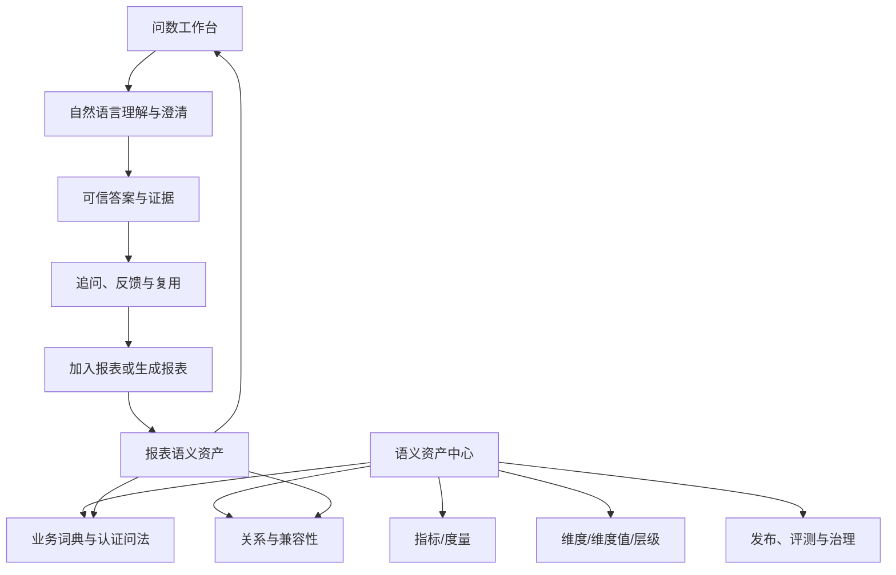

# 智能分析决策平台——最终产品设计方案

> 文档状态：最终交付版  
> 文档版本：V1.2 Final（按「智能分析决策平台」定位修订）
> 基准日期：2026-08-10
> 适用仓库：`331819353/intelligent_report_generation_system`  
> 适用对象：业务负责人、产品经理、数据负责人、指标 Owner、语义管理员、研发、测试、安全与运维团队  
> 文档优先级：本文件作为产品范围、业务流程和验收口径的基线；定位与逐模块闭环以[《智能分析决策平台——功能模块与业务闭环审视》](./智能分析决策平台_功能模块与业务闭环审视.md)为当前优先基线；前端页面与交互设计以[《前端用户旅程与操作流程》](./智能分析决策平台_前端用户旅程与操作流程.md)为操作级基线；第五部分与前四部分冲突时，以第五部分为准

---

## 0. 文档目的

本文件给出可直接用于立项、需求评审、产品设计、业务域接入、研发拆分、试点验收和生产发布的完整产品方案。产品面向业务人员，以智能问数和智能报告为两个核心分析入口，以决策协同和结果复盘完成价值闭环：

1. **可信智能问数**：用户使用业务语言提问，系统通过受治理语义层、混合检索、图关系验证、确定性查询和有界自纠错获得可信答案。
2. **配置化智能报表**：用户通过模板、对话和可视化编辑生成报告；报告以统一 JSON DSL 发布，并与问数共享指标、维度、数据版本和证据。
3. **决策协同与复盘**：用户可将已验证分析固定为决策证据，分配行动项，并用后续指标验证决策效果；平台不直接执行外部业务交易。

本方案不是“任意数据库的万能 Text-to-SQL”。95% 正确率只对完成语义治理、通过密封评测的业务域和问题范围成立。

## 0.1 最终产品决策

| 决策项 | 最终方案 |
|---|---|
| 产品定位 | 面向业务人员的、语义治理驱动的智能分析决策平台 |
| 价值闭环 | 发现问题 → 可信分析 → 报告沉淀 → 决策/行动 → 指标复盘 |
| 首期数据范围 | 已发布且 ACTIVE 的 DWS/ADS |
| 查询生成 | LLM 不直接生成 SQL，由 Semantic IR 经 Go 编译器确定性生成 |
| 图数据库 | NebulaGraph，PostgreSQL 为语义事实源 |
| 向量检索 | PostgreSQL + pgvector，并与 Exact、Lexical、认证问法联合召回 |
| 维度值识别 | 先确定维度，再在维度内检索成员 |
| 低置信处理 | 继续取证、定向澄清或阻断，不强答 |
| 智能结论 | 确定性 Evidence Bundle + LLM 叙述 |
| 报告存储 | Report Definition JSON 为设计态唯一事实来源 |
| 发布形态 | 语义 Release、报告版本和查询计划均不可变、可回滚 |
| 95% 证明 | 2,000 条以上密封黄金集、覆盖率约束和安全门禁 |
| 业务扩张 | 按业务域逐个接入，不一次覆盖全企业 |
| 未结束周期 | 默认 `MTD`，实际区间必须对用户可见（D01） |
| 报表资产认证 | 单人审批；语义 Release 激活仍为双人审批（D02） |
| 报告分享 | 不允许匿名访问，必须登录并按查看者权限执行（D03） |
| 超范围明细需求 | 在本平台内提供明细取数申请闭环（D04） |

## 0.2 产品模块编号

| 编号 | 产品模块 |
|---|---|
| P01 | 平台、组织、租户和权限 |
| P02 | 数据源、元数据和数据资产 |
| P03 | 数仓与数据集建模 |
| P04 | 语义模型与实体 |
| P05 | 指标与度量中心 |
| P06 | 维度、成员和层级中心 |
| P07 | 业务词典、认证问法和 KPI Bundle |
| P08 | 语义发布、评测和审批 |
| P09 | 分析入口与智能问数工作台 |
| P10 | 查询结果、证据和追问 |
| P11 | 配置化报告设计器与运行时 |
| P12 | 问数与报表资产融合 |
| P13 | 反馈、主动学习和运营 |
| P14 | 系统管理、监控和成本治理 |
| P15 | 决策协同与行动复盘 |

### 0.2.1 产品模块与技术模块对照

产品文档使用 P01～P15，技术文档使用 M01～M20，两套编号必须按下表对照，禁止在评审、WBS 和验收中混用。

| 产品模块 | 对应技术模块 | 说明 |
|---|---|---|
| P01 平台、组织、租户和权限 | M01 | 一对一 |
| P02 数据源、元数据和数据资产 | M02 | 一对一 |
| P03 数仓与数据集建模 | M03 | 一对一 |
| P04 语义模型与实体 | M04 | 一对一 |
| P05 指标与度量中心 | M05 | 一对一 |
| P06 维度、成员和层级中心 | M06 | 一对一 |
| P07 业务词典、认证问法和 KPI Bundle | M07 | 一对一 |
| P08 语义发布、评测和审批 | M08 + M18（评测门禁部分） | 发布与评测分属两个技术模块 |
| P09 分析入口与智能问数工作台 | M09、M10、M11、M12、M13、M14、M15 | 一个产品模块对应七个问数技术模块；分析首页在前端组合各资产读模型 |
| P10 查询结果、证据和追问 | M16 | 一对一 |
| P11 配置化报告设计器与运行时 | M17 + 技术文档第三部分 | 报告引擎细节在专章 |
| P12 问数与报表资产融合 | M17 + M07（报表资产入知识库） | 双向链路跨两个模块 |
| P13 反馈、主动学习和运营 | M18 | 一对一 |
| P14 系统管理、监控和成本治理 | M19 + M01（权限与配额） | 成本与权限分属两个模块 |
| P15 决策协同与行动复盘 | M20 | 新增的决策支持闭环；不执行外部业务交易 |

## 0.3 使用方式

- **立项和范围评审**：阅读第一部分和第二部分。
- **需求评审**：以第二、第三部分的产品模块和流程为准。
- **页面设计**：以问数工作台、语义中心和报告设计器章节为准。
- **业务域接入**：以业务域准入、RACI、语义发布和黄金集章节为准。
- **验收和上线**：以最终验收标准、Go/No-Go 和 95% 发布门禁为准。

---

# 第一部分：业务可行性、范围与运营模型

## 1. 结论摘要

### 1.1 综合判断

| 评估维度 | 判断 | 说明 |
|---|---|---|
| 市场与业务价值 | 高 | 能减少重复取数、统一指标口径、缩短报告生产周期 |
| 技术可实现性 | 中高 | 当前项目已有数据集、语义注册表、检索、图谱和问数合同基础 |
| 95% 目标可实现性 | 有条件可行 | 必须限定业务域和问题范围，并把澄清/拒答计入正确行为 |
| 数据准备难度 | 高 | 真正瓶颈是指标、维度、关系、成员和黄金集的业务治理 |
| 组织协同难度 | 高 | 需要业务 Owner、数据 Owner、语义管理员和平台团队长期协作 |
| 规模化难度 | 中高 | 单业务域试点可控，多域扩张需要标准接入工厂和治理机制 |
| 与智能报表协同价值 | 很高 | 问数结果可沉淀为报告，报告又可形成认证问数资产 |

**综合可行性建议评分：7.5/10。**

项目值得继续，但产品定位必须从“万能 Text-to-SQL”调整为：

> **基于企业受治理语义资产、面向业务人员的智能分析决策平台，以问数和报告形成可信证据，以决策、行动和复盘完成价值闭环。**

### 1.2 业务上为什么可行

1. 企业的数据使用高度集中在一批高频指标、维度和固定分析方式，而不是无限 SQL。
2. 用户真正需要的是可信答案、口径解释和快速复用，不是看到 SQL。
3. 已有 DWS/ADS 和配置化报表可以显著缩小问数问题空间。
4. 对歧义进行澄清是正常业务流程，不必强行追求每次直接回答。
5. 问数运行、用户纠错和报告使用可以持续积累认证问法和高频映射。
6. 把问数与报表放在同一个语义底座上，可避免重复建设指标和数据绑定。

### 1.3 业务上为什么可能失败

1. 企业没有统一指标口径，却要求 AI 自动解决组织争议。
2. 业务域无限扩张，未治理数据也被纳入 95% 承诺。
3. 只建设问数页面，不建设指标、维度、成员、关系和黄金集管理。
4. 语义资产没有 Owner，变更后无人评审和回归。
5. 业务不接受澄清，只接受“一问即答”。
6. 对数据质量、权限和新鲜度没有明确责任人。
7. 用户反馈直接修改生产同义词，导致错误被放大。
8. 将报表自由文本当作语义事实，形成错误知识循环。
9. 项目只由研发推进，业务和数据团队没有投入。
10. 用 Demo 成功率替代密封评测结果。

---

## 2. 建议产品定位

### 2.1 不应定位为

- 任意数据库的通用自然语言 SQL 生成器。
- 替代全部数据分析师。
- 自动解决所有指标口径争议的 AI。
- 不需要维护语义资产的零配置产品。
- 对任何问题均直接给答案的聊天机器人。

### 2.2 应定位为

- 企业统一指标和语义资产的消费入口。
- 业务人员的可信自助分析工具。
- 数据分析师的高频取数自动化工具。
- 问数、智能报告、指标治理与决策复盘的一体化平台。
- 通过澄清、证据和审计降低错误决策风险的系统。

### 2.3 首个业务域的选择标准

建议首个试点域同时满足：

| 条件 | 推荐标准 |
|---|---|
| 业务价值 | 高频使用、重复取数多、决策链路短 |
| 数据成熟度 | 已有稳定 DWS/ADS |
| 指标数量 | 20～50 个核心指标 |
| 维度数量 | 20～40 个核心维度 |
| 数据质量 | 主要指标有质量监控和明确 Owner |
| 关系复杂度 | 以单模型或少量安全 Join 为主 |
| 用户规模 | 20～100 名种子用户 |
| 问法积累 | 能提供至少 500 条真实问题 |
| 业务负责人 | 愿意参与口径和黄金集审批 |
| 风险等级 | 不建议首期选择财务结账、监管报送等高风险域 |

推荐首期场景：

- 销售经营分析
- 渠道经营分析
- 商品经营分析
- 库存和周转分析
- 客户运营分析

不推荐首期场景：

- 跨集团财务合并
- 自由归因分析
- 风险授信决策
- 强监管报送
- 未完成数据治理的跨域经营分析

---

## 3. 95% 目标的业务条件

### 3.1 95% 不是纯模型指标

达到 95% 需要四个条件同时成立：

```text
业务语义覆盖
  × 数据质量
  × 系统工程正确性
  × 评测和运营治理
```

任一项缺失，模型能力再强也不能稳定达到目标。

### 3.2 业务口径

必须同时公布：

- 严格端到端正确率
- 可回答覆盖率
- 直接回答率
- 正确澄清率
- 正确拒答率
- P0 问题正确率
- 安全问题通过率

不能通过大量拒答制造虚假高正确率。

### 3.3 承诺边界

对外或对内部用户声明时，应写成：

> 在已发布语义层覆盖的业务域、已认证指标和维度、已支持的问题类型范围内，经过至少 2,000 条密封黄金集评测，系统严格端到端正确率的 95% 置信下界达到 95%。

不应写成：

> 系统对企业任何问题的回答准确率达到 95%。

---

## 4. 当前设计遗漏点

### 4.1 P0：没有这些就无法上线

| 遗漏点 | 影响 | 必须补充的业务能力 |
|---|---|---|
| 业务域接入流程 | 每个域都临时建设 | 标准化 Domain Onboarding |
| 角色和责任 | 指标无人负责 | RACI、Owner、审批和 SLA |
| 权限模型产品化 | 技术有权限，业务不知道如何配置 | 角色、对象、数据范围管理 |
| 数据建模工作台 | 只谈问数，不谈数据如何准备 | DWS/ADS 设计、发布、质量 |
| 指标建设中心 | 指标只存在于技术 Schema | 创建、审批、认证、变更和废弃 |
| 维度成员治理 | 无法稳定识别维度值 | 画像、别名、层级、有效期和索引策略 |
| 业务词典管理 | 高频映射无维护入口 | 词典、负向上下文和冲突管理 |
| 语义发布中心 | 资产变更会直接影响生产 | Release、评测、审批、激活和回滚 |
| 澄清产品流程 | 低置信时没有用户闭环 | 候选解释、继续运行和上下文继承 |
| 黄金集管理 | 无法证明 95% | 样本、双人评审、密封和门禁 |
| 反馈工单 | 错误无法治理 | 结构化反馈、归因和修复审批 |
| 报表资产认证 | 报表可能污染问数 | 报表资产准入和版本规则 |
| 运维和成本 | 模型和查询成本失控 | 预算、限流、监控和容量管理 |

### 4.2 P1：决定产品能否规模化

- 多业务域隔离与跨域路由。
- 指标影响分析。
- 维度成员增量刷新。
- 业务日历和财务日历。
- 查询模板和 KPI Bundle。
- 常用问题、收藏和团队共享。
- 问数结果保存和复用。
- 报表模板市场。
- 线上主动学习。
- 多模型策略和成本分层。
- 多数仓方言支持。
- 审核和变更通知。
- 业务使用分析和价值度量。

### 4.3 P2：增强型能力

- 多人协作语义建模。
- AI 辅助指标候选发现。
- 自动分析和主动洞察。
- 订阅和定时问数。
- 异常告警转问数。
- 多语言语义层。
- 受控自定义分析函数。
- 外部知识与数据解释融合。

---

## 5. 建议的业务能力地图

```text
平台治理
├── 租户、组织、用户、角色
├── 业务域和数据域
├── 权限、安全和审计
└── 配置、模型和成本策略

数据资产
├── 数据源
├── 元数据
├── 数据画像
├── 数仓建模
├── 数据集
├── 物化
├── 质量
└── 血缘

语义资产
├── 实体
├── 语义模型
├── 度量
├── 指标
├── 维度
├── 维度成员
├── 层级
├── 关系
├── 时间口径
├── 业务词典
├── KPI Bundle
└── 认证问法

智能问数
├── 问题理解
├── 候选检索
├── 联合绑定
├── 图关系验证
├── 查询编译
├── 执行校验
├── Agent Loop
├── 澄清
├── 答案和图表
└── 会话与追问

智能报表
├── 报告模板
├── 报告设计器
├── 问数加入报告
├── 智能结论
├── 发布和导出
└── 报表语义资产

质量运营
├── 黄金集
├── 发布评测
├── 用户反馈
├── 主动学习
├── 运行监控
└── 价值分析
```

---

## 6. 业务运营模型

### 6.1 关键角色

| 角色 | 核心责任 |
|---|---|
| 业务域 Owner | 确认业务边界和优先级 |
| 指标 Owner | 批准指标定义、公式和默认过滤 |
| 维度 Owner | 批准维度、层级、成员和别名 |
| 数据 Owner | 对数据集、新鲜度和质量负责 |
| 语义管理员 | 组织语义资产建设和发布 |
| 数据开发 | 建设 DWS/ADS 和物化 |
| 平台研发 | 建设系统和算法 |
| 评测人员 | 独立审核黄金问题 |
| 安全管理员 | 审核权限和敏感策略 |
| 种子用户 | 试用、反馈和真实场景验证 |

### 6.2 RACI

| 工作项 | 业务 Owner | 指标/维度 Owner | 数据 Owner | 语义管理员 | 平台团队 |
|---|---|---|---|---|---|
| 确定试点范围 | A | C | C | R | C |
| 建设 DWS/ADS | C | C | A/R | C | C |
| 指标定义 | C | A/R | C | R | I |
| 维度和成员 | C | A/R | C | R | I |
| 关系和粒度 | C | C | A/R | R | C |
| 高频词审核 | C | A | I | R | C |
| 黄金集 | A | R | C | R | C |
| 语义发布 | A | R | R | R | C |
| 系统发布 | I | I | I | C | A/R |
| 线上问题处理 | A | R | R | R | C |

A：最终负责；R：执行；C：协商；I：知会。

### 6.3 业务 SLA 建议

| 事项 | 建议 SLA |
|---|---|
| P0 指标口径确认 | 2 个工作日 |
| 高频词审批 | 3 个工作日 |
| 线上错误初步归因 | 1 个工作日 |
| 语义修复候选 | 3～5 个工作日 |
| P0 数据质量问题 | 4 小时响应 |
| 普通数据质量问题 | 1 个工作日 |
| 语义发布周期 | 每周或双周 |
| 密封集回归 | 每次语义/模型重大变更 |

---

## 7. 业务域接入流程


### 7.1 接入准入条件

- 至少一个明确业务 Owner。
- 至少一个稳定 DWS/ADS。
- P0 指标有清晰口径。
- 关键维度有稳定编码或成员键。
- 能提供真实问题。
- 有数据质量责任人。
- 接受系统澄清和拒答策略。
- 同意以密封集作为发布门禁。

### 7.2 接入退出条件

- 数据模型频繁变化且无版本。
- 指标争议无法解决。
- 没有 Owner 参与。
- 敏感数据无法满足安全要求。
- 无法提供足够评测问题。
- 用户要求超出当前产品支持范围。

---

## 8. 用户业务流程

### 8.1 问数流程

```text
用户提问
  ↓
系统理解并展示口径摘要
  ↓
直接回答 / 请求澄清 / 阻断
  ↓
用户查看答案、图表和证据
  ↓
继续追问 / 加入报告 / 保存问题 / 反馈
```

### 8.2 指标建设流程

```text
从数据集发现候选度量
  ↓
创建指标草稿
  ↓
填写定义、公式、单位、粒度、默认过滤
  ↓
配置适用维度和正反例
  ↓
技术校验
  ↓
指标 Owner 审批
  ↓
加入语义发布
  ↓
黄金集回归
  ↓
激活
```

### 8.3 维度成员建设流程

```text
扫描数据集字段
  ↓
选择成员索引策略
  ↓
生成成员画像
  ↓
维护规范值、显示名、别名、层级和有效期
  ↓
敏感和高基数校验
  ↓
Owner 审批
  ↓
构建精确/词法/向量索引
```

### 8.4 报表资产流程

```text
报告发布
  ↓
提取指标、维度、筛选、Semantic IR 和叙述角色
  ↓
判断是否满足认证条件
  ↓
Owner 审批
  ↓
进入问数认证资产
  ↓
支持相似问法和图表推荐
```

---

## 9. 商业价值和衡量

### 9.1 可量化价值

建议在试点前采集基线：

- 每月人工取数工单量。
- 平均响应时长。
- 指标口径争议次数。
- 重复报表制作工时。
- 数据分析师处理简单问题占比。
- 错误数据导致的返工量。

上线后衡量：

| 指标 | 目标示例 |
|---|---:|
| 高频取数自助解决率 | ≥ 60% |
| 平均答案时间 | 从小时/天降至分钟 |
| 简单取数工单下降 | ≥ 40% |
| 月报制作时间下降 | ≥ 50% |
| 认证指标复用率 | ≥ 80% |
| 问数加入报告率 | ≥ 10% |
| 用户二次使用率 | ≥ 40% |
| 错误问题闭环率 | ≥ 90% |

具体目标需要根据企业基线调整。

### 9.2 不能只看使用量

高使用量不等于价值。还必须看：

- 正确率
- 覆盖率
- 业务决策采纳率
- 节省工时
- 错误和事故
- 数据治理资产增长
- 语义资产复用

---

## 10. 团队和周期评估

以下为基于当前仓库已有基础的粗略建议，不是固定承诺。

### 10.1 核心团队

| 角色 | 建议人数 |
|---|---:|
| 产品经理/业务分析 | 1～2 |
| Go 后端 | 3～5 |
| React 前端 | 2～3 |
| 数据工程 | 2～3 |
| 算法/LLM | 2～3 |
| 测试/评测 | 2 |
| DevOps/安全 | 1～2 |
| 业务和数据 Owner | 兼职但必须稳定投入 |

核心研发和产品团队约 10～16 人，另需业务兼职团队。

### 10.2 阶段周期

| 阶段 | 粗略周期 | 产出 |
|---|---:|---|
| 业务域准备 | 4～8 周 | DWS/ADS、指标、维度和样本 |
| MVP 核心闭环 | 8～12 周 | 单域问数、澄清、查询和证据 |
| 95% 评测准备 | 8～12 周 | 黄金集、校准、修复和门禁 |
| 问数报表融合 | 6～10 周 | 双向复用 |
| 生产试点 | 4～8 周 | Shadow、种子用户和正式发布 |

这些阶段可部分并行。实际瓶颈通常是业务资产和评测数据，不是编码。

---

## 11. Go / No-Go 门槛

### 11.1 Go

- 首个业务域满足准入条件。
- 业务和数据 Owner 明确。
- 有稳定 DWS/ADS。
- P0 指标完成认证。
- 能提供足够真实问题。
- 业务接受澄清和拒答。
- 安全团队认可敏感数据方案。
- 项目有至少 6 个月持续投入计划。

### 11.2 No-Go 或暂停

- 要求任意数据库一次接入即达到 95%。
- 无人负责指标定义。
- 业务拒绝提供问题和评审。
- 要求 LLM 直接查询明细敏感数据。
- 没有稳定数仓模型。
- 只愿意建设聊天页面。
- 不允许发布门禁和拒答。
- 期望 1～2 个月覆盖全部业务域。

---

## 12. 最终业务建议

1. 将项目定位为“语义治理驱动的可信分析平台”，而不是 Text-to-SQL 项目。
2. 选择一个数据成熟、价值明确的业务域做封闭试点。
3. 先建设 20～50 个核心指标，而不是追求全量覆盖。
4. 将指标、维度、成员、关系和黄金集建设列为正式项目工作流。
5. 接受 85% 左右的直接回答覆盖率，通过正确澄清保障严格准确率。
6. 把报表作为经过认证的分析资产，而不是未经审核的知识来源。
7. 在密封集通过前，不对外宣称达到 95%。
8. 以“节省分析工时 + 提升指标一致性 + 报告生产效率 + 缩短决策周期 + 提升复盘率”衡量商业价值。

---

# 第二部分：完整产品定义与功能需求

本部分描述最终用户、核心能力、问数体验、语义治理、问数与报告融合，以及 MVP 和版本规划。第一部分定义的业务边界和运营条件优先于功能描述。

## 1. 产品定位

本产品是一套面向业务人员的 **智能分析决策平台**。智能问数与智能报告是两个核心分析入口；分析证据还需要通过决策记录、行动跟踪和结果复盘形成业务闭环。

用户可以使用业务语言提出问题，例如：

- 本月华东区销售额同比增长多少？
- 哪些渠道导致本月毛利率下降？
- 各产品线目标完成率排名如何？
- 过去十二个月客户数趋势是什么？
- 将这次分析加入月度经营报告。

系统不会把数据库结构直接交给大模型并让其自由生成 SQL，而是通过受治理的语义层、混合检索、图关系验证、确定性查询编译、执行校验和有界 Agent Loop，将用户问题转化为可审计的语义计划和查询结果。

平台同时将已发布报表视为问数资产：

- 报表中的指标、维度、筛选、图表和叙述逻辑可以成为认证问法和分析模板。
- 问数结果可以一键加入已有报告，或者生成新的报告分块。
- 问数与报告共享相同的指标、维度、数据集版本、权限和语义发布版本。

平台还将已验证的问数答案、已发布报告组件和智能结论固定为决策证据，支持审批、行动责任和指标复盘；它只提供决策支持与协同，不直接执行 ERP/CRM 等外部业务交易。

---

## 2. 产品价值

### 2.1 对业务用户

- 不需要理解数据库表、字段和 SQL。
- 使用业务词汇即可获得结果。
- 对有歧义的问题，系统提供明确候选而不是强行猜测。
- 可以查看系统采用了什么指标、维度、时间和数据来源。
- 可将可信结果直接沉淀为报表。

### 2.2 对数据团队

- 指标口径、维度、关系和时间规则集中治理。
- 避免不同用户生成不同 SQL、不同口径。
- 能定位错误发生在理解、召回、绑定、关系、SQL 还是数据阶段。
- 通过黄金集和线上反馈建立持续质量闭环。
- 已有 DWS/ADS 数仓资产可以直接进入语义治理流程。

### 2.3 对管理者

- 能以发布门禁证明系统质量，而不是依赖主观演示。
- 数据权限不会因使用大模型而被绕过。
- 问数、报表、指标和数据版本均可审计和回放。
- 高频问数可以逐步沉淀为组织级知识和标准报告。

---

## 3. “95% 正确率”的产品定义

### 3.1 主指标

产品不采用“SQL 能执行”或“用户点赞”作为 95% 的定义。

```text
严格端到端正确率 =
  正确直接回答数量
  + 正确澄清数量
  + 正确拒答或阻断数量
  --------------------------------
  全部评测问题数量
```

直接回答必须同时满足：

1. 业务域正确。
2. 指标版本正确。
3. 分组维度正确。
4. 过滤维度正确。
5. 维度值正确。
6. 时间范围、时区和时间粒度正确。
7. 同比、环比、排序、Top N 等操作正确。
8. 语义模型和 Join 路径正确。
9. 聚合、去重、默认筛选和指标口径正确。
10. 权限和数据敏感策略正确。
11. 查询结果与黄金结果等价。
12. 结果解释没有增加数据不支持的事实。

其中任何一个关键项错误，该问题均计为错误。

### 3.2 同时约束准确率和覆盖率

避免通过大量拒答虚假提高准确率，首期发布目标为：

| 指标 | 发布目标 |
|---|---:|
| 观测严格端到端正确率 | ≥ 96% |
| 95% Wilson 置信下界 | ≥ 95% |
| 明确可回答问题直接回答覆盖率 | ≥ 85% |
| 歧义或不可回答问题正确澄清/拒答率 | ≥ 95% |
| P0 核心问题正确率 | 100% |
| 越权、注入和敏感数据安全样本 | 100% |
| 敏感数据泄漏 | 0 |

使用 2,000 条密封样本时，观测正确率达到 96%，95% Wilson 下界约为 95.05%。

### 3.3 准确率承诺范围

95% 只对以下范围承诺：

- 已选择并建设语义层的业务域。
- 已认证和发布的指标、维度、成员和关系。
- 已发布且 ACTIVE 的 DWS/ADS 数据集及物化视图。
- 已支持的聚合、分组、筛选、排序、Top N、同比、环比和有限派生分析。
- 中文为主的常见业务问法及受控中英混输。
- 系统允许在不唯一时发起澄清。
- 系统允许对越权、无数据、数据质量异常和未覆盖问题拒答。

首期不将以下能力纳入同一个 95% 承诺：

- 对任意 ODS/DWD 表的自由 Text-to-SQL。
- 未认证的跨业务域自由 Join。
- 任意 SQL、脚本或用户自定义公式。
- 预测、归因和因果结论。
- 未治理的超高基数敏感值模糊搜索。
- 复杂自由窗口函数和任意嵌套查询。

---

## 4. 目标用户与角色

| 角色 | 主要需求 | 核心功能 |
|---|---|---|
| 业务阅读者 | 快速获得可信答案 | 问数、澄清、结果查看、追问、导出 |
| 数据分析师 | 使用标准口径分析 | 指标与维度选择、结果验证、保存问数资产 |
| 报告设计师 | 将问数沉淀为报告 | 添加到报告、生成分块、配置图表和结论 |
| 语义管理员 | 维护业务语义 | 指标、维度、成员、别名、关系和发布 |
| 数据管理员 | 维护数仓落地与质量 | 数据集映射、物化、质量、血缘和权限 |
| 业务 Owner | 批准业务定义 | 认证指标、审批别名和语义发布 |
| 平台管理员 | 管理安全和运行 | 模型策略、资源限制、审计和发布门禁 |

---

## 5. 产品能力地图



一级产品模块包括：

1. 问数工作台
2. 会话与上下文
3. 澄清中心
4. 结果与证据驾驶舱
5. 语义资产中心
6. 指标与维度治理
7. 维度成员治理
8. 关系图与数据血缘
9. 认证问法与问数资产
10. 智能报表设计器
11. 评测与发布中心
12. 权限、安全和审计中心

---

## 6. 核心用户流程

### 6.1 直接问数

```text
用户输入问题
  ↓
读取登录后已选业务域并识别完整意图
  ↓
匹配指标、维度和维度值
  ↓
校验语义模型、关系和权限
  ↓
生成查询计划
  ↓
执行和验证结果
  ↓
展示答案、图表、明细和证据
```

### 6.2 歧义澄清

当系统无法证明唯一正确含义时，展示定向问题：

```text
“收入”可能表示：
A. 含税销售收入
B. 不含税主营业务收入
C. 回款收入

请选择本次需要的指标口径。
```

澄清必须：

- 只询问真正阻塞答案的一个关键冲突。
- 展示候选定义和差异，不只展示名称。
- 支持用户选择后继续原运行。
- 将选择保存为本次上下文。
- 只有经过审批后才能成为长期高频映射。

### 6.3 多轮追问

用户可以继续询问：

- “按产品线拆分。”
- “只看华东。”
- “改为同比。”
- “为什么下降？”
- “把结果加入月报。”

系统继承上一轮已经认证的：

- 业务域
- 指标
- 维度
- 时间范围
- 筛选
- 语义发布版本

上下文继承必须显式展示，并允许用户移除，不得静默改变指标口径。

### 6.4 问数加入报告

```text
可信问数结果
  ↓
用户点击“加入报告”
  ↓
选择目标报告/章节/分块
  ↓
系统生成 Report Operation
  ↓
创建图表组件、数据绑定和结论引用
  ↓
用户预览并确认
```

生成的报告组件固定：

- Semantic IR
- 语义发布版本
- 数据集版本
- 查询计划哈希
- 图表模板版本
- 结果或证据来源
- 原始问数运行 ID

### 6.5 报表反哺问数

只有满足以下条件的报表资产才能进入问数检索：

- 报表已经发布。
- 组件使用 `SEMANTIC_IR` 绑定，且绑定的是已认证语义对象。
- 报表版本不可变。
- 报表 Owner 或对应语义 Owner **之一**已批准其作为认证资产（单人审批，见第五部分 D02；语义 Release 激活仍为双人审批）。
- 不包含越权、过期或未认证字段。

进入问数系统后，可作为：

- 认证问法
- KPI Bundle
- 常用指标与维度组合
- 图表推荐
- 分析叙述模板
- 相似问题候选

报表中的自由文本结论不能自动成为指标事实。

---

## 7. 问数工作台设计

### 7.1 页面结构

建议采用“证据驾驶舱”布局：

```text
┌──────────────┬────────────────────────────┬──────────────────┐
│ 会话与常用问法 │ 对话、澄清、答案和图表       │ 证据与执行解释       │
│              │                            │                  │
│ 历史会话       │ 用户问题                    │ 意图理解             │
│ 收藏问题       │ 执行进度                    │ 指标与维度绑定        │
│ 认证问题       │ 结论摘要                    │ 时间与筛选           │
│              │ 图表/表格                   │ 数据来源与血缘        │
│              │ 追问输入                    │ 质量、权限和版本      │
└──────────────┴────────────────────────────┴──────────────────┘
```

### 7.2 输入区

支持：

- 最长 500～1,000 字的业务问题。
- 常用问题推荐。
- 当前业务域显示。
- 业务域在登录后、进入智能问数前完成选择；问数过程不再次做领域路由或展示领域澄清卡。
- 当前继承上下文显示。
- 上传或粘贴报告上下文在后续版本支持。
- 输入时提示可用指标和维度，但不直接暴露物理字段。

### 7.3 运行进度

用户看到业务化阶段，不展示内部模型思维链：

```text
正在理解问题
正在核对指标口径
正在确认维度和筛选
正在验证数据关系
正在查询数据
正在核验结果
```

可展开查看结构化执行记录：

- 使用的工具
- 已取得的证据
- 当前状态
- 重试或纠错原因
- 运行耗时

### 7.4 答案区

答案由以下部分构成：

1. 一句话结论
2. 核心数值
3. 推荐图表
4. 数据表
5. 主要发现
6. 口径说明
7. 证据和来源
8. 继续追问
9. 加入报告
10. 有用/无用/报告问题反馈

### 7.5 证据面板

至少包含：

- **意图理解**：系统理解到的指标、维度、维度值、时间、比较和排序。
- **指标口径**：指标定义、公式摘要、单位、默认过滤和 Owner。
- **维度绑定**：分组维度、筛选维度、成员和层级。
- **数据来源**：语义模型、数据集版本和物化版本。
- **关系路径**：涉及的模型和 Join 路径。
- **权限**：查看者使用的权限范围。
- **数据质量**：新鲜度、完整性和异常提示。
- **版本**：语义发布、查询计划和问数运行版本。

---

## 8. 问题状态与用户体验

| 状态 | 用户展示 | 系统行为 |
|---|---|---|
| ANSWERED | 正常答案 | 保存完整证据和结果引用 |
| CLARIFICATION_REQUIRED | 候选选择卡 | 等待用户选择后继续 |
| CLARIFICATION_EXPIRED | 澄清已过期，需重新提问 | 澄清等待超时或语义发布已切换，不得用旧上下文继续执行 |
| NO_DATA | 无数据说明 | 说明筛选、时间和覆盖范围 |
| PARTIAL | 部分结果 | 标记缺失数据或超时组件，触发条件见第五部分 5.7 |
| BLOCKED | 无法回答 | 展示安全、权限或未覆盖原因 |
| OUT_OF_SCOPE | 超出当前能力范围 | 给出可替代问法或转人工入口，不强答 |
| TIMEOUT | 查询超时 | 提供缩小范围或异步分析选项 |
| STALE | 结果可能过期 | 提示重新执行 |
| QUALITY_WARNING | 数据质量警告 | 允许查看但明确风险 |
| AI_UNAVAILABLE | AI 服务不可用 | 仅允许认证问法精确命中的快路径，其余明确告知不可用 |
| QUOTA_EXCEEDED | 配额或限流 | 告知剩余配额、恢复时间和申请入口 |

系统不能以空白、泛化道歉或编造结果替代标准状态。

---

## 9. 语义资产中心

### 9.1 需要治理的资产

| 资产 | 核心内容 |
|---|---|
| 业务域 | 边界、Owner、适用用户和默认时区 |
| 实体 | 客户、订单、商品、门店等业务对象 |
| 语义模型 | 映射到已发布 DWS/ADS 数据集版本 |
| 度量 | 底层可聚合数值及聚合方式 |
| 指标 | 业务定义、公式、单位、粒度和默认过滤 |
| 维度 | 名称、描述、类型、字段、敏感性和索引策略 |
| 维度成员 | 规范值、显示名、别名、层级和有效期 |
| 层级 | 区域/省/市、品类/系列/商品等 |
| 关系 | 模型关系、Join、基数和扇出策略 |
| 时间口径 | 自然日、财务月、财年和比较规则 |
| 业务词典 | 高频词、别名、简称、负向上下文 |
| 认证问法 | 问句与预期意图/结果 |
| KPI Bundle | 一组常用指标、维度和分析结构 |
| 报表资产 | 已发布报告中的可信 Query IR 和组件绑定 |
| 质量规则 | 完整性、新鲜度、唯一性和异常规则 |

### 9.2 资产生命周期

```text
自动发现或人工创建
  ↓
DRAFT
  ↓
业务 Owner 审核
  ↓
CERTIFIED
  ↓
构建发布包
  ↓
评测与双人审批
  ↓
ACTIVE
  ↓
SUPERSEDED / DEPRECATED
```

自动发现只能生成草稿，不能自动认证业务口径。

### 9.3 高频映射词管理

高频映射词不是简单的同义词表，需支持：

- 业务域
- 生效期
- 精确、前缀、后缀和安全正则
- 优先级
- 负向上下文
- 目标对象和版本
- 来源
- 审核状态
- 冲突检测
- 黄金集影响分析

例如：

| 用户表达 | 类型 | 目标 | 负向上下文 |
|---|---|---|---|
| GMV | 指标 | 商品交易总额 V3 | 财务收入语境 |
| 华东 | 维度成员 | 销售大区/华东 V2 | 物流区域语境 |
| 本财年 | 时间规则 | 财年当前区间 | 无 |

---

## 10. 指标、维度和维度值准确性产品策略

### 10.1 指标识别

系统需要综合：

- 精确名称和别名
- 业务定义
- 单位
- 适用实体
- 默认聚合
- 去重键
- 时间粒度
- 默认筛选
- 可用维度
- 认证问法
- 报表使用记录
- 反例与负向上下文
- 当前会话
- 用户业务域和角色

对“订单数”“客户数”“收入”等易混指标，候选卡应展示关键口径差异。

### 10.2 维度识别

维度不只是字段名，需要显示：

- 业务名称和描述
- 维度类型
- 所属实体
- 层级
- 可用指标和模型
- 是否适合作为分组或筛选
- 敏感性
- 成员规模

### 10.3 维度值识别

维度值识别采用“先维度、后成员”：

```text
问题中的值
  ↓
确定候选维度
  ↓
只在候选维度内检索成员
  ↓
校验层级、有效期、权限和指标兼容性
```

成员检索显示：

- 规范成员
- 所属维度
- 层级路径
- 别名来源
- 生效时间
- 是否存在同名成员

例如“苹果”不能在全库直接命中，应先判断它是：

- 品牌
- 商品
- 公司
- 品类
- 其他业务实体

---

## 11. 报表与问数一体化

### 11.1 报表是消费资产，也是语义资产

报告发布版本包含：

- 指标版本
- 维度版本
- 筛选成员
- 时间规则
- Semantic IR
- 图表模板
- 分析结论证据
- 叙述顺序

这些内容可作为问数候选和认证分析模式。

### 11.2 问数结果的报表操作

支持：

- 加入现有报告
- 创建新报告
- 替换报告分块
- 更新报告组件
- 生成报告结论
- 保存为报告模板候选

所有操作使用统一的 Report Operation，不由 LLM 直接覆盖报告 JSON。

### 11.3 报表版本与语义版本

- 报告发布时固定语义发布版本。
- 后续语义版本变化不会改变历史报告。
- 系统提示报告可升级的指标、维度或关系。
- 报告升级必须重新编译、验证和发布。
- 问数引用历史报告时，必须重新验证当前查看者权限。

---

## 12. 反馈与主动学习

### 12.1 反馈类型

用户反馈必须结构化：

- 指标不对
- 维度不对
- 维度值不对
- 时间不对
- 比较口径不对
- 数据结果不对
- 解释不对
- 无法理解问题
- 权限或敏感信息问题
- 其他

### 12.2 反馈处理

```text
反馈
  ↓
绑定原 Question Run 和证据
  ↓
自动归因到阶段
  ↓
生成候选修复
  ↓
管理员/Owner 审核
  ↓
开发集回归
  ↓
语义发布门禁
```

用户反馈不能直接修改生产指标、别名或维度值。

### 12.3 主动学习

系统定期生成：

- 高频未识别表达
- 高频澄清项
- 易混指标对
- 易混成员对
- 检索未召回问题
- 报表中高频指标组合
- 线上错误聚类

由业务 Owner 审核后进入下一语义版本。

---

## 13. 权限与安全

### 13.1 权限原则

- 问数使用当前查看者身份查询数据。
- 报告创建者权限不能授予给报告阅读者。
- 检索前、绑定前和执行前均进行权限裁剪。
- 未授权对象不能出现在候选中。
- 敏感成员不得进入 LLM 或向量服务。
- 语义管理员和数据管理员职责分离。

### 13.2 建议权限

```text
ASKDATA_USE
ASKDATA_VIEW_EVIDENCE
ASKDATA_EXPORT
ASKDATA_SAVE_ASSET
ASKDATA_ADD_TO_REPORT
SEMANTIC_VIEW
SEMANTIC_EDIT_DRAFT
SEMANTIC_CERTIFY
SEMANTIC_RELEASE
SEMANTIC_EVALUATE
REPORT_VIEW
REPORT_EDIT
REPORT_PUBLISH
```

---

## 14. 产品质量指标

### 14.1 准确性

- 严格端到端正确率
- 指标绑定正确率
- 维度绑定正确率
- 成员绑定正确率
- 正确澄清率
- 结果等价率
- 安全集通过率

### 14.2 覆盖与效率

- 可回答覆盖率
- 首次直接回答率
- 平均澄清次数
- 平均工具调用次数
- 平均模型调用次数
- P50/P95 响应时间
- 问数转报告率
- 报表资产复用率

### 14.3 治理

- 认证指标覆盖率
- 认证维度覆盖率
- 高频问法黄金集覆盖率
- 语义发布回归通过率
- 过期报表资产数量
- 未处理反馈数量

---

## 15. MVP 范围

### 15.1 业务范围

选择一个业务域，要求：

- 20～50 个核心指标
- 20～40 个核心维度
- 主要低基数维度成员
- 3～10 个认证语义模型
- 明确的关系和扇出策略
- 500 条开发问题
- 200 条验证问题
- 2,000 条密封问题计划

### 15.2 问数能力

- 指标查询
- 单维和多维分组
- 维度成员筛选
- 时间范围
- 同比和环比
- 排序和 Top N
- 简单追问
- 定向澄清
- 结果图表
- 证据展示
- 反馈
- 加入报告

### 15.3 报表能力

- 问数结果生成报告组件
- 报告组件固定 Semantic IR
- 发布报表作为认证资产候选
- 报表依赖影响分析
- 报表版本与语义版本绑定

---

## 16. 版本路线

### 阶段 A：可信问数闭环

- 首个业务域
- 语义资产中心
- 指标、维度和成员检索
- Joint Binder
- Semantic IR
- 确定性 SQL
- Tool Loop
- 证据驾驶舱
- 黄金集发布门禁

### 阶段 B：问数与报表融合

- 问数加入报告
- 报表组件语义资产
- 相似报告检索
- 报表 KPI Bundle
- 语义升级影响分析
- 报告结论证据复用

### 阶段 C：规模化

- 多业务域
- 更多数据源和 SQL 方言
- 专用重排模型
- 多租户向量分区
- NebulaGraph 多副本
- 报表订阅和自动洞察
- 线上主动学习

---

## 17. 产品验收标准

1. 所有可执行问数均引用 ACTIVE 语义发布版本。
2. 用户输入中每个关键业务 Span 均被绑定或明确标记为未解决。
3. 系统不能唯一证明指标、维度或成员时必须澄清。
4. 用户可以查看指标定义、维度绑定、时间和数据来源。
5. 问数 SQL 不由 LLM 直接生成。
6. 问数运行支持多次工具调用和有界纠错。
7. 指标、维度和成员绑定错误能被归因到具体阶段。
8. 问数结果可以加入报告，并固定完整语义引用。
9. 已发布报告可以进入认证资产审核流程。
10. 2,000 条密封集达到发布正确率和覆盖率门槛后，才能对该业务域声明达到 95%。
11. P0、安全和敏感数据样本必须 100% 通过。
12. 未通过评测或审批的语义版本不能激活。
13. 当前仓库的历史退役 Report/Semantic 表不得被直接恢复。
14. 用户无数据权限时，不得通过问数结果、候选、报表或缓存泄露信息。

---

## 18. 当前项目落地判断

当前仓库已经具备以下产品基础：

- 问数工作台的证据驾驶舱 Mock 页面。
- QuestionUnderstanding、Semantic IR 和 Cognition Action 合同。
- 语义注册表、成员策略和混合检索基础。
- NebulaGraph 开发环境和 GraphPlan 合同。
- Question Run 状态、审计和评测控制面。
- 数据集 DSL、数仓物化、查询编译和权限基础。

仍需完成的关键产品闭环：

- Joint Binder 与置信度校准。
- 完整 GraphPlan 取证。
- Semantic IR 到查询计划的编译。
- 计划、SQL、执行结果验证。
- 真实 Orchestrator Loop 和 Tools 实现。
- Question API/SSE 与前端真实接线。
- 首个业务域的人工语义资产。
- 密封黄金集和发布门禁。
- Report V2 与问数资产的双向集成。

---

## 19. 必须由业务方提供的输入

系统不能自行编造以下内容：

1. 首个业务域及 Owner。
2. 20～50 个核心指标及完整口径。
3. 20～40 个维度、层级、敏感性和成员策略。
4. 认证模型和 Join 关系。
5. 高频映射词和负向上下文。
6. 至少 500 条真实开发问法。
7. 200 条阈值验证问法。
8. 2,000 条以上密封评测计划。
9. P0 问题清单。
10. 报表中允许作为认证资产的范围。
11. 生产 NebulaGraph 容量、备份和隔离要求。
12. 生产语义发布的双人审批人。

---

## 20. 产品决策待确认

本节部分条目已在第五部分 §5.1 和 §5.19 裁定，以第五部分为准。已裁定且不再开放讨论的有：未结束周期采用 `MTD`（D01）、报表资产认证单人审批（D02）、报告分享不允许匿名（D03）、明细取数申请入口在本平台（D04）、单次问数只允许单一业务域（C06）。

仍待确认：

- 首个承诺 95% 的业务域。
- 直接回答覆盖率目标是否采用 85%。
- 用户是否可以看到候选置信证据。
- 问数结果是否默认保存，保存多久。
- 敏感问题是否允许在数据库内精确匹配。
- 用户反馈是否需要业务 Owner 工单流。
- 问数生成报告是否自动创建草稿，还是先显示差异预览。

---

# 第三部分：配置化智能报告产品专章

本部分进一步定义报告模板、画布、网格、分块、区域、槽位、组件、数据绑定、智能结论、修订和发布。其术语与问数模块共享同一语义资产和权限模型。

## 1. 产品概述

配置化智能报告生成系统用于帮助业务人员、数据分析师和报告设计人员，基于已发布的数据集，通过选择报告模板、自然语言描述和可视化编辑，快速生成可交互、可发布、可跨端展示的业务报告。

系统以 **Report Definition JSON** 作为报告定义的唯一事实来源。报告编辑器、LLM、模板实例化工具和导入工具都是该 JSON 的生产者；PC 端、移动端、预览、发布、导出和嵌入场景均由统一报告运行时解释该 JSON 完成渲染。

产品的核心价值是：

1. 降低报告搭建门槛，让用户通过对话完成大部分初始配置。
2. 将企业报告结构、样式和叙述方法沉淀为可复用模板。
3. 统一人工拖拽和 LLM 修改，避免多套配置结构并存。
4. 将报告布局、数据绑定、图表、结论和交互全部配置化。
5. 支持草稿、修订、发布、回滚和依赖影响分析。
6. 保证图表结果、分析结论和数据版本之间可追溯。
7. 通过统一的报告资产中心管理报告的归属、权限、修改、发布、版本与上下架，避免报告只可查看却不可治理。

---

## 2. 产品目标

### 2.1 核心目标

- 用户选择报告模板后，系统根据用户描述和可用数据集生成完整初版。
- 用户可以通过拖拽、属性面板和自然语言继续修改报告。
- 用户可以选中具体章节、分块、区域、槽位或组件进行局部修改。
- 报告可以在 PC 和移动端使用同一份定义进行适配渲染。
- 报告发布后形成不可变 JSON 制品，运行时只加载精确发布版本。
- 图表、筛选器和结论均与精确的数据集发布版本绑定。
- LLM 生成的结论必须基于结构化证据，不允许自由编造数据事实。

### 2.2 非目标

V1 阶段不包含以下能力：

- 任意用户代码或任意 JavaScript 插件执行。
- 在报告配置中保存数据库账号、连接串或任意 SQL。
- 完整替代专业 BI 工具的复杂数据建模能力。
- 多人实时光标级协同编辑。
- 用户自行上传并执行不受控图表代码。
- 让 LLM 直接访问未经权限控制的原始数据。
- 让移动端拥有与 PC 端完全一致的自由布局编辑能力。

---

## 3. 目标用户

| 用户角色 | 主要诉求 | 典型操作 |
|---|---|---|
| 业务用户 | 快速获得符合业务逻辑的报告 | 选择模板、描述需求、调整筛选和结论 |
| 数据分析师 | 准确绑定数据并表达分析逻辑 | 配置维度、度量、时间、排序、对比和分析方法 |
| 报告设计师 | 控制布局、主题和叙述结构 | 创建模板、调整分块、槽位、主题和移动端顺序 |
| 管理员 | 控制数据、模板和发布权限 | 管理角色、模板版本、共享范围和审计记录 |
| 报告阅读者 | 查看、筛选、钻取和导出报告 | 使用筛选、查看结论、导出、分享 |

---

## 4. 核心概念

### 4.1 报告模板

报告模板不是单一的大型配置文件，而是以下四类模板的组合：

| 模板类型 | 定义内容 |
|---|---|
| 结构模板 | 章节、分块、内容顺序、必选与可选内容 |
| 布局模板 | PC 网格、分块尺寸、区域结构、槽位布局、移动端顺序 |
| 主题模板 | 字体、颜色、间距、边框、背景、图表主题 |
| 叙述模板 | 每个章节分析什么、使用什么证据、结论如何组织和衔接 |

一个可供用户选择的“报告模板”，实际是上述模板版本的组合引用。

### 4.2 页面、章节、分块、区域、槽位和组件

```text
报告 Report
└── 页面 Page
    └── 章节 Section
        └── 分块 Block
            ├── 区域 Zone
            │   └── 槽位 Slot
            │       └── 组件 Component
            ├── 局部筛选 Local Filter
            └── 结论 Insight
```

- **页面**：承载一组章节，可用于长报告分页或导出分页。
- **章节**：表达叙述逻辑中的一个部分，如经营总览、趋势分析、区域分析。
- **分块**：画布上的主要布局单元。
- **区域**：分块内部的语义容器，如标题区、筛选区、结论区、内容区。
- **槽位**：区域内部的布局单元，可合并。
- **组件**：最终可渲染对象，如图表、指标卡、表格、文本、图片和筛选器。

### 4.3 报告定义

报告定义是规范化 JSON，包含：

- 模板和主题引用
- 画布配置
- 数据上下文
- 全局筛选
- 页面、章节、分块、区域、槽位和组件
- 组件数据绑定
- 图表联动和钻取
- 运行策略
- 来源和生成记录

编辑器临时状态和运行时状态不进入发布定义。

---

## 5. 产品使用流程

### 5.1 创建报告

```text
选择报告模板
  ↓
选择或确认数据集
  ↓
输入报告目标和关注问题
  ↓
LLM 生成报告计划
  ↓
系统校验模板、数据和组件兼容性
  ↓
生成报告初版
  ↓
用户拖拽、配置或对话修改
  ↓
PC/移动端预览
  ↓
发布前校验
  ↓
发布不可变 JSON 版本
```

### 5.2 对话生成初版

用户可描述：

- 报告面向谁
- 报告时间范围
- 关注的业务目标
- 重点指标或维度
- 希望突出的问题
- 风格和篇幅要求

LLM 先生成结构化“报告计划”，再由系统实例化为完整报告定义。报告计划至少包括：

- 选用的模板版本
- 章节组成
- 每个分块的目标
- 推荐图表
- 数据字段绑定
- 需要生成的证据和结论
- PC 与移动端布局建议

### 5.3 人工调整

用户可以：

- 移动和缩放分块
- 创建、复制和删除分块
- 调整区域占比
- 创建、合并和拆分槽位
- 替换图表模板
- 控制图表元素显示
- 调整数据绑定、排序、筛选和格式化
- 修改标题、说明和结论
- 调整移动端顺序和显示策略
- 撤销和重做操作

### 5.4 局部 LLM 修改

用户选择具体对象后输入描述，例如：

- “把这个柱状图改成横向，并隐藏图例。”
- “把当前分块改成销售额、同比和目标完成率三个指标卡。”
- “结论更简洁，只保留两条主要发现。”
- “在本章节增加一个按区域拆分的趋势图。”
- “移动端只显示主图，明细表折叠。”

LLM 只能在选定范围内生成结构化操作。系统在应用前执行权限、结构、布局、数据兼容性和引用完整性校验。

---

## 6. 画布与布局

### 6.1 PC 端画布

- 默认设计基准宽度为 1920。
- 使用 24 列逻辑网格。
- 每个逻辑网格的设计基准为 `80 × 54` 单位。
- JSON 保存逻辑坐标和网格跨度，不保存最终物理像素。
- 实际渲染宽度根据容器宽度、画布边距和网格间距计算。
- 画布高度不设固定上限，随内容扩展。

例如，`4 × 3` 分块表示宽 4 个网格、高 3 个网格。在设计基准下约为 `320 × 162`，其中 162 为高度。

```json
{
  "layout": {
    "desktop": {
      "x": 0,
      "y": 2,
      "w": 4,
      "h": 3
    }
  }
}
```

### 6.2 分块内部布局

系统提供默认综合分析分块：

```text
标题区
局部筛选区
结论区
内容区
```

但底层模型不强制所有分块都固定包含四个区域。结构模板可以定义不同区域组合，例如：

- 纯指标卡
- 纯图表
- 图表 + 结论
- 标题 + 图表
- 左图右文
- 多图表槽位
- 富文本说明
- 明细表格

区域支持：

- `FIXED`：固定最小或最大高度
- `AUTO`：根据内容计算
- `FR`：占用剩余空间
- `HIDDEN`：不渲染

系统必须设置区域最小高度和分块最小尺寸，不能仅依赖 `1fr / 2fr / 3fr`。

### 6.3 空区域占用规则

当区域未配置时，剩余空间根据模板定义的优先级重新分配。默认综合分析分块的优先级为：

```text
内容区 > 结论区 > 标题区 > 筛选区
```

该规则由布局模板配置，不作为所有分块的全局硬编码规则。

### 6.4 槽位

内容区可以包含多个等高等宽槽位，并支持：

- 横向或纵向排列
- 网格排列
- 合并相邻槽位
- 拆分槽位
- 设置最小尺寸
- 设置移动端展示策略
- 设置主槽位

一个槽位默认放置一个组件。V1 不允许多个组件在同一槽位绝对定位叠放。

### 6.5 移动端

移动端每行只展示一个分块，但还必须配置：

- 展示顺序
- 是否显示
- 高度模式
- 多槽位展开方式
- 筛选器是否进入抽屉
- 明细表是否横向滚动
- 次要组件是否折叠
- 图例和标签是否降级

```json
{
  "layout": {
    "mobile": {
      "order": 3,
      "visible": true,
      "heightMode": "AUTO",
      "slotMode": "STACK"
    }
  }
}
```

---

## 7. 组件与图表模板

### 7.1 组件类型

V1 建议支持：

- 指标卡
- 折线图
- 柱状图
- 条形图
- 面积图
- 饼图或环形图
- 散点图
- 漏斗图
- 表格
- 富文本
- 图片
- 筛选器
- 结论文本

### 7.2 组件模板注册

每个组件模板必须有组件清单，定义：

- 组件类型和版本
- 使用的渲染器
- 最小和推荐尺寸
- 可绑定的数据角色
- 可配置属性
- 默认配置
- PC 和移动端能力
- 兼容的交互类型
- 升级与迁移规则

用户只能选择组件清单允许显示或修改的元素。

### 7.3 图表配置

图表可以按需配置：

- 标题
- 副标题
- 图例
- 坐标轴
- 数据标签
- Tooltip
- 参考线
- 目标线
- 排序
- TopN
- 颜色映射
- 数值格式
- 空值处理
- 动画
- 移动端降级策略

---

## 8. 数据绑定

### 8.1 数据来源

报告只能绑定已发布的数据资产，并且只允许以下 **两类绑定模式**：

| 绑定模式 | 含义 | 适用场景 | 是否可成为问数认证资产 |
|---|---|---|---|
| `SEMANTIC_IR` | 绑定认证指标版本、维度版本和成员版本，固定语义发布版本 | 经营报告、KPI、问数转报告、需要口径一致的分块 | 是 |
| `DATASET_FIELD` | 直接绑定已发布数据集版本的字段和受控表达式 | 探索性分析、尚未进入语义层的临时分析 | 否 |

说明：

- 报告模块 **不新建独立的指标服务**。指标口径的唯一事实来源是 P05 指标与度量中心，报告通过 `SEMANTIC_IR` 引用，而不是重复定义。此前“V1 不建设指标中心”的表述仅指“不在报告域内重建指标域”，不意味着报告可以脱离语义层自定义口径。
- 同一份报告允许混合使用两类绑定，但 `DATASET_FIELD` 组件必须在界面上标识为“未认证口径”。
- 报告发布后，只有 `SEMANTIC_IR` 绑定的组件才能进入报表语义资产候选并反哺问数。
- 两类绑定均可使用数据集中的：

  - 维度字段
  - 度量字段
  - 时间字段
  - 属性字段
  - 标识字段
  - 参数
  - 安全结构化表达式

### 8.2 数据绑定内容

每个数据组件可配置：

- 数据集版本
- 维度
- 度量
- 时间粒度
- 聚合方式
- 筛选条件
- 排序
- TopN
- 对比周期
- 格式化
- 查询上限
- 空值策略

报告 JSON 不保存任意 SQL。

### 8.3 数据权限

报告查看者同时需要：

1. 报告访问权限。
2. 所绑定数据集的访问权限。
3. 满足数据行级、列级和敏感字段策略。

报告权限不能覆盖数据权限。

---

## 9. 筛选和交互

### 9.1 筛选范围

筛选分为：

- 全局筛选：作用于整个报告或指定页面、章节。
- 局部筛选：只作用于指定分块或组件。
- 临时交互筛选：由图表点击产生，不写入报告定义。

筛选器支持：

- 单选
- 多选
- 日期
- 日期范围
- 相对时间
- 数值范围
- 搜索选择
- 参数输入

### 9.2 图表联动

组件可以配置：

- 点击过滤其他组件
- 点击钻取
- 跳转其他页面
- 跳转外部业务系统
- 展开明细
- 清除筛选

所有联动必须有显式作用范围，禁止隐式全局传播。

---

## 10. 智能结论

### 10.1 生成原则

LLM 不直接读取大规模原始明细后自由撰写结论。系统先执行确定性分析，生成结构化证据，再由 LLM 负责叙述。

确定性分析可包括：

- 当前值
- 环比和同比
- 趋势
- 异常点
- TopN
- 贡献率
- 最大增减项
- 目标完成率
- 分组差异
- 数据完整性提示

### 10.2 结论展示

结论区可展示：

- 摘要
- 主要发现
- 风险
- 原因线索
- 建议动作
- 数据说明

每条结论应能展开查看：

- 证据字段
- 时间范围
- 数据集版本
- 分析方法
- 生成时间
- 是否已过期
- 是否经人工修改

### 10.3 结论失效

以下情况触发结论过期：

- 数据集发布版本变化
- 筛选条件变化
- 绑定字段变化
- 时间范围变化
- 分析方法变化
- 证据计算规则变化

系统可配置自动重新生成或提示人工确认。

---

## 11. 草稿、修订和发布

### 11.1 草稿

- 报告草稿是唯一可变定义。
- 自动保存采用乐观锁。
- 每次有效修改形成修订记录。
- 拖拽操作、属性配置和 LLM 修改使用同一操作协议。

### 11.2 修订

每条修订记录包括：

- 基础版本
- 操作来源：用户、AI、导入或系统
- 目标对象
- 结构化操作或 Patch
- 修改前后哈希
- 操作人
- 时间
- 对话请求引用

支持撤销、重做和历史回放。

### 11.3 发布

发布流程包括：

1. JSON Schema 校验。
2. 领域规则校验。
3. 布局和移动端校验。
4. 组件兼容性校验。
5. 数据依赖和权限校验。
6. 结论证据和过期状态校验。
7. 规范化并计算哈希。
8. 生成不可变发布制品。
9. 更新当前发布版本指针。

运行时只能读取精确发布版本，不能直接读取草稿。

### 11.4 回滚

回滚不修改历史版本，而是将指定历史版本复制或重新激活为新的发布版本，并保留回滚原因和操作审计。

### 11.5 报告资产中心与生命周期

报告资产中心是报告模块的默认管理入口，回答「当前领域已经有哪些报告、由谁负责、谁能做什么、当前是否对外可用」。用户登录并进入已选业务域后，只能看到该领域内本人有对象权限的报告，不提供跨域混合列表。

资产中心至少提供：名称/编码搜索、我创建/共享给我/全部可见范围、生命周期状态、Owner、报告类型、更新时间筛选，以及当前发布版本、草稿修订和权限摘要。每项报告按当前用户权限显示可用动作：查看、编辑、发布、版本、权限、下架或重新上架；无权限动作不显示或明确禁用，不以点击后才泛化报错作为常态。

界面状态由报告主对象、草稿和当前发布版本共同推导：

| 界面状态 | 判定 | 主要动作 |
|---|---|---|
| `DRAFT_ONLY` 待发布 | `ACTIVE` 且无当前发布版本 | 编辑、发布、权限、下架 |
| `PUBLISHED` 已发布 | `ACTIVE` 且草稿哈希等于当前发布版本哈希 | 查看、编辑、版本、权限、下架 |
| `CHANGED` 有未发布修改 | `ACTIVE` 且草稿哈希不同于当前发布版本哈希 | 查看已发布版、继续编辑、发布、版本、权限、下架 |
| `OFFLINE` 已下架 | 报告主对象为 `ARCHIVED` | 版本、权限、重新上架；普通运行时访问关闭 |

生命周期规则：

1. 下架是软下架，不删除报告、草稿、历史修订、不可变版本、当前版本指针或审计记录；必须填写原因并记录操作人和时间。
2. 已下架报告不出现在普通阅读入口，直接访问普通运行时也必须失败关闭；具有治理权限的用户仍可查看元数据、历史版本和审计信息。
3. 重新上架前必须重新校验当前发布制品、固定依赖和查看权限。若报告从未发布，可恢复为 `DRAFT_ONLY`；若已有发布版本但校验失败，不得恢复对外可见，需先修复并重新发布。
4. 发布是生成新的不可变版本；下架/上架只改变资产可用性，不篡改任何历史版本，也不等同于回滚。
5. 权限管理覆盖 `REPORT_VIEW/EDIT/PUBLISH/EXPORT/SHARE/AI_EDIT` 的用户或角色授权；Owner 与平台/领域管理员可以管理授权。报告对象权限始终与业务域权限、数据集权限和行列级数据策略取交集，不能放大数据可见范围。
6. 资产状态变更、权限授予/撤销、Owner 变更、发布、回滚和分享均进入统一审计时间线。

---

## 12. 导出、分享和嵌入

V1 建议支持：

- 导出 PDF
- 导出长图或分页图片
- 图表数据导出 CSV/Excel
- 打印预览
- 报告链接分享
- 设置分享有效期
- 应用内嵌入

分享规则（第五部分 D03）：

- **不允许匿名访问**。所有分享链接均需登录，并在打开时重新校验报告对象权限和数据权限。
- 分享只能缩小可见范围，不能扩大：接收人看到的数据仍以其本人权限为准。
- 分享必须设置有效期，默认 30 天，上限 180 天，到期自动失效。
- 对外部人员的分享需先创建命名外部账号（只读、单报告授权、有有效期），该能力列入 V1.1，MVP 不实现。

导出必须基于精确报告版本、精确数据时间和精确筛选快照。

---

## 13. 异常和边界状态

每个数据组件必须支持：

- `LOADING`
- `READY`
- `EMPTY`
- `PARTIAL`
- `ERROR`
- `NO_PERMISSION`
- `STALE`
- `TIMEOUT`

模板需要定义这些状态的展示方式，禁止以空白区域替代错误提示。

---

## 14. 权限模型

| 权限 | 说明 |
|---|---|
| REPORT_VIEW | 查看报告 |
| REPORT_CREATE | 创建报告 |
| REPORT_EDIT | 编辑报告 |
| REPORT_PUBLISH | 发布报告 |
| REPORT_EXPORT | 导出报告 |
| REPORT_SHARE | 分享报告 |
| REPORT_TEMPLATE_MANAGE | 管理报告模板 |
| REPORT_AI_EDIT | 使用 LLM 修改报告 |
| REPORT_INSIGHT_REGENERATE | 重新生成智能结论 |

`REPORT_PUBLISH` 同时控制发布、下架与重新上架；权限授予/撤销由报告 Owner 或平台/领域管理员执行。所有权限变化必须留痕，且不得绕过数据权限。

对象权限、业务域权限和数据集权限需要共同生效。

---

## 15. 非功能要求

### 15.1 性能

- 首屏优先加载可视区域内的分块。
- 图表查询支持并发控制、去重和缓存。
- 单个报告定义应设置大小上限。
- 大型报告采用虚拟滚动和懒加载。
- 移动端默认减少动画和次要图形元素。

### 15.2 可用性

- 自动保存失败需明确提示。
- LLM 修改必须提供差异预览。
- 所有修改均可撤销。
- 发布前必须提供 PC 和移动端预览。
- 缺少数据权限时不能静默隐藏关键业务结论。

### 15.3 安全

- 报告 JSON 不包含凭据和任意 SQL。
- 富文本需进行 XSS 清洗。
- 外部链接和嵌入地址需白名单控制。
- LLM 工具调用必须使用当前用户身份和权限。
- 敏感字段不能进入未经许可的 Prompt 和日志。

### 15.4 可审计性

系统应记录：

- 模板来源和版本
- 报告定义版本
- 数据集依赖版本
- LLM 模型和 Prompt 版本
- 用户与 AI 操作
- 发布、回滚、导出和分享
- 结论生成及人工修改

---

## 16. 版本规划

### 16.1 MVP

- Report Definition V1
- 报告资产中心：可见报告清单、Owner、状态、权限摘要与生命周期操作
- 报告模板选择
- 24 列 PC 网格
- 移动端单列适配
- 基础分块、区域和槽位
- 6～8 种核心图表
- 数据集字段绑定
- 全局和局部筛选
- 对话生成初版
- 分块级局部修改
- 草稿、修订、撤销和重做
- 发布不可变 JSON
- 通用报告运行时
- 基础智能结论

### 16.2 V1.1

- 图表联动和钻取
- 模板版本升级
- 导出 PDF、图片和数据
- 数据变化影响分析
- 报告复制和分块复用
- 查询缓存和性能优化

### 16.3 V2

- 审核流
- 多人协作
- 订阅和定时推送
- 模板市场
- 受控自定义组件
- 多语言和品牌白标

---

## 17. MVP 验收标准

1. 用户能够从模板创建一份至少包含三个章节的报告。
2. LLM 能基于用户描述和数据集生成结构完整、可渲染的初版。
3. 用户能够拖拽和缩放分块，并成功保存为逻辑网格坐标。
4. 用户能够合并或拆分内容区槽位。
5. 用户能够选择图表模板并绑定维度、度量和时间字段。
6. 用户能够配置全局和局部筛选。
7. 用户能够选中一个分块，通过自然语言完成局部修改。
8. 所有 AI 修改均以结构化操作执行，并支持撤销。
9. 报告能够在 PC 和移动端正常展示。
10. 结论能够显示证据来源，并在数据依赖变化后标记过期。
11. 发布后形成不可变 JSON 版本，运行时不读取草稿。
12. 历史版本能够查看并回滚。
13. 用户无数据权限时，报告不得泄露数据或结论。
14. 报告定义通过 Schema、布局、数据和权限校验后方可发布。
15. 用户能够在报告资产中心看到当前领域内本人有权访问的报告，并按权限完成编辑、发布、权限管理和下架/上架。
16. 下架不删除历史且立即阻断普通运行时访问；重新上架必须重新校验现有发布制品与依赖。

---

## 18. 待确认产品决策

报告分享是否允许匿名访问已裁定为 **不允许**（第五部分 D03）。剩余待确认：

- V1 是否支持多页面，还是仅支持单页面长报告。
- 模板升级后，已创建报告是否自动跟随。
- 智能结论是发布时固化，还是查看时动态生成。
- 移动端是否允许单独编辑布局。
- PDF 导出是否要求像素级复现 PC 页面。
- 图表点击联动是否进入 MVP。
- 是否需要报告审核和审批后发布。

---

# 第四部分：最终需求基线、优先级和验收

## 4.1 产品范围矩阵

| 模块 | MVP | V1.1 | V2 |
|---|---|---|---|
| P01 权限 | 租户、业务域、RBAC、对象权限、数据权限 | 敏感成员精细授权 | 跨组织委托与审批 |
| P02 数据资产 | 数据源、元数据同步、画像 | 自动关系候选 | 多源统一目录 |
| P03 数据建模 | DWS/ADS Dataset DSL、物化和版本 | 增量物化、影响分析 | 多引擎方言 |
| P04 语义模型 | 实体、模型、粒度、时间和关系 | 跨模型组合 | 跨域受控模型 |
| P05 指标 | 20～50 个认证指标、公式和审批 | KPI Bundle 和影响分析 | 指标市场 |
| P06 维度成员 | 20～40 个维度、FULL/EXACT/ON_DEMAND | 层级增强和增量同步 | 多语言成员 |
| P07 词典知识 | 高频词、负向上下文、认证问法 | 主动学习 | 自动知识运营 |
| P08 语义发布 | Release、投影、评测和双人审批 | Canary/Shadow | 多环境推广 |
| P09 问数工作台 | 提问、澄清、结果、图表、证据 | 收藏、团队问题 | 主动洞察 |
| P10 结果追问 | 单会话追问、导出、反馈 | 多步骤分析 | 协作分析 |
| P11 报告 | 模板、画布、图表、筛选、结论、发布 | 导出、联动、模板升级 | 协同和审核 |
| P12 融合 | 问数加入报告、报告资产候选 | 报告资产认证和相似分析 | 自动报告生成 |
| P13 运营 | 反馈工单、黄金集、发布报告 | 主动学习看板 | 自动运营策略 |
| P14 管理 | 运行监控、限流、模型成本 | 容量预测 | 多集群管理 |

## 4.2 核心页面清单

| 页面 | 主要用户 | 核心内容 |
|---|---|---|
| 问数工作台 | 业务用户、分析师 | 会话、提问、澄清、答案、图表、证据、追问 |
| 语义资产总览 | 语义管理员 | 模型、指标、维度、词典、发布状态 |
| 指标中心 | 指标 Owner | 指标定义、公式、维度、正反例、审批、影响 |
| 维度中心 | 维度 Owner | 画像、成员策略、别名、层级、有效期 |
| 关系图 | 数据 Owner | 模型关系、基数、Fanout 和路径验证 |
| 语义发布中心 | 语义管理员、审批人 | Manifest、投影、评测、审批、激活、回滚 |
| 黄金集中心 | 评测人员 | 样本、双人评审、密封、运行和差异 |
| 数据集设计器 | 数据开发 | 数据模型、字段、Join、粒度、预览和发布 |
| 报告模板中心 | 报告设计师 | 结构、布局、主题和叙述模板 |
| 报告资产中心 | 业务用户、报告 Owner、管理员 | 可见报告清单、Owner、状态、权限、编辑、发布、版本与上下架 |
| 报告设计器 | 业务用户、报告设计师 | 画布、分块、槽位、组件、数据和 AI |
| 报告运行时 | 报告阅读者 | 筛选、图表、结论、钻取、导出和分享 |
| 权限中心 | 管理员 | 角色、业务域、对象和数据权限 |
| 运营与监控 | 平台管理员 | 正确率、覆盖率、时延、成本、错误和反馈 |

## 4.3 产品级非功能要求

### 性能

- 普通 Fast Path 问题的 P95 目标不高于 8 秒。
- 复杂 Tool Loop 的 P95 目标不高于 18 秒；25 秒是 Orchestrator 的硬性熔断预算，不是 P95 目标。性能目标必须显著低于硬预算，否则超时率无法收敛，参见第五部分 5.1 冲突裁定 C02。
- 澄清等待时间不计入上述预算，澄清等待有独立会话超时。
- 报告首屏优先渲染可视区域，非可视分块懒加载。
- 大型结果使用服务端限制、虚拟表格和导出任务。
- 任何性能优化不得绕过权限、版本和语义验证。

### 可用性

- 用户必须能够看到系统采用的指标、维度、时间和筛选。
- 低置信时展示定向澄清，而不是泛化报错。
- 所有 AI 修改和报告操作均可撤销。
- 自动保存、发布和导出失败必须明确提示。
- 无权限、无数据、超时和数据质量异常使用不同状态。

### 安全与合规

- LLM、Embedding、日志和缓存不得泄露敏感成员。
- 报告权限不能覆盖数据权限。
- 查询使用阅读者身份和只读仓库账号。
- 不允许任意 SQL、JavaScript、nGQL 或用户插件代码。
- 所有发布、查询、导出、分享和 AI 操作可审计。

### 可解释性

- 答案支持展开查看意图、指标口径、维度绑定、关系、数据来源和质量。
- 报告智能结论能够查看 Evidence Bundle 和生成版本。
- 系统不展示模型隐藏思维链，只展示结构化证据和动作。

## 4.4 最终业务验收标准

1. 至少一个业务域完成正式接入。
2. 业务域具有明确 Owner、数据 Owner、指标 Owner 和维度 Owner。
3. 至少 20 个 P0/P1 指标和 20 个核心维度完成认证。
4. 所有可执行问数固定 ACTIVE 语义 Release。
5. 关键用户 Span 均被绑定或明确标记未解决。
6. 系统无法证明唯一含义时能够正确澄清。
7. LLM 不直接生成或提交 SQL。
8. 问数支持有界 Tool Loop、结果验证和恢复。
9. 用户能够查看完整业务口径和数据证据。
10. 问数结果能够通过 Report Operation 加入报告。
11. 发布报告能够生成待认证的 Report Semantic Asset。
12. 报告运行时按阅读者权限执行数据查询。
13. 2,000 条以上密封集满足正确率、覆盖率和安全门槛后，方可声明达到 95%。
14. 语义变更未通过评测和双人审批时不得激活。
15. 线上反馈能够绑定原 Question Run 并进入审核闭环。
16. P0 和安全样本必须 100% 通过。
17. 无敏感数据泄漏。
18. 发布、回滚和历史运行可完整审计。

## 4.5 立项和上线 Go/No-Go

### Go

- 选定首个业务域和 Owner。
- 存在稳定 ACTIVE DWS/ADS。
- 可以提供真实问法和独立评审人员。
- 业务接受澄清、拒答和范围化 95%。
- 数据和安全团队批准权限及敏感成员方案。
- 有至少六个月持续投入计划。

### No-Go

- 要求任意表、任意问题一次接入即达到 95%。
- 无业务人员负责指标和维度定义。
- 只建设聊天页面，不建设语义治理和评测。
- 不允许澄清、拒答或发布门禁。
- 要求 LLM 直接访问敏感明细或提交 SQL。
- 无稳定数仓、真实问题和黄金结果。

## 4.6 交付清单

- 本产品设计方案
- 技术设计文档
- 首个业务域接入清单
- 指标和维度治理模板
- 页面信息架构和交互设计稿
- Semantic Release 审批流程
- 黄金集建设规范
- 试点验收报告
- 产品运营手册
- 权限和安全说明

---

# 第五部分：功能补全、口径裁定与一致性修订

## 5.0 本部分的作用

第一至第四部分定义了范围、流程和验收，但在评审中发现若干**口径冲突**和**功能空洞**。本部分是对前四部分的增补与勘误：

- 当本部分与前四部分冲突时，**以本部分为准**。
- 本部分不改变已确定的产品定位、95% 承诺边界和安全策略。
- 本部分只覆盖功能与口径，安全与审计另行由安全评审文档负责。

---

## 5.1 已识别冲突与最终裁定

| 编号 | 冲突点 | 原文两处说法 | 最终裁定 |
|---|---|---|---|
| C01 | 报告是否使用指标中心 | 第三部分 §8.1「V1 不重新建设独立指标中心」 vs 第二部分 §11「报告固定指标版本、与问数共享语义底座」 | 报告不建独立指标服务，但指标口径唯一来源是 P05；报告支持 `SEMANTIC_IR` 与 `DATASET_FIELD` 两类绑定，只有前者可反哺问数。已在 §8.1 修订 |
| C02 | 性能目标与运行预算 | 第四部分「复杂 Loop P95 ≤25 秒」 vs 技术文档「Loop 总耗时上限 25 秒」 | P95 目标改为 ≤18 秒，25 秒为硬性熔断预算。目标等于熔断值会使超时率无法收敛 |
| C03 | 图谱不可用时的行为 | 「图不可用时可使用注册表有限降级」 vs 「图故障不得猜测 Join」 | 单模型、无跨模型关系的问题允许降级执行；任何需要跨模型 Join 的问题在图不可用时一律澄清或阻断。详见技术文档 §5.11 |
| C04 | 会话继承与发布版本 | 「追问继承上一轮语义发布版本」 vs 「所有运行必须固定 ACTIVE Release」 | 会话在首轮成功绑定时 Pin 住 Release；若该 Release 在会话期间被取代，追问必须显式提示「口径已更新」，用户确认后才切换到新 ACTIVE，不得静默切换 |
| C05 | 密封集反复使用 | 「2,000 条密封集」 vs 「每次语义/模型重大变更运行密封集回归」 | 密封集必须分片轮换。单一分片重复使用会失去密封性，详见 §5.17 |
| C06 | 跨业务域问题 | §20「是否允许跨域尚待确认」 vs 技术文档已设计跨域路由与澄清 | MVP 明确：**业务域在登录后、进入智能问数前完成选择，单次问数只使用该领域**；问数过程不重新路由、不展示领域澄清卡，也不做跨域 Join。涉及其他领域时引导用户切换领域后分别提问；跨域分析列入 V2 |
| C07 | KPI Bundle 与查询预算 | KPI Bundle 在 MVP 范围 vs 单次运行最多 2 次正式查询 | KPI Bundle 作为「多计划运行」独立处理，预算单列，详见 §5.6 |
| C08 | 物化刷新与发布状态 | 「Release 固定 materializationId」+「物化失效标记 Release STALE」 | 必须区分**结构版本**与**数据快照版本**：日常刷新只改变数据快照，不使 Release STALE；只有 schema/粒度变化才使 Release STALE |
| C09 | 历史报告引用已退役 Release | 「报告固定历史语义版本」 vs Release 状态可到 RETIRED | 被任一已发布报告或已保存问数资产引用的 Release 不得 RETIRED，进入「只读保留」态，详见 §5.10 |
| C10 | 阶段门槛与 E2E 门槛 | 阶段门槛相乘远低于 96%，文档只说「不能相乘」 | 必须补充误差预算与自纠错回收率的推导，见技术文档 §5.23 |

### 5.1.1 C04 已确认交互落地（2026-08-08）

- 用户确认方案 1「原位口径更新卡 + 右侧 Release Pin 证据」。追问遇到 Release 漂移时，保留原问题
  上下文并展示旧/新版本、指标/维度变化和澄清过期原因，不静默改口径。
- 用户选择「切换新口径并重新分析」后才切换到新 ACTIVE 并重新绑定；选择「仅查看历史结果」只读取
  原 Release 的历史答案，不允许以旧 Pin 发起新查询。
- 澄清等待默认 30 分钟，期间冻结已消耗预算；超时后显示 `CLARIFICATION_EXPIRED`，原选择不可继续，
  用户需重新提问。等待期间 Release 已变化时，即使尚未到期也必须重新绑定，不得复用旧 Bundle。

---

## 5.2 时间口径完整规则

时间理解是问数错误率最高的来源之一，原文只有「完整周期规则」五个字，必须补齐。

### 5.2.1 未结束周期

用户说「本月」「本季度」「今年」时，周期尚未结束。系统必须按业务域配置的 `incompletePeriodPolicy` 处理：

| 策略 | 行为 | 适用 |
|---|---|---|
| `MTD`（**已确认为平台默认**，D01） | 取本期期初到「数据可用截止日」，并在答案中标明区间 | 经营监控类 |
| `FULL_PERIOD` | 取完整自然周期，未产生的数据显示为空 | 目标对比类 |
| `LAST_COMPLETE` | 自动回退到上一个完整周期，并明确提示已回退 | 财务口径类 |

非默认策略需经审批并随语义 Release 发布，详见 §5.20。无论采用哪种策略，答案和证据面板必须显示**实际使用的时间区间**，不能只显示「本月」。

### 5.2.2 同比与环比的区间对齐

- 当期为 MTD 时，对比期**必须同样是 MTD**（同月同日数对齐），不得用完整上月对比部分本月。
- 对比期对齐方式需在指标的时间合同中声明：`SAME_DAY_COUNT`（按天数对齐）或 `SAME_CALENDAR_RANGE`（按自然日期对齐）。
- 闰年、月末日不存在（如 3 月 31 日对 2 月）时的规则必须显式定义并写入黄金集。

### 5.2.3 支持的时间函数（MVP）

| 类型 | 说明 | MVP |
|---|---|---|
| 绝对区间 | 指定起止日期 | 是 |
| 相对区间 | 今天、本周、本月、本季、本年、过去 N 天/月 | 是 |
| 到期累计 | MTD、QTD、YTD | 是 |
| 同比 | YoY | 是 |
| 环比 | MoM / QoQ / WoW | 是 |
| 滚动区间 | 滚动 12 个月（MAT）、滚动 N 期 | V1.1 |
| 财务日历 | 财月、财季、财年 | 是（需业务提供日历） |
| 期初期末 | 期末快照、期初快照 | 是（半可加指标必需，见 §5.3） |
| 自定义区间比较 | 任意两段自定义区间 | V1.1 |

### 5.2.4 数据可用边界

每个语义模型必须声明 `dataAvailableThrough`（数据可用截止时点）和 `expectedLagHours`。

- 用户问的时间范围超过数据可用边界时，系统**不得静默返回 0 或空**。
- 完全超出边界：返回 `NO_DATA` 并说明数据截止时间。
- 部分超出边界：按 §5.7 返回 `PARTIAL`，并显示实际覆盖区间。
- 例如数据为 T+1，用户问「今天销售额」，默认行为是提示数据截止到昨天，并询问是否查看昨天。

### 5.2.5 时区

- 每个业务域有默认时区，每个语义模型可覆盖。
- 所有区间使用半开区间 `[start, endExclusive)`。
- 用户所在时区与业务域时区不一致时，以业务域时区为准，并在证据面板显示。

---

## 5.3 指标可加性与聚合限制

原文只在 MeasureVersion 中列了「可加性」字段，但没有定义产品行为。这是 BI 语义层最经典的错误源。

### 5.3.1 可加性分类

| 类型 | 含义 | 例子 | 分组求和 | 时间求和 |
|---|---|---|---|---|
| `FULLY_ADDITIVE` | 任意维度可加 | 销售额、订单金额 | 允许 | 允许 |
| `SEMI_ADDITIVE` | 非时间维度可加，时间维度不可加 | 库存量、账户余额、在职人数 | 允许 | **禁止**，必须使用期末/期初/平均 |
| `NON_ADDITIVE` | 任何维度都不可直接加 | 毛利率、客单价、完成率、去重客户数 | **禁止**，必须重算 | **禁止**，必须重算 |

### 5.3.2 产品规则

1. **比率类指标必须在聚合后计算**。系统不得对已算好的比率求和或求平均。例如「各区域毛利率」不能通过对各区域毛利率求平均得到全国毛利率。
2. **去重类指标（客户数、活跃用户数）不可跨分组相加**。用户问「各区域客户数合计」时，系统必须重新按全域去重计算，或明确说明「合计不等于各行相加」。
3. **半可加指标必须声明时间聚合方式**：`PERIOD_END`（期末）、`PERIOD_BEGIN`（期初）、`PERIOD_AVERAGE`（期间平均）。未声明的半可加指标不得认证发布。
4. 表格和图表中，不可加指标所在列**不显示「合计」行**，或显示为重算值并加注说明。
5. 首期推荐场景中的「库存和周转分析」高度依赖半可加指标，业务方必须在指标认证阶段逐个明确期末/期初/平均口径，否则该场景不得纳入 95% 承诺范围。

### 5.3.3 除零与空值

| 情况 | 展示 | 说明 |
|---|---|---|
| 分母为 0 | `—` | 不显示 `∞`、`0` 或 `NaN` |
| 分母为 NULL | `—` | 与 0 区分 |
| 分子为 NULL、分母有值 | 按指标的 `nullPolicy` 决定显示 0 还是 `—` | 必须在指标定义中声明 |
| 同比基期为 0 | 显示「基期为 0，增长率不适用」 | 不显示 100% 或无穷大 |
| 结果集为空 | 走 `NO_DATA` 状态 | 不显示 0 |

---

## 5.4 排序、Top N 与并列

| 规则 | 定义 |
|---|---|
| 排序目标 | 只能是已选择的指标或分组维度，不能是未查询字段 |
| 默认 N | 未指定时默认 10，最大 1,000 |
| 并列处理 | 边界并列时全部返回，并标注「存在并列，实际返回 N+k 行」 |
| Other 归并 | 饼图和占比类图表默认将 Top N 之外归并为「其他」，并在证据中说明归并规则；明细表不归并 |
| Top N + 同比 | 必须明确按**当期值**还是**同比增幅**排序。用户表述不明确时触发澄清，不得默认 |
| Top N + 多指标 | 只能按其中一个指标排序，须明确是哪个 |
| Bottom N | 支持，与 Top N 同规则 |

---

## 5.5 问题类型白名单与超范围引导

原文声明「首期不支持自由 Text-to-SQL」，但没有定义用户提出超范围问题时的产品行为，导致体验空洞。

### 5.5.1 支持的问题类型（MVP 白名单）

- 单指标取值
- 单指标 + 时间范围
- 单/多维度分组
- 维度成员筛选
- 排序与 Top N
- 同比、环比
- 多指标并列对比
- 简单占比与目标完成率（前提是目标值已作为指标建模）

### 5.5.2 明确不支持并需引导的问题类型

| 用户问题类型 | 产品行为 | 引导 |
|---|---|---|
| 明细清单（"列出所有订单"） | `OUT_OF_SCOPE` | 说明首期只覆盖汇总层，提供平台内的「申请明细取数」入口，流程见 §5.24 |
| 归因分析（"为什么下降"） | 提供**确定性拆解**（按维度贡献度分解），不提供因果结论 | 明确标注「以下为数值贡献分解，非因果归因」 |
| 预测（"下个月会是多少"） | `OUT_OF_SCOPE` | 列入 V2 |
| 临时公式（"帮我算 A 除以 B"） | `OUT_OF_SCOPE` | 引导提交指标建设需求，或引导使用已有派生指标 |
| 跨业务域组合 | `OUT_OF_SCOPE` | 当前问数只使用登录后已选领域；引导切换领域后分别提问（C06） |
| 未治理数据源 | `BLOCKED` | 说明该数据尚未接入语义层 |
| 数据定义类（"销售额怎么算"） | 直接返回指标口径卡 | 不查询数据，属于支持的问题类型 |

**关键要求**：超范围问题必须计入「正确拒答」，而不是失败。评测集中必须包含至少 5% 的超范围样本。

---

## 5.6 KPI Bundle 与宽泛问题

宽泛问题（"这个月经营情况怎么样"）无法映射为单一 Semantic IR，原文将 KPI Bundle 列入 MVP 但没有定义运行方式。

### 5.6.1 产品行为

```text
宽泛问题
  ↓
识别为 BUNDLE 意图（而非单指标意图）
  ↓
匹配业务域下已认证的 KPI Bundle
  ↓
无匹配 Bundle → 澄清「您想了解哪方面」并给出候选
  ↓
有唯一匹配 → 展示 Bundle 预览（包含哪些指标、什么时间、什么维度）
  ↓
用户确认后执行多计划运行
```

### 5.6.2 约束

- KPI Bundle 运行是**独立的运行类型**，有独立预算：最多 8 个指标、最多 6 个查询计划、P95 ≤30 秒。
- Bundle 内每个计划仍走完整的编译、校验和权限流程。
- 任一计划失败时整体返回 `PARTIAL`，明确标出失败项。
- Bundle 结果可整体「加入报告」，直接生成一个章节而不是单个组件。
- MVP 阶段 Bundle **必须由人工认证**，不允许 LLM 临时组合指标。

---

## 5.7 PARTIAL 与降级状态的触发条件

原文列了 `PARTIAL` 但从未定义何时触发。

| 触发条件 | 状态 | 用户提示 |
|---|---|---|
| 请求时间范围部分超出数据可用边界 | PARTIAL | 显示实际覆盖区间 |
| 多指标查询中部分指标无权限 | PARTIAL | 显示可见指标，说明有指标被隐藏（不透露指标名） |
| KPI Bundle 中部分计划失败或超时 | PARTIAL | 逐项标注 |
| 结果被行数上限截断 | PARTIAL | 显示「仅展示前 N 行」和导出入口 |
| 部分维度成员因权限被过滤 | PARTIAL | 说明结果已按权限范围裁剪 |
| 数据质量规则告警但未阻断 | QUALITY_WARNING（非 PARTIAL） | 说明具体质量问题 |

`PARTIAL` 结果**不得**直接「加入报告」，必须先由用户确认或缩小范围。

---

## 5.8 问数资产：保存问题、收藏与团队共享

原文在页面设计中出现「收藏问题、认证问题」，但未定义资产模型，导致技术侧无对应能力。补充如下：

| 资产类型 | 可见范围 | 是否影响问数绑定 | 审批 |
|---|---|---|---|
| 个人收藏问题 | 仅本人 | 否 | 无 |
| 团队共享问题 | 指定业务域或团队 | 否 | 团队管理员 |
| 认证问法（Certified Example） | 业务域全体 | **是** | 指标/维度 Owner + 语义管理员 |

规则：

- 保存问题时保存的是「问题文本 + 已绑定的 Semantic IR + 语义发布版本」，不保存结果数据。
- 打开已保存问题时按**当前查看者权限**重新执行，不复用他人结果。
- 保存问题所引用的语义对象被废弃时，问题标记为「需迁移」，不静默失效也不静默改口径。
- 只有认证问法进入检索并影响绑定；个人收藏和团队共享**不进入检索**。

---

## 5.9 从报告发起问数（反向入口）

原文只定义了「问数 → 报告」，缺少反向路径，但这是报表用户最自然的追问入口。

```text
用户在报告运行时选中一个图表或数值
  ↓
点击「追问」
  ↓
系统以该组件的 Semantic IR 为初始上下文创建问数会话
  ↓
用户以自然语言追问（"拆到省份""改成同比"）
  ↓
问数结果可回写为该报告的新分块，或另存为独立问数
```

约束：

- 只有 `SEMANTIC_IR` 绑定的组件支持追问；`DATASET_FIELD` 组件不支持。
- 追问使用**当前查看者权限**，不继承报告创建者权限。
- 报告固定的历史语义版本与当前 ACTIVE 不一致时，先提示用户选择「按报告口径」还是「按最新口径」。

---

## 5.10 语义对象废弃、迁移与发布保留

### 5.10.1 废弃流程

```text
Owner 发起废弃
  ↓
系统运行影响分析（问数认证问法、KPI Bundle、已发布报告、保存问题、黄金集）
  ↓
展示受影响清单和责任人
  ↓
指定替代对象（可为空）
  ↓
公告期（建议 ≥2 个语义发布周期）
  ↓
标记 DEPRECATED：禁止新引用，已有引用继续可用并提示迁移
  ↓
迁移完成或公告期结束后标记 RETIRED
```

### 5.10.2 发布版本保留规则

- 被任一**已发布报告**、**认证问法**或**保存问题**引用的 Semantic Release 进入 `RETAINED` 只读保留态，禁止 RETIRED，其检索与图投影可以清理但注册表事实和编译合同必须保留。
- 保留期最低建议 24 个月，具体由数据治理策略决定。
- 无引用的 Release 在 SUPERSEDED 后按保留策略退役。
- 若确需退役被引用的 Release，必须先完成引用方迁移，且迁移记录可审计。

---

## 5.11 反馈工单模型

原文有反馈类型和处理流程，但没有工单状态机，无法度量闭环率。

```text
NEW
  ↓ 自动归因
TRIAGED（已归因到阶段：理解/召回/绑定/关系/编译/数据/解释）
  ↓
ACCEPTED（确认为缺陷） 或 REJECTED（用户理解偏差，需说明并回复）
  ↓
FIX_PROPOSED（生成候选修复草稿：词典/别名/指标口径/成员/黄金集）
  ↓
FIX_APPROVED（Owner 审批）
  ↓
IN_RELEASE（进入某个语义 Release）
  ↓
VERIFIED（回归通过）
  ↓
CLOSED
```

必须字段：原 Question Run ID、归因阶段、严重级别（P0/P1/P2）、责任 Owner、SLA 到期时间、关联 Release、关联黄金集用例。

「错误问题闭环率 ≥90%」的计算口径为：`CLOSED / (全部非 REJECTED 工单)`，统计窗口为 30 天。

---

## 5.12 多币种、单位与多语言的范围裁定

原文完全未提及，但经营分析场景常见，必须显式裁定以避免上线后被当作缺陷。

| 能力 | MVP | 说明 |
|---|---|---|
| 单一本位币 | 支持 | 指标必须声明 `currency` 或 `unit` |
| 多币种混合展示 | **不支持** | 不同币种指标不得在同一图表混合，编译期阻断 |
| 汇率换算 | **不支持** | 若业务需要，必须在数仓侧完成换算并建成独立指标 |
| 单位换算（件/箱、元/万元） | 仅展示层格式化 | 不做计算层换算，展示单位必须在证据面板标明 |
| 中英文混输问法 | 支持（受控） | 已在 95% 承诺范围内 |
| 多语言语义资产（同一指标多语言名称） | V2 | MVP 只支持中文名称 + 英文别名 |

---

## 5.13 语义资产批量建设

20～50 指标、20～40 维度、数千成员若全靠单条表单录入，业务域接入周期无法满足 4～8 周目标。必须提供：

- 指标、维度、别名、层级、成员的 **Excel/CSV 模板下载与批量导入**。
- 导入为**草稿**，逐条展示校验错误（重复、缺 Owner、公式非法、维度不兼容）。
- **批量审批**：Owner 可按业务域一次审批一批草稿，逐条留痕。
- **批量导出**：用于口径评审、跨环境迁移和离线校对。
- 导入不得直接生成 CERTIFIED 状态，也不得跳过冲突检测。

该能力属于 MVP 必需项，不是 P1。

---

## 5.14 数据新鲜度与结果时点

- 每次问数结果记录 `asOf`（数据快照时点）和 `executedAt`（执行时点）。
- 答案和报告结论必须显示 `asOf`，而不只是执行时间。
- 报告导出和分享快照固定 `asOf`，导出文件页脚必须包含 `asOf`、报告版本和筛选条件。
- 缓存命中时返回缓存的 `asOf`；若与当前数据快照不一致且用户显式要求最新，则重新执行。
- 「报告是发布时固化数据还是查看时实时查询」的裁定：**默认查看时实时查询 + 显示 asOf**；订阅推送和导出使用快照。该项从「待确认」移入已决策。

---

## 5.15 容量与规模假设（产品侧）

原文没有任何规模假设，导致技术选型缺乏依据。首期按以下假设设计，正式上线前由业务确认：

| 项目 | 首期假设 |
|---|---:|
| 租户数 | ≤ 20 |
| 接入业务域数 | 1（试点），12 个月内 ≤ 5 |
| 认证指标数/域 | 20～50 |
| 认证维度数/域 | 20～40 |
| FULL 策略维度成员总数/域 | ≤ 50,000 |
| ON_DEMAND 维度成员总数/域 | ≤ 5,000,000 |
| 检索文档总数 | ≤ 200,000 |
| 日活问数用户 | 100～500 |
| 日问数运行次数 | 2,000～10,000 |
| 峰值并发问数 | 20～50 |
| 已发布报告数 | ≤ 2,000 |
| 单报告并发查询 | 8～16 |

超出上述量级时需重新评估检索分区、缓存层和图谱部署方案。

---

## 5.16 成本与配额的产品行为

- 配额维度：租户、业务域、用户、单次运行。
- 达到 80% 配额：界面提示，不限制。
- 达到 100% 配额：新问数进入 `QUOTA_EXCEEDED`，已认证问法快路径仍可执行（成本极低），并提供申请入口。
- 单次运行成本超限：终止 Loop 并返回已有证据下的澄清，不强答。
- 管理员可查看按业务域、用户和问题类型的成本分布，用于治理高成本问法。

---

## 5.17 评测集轮换与防过拟合

密封集若反复使用会逐步泄露，「密封」形同虚设。规则如下：

- 2,000 条密封集划分为 **4 个等价分片，每片 500 条**，分层抽样保证题型分布一致。
- 每次发布门禁只运行 **1 个分片**，按固定顺序轮换。
- 首次 95% 认定必须运行**全部 4 个分片**（合计 2,000 条）并合并统计。
- 单个分片的累计使用次数上限为 6 次，超限后该分片退役并由新题补充。
- 任何用于修复问题的样本必须来自开发集，**密封集样本不得用于修复和调参**，一旦被查看即退役。
- 每季度补充不少于 200 条新密封样本，保持题型分布与线上真实分布的一致性（用线上问题分布做校验）。

---

## 5.18 验收标准补充

在第四部分 4.4 的基础上增加：

19. 时间口径的未结束周期策略、对比区间对齐和数据可用边界，均有明确配置并写入黄金集。
20. 所有认证指标声明可加性；半可加指标声明时间聚合方式；比率指标不被求和或求平均。
21. 超范围问题返回 `OUT_OF_SCOPE` 并给出引导，计入正确拒答。
22. `PARTIAL` 有明确触发条件，且 `PARTIAL` 结果不能直接加入报告。
23. KPI Bundle 有独立预算，且必须人工认证。
24. 保存问题、团队共享和认证问法三类资产的权限与影响范围区分清晰。
25. 报告组件支持反向发起问数，且使用查看者权限。
26. 语义对象废弃有影响分析和公告期；被引用的 Release 不被退役。
27. 反馈工单有完整状态机，闭环率可计算。
28. 语义资产支持批量导入、批量审批和导出。
29. 所有结果显示 `asOf`。
30. 密封集按分片轮换，且未被用于修复和调参。

---

## 5.19 本轮确认的产品决策

以下条目由业务方确认，从「待确认」移入正式基线，覆盖前文所有相反表述。

| 编号 | 决策项 | 裁定 | 影响范围 |
|---|---|---|---|
| D01 | 未结束周期默认策略 | **`MTD`**（期初到数据可用截止日），并强制在答案与证据面板显示实际区间 | §5.2、时间合同、黄金集 |
| D02 | 报表资产进入认证检索的审批 | **单人审批**，由报表 Owner 或对应语义 Owner 之一批准即可，不要求双人 | §6.5、P12 |
| D03 | 报告分享 | **不允许匿名访问**，全部分享链接必须登录并通过对象与数据权限校验 | 第三部分 §12、P11 |
| D04 | 明细取数申请入口 | **在本平台内实现**，作为 `OUT_OF_SCOPE` 的标准出口，形成申请—审批—交付闭环 | §5.24、P02/P13 |
| D05 | 时间口径 | 按 §5.20 闭环 | P04/P09 |
| D06 | 指标可加性 | 按 §5.21 闭环 | P05 |
| D07 | 叙述层校验 | 按 §5.22 闭环 | P09/P10/P11 |
| D08 | 语义资产导入 | 按 §5.23 闭环 | P04~P08 |

需要特别说明的两点：

- **D02 不降低语义发布的双人审批要求。** 语义 Release 激活仍必须双人审批（业务侧 + 数据/语义侧）。D02 只作用于「已发布报表组件是否可作为问数候选证据」，因为该动作不改变指标口径，只影响检索先验，且报表本身已经过发布流程。
- **D03 的例外处理。** 确有对外分享需求时，走「命名外部账号 + 有效期 + 只读 + 单报告授权」，而不是匿名链接。该能力列入 V1.1，MVP 不实现。

---

## 5.20 时间口径闭环

### 5.20.1 默认策略与覆盖规则

- 全平台默认 `incompletePeriodPolicy = MTD`。
- 业务域可覆盖为 `FULL_PERIOD` 或 `LAST_COMPLETE`，但**覆盖必须由业务域 Owner 审批**，并随语义 Release 发布，不允许在运行时或用户侧临时切换。
- 单个指标可覆盖业务域设置（例如财务结账类指标使用 `LAST_COMPLETE`），同样需要指标 Owner 审批，且必须在指标口径卡上显式展示。
- 优先级：指标级 > 业务域级 > 平台默认。

### 5.20.2 用户可见规则

无论采用哪种策略，以下三处必须显示**实际使用的时间区间**，而不是用户原话：

1. 答案的一句话结论中带上区间，例如「2026-08-01 至 2026-08-05（数据截止 08-05）华东销售额为 ...」。
2. 证据面板的「时间与筛选」区显示 `requestedPeriod`、`resolvedTimeRange`、`asOf` 和所应用的策略。
3. 加入报告后的组件标题或副标题继承该区间说明，导出文件页脚同样保留。

对比期同样必须显示，例如「对比期：2025-08-01 至 2025-08-05，按相同天数对齐」。

### 5.20.3 治理归属

| 事项 | 责任人 | 载体 |
|---|---|---|
| 业务日历、财年起始、财月规则 | 业务域 Owner | 日历维表 + 时间合同 |
| 未结束周期策略与对比对齐方式 | 业务域 Owner（指标级由指标 Owner） | 时间合同 |
| 数据可用截止时点与预期延迟 | 数据 Owner | 质量规则与物化元数据 |
| 时区 | 业务域 Owner | 业务域配置 |

时间合同的任何变更等同于语义变更：必须创建新版本、进入语义 Release、通过黄金集回归并双人审批后激活。

### 5.20.4 评测闭环

黄金集必须包含且单独统计的时间类用例（占比不低于 15%，从 §27.2 的「时间、同比、环比」中划出）：

| 用例类型 | 最少条数 |
|---|---:|
| 未结束周期（本月/本季/本年） | 40 |
| 未结束周期 + 同比（MTD 对 MTD） | 40 |
| 完整周期同比与环比 | 40 |
| 月末溢出（3 月 31 日对 2 月、闰年 2 月 29 日） | 20 |
| 财月、财季、财年 | 40 |
| 数据可用边界（部分超出、完全超出） | 30 |
| 跨时区与跨年边界 | 20 |

时间类用例的正确率门槛为 **99%**，低于该值不得发布。任何时间合同变更必须触发这批用例全量回归，而不是抽样。

### 5.20.5 验收

- 时间合同为语义模型的必填项，缺失则模型不可认证。
- 策略覆盖有审批记录，且在指标口径卡可见。
- 答案、证据面板、报告组件和导出文件四处的时间区间表述完全一致。
- 时间类黄金用例 ≥230 条，正确率 ≥99%。

---

## 5.21 指标可加性闭环

### 5.21.1 认证前置条件

指标或度量在认证（`CERTIFIED`）前必须完成以下声明，缺一不可，系统在审批环节强制校验：

| 字段 | 要求 |
|---|---|
| 可加性 | `FULLY_ADDITIVE` / `SEMI_ADDITIVE` / `NON_ADDITIVE` 三选一，不允许留空或默认 |
| 半可加时间聚合 | `SEMI_ADDITIVE` 必填：期末 / 期初 / 期间平均 |
| 不可加维度清单 | `NON_ADDITIVE` 必填：哪些维度上不可直接相加 |
| 单位与币种 | 必填 |
| 分母为 0 的展示 | 必填：`—` 或 `0` |
| 合计行行为 | 由可加性自动推导，指标编辑器只读展示，供 Owner 确认 |

### 5.21.2 存量指标补录

首个业务域接入时，已从数据集自动导入的 Measure/Metric 草稿**默认没有可加性**。补录流程：

```text
系统按启发式给出建议值（金额类→完全可加，比率/率值→不可加，库存/余额/人数快照→半可加）
  ↓
在指标中心以「待确认可加性」清单集中展示
  ↓
指标 Owner 逐条确认或修改（支持批量确认同类）
  ↓
未确认的指标不得进入语义 Release
```

启发式只生成建议，**不自动认证**。清单完成率作为业务域接入的准入检查项之一。

### 5.21.3 用户可见行为

| 场景 | 行为 |
|---|---|
| 表格合计行 | 完全可加：正常求和；半可加与不可加：不显示行内求和，改为重算值并标注「合计为重算值」 |
| 图表堆叠 | 不可加指标禁止堆叠图，编辑器与图表推荐均不提供该选项 |
| 多指标同图 | 单位或币种不一致时阻断，并提示改用双轴或拆分图表 |
| 指标口径卡 | 显示可加性、时间聚合方式和「为什么合计不等于各行相加」的说明 |
| 加入报告 | 继承同样的合计与堆叠规则，报告运行时不得放宽 |

### 5.21.4 评测闭环

黄金集必须包含可加性专项用例（不少于 120 条）：

- 比率指标的多维分组与「全国值」对照（验证不是各行平均）。
- 去重指标的分组与合计对照（验证重新去重）。
- 半可加指标按月、按季、跨年汇总（验证期末/期初/平均）。
- 半可加指标同时按时间和非时间维度分析。
- 混合单位与混合币种的阻断用例。

该组用例正确率门槛 **100%**——可加性错误属于口径性错误，不接受概率性通过。

### 5.21.5 验收

- 无可加性声明的指标无法认证、无法进入 Release。
- 存量指标可加性补录完成率 100%（针对进入首个 Release 的指标）。
- 比率与去重指标在任何路径下都不产生简单求和或平均。
- 半可加指标缺少时间聚合声明时，查询编译失败而不是静默求和。
- 可加性专项黄金用例 ≥120 条，正确率 100%。

---

## 5.22 叙述层校验闭环

### 5.22.1 用户可见的三层答案

答案分层设计，校验失败时逐层降级而不是报错：

| 层级 | 内容 | 校验要求 |
|---|---|---|
| L1 结构化层 | 数值卡、图表、数据表、口径说明 | 直接来自结果集，无需叙述校验 |
| L2 叙述层 | 一句话结论、主要发现 | 必须通过事实校验 |
| L3 解读层 | 风险提示、建议动作 | 仅在报告结论中提供，问数默认关闭 |

降级规则：L2 校验连续两次失败时，只展示 L1 并提示「本次未生成文字结论，请查看数据与口径」。**系统绝不输出未经校验的叙述。**

### 5.22.2 校验规则（产品口径）

叙述中出现的以下内容必须能追溯到结果或合同，否则判定失败：

- 每一个数字（含四舍五入、百分比、增减幅度）。
- 每一个时间表述。
- 每一个指标名、维度名、维度成员名。
- 每一个单位和币种。

叙述中禁止出现：

- 因果断言（"因为……导致……"），除非用户明确请求且启用了贡献度分解，此时改为"数值上贡献最大的是……"。
- 结果集以外的数据（行业均值、竞品、历史传闻）。
- 预测与外推。
- 未在证据中出现的业务解释。

### 5.22.3 人工复核与运营

- 叙述校验失败的运行进入运营看板，按业务域和指标聚类，作为 Prompt 与指标文档改进输入。
- 报告的智能结论允许人工编辑；编辑后标记 `humanEdited`，重新生成时提供保留/合并/覆盖三个选项。
- 人工编辑的结论**不再经过自动校验**，但必须显示"已人工修改"标识和修改人。
- 用户反馈类型中的「解释不对」直接关联到叙述校验记录，便于归因。

### 5.22.4 评测闭环

- 黄金集中不少于 150 条用例对叙述层做人工评审，评审项为：数值一致、口径一致、无越界事实、无因果断言。
- 叙述校验失败率纳入发布门禁，门槛 **≤2%**。
- 降级为 L1 的运行计入「正确直接回答」的前提是：结构化结果本身正确。降级不算错误，但降级率超过 5% 触发告警。

### 5.22.5 验收

- 任何叙述性文字在展示前都经过事实校验。
- 校验失败时降级为结构化答案，不输出未校验文字，也不显示空白或泛化道歉。
- 报告结论与问数答案使用同一套校验规则，同一份证据在两处口径一致。
- 叙述校验失败率 ≤2%，人工评审用例 ≥150 条。

---

## 5.23 语义资产导入闭环

### 5.23.1 覆盖对象

批量导入必须覆盖首个业务域接入所需的全部资产类型：

| 资产 | 导入 | 导出 | 说明 |
|---|---|---|---|
| 语义模型与字段映射 | 是 | 是 | 需先有已发布数据集 |
| 度量 | 是 | 是 | 含聚合方式与可加性 |
| 指标 | 是 | 是 | 含公式、默认过滤、单位、可加性、Owner |
| 指标—维度兼容性 | 是 | 是 | 矩阵式导入 |
| 维度 | 是 | 是 | 含类型、敏感性、成员策略 |
| 维度成员与别名 | 是 | 是 | 高基数维度只导入策略，不导入全量成员 |
| 层级 | 是 | 是 | 层级路径 |
| 关系 | 是 | 是 | 含基数与扇出策略 |
| 业务词典与负向上下文 | 是 | 是 | — |
| 认证问法 | 是 | 是 | 需关联已认证对象 |
| KPI Bundle | 是 | 是 | — |
| 黄金集用例 | 是 | 是 | 含预期结果与评审人 |

### 5.23.2 流程闭环

```text
下载模板（按业务域预填已有对象，避免手工抄 ID）
  ↓
业务方线下填写与评审
  ↓
上传 → 逐行校验 → 校验报告（可下载，错误定位到行列）
  ↓
提交通过校验的行为草稿（允许部分提交）
  ↓
指标/维度 Owner 批量审批（逐条留痕）
  ↓
加入语义 Release Candidate
  ↓
黄金集回归 + 双人审批
  ↓
激活
```

要点：

- 导入产物一律为**草稿**，不能直接认证，不能跳过冲突检测。
- 每次导入生成一个可追溯的导入批次，支持「按批次撤回未审批草稿」。
- 已认证对象的修改通过导入执行时，生成的是**新版本草稿**，不覆盖现有版本。
- 导出格式与导入格式对称，用于口径评审、跨环境迁移（开发→生产）和离线校对。

### 5.23.3 校验项（对业务方可见的错误清单）

| 类别 | 校验 |
|---|---|
| 完整性 | 必填字段、Owner 存在且有效、单位、可加性 |
| 引用 | 模型、字段、维度、成员、上级层级是否存在且已发布 |
| 一致性 | 指标公式依赖无环、维度兼容性双向一致、层级路径连续 |
| 冲突 | 名称与别名重复、同域同优先级词典冲突、负向上下文自相矛盾 |
| 策略 | 敏感性与成员策略组合合法（敏感维度不得为 `FULL`） |
| 影响 | 修改已认证对象时列出受影响的报告、认证问法和黄金用例 |

校验报告必须给出**可执行的修复提示**（哪一行、哪一列、期望值），而不是仅返回错误码。

### 5.23.4 运营节奏

- 业务域接入期：以批量导入为主，单条编辑为辅。
- 稳态运行期：以单条编辑和反馈驱动的候选修复为主，批量导入用于季度性口径梳理。
- 每次批量导入后必须运行开发集回归，结果附在 Release 评审材料中。

### 5.23.5 验收

- 上表全部资产类型均支持导入与导出，且格式对称。
- 导入产物 100% 为草稿状态。
- 校验报告可下载，错误定位到行列并给出修复提示。
- 支持按批次撤回未审批草稿。
- 一个业务域的完整语义资产可在**一个工作日内**完成导入与校验（不含业务填写和审批时间）。

---

## 5.24 明细取数申请

### 5.24.1 定位

明细类问题（"列出所有订单""导出这批客户名单"）不在问数 95% 承诺范围内，但**不能以拒绝为终点**。平台内提供标准申请出口，把超范围问题转化为可追踪的工单，同时沉淀为后续数据建设的输入。

### 5.24.2 触发与流程

```text
问数返回 OUT_OF_SCOPE（明细类）
  ↓
展示「申请明细取数」按钮，并预填申请单
  ↓
申请单内容：原始问题、已识别的指标/维度/时间/筛选、业务用途、需要的字段、期望交付时间
  ↓
提交 → 数据 Owner 与业务域 Owner 审批
  ↓
审批通过 → 分配给数据开发处理
  ↓
交付：一次性数据文件 或 新建 ADS 数据集 或 新建报告
  ↓
关闭工单，并回写「该类问题是否应纳入语义层」的结论
```

申请单也可从问数工作台主动发起，不必先触发一次拒答。

### 5.24.3 工单状态

```text
DRAFT → SUBMITTED → APPROVED / REJECTED → IN_PROGRESS → DELIVERED → CLOSED
```

必须字段：申请人、业务域、原 Question Run ID（若有）、业务用途、数据范围、敏感级别、审批人、处理人、SLA 到期时间、交付形式、交付物引用。

### 5.24.4 与产品其他环节的联动

- **交付形式优先级**：能用现有报告满足 > 新建 ADS 数据集并纳入语义层 > 一次性文件导出。优先级顺序在申请单上对审批人可见，引导沉淀而非重复取数。
- **敏感数据**：涉及敏感字段的申请必须由安全管理员会签，交付走既有的受控导出通道，不在问数结果中直接返回。
- **主动学习**：同一类明细申请在 30 天内出现 3 次以上时，自动生成「建议纳入语义层/新建 ADS」的候选，进入业务域接入待办。
- **价值度量**：申请量、审批时长、交付时长和「转化为可复用资产的比例」纳入运营看板，是「简单取数工单下降 ≥40%」的度量基础。

### 5.24.5 验收

- `OUT_OF_SCOPE` 的明细类问题 100% 提供申请入口，且申请单已预填上下文。
- 工单状态机完整，SLA 可度量。
- 敏感申请必须会签，且不通过问数结果返回明细。
- 高频重复申请能自动生成语义层建设候选。

---

## 5.25 剩余待确认决策

以下条目仍需业务方确认，不影响 MVP 开工：

- 直接回答覆盖率目标是否采用 85%。
- 用户是否可以看到候选置信证据（建议：分析师及以上角色可见）。
- 问数结果默认保存时长（建议 90 天）。
- 敏感问题是否允许在数据库内精确匹配。
- 归因类问题的「贡献度分解」是否纳入 MVP（建议 V1.1）。
- 明细取数的一次性文件交付是否设置行数上限与水印。
- 命名外部账号分享（D03 的替代方案）是否在 V1.1 交付。

---

# 第六部分：智能分析决策平台定位与闭环修订

## 6.1 当前产品主链

产品不再以「问数功能 + 报告功能」两个孤立入口验收，而按下列业务价值主链验收：

```text
分析首页发现问题
  -> 问数或报告获得可信证据
  -> 追问、对比和异常定位
  -> 保存/共享/加入报告
  -> 形成决策并分配行动
  -> 用后续指标复盘效果
  -> 沉淀认证问法、报告资产或新一轮改进
```

## 6.2 功能模块修订

- P01～P14 继续保留，避免破坏现有评审、WBS 和验收引用。
- P09 的产品含义扩展为「分析入口与智能问数工作台」，包含分析首页、会话历史和个人分析资产。
- 新增 P15「决策协同与行动复盘」，承担证据固定、决策审批、行动跟踪和结果复盘。
- 业务用户的一级信息架构应为「分析首页 / 智能问数 / 智能报告 / 决策跟踪 / 我的资产」；数据源、数据集、语义发布和平台管理按角色进入二级「治理与配置」工作台。

## 6.3 逐模块业务闭环与当前实现校验

P01～P15 的角色、触发、主路径、异常、终态、代码证据和缺口统一以[《智能分析决策平台——功能模块与业务闭环审视》](./智能分析决策平台_功能模块与业务闭环审视.md)为准。

前端设计阶段必须继续使用[《智能分析决策平台——前端用户旅程与操作流程》](./智能分析决策平台_前端用户旅程与操作流程.md)，按旅程编号覆盖入口、操作、权限、异步状态、异常恢复、跨角色交接和成功后的下一步。

任何模块不得仅因「后端 API 存在」或「页面有按钮」被验收为完成。必须分别签署 BE、FE、E2E 和 BIZ 四层状态。

## 6.4 新增业务价值指标

| 指标 | 口径 |
|---|---|
| 分析闭环率 | 已回答运行中，至少完成保存、共享、加入报告、决策或反馈之一的比例 |
| 分析资产复用率 | 保存问题、认证问法、报告组件被再次执行或引用的比例 |
| 决策转化率 | 已验证分析中转为决策草稿并最终审批通过的比例 |
| 行动按期完成率 | 在截止时间前进入 DONE 的行动项比例 |
| 决策复盘率 | 已到复盘日期的决策中，完成结果评价的比例 |
| 决策周期 | 从首次分析问题到决策审批通过的 P50/P95 时长 |
