# 智能分析决策平台——最终技术设计文档

> 文档状态：最终交付版  
> 文档版本：V1.2 Final（按「智能分析决策平台」定位修订）
> 基准日期：2026-08-10
> 适用仓库：`331819353/intelligent_report_generation_system`  
> 核心技术栈：Golang + React + PostgreSQL/pgvector + NebulaGraph + ECharts + MinIO  
> 文档优先级：本文件作为技术架构、模块边界、数据合同、接口、测试、部署和实施的基线；定位与逐模块闭环以[《智能分析决策平台——功能模块与业务闭环审视》](./智能分析决策平台_功能模块与业务闭环审视.md)为当前优先基线；第五部分与前四部分冲突时，以第五部分为准

---

## 0. 文档目标

本文件将总体架构、20 个技术模块、核心 DSL/IR、数据模型、API、Agent Loop、查询编译、报告引擎、决策协同、评测发布和研发路线合并为一份可直接用于：

- 技术方案评审
- 数据库和 API 设计
- Go/React 工程拆分
- 研发 WBS
- 测试计划
- 安全评审
- 部署与运维
- 生产验收

的最终技术文档。

## 0.1 当前仓库基线

截至 2026-08-10，以当前代码、迁移和自动化测试为准：

- 平台身份、业务域、用户和发布审批的前后端主链已存在。
- 数据源、连接测试、元数据、数据集画布、AI 方案、发布、物化和回滚已存在。
- AskData Registry、Dimension、Search、Graph、Understanding、Binding、Compiler、Validator、Runner、Tool Host、Answer、Evaluation 和 Question API/SSE 已实现。
- 问数工作台已对 Question API/SSE、澄清、证据、反馈和明细取数申请做了真实接线；会话历史和部分展示仍是快照。
- Report V2 的合同、存储、Operation、布局、模板、AI、Insight、运行时、筛选、发布、回滚、导出、分享、权限、上下架与问数融合后端已实现。
- 报告资产列表、权限和上下架已部分接线；报告创建/设计、运行数据、发布、版本、导出和分享前端仍有静态内容或提示性按钮。
- 运维观测、配额、成本、灾备脚本和容量框架已存在，目标生产环境验收未完成。

当前关键缺口不再是问数或报告后端主干，而是：

- 语义治理、发布、评测、运营和成本的前端工作台。
- 报告设计器与运行时全部真实接线，以及问数—报告的用户双向入口。
- 业务人员的分析首页、真实会话历史、个人分析资产和统一任务中心。
- 新增 P15/M20 决策协同、行动跟踪与指标复盘。
- 真实业务域资产、密封黄金集、Shadow/Canary、生产容量和灾备签署。

2026-08-10 自动化校验中，`go test ./... -count=1`、`go vet ./...`、`npm test`（41 项）与 `npm run build` 均通过；前端生产主块触发 >500 KB 分块警告。当前生产准确率尚未完成密封业务评测，不得提前宣称达到 95%。

## 0.2 最终架构原则

1. PostgreSQL 是语义、版本、权限和审计的唯一事实源。
2. pgvector 和 NebulaGraph 均为可重建投影。
3. LLM 是认知中枢，但不能绕过权限、版本、工具和编译器。
4. SQL 只能由 Semantic IR 经 Go 编译器确定性生成。
5. 问数首期只访问 ACTIVE DWS/ADS。
6. 查询和报告运行使用当前阅读者权限。
7. 所有生产对象固定不可变版本和内容 Hash。
8. 低置信问题必须继续取证、澄清或阻断。
9. 报告 Definition、Question Artifact、Query Plan、Evidence 均可回放。
10. 95% 通过密封 E2E 评测和发布门禁证明。

## 0.3 技术模块

| 编号 | 模块 |
|---|---|
| M01 | 平台、租户与权限 |
| M02 | 数据源与元数据 |
| M03 | 数仓与数据建模 |
| M04 | 语义模型中心 |
| M05 | 指标与度量中心 |
| M06 | 维度与成员中心 |
| M07 | 业务词典与认证知识 |
| M08 | 语义发布与投影 |
| M09 | 混合检索与向量索引 |
| M10 | NebulaGraph 语义图 |
| M11 | 问题理解与会话 |
| M12 | 联合绑定与澄清 |
| M13 | Semantic IR 与查询编译 |
| M14 | 查询执行与结果验证 |
| M15 | Agent Loop 与 Tool Host |
| M16 | 答案、图表与证据工作台 |
| M17 | 智能报表与问数融合 |
| M18 | 评测、反馈与主动学习 |
| M19 | 运维、可观测与成本 |
| M20 | 决策协同、行动跟踪与结果复盘 |

---

# 第一部分：总体技术架构与核心算法

## 1. 核心技术结论

要将智能问数做到可验证的 95%，不能采用以下方案：

```text
用户问题
  ↓
将表结构全部交给 LLM
  ↓
LLM 直接生成 SQL
  ↓
执行并返回
```

推荐采用：

```text
用户问题
  ↓
确定性规范化 + 词典匹配 + LLM 完整理解
  ↓
指标/维度/成员分类型混合召回
  ↓
Joint Binder 联合绑定
  ↓
NebulaGraph 兼容性与关系路径验证
  ↓
Versioned Semantic IR
  ↓
Go 确定性 Query DSL / SQL 编译
  ↓
权限、AST、成本、基数和质量校验
  ↓
只读执行
  ↓
结果验证
  ↓
回答 / 有界纠错 / 澄清 / 阻断
```

系统必须坚持以下原则：

1. 首期只查询已发布、ACTIVE、粒度明确的 DWS/ADS。
2. PostgreSQL 语义注册表是唯一语义事实源。
3. pgvector、词法索引、精确词典和认证样例共同负责候选召回。
4. NebulaGraph 是可重建关系投影，不是业务定义的唯一事实源。
5. LLM 负责认知、判断和下一步动作，不直接提交 SQL、nGQL 或对象定义。
6. SQL 由 Semantic IR 和已认证合同确定性生成。
7. 无法证明唯一正确时，系统必须澄清或阻断。
8. 所有语义、检索、图、计划和运行均固定发布版本和内容哈希。
9. 报表的已发布语义绑定进入问数资产，但自由文本不能自动成为事实。
10. 95% 由密封端到端黄金集和发布门禁证明。

---

## 2. 当前仓库现状与差距

### 2.1 已有可复用能力

| 能力 | 当前位置 | 复用方式 |
|---|---|---|
| Go API/Worker | `cmd/api`、`cmd/worker` | 问数 API、状态机、工具和异步投影 |
| React + TS + Vite | `web` | 问数工作台、语义中心、证据和报告集成 |
| ECharts | `web/package.json` | 问数结果图表与报告组件 |
| Dataset DSL | `internal/dataset` | 已发布字段、粒度、表达式和数据版本 |
| 查询编译 | `internal/querycompiler` | 复用安全表达式和参数化编译思想 |
| 查询运行时 | `internal/queryruntime` | 只读查询、限制、取消和审计 |
| 权限和业务域 | `internal/access`、`internal/policy` | 三阶段权限裁剪 |
| AI Provider | `internal/ai` | 多模型、严格 JSON、重试和审计 |
| Embedding | `internal/embedding` | 2,560 维 embedding 服务 |
| 语义注册表 | `internal/askdata/registry` | 指标、模型、维度、关系和发布 |
| 混合检索 | `internal/askdata/search` | exact + lexical + vector + RRF |
| 维度画像 | `internal/askdata/dimension` | 成员策略、画像和索引 |
| NebulaGraph | `internal/askdata/graph` | GraphPlan 与认证关系路径 |
| Understanding | `internal/askdata/understanding` | Span、时间、比较和结构化理解 |
| Semantic IR | `internal/askdata/ir` | 固定版本和稳定逻辑计划 |
| Cognition/Tools | `internal/askdata/cognition`、`toolhost` | 有界动作和工具合同 |
| Orchestrator Store | `internal/askdata/orchestrator` | Question Run 状态和审计 |
| Evaluation | `internal/askdata/evaluation` | 结果等价、绑定指标和黄金集基础 |
| AskData UI | `web/src/pages/AskDataPage.tsx` | Question API/SSE、澄清、结果、证据、反馈和取数申请已接线；历史会话等仍含快照 |

### 2.2 当前关键缺口

```text
web semantic governance      语义模型/指标/维度/词典/发布/评测只有后端控制面
web askdata assets            会话历史仍为快照，保存/共享/加入报告/决策未接线
web report designer           无真实模板中心、画布、属性面板和 AI Dock
web report runtime            当前仅加载报告元数据，数据组件/筛选/刷新/发布/导出/分享未真实执行
web operations                无反馈/主动学习/语义质量/配额/成本运营工作台
analysis portal               无面向业务人员的分析首页、个人资产和统一任务中心
decision bounded context      无 Decision/Action/Evidence/Outcome Review 的存储、API 和页面
business semantic assets      需要真实 Owner 提供、认证和签署
sealed evaluation/pilot       尚未完成生产 95%、Shadow/Canary、容量和灾备证明
```

历史 Report、Metric 和旧 Semantic Q&A 运行时已经在后续迁移中退役，不应回滚或恢复。新能力使用独立 `askdata` 和后续 Report V2 前向迁移。

---

## 3. 总体技术架构

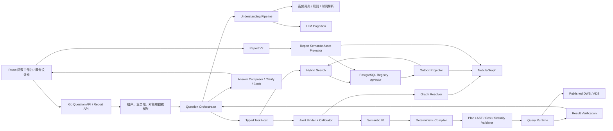

---

## 4. 三类“模型层”必须区分

“模型层”在项目中容易混淆，建议明确分为三类。

### 4.1 数仓模型层

```text
ODS -> DIM/DWD -> DWS -> ADS
```

职责：

- ODS：源数据落地。
- DIM：实体和维度标准化。
- DWD：明细事实。
- DWS：稳定业务粒度和聚合度量。
- ADS：面向具体消费场景的分析数据集。

问数首期只开放 DWS/ADS，原因是：

- 粒度明确。
- 指标基础稳定。
- Join 路径较少。
- 性能可预测。
- 容易建立黄金结果。
- 能显著降低自由 Text-to-SQL 的错误空间。

### 4.2 语义模型层

语义模型将 DWS/ADS 转为业务可理解对象：

```text
Semantic Model
├── Entity
├── Measures
├── Metrics
├── Dimensions
├── Hierarchies
├── Relationships
├── Time Contract
├── Quality Contract
└── Security Contract
```

语义模型不复制数据，只固定：

- 数据集和物化版本
- 字段稳定 ID
- 粒度
- 指标公式
- 维度映射
- 时间口径
- 关系
- 权限和质量

### 4.3 AI 模型层

| 模型角色 | 主要职责 | 不负责 |
|---|---|---|
| Understanding Model | 完整意图、Span 和残余问题理解 | 生成 SQL |
| Embedding Model | 候选召回 | 最终业务裁决 |
| Reranker | 比较候选语义匹配 | 绕过图和权限 |
| Cognition/Planner Model | 决定下一步工具或澄清 | 写数据库事实 |
| Narrative Model | 组织答案和解释 | 增加证据外事实 |

可使用 Provider Pool 组合模型，不应把所有任务绑定到单一模型。

---

## 5. 已有数仓的落地方式

### 5.1 资产盘点

通过只读 Inventory 扫描：

- 当前 PUBLISHED + ACTIVE 的 DWS/ADS 数据集。
- 精确 datasetVersionId。
- materializationId。
- 字段稳定 ID。
- 输出粒度。
- 主时间字段。
- 数据集和逻辑计划哈希。
- 新鲜度和质量状态。

盘点不直接创建生产语义，只生成可审计输入。

### 5.2 自动导入为语义草稿

确定性生成：

- SemanticModel DRAFT
- Measure DRAFT
- Dimension DRAFT
- 默认字段描述候选
- 候选关系
- 候选索引策略

自动导入不能：

- 自动认证指标。
- 猜测跨模型 Join。
- 自动发布别名。
- 自动把字段名当业务口径。
- 自动创建派生指标公式。

### 5.3 人工认证

业务 Owner 必须确认：

- 指标定义和公式。
- 去重键。
- 默认过滤。
- 单位。
- 可加性。
- 时间口径。
- 适用维度。
- Join 和基数。
- 高风险扇出。
- 维度成员索引策略。
- 敏感字段策略。

### 5.4 发布固定

发布包固定：

- 数据集发布版本
- 物化版本
- schema hash
- 语义对象版本
- 词典版本
- 向量文档模板版本
- embedding 模型
- 图投影哈希
- 黄金集评测结果

---

## 6. 语义层完整设计

### 6.1 为什么必须建设语义层

没有语义层时，LLM 只能看到技术结构：

```text
dws_order_sales.sales_amt
dim_region.region_name
```

但用户问的是：

```text
销售额
华东地区
客户数
本财年
```

语义层解决：

1. 业务名称与物理字段分离。
2. 同名指标的业务域和口径差异。
3. 聚合、去重、单位和默认过滤。
4. 维度与维度值的稳定身份。
5. 时间和财务日历。
6. 模型关系、基数和扇出风险。
7. 数据版本、质量和权限。
8. 报表与问数的统一复用。
9. 可审计、可发布和可回滚。
10. 将 LLM 的选择空间缩小到真实对象。

### 6.2 核心对象

#### BusinessDomain

- ID、编码、名称
- Owner
- 默认时区
- 财务日历
- 用户范围
- 允许跨域策略

#### Entity

- 客户、订单、商品、组织等实体
- 业务主键合同
- 显示键
- 敏感性
- 生命周期

#### SemanticModelVersion

- datasetId
- datasetVersionId
- materializationId
- datasetSchemaHash
- layer
- grainContract
- primaryTimeDimension
- entityVersionId

#### MeasureVersion

- modelVersionId
- logicalFieldId
- Formula AST
- 默认聚合
- 可加性
- 数据类型
- 单位
- Null 策略

#### MetricVersion

- 业务定义
- Formula AST
- Measure 依赖
- 默认过滤 AST
- 单位
- 时间粒度
- 可加性
- 去重规则
- 可用维度
- 正例和反例
- Owner

#### DimensionVersion

- modelVersionId
- logicalFieldId
- 名称和描述
- kind：CATEGORICAL/TIME/ENTITY
- sensitivity
- memberIndexPolicy
- highCardinality
- groupable/filterable/sortable
- physical value contract

#### DimensionMemberVersion

- dimensionVersionId
- stable member ID
- canonical value/key
- display label
- aliases
- hierarchy path
- validFrom/validTo
- sensitivity
- source snapshot
- status

#### HierarchyVersion

例如：

```text
销售区域
  └── 大区
      └── 省
          └── 市
```

#### RelationshipVersion

- leftModelVersionId
- rightModelVersionId
- Join AST
- Join Type
- Cardinality
- Fanout Policy
- 生效范围
- 质量状态

#### TimeContract

- 主时间维度
- 时区
- 自然周/ISO 周
- 财务月
- 财年起始
- 同比和环比偏移
- 完整周期规则

#### BusinessTermVersion

- term
- type
- target version
- domain
- match mode
- priority
- negative contexts
- valid time
- source
- review status

#### CertifiedExample

- 脱敏问句
- QuestionUnderstanding
- Semantic IR
- Result Hash
- 适用角色
- 语义发布版本
- 来源：人工、报表、黄金集
- 审批状态

#### KPIBundle

- 常用指标组合
- 默认维度
- 默认时间
- 默认图表
- 适用问题类型

#### ReportSemanticAsset

- reportVersionId
- page/section/block/component ID
- Semantic IR
- visualization template
- narrative role
- source question run
- owner and certification

### 6.3 版本与发布

所有生产对象使用不可变版本。

```text
Object
  ├── Version 1 CERTIFIED
  ├── Version 2 CERTIFIED
  └── Version 3 DRAFT
```

Semantic Release 是一组精确对象版本的 Manifest。运行时必须固定：

```text
releaseId + releaseContentHash
```

不能只按“最新指标”查询。

---

## 7. 高频映射词与确定性匹配

### 7.1 数据结构

```text
term
term_type
domain_id
target_object_id
target_version_id
match_mode
priority
negative_contexts
valid_from
valid_to
source
review_status
```

### 7.2 匹配流程

1. Unicode 规范化。
2. 全半角、大小写和符号统一。
3. 数字和单位标准化。
4. 业务停用词处理。
5. Trie/Aho-Corasick 最长匹配。
6. 处理重叠 Span。
7. 按 tenant/domain/版本和负向上下文裁剪。
8. 将精确命中作为高可信 Evidence 交给 LLM 和 Binder。

### 7.3 加强方式

除高频映射词外，还需：

- 负向上下文
- 易混对象 hard negatives
- 认证问法
- 报表组件使用先验
- 用户角色和业务域先验
- 会话上下文
- 拼音、首字母、简称和编码
- 层级路径
- 有效期
- 数据存在性探测
- 指标—维度兼容图
- 候选 margin 和置信校准
- 残余 Span 完整性检查
- 主动学习候选审批

---

## 8. 向量化检索

### 8.1 PostgreSQL 是检索控制面

使用：

- PostgreSQL
- pgvector `halfvec(2560)`
- HNSW cosine
- `pg_trgm`
- B-tree/GIN
- RRF
- 精确 KNN 对照查询

现有仓库已使用 2,560 维向量和 `halfvec`，可以继续复用。

### 8.2 索引必须分类型

不能把所有对象放在同一个向量池竞争。

| 文档类型 | 文档内容 |
|---|---|
| METRIC | 名称、别名、定义、公式摘要、单位、实体、粒度、默认过滤、可用维度、反例 |
| DIMENSION | 名称、别名、描述、类型、层级、适用模型 |
| DIMENSION_MEMBER | 维度上下文、规范值、别名、层级路径 |
| BUSINESS_TERM | 术语定义和上下文 |
| CERTIFIED_EXAMPLE | 问法摘要、意图特征、认证 IR |
| REPORT_ASSET | 报告标题、章节目的、组件语义绑定和图表类型 |

### 8.3 维度成员向量 Key

```text
业务域
| 维度名称
| 维度描述
| 实体
| 层级路径
| 规范值
| 别名
| 有效期摘要
```

确定性精确 Key：

```text
tenant_id
+ dimension_version_id
+ normalize(canonical_value_or_alias)
```

敏感值使用：

```text
SHA256(dimension_version_id + NUL + normalized_value)
```

并在数据库内部完成精确匹配，不发送给 LLM 或 embedding 服务。

### 8.4 混合召回

```text
权限和版本过滤
  ↓
精确名称/别名/编码
  ↓
词法检索
  ↓
向量检索
  ↓
认证问法和报表先验
  ↓
RRF 合并
  ↓
Reranker
  ↓
图兼容裁剪
```

建议：

- exact Top 30
- lexical Top 30
- vector Top 30
- RRF 后每类 Top 20
- Rerank Top 10～30
- Binder 使用每个 Mention 的 Top 3～8

### 8.5 pgvector 正确性策略

HNSW 是性能优化，不是真相来源。

必须：

- 定期关闭 ANN 索引执行 exact KNN 对照。
- 统计 recall@K。
- 低数据量或强过滤后优先 exact search。
- 按大租户或业务域分区。
- 使用过滤列索引。
- 必要时启用 iterative scan。
- 不同 embedding 模型不得混用。
- embedding 故障降级到 exact + lexical，并提高澄清概率。

### 8.6 成员索引策略

| 策略 | 对象 | 检索方式 |
|---|---|---|
| FULL | 低基数、非敏感 | exact + lexical + vector |
| EXACT_ONLY | 敏感或代码型 | 数据库内部精确 Hash |
| ON_DEMAND | 高基数可检索 | 确定维度后前缀/受控模糊 |
| NONE | 禁止或无意义 | 不允许自然语言绑定 |

---

## 9. 用户输入到完整意图

### 9.1 QuestionUnderstanding

结构至少包括：

```json
{
  "domainHypotheses": [],
  "metricMentions": [],
  "dimensionMentions": [],
  "valueMentions": [],
  "time": {},
  "comparisons": [],
  "ordering": [],
  "limit": 10,
  "unresolvedSpans": []
}
```

这一阶段不允许出现：

- 表名
- 列名
- SQL
- 任意公式
- 临时指标定义

### 9.2 理解流水线

1. **会话合并**：取得上一轮已认证上下文。
2. **字符规范化**：保留原始 Unicode Span 映射。
3. **词典最长匹配**：业务词、指标、维度和成员。
4. **规则解析**：时间、同比、环比、Top N、排序和操作词。
5. **LLM 完整理解**：综合命中、残余文本和会话，输出严格 JSON。
6. **残余检查**：关键非停用 Span 未解释时不得直接进入查询。
7. **分类型检索**：对每个 Mention 调用相应搜索。
8. **候选合同查询**：加载完整业务定义和反例。
9. **Joint Binding**：联合选择完整 Bundle。
10. **低置信处理**：继续取证或澄清。

### 9.3 Domain Routing

业务域得分来自：

- 用户当前业务域
- 页面和报告上下文
- 精确术语
- 指标和维度候选
- 会话历史
- 用户角色
- 认证问题相似度

跨域候选分差不足时，先澄清业务域。

---

## 10. 指标识别设计

### 10.1 候选证据

```text
metric_score =
  exact_alias
  + lexical
  + vector
  + certified_example
  + report_asset_prior
  + domain_prior
  + entity_match
  + dimension_compatibility
  + conversation_context
  - negative_context
  - ambiguity
  - stale_or_quality_risk
```

### 10.2 指标文档必须包含

- 名称和别名
- 业务定义
- 公式摘要
- 度量依赖
- 单位
- 默认聚合
- 去重键
- 粒度
- 时间字段
- 默认筛选
- 可用维度
- 适用模型
- 正例
- 反例
- Owner
- 数据质量
- 报表使用情况

### 10.3 高风险指标

例如：

```text
订单数
├── COUNT(*)
├── COUNT(order_id)
└── COUNT(DISTINCT order_id)

客户数
├── 下单客户数
├── 活跃客户数
└── 付费客户数

收入
├── 含税销售收入
├── 不含税主营收入
└── 回款金额
```

Binder 必须比较实体、去重键、默认过滤和时间口径，不能只比较名称。

### 10.4 派生指标

派生指标必须来自已发布 Formula AST，例如：

```text
毛利率 = 毛利额 / 销售收入
```

LLM 不得临时编造公式。

---

## 11. 维度和维度值识别设计

### 11.1 维度识别

维度候选得分考虑：

- 精确别名
- 描述相似度
- 指标兼容性
- 实体
- 角色：GROUP_BY/FILTER/TIME/SORT
- 层级
- 模型
- 会话和报告上下文
- 负向上下文

### 11.2 先维度后成员

错误方式：

```text
“苹果” -> 在所有成员中 ANN 搜索
```

正确方式：

```text
“苹果”
  ↓
候选维度：品牌、商品、公司、品类
  ↓
结合指标、领域、语法角色和图兼容选择维度
  ↓
在候选维度内查成员
```

### 11.3 成员增强机制

1. 唯一精确别名优先。
2. 规范值和别名分离。
3. 保存层级路径。
4. 校验指标和模型兼容性。
5. 判断分组或筛选角色。
6. 支持拼音、简称、编码。
7. 保存 validFrom/validTo。
8. 维护 hard negative 对。
9. 高基数走 ON_DEMAND。
10. 敏感值走 EXACT_ONLY。
11. 排除 UNKNOWN、测试值和哨兵值。
12. 使用数据存在性和时间覆盖探测。
13. 澄清选择进入待审核主动学习。
14. 报表筛选和认证问题作为先验。
15. 同名成员跨维度必须保留歧义。

### 11.4 高基数成员

推荐建设数仓侧受控 Member Lookup：

```text
dimension_version_id
stable_member_id
canonical_key_hash
display_label
valid_from
valid_to
source_snapshot
```

ON_DEMAND 查询必须：

- 已确定维度。
- 固定租户、业务域和语义发布。
- 限定前缀或受控模糊。
- 返回最多 N 个稳定 Member ID。
- 不允许全库通配扫描。
- 使用当前用户权限。

---

## 12. Joint Binder

### 12.1 为什么不能逐项 Top 1

用户问题：

```text
华东地区的客户销售额
```

独立选择可能得到：

- 指标：客户生命周期价值
- 维度：物流区域
- 成员：销售大区/华东

每项单独相似，但组合不兼容。

### 12.2 Bundle

```text
Bundle =
  Domain
  + SemanticModelVersion
  + MetricVersions
  + GroupDimensions
  + FilterDimensions
  + MemberVersions
  + TimeSpec
  + Comparison
  + RelationshipPath
```

### 12.3 Beam Search

建议：

1. 每个指标 Mention 保留 Top 5。
2. 每个维度 Mention 保留 Top 5。
3. 每个成员在已确定维度内保留 Top 5。
4. 先构建同模型 Bundle。
5. 再通过 GraphPlan 构建跨模型 Bundle。
6. Beam Width 20～50。
7. 删除越权、未发布、过期、不兼容和 fanout BLOCK Bundle。
8. 对 Top 5～10 使用结构化 Reranker。
9. Calibrator 输出可校准概率。
10. Top1 与 Top2 margin 不足时澄清。

### 12.4 Bundle 评分特征

- exact 命中数
- lexical/vector/RRF
- LLM rerank
- 认证样例相似度
- 报表资产先验
- domain/entity 匹配
- model 覆盖
- dimension/member ownership
- hierarchy 匹配
- graph path 长度
- join risk
- time coverage
- data quality
- user permission
- execution cost
- unresolved span count
- negative context

### 12.5 置信度校准

不能采用 LLM 自报 confidence。

推荐：

- 初期：Logistic Regression 或 Isotonic Calibration。
- 输入：上述结构化特征。
- 训练集：人工标注开发集。
- 阈值：验证集确定。
- 独立阈值：
  - direct answer
  - clarification
  - block
- 每个业务域单独校准。
- 每个发布版本固定 calibrator 版本和 hash。

示例：

```text
P(correct) >= 0.92 且 margin >= 0.15 -> 直接回答
0.65 <= P(correct) < 0.92          -> 继续取证或澄清
P(correct) < 0.65                  -> 阻断或重新理解
```

阈值必须通过验证集确定，不能直接照搬示例。

---

## 13. NebulaGraph 设计

### 13.1 使用原则

- PostgreSQL 保存权威对象和版本。
- NebulaGraph 保存当前语义发布的可重建投影。
- 图结果不能绕过 PostgreSQL 权限和状态校验。
- 图不可用时按 §5.11 的降级矩阵处理：单模型、无跨模型关系的查询允许使用注册表降级执行；任何需要跨模型 Join 的查询一律澄清或阻断，不得猜测 Join。
- 开发环境继续使用仓库已验证的 NebulaGraph/Go Client 3.8.0 组合。
- 不使用 master/nightly Client。
- 初期使用一个共享语义 Space，通过 tenant/domain/release 属性隔离。
- 大型或强隔离租户可单独 Space。

### 13.2 Vertex Tags

```text
domain
entity
semantic_model
measure
metric
dimension
member
hierarchy
dataset_version
report_version
report_component
certified_question
kpi_bundle
```

公共属性：

```text
tenant_id
domain_id
release_id
release_hash
object_id
object_version_id
version_no
status
content_hash
```

### 13.3 Edges

```text
MODEL_FOR_ENTITY
MODEL_MAPS_DATASET
MODEL_HAS_MEASURE
MODEL_HAS_DIMENSION
METRIC_ON_MODEL
METRIC_USES_MEASURE
METRIC_COMPATIBLE_DIMENSION
MEMBER_OF_DIMENSION
MEMBER_PARENT_OF
HIERARCHY_CONTAINS_DIMENSION
MODEL_RELATES_MODEL
REPORT_USES_METRIC
REPORT_GROUPS_BY_DIMENSION
REPORT_FILTERS_MEMBER
REPORT_USES_MODEL
QUESTION_BINDS_METRIC
QUESTION_BINDS_DIMENSION
QUESTION_SIMILAR_REPORT
BUNDLE_CONTAINS_METRIC
```

`MODEL_RELATES_MODEL` 属性：

```text
relationship_version_id
join_type
cardinality
fanout_policy
join_ast_hash
quality_status
```

### 13.4 GraphPlan 输出

```json
{
  "metricModelBindings": [],
  "dimensionCompatibility": [],
  "memberOwnership": [],
  "joinPaths": [],
  "riskCodes": [],
  "projectionHash": ""
}
```

图搜索限制：

- 默认最多 3 hops。
- 硬上限 4 hops。
- 最多 16～32 条路径。
- 优先同模型。
- 优先更短路径。
- `MANY_TO_MANY + BLOCK` 直接删除。
- `PRE_AGGREGATE_REQUIRED` 需要编译器执行预聚合。

### 13.5 投影一致性

```text
Semantic Release
  ↓
PostgreSQL Outbox
  ↓
Projector Worker
  ↓
NebulaGraph 写入
  ↓
计算 projection hash
  ↓
release_projections = READY
```

只有以下条件都满足，运行时才使用图：

```text
release.status in READY/ACTIVE
projection.status = READY
projection.expected_hash = release.content_hash
projection.applied_hash = release.content_hash
```

---

## 14. Semantic IR

### 14.1 目的

Semantic IR 是自然语言和 SQL 之间的稳定边界。

它只包含：

- 语义发布 ID/hash
- 模型版本 ID
- 指标版本 ID
- 维度版本 ID
- 成员版本 ID
- 时间范围
- 比较
- 排序
- Limit

它不能表示：

- 表名
- 列名
- SQL
- 未绑定字符串值
- 任意函数
- 任意 Join

### 14.2 示例

```json
{
  "irVersion": "1.0",
  "semanticReleaseId": "release-id",
  "semanticContentHash": "sha256",
  "modelVersionId": "sales-model-v3",
  "metrics": [
    {
      "metricVersionId": "sales-amount-v5",
      "alias": "sales_amount"
    }
  ],
  "groupBy": [
    {
      "dimensionVersionId": "month-dimension-v2",
      "grain": "MONTH"
    }
  ],
  "filters": [
    {
      "dimensionVersionId": "sales-region-v2",
      "operator": "IN",
      "memberVersionIds": ["east-region-v2"]
    }
  ],
  "timeRange": {
    "dimensionVersionId": "order-date-v2",
    "start": "2026-01-01",
    "endExclusive": "2027-01-01",
    "timezone": "Asia/Shanghai"
  },
  "comparison": {
    "type": "YEAR_OVER_YEAR",
    "periods": 1
  },
  "sort": [],
  "limit": 100
}
```

---

## 15. Query DSL 与确定性 SQL 编译

### 15.1 编译链路

```text
Semantic IR
  ↓
加载 Metric/Dimension/Model/Relationship Contracts
  ↓
GraphPlan
  ↓
构建 Logical Query Plan
  ↓
构建 Dataset Query DSL / AST
  ↓
参数化 SQL
  ↓
Plan Hash
```

LLM 只能解释编译错误并决定是否重新绑定，不能修改 SQL 字符串。

### 15.2 查询计划对象

```text
QueryPlan
├── Source Model Versions
├── Base Projections
├── Metric Expressions
├── Default Filters
├── User Filters
├── Time Filter
├── Pre-Aggregations
├── Certified Joins
├── Group By
├── Comparison CTE
├── Sort
├── Limit
└── Parameter Contract
```

### 15.3 指标编译

Metric Formula AST 只允许：

- MeasureRef
- MetricRef
- Add/Subtract/Multiply/Divide
- SafeCast
- NullIf
- Coalesce
- 受控聚合

禁止 Raw SQL。

### 15.4 维度编译

Dimension Contract 提供：

- modelVersionId
- logicalFieldId
- physical field mapping
- data type
- hierarchy
- member physical key mapping
- group/sort/filter capability

Semantic IR 中的 Member ID 在编译时解析为参数值，不直接拼接文本。

### 15.5 Join 编译

优先级：

1. 单模型查询，不 Join。
2. 同实体认证关系。
3. 最短 SAFE 路径。
4. PRE_AGGREGATE_REQUIRED 路径。
5. BLOCK 路径拒绝。

防止扇出：

```text
事实指标先按原事实粒度或目标粒度预聚合
  ↓
再与维度或其他模型关联
```

对 Many-to-Many 必须：

- 有认证 Bridge。
- 有去重或预聚合策略。
- 能证明结果不重复。
- 否则阻断。

### 15.6 同比/环比

编译器生成确定性 Current/Previous CTE：

```text
current_period
previous_period
  ↓
按目标时间粒度聚合
  ↓
按维度键对齐
  ↓
计算 current / previous / delta / ratio
```

使用半开区间 `[start, endExclusive)` 和 IANA 时区。

### 15.7 SQL 安全

- 只允许 SELECT。
- 物理标识来自已发布白名单。
- 所有值参数绑定。
- 禁止多语句。
- 禁止 DDL/DML。
- 禁止系统 Catalog。
- 禁止未认证函数。
- 设置 statement timeout。
- 设置最大行数。
- 使用只读 Warehouse Role。
- 执行前做 EXPLAIN 成本检查。

---

## 16. 查询计划验证

### 16.1 结构验证

- 所有引用属于固定 Release。
- 指标属于模型。
- 维度与模型兼容。
- 成员属于维度。
- 时间维度正确。
- 排序目标已选择。
- Limit 合法。

### 16.2 权限验证

- 用户可访问语义对象。
- 用户可访问数据集。
- 行列级策略已应用。
- 敏感成员工具权限满足。
- 缓存 Key 包含 PolicyScope Hash。

### 16.3 成本验证

- 预估扫描行数。
- Join 数量和 hops。
- 聚合规模。
- 分组基数。
- 预计结果行数。
- 是否需要进一步限制。

### 16.4 基数验证

对高风险 Join 调用有界探测：

- count
- count distinct
- join coverage
- fanout ratio
- orphan ratio

探测不能扫描无限数据，固定时间范围和行数预算。

---

## 17. Agent Loop 与 Tools

### 17.1 角色划分

```text
LLM Planner
  负责判断下一步

Typed Tools
  返回真实、受权限控制的证据

Rules/Policies
  负责不可绕过的门禁

Orchestrator
  保存状态、预算、进度和终止条件
```

### 17.2 工具集合

现有合同已经冻结以下工具：

```text
search_semantic_objects
get_semantic_contracts
lookup_dimension_values
get_certified_examples
resolve_graph_plan
validate_semantic_bundle
get_data_quality_status
compile_semantic_query
validate_query_plan
probe_join_cardinality
execute_query_plan
execute_validation_query
compare_candidate_results
request_clarification
```

### 17.3 状态机

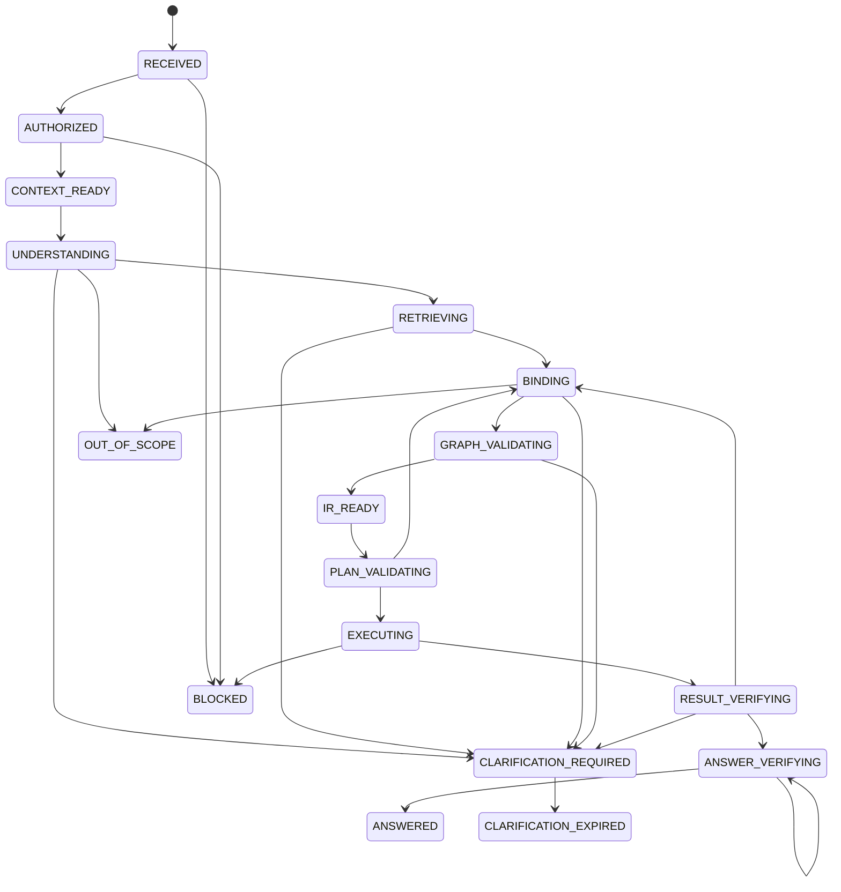

`ANSWER_VERIFYING` 为新增阶段：叙述生成后必须抽取答案中的全部数值和对象名，与 Result Artifact 和绑定合同逐项比对，比对失败则重生成，连续两次失败则降级为纯结构化答案，详见 §5.8。

### 17.4 Loop 预算

初始建议：

| 项目 | 上限 |
|---|---:|
| LLM 调用 | 4 |
| Tool 调用 | 8 |
| 正式查询 | 2 |
| 验证查询 | 3 |
| 候选计划比较 | 2 |
| 总耗时硬熔断 | 25 秒 |
| Join hops | 4 |

预算与性能目标必须区分：

- 25 秒是 **硬性熔断上限**，达到后 Run 进入 TIMEOUT 或返回已有证据下的澄清。
- 复杂 Loop 的 **P95 目标为 ≤18 秒**，Fast Path 的 P95 目标为 ≤8 秒。若把 P95 目标设为与熔断值相等，超时率将在 5% 以上且无法收敛。
- 等待用户澄清的时间 **不计入** Loop 预算，Run 进入 `CLARIFICATION_REQUIRED` 后预算暂停，用户应答后恢复剩余预算，详见 §5.12。
- KPI Bundle 属于多计划运行，使用独立预算，详见 §5.7。

Fast Path：

```text
唯一高可信精确命中
  + 同模型
  + 无复杂关系
  + 计划校验通过
```

通常 1 次 LLM + 若干确定性工具。

### 17.5 进度判断

每轮必须新增至少一项：

- 新证据
- 候选集合缩小
- 置信度提高
- 冲突被消除
- 新 IR
- 新验证结果

没有进度则终止，避免无限自问自答。

### 17.6 自纠错场景

#### 指标歧义

```text
低 margin
  ↓
获取完整指标合同和认证例子
  ↓
重新绑定
  ↓
仍不唯一则澄清
```

#### Join 风险

```text
GraphPlan 标记 fanout
  ↓
probe_join_cardinality
  ↓
选择预聚合计划或阻断
```

#### 空结果

```text
执行结果为空
  ↓
验证成员是否存在
  ↓
验证时间覆盖
  ↓
验证默认过滤
  ↓
正确返回 NO_DATA 或重新绑定
```

#### 候选计划差异

```text
编译两个认证计划
  ↓
执行受限结果
  ↓
compare_candidate_results
  ↓
LLM 分析差异
  ↓
选择 / 澄清
```

---

## 18. 结果验证与答案生成

### 18.1 结果规范化

- Decimal 精度
- 浮点容差
- 时间和时区
- NULL
- 排序
- 行键
- 单位
- 百分比

### 18.2 验证类型

- MEMBER_EXISTS
- TIME_COVERAGE
- JOIN_CARDINALITY
- AGGREGATION_CONSISTENCY
- EMPTY_RESULT
- RESULT_TOTAL_MATCH
- COMPARISON_ALIGNMENT
- UNIT_CONSISTENCY

### 18.3 答案生成

Narrative Model 输入：

- 用户问题
- 规范化意图
- 指标定义摘要
- 结果摘要
- 证据引用
- 质量警告
- 允许的回答结构

不输入：

- 数据库凭据
- 敏感成员原文
- 任意 SQL
- 无权限候选
- 隐藏思维链

答案中的每个事实必须可追溯到：

- Result Cell
- Evidence ID
- Metric Contract
- Quality Warning

---

## 19. 报表作为问数资产

### 19.1 Report Definition 扩展

报告组件的数据绑定分为两类，由 `dataBinding.bindingMode` 显式声明：

| bindingMode | 内容 | 可否反哺问数 |
|---|---|---|
| `SEMANTIC_IR` | 引用认证指标/维度/成员版本，固定语义发布 | 是 |
| `DATASET_FIELD` | 直接引用已发布 Dataset Version 的字段和受控表达式 | 否 |

`SEMANTIC_IR` 绑定：

```json
{
  "bindingMode": "SEMANTIC_IR",
  "semanticQueryRef": {
    "semanticReleaseId": "release-id",
    "semanticContentHash": "sha256",
    "semanticIr": {},
    "queryPlanHash": "sha256",
    "sourceQuestionRunId": "run-id"
  }
}
```

报告运行时可根据 Semantic IR 重新编译，也可以读取发布时固定的 Query Plan Artifact。推荐固定 IR 和 Plan Hash，运行时仍验证查看者权限。

编译器必须拒绝以下情况：

- 同一个组件同时出现两类绑定。
- `SEMANTIC_IR` 组件引用的 Release 已退役（参见 §5.9 保留策略）。
- 同一图表中混合不同币种或不可比单位的指标。

### 19.2 Report Semantic Asset

报告发布时提取：

- 报告标题和描述
- 章节目的
- 分块标题
- 组件 Semantic IR
- 指标、维度和成员
- 图表模板
- 叙述角色
- 原问法
- 数据集和语义版本

生成：

```text
REPORT_ASSET search document
REPORT_VERSION vertex
REPORT_COMPONENT vertex
REPORT_USES_METRIC edges
REPORT_GROUPS_BY_DIMENSION edges
REPORT_FILTERS_MEMBER edges
```

### 19.3 使用规则

报表资产只能是候选证据：

- 不直接复制历史 SQL。
- 不绕过当前 Release。
- 不绕过查看者权限。
- 不自动使用历史自由文本结论。
- 绑定对象已过期时降低权重或拒绝复用。
- 报表和当前语义版本不一致时先迁移和验证。

### 19.4 问数生成报告

Question Run 成功后生成：

```text
Result Schema
Semantic IR
Plan Hash
Visualization Recommendation
Evidence Refs
Narrative
```

转换为 Report Operation：

- COMPONENT_CREATE
- DATA_BINDING_UPDATE
- INSIGHT_UPDATE
- BLOCK_CREATE
- SLOT_UPDATE

---

## 20. 数据库存储设计

### 20.1 语义事实表

建议延续当前 `askdata` schema：

```text
domains
entities / entity_versions
semantic_models / semantic_model_versions
measures / measure_versions
metrics / metric_versions
dimensions / dimension_versions
dimension_members / dimension_member_versions
hierarchies / hierarchy_versions
relationships / relationship_versions
quality_rules / quality_rule_versions
business_terms / business_term_versions
certified_examples
kpi_bundles
```

### 20.2 发布和投影

```text
releases
release_objects
release_projections
projection_outbox
search_documents
embedding_outbox
graph_plan_cache
```

### 20.3 Question Run

```text
question_runs
question_run_events
question_artifacts
tool_calls
tool_outcomes
clarifications
query_plans
query_executions
result_artifacts
feedback
```

所有事件和工具结果追加写，不允许覆盖历史。

### 20.4 报表资产

```text
report_semantic_assets
report_asset_versions
report_asset_certifications
report_asset_search_documents
```

如果 Report V2 使用独立 schema，可通过稳定 ID 和 outbox 与 `askdata` 集成。

---

## 21. Go 工程设计

### 21.1 现有包继续复用

```text
internal/askdata/registry
internal/askdata/search
internal/askdata/dimension
internal/askdata/graph
internal/askdata/understanding
internal/askdata/cognition
internal/askdata/ir
internal/askdata/orchestrator
internal/askdata/toolhost
internal/askdata/evaluation
internal/askdata/security
```

### 21.2 新增包

```text
internal/askdata/binding
├── candidate.go
├── bundle.go
├── beam.go
├── scorer.go
├── calibrator.go
└── service.go

internal/askdata/compiler
├── compiler.go
├── contract_loader.go
├── logical_plan.go
├── metric.go
├── dimension.go
├── join.go
├── comparison.go
└── postgres.go

internal/askdata/validator
├── semantic.go
├── permission.go
├── cost.go
├── cardinality.go
├── query.go
└── result.go

internal/askdata/http
├── question.go
├── stream.go
├── clarification.go
└── feedback.go

internal/askdata/answer
├── model.go
├── composer.go
└── citations.go

internal/askdata/reportasset
├── projector.go
├── validator.go
└── search_document.go
```

### 21.3 依赖方向

```text
registry
  ↓
search / graph / dimension
  ↓
understanding
  ↓
binding
  ↓
ir
  ↓
compiler
  ↓
validator / runtime
  ↓
orchestrator
  ↓
http / answer
```

禁止反向依赖和循环。

### 21.4 推荐 Go 技术

- 当前 `net/http`
- `pgx/v5`
- 当前 `nebula-go/v3 v3.8.0`
- `minio-go/v7`
- `golang.org/x/sync/errgroup`
- OpenTelemetry Go
- Prometheus Go Client
- 现有严格 JSON 解码器
- 现有 PostgreSQL Outbox/Worker

首期不引入 Kafka、Flink、独立向量数据库和复杂工作流引擎。

---

## 22. React 工程设计

### 22.1 新增目录

```text
web/src/askdata/
├── api/
├── components/
├── pages/
├── evidence/
├── clarification/
├── result/
├── semantic-admin/
├── report-integration/
├── hooks/
├── state/
└── types/
```

### 22.2 推荐组件

```text
QuestionComposer
SessionRail
RunProgress
ClarificationCard
AnswerSummary
MetricCards
ResultChart
ResultTable
EvidencePanel
IntentInspector
MetricContractPanel
DimensionBindingPanel
GraphPlanPanel
QualityPanel
FeedbackPanel
AddToReportDialog
SemanticAssetEditor
EvaluationDashboard
```

### 22.3 推荐前端技术

现有：

- React
- TypeScript
- Vite
- React Router
- ECharts

建议增加：

- `@tanstack/react-query`：Question Run、轮询、缓存和失效。
- `@tanstack/react-table`：结果表。
- `@tanstack/react-virtual`：大表和会话列表虚拟化。
- Zustand 或等价轻量 Store：本地会话、证据面板和报告选择状态。
- fetch ReadableStream：POST + SSE 事件流。

### 22.4 SSE 事件

```text
run.created
run.state_changed
understanding.ready
retrieval.ready
binding.ready
graph.ready
plan.ready
query.started
query.completed
verification.ready
clarification.required
answer.ready
run.blocked
run.failed
```

前端必须按 Run ID 和 Event Sequence 去重，支持断线后从最后序号恢复。

---

## 23. API 设计

### 23.1 Question

```text
POST   /api/askdata/questions
GET    /api/askdata/questions/{runId}
GET    /api/askdata/questions/{runId}/events
POST   /api/askdata/questions/{runId}/clarifications
POST   /api/askdata/questions/{runId}/cancel
POST   /api/askdata/questions/{runId}/feedback
POST   /api/askdata/questions/{runId}/add-to-report
```

创建请求：

```json
{
  "question": "本月华东销售额同比是多少？",
  "conversationId": "optional",
  "context": {
    "reportId": "optional",
    "reportVersionId": "optional"
  }
}
```

### 23.2 Semantic Admin

```text
GET/POST /api/askdata/semantic/models
GET/POST /api/askdata/semantic/metrics
GET/POST /api/askdata/semantic/dimensions
GET/POST /api/askdata/semantic/terms
GET/POST /api/askdata/semantic/relationships
POST     /api/askdata/semantic/releases
POST     /api/askdata/semantic/releases/{id}/evaluate
POST     /api/askdata/semantic/releases/{id}/approve
POST     /api/askdata/semantic/releases/{id}/activate
```

### 23.3 Internal Tools

Tool Host 不直接暴露给浏览器。每个 Tool：

- 固定 Release。
- 固定 PolicyScope。
- 严格 Args。
- 结果大小上限。
- 证据 Hash。
- 审计。
- 超时。

---

## 24. 缓存

### 24.1 缓存 Key

```text
tenantId
+ actor/policyScopeHash
+ semanticReleaseHash
+ normalizedIRHash
+ warehouseSnapshot/Freshness
```

不能只使用 SQL Hash，否则可能跨用户泄露。

### 24.2 缓存层

MVP：

- PostgreSQL 查询结果缓存或内存短缓存。
- GraphPlan Cache。
- Search Candidate Cache。

规模化后可增加 Redis，但 Redis 不是语义事实源。

---

## 25. 安全设计

### 25.1 三次权限裁剪

1. 检索前：未授权对象不参与召回。
2. 绑定前：候选 Bundle 再验证。
3. 执行前：Warehouse 以查看者策略执行。

### 25.2 Prompt Injection

用户文本只能影响：

- 意图
- 候选
- 工具请求

不能影响：

- System Policy
- Tool Allowlist
- Release
- Tenant
- 权限
- SQL
- nGQL
- 数据库凭据

### 25.3 敏感成员

- EXACT_ONLY。
- 原始 Span 在内存规范化。
- 仅传 Hash 给数据库函数。
- LLM 只看到 label-free evidence。
- 日志不保存敏感值。
- 无权限、歧义、过期统一返回零候选。

### 25.4 查询安全

- Warehouse Reader。
- Read Only Transaction。
- Statement Timeout。
- Row Limit。
- AST Allowlist。
- Identifier Allowlist。
- Query Cost Limit。
- Cancel 支持。

---

## 26. 可观测性

### 26.1 Trace

每个 Question Run 记录：

```text
requestId
tenantId
actorId
domainId
runId
releaseId
releaseHash
understandingHash
candidateSetHash
bindingHash
graphPlanHash
semanticIRHash
queryPlanHash
resultHash
```

### 26.2 Metrics

- stage latency
- tool latency/error
- LLM latency/token/cost
- search recall proxy
- candidate margin
- clarification rate
- compile failure rate
- plan validation failure
- query timeout
- result verification failure
- strict E2E accuracy
- direct answer coverage
- report reuse rate

OpenTelemetry 用于 Trace 和 Metric；生产日志仍使用结构化日志，避免将实验状态的日志信号作为唯一日志管道。

---

## 27. 95% 正确率如何证明

### 27.1 分阶段门槛

| 阶段 | 指标 | 建议门槛 |
|---|---|---:|
| 时间/比较规则 | Accuracy | ≥ 99% |
| 指标召回 | Recall@10 | ≥ 99% |
| 维度召回 | Recall@10 | ≥ 99% |
| 成员召回 | Recall@20 | ≥ 99% |
| 指标绑定 | Top-1/F1 | ≥ 97% |
| 维度绑定 | Mention F1 | ≥ 97% |
| 成员绑定 | Mention F1 | ≥ 97% |
| GraphPlan | 正确模型/路径 | ≥ 99% |
| Semantic IR | Strict Match | ≥ 97% |
| SQL/结果 | Result Equivalence | ≥ 96% |
| 安全 | P0 Security | 100% |

阶段指标用于诊断，不能相乘替代 E2E 指标。

### 27.2 黄金集构成

建议：

- 高频简单问题：35%
- 时间、同比、环比：15%
- 多维、排序、Top N：15%
- 维度和成员歧义：10%
- 指标同名和派生：10%
- Join 和扇出：5%
- 空结果、质量、过期成员：5%
- 越权、注入、敏感和不可回答：5%

每条密封 Case 包括：

- 脱敏问句
- 用户角色和权限
- 语义发布
- 预期 Understanding
- 预期 Binding
- 预期 GraphPlan
- 预期 Semantic IR
- 预期结果 Hash
- 预期回答/澄清/阻断
- 两名独立评审

### 27.3 发布门禁

```text
语义 Release Candidate
  ↓
构建 Search/Graph 投影
  ↓
运行开发集
  ↓
阈值验证集校准
  ↓
运行 Sealed Set
  ↓
安全集
  ↓
双人审批
  ↓
ACTIVE
```

任何门槛失败，Release 不得激活。

### 27.4 为什么这套设计有机会达到 95%

| 错误来源 | 控制措施 |
|---|---|
| 同名指标 | 域、定义、实体、反例、认证样例和图兼容 |
| 同名维度 | 角色、模型、实体和层级 |
| 维度值碰撞 | 先维度后成员、复合 Key 和层级 |
| 候选未召回 | exact + lexical + vector + report/example |
| LLM 幻觉对象 | 稳定 ID、Release 和注册表验证 |
| 独立选择不兼容 | Joint Binder |
| Join 重复聚合 | NebulaGraph、基数和预聚合 |
| SQL 幻觉 | Go 确定性编译 |
| 单次推理错误 | Tool Loop 和结果验证 |
| 隐含歧义 | 校准阈值和定向澄清 |
| 语义更新回归 | 密封黄金集和发布门禁 |
| 用户错误反馈污染 | 候选 + 人工审批 |
| 报表错误扩散 | 只有认证发布资产进入检索 |

架构不能替代业务语义治理。没有真实指标定义、维度治理和黄金集，就不能达到或宣称达到 95%。

---

## 28. 实施路线

### Wave 0：合同和现状基线

- 保持已有 QuestionUnderstanding、Semantic IR、Cognition Action。
- 固定 Report Semantic Asset 合同。
- 补充 Binding Bundle 和 Query Plan Schema。
- 盘点 DWS/ADS。

### Wave 1：首个业务域语义资产

- 导入 3～10 个 Semantic Model。
- 人工认证 20～50 指标。
- 人工认证 20～40 维度。
- 建设关系和时间口径。
- 建设高频词和负向上下文。
- 构建首个 Release Candidate。

### Wave 2：检索和 Joint Binder

- 完成 Member Lookup。
- 召回评测。
- Report Asset 检索。
- Beam Search。
- Rerank。
- Calibration。
- 澄清生成。

### Wave 3：Compiler 和 Validator

- IR -> Logical Plan。
- Metric Formula AST。
- Dimension Member 参数解析。
- Certified Join。
- Comparison CTE。
- Plan Validator。
- Cost/EXPLAIN。
- Cardinality Probe。

### Wave 4：Orchestrator Loop

- 接全部 Typed Tools。
- Fast Path。
- Complex Loop。
- No-progress。
- 预算。
- 异常分类。
- 结果验证。
- SSE API。

### Wave 5：React 真接线

- Question API。
- SSE。
- 澄清卡。
- 证据面板。
- 结果表和图。
- 反馈。
- 加入报告。

### Wave 6：Report V2 集成

- 问数生成 Report Operation。
- 报告发布生成 Report Semantic Asset。
- 报表语义检索。
- 报表版本升级影响分析。
- 报表结论 Evidence 复用。

### Wave 7：评测和试点

- 500 开发问题。
- 200 验证问题。
- 2,000 密封问题。
- 安全集。
- Shadow 流量。
- 业务试点。
- 发布审批。

---

## 29. 测试策略

### 29.1 单元测试

- 文本规范化
- Unicode Span
- Trie 匹配
- 时间规则
- RRF
- Beam Search
- Calibrator
- GraphPlan
- IR Hash
- Metric Formula
- Join 编译
- 比较查询
- SQL 参数化
- 结果等价

### 29.2 属性测试

- 规范化幂等
- 相同语义得到相同 IR Hash
- SQL 中不存在未绑定用户值
- 未认证对象无法进入计划
- 撤销报告操作恢复原 Hash
- 不同 PolicyScope 缓存不复用

### 29.3 集成测试

- PostgreSQL RLS
- pgvector exact/ANN 对照
- NebulaGraph 投影
- Graph fallback
- Warehouse 只读执行
- Question 状态恢复
- SSE 重连
- Report Asset Projector

### 29.4 对抗测试

- Prompt Injection
- SQL Injection
- nGQL Injection
- 越权域
- 敏感成员
- 同名对象
- 过期成员
- Many-to-Many
- 空结果
- 数据质量异常
- 超时和取消
- Embedding 故障
- NebulaGraph 故障
- LLM JSON 异常

---

## 30. 生产部署

### 30.1 MVP

```text
API
Worker
Web
Control PostgreSQL + pgvector
Warehouse PostgreSQL
NebulaGraph 3.8.0
MinIO
Connector Service
OpenTelemetry Collector
Prometheus/Grafana
```

### 30.2 NebulaGraph

开发：

- 单副本。
- 共享 Space。
- 本地持久卷。
- graphd 不直接暴露公网。
- API 只读用户。
- Worker 投影写用户。

生产：

- 根据容量 POC 决定多副本。
- TLS。
- 备份和恢复演练。
- 监控 metad/storaged/graphd。
- 固定服务端和 Go Client 兼容版本。
- 不自动升级。

### 30.3 PostgreSQL

- Control Plane 和 Warehouse 分离。
- 强制 RLS。
- Read-only Warehouse Role。
- pgvector 索引监控。
- 定期 Exact Recall Job。
- `pg_stat_statements`。
- 备份和 PITR。

---

## 31. 交付物

1. 产品范围和 95% 质量合同。
2. Semantic Layer Schema 和管理 API。
3. DWS/ADS Importer。
4. 高频词与 Member Lookup。
5. Hybrid Search。
6. Joint Binder 和 Calibrator。
7. NebulaGraph Schema、Projector 和 GraphPlan。
8. Semantic IR 和 Query Plan。
9. Deterministic Compiler。
10. Query/Result Validator。
11. Typed Tool Host。
12. Orchestrator Loop。
13. Question API/SSE。
14. React 问数工作台。
15. Report V2 双向集成。
16. Evaluation Center。
17. 2,000 条密封黄金集。
18. 安全测试集。
19. 运维、回滚和故障降级手册。
20. 业务域试点报告。

---

## 32. 最终验收门槛

- 当前业务域语义资产覆盖达到计划。
- 召回阶段达到 Recall 门槛。
- Binding、IR、GraphPlan 达到阶段门槛。
- 查询结果等价率达到目标。
- 2,000 条密封集观测严格正确率 ≥ 96%。
- 95% Wilson 下界 ≥ 95%。
- 直接回答覆盖率 ≥ 85%。
- P0 和安全集 100%。
- 无敏感泄漏。
- 问数加入报告和报告反哺问数链路通过。
- 故障降级不会生成未经证明的答案。
- 发布、回滚和审计可完整回放。
- 未通过双人审批的 Release 不可 ACTIVE。

---

## 33. 参考实现约束

本设计与当前仓库以下事实保持一致：

- Go 模块已经锁定 `nebula-go/v3 v3.8.0`。
- Compose 已使用 NebulaGraph 3.8.0 服务和共享语义 Space。
- 当前混合检索已实现 exact、lexical、vector 和 RRF。
- QuestionUnderstanding 不允许 SQL、表名和列名。
- Semantic IR 只允许稳定语义 ID 和受控操作。
- Cognition Action 和 Tool Host 已限制动作、工具和参数。
- 当前生产准确率尚未通过密封黄金集评测，因此不得提前声明达到 95%。

外部技术依据：

- NebulaGraph 3.8.0 Manual
- Nebula Go Client 官方仓库
- pgvector 官方文档
- PostgreSQL Row-Level Security 和 pg_trgm 文档
- OpenTelemetry Go 文档
- TanStack Query React 文档

---

# 第二部分：20 个技术模块的落地设计

本部分是研发实施的核心基线。每个模块均定义业务职责、子功能、技术选型、数据对象、流程、Go/React 落点、接口和验收标准。

## 1. 模块总览

### 1.1 一级模块

| 编号 | 模块 | 核心职责 |
|---|---|---|
| M01 | 平台、租户与权限 | 用户、角色、业务域、对象和数据权限 |
| M02 | 数据源与元数据 | 连接、元数据同步、采样、画像和血缘 |
| M03 | 数仓与数据建模 | ODS/DIM/DWD/DWS/ADS、Dataset DSL 和物化 |
| M04 | 语义模型中心 | 实体、粒度、时间、模型和关系映射 |
| M05 | 指标与度量中心 | Measure、Metric、公式、口径、审批和 KPI Bundle |
| M06 | 维度与成员中心 | 维度、层级、成员、别名、有效期和索引策略 |
| M07 | 业务词典与认证知识 | 高频映射、负向上下文、认证问法和报表资产 |
| M08 | 语义发布与投影 | Release、评测、审批、Search/Graph 投影和回滚 |
| M09 | 混合检索与向量索引 | Exact、Lexical、Vector、RRF 和 Rerank |
| M10 | NebulaGraph 语义图 | 兼容性、成员归属、模型关系和 Join 路径 |
| M11 | 问题理解与会话 | 规范化、规则、LLM Understanding 和上下文 |
| M12 | 联合绑定与澄清 | Candidate Bundle、Beam Search、校准和澄清 |
| M13 | Semantic IR 与查询编译 | IR、Logical Plan、Query DSL 和参数化 SQL |
| M14 | 查询执行与结果验证 | 权限、成本、执行、缓存、质量和结果校验 |
| M15 | Agent Loop 与 Tool Host | 状态机、工具编排、预算、重试和自纠错 |
| M16 | 答案、图表与证据工作台 | 答案组织、可视化、证据、追问和反馈 |
| M17 | 智能报表与问数融合 | Report DSL、问数入报表、报表资产反哺问数 |
| M18 | 评测、反馈与主动学习 | 黄金集、密封评测、发布门禁和修复闭环 |
| M19 | 运维、可观测与成本 | Trace、Metric、容量、限流、模型和成本管理 |

### 1.2 模块依赖

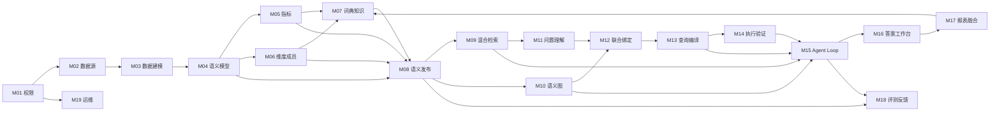

---

## M01 平台、租户与权限

### M01.1 业务职责

- 保证不同租户和业务域的数据、语义资产、问数会话、报告和缓存严格隔离。
- 让管理员以业务语言配置“谁可以看什么、编辑什么、发布什么”。
- 保证候选检索、语义绑定和最终查询均使用同一权限快照。
- 对敏感维度成员提供独立授权。

### M01.2 子功能与技术设计

| 子功能 | 业务规则 | 技术选型 | 技术设计 |
|---|---|---|---|
| 租户管理 | 租户资产不可跨越 | PostgreSQL + RLS | 所有表包含 `tenant_id`，事务设置当前租户 |
| 组织/用户 | 用户可属于组织和业务域 | 现有用户体系 | 用户、组织、岗位和业务域映射 |
| RBAC | 角色授予操作权限 | Go Policy Service | Role-Permission，多角色合并 |
| ABAC | 按业务域、对象、敏感级别约束 | PolicyScope | tenant、actor、domain、object、release 计算不可变 Hash |
| 对象权限 | 指标、维度、数据集、报告独立授权 | PostgreSQL | object_type + object_id/version |
| 数据权限 | 行列级策略不可被报告权限覆盖 | Warehouse RLS / Query Policy | 查询计划注入受控策略 |
| 敏感成员权限 | CONFIDENTIAL/RESTRICTED 单独授权 | PostgreSQL Function | EXACT_ONLY Hash Lookup，失败不披露 |
| 服务账号 | API、Worker、Connector 权限分离 | 独立 DB Role | API 不持有 Worker 写权限 |
| 审计 | 权限变化可追溯 | Append-only Audit | before/after hash、actor、reason |

### M01.3 核心数据对象

```text
tenants
users
organizations
business_domains
roles
permissions
role_bindings
object_permissions
domain_memberships
data_policies
sensitive_lookup_permissions
audit_events
```

### M01.4 业务流程


### M01.5 Go / React 落地

**Go 包：**

```text
internal/access
internal/policy
internal/askdata/security
```

**React 页面：**

- 用户与角色
- 业务域成员
- 对象授权
- 数据权限策略
- 敏感成员访问
- 权限审计

### M01.6 API

```text
GET/POST /api/domains
GET/POST /api/roles
POST     /api/roles/{id}/bindings
GET/POST /api/permissions/objects
GET/POST /api/data-policies
GET      /api/access/effective-scope
```

### M01.7 验收

- 跨租户查询和缓存命中为 0。
- 未授权语义对象不会出现在搜索候选中。
- 删除查询证据中的对象 ID 后不可绕过权限。
- 敏感值不存在、无权限和歧义返回相同外部行为。
- 权限变更能够审计和回滚。

---

## M02 数据源与元数据

### M02.1 业务职责

- 管理数据库和文件数据源。
- 自动同步表、字段、类型、主键、索引和注释。
- 为数据建模和语义建设提供稳定元数据。
- 在不泄露敏感数据的情况下生成画像。

### M02.2 子功能

| 子功能 | 业务流程 | 技术选型 | 技术设计 |
|---|---|---|---|
| 连接管理 | 创建→测试→审批→启用 | Go API + Python Connector | 凭据加密保存，Connector 按 Token 调用 |
| 连接测试 | 网络、认证、只读能力 | Connector Service | 独立测试账号和超时 |
| 元数据同步 | 手动/定时同步 | Worker + Outbox | 增量对比 schema hash |
| 表字段目录 | 浏览和搜索资产 | PostgreSQL | 数据源、Schema、Table、Column 版本 |
| 数据采样 | 有界、脱敏、可关闭 | Connector | 行数、单元格和响应大小限制 |
| 字段画像 | Null、Distinct、TopN、分布 | Worker | 只保存统计，不默认保存原值 |
| 主外键候选 | 自动发现候选关系 | Rule + Profile | 只生成候选，不自动认证 |
| 文件版本 | Excel/CSV 不可变版本 | MinIO | 文件 hash、schema、解析状态 |
| 元数据血缘 | 表和字段来源 | PostgreSQL | 物理血缘与逻辑血缘分离 |

### M02.3 数据对象

```text
data_sources
data_source_credentials
connection_test_jobs
metadata_sync_jobs
schemas
tables
columns
table_versions
column_profiles
relationship_candidates
file_assets
file_versions
```

### M02.4 流程


### M02.5 验收

- Connector 不能访问控制库网段。
- 生产连接使用最小权限账号。
- 同一元数据快照生成稳定 hash。
- 元数据同步不会直接修改已发布数据集。
- 敏感字段采样可完全禁用。

---

## M03 数仓与数据建模

### M03.1 业务职责

- 把原始数据转化为可稳定消费的 ODS、DIM、DWD、DWS、ADS。
- 建立明确粒度、字段角色、Join、表达式和物化版本。
- 为问数提供受控查询边界。

### M03.2 子功能

| 子功能 | 业务规则 | 技术选型 | 技术设计 |
|---|---|---|---|
| 模型设计器 | 图形化节点和字段处理 | React + Dataset DSL | 前端只生成结构化 DSL |
| ODS | 单物理源、原始粒度 | Dataset DSL | 禁止聚合和 Join |
| DIM | 标准实体维度 | Dataset DSL | 主键、SCD 和实体说明 |
| DWD | 明细事实 | Dataset DSL | 允许安全 Join，不允许业务聚合 |
| DWS | 业务汇总 | Dataset DSL | 明确输出粒度和度量 |
| ADS | 消费模型 | Dataset DSL | 组合 DWS，服务问数和报告 |
| 表达式 | 无 Raw SQL | Typed AST | 编译到不同数据库方言 |
| Join | 基数、角色、扇出 | DSL Contract | MANY_TO_MANY 必须显式策略 |
| 预览 | 有界执行 | Query Runtime | 5 秒/500 行等上限 |
| 发布 | 草稿→验证→试跑→发布 | PostgreSQL | 发布版本不可变 |
| 物化 | View/Table/增量任务 | Warehouse Worker | 物化状态和版本 |
| 回滚 | 指针切换 | Versioned Dataset | 不修改旧发布版本 |

### M03.3 Dataset DSL 关键合同

```text
dataset
nodes
joins
transforms
sourceFilters
preAggregations
fields
parameters
outputGrain
factContract
analysisContract
designer
```

### M03.4 流程


### M03.5 Go / React

```text
internal/dataset
internal/querycompiler
internal/queryruntime
web/src/pages/DatasetCenterPage.tsx
```

需将超大单页拆分为：

```text
web/src/dataset/designer
web/src/dataset/field-panel
web/src/dataset/join-panel
web/src/dataset/publish
```

### M03.6 验收

- 新问数生产链路只接受 ACTIVE DWS/ADS。
- 每个模型有明确输出粒度。
- Join 基数和扇出策略完整。
- 发布版本不可修改。
- 数据集 DSL 可规范化并产生稳定 Hash。

---

## M04 语义模型中心

### M04.1 业务职责

将技术数据集映射为业务语义模型，定义：

- 这个模型描述什么业务实体。
- 每一行是什么粒度。
- 默认时间字段是什么。
- 能提供哪些度量和维度。
- 与其他模型如何安全关联。

### M04.2 子功能

| 子功能 | 技术设计 |
|---|---|
| 实体管理 | 客户、订单、商品、门店等稳定实体和 Key Contract |
| 语义模型 | 固定 Dataset Version 和 Materialization |
| 粒度合同 | 业务描述 + Key Fields + 唯一性证据 |
| 主时间合同 | 时间维度、时区、完整周期规则 |
| 模型字段映射 | Dataset stable field ID → 语义字段 |
| 模型关系 | Join AST、基数、Fanout Policy |
| 模型兼容维度 | 声明指标可用的维度 |
| 数据质量绑定 | 新鲜度、完整性、唯一性 |
| 模型认证 | Owner 审核后 CERTIFIED |

### M04.3 数据对象

```text
entities / entity_versions
semantic_models / semantic_model_versions
model_fields
model_dimension_links
model_measure_links
relationships / relationship_versions
```

### M04.4 流程

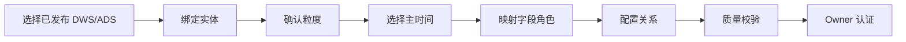

### M04.5 技术选型

- 事实源：PostgreSQL `askdata` schema。
- 后端：`internal/askdata/registry`。
- 前端：React Schema Form + 专用粒度/关系面板。
- 关系投影：NebulaGraph。
- 变更：不可变 Version + 乐观锁。

### M04.6 验收

- 模型只能引用当前有效 Dataset Version。
- 发布时重新确认物化 ACTIVE。
- 每个指标能定位到唯一模型或认证组合。
- 模型关系不能保存 Raw SQL/nGQL。
- 粒度和关系变化必须创建新版本。

---

## M05 指标与度量中心

### M05.1 业务职责

建立企业统一指标口径，区分：

- **Measure**：模型内的基础数值及聚合方式。
- **Metric**：面向业务的指标定义，可能依赖一个或多个 Measure/Metric。

### M05.2 子功能

| 子功能 | 业务规则 | 技术设计 |
|---|---|---|
| Measure 发现 | 从 DWS/ADS 度量字段生成草稿 | 自动导入，不自动认证 |
| Measure 配置 | 聚合、可加性、单位、数据类型 | Formula AST |
| Metric 创建 | 定义名称、描述、公式和 Owner | 版本化对象 |
| 默认过滤 | 排除退款、测试订单等 | Filter AST |
| 去重口径 | 客户数、订单数等 | Entity Key / DISTINCT Contract |
| 时间口径 | 日/月/财年、同比环比 | Time Contract |
| 可用维度 | 指标可以按哪些维度分析 | Metric-Dimension Compatibility |
| 正例和反例 | 防止同名误识别 | Search Document |
| KPI Bundle | 常用指标组合 | 版本化 Bundle |
| 影响分析 | 指标变更影响报告/问数 | Dependency Index |
| 审批 | Owner + 技术校验 | 双阶段认证 |
| 废弃 | 保留历史，禁止新使用 | DEPRECATED |

### M05.3 Formula AST 示例

```json
{
  "type": "DIVIDE",
  "left": {"type": "MEASURE_REF", "id": "gross_profit"},
  "right": {
    "type": "NULL_IF",
    "argument": {"type": "MEASURE_REF", "id": "sales_revenue"},
    "value": 0
  }
}
```

### M05.4 指标建设流程


### M05.5 技术选型

- PostgreSQL：权威版本和依赖。
- Go：Formula AST Validator、依赖 DAG、循环检测。
- NebulaGraph：Metric→Measure→Model、Metric→Dimension 投影。
- pgvector：指标定义和认证问法检索。
- React：指标编辑器、公式构建器、影响分析页面。

### M05.6 API

```text
GET/POST /api/semantic/measures
GET/POST /api/semantic/metrics
POST     /api/semantic/metrics/{id}/versions
POST     /api/semantic/metrics/{id}/certify
GET      /api/semantic/metrics/{id}/impact
```

### M05.7 验收

- 生产 Metric 必须有 Owner、定义、公式、单位和模型。
- 派生指标依赖无环。
- COUNT/DISTINCT 口径明确。
- Metric 变更产生新版本。
- 指标定义、正例和反例可被搜索使用。
- P0 指标必须有黄金问题。

---

## M06 维度与成员中心

### M06.1 业务职责

保证“按什么分析”和“筛选什么值”具有稳定身份、清晰层级和可控检索策略。

### M06.2 子功能

| 子功能 | 技术设计 |
|---|---|
| 维度创建 | 绑定模型和 Dataset stable field ID |
| 维度类型 | CATEGORICAL / TIME / ENTITY |
| 能力 | groupable/filterable/sortable |
| 敏感性 | PUBLIC/INTERNAL/CONFIDENTIAL/RESTRICTED |
| 成员策略 | FULL/EXACT_ONLY/ON_DEMAND/NONE |
| 成员画像 | distinct、null、topN、变化率 |
| 成员同步 | 全量初始化 + 增量观察 |
| 别名 | 与规范值分离、版本化 |
| 层级 | 区域/省/市、品类/系列/商品 |
| 有效期 | validFrom/validTo |
| 同名冲突 | 跨维度保留歧义 |
| 高基数 | 只在确定维度后查找 |
| 敏感成员 | Hash 精确查询 |
| 异常值治理 | UNKNOWN、测试、哨兵值排除 |

### M06.3 索引策略决策

```text
成员数量低 + 非敏感 + 变化低 -> FULL
敏感或代码值                    -> EXACT_ONLY
高基数但业务需要搜索            -> ON_DEMAND
禁止问数/无意义                  -> NONE
```

### M06.4 业务流程


### M06.5 技术选型

- PostgreSQL：成员事实、别名、有效期、Hash Lookup。
- Worker：有界成员扫描和增量 Observation。
- pgvector：仅 FULL 成员向量。
- `pg_trgm`：词法和模糊匹配。
- NebulaGraph：Member→Dimension、父子层级。
- React：画像、别名、层级、冲突审核。

### M06.6 验收

- 成员必须属于明确 Dimension Version。
- 过期成员不能静默映射到当前成员。
- 高基数维度不允许全量向量化。
- 敏感值不进入 LLM、Embedding 和日志。
- 跨维度同名成员必须触发联合判断或澄清。

---

## M07 业务词典与认证知识

### M07.1 业务职责

沉淀用户语言与语义资产之间的可信映射，同时避免用户反馈直接污染生产。

### M07.2 子功能

| 子功能 | 说明 |
|---|---|
| 高频词 | 指标、维度、成员、时间、操作符 |
| Match Mode | EXACT、PREFIX、SUFFIX、REGEX_SAFE、VECTOR |
| 负向上下文 | 明确哪些语境不可命中 |
| 生效范围 | tenant、domain、role、valid time |
| 冲突检查 | 同一域同优先级多目标报警 |
| 认证问法 | Question → Understanding/IR/Result |
| KPI Bundle | 宽泛问题的认证默认指标组合 |
| 报表资产 | 发布报表组件的可信语义绑定 |
| 自动候选 | 从反馈、澄清和日志发现 |
| 人工审批 | 候选不能自动进入 ACTIVE |

### M07.3 技术选型

- PostgreSQL：事实源和审批。
- Trie/Aho-Corasick：精确最长匹配。
- pgvector：认证问法和报告资产。
- Go Worker：候选挖掘和冲突检测。
- React：词典审核、冲突对比、认证问法编辑器。

### M07.4 流程

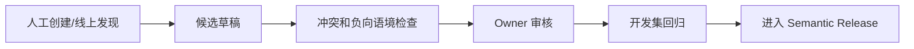

### M07.5 验收

- 每条映射有来源和审批记录。
- 同级冲突不能通过优先级静默掩盖。
- 用户一次选择不会直接成为长期映射。
- 报表自由文本不自动成为认证知识。

---

## M08 语义发布与投影

### M08.1 业务职责

把一组经过认证的语义对象冻结为可运行版本，并保证 PostgreSQL、Search 和 NebulaGraph 完全一致。

### M08.2 子功能

| 子功能 | 技术设计 |
|---|---|
| Release Manifest | 精确对象版本列表和稳定 Hash |
| 依赖闭包 | 自动包含 Measure、Model、Dimension 等依赖 |
| 静态验证 | 状态、权限、依赖、数据集 ACTIVE |
| Search 投影 | 生成文档和 Embedding Outbox |
| Graph 投影 | 生成 Vertex/Edge |
| Registry 投影 | 运行时快速查询索引 |
| 评测 | Development/Validation/Sealed/Security |
| 双人审批 | 业务和数据/语义负责人 |
| 激活 | 原子切换 ACTIVE 指针 |
| 回滚 | 激活历史 Release 或新建回滚 Release |
| 过期 | Dataset/物化失效后标记 STALE |

### M08.3 Release 状态

```text
DRAFT
  ↓ seal
SEALED
  ↓ projections
PROJECTING
  ↓ all ready
READY
  ↓ evaluation + approvals
ACTIVE
  ↓ superseded
SUPERSEDED
  ↓
RETIRED
```

### M08.4 投影一致性

只有满足以下条件才允许运行：

```text
release_hash
= registry_projection_hash
= search_projection_hash
= graph_projection_hash
= member_projection_hash
```

### M08.5 技术选型

- PostgreSQL Transaction + Outbox。
- Worker 幂等投影。
- MinIO 保存大型 Manifest/评测工件。
- NebulaGraph 保存图投影。
- pgvector 保存检索文档。
- 内容寻址 Hash。

### M08.6 验收

- 未通过评测和双人审批的 Release 不可 ACTIVE。
- 投影缺失时失败关闭。
- 运行固定 Release ID/Hash。
- 发布和回滚完整审计。
- 旧 Release 可重放历史 Question Run。

---

## M09 混合检索与向量索引

### M09.1 业务职责

确保正确指标、维度、成员和认证问法进入候选集合，重点保证 Recall，而非直接决定最终答案。

### M09.2 子功能

| 子功能 | 技术选型 | 设计 |
|---|---|---|
| 文档生成 | Go deterministic template | 同一对象生成稳定 document/input hash |
| Exact | PostgreSQL JSONB/B-tree | 名称、规范值、别名、编码 |
| Lexical | `pg_trgm` + `tsvector` | 中文片段和文本相似 |
| Vector | pgvector `halfvec(2560)` HNSW | 按对象类型、域和发布过滤 |
| RRF | Go | 合并排名而不是原始分数 |
| Rerank | Cross-encoder/Structured LLM | Top 10～30 |
| 降级 | exact + lexical | Embedding 故障时使用 |
| Recall 评测 | Exact KNN 对照 | ANN recall@K |
| 分区 | domain/tenant | 大规模后拆表/分区 |
| 缓存 | CandidateSet Hash | 绑定 PolicyScope |

### M09.3 文档模板

**Metric：**

```text
业务域 + 名称 + 别名 + 定义 + 公式摘要 + 单位
+ 实体 + 粒度 + 默认过滤 + 可用维度 + 正例 + 反例
```

**Member：**

```text
业务域 + 维度名称 + 维度描述 + 实体 + 层级路径
+ 规范值 + 别名 + 有效期
```

### M09.4 流程

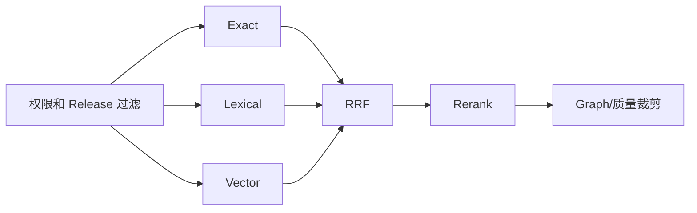

### M09.5 验收

- Metric/Dimension Recall@10 ≥ 99%。
- Member Recall@20 ≥ 99%。
- ANN 定期与 Exact 对照。
- 未授权对象 Recall 为 0。
- Embedding 故障不会强答低置信问题。
- 不同 Embedding 模型向量不混用。

---

## M10 NebulaGraph 语义图

### M10.1 业务职责

证明候选组合是否在业务和数据关系上可行，并寻找安全 Join 路径。

### M10.2 Vertex

```text
domain
entity
semantic_model
measure
metric
dimension
member
hierarchy
dataset_version
report_version
report_component
certified_question
kpi_bundle
```

### M10.3 Edge

```text
MODEL_FOR_ENTITY
MODEL_MAPS_DATASET
MODEL_HAS_MEASURE
MODEL_HAS_DIMENSION
METRIC_ON_MODEL
METRIC_USES_MEASURE
METRIC_COMPATIBLE_DIMENSION
MEMBER_OF_DIMENSION
MEMBER_PARENT_OF
MODEL_RELATES_MODEL
REPORT_USES_METRIC
REPORT_GROUPS_BY_DIMENSION
REPORT_FILTERS_MEMBER
QUESTION_BINDS_METRIC
BUNDLE_CONTAINS_METRIC
```

### M10.4 子功能

| 子功能 | 技术设计 |
|---|---|
| 图 Schema | `deployments/nebula/schema.ngql` |
| 图投影 | Worker 从 Release Manifest 幂等写入 |
| GraphPlan | 输入稳定 ID，不接受 Raw nGQL |
| 模型覆盖 | 指标和维度是否在同模型 |
| 成员归属 | Member 是否属于候选维度 |
| Join Path | 最短认证路径，默认 ≤3 hops |
| 风险 | ONE_TO_MANY、MANY_TO_MANY、PREAGG |
| Cache | release hash + candidate set hash |
| Fallback | PostgreSQL 注册表有限路径搜索 |

### M10.5 技术选型

- NebulaGraph 3.8.0。
- `nebula-go/v3 v3.8.0`。
- 开发共享 Space，属性隔离 tenant/domain/release。
- API 只读账号，Worker 投影写账号。
- Graphd 不直接公开。
- 生产多副本、TLS、备份由容量 POC 决定。

### M10.6 GraphPlan 流程

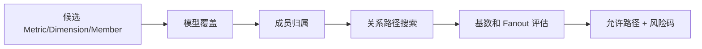

### M10.7 验收

- 图中每个对象绑定 Release。
- 图投影 Hash 与 Release 一致。
- 最多 4 hops。
- BLOCK Fanout 不返回可执行路径。
- 图不可用时不能猜测 Join。
- nGQL 只能由 Adapter 模板生成。

---

## M11 问题理解与会话

### M11.1 业务职责

把用户自然语言转化为完整但尚未绑定物理对象的结构化意图，并正确继承多轮上下文。

### M11.2 子功能

| 子功能 | 技术设计 |
|---|---|
| 字符规范化 | 全半角、大小写、数字单位、符号 |
| Span 回映 | 规范文本位置映射回原文 Unicode |
| 最长词匹配 | Trie/Aho-Corasick |
| 时间解析 | 今天、本月、财年、过去 12 个月 |
| 操作解析 | 同比、环比、TopN、排序、按/每个 |
| Domain Hypothesis | 结合用户、页面、词典和候选 |
| LLM Understanding | 严格 JSON Schema |
| 残余 Span | 关键未解释文本显式记录 |
| 会话上下文 | 只继承已认证 Binding/IR |
| 上下文覆盖 | 用户可查看、删除或替换 |
| 报告上下文 | 当前报告和选中组件作为先验 |

### M11.3 QuestionUnderstanding

```text
question
domainHypotheses
metricMentions
dimensionMentions
valueMentions
time
comparisons
ordering
limit
unresolvedSpans
```

不允许 SQL、表名、列名和临时公式。

### M11.4 流程


### M11.5 技术选型

- Go Rule Parser。
- `golang.org/x/text`。
- Provider-neutral LLM。
- JSON Schema + 当前严格 JSON Decoder。
- Conversation Context 版本化存储。
- 不保存隐藏思维链。

### M11.6 验收

- 时间/比较解析准确率 ≥99%。
- 每个 Mention 有原文 Span。
- 未解释关键 Span 不能直接回答。
- 多轮继承不改变指标版本。
- Prompt 注入不能修改 Tool/Release/Policy。

---

## M12 联合绑定与澄清

### M12.1 业务职责

从候选中选择全局一致的业务解释，而不是对每个词独立取 Top 1。

### M12.2 子功能

| 子功能 | 技术设计 |
|---|---|
| Candidate Builder | 按 Mention 组织候选及证据 |
| Contract Loader | 加载定义、反例、维度和质量 |
| Bundle Builder | Metric+Model+Dimension+Member+Time |
| Beam Search | 保留 Top N 全局组合 |
| Graph Filter | 删除不兼容组合 |
| Bundle Scorer | 结构化特征评分 |
| Rerank | LLM/Cross Encoder 比较 Top Bundle |
| Calibrator | Logistic/Isotonic 校准正确概率 |
| Margin | Top1 与 Top2 差异 |
| Clarification | 根据唯一冲突生成候选卡 |
| Binding Artifact | 稳定 Hash 和证据引用 |

### M12.3 评分特征

```text
exact_match
lexical_score
vector_score
certified_example_score
report_asset_prior
domain_prior
entity_match
dimension_role_match
member_ownership
hierarchy_match
graph_path_length
join_risk
time_coverage
data_quality
permission
unresolved_span_count
negative_context
```

### M12.4 流程

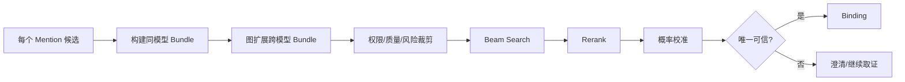

### M12.5 Go 包

```text
internal/askdata/binding
├── candidate.go
├── bundle.go
├── beam.go
├── scorer.go
├── reranker.go
├── calibrator.go
└── clarification.go
```

### M12.6 验收

- 指标 Top-1 ≥97%。
- 维度/成员 Mention F1 ≥97%。
- 不兼容组合不能进入 IR。
- Calibrator 不使用 LLM 自报 confidence。
- 阈值由验证集确定并绑定业务域/Release。
- 低 Margin 必须澄清。

---

## M13 Semantic IR 与查询编译

### M13.1 业务职责

把业务绑定结果转成稳定、可审计、可测试的逻辑查询，并确定性生成 SQL。

### M13.2 子功能

| 子功能 | 技术设计 |
|---|---|
| Semantic IR | 只保存稳定语义 ID |
| IR 规范化 | 集合排序、默认值、稳定 Hash |
| Contract Resolution | 加载 Model/Metric/Dimension/Member |
| Logical Plan | Source、Filter、Join、Aggregate、Compare |
| Metric Compiler | Formula AST → Expression AST |
| Dimension Compiler | Member ID → 参数值 |
| Join Compiler | 认证关系和预聚合 |
| Time Compiler | 半开区间和 IANA 时区 |
| Comparison | Current/Previous CTE |
| Sort/TopN | 受控目标和 Limit |
| SQL Dialect | 首期 PostgreSQL |
| Plan Artifact | SQL、参数合同、依赖和 Hash |

### M13.3 编译流程

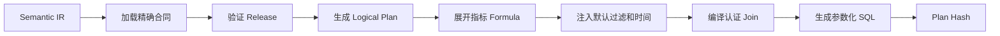

### M13.4 Go 包

```text
internal/askdata/compiler
├── compiler.go
├── contract_loader.go
├── logical_plan.go
├── metric.go
├── dimension.go
├── join.go
├── comparison.go
├── postgres.go
└── artifact.go
```

### M13.5 安全规则

- LLM 不生成 SQL。
- IR 无物理表字段。
- 物理标识来自已发布 Dataset。
- 值全部参数化。
- 只允许 SELECT。
- 禁止多语句和系统表。
- 函数白名单。
- Join 必须来自 GraphPlan/Registry。

### M13.6 验收

- 相同 IR + Release 产生相同 Plan Hash。
- 用户输入不能进入 SQL 标识符。
- 指标 Formula 可测试。
- 同比/环比边界正确。
- MANY_TO_MANY 无认证策略编译失败。
- SQL 结果与黄金结果等价率 ≥96%。

---

## M14 查询执行与结果验证

### M14.1 业务职责

安全执行已认证计划，判断结果是否可信，并在异常时提供自纠错证据。

### M14.2 子功能

| 子功能 | 技术设计 |
|---|---|
| Plan Validation | AST、引用、权限、风险 |
| EXPLAIN | 扫描量、Join、成本 |
| Query Budget | 超时、行数、并发 |
| 只读执行 | Warehouse Reader |
| Batch Query | 多图表/候选计划批处理 |
| Cache | PolicyScope + Release + IR + Freshness |
| Validation Query | Member、Coverage、Cardinality |
| Result Normalize | Decimal、Time、NULL、Sort |
| Result Verification | 总计、聚合、对比、单位 |
| Empty Analysis | 时间、成员、默认过滤检查 |
| Artifact | 结果 Hash、Schema、摘要 |
| Cancel | 用户取消和超时 |

### M14.3 流程

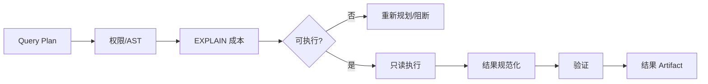

### M14.4 技术选型

- `internal/queryruntime`。
- `pgx/v5`。
- PostgreSQL Read-only Transaction。
- Statement Timeout。
- 可选 MinIO 保存大型结果。
- 首期 PostgreSQL Cache；规模后可选 Redis。

### M14.5 验收

- DDL/DML 执行成功数为 0。
- 查询超时能取消。
- 缓存不跨 PolicyScope。
- 空结果能区分“确实无数据”和“错误绑定”。
- 结果 Artifact 可重放和比较。

---

## M15 Agent Loop 与 Tool Host

### M15.1 业务职责

使系统不是单次 LLM 推理，而是能多次检索、验证、执行和纠错，同时保证有界和可审计。

### M15.2 已冻结工具

```text
search_semantic_objects
get_semantic_contracts
lookup_dimension_values
get_certified_examples
resolve_graph_plan
validate_semantic_bundle
get_data_quality_status
compile_semantic_query
validate_query_plan
probe_join_cardinality
execute_query_plan
execute_validation_query
compare_candidate_results
request_clarification
```

### M15.3 子功能

| 子功能 | 技术设计 |
|---|---|
| State Machine | 明确阶段和转移 |
| Planner | LLM 输出 Cognition Action |
| Tool Host | 严格工具和参数白名单 |
| Budget | 模型/工具/查询/时间上限 |
| Fast Path | 唯一精确命中快速执行 |
| Complex Loop | 多轮取证和纠错 |
| Progress Guard | 无新证据则终止 |
| Checkpoint | 每阶段 Artifact Hash |
| Retry | 网络和模型临时错误 |
| Semantic Repair | 编译/验证失败回到 Binding |
| Result Repair | 空结果/异常回到 Binding |
| Clarification | 等待用户输入后继续 |
| Resume | Run 可恢复 |
| Audit | Action、参数 Hash、结果 Hash |

### M15.4 状态

```text
RECEIVED
AUTHORIZED
CONTEXT_READY
UNDERSTANDING
RETRIEVING
BINDING
GRAPH_VALIDATING
IR_READY
PLAN_VALIDATING
EXECUTING
RESULT_VERIFYING
ANSWER_VERIFYING
ANSWERED
CLARIFICATION_REQUIRED
CLARIFICATION_EXPIRED
OUT_OF_SCOPE
BLOCKED
```

### M15.5 预算建议

```text
最多 4 次 LLM
最多 8 次 Tool
最多 2 次正式查询
最多 3 次验证查询
最多 25 秒
```

业务域上线前通过压测调整。

### M15.6 Go 包

```text
internal/askdata/cognition
internal/askdata/toolhost
internal/askdata/orchestrator
```

需补充：

```text
orchestrator/runner.go
orchestrator/planner.go
orchestrator/tool_registry.go
orchestrator/progress.go
orchestrator/resume.go
```

### M15.7 验收

- 未知工具和字段失败关闭。
- LLM 不能修改 Release/PolicyScope。
- 无进度 Loop 自动终止。
- Run 可从最后 Checkpoint 恢复。
- 每个答案有完整工具和证据链。
- 不保存隐藏思维链。

---

## M16 答案、图表与证据工作台

### M16.1 业务职责

向用户提供简洁答案，同时让需要核验的用户看到完整业务口径和证据。

### M16.2 子功能

| 子功能 | 技术设计 |
|---|---|
| Answer Composer | 结构化 Result + Evidence → Narrative |
| 数值卡片 | 主要指标、对比和单位 |
| 图表推荐 | 根据 Result Schema/Intent 规则选择 |
| 表格 | TanStack Table + Virtual |
| 证据面板 | Understanding、Binding、Graph、Quality |
| 运行进度 | SSE Event |
| 澄清卡 | 候选定义和差异 |
| 追问 | 继承已认证 Context |
| 导出 | CSV/Excel/图片 |
| 保存问题 | Certified Candidate 或个人收藏 |
| 反馈 | 结构化 Issue Type |
| 加入报告 | 调用 Report Operation |

### M16.3 React 技术选型

```text
React + TypeScript + Vite
React Router
ECharts
TanStack Query
TanStack Table
TanStack Virtual
可选 Zustand
POST + SSE/ReadableStream
```

### M16.4 前端模块

```text
web/src/askdata/
├── api
├── QuestionComposer
├── RunProgress
├── ClarificationCard
├── AnswerSummary
├── ResultChart
├── ResultTable
├── EvidencePanel
├── FeedbackPanel
└── AddToReportDialog
```

### M16.5 SSE 事件

```text
run.created
run.state_changed
understanding.ready
retrieval.ready
binding.ready
graph.ready
plan.ready
query.started
query.completed
verification.ready
clarification.required
answer.ready
run.blocked
```

### M16.6 验收

- 用户看不到隐藏思维链和敏感信息。
- 断线可按 Event Sequence 恢复。
- 所有结论可指向结果和证据。
- 图表与表格单位、时间和排序一致。
- 澄清后继续同一 Run。

---

## M17 智能报表与问数融合

### M17.1 业务职责

让问数结果变成报告资产，也让经过认证的报告资产提升问数准确率。

### M17.2 子功能

| 子功能 | 技术设计 |
|---|---|
| Report DSL | JSON Schema + 规范化 |
| 报告模板 | 结构、布局、主题、叙述 |
| 报告设计器 | React Grid/Slot/Property Panel |
| 数据绑定 | Semantic IR + Plan Hash |
| 问数入报告 | Question Run → Report Operation |
| 报告局部 AI 修改 | 选区 → Report Operation |
| 智能结论 | Evidence Bundle + Narrative |
| 报告发布 | 不可变 JSON Artifact |
| 报表资产投影 | Report Version/Component → Search/Graph |
| 资产认证 | Owner 审批后进入问数 |
| 依赖影响 | 语义版本变化提示升级 |
| 移动端 | 独立布局规则 |

### M17.3 问数加入报告流程


### M17.4 报表反哺流程


### M17.5 技术选型

- Report V2 独立 Go bounded context。
- JSON Schema。
- 统一 `ReportOperation`。
- ECharts 组件 Manifest。
- MinIO 发布制品。
- PostgreSQL 草稿/修订/版本。
- Search/NebulaGraph 只保存可重建投影。

### M17.6 验收

- 报告数据绑定不保存 Raw SQL。
- 查看报告仍使用阅读者权限。
- 未认证报告不参与问数最终绑定。
- 历史报告固定历史语义版本。
- 升级报告必须重新验证和发布。

---

## M18 评测、反馈与主动学习

### M18.1 业务职责

证明 95%、阻止回归，并把线上问题转化为受控改进。

### M18.2 子功能

| 子功能 | 技术设计 |
|---|---|
| Evaluation Set | Development/Validation/Sealed/Production |
| Evaluation Case | Question、角色、Expected Artifacts |
| 双人评审 | 两个独立 Review Slot |
| Seal | 固定 Content Hash |
| Evaluation Run | 追加写运行结果 |
| Result Equivalence | 规范化后比较 |
| Stage Metrics | Recall、Binding、IR、Graph、Result |
| Wilson Gate | 下界计算 |
| Security Set | 越权、注入、敏感 |
| Release Gate | 门槛和审批 |
| Feedback | 绑定原 Question Run |
| Attribution | 指标/维度/成员/时间/查询/解释 |
| Active Learning | 未识别、澄清和错误聚类 |
| Candidate Fix | 只生成草稿 |
| Regression | 修复后全量回归 |

### M18.3 密封 Case

```text
question
actor/role
policy scope
semantic release
expected understanding hash
expected binding hash
expected graph plan hash
expected IR hash
expected result hash
expected outcome
review slots
```

### M18.4 流程

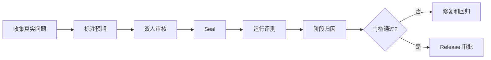

### M18.5 验收

- 至少 2,000 条密封样本后再声明 95%。
- 观测正确率 ≥96%，Wilson 下界 ≥95%。
- 直接回答覆盖率 ≥85%。
- P0 和安全集 100%。
- 用户反馈不能直接修改生产资产。
- 每次生产 Release 有完整评测报告。

---

## M19 运维、可观测与成本

### M19.1 业务职责

保证系统稳定、可定位、成本可控，并能回答“为什么慢、为什么错、花了多少钱”。

### M19.2 子功能

| 子功能 | 技术选型 | 设计 |
|---|---|---|
| Trace | OpenTelemetry | Question Run 全链路 |
| Metrics | Prometheus/Grafana | 阶段延迟和正确率 |
| Log | Structured JSON | 不记录敏感值/思维链 |
| Model Cost | Token/Provider Audit | 按业务域和用户统计 |
| Query Cost | EXPLAIN/扫描量 | 预算和告警 |
| Rate Limit | Go Middleware | 用户/租户/域 |
| Circuit Breaker | Provider/Graph/Embedding | 降级 |
| Capacity | PostgreSQL/Nebula/Worker | 队列和延迟 |
| Backup | PostgreSQL PITR、Nebula 备份、MinIO | 定期恢复演练 |
| Release Monitoring | 版本和错误对比 | Canary/Shadow |
| Feature Flag | 按业务域开启 | 限定能力范围 |
| Incident | Run ID 驱动排查 | 工具和 Artifact 可重放 |

### M19.3 Trace 字段

```text
tenantId
actorId
domainId
runId
releaseId/hash
understandingHash
candidateSetHash
bindingHash
graphPlanHash
semanticIRHash
queryPlanHash
resultHash
reportVersionId
```

### M19.4 核心指标

- Question P50/P95
- Tool Error Rate
- LLM Cost/Run
- Search Recall Proxy
- Clarification Rate
- Binding Margin
- Compile Failure
- Query Timeout
- Result Verification Failure
- Strict E2E Accuracy
- Direct Answer Coverage
- Report Conversion Rate

### M19.5 验收

- 任一线上错误可通过 Run ID 回放。
- Provider 故障有降级或阻断。
- NebulaGraph 故障不会产生猜测 Join。
- 成本可按租户、业务域和用户统计。
- 备份恢复经过演练。

---

## M20 决策协同、行动跟踪与结果复盘

### M20.1 业务职责

将已验证的问数答案、报告组件和 Insight Artifact 固定为决策证据，记录审批、行动、责任和结果复盘。M20 是决策支持 bounded context，不直接执行 ERP/CRM 等外部系统交易。

### M20.2 核心对象

```text
Decision
DecisionEvidence
DecisionOption
DecisionApproval
ActionItem
ActionEvent
OutcomeMetric
OutcomeReview
DecisionNotification
```

核心约束：

- `DecisionEvidence` 只引用不可变 `Question Run/Answer Artifact/Report Version/Insight Artifact`，并保存引用对象哈希、Semantic Release、data snapshot 和数据时点。
- 决策页按当前查看者权限重新校验来源；无权用户只看到受控摘要，不可经决策引用扩权。
- 决策内容和行动更新采用递增 `record_version` 和幂等键，事件只追加。
- 口径漂移、来源下架和数据过期不改写历史决策，只追加 Drift/Stale 证据。

### M20.3 状态机

```text
Decision: DRAFT -> IN_REVIEW -> APPROVED / REJECTED -> IN_EXECUTION
          -> REVIEW_DUE -> CLOSED / REOPENED / CANCELED

ActionItem: TODO -> DOING -> BLOCKED -> DONE / CANCELED
OutcomeReview: PENDING -> GENERATED -> CONFIRMED / INCONCLUSIVE
```

状态转换必须由服务端权限和当前版本验证，不接受客户端任意设置终态。

### M20.4 与现有模块的集成

| 上/下游 | 集成 |
|---|---|
| M16 答案工作台 | 从已验证 Answer Artifact 创建 Decision Evidence |
| M17 报告 | 从已发布组件/Insight 创建，或将决策状态作为受控报告组件 |
| M13/M14 编译执行 | 复盘指标只通过固定 Semantic IR 和当前权限重新执行 |
| M18 运营 | 决策反馈、未达成原因和复盘质量进入受控改进 |
| M19 观测 | 决策周期、审批时长、行动按期率、复盘率和结果分布 |

### M20.5 API 边界

```text
POST   /api/v1/decisions
GET    /api/v1/decisions
GET    /api/v1/decisions/{id}
PUT    /api/v1/decisions/{id}
POST   /api/v1/decisions/{id}/submit
POST   /api/v1/decisions/{id}/approvals
POST   /api/v1/decisions/{id}/actions
POST   /api/v1/decisions/{id}/actions/{actionId}/transition
POST   /api/v1/decisions/{id}/outcome/refresh
POST   /api/v1/decisions/{id}/outcome/confirm
POST   /api/v1/decisions/{id}/close
POST   /api/v1/decisions/{id}/reopen
GET    /api/v1/decisions/{id}/events
```

所有写 API 必须要求 `Idempotency-Key`，并在服务端从登录上下文固定 tenant/domain/actor，不信任请求体中的作用域。

### M20.6 验收

- 无已验证来源也可创建手工决策草稿，但必须显示「无平台证据」且不得伪造 Evidence。
- 历史决策的证据哈希、口径和数据时点不随当前 Release 改写。
- 行动超期、阻塞、转交和完成全部有审计和通知。
- 复盘查询按当前查看者权限重新执行，不复用他人结果或旧 PolicyScope。
- 关闭决策需要行动终态和结果复盘，或显式记录终止/无法归因理由。
- 至少有一条「问数 -> 决策 -> 行动 -> 指标复盘 -> 关闭」真实 PostgreSQL E2E 测试。

---

## 20. 模块级技术选型汇总

| 领域 | 选型 |
|---|---|
| Backend | Go 1.26、`net/http`、`pgx/v5` |
| Frontend | React、TypeScript、Vite、React Router |
| Server State | TanStack Query |
| Table/Virtual | TanStack Table / Virtual |
| Chart | ECharts |
| Control DB | PostgreSQL 17 |
| Vector | pgvector `halfvec(2560)` + HNSW |
| Lexical | `pg_trgm` + `tsvector` |
| Graph | NebulaGraph 3.8.0 + nebula-go/v3 3.8.0 |
| Warehouse | 首期 PostgreSQL DWS/ADS |
| Connector | Python Connector Service |
| Artifact | MinIO |
| Async | PostgreSQL Outbox + Go Worker |
| Stream | HTTP POST + SSE |
| Observability | OpenTelemetry + Prometheus/Grafana |
| Cache | MVP PostgreSQL/内存，规模后可选 Redis |
| LLM | Provider Pool + Strict JSON Schema |
| Embedding | OpenAI-compatible 2,560 维 Provider |
| Decision Workflow | Go bounded context + PostgreSQL 追加事件 + 幂等 HTTP API + 站内通知 |

---

## 21. 建议数据库 Schema 边界

```text
platform
  租户、用户、角色、数据源、Dataset、Report V2

askdata
  语义注册表、发布、搜索、图投影状态、Question Run、评测

decision
  决策、证据引用、审批、行动项、结果指标、复盘与追加事件

warehouse
  ODS/DIM/DWD/DWS/ADS 和物化视图
```

原则：

- 不恢复已退役的 `platform.semantic_*`。
- `askdata` 语义事实和 Report V2 通过稳定 ID/Outbox 集成。
- `decision` 只引用不可变分析 Artifact 和当前权限重放合同，不复制查询结果行作为新的授权边界。
- 所有租户表启用并强制 RLS。
- 发布对象不可原地修改。

---

## 22. 研发拆分建议

### 22.1 第一阶段：业务资产和基础控制面

```text
M01 权限
M02 数据源
M03 数据建模
M04 语义模型
M05 指标
M06 维度成员
M07 词典
M08 发布
```

### 22.2 第二阶段：问数核心链路

```text
M09 检索
M10 图谱
M11 理解
M12 绑定
M13 编译
M14 执行
M15 Agent Loop
M16 工作台
```

### 22.3 第三阶段：资产闭环和质量

```text
M17 报表融合
M18 评测反馈
M19 运维
```

### 22.4 第四阶段：决策、行动与结果复盘

```text
M20 决策协同、行动跟踪与结果复盘
```

M20 在问数、报告和统一待办主链真实接线后实施；可先冻结合同和存储边界，但业务域审批策略、行动 SLA 和结果达标规则必须由业务 Owner 确认。

---

## 23. 每个模块的 Definition of Done

每个模块不能仅以“页面完成”或“API 可调用”为完成标准，必须同时具备：

1. 业务流程。
2. 数据模型和版本策略。
3. Go 服务和接口。
4. React 页面或管理入口。
5. 权限。
6. 审计。
7. 单元和集成测试。
8. 可观测指标。
9. 失败和降级行为。
10. 运维文档。
11. 验收数据。
12. 与上下游的契约测试。

---

## 24. 当前仓库模块映射

### 已实现或已有主链

```text
M01：internal/auth、internal/access、internal/policy、平台管理前端
M02：connector_service、internal/datasource、internal/asset、数据源中心前端
M03：internal/dataset、materialization、querycompiler/queryruntime、数据集画布前端
M04～M08：internal/askdata/registry、dimension、security、evaluation 及语义 Admin API
M09：internal/askdata/search
M10：internal/askdata/graph、deployments/nebula
M11：internal/askdata/understanding
M12：internal/askdata/binding
M13：internal/askdata/ir、compiler
M14：internal/askdata/validator、queryruntime
M15：internal/askdata/cognition、toolhost、orchestrator、http
M16：internal/askdata/answer + AskDataPage 真实 Question API/SSE、证据、反馈和取数申请
M17：internal/report 全部后端主链 + web/src/report 部分前端
M18：internal/askdata/evaluation、feedback、savedquestion、datarequest
M19：internal/askdata/observability、配额/成本、scripts/loadtest 与灾备脚本
```

### 主要待建或待接线

```text
M04～M08：语义建设、审批、发布和评测前端工作台
M16：真实会话历史、保存/共享/导出/加入报告/决策前端
M17：报告模板中心、创建向导、设计器、真实运行组件与全部动作接线
M18：反馈/主动学习运营页面 + 真实业务黄金集
M19：运营/配额/成本前端 + 目标环境容量与灾备验收
M20：决策记录、证据快照、审批、行动项、通知和结果复盘（全新 bounded context）
```

---

## 25. 最终落地原则

1. 业务域先行，不能先做全企业通用问数。
2. 指标、维度和成员是正式功能模块，不是配置表。
3. PostgreSQL 是语义事实源，NebulaGraph 和向量库是投影。
4. LLM 不直接生成 SQL，也不决定权限和发布。
5. 问数需要多轮 Tool Loop，但循环必须有界。
6. 无法证明唯一正确时必须澄清。
7. 报表可以反哺问数，但只有认证资产可影响生产绑定。
8. 95% 由密封评测证明，不能由架构文档宣称。
9. 模块必须同时有后台治理入口和运行能力。
10. 项目的关键交付物不仅是代码，还包括业务语义资产、黄金集和运营机制。

---

# 第三部分：配置化报告引擎技术专章

本部分给出 Report Definition、Component Manifest、Report Operation、布局、数据绑定、智能结论、草稿修订、发布制品和运行时的完整设计。报告模块通过 Semantic IR 与问数共用语义底座。

## 1. 背景与现状

现有项目已经具备以下基础能力：

- Go API 和后台 Worker。
- React、TypeScript、Vite 前端。
- ECharts 图表依赖。
- Python 数据连接器服务。
- 数据源、数据资产、数据集设计和发布能力。
- Dataset DSL、结构化表达式、查询编译和查询运行时。
- AskData 语义理解、检索、编排和审计能力。
- 租户隔离、业务域和对象权限能力。

项目历史迁移中曾存在 Report、Metric 和旧 Semantic Q&A 运行时，包括报告草稿、修订、发布制品和组件索引；但后续迁移已将其退役并删除。因此本设计采用以下策略：

1. 不修改历史迁移。
2. 不假定旧报告表仍然存在。
3. 复用旧设计中“完整 JSON 草稿 + 不可变修订 + 不可变发布制品”的思想。
4. 在当前 Dataset 和 AskData 架构上新增独立的 **Report V2 bounded context**。
5. V1 不恢复独立 Metric 服务，报告直接绑定已发布数据集中的语义字段和受控表达式。

---

## 2. 设计原则

### 2.1 唯一事实来源

- 设计态唯一事实来源：规范化 Report Definition JSON。
- 发布态唯一事实来源：不可变 Published Report Artifact。
- 组件索引、依赖索引、搜索文档和预览图均为可重建派生物。
- 编辑器状态和运行时状态不得写入发布定义。

### 2.2 编辑与运行分离

```text
Report Studio
    ↓ 生成或修改 DSL
Report Compiler
    ↓ 规范化、校验、编译
Published Artifact
    ↓ 加载
Report Runtime
```

运行时不包含报告专属代码，不执行任意脚本，只解释受控组件和配置。

### 2.3 用户操作和 AI 操作统一

拖拽、属性配置、模板实例化、导入和 LLM 修改均转换为统一的 `ReportOperation`，经过同一服务端校验和修订流程。

### 2.4 精确版本依赖

发布报告必须固定：

- 模板版本
- 主题版本
- 组件模板版本
- 数据集发布版本
- 分析方法版本
- Prompt 版本
- LLM 模型或模型策略版本

### 2.5 默认失败关闭

以下情况必须拒绝保存或发布：

- 未知 Schema 版本
- 未知字段
- 不存在的对象引用
- 数据字段与组件契约不兼容
- 布局越界或冲突
- 无权限的数据依赖
- 不受控 SQL 或脚本
- 无法验证来源的智能结论

---

## 3. 总体架构

```text
┌──────────────────────────────────────────────────────────────┐
│                         Web Frontend                         │
│  Template Center | Report Studio | Report Preview | Runtime │
└───────────────┬───────────────────────────────┬──────────────┘
                │ ReportOperation               │ Runtime Query
                ▼                               ▼
┌───────────────────────────┐       ┌──────────────────────────┐
│ Report API / Application  │       │ Query Runtime            │
│ 草稿、修订、发布、权限    │       │ Dataset DSL 查询执行     │
└──────────────┬────────────┘       └─────────────┬────────────┘
               │                                  │
       ┌───────▼────────┐                 ┌───────▼────────┐
       │ Report Compiler │                 │ Data Sources    │
       │ 校验/规范化/索引│                 │ Warehouse/File  │
       └───────┬────────┘                 └─────────────────┘
               │
       ┌───────▼────────────┐
       │ Report AI Service  │
       │ 计划、局部操作、叙述│
       └───────┬────────────┘
               │
       ┌───────▼────────────┐
       │ Insight Engine     │
       │ 确定性证据计算     │
       └────────────────────┘
```

---

## 4. 模块划分

### 4.1 前端

建议新增目录：

```text
web/src/report/
├── api/
├── components/
├── designer/
│   ├── canvas/
│   ├── block/
│   ├── zone/
│   ├── slot/
│   ├── property-panel/
│   ├── data-binding/
│   └── ai-dock/
├── runtime/
├── templates/
├── state/
├── schemas/
└── types/
```

主要模块：

| 模块 | 职责 |
|---|---|
| Template Center | 模板浏览、预览和选择 |
| Report Studio | 画布、拖拽、缩放、槽位编辑和属性配置 |
| AI Dock | 对话生成、选区修改、差异预览 |
| Data Binding Panel | 维度、度量、时间、筛选、排序和格式化 |
| Mobile Preview | 移动端顺序、折叠和降级预览 |
| Report Runtime | 解释发布 JSON 并渲染 |
| Validation Center | 汇总结构、数据、权限和发布问题 |

### 4.2 后端

建议新增 Go 包：

```text
internal/report/
├── model.go
├── service.go
├── http.go
├── repository.go
├── postgres_store.go
├── validation/
├── compiler/
├── operation/
├── template/
├── publication/
├── runtime/
├── insight/
└── ai/
```

职责边界：

- `report`：报告生命周期和应用服务。
- `report/compiler`：DSL 规范化、校验、哈希和派生索引。
- `report/operation`：结构化操作执行。
- `report/template`：模板组合和实例化。
- `report/publication`：发布、回滚和不可变制品。
- `report/runtime`：发布制品读取和运行描述。
- `report/insight`：证据计算和结论状态。
- `report/ai`：LLM 计划和操作生成。

---

## 5. Report Definition DSL V1

### 5.1 顶层结构

```json
{
  "schemaVersion": "1.0",
  "metadata": {},
  "templateRef": {},
  "themeRef": {},
  "canvas": {},
  "dataContexts": [],
  "globalFilters": [],
  "pages": [],
  "interactions": [],
  "runtimePolicy": {},
  "provenance": {}
}
```

### 5.2 元数据

```json
{
  "metadata": {
    "id": "report_sales_monthly",
    "code": "sales_monthly",
    "name": "月度销售经营报告",
    "description": "",
    "reportType": "REPORT",
    "locale": "zh-CN"
  }
}
```

### 5.3 模板引用

```json
{
  "templateRef": {
    "reportTemplateId": "tpl_monthly_business",
    "reportTemplateVersion": "1.3.0",
    "structureTemplateVersion": "1.2.0",
    "layoutTemplateVersion": "1.1.0",
    "narrativeTemplateVersion": "1.0.2"
  },
  "themeRef": {
    "themeId": "theme_corporate_light",
    "version": "2.0.0"
  }
}
```

### 5.4 画布

```json
{
  "canvas": {
    "desktop": {
      "designWidth": 1920,
      "columns": 24,
      "baseCellWidth": 80,
      "baseRowHeight": 54,
      "gapX": 12,
      "gapY": 12,
      "paddingX": 24,
      "paddingY": 24
    },
    "mobile": {
      "columns": 1,
      "gapY": 12,
      "paddingX": 12,
      "paddingY": 12
    }
  }
}
```

`baseCellWidth` 和 `baseRowHeight` 是设计单位，不等于所有设备上的最终像素。

### 5.5 页面、章节和分块

```json
{
  "pages": [
    {
      "id": "page_overview",
      "name": "经营总览",
      "order": 1,
      "sections": [
        {
          "id": "section_summary",
          "name": "核心摘要",
          "order": 1,
          "blocks": [
            {
              "id": "block_sales_summary",
              "type": "ANALYSIS_CARD",
              "layout": {
                "desktop": {"x": 0, "y": 0, "w": 8, "h": 6},
                "mobile": {
                  "order": 1,
                  "visible": true,
                  "heightMode": "AUTO",
                  "slotMode": "STACK"
                }
              },
              "zones": []
            }
          ]
        }
      ]
    }
  ]
}
```

### 5.6 区域和槽位

```json
{
  "zones": [
    {
      "id": "zone_header",
      "type": "HEADER",
      "layout": {
        "heightMode": "AUTO",
        "minHeight": 40
      },
      "slots": [
        {
          "id": "slot_title",
          "grid": {"x": 0, "y": 0, "w": 1, "h": 1},
          "componentId": "component_title"
        }
      ]
    },
    {
      "id": "zone_content",
      "type": "CONTENT",
      "layout": {
        "heightMode": "FR",
        "fr": 1,
        "minHeight": 180,
        "columns": 2,
        "rows": 1
      },
      "slots": [
        {
          "id": "slot_chart_main",
          "grid": {"x": 0, "y": 0, "w": 2, "h": 1},
          "componentId": "component_chart_main"
        }
      ]
    }
  ]
}
```

### 5.7 组件

```json
{
  "components": [
    {
      "id": "component_chart_main",
      "templateRef": {
        "type": "line-trend",
        "version": "1.2.0"
      },
      "dataBinding": {
        "dataContextId": "sales_context",
        "dimensions": [
          {"role": "X_AXIS", "field": "month"}
        ],
        "measures": [
          {"role": "Y_AXIS", "field": "sales_amount"}
        ]
      },
      "options": {
        "showLegend": false,
        "showLabel": false,
        "smooth": true
      }
    }
  ]
}
```

组件可以存放在 Block 下，也可以使用顶层组件表并由 ID 引用。推荐顶层组件表，便于索引、引用完整性校验和操作定位。

---

## 6. Component Manifest V1

每个组件模板必须注册 Manifest：

```json
{
  "type": "bar-comparison",
  "version": "1.0.0",
  "renderer": "ECHARTS",
  "displayName": "对比柱状图",
  "minSize": {"w": 4, "h": 3},
  "recommendedSize": {"w": 6, "h": 5},
  "dataContract": {
    "dimensions": {"min": 1, "max": 2},
    "measures": {"min": 1, "max": 5},
    "timeField": {"required": false}
  },
  "optionSchema": {
    "type": "object",
    "additionalProperties": false,
    "properties": {
      "showLegend": {"type": "boolean"},
      "showLabel": {"type": "boolean"},
      "orientation": {
        "type": "string",
        "enum": ["HORIZONTAL", "VERTICAL"]
      }
    }
  },
  "mobilePolicy": {
    "supported": true,
    "defaultLegendMode": "HIDDEN"
  }
}
```

Manifest 用于：

- 编辑器配置表单生成
- LLM 可用属性约束
- 数据兼容性校验
- 最小尺寸校验
- 发布前校验
- 模板升级迁移
- 运行时组件解析

---

## 7. Report Operation V1

### 7.1 操作包

```json
{
  "schemaVersion": "1.0",
  "reportId": "uuid",
  "baseRevision": 18,
  "source": "AI",
  "scope": {
    "pageId": "page_overview",
    "sectionId": "section_summary",
    "blockId": "block_sales_summary"
  },
  "operations": []
}
```

### 7.2 操作类型

建议支持：

```text
REPORT_CREATE
REPORT_SETTINGS_UPDATE
TEMPLATE_APPLY
THEME_UPDATE

PAGE_CREATE
PAGE_UPDATE
PAGE_DELETE
PAGE_REORDER

SECTION_CREATE
SECTION_UPDATE
SECTION_DELETE
SECTION_REORDER

BLOCK_CREATE
BLOCK_MOVE
BLOCK_RESIZE
BLOCK_UPDATE
BLOCK_COPY
BLOCK_DELETE

ZONE_CREATE
ZONE_UPDATE
ZONE_DELETE
ZONE_REORDER

SLOT_CREATE
SLOT_MERGE
SLOT_SPLIT
SLOT_UPDATE
SLOT_DELETE

COMPONENT_CREATE
COMPONENT_UPDATE
COMPONENT_REPLACE
COMPONENT_COPY
COMPONENT_DELETE

DATA_BINDING_UPDATE
FILTER_CREATE
FILTER_UPDATE
FILTER_DELETE
INTERACTION_UPDATE
INSIGHT_UPDATE
```

`UNDO` 和 `REDO` 不是操作类型，而是由服务端生成逆操作并追加为新修订的独立接口，详见 §5.21。

### 7.3 操作执行流程

```text
接收 Operation Bundle
  ↓
校验用户和对象权限
  ↓
校验 baseRevision
  ↓
定位目标对象
  ↓
逐项应用操作到内存定义
  ↓
执行 Schema 和领域校验
  ↓
执行布局碰撞和边界校验
  ↓
执行组件和数据绑定校验
  ↓
规范化 JSON
  ↓
计算 beforeHash / afterHash
  ↓
事务保存草稿和不可变修订
```

### 7.4 并发控制

- 草稿保存使用 `baseRevision` 或 `expectedVersion`。
- 版本不一致返回 `409 Conflict`。
- 服务端可提供差异摘要，客户端选择刷新、重放本地操作或放弃。
- AI 操作生成后若基础版本变化，必须重新校验或重新规划。

---

## 8. DSL 规范化与迁移

保存前执行：

1. 清理字符串首尾空白。
2. 统一枚举大小写。
3. 补齐默认值。
4. `nil` 集合转为空数组。
5. 按稳定键排序不影响语义的集合。
6. 校验 ID 唯一。
7. 校验引用完整性。
8. 校验布局边界和碰撞。
9. 校验组件 Manifest 版本。
10. 校验数据字段和角色兼容性。
11. 生成规范 JSON。
12. 计算 SHA-256 定义哈希。

版本策略：

- `1.x` 允许兼容读取和确定性默认值补齐。
- 大版本升级通过显式迁移器。
- 已发布制品不原地改写。
- 组件模板升级不能隐式修改已发布报告。

---

## 9. 布局引擎

### 9.1 PC 网格

- 24 列。
- `x + w <= 24`。
- `y >= 0`、`w > 0`、`h > 0`。
- 拖拽和缩放吸附至逻辑网格。
- 默认不允许分块重叠。
- 删除或移动分块后可配置是否自动紧凑排列。
- 运行时按容器宽度计算实际列宽。

```text
usableWidth = containerWidth - 2 * paddingX - (columns - 1) * gapX
columnWidth = usableWidth / columns
pixelWidth  = w * columnWidth + (w - 1) * gapX
pixelHeight = h * rowHeight + (h - 1) * gapY
```

`rowHeight` 可按设计比例缩放，也可在运行时保持固定基准，具体由画布策略决定。

### 9.2 分块内部区域

区域布局支持：

- `AUTO`
- `FIXED`
- `FR`
- `HIDDEN`

每个区域声明：

- 最小高度
- 最大高度
- 伸缩权重
- 空区域占用优先级
- 内容溢出策略

### 9.3 槽位合并

槽位合并要求：

- 被合并槽位在同一区域。
- 槽位组成连续矩形。
- 槽位不存在多个未处理组件。
- 合并后满足组件最小尺寸。
- 操作生成新槽位 ID，并记录原槽位映射，便于撤销。

### 9.4 移动端转换

移动端布局不是桌面坐标缩放，而是独立规则：

1. 按 `mobile.order` 排序。
2. `visible=false` 的分块不渲染。
3. 分块宽度占满容器。
4. 高度按 `AUTO / FIXED / ASPECT_RATIO` 计算。
5. 多槽位按 `STACK / CAROUSEL / PRIMARY_ONLY / COLLAPSE` 转换。
6. 筛选区域可转为抽屉。
7. 次要图例和标签按 Manifest 的移动端策略降级。

---

## 10. 数据上下文和数据绑定

### 10.1 Data Context

```json
{
  "dataContexts": [
    {
      "id": "sales_context",
      "datasetId": "uuid",
      "datasetVersionId": "uuid",
      "alias": "销售主题数据",
      "defaultParameters": {},
      "queryPolicy": {
        "timeoutMs": 5000,
        "maxRows": 10000,
        "cacheTtlSeconds": 300
      }
    }
  ]
}
```

### 10.2 绑定角色

建议统一角色：

```text
DIMENSION
SERIES
X_AXIS
Y_AXIS
VALUE
CATEGORY
TIME
COLOR
SIZE
LABEL
DETAIL
TOOLTIP
```

绑定项包括：

- 字段引用
- 聚合方式
- 时间粒度
- 格式化
- 空值处理
- 别名
- 排序
- TopN
- 对比策略

### 10.3 查询请求

运行时将组件绑定编译为受控查询请求：

```json
{
  "datasetVersionId": "uuid",
  "select": [],
  "groupBy": [],
  "filters": [],
  "orderBy": [],
  "limit": 500,
  "parameters": {}
}
```

报告模块不拼接 SQL，由现有 Dataset Query Runtime 负责编译和执行。

### 10.4 查询去重

查询编排器根据以下内容计算请求哈希：

- 数据集版本
- 字段和聚合
- 筛选
- 参数
- 排序
- 限制
- 权限上下文

相同用户权限上下文下的相同查询可以合并或复用缓存。

---

## 11. 筛选与交互运行时

### 11.1 筛选模型

```json
{
  "id": "filter_date_range",
  "type": "DATE_RANGE",
  "fieldRef": {
    "dataContextId": "sales_context",
    "field": "order_date"
  },
  "scope": {
    "type": "SECTION",
    "targetIds": ["section_summary"]
  },
  "defaultValue": {
    "mode": "RELATIVE",
    "unit": "MONTH",
    "offset": 0
  }
}
```

### 11.2 状态分离

- 报告定义保存筛选器配置和默认值。
- 运行时 Store 保存用户当前筛选值。
- 临时图表点击筛选只进入运行态。
- 生成分享链接时可选保存筛选快照。

### 11.3 交互图

报告定义中的 `interactions[]` 形成显式有向图。编译器需要检测：

- 不存在的源或目标组件
- 无效事件类型
- 循环触发
- 目标组件不支持该动作
- 跨数据上下文不兼容的字段映射

---

## 12. Insight Engine

### 12.1 分层设计

```text
数据查询
  ↓
确定性分析器
  ↓
Evidence Bundle
  ↓
LLM Narrative Generator
  ↓
Insight Artifact
```

### 12.2 Evidence Bundle

```json
{
  "schemaVersion": "1.0",
  "analysisMethod": "PERIOD_COMPARISON",
  "datasetVersionId": "uuid",
  "queryHash": "sha256",
  "filterHash": "sha256",
  "timeRange": {
    "from": "2026-07-01",
    "to": "2026-07-31"
  },
  "facts": [
    {
      "id": "fact_sales_growth",
      "metricField": "sales_amount",
      "currentValue": 1280000,
      "previousValue": 1100000,
      "changeRate": 0.1636
    }
  ],
  "generatedAt": "2026-08-06T08:00:00Z"
}
```

### 12.3 Insight Artifact

```json
{
  "id": "insight_sales_summary",
  "evidenceHash": "sha256",
  "promptVersion": "insight-monthly-v2",
  "modelPolicy": "narrative-standard",
  "content": {
    "summary": "本月销售额较上月增长16.4%。",
    "findings": [],
    "risks": [],
    "actions": []
  },
  "status": "CURRENT",
  "humanEdited": false
}
```

### 12.4 失效判断

```text
stale =
  datasetVersion changed
  OR queryHash changed
  OR filterHash changed
  OR analysisMethodVersion changed
  OR evidence algorithm changed
```

人工修改后的结论重新生成时应提供覆盖、合并或保留人工版本选项。

---

## 13. LLM 编排

### 13.1 两阶段生成

初版生成采用两阶段：

#### 阶段一：Report Plan

LLM 输出：

- 章节计划
- 分块目的
- 推荐组件
- 数据角色需求
- 结论分析方法
- 布局建议

#### 阶段二：确定性实例化

服务端根据：

- 模板约束
- 组件 Manifest
- 数据集字段
- 布局规则
- 用户权限

将 Plan 编译成有效 Report Definition。

LLM 不直接绕过模板和 Schema 生成最终可发布 JSON。

### 13.2 局部修改

输入上下文只包含：

- 选中范围的必要定义
- 允许操作的对象和属性
- 相关 Manifest
- 可用数据字段
- 当前修订号
- 用户意图

输出必须是 `ReportOperation Bundle`。

### 13.3 AI 安全边界

- Prompt 中的数据样例默认脱敏。
- 不传递用户无权访问的字段。
- 工具调用使用当前用户权限。
- AI 不生成 SQL、脚本或外部可执行代码。
- 操作数量和作用范围设上限。
- 大范围删除、模板替换和发布操作需要人工确认。
- 所有 AI 请求、响应摘要、操作和校验错误进入审计日志。

---

## 14. 存储模型

建议新建以下表，命名可使用 `report_v2_*` 或在确认无冲突后使用正式名称。

### 14.1 主对象

```text
reports
report_drafts
report_revisions
report_versions
```

### 14.2 模板

```text
report_templates
report_template_versions
report_themes
report_theme_versions
component_templates
component_template_versions
```

### 14.3 派生索引

```text
report_draft_component_indexes
report_draft_dependencies
report_version_component_indexes
report_version_dependencies
```

### 14.4 AI 与结论

```text
report_ai_runs
report_ai_operations
report_evidence_artifacts
report_insight_artifacts
```

### 14.5 发布制品

`report_versions` 建议包含：

- `definition_json`
- `definition_bytes`
- `definition_hash`
- `schema_version`
- `version_no`
- `source_revision_no`
- `published_by`
- `published_at`
- `object_uri`
- `size_bytes`

发布版本、依赖索引和组件索引均不可更新或删除。

### 14.6 草稿和修订

草稿保存完整规范 JSON。修订保存不可变操作：

- `base_revision_no`
- `revision_no`
- `source`
- `operation_type`
- `target_json`
- `patch_json` 或 `operation_json`
- `before_hash`
- `after_hash`
- `actor_user_id`
- `ai_run_id`
- `created_at`

---

## 15. API 设计

### 15.1 模板

```text
GET    /api/report-templates
GET    /api/report-templates/{id}/versions/{version}
POST   /api/report-templates
POST   /api/report-templates/{id}/versions
POST   /api/report-templates/{id}/versions/{version}/publish
```

### 15.2 报告

```text
POST   /api/reports
GET    /api/reports
GET    /api/reports/{id}
GET    /api/reports/{id}/draft
POST   /api/reports/{id}/operations
GET    /api/reports/{id}/revisions
POST   /api/reports/{id}/undo
POST   /api/reports/{id}/redo
POST   /api/reports/{id}/validate
POST   /api/reports/{id}/publish
POST   /api/reports/{id}/rollback
GET    /api/reports/{id}/versions
GET    /api/reports/{id}/versions/{version}
```

### 15.3 AI

```text
POST   /api/reports/ai/plan
POST   /api/reports/{id}/ai/generate-draft
POST   /api/reports/{id}/ai/operations
POST   /api/reports/{id}/ai/preview
```

### 15.4 结论

```text
POST   /api/reports/{id}/insights/evidence
POST   /api/reports/{id}/insights/generate
GET    /api/reports/{id}/insights/{insightId}
POST   /api/reports/{id}/insights/{insightId}/regenerate
```

### 15.5 运行时

```text
GET    /api/report-runtime/{reportId}
GET    /api/report-runtime/{reportId}/versions/{version}
POST   /api/report-runtime/query-batch
POST   /api/report-runtime/export
```

所有写请求要求幂等键和基础修订号。

---

## 16. 发布编译流程

```text
读取指定草稿修订
  ↓
Schema 校验
  ↓
领域校验
  ↓
组件 Manifest 校验
  ↓
数据集版本和权限校验
  ↓
布局与移动端校验
  ↓
交互图校验
  ↓
结论证据校验
  ↓
规范化
  ↓
生成组件索引和依赖索引
  ↓
计算哈希
  ↓
写入不可变 Report Version
  ↓
写入对象存储制品
  ↓
原子更新 currentPublishedVersionId
```

发布过程中使用事务和幂等记录。对象存储写入与数据库提交需要采用可恢复流程，例如先写临时对象、数据库提交后切换正式对象，或使用 Outbox/补偿机制。

---

## 17. 运行时设计

### 17.1 加载流程

```text
获取当前发布版本指针
  ↓
读取发布制品
  ↓
校验大小、Schema 和 Hash
  ↓
加载组件注册表
  ↓
构建页面和布局树
  ↓
解析默认筛选
  ↓
生成可视区域查询计划
  ↓
批量查询
  ↓
渲染组件
  ↓
生成或加载结论
```

### 17.2 懒加载

- 只加载当前页面和可视区域附近分块。
- 非当前页面不执行查询。
- 折叠槽位中的次要组件延迟查询。
- 移动端 `PRIMARY_ONLY` 组件不查询隐藏槽位。
- 导出模式禁用视口懒加载，按导出计划完整执行。

### 17.3 错误隔离

单个组件查询失败不能导致整个报告失败。Block 和 Component 均使用错误边界，并返回标准运行状态。

---

## 18. 权限与安全

### 18.1 权限检查点

- 创建报告
- 读取草稿
- 修改报告
- 使用 AI
- 绑定数据集
- 预览数据
- 发布
- 回滚
- 查看运行时
- 导出
- 分享
- 管理模板

### 18.2 数据权限

查询运行时必须使用查看者身份，而不是报告创建者身份。发布时的权限校验不能替代查看时的数据权限校验。

### 18.3 JSON 安全

- `additionalProperties: false`
- 限制 JSON 深度、数组长度和总字节数
- 富文本白名单清洗
- URL 协议和域名白名单
- 禁止函数文本、HTML 事件、脚本和 SQL
- 组件模板只允许受控渲染器

### 18.4 审计

记录：

- 用户请求
- AI Run
- 操作包
- 校验结果
- 修订
- 发布和回滚
- 数据依赖
- 结论证据
- 导出和分享

敏感数据不直接写入日志。

---

## 19. 性能设计

### 19.1 前端

- 画布组件虚拟化。
- 分块和组件使用稳定 ID，减少无效重渲染。
- 拖拽期间只更新本地预览，结束后提交操作。
- ECharts 实例复用和显式销毁。
- 大型属性面板按配置 Schema 延迟渲染。

### 19.2 后端

- 批量组件查询。
- 查询请求哈希去重。
- 按用户权限上下文隔离缓存。
- 发布制品使用对象存储和 CDN。
- 依赖索引用于影响分析，避免扫描 JSON。
- LLM 和证据生成使用后台任务，但操作结果写入必须基于精确修订。

### 19.3 限制建议

初始建议：

| 项目 | 上限 |
|---|---|
| 单报告页面数 | 20 |
| 单页面章节数 | 30 |
| 单报告分块数 | 300 |
| 单分块槽位数 | 16 |
| 单报告组件数 | 500 |
| 单次操作数 | 100 |
| 发布 JSON 大小 | 5 MB |
| 单组件结果行数 | 10,000 |
| 单报告并发查询 | 8～16 |

具体值通过压测调整。

---

## 20. 可观测性

核心指标：

- 报告草稿保存成功率和延迟
- 操作校验失败率
- AI 计划成功率
- AI 操作应用成功率
- 发布成功率和编译耗时
- 运行时首屏时间
- 组件查询成功率和 P95
- 查询缓存命中率
- 结论生成耗时和过期率
- 移动端渲染错误率
- 导出成功率

追踪链路应包含：

```text
requestId
tenantId
userId
reportId
revisionNo
reportVersionId
componentId
queryHash
aiRunId
evidenceHash
```

---

## 21. 测试策略

### 21.1 单元测试

- DSL 规范化
- ID 和引用校验
- 布局碰撞
- 槽位合并和拆分
- 组件 Manifest 校验
- 数据角色兼容性
- 移动端转换
- 操作应用
- 哈希稳定性
- 结论过期判断

### 21.2 属性测试

对随机 Report Definition 验证：

- 规范化幂等
- 操作应用后引用不悬空
- 撤销后恢复原哈希
- 发布制品不可变
- 同一输入得到同一哈希

### 21.3 集成测试

- 草稿保存和并发冲突
- AI 操作校验
- 发布事务
- 对象存储制品
- 数据集精确版本绑定
- 查看者权限查询
- 回滚
- 查询批处理和缓存

### 21.4 前端测试

- 24 列网格
- 不同宽度适配
- PC/移动端预览
- 拖拽和缩放
- 槽位操作
- 组件错误边界
- 大型报告虚拟化
- ECharts Resize

### 21.5 契约测试

- Report Definition Schema
- Component Manifest Schema
- Report Operation Schema
- Evidence Bundle Schema
- Insight Artifact Schema

### 21.6 视觉回归

至少覆盖：

- 1920 桌面
- 1440 桌面
- 768 平板
- 390 移动端
- 加载、空、错误和无权限状态
- PDF 导出页面

---

## 22. 迁移与实施方案

### 22.1 阶段一：合同优先

1. 新建 `api/schemas/report-definition-v1.schema.json`。
2. 新建 `component-manifest-v1.schema.json`。
3. 新建 `report-operation-v1.schema.json`。
4. 新建 `evidence-bundle-v1.schema.json`。
5. 实现 Go 类型、严格 JSON 解析、规范化和校验。
6. 添加示例和契约测试。

### 22.2 阶段二：报告领域

1. 新建 Report V2 数据库迁移。
2. 实现报告、草稿和修订。
3. 实现操作服务。
4. 实现发布和回滚。
5. 实现组件和依赖索引。

### 22.3 阶段三：通用运行时

1. 组件注册表。
2. Report Runtime。
3. 数据查询批处理。
4. PC 和移动端布局。
5. 标准状态和错误边界。

### 22.4 阶段四：报告设计器

1. 模板选择。
2. 画布。
3. 分块和槽位编辑。
4. 属性面板。
5. 数据绑定。
6. 移动端预览。
7. 撤销和重做。

### 22.5 阶段五：AI 和结论

1. Report Plan。
2. 初版实例化。
3. 选区操作生成。
4. 差异预览。
5. Evidence Engine。
6. 结论生成和过期管理。

### 22.6 阶段六：发布增强

- 导出
- 分享
- 模板升级
- 依赖影响分析
- 性能优化
- 视觉回归和压测

---

## 23. 主要风险与应对

| 风险 | 影响 | 应对 |
|---|---|---|
| 先做 UI、DSL 频繁变化 | 编辑器、AI 和运行时结构分裂 | 先冻结五类核心合同 |
| LLM 直接输出整份 JSON | 覆盖用户修改、难审计 | 使用计划 + Operation Bundle |
| 图表模板只是 ECharts Option | 无法校验和升级 | 建立 Component Manifest |
| 物理像素网格 | 多屏幕适配失败 | 保存逻辑网格，运行时换算 |
| 结论自由生成 | 幻觉和数据不一致 | Evidence Bundle + 叙述分层 |
| 报告权限替代数据权限 | 数据泄露 | 查看时按阅读者身份查询 |
| 发布读取草稿 | 运行不稳定 | 只读取不可变发布制品 |
| 模板升级隐式传播 | 已发布报告样式漂移 | 固定精确模板版本 |
| 大型报告同时查询 | 首屏慢、数据库压力大 | 懒加载、批处理、并发限制和缓存 |
| 恢复旧 Report 表 | 与退役迁移冲突 | 新建 Report V2 前向迁移 |

---

## 24. 架构决策建议

建议形成以下 ADR：

1. **ADR-Report-001：Report Definition JSON 是唯一事实来源。**
2. **ADR-Report-002：报告绑定精确 Dataset Version，不恢复独立 Metric V1。**
3. **ADR-Report-003：用户和 AI 使用统一 Report Operation。**
4. **ADR-Report-004：发布报告是不可变内容寻址制品。**
5. **ADR-Report-005：移动端使用独立布局规则，而非桌面缩放。**
6. **ADR-Report-006：组件使用 Manifest 注册，不允许任意代码。**
7. **ADR-Report-007：智能结论由确定性证据和 LLM 叙述两层组成。**
8. **ADR-Report-008：报告查看时使用阅读者的数据权限。**

---

## 25. 开发前必须冻结的合同

在进入大规模前端开发前，应至少冻结：

- Report Definition V1
- Component Manifest V1
- Report Operation V1
- Data Binding Contract V1
- Filter and Interaction Contract V1
- Evidence Bundle V1
- Insight Artifact V1
- 草稿、修订、发布和回滚生命周期
- 24 列布局和移动端转换规则
- 权限继承和查看时执行规则

这些合同一旦稳定，报告编辑器、LLM、运行时、发布、导出和测试才能共享同一套模型。

---

# 第四部分：实施基线、研发 WBS 与最终验收

## 4.1 推荐仓库目录

```text
internal/
├── access
├── policy
├── dataset
├── querycompiler
├── queryruntime
├── report/
│   ├── compiler
│   ├── operation
│   ├── publication
│   ├── runtime
│   ├── insight
│   └── reportasset
└── askdata/
    ├── registry
    ├── dimension
    ├── search
    ├── graph
    ├── understanding
    ├── cognition
    ├── binding
    ├── ir
    ├── compiler
    ├── validator
    ├── toolhost
    ├── orchestrator
    ├── answer
    ├── evaluation
    ├── feedback
    ├── security
    └── http

web/src/
├── askdata/
├── semantic/
├── dataset/
├── report/
├── access/
└── operations/

api/schemas/
├── question-understanding-v1.schema.json
├── cognition-action-v1.schema.json
├── semantic-ir-v1.schema.json
├── binding-bundle-v1.schema.json
├── graph-plan-v1.schema.json
├── query-plan-v1.schema.json
├── result-artifact-v1.schema.json
├── report-definition-v1.schema.json
├── report-operation-v1.schema.json
├── component-manifest-v1.schema.json
└── evidence-bundle-v1.schema.json
```

## 4.2 数据库边界

```text
platform schema
  租户、用户、角色、业务域、数据源、Dataset、Report V2

askdata schema
  语义注册表、成员、词典、Release、投影、Question Run、评测、反馈

warehouse database
  ODS、DIM、DWD、DWS、ADS 和物化视图
```

要求：

- 所有租户表包含 `tenant_id` 并强制 RLS。
- 生产版本和事件追加写、不可原地修改。
- Search 和 Graph 由 Outbox 重建。
- 不恢复已退役的 `platform.semantic_*` 运行时。

## 4.3 研发 Wave

### Wave 0：合同和基线

- 冻结 Binding Bundle、GraphPlan、QueryPlan、ResultArtifact、Report Definition。
- 对现有 Dataset DSL 和权限合同做契约测试。
- 建立合成 Fixture 和 CI 基线。

### Wave 1：真实业务域数据和语义

- 盘点 ACTIVE DWS/ADS。
- 导入 Semantic Model 草稿。
- 认证 20～50 个指标、20～40 个维度。
- 建设成员策略、业务词典、关系和时间合同。
- 构建首个 Release Candidate。

### Wave 2：检索、图与绑定

- 完成 Search Recall 评测。
- 完成 Member Lookup。
- 完成 Graph Projector 和 GraphPlan。
- 实现 Joint Binder、Beam Search、Rerank 和 Calibrator。
- 实现定向澄清。

### Wave 3：编译、执行和验证

- 实现 IR → Logical Plan → PostgreSQL SQL。
- 实现 Metric Formula、默认过滤和比较 CTE。
- 实现认证 Join、预聚合和 Fanout 防护。
- 实现 EXPLAIN、成本、基数和结果验证。

### Wave 4：Agent Loop 和 API

- 接入全部 Typed Tools。
- 实现 Fast Path、Complex Loop、No-progress 和 Resume。
- 实现 Question API、SSE、取消、澄清和反馈。
- 清理仍在生产路径上的会话快照和静态结果，并补齐保存、共享、加入报告和创建决策的真实资产动作。

### Wave 5：Report V2

- Report Definition、Manifest、Operation。
- 报告设计器和通用 Runtime。
- 问数生成 Report Operation。
- 报告发布生成 Report Semantic Asset。

### Wave 6：评测和生产门禁

- 建设 500 开发、200 验证、2,000+ 密封问题。
- 训练/校准阈值。
- 完成安全集和双人审批。
- 实现 ACTIVE 激活函数和回滚。
- Shadow、种子用户和生产发布。

## 4.4 并行开发 Lane

| Lane | 模块 | 共享热点 |
|---|---|---|
| DB | M01、M04～M08、M18 | migrations、RLS、角色 |
| DATA | M02、M03 | Dataset DSL、物化 |
| SEARCH | M06、M07、M09 | Search 文档和 Embedding |
| GRAPH | M10 | Compose、Nebula Schema |
| NLU | M11、M12 | Understanding、Binding |
| QUERY | M13、M14 | IR、Compiler、Runtime |
| ORCH | M15 | Tool Host、Question Store、API |
| WEB | M16、M17 | App Route、设计系统 |
| EVAL | M18 | 黄金集和门禁 |
| OPS | M19 | 配置、部署、可观测 |

共享迁移编号、`cmd/api/main.go`、`cmd/worker/main.go`、`compose.yaml` 和主要 App 路由同一时间只允许一个任务修改。

## 4.5 每个研发任务的 Definition of Done

1. 明确业务输入和输出。
2. 数据库迁移和回滚脚本。
3. Go 领域类型、Service、Store 和 Handler。
4. 严格 JSON Schema 或 API Contract。
5. React 页面、状态和错误行为。
6. 权限和 RLS。
7. 审计和 Artifact Hash。
8. 单元、属性、集成和契约测试。
9. 可观测指标。
10. 降级、超时和故障处理。
11. 文档和运行手册。
12. 验收样本和自动验证命令。

## 4.6 核心 API 汇总

```text
/api/domains
/api/roles
/api/data-sources
/api/datasets
/api/materializations

/api/askdata/semantic/models
/api/askdata/semantic/measures
/api/askdata/semantic/metrics
/api/askdata/semantic/dimensions
/api/askdata/semantic/terms
/api/askdata/semantic/relationships
/api/askdata/semantic/releases

/api/askdata/questions
/api/askdata/questions/{runId}
/api/askdata/questions/{runId}/events
/api/askdata/questions/{runId}/clarifications
/api/askdata/questions/{runId}/feedback
/api/askdata/questions/{runId}/add-to-report

/api/reports
/api/reports/{id}/draft
/api/reports/{id}/operations
/api/reports/{id}/validate
/api/reports/{id}/publish
/api/reports/{id}/rollback
/api/report-runtime/{id}
```

## 4.7 最终技术验收

### 正确性

- Metric/Dimension Recall@10 ≥99%。
- Member Recall@20 ≥99%。
- 指标、维度和成员绑定达到阶段门槛。
- GraphPlan 正确率 ≥99%。
- Semantic IR Strict Match ≥97%。
- 查询结果等价率 ≥96%。
- 密封 E2E 观测正确率 ≥96%，95% Wilson 下界 ≥95%。

### 安全

- P0 安全集 100%。
- 未授权候选和结果泄露为 0。
- LLM 无法修改 PolicyScope、Release、SQL 或 Tool Allowlist。
- 敏感成员不进入外部模型和日志。
- 查询只读、参数化、可取消。

### 稳定性

- 普通 Fast Path P95 ≤8 秒。
- 复杂 Loop P95 ≤25 秒。
- API、Worker、Search、Graph、Warehouse 故障具有明确降级。
- Question Run 可恢复，Artifact 可回放。
- Report Runtime 单组件失败不影响全页。

### 发布

- Release 的 Registry/Search/Graph/Member 投影 Hash 一致。
- 未通过评测和双人审批不能 ACTIVE。
- 报告发布制品不可变并可回滚。
- 历史语义和报告版本可重放。

## 4.8 生产前必须提供的人工输入

- 首个业务域、Owner 和用户范围。
- 核心指标定义、公式、单位、粒度和默认过滤。
- 核心维度、层级、敏感性和成员策略。
- 认证模型关系和 Fanout Policy。
- 500/200/2,000+ 真实问题计划。
- P0 和安全问题清单。
- 报告资产认证范围。
- NebulaGraph 生产容量、TLS、备份和多副本方案。
- 生产语义 Release 的双人审批人。

## 4.9 最终架构决策记录

1. Semantic IR 是自然语言与查询编译之间的唯一稳定边界。
2. Report Definition JSON 是报告设计态唯一事实来源。
3. PostgreSQL Registry 是业务语义唯一事实源。
4. Search 和 NebulaGraph 都是可重建投影。
5. 用户、AI、模板和导入统一使用结构化 Operation。
6. 所有生产消费固定不可变版本和 Hash。
7. 查看时权限以当前阅读者为准。
8. 智能结论只能叙述确定性 Evidence。
9. 低置信澄清是正确性机制，不是系统失败。
10. 未完成密封评测前不得宣称达到 95%。

---

# 第五部分：技术补全与一致性修订

本部分是对第一至第四部分的增补与勘误。冲突处**以本部分为准**。本部分只处理功能与一致性问题，安全与审计的补充由安全评审文档承担。

## 5.1 冲突裁定与对应技术规则

| 编号 | 冲突 | 技术裁定 | 落点 |
|---|---|---|---|
| C01 | 报告绑定模型不明 | `bindingMode ∈ {SEMANTIC_IR, DATASET_FIELD}`，Schema 层强制二选一 | §19.1、§5.13 |
| C02 | 25 秒既是目标又是上限 | 25 秒为硬熔断，P95 目标 ≤18 秒（Fast Path ≤8 秒） | §17.4 |
| C03 | 图降级边界不明 | 降级矩阵，跨模型一律阻断 | §5.11 |
| C04 | 会话继承 vs 固定 ACTIVE | 会话级 Release Pin + 显式漂移提示 | §5.12 |
| C05 | 密封集重复使用 | 分片轮换与退役 | §5.24 |
| C06 | 跨域范围未定 | 单次运行强制单域，IR 增加 `domainId` 单值约束 | §5.6 |
| C07 | KPI Bundle 与查询预算 | 引入 Query Plan Bundle 与独立预算 | §5.7 |
| C08 | 物化刷新与 Release STALE | 区分 `schemaVersion` 与 `dataSnapshotVersion` | §5.10 |
| C09 | 报告引用已退役 Release | Release 引用计数与 `RETAINED` 保留态 | §5.9 |
| C10 | 阶段门槛无法支撑 E2E | 误差预算表与自纠错回收率 | §5.23 |

---

## 5.2 Time Contract 完整规范

原文 `TimeContract` 只是字段清单，无法编译。完整规范如下。

```json
{
  "timeContractVersion": "1.0",
  "primaryTimeDimensionVersionId": "order-date-v2",
  "timezone": "Asia/Shanghai",
  "weekStart": "MONDAY",
  "weekNumbering": "ISO",
  "fiscalYearStartMonth": 1,
  "fiscalMonthRule": "CALENDAR",
  "incompletePeriodPolicy": "MTD",
  "comparisonAlignment": "SAME_DAY_COUNT",
  "monthEndOverflowRule": "CLAMP_TO_LAST_DAY",
  "supportedGrains": ["DAY", "WEEK", "MONTH", "QUARTER", "YEAR", "FISCAL_MONTH", "FISCAL_YEAR"],
  "dataAvailableThroughExpr": "MAX(order_date)",
  "expectedLagHours": 26,
  "calendarTableRef": {
    "datasetVersionId": "dim-calendar-v4"
  }
}
```

编译规则：

1. 所有时间过滤使用半开区间 `[start, endExclusive)`，时区为合同声明的 IANA 时区。
2. `incompletePeriodPolicy` 决定当期上界，**平台默认值为 `MTD`**（产品决策 D01）：
   - `MTD`：`endExclusive = min(周期结束, dataAvailableThrough + 1 天)`
   - `FULL_PERIOD`：`endExclusive = 周期结束`
   - `LAST_COMPLETE`：整体回退到上一个完整周期，并在 IR 中写入 `periodFallbackApplied = true`

   策略解析优先级：**指标级 > 业务域级 > 平台默认**。解析结果写入 IR 的 `incompletePeriodPolicyApplied` 并进入 Evidence，不允许运行时或用户侧临时切换。
3. `comparisonAlignment`：
   - `SAME_DAY_COUNT`：对比期取相同天数（当期 MTD 8 天，则对比期取上年同月前 8 天）
   - `SAME_CALENDAR_RANGE`：对比期取相同自然日期区间
4. `monthEndOverflowRule`：同比/环比目标日不存在时（如 3 月 31 日的上月），`CLAMP_TO_LAST_DAY` 取该月最后一天，`SKIP` 则该行不参与对比。
5. 财务日历必须由 `calendarTableRef` 指向的维表提供，**不允许在编译器中硬编码**。财月、财季、财年通过 Join 日历维表实现。
6. 编译器必须为每个时间过滤输出 `resolvedTimeRange`（实际使用的起止时刻），写入 Evidence，供答案和证据面板展示。

### 5.2.1 数据可用边界的判定

```text
dataAvailableThrough = 物化元数据中的 max(primary_time) 或质量规则记录的 watermark
```

| 请求区间与边界关系 | 行为 |
|---|---|
| 完全在边界内 | 正常执行 |
| 部分超出 | 裁剪到边界，返回 `PARTIAL`，Evidence 标注 `timeRangeTruncated` |
| 完全超出 | 不执行查询，返回 `NO_DATA` 并说明数据截止时点 |

边界读取来自控制面的物化元数据，不额外扫描仓库表。

---

## 5.3 Metric Additivity 与聚合限制的编译规则

`MetricVersion` 增加必填字段：

```json
{
  "additivity": "FULLY_ADDITIVE | SEMI_ADDITIVE | NON_ADDITIVE",
  "semiAdditiveTimeAggregation": "PERIOD_END | PERIOD_BEGIN | PERIOD_AVERAGE",
  "aggregationRestriction": "PRE_AGGREGATE | POST_AGGREGATE",
  "nonAdditiveDimensions": ["dimension-version-id"],
  "currency": "CNY",
  "unit": "YUAN",
  "zeroDenominatorPolicy": "NULL"
}
```

编译器规则：

1. `NON_ADDITIVE`（比率、去重计数）的 `aggregationRestriction` 必须为 `POST_AGGREGATE`。编译器**先按目标粒度聚合分子分母，再做除法**，绝不允许对已算好的比率求 `SUM` 或 `AVG`。
2. `SEMI_ADDITIVE` 指标在时间维度上必须按 `semiAdditiveTimeAggregation` 编译：
   - `PERIOD_END`：`LAST_VALUE(... ORDER BY time)` 或与期末日期 Join
   - `PERIOD_BEGIN`：`FIRST_VALUE(...)`
   - `PERIOD_AVERAGE`：期内均值
   若查询按时间分组，编译器在时间维度上生成对应窗口；若查询跨时间汇总，则禁止简单 `SUM`，缺少声明时**编译失败**。
3. `nonAdditiveDimensions` 中的维度被省略时（即用户没有按该维度分组），编译器必须阻断或走认证的预聚合路径，防止跨该维度错误相加。
4. 去重指标（`COUNT(DISTINCT ...)`）在跨分组汇总时必须重新计算，不允许对分组结果求和。结果 Artifact 中标记 `totalsNotSummable = true`，前端据此隐藏或重算合计行。
5. 混合币种/单位：同一个查询计划的多个指标若 `currency` 或 `unit` 不一致，编译器直接失败，错误码 `INCOMPATIBLE_UNIT`。
6. `zeroDenominatorPolicy` 取值 `NULL`（默认）或 `ZERO`。编译器生成 `NULLIF(denominator, 0)`，结果规范化阶段将 NULL 映射为展示层的 `—`。

新增校验类型：`ADDITIVITY_CONSISTENCY`，加入 §18.2 的验证类型列表。

---

## 5.4 排序、TopN 与 Other 的编译

- `sort` 目标必须出现在 `metrics` 或 `groupBy` 中，否则 `PLAN_INVALID_SORT_TARGET`。
- `limit` 默认 10，硬上限 1,000；结果行硬上限独立控制（默认 10,000）。
- 并列：Top N 边界值并列时使用 `RANK()` 并返回全部并列行，结果 Artifact 标记 `tiesIncluded = true` 与实际行数。
- `otherPolicy`：`NONE`（默认，明细表）或 `AGGREGATE_REMAINDER`（占比类图表）。启用时编译器生成额外的 `remainder` 行；`remainder` 行对 `NON_ADDITIVE` 指标必须重算而非相减。
- Top N 与 comparison 组合时，IR 必须显式声明 `rankBy`（`CURRENT_VALUE` / `DELTA` / `RATIO`）。缺省时 Binder 视为歧义并触发澄清，不得默认。

---

## 5.5 Semantic IR 的补充字段

为支撑上述规则，`semantic-ir-v1.schema.json` 增加：

```json
{
  "domainId": "sales",
  "runType": "SINGLE_QUERY | BUNDLE",
  "timeRange": {
    "resolvedStart": "2026-08-01T00:00:00+08:00",
    "resolvedEndExclusive": "2026-08-06T00:00:00+08:00",
    "requestedPeriod": "CURRENT_MONTH",
    "incompletePeriodPolicyApplied": "MTD",
    "truncatedByDataAvailability": true
  },
  "comparison": {
    "type": "YEAR_OVER_YEAR",
    "periods": 1,
    "alignment": "SAME_DAY_COUNT"
  },
  "sort": [{"target": "sales_amount", "direction": "DESC", "rankBy": "CURRENT_VALUE"}],
  "limit": 10,
  "otherPolicy": "NONE"
}
```

`domainId` 为单值且必填，用于强制单域约束（C06）。

---

## 5.6 单业务域约束

- IR 的 `domainId` 为单值。Binder 构造 Bundle 时，若 Bundle 内对象跨越多个 `domainId`，直接丢弃该 Bundle。
- Domain Routing 得到多个高分域且 margin 不足时，进入 `CLARIFICATION_REQUIRED`，澄清项为业务域。
- 跨域分析在 MVP 阶段一律 `OUT_OF_SCOPE`。跨域受控模型列入 V2（对应产品文档 4.1 范围矩阵 P04 的 V2 列）。

---

## 5.7 Query Plan Bundle 与多计划运行

KPI Bundle 无法用单个 Semantic IR 表达，引入 `QueryPlanBundle`：

```json
{
  "bundleId": "kpi-monthly-overview",
  "kpiBundleVersionId": "bundle-v3",
  "semanticReleaseId": "release-id",
  "sharedContext": {
    "domainId": "sales",
    "timeRange": {},
    "filters": []
  },
  "plans": [
    {"planId": "p1", "semanticIr": {}, "role": "HEADLINE"},
    {"planId": "p2", "semanticIr": {}, "role": "TREND"},
    {"planId": "p3", "semanticIr": {}, "role": "BREAKDOWN"}
  ]
}
```

执行规则：

- Bundle 运行是独立 `runType`，预算单列：最多 8 个指标、6 个查询计划、2 次 LLM 调用（识别 Bundle + 叙述）、硬熔断 30 秒。
- 各计划共享同一 PolicyScope、Release 和时间范围，逐个走完整编译与校验。
- 计划并发执行，受 `maxConcurrentPlans`（默认 4）限制。
- 任一计划失败或超时 → 整体 `PARTIAL`，其余结果照常返回。
- Bundle 只能来自已认证的 `KPIBundleVersion`，**LLM 不得临时组合指标形成 Bundle**。
- Bundle 结果加入报告时生成 `SECTION_CREATE` + 多个 `COMPONENT_CREATE` 的 Operation 包。

---

## 5.8 Answer Verification

原设计在 `RESULT_VERIFYING` 之后直接进入 `ANSWERED`，但产品要求「答案中每个事实可追溯」缺少执行机制。新增 `ANSWER_VERIFYING` 阶段：

```text
Narrative 输出
  ↓
抽取答案中的全部数值、百分比、时间表述和对象名
  ↓
逐项与 Result Artifact 单元格 / Semantic IR / Metric Contract 比对
  ↓
全部命中 → ANSWERED
存在未命中 → 重新生成（最多 1 次）
再次未命中 → 降级为结构化答案（数值卡 + 图表 + 口径），不输出自由叙述
```

校验器 `internal/askdata/answer/verifier.go` 必须检查：

| 检查项 | 规则 |
|---|---|
| 数值一致 | 答案中每个数字（含四舍五入后）必须能匹配到某个 Result Cell 或由 Cell 确定性推导（差值、比率） |
| 单位一致 | 数值单位与 Metric Contract 的 `unit`/`currency` 一致 |
| 时间一致 | 答案中的时间表述与 `resolvedTimeRange` 一致 |
| 对象名一致 | 答案中提到的指标名、维度名、成员名必须存在于绑定结果中 |
| 无因果断言 | 未启用归因分析时，答案不得包含因果连接词（可配置词表），命中则重生成 |
| 无外部事实 | 答案不得包含结果集之外的行业数据、预测或建议数值 |

指标：`answer_verification_failure_rate`，纳入 §26.2 Metrics 和发布门禁（建议门槛 ≤2%）。

---

## 5.9 Release 生命周期、保留策略与依赖锁

原状态机 `ACTIVE → SUPERSEDED → RETIRED` 与「历史报告固定历史语义版本」冲突。修订：

```text
DRAFT → SEALED → PROJECTING → READY → ACTIVE → SUPERSEDED → RETAINED → RETIRED
```

- `release_references` 表记录引用：

```text
release_id
reference_type   REPORT_VERSION | CERTIFIED_EXAMPLE | SAVED_QUESTION | KPI_BUNDLE | EVALUATION_CASE
reference_id
created_at
released_at
```

- `SUPERSEDED` 的 Release 若引用计数 > 0，自动转入 `RETAINED`。
- `RETAINED` 语义：注册表事实、对象版本和编译合同**必须保留**；Search 与 Graph 投影**可以清理**（历史报告只需重编译，不需要检索与图）。
- `RETAINED` Release 无法用于新的问数运行，只能用于已有引用的重放与重编译。
- 引用计数归零且超过保留期（默认 24 个月）后方可 `RETIRED`。
- 试图 `RETIRED` 有引用的 Release 时失败关闭，返回受影响引用清单。

对应 M08.6 验收增补：「被引用的 Release 不可 RETIRED；`RETAINED` Release 可完整重编译历史报告和历史 Question Run。」

---

## 5.10 数据快照版本与缓存新鲜度

原文将「物化失效」与「Release STALE」混为一谈，会导致每日刷新后 Release 全部失效。必须区分两个维度：

| 维度 | 含义 | 变化时的影响 |
|---|---|---|
| `datasetSchemaHash` | 字段、类型、粒度、表达式结构 | 变化 → Release `STALE`，必须重新认证与发布 |
| `dataSnapshotVersion` | 一次物化刷新产生的数据快照标识（刷新批次 ID + watermark） | 变化 → Release 不受影响；仅使结果缓存失效 |

物化元数据表增加：

```text
materialization_id
schema_hash
snapshot_version
snapshot_started_at
snapshot_completed_at
data_available_through
row_count
quality_status
```

缓存 Key 明确为：

```text
tenantId
+ policyScopeHash
+ semanticReleaseHash
+ normalizedIRHash
+ dataSnapshotVersion(所有涉及物化的有序拼接)
```

规则：

- 缓存命中返回缓存的 `asOf = min(snapshot_completed_at)`。
- 用户显式要求最新且当前 `dataSnapshotVersion` 已变化时，跳过缓存重新执行。
- 报告结论的 `stale` 判定同时纳入 `dataSnapshotVersion` 变化（原文只有 datasetVersion 变化）。
- 物化刷新完成后由 Projector 主动失效相关缓存条目，不依赖 TTL 自然过期。

---

## 5.11 图不可用时的降级矩阵

| 查询特征 | NebulaGraph 可用 | NebulaGraph 不可用 |
|---|---|---|
| 单模型、单指标、无 Join | GraphPlan 校验 | **允许降级**：由 PostgreSQL 注册表校验指标—模型—维度归属后执行 |
| 单模型、多指标（同模型） | GraphPlan 校验 | **允许降级**：同上 |
| 跨模型，存在唯一已认证 SAFE 关系且 hops = 1 | GraphPlan 校验 | **允许降级**：注册表直接读取该 relationship_version，且 `fanoutPolicy = SAFE` |
| 跨模型，hops ≥ 2 | GraphPlan 校验 | **阻断**，返回 `BLOCKED`，原因 `GRAPH_UNAVAILABLE` |
| 存在 `MANY_TO_MANY` 或需要预聚合 | GraphPlan 校验 | **阻断** |
| 成员跨维度同名歧义 | GraphPlan 归属判定 | **澄清**（不得猜测归属） |

降级执行的运行必须在 Evidence 中标记 `graphDegraded = true`，并在证据面板显示。降级期间的运行**不计入正确率统计的分母以外**，但必须单独统计降级率；降级率超过阈值触发告警。

`internal/askdata/graph` 增加 `fallback.go` 实现注册表侧的受限路径校验，并与 GraphPlan 共用同一 `GraphPlan` 输出结构，避免下游分支。

---

## 5.12 会话 Release Pin 与澄清等待

### 5.12.1 Release Pin

```text
会话首轮成功绑定 → conversation.pinnedReleaseId = 当前 ACTIVE Release
后续追问 → 使用 pinnedReleaseId
若 pinnedReleaseId 已非 ACTIVE：
    ├── 该 Release 处于 SUPERSEDED/RETAINED → 提示「口径已更新」，用户确认后切换到新 ACTIVE 并重新绑定
    └── 用户不确认 → 只允许查看历史结果，不允许新查询
```

新会话默认使用当前 ACTIVE，不继承任何历史 Pin。

### 5.12.2 澄清等待

- Run 进入 `CLARIFICATION_REQUIRED` 时，冻结当前 Loop 预算（已消耗的 LLM/Tool 计数保留，计时器暂停）。
- 澄清等待超时默认 30 分钟，超时后 Run 进入 `CLARIFICATION_EXPIRED`，不可继续，用户需重新提问。
- 澄清等待期间若 `pinnedReleaseId` 被取代，恢复时必须重新执行绑定校验，不得直接使用等待前的 Bundle。
- 澄清应答通过 `POST /questions/{runId}/clarifications` 提交，要求 `clarificationId` + `idempotencyKey`，防止重复提交产生分叉。

---

## 5.13 Report Binding 双模型与资产准入

`report-definition-v1.schema.json` 中 `dataBinding` 使用 `oneOf` 强制二选一：

```json
{
  "dataBinding": {
    "oneOf": [
      {"required": ["bindingMode", "semanticQueryRef"],
       "properties": {"bindingMode": {"const": "SEMANTIC_IR"}}},
      {"required": ["bindingMode", "dataContextId", "dimensions", "measures"],
       "properties": {"bindingMode": {"const": "DATASET_FIELD"}}}
    ]
  }
}
```

Report Semantic Asset 的准入条件（Projector 必须逐条校验）：

1. `bindingMode = SEMANTIC_IR`。
2. 引用的指标、维度、成员版本在报告发布时均为 `CERTIFIED`。
3. 报告版本已发布且不可变。
4. 报告 Owner 或对应语义 Owner **之一**已批准该组件作为认证资产（单人审批，产品决策 D02）。审批记录写入 `report_asset_certifications`，含审批人、时间和组件内容哈希；组件内容哈希变化即失效，需重新审批。
5. 组件不包含未认证的自由文本结论（自由文本只作为 `narrativeRole` 标签，不作为事实）。

注意：D02 只放宽报表资产准入的审批人数，**语义 Release 激活仍为双人审批**，两者不得混同。

不满足任一条件的组件**不生成** `REPORT_ASSET` 检索文档和图顶点。M17.6 验收增补：「`DATASET_FIELD` 组件在任何情况下都不进入问数检索与绑定。」

---

## 5.14 Report ↔ AskData 跨上下文一致性

`add-to-report` 跨 `askdata` 与 `platform`（Report V2）两个 bounded context，必须定义一致性策略：

```text
POST /api/askdata/questions/{runId}/add-to-report
  ↓
在 askdata 事务内写入 add_to_report_intents（含 idempotencyKey、目标 reportId、生成的 Operation Bundle、状态 PENDING）
  ↓
同事务写 outbox
  ↓
Worker 读取 outbox，调用 Report Operation Service
  ↓
Report 侧以 idempotencyKey 去重，成功后回写 intent 状态 APPLIED / REJECTED
  ↓
前端按 intentId 轮询或 SSE 获知结果，展示差异预览后由用户确认提交
```

约束：

- 两侧均不使用分布式事务，使用 Outbox + 幂等键实现最终一致。
- Report 侧写入前重新校验查看者对报告的编辑权限与对数据集的访问权限，不信任 askdata 侧的判定。
- `intent` 保留 7 天，未确认自动过期。

反向的报表资产投影（Report → askdata）同样通过 Report V2 的 outbox 驱动，Projector 幂等。

---

## 5.15 Insight Evidence 与问数 Evidence 的统一

原设计存在两套 Evidence：报告侧基于 `datasetVersionId + queryHash`，问数侧基于 Semantic IR + Result Artifact。统一为一个 Schema，通过 `sourceType` 区分：

```json
{
  "schemaVersion": "1.1",
  "sourceType": "SEMANTIC_IR | DATASET_QUERY",
  "semanticReleaseId": "release-id",
  "semanticIrHash": "sha256",
  "datasetVersionId": "uuid",
  "dataSnapshotVersion": "snap-2026-08-06-01",
  "queryPlanHash": "sha256",
  "filterHash": "sha256",
  "asOf": "2026-08-06T02:10:00+08:00",
  "resolvedTimeRange": {},
  "analysisMethod": "PERIOD_COMPARISON",
  "analysisMethodVersion": "1.2.0",
  "facts": [],
  "qualityWarnings": [],
  "generatedAt": "2026-08-06T08:00:00Z"
}
```

要求：

- 分析方法（同环比、贡献度、异常点、目标完成率等）必须注册在 **Analysis Method Registry** 中，含版本号、输入契约、输出 fact 结构和单元测试，`analysisMethodVersion` 变化即触发结论过期。
- 问数答案与报告结论共用同一叙述校验器（§5.8），保证同一份证据在两处产生一致口径。
- `facts[]` 中每条必须携带回指 Result Cell 的坐标（`rowKey` + `columnKey`），供追溯与校验。

---

## 5.16 Chart Recommendation Registry

M16 的「图表推荐」与报告的 Component Manifest 未打通，导致「问数加入报告」时组件类型选择无契约。补充规则注册表：

```json
{
  "ruleId": "single-metric-time-series",
  "version": "1.0.0",
  "match": {
    "metricCount": 1,
    "groupByTimeGrain": ["DAY", "WEEK", "MONTH"],
    "groupByNonTimeCount": 0,
    "rowCountRange": [2, 500]
  },
  "recommend": [
    {"componentType": "line-trend", "componentVersion": "1.2.0", "priority": 1},
    {"componentType": "bar-comparison", "componentVersion": "1.0.0", "priority": 2}
  ]
}
```

- 规则确定性、可版本化、可单元测试，不由 LLM 决定图表类型。
- `componentType/Version` 必须存在于 Component Manifest 注册表，且推荐结果需通过 Manifest 的 `dataContract` 校验。
- 无匹配规则时降级为表格，不报错。
- 规则版本写入 Question Artifact，保证同一问题在同一 Release 下推荐结果稳定。

---

## 5.17 Saved Question 与 Feedback Ticket 数据模型

原文缺失这两类存储，导致产品侧的收藏、共享和反馈闭环无法落地。

```text
saved_questions
  id, tenant_id, domain_id, owner_user_id
  visibility            PRIVATE | TEAM | CERTIFIED_CANDIDATE
  question_text
  semantic_ir_json
  semantic_release_id
  source_question_run_id
  status                ACTIVE | NEEDS_MIGRATION | ARCHIVED
  created_at, updated_at

saved_question_shares
  saved_question_id, principal_type, principal_id, granted_by, granted_at

feedback_tickets
  id, tenant_id, question_run_id, reporter_user_id
  issue_type            METRIC | DIMENSION | MEMBER | TIME | COMPARISON | RESULT | NARRATIVE | UNDERSTANDING | PERMISSION | OTHER
  severity              P0 | P1 | P2
  state                 NEW | TRIAGED | ACCEPTED | REJECTED | FIX_PROPOSED | FIX_APPROVED | IN_RELEASE | VERIFIED | CLOSED
  attributed_stage      UNDERSTANDING | RETRIEVAL | BINDING | GRAPH | COMPILE | EXECUTION | DATA | NARRATIVE
  owner_user_id, sla_due_at
  linked_release_id, linked_evaluation_case_id
  created_at, updated_at

feedback_ticket_events
  ticket_id, from_state, to_state, actor_user_id, note, created_at
```

规则：

- `saved_questions` 只存 IR，不存结果数据；打开时按当前查看者权限重新执行。
- 引用对象被废弃时由影响分析 Worker 批量置为 `NEEDS_MIGRATION`。
- 只有 `CERTIFIED_CANDIDATE` 经审批转为 `certified_examples` 后才进入检索。
- 闭环率 = `CLOSED / (总工单 - REJECTED)`，30 天滚动窗口，纳入 M19 指标。

新增 API：

```text
GET/POST   /api/askdata/saved-questions
POST       /api/askdata/saved-questions/{id}/share
POST       /api/askdata/saved-questions/{id}/promote
GET/POST   /api/askdata/feedback-tickets
POST       /api/askdata/feedback-tickets/{id}/transition
```

---

## 5.18 语义资产批量导入

单条表单录入无法在 4～8 周内完成一个业务域的资产建设。补充：

```text
POST /api/askdata/semantic/imports          上传 CSV/XLSX，返回 importId
GET  /api/askdata/semantic/imports/{id}     查看逐行校验结果
POST /api/askdata/semantic/imports/{id}/commit   将通过校验的行落为 DRAFT
POST /api/askdata/semantic/bulk-certify     批量认证（逐条留痕）
GET  /api/askdata/semantic/exports          导出当前域全部语义资产
```

技术要求：

- 导入解析在 Worker 中执行，行级校验结果持久化，支持部分提交。
- 校验项：ID 唯一、Owner 存在、模型/字段存在、公式 AST 合法、依赖无环、维度兼容性、别名冲突、负向上下文冲突、敏感性与成员策略一致。
- 导入结果一律为 `DRAFT`，禁止直接 `CERTIFIED`。
- 批量认证逐条写审计，且必须逐条通过静态校验，不允许「全部通过」跳过校验。
- 导出格式与导入格式对称，用于跨环境迁移和离线评审。

该能力属于 Wave 1 必需项，不可后置。

---

## 5.19 Member Lookup 归属与 ON_DEMAND 边界

原文只说「数仓侧受控 Member Lookup」，归属不清。裁定：

- Member Lookup 表位于 **控制面 PostgreSQL 的 `askdata` schema**，由 Worker 从仓库侧有界同步，不在查询链路上直连仓库。
- 表结构：

```text
askdata.dimension_member_lookup
  tenant_id, dimension_version_id, stable_member_id
  canonical_key_hash          -- SHA256(dimension_version_id || NUL || normalized_value)
  normalized_value_prefix     -- 仅非敏感维度填充，用于前缀检索
  display_label               -- 敏感维度为空
  hierarchy_path
  valid_from, valid_to
  source_snapshot_version
```

- ON_DEMAND 查询约束：必须已确定 `dimension_version_id`；只允许前缀匹配或 `pg_trgm` 受控模糊；最多返回 50 条；强制 RLS；禁止无前缀的全表扫描。
- 敏感维度（`EXACT_ONLY`）只填 `canonical_key_hash`，不填 `normalized_value_prefix` 和 `display_label`。
- 同步作业按 `source_snapshot_version` 增量执行，删除的成员标记 `valid_to`，不物理删除。

---

## 5.20 Cardinality 与 Fanout Policy 枚举拆分

原文将基数与策略混在一个字段中（基数值和执行策略混用）。拆分为两个独立枚举：

```text
cardinality      ONE_TO_ONE | ONE_TO_MANY | MANY_TO_ONE | MANY_TO_MANY
fanoutPolicy     SAFE | PRE_AGGREGATE_REQUIRED | BRIDGE_REQUIRED | BLOCK
```

编译规则矩阵：

| cardinality | 允许的 fanoutPolicy | 编译行为 |
|---|---|---|
| `ONE_TO_ONE` | `SAFE` | 直接 Join |
| `MANY_TO_ONE` | `SAFE` | 直接 Join（事实→维度） |
| `ONE_TO_MANY` | `PRE_AGGREGATE_REQUIRED` / `BLOCK` | 先按目标粒度预聚合再 Join，否则阻断 |
| `MANY_TO_MANY` | `BRIDGE_REQUIRED` / `BLOCK` | 必须有认证桥接表 + 去重策略，否则阻断 |

- `relationship_versions` 表两个字段均为必填，认证时校验组合合法性。
- GraphPlan 的 `riskCodes` 输出两者的组合，供 Binder 做 Bundle 裁剪。
- 预聚合策略统一命名为 `PRE_AGGREGATE_REQUIRED`。

---

## 5.21 Undo/Redo 与幂等键规范

### 5.21.1 Undo/Redo

`UNDO` / `REDO` **不是 Operation 类型**，从 §7.2 的操作类型列表中移除。正确语义：

```text
POST /api/reports/{id}/undo
  ↓
服务端读取最后一条修订
  ↓
生成其逆操作（inverse operation）
  ↓
作为一条新的不可变修订追加，标记 source = UNDO，inverse_of_revision_no = N
```

- 修订链始终只增不减，`redo` 同理生成 `source = REDO` 的新修订。
- 每种操作类型必须实现可逆变换；不可逆操作（如 `TEMPLATE_APPLY`）在修订中保存 `before_snapshot`，撤销时整体还原并记录。
- 撤销后的定义哈希必须等于撤销前对应版本的哈希，作为属性测试项（已在 §21.2 列出）。

### 5.21.2 幂等键

所有写请求要求 `Idempotency-Key` 头，包括原文遗漏的：

```text
POST /api/askdata/questions
POST /api/askdata/questions/{runId}/clarifications
POST /api/askdata/questions/{runId}/feedback
POST /api/askdata/questions/{runId}/add-to-report
POST /api/askdata/semantic/releases/{id}/activate
```

服务端保存 `(tenant_id, actor_id, endpoint, idempotency_key) → response_hash`，保留 24 小时，重复请求返回首次结果而非重新执行。

---

## 5.22 组件模板版本保留

- `component_template_versions` 一旦被任一已发布报告引用即不可删除，状态从 `ACTIVE` → `DEPRECATED` → `RETAINED`，与 §5.9 的 Release 保留策略一致。
- 运行时组件注册表必须能加载历史版本；无法加载时组件返回 `ERROR` 状态并提示「组件版本不可用」，不允许自动回退到其他版本（会造成样式与语义漂移）。
- 组件升级通过显式的 `COMPONENT_REPLACE` 操作在草稿中完成，并要求重新发布。
- Manifest 版本遵循 SemVer：patch/minor 保证 `optionSchema` 向后兼容，major 必须提供迁移器。

---

## 5.23 误差预算与阶段门槛推导

原文列出阶段门槛后仅声明「不能相乘」，缺少推导，无法说明为什么阶段门槛能支撑 E2E ≥96%。补充误差预算模型。

设各阶段首过错误率为 $e_i$，自纠错回收率为 $r_i$（Tool Loop、结果验证、澄清能捕获并纠正的比例），则该阶段的残余错误率为：

$$
\varepsilon_i = e_i \times (1 - r_i)
$$

E2E 严格正确率的上界近似为：

$$
\text{Accuracy}_{E2E} \approx 1 - \sum_i \varepsilon_i
$$

首期误差预算分配（总残余预算 4.0%，对应观测正确率 96%）：

| 阶段 | 首过错误率 $e_i$ | 自纠错回收率 $r_i$ | 残余预算 $\varepsilon_i$ | 主要回收机制 |
|---|---:|---:|---:|---|
| 时间/比较解析 | 1.0% | 60% | 0.40% | 规则复核 + 澄清 |
| 候选召回 | 1.0% | 50% | 0.50% | 多路召回 + 重检索 |
| 指标绑定 | 3.0% | 80% | 0.60% | 合同重载 + 认证样例 + 澄清 |
| 维度/成员绑定 | 3.0% | 80% | 0.60% | 图归属校验 + 澄清 |
| GraphPlan/Join | 1.0% | 60% | 0.40% | 基数探测 + 预聚合 + 阻断 |
| 编译与计划 | 1.0% | 90% | 0.10% | 计划校验 + 重绑定 |
| 执行与结果 | 2.0% | 70% | 0.60% | 结果验证 + 空结果分析 |
| 叙述 | 2.0% | 90% | 0.20% | Answer Verification（§5.8） |
| 权限/质量/新鲜度 | 1.0% | 60% | 0.40% | 三次裁剪 + 质量门 |
| **合计** | — | — | **3.80%** | 留 0.2% 余量 |

使用方式：

1. 每个阶段的门槛值由本表反推，而非拍脑袋设定。若某阶段实际 $\varepsilon_i$ 超预算，必须从其他阶段的余量中调剂或降低覆盖率目标。
2. 自纠错回收率 $r_i$ **必须实测**：在开发集上注入该阶段的已知错误，统计被后续环节捕获的比例。未实测的 $r_i$ 不得用于门禁论证。
3. 阶段残余预算是可分配的工程资源，发布评审时以本表逐项对账，不允许只看总分。
4. 错误存在相关性（同一问题多阶段同时出错），因此上式是上界近似；实际 E2E 必须以密封集实测为准，本表只用于诊断和资源分配。

---

## 5.24 评测集分片轮换

- 2,000 条密封集分为 4 个分片，每片 500 条，按 §27.2 的题型比例分层抽样，保证分片间分布一致（用卡方检验验证）。
- 常规发布门禁运行 1 个分片，按 `S1 → S2 → S3 → S4` 轮换。
- 首次 95% 认定、重大架构变更和年度复核运行全部 4 个分片。
- 单分片累计使用上限 6 次，超限后退役，由新题补充；退役分片可转为开发集。
- 密封样本一旦被工程人员查看（用于定位问题），该样本立即退役并记录，不得用于后续门禁。
- 每季度补充 ≥200 条新密封样本，题型分布用线上真实问题分布校准（KL 散度阈值告警）。
- `evaluation_cases` 增加字段：`shard_id`、`usage_count`、`exposed_at`、`retired_at`。

---

## 5.25 容量假设与压测基线

原文缺少任何规模假设，导致选型（是否需要 Redis、是否分区、图谱是否多副本）无依据。首期基线：

| 项目 | 首期假设 | 触发架构升级的阈值 |
|---|---:|---|
| 租户数 | ≤ 20 | > 50 → 检索按租户分区 |
| 业务域数 | 1，12 个月内 ≤ 5 | > 10 → 图谱按域分 Space |
| 检索文档总数 | ≤ 200,000 | > 2,000,000 → 评估独立向量服务 |
| FULL 成员数/域 | ≤ 50,000 | > 200,000 → 强制转 ON_DEMAND |
| ON_DEMAND 成员数/域 | ≤ 5,000,000 | > 50,000,000 → Lookup 表分区 |
| 日问数运行 | 2,000～10,000 | > 50,000 → 引入 Redis 缓存层 |
| 峰值并发问数 | 20～50 | > 200 → API/Worker 水平扩容 + 连接池复核 |
| 已发布报告 | ≤ 2,000 | > 20,000 → 制品走 CDN |
| 单报告并发查询 | 8～16 | — |
| 图顶点/边规模 | ≤ 10 万 / 50 万 | > 1000 万边 → 生产多副本与容量 POC |

压测必须在 Wave 4 结束前完成，覆盖：

- Fast Path 与 Complex Loop 的 P50/P95/P99。
- 峰值并发下的仓库连接池与 statement timeout 表现。
- pgvector HNSW 在目标文档规模下的 recall@K 与延迟。
- NebulaGraph 在目标图规模下 3 hops 查询的延迟。
- LLM Provider 限流与熔断下的降级行为。

---

## 5.26 技术验收补充

在 4.7 基础上增加：

| 类别 | 补充验收项 |
|---|---|
| 正确性 | 时间合同的未结束周期、对比对齐、月末溢出规则有单元测试与黄金用例 |
| 正确性 | 可加性校验：`NON_ADDITIVE` 指标不产生 `SUM`；`SEMI_ADDITIVE` 缺少时间聚合声明时编译失败 |
| 正确性 | 混合币种/单位在同一计划中编译失败 |
| 正确性 | `answer_verification_failure_rate` ≤ 2% |
| 正确性 | Top N 并列返回完整、`rankBy` 缺省触发澄清 |
| 一致性 | 同一 IR 在 `RETAINED` Release 上仍能重编译出相同 Plan Hash |
| 一致性 | 数据快照刷新不改变 Release 状态，但正确失效缓存 |
| 一致性 | `add-to-report` 在重复提交下只产生一条修订 |
| 一致性 | 撤销后报告定义哈希与撤销前版本一致 |
| 可用性 | 图不可用时按降级矩阵行为，跨模型查询 100% 阻断而非猜测 |
| 可用性 | 澄清超时进入 `CLARIFICATION_EXPIRED`，不复用过期 Bundle |
| 可用性 | KPI Bundle 部分失败返回 `PARTIAL` 且逐项标注 |
| 可运营 | 语义资产批量导入、批量认证和导出可用，且导入不产生 `CERTIFIED` |
| 可运营 | 反馈工单状态机完整，闭环率可计算 |
| 可运营 | 密封集按分片轮换，被查看样本自动退役 |
| 容量 | 压测覆盖 §5.25 全部项目，结果记录在案 |

---

## 5.27 对研发 Wave 的影响

本部分新增内容对 4.3 研发 Wave 的调整：

| Wave | 新增或前置的工作 |
|---|---|
| Wave 0 | Time Contract、Metric Additivity、`bindingMode`、`QueryPlanBundle`、Evidence Bundle v1.1 一并冻结 |
| Wave 1 | **语义资产批量导入导出必须在本 Wave 交付**，否则资产建设无法按期完成 |
| Wave 2 | 图降级 `fallback.go` 与降级矩阵测试 |
| Wave 3 | 可加性编译规则、半可加窗口、TopN/Other、时间合同编译与 `resolvedTimeRange` 输出 |
| Wave 4 | `ANSWER_VERIFYING` 阶段与叙述校验器、会话 Release Pin、澄清超时、Query Plan Bundle |
| Wave 5 | `bindingMode` 双模型、Report Semantic Asset 准入校验、Outbox 跨上下文一致性、Chart Recommendation Registry |
| Wave 6 | 密封集分片轮换、误差预算对账、压测基线 |

新增的 Saved Question、Feedback Ticket 与 Release 保留策略分别挂在 Wave 4 与 Wave 6。

---

## 5.28 本轮决策的技术落地

对应产品文档 §5.19 的 D01～D08。

| 决策 | 技术落点 |
|---|---|
| D01 未结束周期默认 `MTD` | §5.2 编译规则 2；策略优先级 指标级 > 域级 > 平台默认 |
| D02 报表资产单人审批 | §5.13 准入条件 4；`report_asset_certifications` 单条审批记录 + 内容哈希失效 |
| D03 禁止匿名分享 | §5.29 |
| D04 明细取数申请入口在平台内 | §5.33 |
| D05～D08 四项闭环 | §5.30～§5.33 |

---

## 5.29 报告分享的技术规则

`report_shares` 表：

```text
id, tenant_id, report_id, report_version_id
share_type         INTERNAL_USER | INTERNAL_GROUP | EXTERNAL_ACCOUNT
principal_id
created_by, created_at
expires_at         NOT NULL
revoked_at
filter_snapshot_json
access_count, last_accessed_at
```

规则：

- **不存在匿名分享类型。** Schema 层无 `PUBLIC`/`ANONYMOUS` 枚举值，从数据模型上杜绝匿名链接。
- 分享令牌只用于定位分享记录，**不承载任何授权**。打开分享时仍走完整鉴权：登录态 → 报告对象权限 → 数据集权限 → 行列级策略。
- `expires_at` 非空且有 CHECK 约束限制最大 180 天；过期记录由定时任务标记失效，运行时同时做过期判断，不依赖任务及时性。
- 分享只做「可见性收窄」：运行时查询始终使用**当前访问者**身份，与 §18.2 一致。
- `EXTERNAL_ACCOUNT` 类型在 MVP 阶段被服务端拒绝（返回 `NOT_IMPLEMENTED`），V1.1 开放，届时外部账号为只读、单报告授权、强制有效期。
- 撤销分享立即生效，不依赖缓存过期。

---

## 5.30 时间口径闭环的技术实现

### 5.30.1 策略解析

```go
// 解析顺序固定，任一层未设置则向下继承
policy := metric.IncompletePeriodPolicy
if policy == "" { policy = domain.IncompletePeriodPolicy }
if policy == "" { policy = PlatformDefaultMTD }
```

解析结果与来源层级一并写入 `SemanticIR.timeRange.incompletePeriodPolicyApplied` 和 `policySource`，供证据面板展示与评测断言。

### 5.30.2 时间合同的版本化

- `time_contracts / time_contract_versions` 独立版本化，被 `semantic_model_versions` 引用。
- 时间合同变更 = 语义变更：必须新建版本、进入 Release、通过时间类黄金用例全量回归、双人审批后激活。
- 日历维表（`calendarTableRef`）的 `datasetVersionId` 同样固定在 Release 中；日历表结构变化触发 Release `STALE`。

### 5.30.3 编译器输出

每个查询计划必须输出 `resolvedTimeSpec`，进入 Query Plan Artifact 与 Evidence：

```json
{
  "requestedPeriod": "CURRENT_MONTH",
  "policyApplied": "MTD",
  "policySource": "DOMAIN",
  "resolvedStart": "2026-08-01T00:00:00+08:00",
  "resolvedEndExclusive": "2026-08-06T00:00:00+08:00",
  "dataAvailableThrough": "2026-08-05T23:59:59+08:00",
  "truncatedByDataAvailability": true,
  "comparison": {
    "alignment": "SAME_DAY_COUNT",
    "resolvedStart": "2025-08-01T00:00:00+08:00",
    "resolvedEndExclusive": "2025-08-06T00:00:00+08:00"
  },
  "timezone": "Asia/Shanghai",
  "calendarVersionId": "dim-calendar-v4"
}
```

同一 `resolvedTimeSpec` 在答案、证据面板、报告组件和导出页脚共用同一渲染函数，保证四处表述完全一致。

### 5.30.4 测试与门禁

- 单元测试：跨月/跨季/跨年边界、闰年、月末溢出（`CLAMP_TO_LAST_DAY` 与 `SKIP`）、夏令时时区（即使首期只用 `Asia/Shanghai` 也需覆盖，防止后续接入出错）、财月与自然月错位。
- 属性测试：任意日期下 `resolvedEndExclusive > resolvedStart`；`MTD` 的对比期天数与当期天数相等（`SAME_DAY_COUNT`）。
- 黄金集：时间类用例 ≥230 条，门槛 **99%**；时间合同任何变更触发该组用例**全量**回归，不允许抽样。
- 指标：`time_resolution_mismatch_rate`，纳入发布门禁。

---

## 5.31 指标可加性闭环的技术实现

### 5.31.1 数据库约束

`metric_versions` 增加 CHECK 约束，把口径规则固化到存储层而不是只靠应用校验：

```sql
ALTER TABLE askdata.metric_versions
  ADD CONSTRAINT metric_additivity_complete CHECK (
    additivity IN ('FULLY_ADDITIVE','SEMI_ADDITIVE','NON_ADDITIVE')
    AND (additivity <> 'SEMI_ADDITIVE' OR semi_additive_time_aggregation IS NOT NULL)
    AND (additivity <> 'NON_ADDITIVE'  OR aggregation_restriction = 'POST_AGGREGATE')
    AND unit IS NOT NULL
  );
```

认证接口在状态流转到 `CERTIFIED` 前再次校验，Release 静态验证阶段第三次校验。三道关卡缺一不可。

### 5.31.2 存量补录

`cmd/askdata-inventory` 增加 `suggest-additivity` 子命令，按确定性启发式生成建议：

| 信号 | 建议值 |
|---|---|
| 聚合为 `SUM` 且单位为金额/数量 | `FULLY_ADDITIVE` |
| 公式为 `DIVIDE`、名称含「率/比/占比/均」 | `NON_ADDITIVE` + `POST_AGGREGATE` |
| 聚合为 `COUNT DISTINCT` | `NON_ADDITIVE` |
| 字段名或模型粒度含快照语义（库存、余额、在册、期末） | `SEMI_ADDITIVE` + `PERIOD_END` |
| 其余 | 不建议，标记为待人工判断 |

输出为待确认清单，写入 `metric_versions.additivity_suggestion`，**不写入 `additivity` 本身**。指标中心提供「待确认可加性」筛选视图与批量确认。业务域接入准入检查项：进入首个 Release 的指标可加性确认率必须为 100%。

### 5.31.3 编译与结果契约

- 编译器在展开 Formula 前读取可加性；违反规则时返回结构化错误码：`ADDITIVITY_MISSING`、`SEMI_ADDITIVE_TIME_AGG_MISSING`、`NON_ADDITIVE_SUM_ATTEMPT`、`INCOMPATIBLE_UNIT`。
- Result Artifact 的每个 metric column 携带：

```json
{
  "metricVersionId": "gross-margin-v3",
  "additivity": "NON_ADDITIVE",
  "totalsNotSummable": true,
  "recomputedTotal": 0.2137,
  "unit": "PERCENT",
  "currency": null
}
```

- 前端（问数结果表、报告表格组件、导出文件）统一依据 `totalsNotSummable` 决定合计行行为，三处共用同一渲染规则，不各自实现。
- Component Manifest 增加 `stackingRequiresAdditive: true` 的图表类型（堆叠柱、堆叠面积、饼图占比），编辑器与图表推荐对不可加指标不提供这些选项。

### 5.31.4 测试与门禁

- 单元测试：比率指标在 1/2/3 个分组维度下的重算；去重指标的分组与总计；半可加指标按日/月/季/年及跨非时间维度。
- 属性测试：对随机分组组合，`NON_ADDITIVE` 指标生成的 SQL 中不出现对该指标表达式的外层 `SUM`/`AVG`。
- 黄金集：可加性专项 ≥120 条，门槛 **100%**。
- 指标：`additivity_violation_count` 必须恒为 0（违反即编译失败，非概率事件），作为回归监控项。

---

## 5.32 叙述层校验闭环的技术实现

### 5.32.1 校验器结构

```text
internal/askdata/answer/
├── composer.go
├── verifier.go
├── extractor.go        从叙述文本抽取数值、时间、单位和对象名
├── matcher.go          与 Result Artifact / Contract 比对
├── policy.go           禁用词表（因果、预测、外部事实）与阈值
└── fallback.go         降级为结构化答案
```

抽取与比对规则：

| 元素 | 抽取方式 | 匹配规则 |
|---|---|---|
| 数值 | 正则 + 中文数量词归一（万、亿、百分点） | 与某个 Result Cell 相等，或由 Cell 经允许的确定性运算（差、比、百分比）得到；容差取该指标 `displayPrecision` 的半个最小单位 |
| 时间 | 日期与相对时间表述 | 与 `resolvedTimeSpec` 的当期或对比期一致 |
| 单位/币种 | 数值后缀 | 与 Metric Contract 的 `unit`/`currency` 一致 |
| 对象名 | 与绑定结果中的指标名、维度名、成员显示名做精确或别名匹配 | 必须存在于本次绑定中 |
| 禁用表述 | 词表匹配（因果连接词、预测词、外部数据词） | 命中即失败 |

匹配到的元素在 Insight/Answer Artifact 中保留 `citations[]`，指向 `rowKey + columnKey` 或 `contractId`，供前端「点击数字高亮来源」。

### 5.32.2 降级路径

```text
生成叙述 → 校验失败 → 重生成（携带失败原因，最多 1 次）
                    → 再次失败 → 记录 narrative_verification_failures
                                → 返回 L1 结构化答案（数值卡 + 图表 + 表格 + 口径）
                                → 前端提示「本次未生成文字结论」
```

降级运行的 `outcome` 仍可为 `ANSWERED`（结构化结果正确即算正确直接回答），但独立打标 `narrativeDegraded = true`。

### 5.32.3 版本固定与可重放

Answer/Insight Artifact 必须固定：`promptVersion`、`modelPolicy`、`verifierVersion`、`policyWordlistVersion`、`evidenceHash`。任一版本变化都使已固化结论进入 `STALE`（与 §12.4 的失效判断合并为同一套规则）。

### 5.32.4 测试与门禁

- 单元测试：构造含错误数值、错误时间、错误单位、幻觉成员名、因果断言的叙述，校验器必须全部拦截。
- 集成测试：注入故意越界的模型输出，验证两次失败后正确降级且不泄露未校验文本。
- 黄金集：叙述人工评审 ≥150 条。
- 门禁指标：`answer_verification_failure_rate ≤ 2%`；`narrative_degraded_rate` 告警阈值 5%。
- 问数与报告结论共用 `verifier.go`，契约测试保证两条链路对同一 Evidence 得到相同判定。

---

## 5.33 语义资产导入与明细取数申请的技术实现

### 5.33.1 导入的存储与状态

```text
askdata.semantic_imports
  id, tenant_id, domain_id, asset_type, file_object_uri, file_hash
  state          UPLOADED | VALIDATING | VALIDATED | PARTIALLY_COMMITTED | COMMITTED | WITHDRAWN | FAILED
  total_rows, valid_rows, invalid_rows
  created_by, created_at, committed_at

askdata.semantic_import_rows
  import_id, row_no, raw_json, normalized_json
  validation_state   VALID | INVALID | SKIPPED
  errors_json        [{column, code, message, expected}]
  created_object_id, created_version_id
```

要点：

- 解析与校验在 Worker 中执行，行级结果持久化，支持大文件与断点续报。
- 提交只落 `DRAFT`，`created_version_id` 回写便于追溯与撤回。
- **按批次撤回**：`POST /imports/{id}/withdraw` 删除该批次中仍处于 `DRAFT` 且未进入任何 Release 的对象版本；已审批或已入 Release 的行拒绝撤回并列出原因。
- 修改已认证对象时生成新版本草稿，绝不原地覆盖。

### 5.33.2 模板与校验

- 模板由服务端按业务域动态生成（预填现有模型、字段、维度的稳定 ID 与名称），避免人工抄 ID 出错：`GET /api/askdata/semantic/imports/template?assetType=METRIC&domainId=...`。
- 校验分四层，逐层短路：语法/类型 → 引用存在性 → 一致性（公式 DAG 无环、维度兼容双向、层级连续）→ 冲突与影响（别名冲突、词典同优先级冲突、受影响报告与黄金用例）。
- 校验报告可下载为带错误列的 XLSX，每行给出 `expected`，业务方可直接修改后重传。
- 导出接口输出与导入完全对称的格式，用于跨环境迁移与离线评审。

### 5.33.3 明细取数申请

```text
platform.data_requests
  id, tenant_id, domain_id, requester_user_id
  source_question_run_id           可空
  request_text                     原始问题
  parsed_context_json              已识别的指标/维度/时间/筛选
  business_purpose, required_fields_json
  sensitivity_level                PUBLIC | INTERNAL | CONFIDENTIAL | RESTRICTED
  state    DRAFT | SUBMITTED | APPROVED | REJECTED | IN_PROGRESS | DELIVERED | CLOSED
  approver_user_ids, security_cosign_user_id
  assignee_user_id, sla_due_at
  delivery_type    EXISTING_REPORT | NEW_DATASET | ONE_TIME_EXPORT
  delivery_ref                     报告 ID / 数据集版本 ID / 导出任务 ID
  created_at, updated_at

platform.data_request_events
  request_id, sequence_no, from_state, to_state, actor_user_id, note, created_at
```

API：

```text
POST /api/v1/data-requests                      （支持从 sourceQuestionRunId 预填）
GET  /api/v1/data-requests
POST /api/v1/data-requests/{id}/submit
POST /api/v1/data-requests/{id}/transition
GET  /api/v1/data-requests/{id}
```

技术约束：

- 预填来自 Question Run 的 `parsed_context_json`，只取已绑定的语义对象 ID 与解析后的时间范围，不携带结果数据。
- 用户进入问数前已经选定唯一业务域，创建申请不得再次选择或切换领域；无 Question Run 的主动申请必须
  以空 `parsed_context_json` 起草，不能把客户端自报的对象 ID 当成已绑定事实。
- `data_request_events.sequence_no` 必须等于申请的 `record_version`，作为追加链的权威顺序；
  `created_at` 只作审计时间，不作同刻度事件的排序依据。
- `sensitivity_level` 由所涉维度/字段的最高敏感级自动推导，达到 `CONFIDENTIAL` 及以上强制 `security_cosign_user_id` 非空才能进入 `APPROVED`。
- `ONE_TIME_EXPORT` 走既有受控导出通道生成异步任务，导出文件有有效期，不通过问数结果直接返回明细。
- 重复申请聚类：Worker 按 `domain_id + 指标/维度集合 + 时间粒度` 做 30 天窗口聚类，命中 3 次以上自动生成「建议纳入语义层」候选，写入主动学习待办（M18）。
- 指标：申请量、审批时长、交付时长、`资产化转化率 = (EXISTING_REPORT + NEW_DATASET) / DELIVERED`，纳入 M19 运营看板。

---

## 5.34 本轮补充的验收项

在 §5.26 基础上增加：

| 类别 | 验收项 |
|---|---|
| 时间 | 策略解析遵循 指标级 > 域级 > 平台默认，默认为 `MTD`，解析来源写入 Evidence |
| 时间 | 答案、证据面板、报告组件、导出页脚四处时间表述由同一渲染函数产生，完全一致 |
| 时间 | 时间类黄金用例 ≥230 条，正确率 ≥99%，合同变更触发全量回归 |
| 可加性 | 数据库 CHECK + 认证校验 + Release 静态验证三道关卡均生效 |
| 可加性 | 存量指标可加性确认率 100% 方可进入首个 Release |
| 可加性 | 不可加指标在 SQL 中不出现外层 SUM/AVG（属性测试）；专项黄金用例 ≥120 条，正确率 100% |
| 可加性 | 合计行与堆叠限制在问数、报告、导出三处行为一致 |
| 叙述 | 校验失败两次后降级为结构化答案，且不输出任何未校验文本 |
| 叙述 | 问数与报告结论共用同一校验器，契约测试通过 |
| 叙述 | `answer_verification_failure_rate ≤2%`，人工评审用例 ≥150 条 |
| 导入 | 模板按业务域预填稳定 ID；校验报告可下载且定位到行列并给出期望值 |
| 导入 | 导入产物 100% 为 DRAFT；支持按批次撤回未审批草稿 |
| 导入 | 一个业务域完整语义资产可在一个工作日内完成导入与校验 |
| 分享 | 数据模型中不存在匿名分享类型；分享令牌不承载授权 |
| 分享 | 分享有效期非空且 ≤180 天，撤销立即生效 |
| 明细申请 | `OUT_OF_SCOPE` 明细类问题 100% 提供预填申请入口 |
| 明细申请 | 敏感级达 `CONFIDENTIAL` 强制安全会签方可审批通过 |
| 明细申请 | 高频重复申请自动生成语义层建设候选 |

### 对 Wave 的追加影响

| Wave | 追加工作 |
|---|---|
| Wave 1 | 导入模板动态生成、四层校验、批次撤回；`suggest-additivity` 与可加性补录清单 |
| Wave 3 | 时间策略优先级解析与 `resolvedTimeSpec` 统一渲染；可加性三道关卡与结果契约字段 |
| Wave 4 | 叙述校验器全套（extractor/matcher/policy/fallback）与降级路径 |
| Wave 5 | `report_shares` 模型与鉴权、明细取数申请工单与预填 |
| Wave 6 | 时间类与可加性专项黄金用例入库并纳入门禁 |

---

## 5.35 报告资产治理与上下架

报告运行时、设计器和版本页之外必须提供统一的报告资产治理面。`platform.reports.status` 是资产可用性的权威字段，仅允许 `ACTIVE | ARCHIVED`；“待发布、已发布、有未发布修改”是由主对象、草稿和当前发布版本推导的读取模型，不新增可漂移的重复状态列。

```text
DRAFT_ONLY = status=ACTIVE AND current_published_version_id IS NULL
PUBLISHED  = status=ACTIVE AND draft.definition_hash=current_version.definition_hash
CHANGED    = status=ACTIVE AND draft.definition_hash<>current_version.definition_hash
OFFLINE    = status=ARCHIVED
```

资产列表 API 必须在用户登录后已固定的单一 `domain_id` 下执行 RLS 与对象权限过滤，采用游标分页，不接受客户端切换领域：

```text
GET    /api/v1/reports?scope=mine|shared|all&lifecycle=DRAFT_ONLY|PUBLISHED|CHANGED|OFFLINE
       &q=...&ownerId=...&reportType=...&sort=updatedAt:desc&cursor=...
GET    /api/v1/reports/{id}/permissions
POST   /api/v1/reports/{id}/permissions
DELETE /api/v1/reports/{id}/permissions/{grantId}
POST   /api/v1/reports/{id}/archive     {reason}
POST   /api/v1/reports/{id}/restore     {reason}
GET    /api/v1/reports/{id}/asset-events
```

技术规则：

1. 列表读取一次返回当前版本号、草稿修订号、推导生命周期、Owner、权限摘要和当前用户允许的 actions，避免前端逐行 N+1 查询或自行猜权限。
2. 权限授权沿用 `platform.object_permissions`，对象类型为 `REPORT`，action 只允许 `VIEW/EDIT/PUBLISH/EXPORT/SHARE/AI_EDIT`；创建、删除授权仅允许报告 Owner 或平台/领域管理员，subject 必须属于同一租户。
3. `archive/restore/permission grant/revoke/owner change` 写 `platform.report_asset_events` 追加审计，记录递增序号、actor、reason、before/after 和时间；写接口必须走 actor-scoped `Idempotency-Key`。
4. 下架事务只把 `reports.status` 从 `ACTIVE` 改为 `ARCHIVED` 并追加事件，不清空 `current_published_version_id`，不删除草稿、修订、版本、对象制品、依赖或分享记录；既有分享在访问时因资产已下架而失败关闭。
5. 普通运行时加载当前版和指定版前都必须检查资产为 `ACTIVE`；`ARCHIVED` 返回稳定错误 `REPORT_OFFLINE`，不得以历史版本 URL 绕过。治理审查历史版本使用独立管理权限路径，不执行普通分享语义。
6. 重新上架时：从未发布的报告可直接恢复为 `DRAFT_ONLY`；已有当前发布版则重新执行制品 hash、固定组件/语义/数据依赖与查看权限校验，任一失败均保持 `ARCHIVED` 并返回结构化 issues。
7. 上下架使用 `REPORT_PUBLISH`，权限管理使用 Owner/平台或领域管理员身份；所有报告权限继续与业务域、数据集和行列级策略取交集，绝不能因对象授权扩大数据可见范围。
8. 对 `tenant_id + domain_id + status + updated_at`、Owner、名称检索和事件时间线建立索引；列表查询、状态转换、权限变更、RLS、并发幂等和下架运行时阻断均需真实 PostgreSQL 集成测试。
