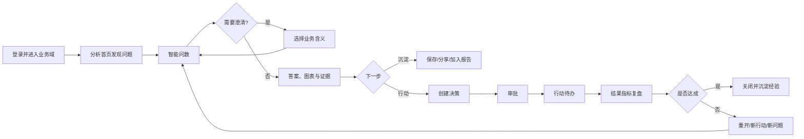

# 智能分析决策平台——前端用户旅程与操作流程基线

> 文档状态：前端信息架构、页面设计、交互设计与 E2E 验收的当前基线
> 版本：V1.0
> 基准日期：2026-08-10
> 适用对象：产品经理、UX/UI 设计师、业务 Owner、前端、后端、测试
> 上游范围：[功能模块与业务闭环审视](./智能分析决策平台_功能模块与业务闭环审视.md)
> 实施任务：[ASK_DATA_CODEX_TODO.md](./ASK_DATA_CODEX_TODO.md)

---

## 1. 文档目标

本文把 P01～P15 的模块级业务流程继续拆到可直接设计页面的操作级用户旅程。页面设计不能只覆盖“理想主路径”，每条旅程必须明确：

1. 谁在什么条件下进入。
2. 从哪个页面、通知、资产或深链接进入。
3. 用户依次看到什么、输入什么、确认什么。
4. 系统在同步、异步、成功、部分成功和失败时如何反馈。
5. 权限、版本、口径或数据发生变化时如何恢复。
6. 操作何时结束，产物在哪里，下一步是什么。
7. 哪个角色接棒，是否形成待办或通知。
8. 当前是已有真实能力、部分接线还是待建能力。

本文是“旅程与操作责任”基线，不是视觉风格稿。本文提出的目标路由用于固定信息架构和页面边界，最终 URL 可在前端设计评审时微调，但不得丢失对应旅程。

## 2. 完整旅程的验收口径

### 2.1 一条旅程何时算完整

每个旅程编号必须在需求、设计稿和 E2E 中回答以下问题：

| 维度 | 必须交付的内容 |
|---|---|
| 角色 | 发起人、处理人、审批人、Owner 和只读查看者 |
| 入口 | 主导航、列表、详情、通知、待办、分享链接或跨模块动作 |
| 前置条件 | 当前租户/领域、对象状态、权限、版本和必要依赖 |
| 主操作 | 页面、抽屉、弹窗、表单、按钮和确认顺序 |
| 系统反馈 | 加载、保存、异步进度、结果、审计号和下一步 |
| 异常恢复 | 校验失败、409 冲突、403、失效、超时、断线、部分成功和重试 |
| 终态 | 成功、拒绝、撤回、取消、失败关闭、下架、回滚或归档 |
| 下游 | 资产、待办、通知、报告、决策、工单或运营指标 |

只有一张“正常状态页面”不算完成；按钮出现但没有真实结果页、进度页或失败恢复也不算完成。

### 2.2 实现状态标识

| 标识 | 含义 |
|---|---|
| `REAL` | 当前页面与真实 API 已形成主要操作链 |
| `PARTIAL` | 有页面或 API，但仍有静态数据、提示性动作或缺少关键分支 |
| `BE-ONLY` | 后端能力存在，尚无业务前端 |
| `NEW` | 前后端均需新增或当前模块尚不存在 |
| `BIZ-GATE` | 软件可建设，但角色、SLA、口径或生产结论需要业务确认 |

## 3. 角色与工作目标

一个用户可同时拥有多个角色，页面按当前领域和服务端 `allowedActions` 组合展示能力。

| 角色 ID | 角色 | 主要工作目标 |
|---|---|---|
| R01 | 业务用户 | 问数、查看报告、保存/共享分析、提出反馈或取数申请 |
| R02 | 业务分析师/报告作者 | 深入分析、制作和发布报告、沉淀分析资产 |
| R03 | 业务域 Owner/审批人 | 审批领域、语义、报告或决策，处理影响与风险 |
| R04 | 领域管理员 | 管理领域成员、权限、Owner 和领域级治理配置 |
| R05 | 数据 Owner/数据配置人 | 接入数据源、维护数据资产和处理结构变化 |
| R06 | 数据开发/数据集 Owner | 建模、预览、发布、物化、回滚和下架数据集 |
| R07 | 语义/指标/维度 Owner | 建设语义模型、指标、维度、词典和 Release |
| R08 | 评测/反馈运营人员 | 管理黄金集、反馈工单、主动学习和发布质量 |
| R09 | 平台/安全/运维管理员 | 管理平台、配额、成本、告警、容量和灾备 |
| R10 | 决策 Owner/行动负责人/复盘人 | 审批决策、执行行动、处理阻塞并复盘效果 |

## 4. 目标信息架构与页面责任

### 4.1 一级导航

业务用户的一级导航固定为：

```text
分析首页 / 智能问数 / 智能报告 / 决策跟踪 / 我的资产 / 我的待办
```

具有治理权限的用户额外看到二级工作台：

```text
治理与配置
  ├─ 数据源与数据资产
  ├─ 数据集与物化
  ├─ 语义中心
  ├─ 发布与评测
  ├─ 反馈运营
  ├─ 观测、配额与成本
  └─ 平台管理
```

全局顶栏提供当前领域、通知、帮助和用户菜单。领域切换是全局上下文变化，不是普通筛选器。

### 4.2 页面与目标路由清单

| 页面组 | 目标路由示例 | 页面责任 | 当前状态 |
|---|---|---|---|
| 登录/注册 | `/login` | 登录、注册、会话失效说明 | `REAL` |
| 领域选择/申请 | `/domain-access` | 进入领域、申请加入、处理领域申请 | `REAL` |
| 分析首页 | `/home` | 最近分析、关注报告、决策、待办和快捷入口 | `NEW` |
| 智能问数 | `/ask-data`、`/ask-data/conversations/:id` | 新问题、真实历史、澄清、结果和跨模块动作 | `PARTIAL` |
| 报告资产中心 | `/reports` | 搜索、分类、权限、生命周期和新建入口 | `PARTIAL` |
| 报告创建/设计 | `/reports/new`、`/reports/:id/edit` | 模板、AI 计划、画布、绑定、预览和发布 | `BE-ONLY` |
| 报告查看 | `/reports/:id/view` | 真实组件运行、筛选、导出、分享和订阅 | `PARTIAL` |
| 报告版本/任务 | `/reports/:id/versions`、`/reports/:id/jobs` | 版本、回滚、导出和调度历史 | `BE-ONLY/NEW` |
| 决策中心 | `/decisions`、`/decisions/:id` | 决策、审批、行动和结果复盘 | `NEW` |
| 我的资产 | `/my-assets` | 保存问题、报告、决策的统一受权读模型 | `NEW` |
| 我的待办 | `/tasks` | 跨模块审批、处理和通知 | `NEW` |
| 数据源/资产 | `/governance/data-sources/*` | 接入、测试、审批、元数据和影响处置 | `REAL/PARTIAL` |
| 数据集 | `/governance/datasets/*` | 建模、预览、发布、物化和版本 | `REAL` |
| 语义中心 | `/governance/semantic/*` | 模型、指标、维度、词典、KPI 和导入 | `BE-ONLY` |
| 发布与评测 | `/governance/releases/*` | Readiness、投影、评测、审批和激活 | `BE-ONLY` |
| 反馈运营 | `/operations/feedback/*` | 工单、归因、主动学习和闭环指标 | `BE-ONLY` |
| 观测与成本 | `/operations/observability/*` | 运行、质量、配额、成本、事件和演练 | `BE-ONLY` |
| 平台管理 | `/platform-management/*` | 领域、用户、权限、审批和审计 | `REAL/PARTIAL` |

当前 `web/src/app/App.tsx` 只有登录、领域、平台管理、数据源、数据集、问数、报告资产和报告运行路由。上表其余页面均是设计目标，不得在设计评审中误标为已实现。

## 5. 全局交互规则

### 5.1 所有页面必须设计的状态

| 状态 | 前端责任 |
|---|---|
| 首次加载 | 使用骨架或明确加载区，保留页面框架，防止重复提交 |
| 首次空态 | 解释为什么为空，并提供当前角色可执行的唯一主行动 |
| 筛选无结果 | 保留筛选条件，提供清除或修改筛选，不等同于首次空态 |
| 保存中 | 锁定重复写操作，允许继续阅读，离开前提示未完成 |
| 异步处理中 | 显示任务 ID、阶段、进度、开始时间、取消条件和后台继续说明 |
| 成功 | 显示产物、状态、审计/版本信息和下一步，不只弹 Toast |
| 表单校验失败 | 字段就地错误 + 页级摘要，焦点跳到首个错误 |
| 409 版本冲突 | 提供刷新最新、查看差异、重放安全操作或放弃，禁止强制覆盖 |
| 403 无权限 | 解释缺少的能力和申请路径，不泄漏无权对象标题或数据值 |
| 404/已下架 | 区分不存在、已下架和无权；提供返回资产中心 |
| 部分成功/降级 | 显示成功和失败部分、影响、可用动作和重试范围 |
| 数据/口径漂移 | 展示旧版本与当前版本差异，要求显式确认是否重放 |
| 网络断开 | 保留未提交输入；可重连的运行按事件游标继续 |
| 可重试失败 | 显示安全错误码、影响范围和重试按钮，不重复产生写入 |
| 不可重试失败 | 失败关闭，提供反馈、申请、返回或联系 Owner 的出口 |
| 危险操作 | 展示对象、影响、原因字段和不可逆部分，二次确认后执行 |

### 5.2 通用操作模式

| 操作 | 统一规则 |
|---|---|
| 新建 | 先创建草稿或进入向导；未成功创建前不进入“已完成”页面 |
| 保存草稿 | 返回版本号和保存时间；有未保存改动时阻止无提示离开 |
| 提交审批 | 先做可本地完成的校验，再展示审批人、影响和说明 |
| 撤回 | 只允许发起人在待审状态执行，必须说明撤回后的可编辑状态 |
| 通过/驳回 | 审批人看到版本、差异、证据和风险；驳回原因必填 |
| 发布/激活 | 展示不可变版本、门禁和下游影响，成功后跳转发布结果 |
| 回滚 | 不改写历史；明确是切回旧版本还是复制旧版本为新草稿 |
| 下架/归档 | 展示引用、分享、调度和 Owner 转交影响；原因必填 |
| 恢复/上架 | 重新校验权限、依赖和版本，不能无条件恢复旧状态 |
| 分享 | 选择受权主体、权限和有效期；链接只定位，不提权 |
| 导出 | 显示格式、范围、数据时点和敏感说明；大任务进入任务中心 |
| 删除 | 只删除允许删除的草稿；已发布资产采用下架或废弃 |
| 取消异步任务 | 显示是否可取消、已产生的中间结果和最终取消状态 |

### 5.3 权限展示规则

- 导航按角色隐藏无关治理入口，但无权深链接仍必须返回受控 403 页面。
- 对象操作以服务端 `allowedActions` 为准；前端不根据角色名自行推导。
- 不可执行但有解释价值的动作可禁用并说明原因；会泄漏对象存在性的动作直接隐藏。
- 审批人不能在同一操作中伪装成申请人；双人审批必须显示“仍需另一位审批人”。
- 领域切换后清理领域内缓存、关闭不再适用的弹窗并重新加载当前路由；编辑态先提示未保存内容。

## 6. P01～P15 操作级用户旅程

以下“操作链”中的每个箭头都是一个必须在页面设计中有明确承载的用户触点、系统状态或跨角色交接。

| 模块 | 旅程数 | 主要页面组 |
|---|---:|---|
| P01 平台、组织、租户和权限 | 10 | 登录、领域、用户、权限、资产转交 |
| P02 数据源、元数据和数据资产 | 7 | 数据源、审批、同步任务、资产和差异 |
| P03 数仓与数据集建模 | 8 | 数据集列表、画布、预览、发布、物化和版本 |
| P04 语义模型与实体 | 5 | 模型列表、编辑、评审、差异和废弃 |
| P05 指标与度量中心 | 5 | 指标列表、公式、口径确认、认证和影响 |
| P06 维度、成员和层级中心 | 5 | 维度、画像、成员、层级和索引 |
| P07 词典、认证问法和 KPI Bundle | 5 | 词典、问法、KPI、导入和候选 |
| P08 语义发布、评测和审批 | 7 | Readiness、Release、投影、评测、审批和灰度 |
| P09 分析入口与智能问数工作台 | 8 | 首页、问数、进度、澄清、历史和申请 |
| P10 查询结果、证据和追问 | 9 | 答案、视图、证据、导出、资产动作和反馈 |
| P11 智能报告设计器与运行时 | 17 | 资产、模板、创建、设计、运行、版本、分发和生命周期 |
| P12 问数与报告资产融合 | 5 | 加入报告、报告追问、认证、撤销和升级 |
| P13 反馈、主动学习和运营 | 6 | 反馈、工单、修复、回归、候选和指标 |
| P14 系统管理、监控和成本治理 | 7 | 运行配置、配额、观测、事件、灾备、容量和审计 |
| P15 决策协同与行动复盘 | 9 | 决策、审批、行动、阻塞、复盘和历史证据 |
| **合计** | **113** | 覆盖 P01～P15 |

### P01 平台、组织、租户和权限

| 旅程 | 角色与触发 | 操作链 | 异常与恢复 | 终态/下游 | 状态 |
|---|---|---|---|---|---|
| J-P01-01 登录/注册 | R01；首次或会话失效 | 打开登录页 → 切换登录/注册 → 填写凭据 → 提交 → 获取个人与领域状态 → 有领域进入首页，无领域进入领域页 | 凭据错误保留账号；账号停用说明联系入口；刷新失败不重复注册；会话失效保存原目标 URL | 已登录并进入正确后续页 | `REAL` |
| J-P01-02 进入已有领域 | R01；登录后 | 领域页加载可进入领域 → 查看名称/说明/角色 → 点击进入 → 切换领域 Token → 清缓存 → 进入来源页或首页 | 领域已停用/权限刚撤销时刷新列表；无可用领域引导申请 | 当前领域固定 | `REAL` |
| J-P01-03 申请领域权限 | R01；无权限 | 浏览领域目录 → 选择领域 → 填用途/期限 → 提交 → 查看等待审批状态 → 接收结果通知 | 重复申请合并；申请被拒显示原因和重新申请条件；可撤回时提供撤回 | `PENDING/APPROVED/REJECTED/WITHDRAWN` | `PARTIAL` |
| J-P01-04 审批领域申请 | R03/R04；待办进入 | 我的待办 → 打开申请 → 查看申请人/用途/敏感级/已有权限 → 通过或驳回 → 必要时安全会签 → 通知申请人 | 已被他人处理显示最新状态；最后审批权限变更需重新校验 | 权限生效或申请关闭 | `PARTIAL` |
| J-P01-05 切换业务领域 | 已有多域用户 | 顶栏打开领域菜单 → 选择目标 → 检查未保存编辑 → 确认 → 重新签发上下文 → 重载当前功能或回首页 | 目标域不可用时保留原域；切换失败不得清掉可用会话；编辑态可取消切换 | 新领域成为全局上下文 | `REAL` |
| J-P01-06 管理领域和管理员 | R09；平台管理 | 新建领域 → 设置编码/说明/管理员 → 启用 → 编辑管理员 → 停用前看影响 → 确认停用 | 编码冲突、无管理员、最后管理员移除均阻断；有未转交资产时不能停用 | 领域可用、停用或等待处置 | `REAL/PARTIAL` |
| J-P01-07 管理用户、角色和领域成员 | R04/R09；用户管理 | 搜索用户 → 打开详情 → 启用/停用 → 设置平台管理员 → 添加/移除领域成员 → 查看生效权限 → 保存并审计 | 不能移除最后管理员；操作者不能授予自己不拥有的能力；领域内仍有 Owner 责任时先转交 | 用户和领域成员关系生效 | `REAL/PARTIAL` |
| J-P01-08 管理对象访问范围 | 资产 Owner/R04 | 资产详情权限入口 → 查看当前可见范围和共享主体 → 添加/移除用户、角色或领域范围 → 预览受影响人数 → 保存 | 最后一位 Owner/编辑者保护；跨域共享需符合对象策略；版本冲突刷新 | 对象权限生效并通知受影响人 | `REAL/PARTIAL` |
| J-P01-09 用户停用与资产转交 | R04/R09；组织变化 | 用户详情 → 查看角色/领域/拥有资产/待办 → 选择接收 Owner → 预览影响 → 停用 → 终止会话 → 通知接收人 | 无合格接收人时阻断；并发资产变化要求刷新差异 | 用户停用且无孤儿资产 | `PARTIAL/NEW` |
| J-P01-10 退出与会话恢复 | 任意登录用户 | 用户菜单退出 → 确认未保存内容 → 撤销会话 → 回登录；Token 过期时刷新成功继续，失败则保存目标地址后登录 | 运行中任务后台继续并在重新登录后可见；敏感编辑内容不写本地明文 | 安全退出或恢复会话 | `REAL/PARTIAL` |

### P02 数据源、元数据和数据资产

| 旅程 | 角色与触发 | 操作链 | 异常与恢复 | 终态/下游 | 状态 |
|---|---|---|---|---|---|
| J-P02-01 新建数据源 | R05；治理入口 | 数据源列表 → 新建/AI 助手 → 选择数据库或文件 → 填名称、编码、连接、Owner、共享和敏感策略 → 保存草稿 → 测试连接/检查文件 | 编码或连接冲突就地提示；凭据只显示是否已配置；文件解析失败可替换文件 | 可测试的数据源草稿 | `REAL` |
| J-P02-02 修改配置/轮换凭据 | R05；详情页 | 进入配置 → 查看当前版本 → 修改非敏感配置或替换凭据 → 保存 → 重新测试 → 查看新测试收据 | 待审状态先撤回；版本冲突看差异后重载；测试结果因配置变化自动失效 | 新版本通过测试或保持草稿 | `REAL` |
| J-P02-03 提交、撤回和审批发布 | R05 发起，R03 审批 | 测试通过 → 提交发布 → 查看固定版本和审批状态 → 发起人可撤回 → 审批人从待办查看测试/用途/风险 → 通过或驳回 | 测试过期、配置变化、重复提交阻断；驳回原因必填；状态被处理返回最新版本 | 已发布、已驳回或已撤回 | `REAL` |
| J-P02-04 发现并导入元数据 | R05；发布后 | 详情选择发现表 → 筛选/勾选表 → 选择样本策略 → 提交后台任务 → 任务中心看阶段/数量/失败项 → 进入资产目录 | 已有活动任务时跳转该任务；部分失败允许仅重试失败表；越权样本策略降级 | 表/字段资产已创建并带同步收据 | `REAL/PARTIAL` |
| J-P02-05 完善数据资产 | R05；资产待完善 | 资产列表筛选未完善 → 打开详情 → 查看字段和有界预览 → 编辑业务名、描述、标签、敏感级、Owner → 审阅 AI 建议 → 接受/修改/拒绝 → 保存 | 预览不可用不阻断元数据编辑；敏感级下调要求审批；409 显示差异 | 可交付 P03 的数据资产 | `REAL/PARTIAL` |
| J-P02-06 处理结构差异 | R05/R06；同步告警 | 通知/资产详情 → 查看新增、删除、类型变化 → 查看下游数据集/指标/报告影响 → 逐项标记兼容、迁移或阻断 → 重跑同步 | 破坏性变化未处置时下游标记 STALE；无权下游只显示受控数量和 Owner | 差异关闭或进入迁移待办 | `PARTIAL` |
| J-P02-07 下架数据源 | R05/R03；不再使用 | 详情选择下架 → 查看数据集、任务、语义和报告影响 → 指定迁移/终止方案 → 填原因 → 审批 → 停止刷新并撤销凭据 | 仍有 ACTIVE 下游时阻断；紧急撤权进入事件流程并显示影响 | 已安全下架且无新读取 | `PARTIAL` |

### P03 数仓与数据集建模

| 旅程 | 角色与触发 | 操作链 | 异常与恢复 | 终态/下游 | 状态 |
|---|---|---|---|---|---|
| J-P03-01 创建数据集 | R06；列表页 | 新建 → 选择空白/AI 方案/复制 → 填层级、粒度、Owner、刷新策略 → 选择已发布资产 → 创建草稿 → 进入画布 | 无可用资产引导 P02；AI 失败保留人工创建；复制需重新校验权限 | 数据集草稿和首个修订 | `REAL` |
| J-P03-02 画布建模 | R06；编辑页 | 拖入数据、关联、过滤、字段处理、分组、结束节点 → 连接 → 打开配置抽屉 → 配置字段/条件/Join/聚合 → 完成并显示局部校验 | 成环、无输入、字段丢失、Join 不安全就地标红；关闭抽屉不丢已确认配置 | 可验证的 Dataset DSL 草稿 | `REAL` |
| J-P03-03 节点和全链预览 | R06；画布 | 选择节点 → 预览上游 5 行 → 切换最终预览 → 查看 SQL 摘要/扫描/粒度/质量 → 刷新 | 预览超时可取消重试；敏感字段遮罩；无权限来源指出具体节点 | 预览收据或可定位错误 | `REAL` |
| J-P03-04 保存与并发冲突 | R06；编辑中 | 保存草稿 → 服务端校验 → 返回修订号/时间 → 继续编辑；离开时提示未保存 | 409 展示他人变更摘要，允许打开最新、复制本地方案或放弃；不得强制覆盖 | 新修订已保存 | `REAL` |
| J-P03-05 发布审批 | R06 发起，R03 审批 | 发布前检查 → 修复问题 → 提交固定修订 → 待办审批 → 审批人看差异、预览、粒度和成本 → 通过/驳回 | 校验失败定位节点；审批状态变化要求刷新；驳回回到可编辑草稿 | 不可变发布版本或驳回 | `REAL` |
| J-P03-06 物化运行 | R06/R09；发布后或计划触发 | 创建运行 → 查看排队/编译/执行/质量阶段 → 查看日志摘要和数据快照 → 可取消 → 失败重试 → 成功刷新下游可用性 | 活动运行去重；取消显示已完成部分；质量失败不切换可用快照 | 可用快照或失败关闭 | `REAL` |
| J-P03-07 版本与回滚 | R06；版本页 | 浏览修订/发布版本 → 比较差异 → 选择历史发布版 → 预览影响 → 确认复制为新草稿 → 修改/重新发布 | 历史依赖无权只显示摘要；当前已一致则禁用；回滚不修改历史 | 新草稿修订 | `REAL` |
| J-P03-08 停用、恢复和删除草稿 | R06/R03 | 详情更多操作 → 查看依赖 → 停用/恢复；从未发布且无引用草稿可删除 | 有 ACTIVE 语义依赖时阻断；恢复前重做源可用性检查 | DISABLED/ACTIVE 或草稿已删除 | `REAL/PARTIAL` |

### P04 语义模型与实体

| 旅程 | 角色与触发 | 操作链 | 异常与恢复 | 终态/下游 | 状态 |
|---|---|---|---|---|---|
| J-P04-01 创建语义模型 | R07；语义中心 | 模型列表 → 新建/从数据集发现 → 选择 DWS/ADS → 填实体、粒度、主键、Owner、时间合同 → 保存 DRAFT | 数据集未发布、无主键或无 Owner 阻断；自动发现只生成建议 | 模型草稿 | `BE-ONLY` |
| J-P04-02 映射字段与关系 | R07 | 模型编辑 → 映射稳定字段 → 新建实体关系 → 选择基数、有效期和 Join 策略 → 保存 → 图形化预览路径 | 多对多无安全策略、粒度冲突、循环关系标红；可保存未完成草稿但不能提交 | 可校验模型版本 | `BE-ONLY` |
| J-P04-03 校验与业务评审 | R07 发起，R05/R03 评审 | 点击校验 → 按引用/粒度/Fanout/时间/权限分组问题 → 修复 → 提交评审 → 两类 Owner 查看映射和业务定义 → 通过/退回 | 评审版本固定；任一映射变化使旧评审失效 | 可进入 Release 的认证草稿 | `BE-ONLY` |
| J-P04-04 版本差异与影响 | R07；上游变化/编辑 | 打开版本 → 比较字段、实体、关系 → 查看指标/维度/报告/保存问题影响 → 选择迁移、兼容或保留旧版 → 创建新草稿 | 无权对象只显示数量与 Owner；未处理高风险影响不能进入 Release | 影响方案已记录 | `BE-ONLY` |
| J-P04-05 废弃模型版本 | R07/R03 | 选择废弃 → 查看替代模型和引用 → 配置替代/终止理由 → 审批 → 标记 DEPRECATED/RETAINED | 被发布版本或历史证据引用时不能物理删除 | 受控废弃并保留历史 | `BE-ONLY` |

### P05 指标与度量中心

| 旅程 | 角色与触发 | 操作链 | 异常与恢复 | 终态/下游 | 状态 |
|---|---|---|---|---|---|
| J-P05-01 新建/导入指标 | R07；指标中心 | 新建、从建议创建或下载模板批量导入 → 填名称、定义、Owner、模型 → 保存 → 查看行级导入报告 | 重名/别名冲突定位对象；导入部分失败只提交有效草稿，失败行可下载修改 | 指标草稿或导入批次 | `BE-ONLY` |
| J-P05-02 定义计算与口径 | R07 | 公式编辑器选择受权度量/运算 → 定义粒度、单位、币种、默认过滤、空值/除零 → 实时语法检查 → 保存 | Formula DAG 成环、类型/单位不兼容时定位表达式；不接受 Raw SQL | 可编译公式草稿 | `BE-ONLY` |
| J-P05-03 确认可加性和时间 | 指标 Owner | 待办进入 → 查看系统建议和样例 → 选择可加/半可加/不可加、禁用维度、时间聚合和默认周期 → 确认 | 未确认不可进入首个 Release；修改建议必须写理由 | Additivity/Time 合同已确认 | `BE-ONLY` |
| J-P05-04 样例验证与认证 | R07/R03 | 配置正反例和预期值 → 运行样例 → 查看编译、结果、单位和误差 → 修复 → 提交指标/数据 Owner 审批 | 无数据、质量失败与口径错误分开展示；审批版本变化失效 | 认证指标草稿 | `BE-ONLY` |
| J-P05-05 指标变更与废弃 | 指标 Owner | 从当前版本新建草稿 → 查看定义/Formula/时间/可加性差异 → 查看报告、保存问题、决策影响 → 配置替代 → 发布后通知下游 | 破坏性变化需显式升级；历史证据不被改写 | 新版本生效或旧版本受控保留 | `BE-ONLY` |

### P06 维度、成员和层级中心

| 旅程 | 角色与触发 | 操作链 | 异常与恢复 | 终态/下游 | 状态 |
|---|---|---|---|---|---|
| J-P06-01 创建维度并画像 | R07；维度中心 | 从字段发现/新建 → 定义稳定键、显示字段、角色、Owner → 运行有界画像 → 查看基数、空值、变化和样例 | 画像超预算降级为抽样；敏感样例遮罩；无稳定键阻断提交 | 维度草稿和画像收据 | `BE-ONLY` |
| J-P06-02 选择成员策略 | 维度/安全 Owner | 查看基数/敏感级 → 选择 FULL、ON_DEMAND、EXACT_ONLY 或 NONE → 预览成本与可搜索性 → 确认 | 高基数/敏感维度禁用不安全策略；策略变化显示索引重建影响 | 成员策略已确认 | `BE-ONLY` |
| J-P06-03 管理成员与别名 | R07 | 搜索成员 → 打开详情 → 编辑显示名、别名、负向上下文、有效期 → 批量处理候选 → 保存 | 别名冲突进入 Owner 裁定；无权敏感成员不得出现在搜索建议 | 可发布成员版本 | `BE-ONLY` |
| J-P06-04 管理层级 | R07 | 层级页新建层级 → 拖拽/选择父子 → 校验覆盖和有效期 → 预览钻取 → 保存 | 成环、跳级、孤儿和跨维度关系阻断；批量变更可回滚草稿 | 有效层级草稿 | `BE-ONLY` |
| J-P06-05 索引、降级与增量成员 | R07/R08 | 发布后看索引状态 → 查看新成员/未命中 → 审批增量 → 基数越界时接受降级或调整策略 → 重建索引 | 图/词法/向量不一致时 Release 失败；重建期间旧索引继续服务或明确阻断 | 索引 READY 或受控降级 | `BE-ONLY` |

### P07 业务词典、认证问法和 KPI Bundle

| 旅程 | 角色与触发 | 操作链 | 异常与恢复 | 终态/下游 | 状态 |
|---|---|---|---|---|---|
| J-P07-01 维护业务词典 | R07/R03 | 词典列表 → 新建术语/缩写/同义词 → 绑定稳定语义 ID → 填正负上下文和适用域 → 冲突检查 → 保存/提交 | 同优先级冲突并列对比，由 Owner 裁定；跨域词条不能误入当前域 | 认证或被拒词条 | `BE-ONLY` |
| J-P07-02 维护认证问法 | R07/R08 | 从历史问题/报告种子创建 → 编辑标准问题 → 绑定预期 Intent/IR/结果规则 → 回放 → Owner 审批 | 结果或绑定不等价时展示失败层；用户原文不得直接变生产事实 | 认证问法版本 | `BE-ONLY` |
| J-P07-03 配置 KPI Bundle | R03/R07 | 新建 Bundle → 选择指标顺序、默认时间、并发上限、降级行为 → 预览宽泛问题回答 → 运行回归 → 审批 | 指标无权/不兼容/超并发显示替代；部分结果需显式 PARTIAL | 可发布 KPI Bundle | `BE-ONLY` |
| J-P07-04 批量导入/导出 | R07 | 下载当前域模板 → 上传 → 后台校验 → 查看行列错误 → 下载错误文件 → 提交有效行 DRAFT → 可撤回批次 | 已进入 Release 的行不能撤回并列原因；重复上传按文件 Hash 提示 | 可追溯导入批次 | `BE-ONLY` |
| J-P07-05 主动学习转资产 | R08/R07 | 主动学习列表 → 查看聚类、次数、用户数和失败证据 → 接受为词条/问法/KPI 候选或拒绝 → 进入对应草稿 → 回归/发布 | 敏感原文遮罩；候选被处理或重复时刷新最新状态 | 候选关闭并链接资产/理由 | `BE-ONLY` |

### P08 语义发布、评测和审批

| 旅程 | 角色与触发 | 操作链 | 异常与恢复 | 终态/下游 | 状态 |
|---|---|---|---|---|---|
| J-P08-01 查看领域 Readiness | R07/R03 | 发布中心 → 选择领域 → 查看模型、指标、维度、可加性、时间、Owner 和评测准备度 → 点击问题跳源对象 | 数字从服务端事实读取；无权问题只显示负责 Owner | 可创建 Release 或明确阻塞项 | `BE-ONLY` |
| J-P08-02 创建 Release Candidate | R07 | 选择精确草稿版本 → 查看新增/修改/废弃摘要 → 生成内容 Hash → 确认创建 | 草稿已变或引用不闭包时重新选择；创建后对象版本不可偷换 | DRAFT Release | `BE-ONLY` |
| J-P08-03 校验与投影 | R07 | 点击校验/投影 → 查看静态校验、搜索投影、图投影阶段 → 展开错误 → 回源修复后新建/重试候选 | 部分投影失败可清理后重试；Hash 不一致失败关闭 | READY 或 FAILED Release | `BE-ONLY` |
| J-P08-04 运行评测与门禁 | R08 | 选择验证/密封/安全集 → 创建批次 → 查看进度和结果分层 → 记录错误预算 → 重算 Wilson 门禁 → 生成评审摘要 | 密封正文不可显示；任务失败可重试且保留原收据；无事实不能过门禁 | 通过/未通过的门禁收据 | `BE-ONLY/BIZ-GATE` |
| J-P08-05 双人审批与激活 | R03；待办进入 | 第一审批人看版本/影响/门禁 → 通过/驳回 → 第二独立审批人复核 → 有权限用户激活 → 查看 ACTIVE 切换结果 | 同人双签禁用；门禁/投影变化使审批失效；并发激活显示最新 ACTIVE | ACTIVE、REJECTED 或保持 READY | `BE-ONLY/BIZ-GATE` |
| J-P08-06 Shadow/Canary 与回滚 | R08/R09 | 激活后看 Shadow/Canary 指标 → 调整受控流量 → 告警时暂停 → 比较旧/新版本 → 回滚 → 通知受影响 Owner | 安全回归立即停止；回滚失败进入事件流程，不允许继续扩量 | 新版扩大、暂停或旧版恢复 | `BE-ONLY/BIZ-GATE` |
| J-P08-07 Release 保留/退役 | R07/R09 | 查看历史 Release 及引用 → 选择 RETAIN/RETIRE → 查看报告/保存问题/决策证据 → 确认 | 被引用 Release 只能 RETAINED；无引用且满足保留期才可退役 | 历史可回放且投影已处理 | `BE-ONLY` |

### P09 分析入口与智能问数工作台

| 旅程 | 角色与触发 | 操作链 | 异常与恢复 | 终态/下游 | 状态 |
|---|---|---|---|---|---|
| J-P09-01 从分析首页开始 | R01/R02 | 登录进入首页 → 查看最近问题、关注报告、待办、决策和快捷问题 → 选择卡片或“开始问数” | 某模块失败局部降级；无个人数据用真实空态，不展示伪造 KPI | 进入问数、报告、决策或待办 | `NEW` |
| J-P09-02 发起问题 | R01/R02 | 问数页确认锁定领域 → 输入问题/选择认证问题/打开保存问题 → 查看输入建议 → 提交 → 立即生成 Run 和会话 | 空问题、超长、违禁或无 Release 就地阻断；幂等重放不创建重复 Run | RUNNING 会话 | `REAL/PARTIAL` |
| J-P09-03 查看进度、取消与断线恢复 | 提问人 | 纵向时间线显示理解/检索/绑定/编译/执行/验证 → 可取消 → 关闭页面后后台继续 → 返回会话按事件游标恢复 | SSE 断开自动重连；取消竞态显示真实终态；预算耗尽返回已有可信证据或失败关闭 | 终态或等待澄清 | `REAL/PARTIAL` |
| J-P09-04 处理澄清 | 提问人 | 系统展示局部歧义 → 查看候选定义、Owner、版本、证据 → 单选候选 → 提交 → 同一 Run 继续；也可取消 | 候选失效时刷新；超时后从历史恢复或重新发起；不可一次询问多个无关问题 | Run 继续或 CANCELED | `REAL` |
| J-P09-05 接收不同结果 | 提问人 | 对 ANSWER/PARTIAL/NO_DATA/OUT_OF_SCOPE/FAILED 显示不同结果区 → 阅读原因和可执行下一步 | PARTIAL 不显示为完整成功；NO_DATA 提供修改条件；不可重试失败提供反馈/申请 | 已回答、拒答或失败关闭 | `REAL/PARTIAL` |
| J-P09-06 追问与 Release 漂移 | R01/R02 | 在答案下输入追问 → 显示继承的已认证上下文 → 若 Release 漂移，查看差异 → 选择按新口径继续或仅看历史 | 旧绑定不可静默升级；无权对象从上下文移除并提示 | 新子 Run 或保持历史 | `REAL` |
| J-P09-07 会话历史管理 | R01/R02 | 左侧真实会话分页 → 搜索 → 按日期/状态过滤 → 打开恢复 → 置顶/改名/归档 → 清除筛选 | 已下架证据仍显示受控历史状态；无权会话不返回；归档可在筛选中恢复 | 可管理的真实会话资产 | `NEW` |
| J-P09-08 配额与超范围转取数 | R01 | 配额提示查看剩余/恢复时间 → 超限时申请额度或改走低成本路径；明细超范围时打开取数申请 → 预填已绑定上下文 → 保存/提交 | 不允许把客户端对象 ID 当可信绑定；字段无权时移除并说明 | 申请已创建或问题安全结束 | `REAL/PARTIAL` |

### P10 查询结果、证据和追问

| 旅程 | 角色与触发 | 操作链 | 异常与恢复 | 终态/下游 | 状态 |
|---|---|---|---|---|---|
| J-P10-01 阅读答案摘要 | R01/R02 | 结果首屏查看结论、核心数字、时间、单位、比较、数据时点和降级标识 → 展开说明 | 叙述失败只显示结构化答案；校验失败不得闪现未验证文本 | 用户理解当前可信结论 | `REAL` |
| J-P10-02 切换图表/表格与分页 | R01/R02 | 在允许视图间切换 → 看 TopN/Other/合计/不可加提示 → 表格分页/排序 → 查看明细 | 禁止不适用图表；大结果只返回分页；前端导出当前页须明确范围 | 当前视图状态可分享/导出 | `REAL/PARTIAL` |
| J-P10-03 查看证据 | 分析师/审核人 | 打开证据面板 → 查看理解、指标口径、维度、时间、图路径、质量、新鲜度、权限和 Hash → 跳转受权资产 | 无权资产只显示受控摘要；历史 Release 可查看但标明非当前 | 证据已核对 | `REAL` |
| J-P10-04 导出问数结果 | R01/R02 | 选择 CSV/XLSX/图片 → 选择当前页/允许范围 → 确认时间、数据时点和敏感说明 → 创建任务 → 查看进度 → 下载 | 大结果异步；过期可按当前权限重建；失败可重试且不重复计费 | 可追溯导出文件 | `PARTIAL` |
| J-P10-05 保存、收藏、打开、分享和归档问题 | R01/R02 | 点击保存/收藏 → 填标题/标签 → 固定 Question+IR+Release → 在我的资产查看 → 取消/恢复收藏 → 打开时按当前权限重执行 → 共享团队/撤销 → 归档 | Release 漂移需确认；无权分享对象隐藏；收藏只影响个人组织；归档不删除历史 | Saved Question 资产 | `BE-ONLY` |
| J-P10-06 加入报告 | R02；已验证答案 | 点击加入报告 → 进入 J-P12-01 → 完成后显示报告/修订链接 | PARTIAL、无 Artifact 或跨域时禁用并说明 | 报告新修订或取消 | `BE-ONLY` |
| J-P10-07 创建决策 | R01/R02/R10；已验证答案 | 点击创建决策 → 预览将固定的证据 → 选择新建/加入已有决策 → 进入决策草稿 | 降级叙述不能伪装证据；无决策权限提供申请入口 | 决策草稿和证据引用 | `NEW` |
| J-P10-08 提交反馈 | R01/R02 | 选择“结果不对/口径不清/数据异常/体验问题” → 填期望与说明 → 预览固定证据摘要 → 提交 → 获得工单号 | 重复反馈合并并显示已有工单；敏感值自动遮罩 | 反馈工单已创建 | `REAL/PARTIAL` |
| J-P10-09 创建和跟踪取数申请 | R01 | 从结果或主动入口打开 → 选业务目的、字段、敏感级、交付方式 → 保存草稿/提交 → 在我的申请看审批、处理、交付 → 下载/关闭 | 安全会签、驳回、补充材料、过期导出和重新提交都有状态 | DELIVERED/CLOSED/REJECTED | `REAL/PARTIAL` |

### P11 配置化智能报告设计器与运行时

| 旅程 | 角色与触发 | 操作链 | 异常与恢复 | 终态/下游 | 状态 |
|---|---|---|---|---|---|
| J-P11-01 浏览报告资产 | R01/R02 | 报告中心 → 按全部/我的/共享、生命周期、标签搜索 → 加载更多 → 打开详情/查看/编辑 | 首次空态与筛选空态分开；无权资产不出现；列表局部重试 | 选中报告或进入新建 | `PARTIAL` |
| J-P11-02 创建报告 | R02 | 新建 → 选择空白、模板、问数结果、复制已有 → 填名称、Owner、主题、受众、频率 → 创建草稿 | 模板不可用或来源无权时返回选择页；复制重新校验数据绑定 | 报告草稿 | `BE-ONLY` |
| J-P11-03 AI 结构计划 | R02 | 描述目标 → 选择受众/周期/可用资产 → 生成结构计划 → 查看页/章节/组件建议和风险 → 修改 → 确认实例化 | AI 失败保留输入；计划越权项被标红并要求替换；不自动发布 | 初始 Report Definition 修订 | `BE-ONLY` |
| J-P11-04 编辑结构和布局 | R02 | 设计器左侧结构树/中间画布/右侧属性 → 新增、删除、复制、排序页/章节/区域/槽位/组件 → 移动/缩放 → 自动校验 → 保存 | 碰撞、越界、移动端不兼容就地提示；删除含子项需确认并可撤销 | 新草稿修订 | `BE-ONLY` |
| J-P11-05 配置组件和数据绑定 | R02 | 选择组件 → 选类型 → 绑定 Semantic IR 或 Dataset Field → 配置指标、维度、时间、单位、排序、TopN → 预览查询计划和样例 | 不可加、无 Join、越权、版本失效阻断；单组件失败不拖垮画布 | 可执行组件配置 | `BE-ONLY` |
| J-P11-06 配置全局筛选和联动 | R02 | 新建筛选器 → 选择作用组件 → 配置默认值/单多选/级联 → 画布连线联动 → 模拟交互 → 保存 | 冲突筛选、循环联动和无权成员定位；移动端降级要可预览 | 有效交互定义 | `BE-ONLY` |
| J-P11-07 生成/编辑智能结论 | R02 | 组件生成 Evidence → 选择分析方法 → 生成结论 → 查看事实校验 → 接受/重试/人工编辑 → 显示人工编辑标记 | 校验失败降级为结构化事实；被拒 AI 操作不改草稿 | 可发布 Insight Artifact | `BE-ONLY` |
| J-P11-08 局部 AI 修改与撤销重做 | R02 | 选中作用域 → 输入修改 → AI 返回 Operation 差异 → 逐项接受/拒绝 → 应用 → Undo/Redo | baseRevision 冲突需重新规划；越 scope 操作拒绝；所有应用生成修订 | 新修订且可撤销 | `BE-ONLY` |
| J-P11-09 预览、校验和发布 | R02 发起，R03 审批/发布 | 预览桌面/移动/打印/查看者权限 → 运行发布检查 → 修复 → 提交/发布 → 查看版本和制品结果 | 单组件错误可按规则阻断或局部降级；版本冲突回设计器；失败不得只 Toast | 不可变发布版本 | `BE-ONLY/PARTIAL` |
| J-P11-10 查看运行报告 | R01/R02 | 打开发布报告 → 加载 Definition → 规划/并发执行组件 → 逐组件显示 loading/success/no-data/error → 查看数据时点和状态摘要 | 页面骨架先显示；单组件重试；无权组件不泄漏标题；全部失败显示报告级恢复 | 可消费报告视图 | `PARTIAL` |
| J-P11-11 筛选、联动、刷新和钻取 | R01/R02 | 修改筛选 → 预览影响 → 应用 → 服务端校验并只刷新受影响组件 → 点击联动/钻取 → 返回保持筛选；手动刷新 | 筛选冲突定位控件；部分刷新保留成功组件；取消旧请求防止结果覆盖 | 更新后的运行上下文 | `PARTIAL` |
| J-P11-12 版本、比较与回滚 | R02/R03 | 版本页 → 查看发布/草稿链 → 比较 Definition/依赖/截图摘要 → 选择回滚 → 生成新发布指针或新草稿 → 查看结果 | 被下架依赖需先修复；回滚不删除后续版本 | 当前发布版切换或新草稿 | `BE-ONLY/PARTIAL` |
| J-P11-13 权限与分享 | 报告 Owner | 详情 → 管理 VIEW/EDIT/PUBLISH/权限 → 添加/撤销主体 → 创建有期限分享 → 复制链接 → 查看访问记录/撤销 | 最后一位 Owner 不可移除；匿名拒绝；撤销立即生效；分享不扩大数据权限 | 权限/分享记录生效 | `PARTIAL` |
| J-P11-14 导出报告 | R01/R02 | 选择 PDF/XLSX/PNG → 选择页面、筛选快照、版式 → 创建任务 → 任务中心看进度 → 下载/失败重试 | 打印溢出预警；过期重建；无权组件按策略拒绝或排除并明确说明 | 导出制品和收据 | `BE-ONLY/PARTIAL` |
| J-P11-15 订阅和定时分发 | R01/R02/R03 | 报告详情 → 新建订阅/计划 → 选择频率、时区、接收人、版本和渠道 → 预览权限 → 启用 → 查看运行/投递历史 → 暂停/补跑/取消 | 报告下架、权限撤销、连续失败自动暂停；DST/错过窗口显示下一次执行 | ACTIVE/PAUSED/CANCELED 计划 | `NEW/BIZ-GATE` |
| J-P11-16 下架、恢复和复制 | 报告 Owner | 详情更多 → 查看分享/订阅/引用影响 → 填原因下架 → 停止访问和计划 → 满足条件后恢复；复制产生新报告草稿 | 被决策历史引用不删除证据；恢复前重验依赖；复制不继承不允许权限 | OFFLINE/ACTIVE 或新草稿 | `PARTIAL` |
| J-P11-17 管理模板、主题和组件模板 | 报告 Owner/平台设计管理员 | 模板中心 → 浏览/预览/应用 → 从报告保存为模板或新建 → 配置适用场景、默认结构、主题和组件版本 → 校验 → 发布新模板版本 → 查看引用/升级 → 下架 | 模板升级不改写已有报告；组件版本下架前显示引用；无权数据绑定在模板中只能保留占位合同 | 可复用模板/主题版本 | `BE-ONLY` |

### P12 问数与报告资产融合

| 旅程 | 角色与触发 | 操作链 | 异常与恢复 | 终态/下游 | 状态 |
|---|---|---|---|---|---|
| J-P12-01 问数加入报告 | R02；答案动作 | 点击加入报告 → 选择同域可编辑草稿/新建报告 → 查看推荐组件、标题、位置和固定证据 → 调整 → 预览 Operation 差异 → 确认 → 跳报告设计器定位新组件 | intent 过期、报告版本变化或无权时刷新选择；重复确认幂等；可取消不写修订 | 报告新修订 | `BE-ONLY` |
| J-P12-02 从报告发起问数 | R01/R02；运行报告 | 组件菜单“继续分析” → 预览带入指标、维度、时间、筛选和报告版本 → 编辑自然语言 → 发起新会话 → 答案保留来源链接 | 自由文本或 DATASET_FIELD 不当作认证绑定；无权筛选移除并说明 | 新 Question Run | `BE-ONLY` |
| J-P12-03 认证报告资产 | 报告 Owner/R07 | 发布后生成候选 → 语义资产页查看来源组件、IR、证据和质量 → 单人认证/拒绝 → 投影为检索先验 | 不认证自由文本或不可追溯组件；认证不改指标口径 | CERTIFIED/REJECTED 资产 | `BE-ONLY` |
| J-P12-04 撤销认证/报告下架 | 报告 Owner/R07 | 资产详情 → 查看被哪些问法/投影使用 → 撤销或报告下架 → 确认 → 从有效候选移除 → 保留审计 | 正在评测的 Release 显示影响并阻止无提示撤销 | REVOKED 且不再参与新绑定 | `BE-ONLY` |
| J-P12-05 语义升级报告 | 报告 Owner | 收到 Release 变化通知 → 打开影响 → 查看每组件旧/新 IR、样本结果和风险 → 选择升级范围 → 确认 token → 生成新草稿修订 → 重新发布 | token 过期、权限变化或样本不一致时重新预览；绝不改写已发布版 | 升级草稿或保持旧版 | `BE-ONLY` |

### P13 反馈、主动学习和运营

| 旅程 | 角色与触发 | 操作链 | 异常与恢复 | 终态/下游 | 状态 |
|---|---|---|---|---|---|
| J-P13-01 用户提交跨对象反馈 | R01/R02/R10 | 从问数、报告、申请或决策选择反馈 → 选类型/严重度 → 描述期望 → 预览固定版本证据 → 提交 → 查看工单号和跟踪入口 | 相似工单提示合并；离线保留草稿；无权数据不进入反馈正文 | 新建或合并反馈工单 | `PARTIAL` |
| J-P13-02 运营分诊与回放 | R08 | 工单列表按领域/SLA/类型筛选 → 打开详情 → 查看脱敏证据 → 回放 → 确认可复现 → 归因并分派 Owner | 不可复现请求补充；敏感值无权时遮罩；任务失败保留收据 | ASSIGNED/WAITING_USER/CLOSED_DUPLICATE | `BE-ONLY` |
| J-P13-03 生成修复候选 | R08/R05/R07/R06 | 归因后创建数据、语义、报告或代码候选 → 选择对应对象 → 生成草稿/关联 TODO → Owner 评估风险 → 接受或不修复 | 反馈不能直接写生产；无明确对象时进入探索待办 | 已接受修复方案或说明不修复 | `BE-ONLY` |
| J-P13-04 回归、发布与回通知 | Owner/R08 | 修复完成 → 运行原问题/专项/密封回归 → 查看门禁 → 按对应模块发布 → 回放用户问题 → 通知反馈人 → 用户确认/重开 | 回归失败回修复；用户无权时通知不含结果；复发自动关联旧工单 | VERIFIED_RESOLVED/REOPENED | `BE-ONLY/BIZ-GATE` |
| J-P13-05 主动学习候选运营 | R08 | 候选列表看聚类、影响和趋势 → 审阅证据 → 转术语/问法/指标/ADS/报告候选或拒绝 → 跟踪发布 → 看复发率和收益 | 密封集内容不可用于候选；重复候选合并 | 候选关闭并沉淀资产 | `BE-ONLY` |
| J-P13-06 运营指标和 SLA | R08/R03 | 看反馈量、闭环率、复发率、修复时长和价值 → 下钻到受权工单 → 调整分派/SLA → 导出运营摘要 | 统计口径版本可见；小样本不做误导排名 | 运营改进计划 | `BE-ONLY/BIZ-GATE` |

### P14 系统管理、监控和成本治理

| 旅程 | 角色与触发 | 操作链 | 异常与恢复 | 终态/下游 | 状态 |
|---|---|---|---|---|---|
| J-P14-01 配置 Provider/Worker/功能开关 | R09 | 运维配置 → 查看环境和生效范围 → 编辑非密钥项/引用密钥 → 校验 → 预览影响 → 审批 → 分阶段生效 | 生产关键配置缺失失败关闭；密钥永不回显；回滚到上个已验证版本 | 配置版本生效或回滚 | `BE-ONLY` |
| J-P14-02 配额与成本治理 | R09/R03 | 按租户/领域/用户/功能查看用量成本 → 设置软硬阈值和周期 → 预览影响 → 保存 → 查看 80% 提示/100% 阻断记录 | 阈值冲突取最严格并解释；变更有审计；不展示他域敏感问题 | 配额策略生效 | `BE-ONLY` |
| J-P14-03 运行观测与追踪 | R09/R08 | 看可用性/延迟/错误/质量 → 按 Run/Report/Task/Decision ID 搜索 → 查看跨模块时间线和 Artifact Hash → 跳源对象 | 不展示隐藏思维链或结果全量行；日志缺口标记而不伪造 | 问题已定位或创建事件 | `BE-ONLY` |
| J-P14-04 告警与事件处理 | R09；告警触发 | 通知进入事件 → 确认影响和 Owner → 限流/熔断/切换/阻断 → 观察恢复 → 重放受影响任务 → 关闭 → 填复盘和改进项 | 多告警去重；恢复失败升级；危险动作二次审批 | RESOLVED 或风险接受 | `BE-ONLY/BIZ-GATE` |
| J-P14-05 灾备恢复 | R09/R03 | 创建演练 → 选择范围和恢复点 → 审批 → 备份校验 → 隔离恢复 → 重建投影/制品/任务 → 比对数量、Hash 和引用闭包 → 业务签署 | 任一不一致失败；重复投递/错过调度有确定行为；不得覆盖生产目标 | 演练通过或失败整改 | `BE-ONLY/BIZ-GATE` |
| J-P14-06 容量和故障 POC | R09 | 配置目标拓扑/规模/混合场景 → 校验不含密封正文 → 运行 → 看 P50/P95/P99、资源和错误 → 故障注入 → 形成建议 → Owner 签署 | 开发单节点报告只能标 POC_NOT_SIGNED；中断可从收据继续或重新运行 | 容量基线或明确未签署 | `BE-ONLY/BIZ-GATE` |
| J-P14-07 审计检索与导出 | R09/安全 | 按 actor、对象、操作、时间、结果查询 → 查看事件链和版本 → 受控导出摘要 → 记录用途 | 跨租户禁止；敏感字段遮罩；大导出异步且带水印/过期 | 可追溯审计包 | `PARTIAL` |

### P15 决策协同与行动复盘

| 旅程 | 角色与触发 | 操作链 | 异常与恢复 | 终态/下游 | 状态 |
|---|---|---|---|---|---|
| J-P15-01 浏览和筛选决策 | R01/R03/R10 | 决策中心 → 按我发起/待审批/我负责行动/待复盘/状态筛选 → 搜索 → 打开详情 | 无权决策不泄漏标题；筛选空态提供清除；超期状态服务端计算 | 选中决策或进入新建 | `NEW` |
| J-P15-02 创建决策草稿 | R01/R02/R10 | 从问数/报告/Insight/手工入口 → 预览并固定 Evidence → 填问题、Owner、类型、截止时间 → 创建草稿 | 手工入口显示“无平台证据”；跨域来源拒绝；重复来源去重 | DRAFT Decision | `NEW` |
| J-P15-03 编辑方案、决策和复盘指标 | 发起人/Owner | 详情编辑 → 填备选方案、推荐方案、风险、预期效果 → 选择 Outcome Metric/基线/目标/复盘日 → 保存版本 | 指标无权或未认证不能固定；口径漂移在保存前提示；409 看差异 | 可提交决策草稿 | `NEW/BIZ-GATE` |
| J-P15-04 提交、撤回和审批 | 发起人、R03 | 提交前检查 → 展示审批策略 → 进入 IN_REVIEW → 发起人可按规则撤回 → 审批人看证据/方案/风险 → 通过或驳回 → 通知 | 审批人失效转代理；已处理显示最新；驳回原因必填；不能自批 | APPROVED/REJECTED/DRAFT | `NEW/BIZ-GATE` |
| J-P15-05 创建和分派行动 | 决策 Owner | 审批通过 → 拆行动 → 填负责人、截止时间、交付物和依赖 → 批量确认 → 发送待办 | 未审批决策不能激活行动；负责人无领域权限时阻断或先申请 | IN_EXECUTION + Action Items | `NEW` |
| J-P15-06 更新行动、阻塞和升级 | 行动负责人/R10 | 我的待办 → 打开行动 → TODO→DOING → 上传/引用进度 → DONE；遇阻切 BLOCKED、填原因和需要支持 → 通知/升级 → 可转交或重开 | 过期、重复提交和并发变化显示最新；转交必须由新负责人接受或 Owner 确认 | DONE/BLOCKED/CANCELED | `NEW/BIZ-GATE` |
| J-P15-07 到期复盘 | 复盘人/R10 | 收到 REVIEW_DUE → 查看原证据/基线/行动 → 按当前权限刷新 Outcome → 显示当前值、变化、数据时点和口径漂移 → 选择达成/部分/未达成/无法归因 → 填经验 | 无数据、无权、来源下架和口径漂移分别处理；自动结果必须人工确认 | CONFIRMED/INCONCLUSIVE Review | `NEW` |
| J-P15-08 关闭、重开或取消决策 | Owner/R03 | 检查行动终态和复盘 → 关闭；未达成选择重开/新增行动/发起新问数；提前终止选择取消并填理由 | 未完成行动/未复盘不能普通关闭；强制终止需更高权限和审计 | CLOSED/REOPENED/CANCELED | `NEW/BIZ-GATE` |
| J-P15-09 证据权限和来源变化 | 任意受权查看者 | 打开历史决策 → 对每条 Evidence 显示可查看/无权/已下架/已漂移 → 有权者打开原 Artifact → 查看原版本与当前差异 | 无权不显示指标值或报告标题；历史 Hash 永不改写；可申请权限但不自动获权 | 历史决策保持可审计 | `NEW` |

## 7. 跨模块端到端用户旅程

### 7.1 业务用户：发现问题到完成决策复盘



关键跨角色交接：业务用户将分析交给决策审批人，审批人将行动交给责任人，责任人完成后交给复盘人。每次交接都必须生成待办、通知、SLA 和源对象链接。

### 7.2 报告作者：周期经营报告

```text
报告中心新建
  -> 模板/问数/AI 结构计划
  -> 画布结构与组件绑定
  -> 筛选、联动、证据和结论
  -> 查看者权限/移动/打印预览
  -> 发布不可变版本
  -> 分享、导出、订阅和定时生成
  -> 运行中继续问数或创建决策
  -> 新周期复制/语义升级
  -> 重新校验发布
```

### 7.3 数据与语义 Owner：从数据接入到可问可报

```text
数据源草稿/测试/审批
  -> 元数据发现与资产完善
  -> 数据集建模/预览/发布/物化
  -> 语义模型/指标/维度/词典建设
  -> Release 投影/评测/双人审批/激活
  -> 问数和报告使用
  -> 线上反馈/结构变化
  -> 新草稿/回归/灰度/回滚
```

### 7.4 运营人员：错误反馈到用户确认

```text
用户提交结构化反馈
  -> 去重、分诊和回放
  -> 数据/语义/报告/代码归因
  -> Owner 接受修复候选
  -> 原问题 + 专项集 + 密封集回归
  -> 发布和 Shadow/Canary
  -> 通知原用户
  -> 用户确认或重开
  -> 复发率与修复价值复盘
```

### 7.5 运维人员：告警到业务恢复

```text
告警聚合
  -> 创建事件/确认影响
  -> 限流、熔断、切换或失败关闭
  -> 恢复服务和依赖
  -> 重放受影响运行/任务
  -> 业务 Owner 验证
  -> 关闭事件
  -> 根因、容量、配置或测试改进
```

## 8. 跨角色待办与通知清单

以下事件没有“我的待办/通知”就无法在前端闭环：

| 事件 | 发给谁 | 必须提供的动作 |
|---|---|---|
| 领域申请提交 | 领域/安全审批人 | 查看、通过、驳回 |
| 用户或 Owner 失效 | 领域管理员/替代 Owner | 接收或重新分派 |
| 数据源/数据集发布申请 | 发布审批人 | 查看版本、通过、驳回 |
| 元数据破坏性变化 | 数据/数据集/语义 Owner | 看影响、认领、处置 |
| 指标可加性/时间待确认 | 指标 Owner | 查看样例、确认或修改 |
| Release 第一/第二审批 | 独立审批人 | 查看门禁、通过、驳回 |
| 问数异步导出完成/失败 | 发起人 | 下载、重试 |
| 取数申请状态变化 | 申请人/审批人/处理人 | 审批、补充、交付、关闭 |
| 报告发布/导出/订阅失败 | 报告 Owner/发起人 | 查看失败、修复、重试/暂停 |
| 反馈工单分派/解决 | Owner/反馈人 | 认领、处理、确认/重开 |
| 配额 80%/100% | 用户/领域 Owner/平台管理员 | 查看、申请、调整 |
| 决策待审批 | 决策审批人 | 查看证据、通过、驳回 |
| 行动待开始/超期/阻塞 | 行动负责人/决策 Owner | 更新、支持、转交、升级 |
| 决策待复盘 | 复盘人/决策 Owner | 刷新结果、确认、关闭/重开 |
| 平台事件 | 运维/安全/业务 Owner | 认领、处置、验证、签署 |

## 9. 页面设计交付清单

### 9.1 每个页面必须交付

1. 页面目标、主要角色和进入条件。
2. 路由、面包屑、返回路径和深链接行为。
3. 默认、加载、首次空、筛选空、错误、无权和失效状态。
4. 主行动、次行动、危险行动及其可见/禁用条件。
5. 表单字段、必填、帮助、校验、默认值和敏感信息策略。
6. 保存、离开保护、版本冲突和刷新行为。
7. 异步任务的进度、后台继续、取消、成功和失败恢复。
8. 成功后的产物位置、下一步和跨角色通知。
9. 桌面端、窄屏/移动端和打印态中需要保留或降级的内容。
10. 埋点：进入、主行动、成功、失败、放弃、耗时和闭环转化。

### 9.2 每个弹窗/抽屉必须交付

- 打开来源和关闭后返回焦点。
- 关闭、遮罩点击、Esc 和浏览器返回行为。
- 未保存输入的保护。
- 提交中是否允许关闭。
- 成功后是关闭、跳转还是留在结果态。
- 错误是字段内、弹窗内还是跳转专门结果页。
- 危险动作的对象、影响、原因和不可逆部分。

### 9.3 设计评审不得遗漏的状态

设计评审时，每个 J-Pxx-xx 必须至少勾选：

```text
[ ] 入口与返回路径
[ ] 主路径
[ ] 空态
[ ] 无权态
[ ] 校验失败
[ ] 版本冲突/对象变化
[ ] 异步等待/取消
[ ] 部分成功或降级（适用时）
[ ] 成功终态与下一步
[ ] 跨角色待办/通知（适用时）
[ ] 桌面/窄屏/打印（适用时）
```

## 10. 旅程与实施任务映射

| 范围 | 主要待办 |
|---|---|
| P01 全局入口、首页、导航、待办、用户生命周期 | `PLAT-UX-001`、`TASK-001`、`PLAT-LIFE-001`、`WEB-016` |
| P02～P03 当前页面补异常闭环 | 既有数据源/数据集任务 + `E2E-BIZ-001` |
| P04～P08 治理工作台 | `WEB-007`、`ADD-002`、`WEB-OPS-001` |
| P09～P10 问数真实历史和资产动作 | `WEB-014`、`WEB-015`、`WEB-016` |
| P11 报告设计、运行与分发 | `WEB-RPT-001`～`008`、`RPT-014` |
| P12 问数报告双向入口 | `WEB-010/012`、`WEB-RPT-*` |
| P13 反馈运营 | `WEB-OPS-001`、`FB-*`、`EVAL-*` |
| P14 运行配置、观测和业务连续性 | `WEB-OBS-001`、`OPS-007/008`、`PERF-001` |
| P15 决策闭环 | `DEC-CONTRACT-001`、`DEC-DB-001`、`DEC-001`～`003`、`WEB-DEC-001` |
| 全平台旅程验收 | `E2E-BIZ-001`、`HUMAN-014`～`016` |

## 11. 前端设计顺序

页面设计按用户完成任务的顺序推进，不按后端包目录推进：

1. 全局 App Shell、分析首页、领域切换、我的待办和通用状态。
2. 智能问数主链、真实历史、结果资产动作和取数申请。
3. 报告资产、新建向导、设计器、运行时、版本、分享/导出/订阅。
4. 决策中心、审批、行动看板和复盘。
5. 我的资产与跨模块搜索。
6. 数据源/数据集已有页面的统一体验收口。
7. 语义中心、Release/评测、反馈运营和观测治理页面。
8. 用 §7 的五条端到端旅程串联检查所有页面和交接状态。

设计阶段每完成一个页面组，都必须回到对应 J-Pxx-xx 做覆盖检查；不能等全部视觉稿完成后才发现缺少审批、异常或恢复页面。
